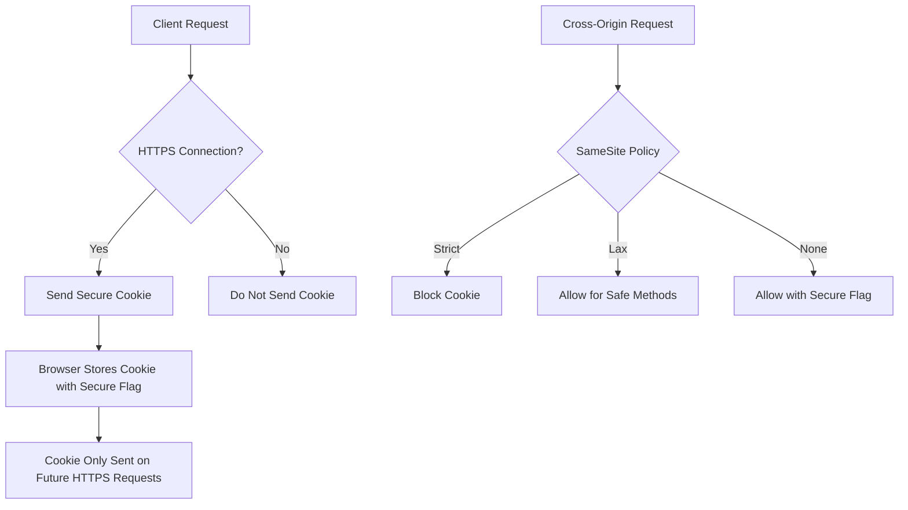
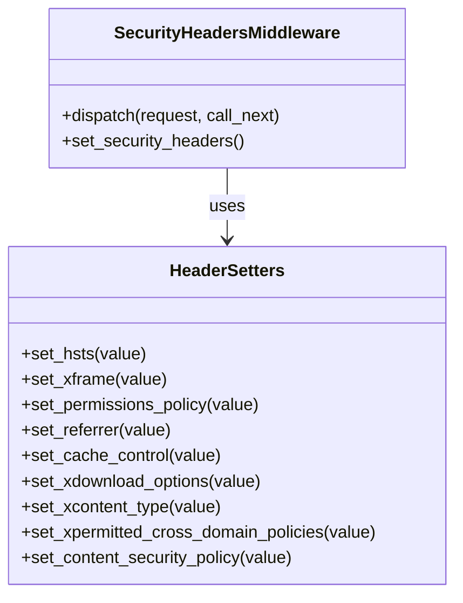
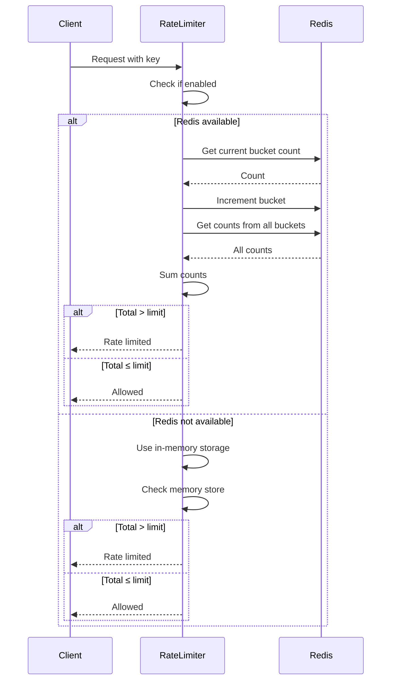
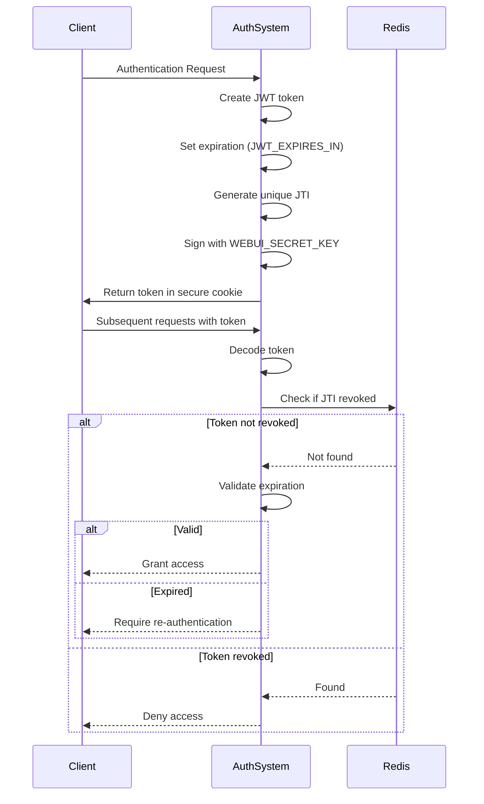
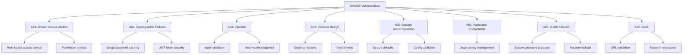

# Security Configuration

<cite>
**Referenced Files in This Document**   
- [.env.example](file://.env.example)
- [run.sh](file://run.sh)
- [setup.sh](file://setup.sh)
- [backend/open_webui/config.py](file://backend/open_webui/config.py)
- [backend/open_webui/env.py](file://backend/open_webui/env.py)
- [backend/open_webui/utils/security_headers.py](file://backend/open_webui/utils/security_headers.py)
- [backend/open_webui/utils/middleware.py](file://backend/open_webui/utils/middleware.py)
- [backend/open_webui/utils/auth.py](file://backend/open_webui/utils/auth.py)
- [backend/open_webui/utils/rate_limit.py](file://backend/open_webui/utils/rate_limit.py)
- [backend/open_webui/main.py](file://backend/open_webui/main.py)
- [Dockerfile](file://Dockerfile)
</cite>

## Table of Contents
1. [Introduction](#introduction)
2. [HTTPS Enforcement](#https-enforcement)
3. [Secure Cookie Settings](#secure-cookie-settings)
4. [HTTP Security Headers](#http-security-headers)
5. [Environment Variable Security](#environment-variable-security)
6. [Rate Limiting Strategies](#rate-limiting-strategies)
7. [Access Logging and Log Rotation](#access-logging-and-log-rotation)
8. [Authentication Token Security](#authentication-token-security)
9. [Session Management](#session-management)
10. [OWASP Vulnerability Protection](#owasp-vulnerability-protection)
11. [Script Security Analysis](#script-security-analysis)
12. [Firewall and Intrusion Detection](#firewall-and-intrusion-detection)
13. [Security Audits](#security-audits)

## Introduction
This document provides comprehensive security configuration guidance for production deployments of open-webui. It covers critical security aspects including HTTPS enforcement, secure cookie settings, HTTP security headers, environment variable management, rate limiting, logging practices, authentication token security, session management, and protection against common OWASP vulnerabilities. The document also analyzes the security implications of deployment scripts and provides recommendations for firewall rules, intrusion detection, and regular security audits to ensure a robust security posture for open-webui deployments.

## HTTPS Enforcement
open-webui enforces HTTPS through multiple configuration options and security headers. The system uses the HSTS (HTTP Strict Transport Security) header to ensure all communications occur over encrypted connections. This is configured through the `HSTS` environment variable, which sets the `Strict-Transport-Security` header with a default value of `max-age=31536000;includeSubDomains` if not properly formatted. The system validates the HSTS header format using a regular expression pattern that ensures only valid configurations are applied.

For production deployments, HTTPS should be enforced at the reverse proxy level (such as Nginx) in addition to the application-level configuration. The Dockerfile and deployment scripts are designed to work with HTTPS termination at the proxy level, allowing the application to focus on implementing proper security headers and secure communication practices.

When deploying open-webui in production, ensure that your reverse proxy is configured to:
- Terminate SSL/TLS connections with strong cipher suites
- Redirect all HTTP traffic to HTTPS
- Implement proper certificate management with automated renewal
- Use modern TLS versions (1.2 or higher) while disabling older, insecure versions

The application's security middleware automatically applies the HSTS header when configured, providing an additional layer of protection against downgrade attacks and ensuring that browsers will only connect via HTTPS for the specified duration.

**Section sources**
- [backend/open_webui/utils/security_headers.py](file://backend/open_webui/utils/security_headers.py#L62-L68)
- [Dockerfile](file://Dockerfile#L70-L71)

## Secure Cookie Settings
open-webui implements secure cookie settings through configurable environment variables that control cookie behavior for both session and authentication cookies. The system provides separate configuration options for session cookies and authentication cookies, allowing for fine-grained control over cookie security attributes.

The `WEBUI_SESSION_COOKIE_SECURE` environment variable controls whether session cookies are marked as secure, restricting them to HTTPS connections only. By default, this is set to `false`, but for production deployments, it should be explicitly set to `true` to ensure cookies are only transmitted over encrypted connections.

Similarly, the `WEBUI_AUTH_COOKIE_SECURE` environment variable controls the secure flag for authentication cookies, with a default fallback to the session cookie setting. Both cookies also support the `SameSite` attribute, configurable via `WEBUI_SESSION_COOKIE_SAME_SITE` and `WEBUI_AUTH_COOKIE_SAME_SITE`, with a default value of `lax` which provides a good balance between security and usability.

For maximum security in production environments, configure the following settings:
- Set `WEBUI_SESSION_COOKIE_SECURE` to `true`
- Set `WEBUI_AUTH_COOKIE_SECURE` to `true`
- Use `Strict` for `SameSite` policy if your application flow allows it
- Ensure cookies are scoped to the appropriate domain and path

These settings prevent cookie transmission over unencrypted connections and mitigate cross-site request forgery (CSRF) attacks by controlling when cookies are sent with cross-origin requests.

**Diagram sources**
- [backend/open_webui/env.py](file://backend/open_webui/env.py#L462-L478)
- [backend/open_webui/utils/security_headers.py](file://backend/open_webui/utils/security_headers.py#L59)

## HTTP Security Headers
open-webui implements a comprehensive set of HTTP security headers through its `SecurityHeadersMiddleware` class, which automatically applies security headers based on environment variable configuration. The system supports multiple security headers that protect against common web vulnerabilities.

The security headers are configured through specific environment variables:
- `CACHE_CONTROL`: Controls browser and intermediary caching behavior
- `HSTS`: Enforces HTTPS connections with configurable max-age and options
- `PERMISSIONS_POLICY`: Restricts browser features and APIs
- `REFERRER_POLICY`: Controls referrer information leakage
- `X-CONTENT-TYPE-OPTIONS`: Prevents MIME type sniffing
- `X-FRAME-OPTIONS`: Protects against clickjacking attacks
- `CONTENT-SECURITY-POLICY`: Mitigates cross-site scripting (XSS) attacks

The `X-Frame-Options` header is particularly important for preventing clickjacking attacks, with the system defaulting to `DENY` if the provided value is not `DENY` or `SAMEORIGIN`. This ensures that the application cannot be embedded in frames from other domains, protecting against UI redress attacks.

The `Content-Security-Policy` header allows defining a whitelist of trusted sources for various content types, helping to prevent XSS attacks by restricting where scripts, styles, images, and other resources can be loaded from. While the system allows custom CSP configuration, it's recommended to implement a strict policy in production that only allows resources from trusted domains.

**Diagram sources**
- [backend/open_webui/utils/security_headers.py](file://backend/open_webui/utils/security_headers.py#L9-L134)
- [backend/open_webui/main.py](file://backend/open_webui/main.py#L511)

## Environment Variable Security
open-webui uses environment variables extensively for configuration, with particular attention to security-sensitive settings. The `.env.example` file provides a template for environment configuration, highlighting critical security variables that should be properly set in production.

Key security-related environment variables include:
- `WEBUI_SECRET_KEY`: The primary secret key for JWT token generation and session management. This must be set to a strong, random value in production.
- `ENABLE_API_KEYS`: Controls whether API key authentication is enabled.
- `CORS_ALLOW_ORIGIN`: Configures cross-origin resource sharing, which should be restricted to specific domains in production rather than using wildcard (`*`).
- `FORWARDED_ALLOW_IPS`: Controls which IP addresses are trusted for forwarded headers, important when using reverse proxies.

The system implements validation for security headers and automatically applies sensible defaults when configurations are invalid. For example, the `HSTS` header defaults to `max-age=31536000;includeSubDomains` if not properly formatted, and `X-Frame-Options` defaults to `DENY` for maximum protection against clickjacking.

When configuring environment variables for production:
- Never commit `.env` files to version control
- Use strong, randomly generated values for secret keys
- Restrict CORS origins to specific domains rather than using wildcards
- Set appropriate values for security headers based on your deployment requirements
- Regularly rotate secret keys and API tokens

The Dockerfile also defines default environment variables for security settings, including `SCARF_NO_ANALYTICS=true`, `DO_NOT_TRACK=true`, and empty values for API keys and secret keys, emphasizing the need for proper configuration in production environments.

**Section sources**
- [.env.example](file://.env.example#L1-L22)
- [Dockerfile](file://Dockerfile#L74-L78)
- [backend/open_webui/env.py](file://backend/open_webui/env.py#L455-L461)

## Rate Limiting Strategies
open-webui implements rate limiting through a `RateLimiter` class that provides protection against abuse and denial-of-service attacks. The rate limiter uses a rolling window strategy and can operate with Redis for distributed rate limiting or fall back to in-memory storage when Redis is not available.

The rate limiting system is designed to be flexible and resilient:
- It supports both Redis and in-memory storage, with automatic fallback to memory if Redis is unavailable
- Uses a bucket-based approach with configurable window and bucket sizes
- Implements graceful degradation when Redis fails
- Provides methods to check if a request is rate-limited and to get the current usage count

The rate limiter divides the time window into smaller buckets to provide more granular control over request rates. This rolling window approach prevents burst attacks at window boundaries. The system calculates the total number of requests across all relevant buckets to determine if the rate limit has been exceeded.

For production deployments, rate limiting should be implemented at multiple levels:
- Application-level rate limiting using the built-in `RateLimiter`
- Reverse proxy-level rate limiting (e.g., Nginx) for additional protection
- Network-level rate limiting through firewalls or cloud security services

The rate limiter can be configured with different limits for different endpoints or user roles, allowing for fine-grained control over API usage. It's recommended to set appropriate rate limits based on expected usage patterns while being restrictive enough to prevent abuse.

**Diagram sources**
- [backend/open_webui/utils/rate_limit.py](file://backend/open_webui/utils/rate_limit.py#L6-L140)
- [backend/open_webui/main.py](file://backend/open_webui/main.py#L585-L592)

## Access Logging and Log Rotation
open-webui provides comprehensive access logging capabilities with configurable log rotation to maintain audit trails while managing disk space. The system supports audit logging with multiple configuration options for log file management and content.

Key logging configuration variables include:
- `AUDIT_LOGS_FILE_PATH`: Specifies the path for the audit log file, defaulting to `DATA_DIR/audit.log`
- `AUDIT_LOG_FILE_ROTATION_SIZE`: Sets the maximum size of a log file before rotation, defaulting to "10MB"
- `AUDIT_LOG_LEVEL`: Controls the level of detail in audit logs, with options for metadata, request, or request/response logging
- `AUDIT_EXCLUDED_PATHS`: Allows excluding specific paths from audit logging to reduce log volume

The system implements log rotation based on file size, automatically creating new log files when the current file reaches the specified size limit. This prevents log files from growing indefinitely and consuming excessive disk space. The rotated log files can be archived, compressed, or removed according to your organization's retention policies.

For production deployments, implement the following logging best practices:
- Store logs on a separate volume from application data to prevent disk exhaustion
- Implement automated log rotation and retention policies
- Forward logs to a centralized logging system for analysis and long-term storage
- Regularly review logs for suspicious activity or security incidents
- Protect log files with appropriate file permissions to prevent unauthorized access

The audit logging system can capture various levels of detail, from basic metadata to full request and response bodies (limited by `MAX_BODY_LOG_SIZE`). For security-sensitive environments, consider enabling detailed logging while ensuring proper protection of sensitive information in log entries.

**Section sources**
- [backend/open_webui/env.py](file://backend/open_webui/env.py#L776-L798)
- [backend/open_webui/main.py](file://backend/open_webui/main.py#L62)

## Authentication Token Security
open-webui implements robust authentication token security using JWT (JSON Web Tokens) with configurable expiration and revocation mechanisms. The system uses the `WEBUI_SECRET_KEY` as the signing key for JWT tokens, which must be kept confidential and set to a strong, random value in production.

Key token security features include:
- Configurable token expiration through `JWT_EXPIRES_IN`, with a default of "4w" (4 weeks)
- Automatic token revocation through Redis storage of revoked tokens
- JWT ID (jti) claims for unique token identification and revocation tracking
- Secure token storage in HTTP-only, secure cookies

The system warns when `JWT_EXPIRES_IN` is set to "-1" (infinite expiration), highlighting the security risk of tokens that never expire. For production deployments, use reasonable expiration times based on your security requirements and implement token refresh mechanisms as needed.

Token revocation is implemented using Redis to store revoked token identifiers with an expiration time matching the token's remaining lifetime. This allows efficient checking of token validity without requiring a database lookup for each request. When Redis is not available, the system falls back to stateless JWT validation, which means revoked tokens remain valid until they naturally expire.

Additional security measures include:
- API key authentication with `sk-` prefix detection
- Password hashing using bcrypt with automatic salt generation
- Password validation with configurable complexity requirements
- Protection against timing attacks in signature verification

For enhanced security, consider implementing:
- Shorter token expiration times with refresh token mechanisms
- Regular rotation of the `WEBUI_SECRET_KEY`
- Additional token binding to client characteristics
- Monitoring for suspicious token usage patterns

**Diagram sources**
- [backend/open_webui/utils/auth.py](file://backend/open_webui/utils/auth.py#L194-L252)
- [backend/open_webui/config.py](file://backend/open_webui/config.py#L314-L322)

## Session Management
open-webui implements secure session management through JWT-based authentication with configurable session properties and automatic user activity tracking. The system uses the `WEBUI_SECRET_KEY` for session token signing and provides options for controlling session cookie attributes.

Key session management features include:
- Configurable session cookie security attributes (secure, SameSite)
- Automatic update of user's last active timestamp on each authenticated request
- Support for API key authentication as an alternative to session cookies
- Integration with Redis for distributed session revocation

The system automatically updates a user's last active timestamp when they make authenticated requests, using background tasks to prevent blocking the main request flow. This allows for monitoring user activity and implementing idle timeout policies if needed.

Session cookies are configured with security-focused defaults:
- `SameSite` policy set to "lax" by default, preventing CSRF attacks while allowing necessary cross-site requests
- Option to set `Secure` flag to ensure cookies are only transmitted over HTTPS
- Configurable through environment variables for both session and authentication cookies

For production deployments, ensure proper session management by:
- Setting appropriate session expiration times
- Implementing session invalidation on password changes or suspicious activity
- Monitoring for concurrent sessions from multiple locations
- Regularly auditing active sessions for unusual patterns

The system also supports OAuth integration with configurable session management, including options for ID token cookies and client information encryption using the `WEBUI_SECRET_KEY` or dedicated encryption keys.

**Section sources**
- [backend/open_webui/utils/auth.py](file://backend/open_webui/utils/auth.py#L345-L349)
- [backend/open_webui/env.py](file://backend/open_webui/env.py#L462-L478)

## OWASP Vulnerability Protection
open-webui implements multiple protections against common OWASP vulnerabilities through its security middleware, input validation, and secure configuration defaults. The system addresses several top OWASP risks with specific countermeasures.

For OWASP Top 10 2021 protections:
- **A01:2021-Broken Access Control**: Implemented through role-based access control, permission checks, and model access control bypass configuration
- **A02:2021-Cryptographic Failures**: Addressed with secure password hashing (bcrypt), JWT token security, and HTTPS enforcement
- **A03:2021-Injection**: Mitigated through proper input validation, parameterized database queries, and secure deserialization practices
- **A04:2021-Insecure Design**: Countermeasures include security headers, rate limiting, and secure default configurations
- **A05:2021-Security Misconfiguration**: Protected through secure defaults, environment variable validation, and configuration management
- **A06:2021-Vulnerable and Outdated Components**: Addressed via dependency management and version tracking
- **A07:2021-Identification and Authentication Failures**: Handled with secure password practices, multi-factor authentication support, and account lockout mechanisms
- **A10:2021-Server-Side Request Forgery (SSRF)**: Prevented through URL validation, restricted network access, and proxy configuration

Specific protections include:
- Content Security Policy to mitigate XSS attacks
- X-Frame-Options to prevent clickjacking
- X-Content-Type-Options to prevent MIME sniffing
- Rate limiting to prevent abuse and denial of service
- Input validation for passwords and other user inputs
- Secure session management with configurable expiration

The system also includes protections against specific vulnerabilities:
- CSRF protection through SameSite cookie attributes and potential token-based mechanisms
- Clickjacking prevention via X-Frame-Options header
- Information disclosure prevention through error handling and security headers
- Path traversal protection in file operations
- Command injection prevention in system interactions

For comprehensive protection, combine application-level security controls with infrastructure-level protections such as web application firewalls, intrusion detection systems, and regular security testing.

**Diagram sources**
- [backend/open_webui/utils/security_headers.py](file://backend/open_webui/utils/security_headers.py#L40-L50)
- [backend/open_webui/utils/auth.py](file://backend/open_webui/utils/auth.py#L163-L165)
- [backend/open_webui/utils/rate_limit.py](file://backend/open_webui/utils/rate_limit.py#L6-L140)

## Script Security Analysis
The open-webui repository includes several scripts that handle deployment and setup operations, each with specific security considerations. The `run.sh` and `setup.sh` scripts implement various security practices to ensure secure deployment and configuration.

The `run.sh` script handles containerized deployment with the following security characteristics:
- Builds a Docker image with a specified name and tag
- Stops and removes any existing container with the same name before starting a new one
- Runs the container with host networking access (`--add-host=host.docker.internal:host-gateway`)
- Mounts a named volume for persistent data storage
- Configures the container to restart automatically
- Prunes unused Docker images after deployment

Security considerations for `run.sh`:
- The script uses a named volume for data persistence, which helps protect data from container lifecycle events
- Automatic container restart ensures service availability but should be combined with proper monitoring
- Host networking access should be carefully considered in multi-tenant environments
- Image pruning helps reduce disk usage but should be balanced with rollback requirements

The `setup.sh` script implements a comprehensive setup process for AI software engineering methodology with several security features:
- Validates the presence of a git repository before proceeding
- Handles existing configuration with backup and overwrite options
- Downloads template files from a trusted GitHub repository
- Customizes configuration files with project-specific information
- Merges .gitignore intelligently to include security-relevant entries
- Creates a git commit with detailed change information

Security aspects of `setup.sh`:
- Input validation for project configuration
- Secure handling of existing configurations with backup creation
- Download of templates from a verified source (GitHub)
- Proper git integration for version control of security configurations
- Creation of .gitignore entries for sensitive files like `.env`

Both scripts follow security best practices by:
- Using descriptive variable names
- Implementing error handling with `set -e`
- Providing clear user feedback with colored output
- Validating inputs and conditions before proceeding
- Creating backups of existing configurations

For production use, consider enhancing these scripts with:
- Additional input validation and sanitization
- More granular control over container security settings
- Integration with secret management systems
- Automated security scanning of deployed components
- Detailed logging of deployment activities for audit purposes

**Section sources**
- [run.sh](file://run.sh#L1-L20)
- [setup.sh](file://setup.sh#L1-L277)

## Firewall and Intrusion Detection
For production deployments of open-webui, implementing robust firewall rules and intrusion detection systems is essential to protect against network-based attacks and unauthorized access. While the application implements various security controls, network-level protections provide an additional layer of defense.

Recommended firewall rules:
- Allow inbound traffic only on necessary ports (typically 443 for HTTPS)
- Block direct access to the application container port (8080) from external networks
- Restrict access to the Ollama API endpoint to only the open-webui backend
- Implement egress filtering to control outbound connections from the application
- Use network segmentation to isolate the application from other systems

Specific firewall configuration should include:
- Rate limiting at the network level to prevent brute force attacks
- Blocking known malicious IP addresses and ranges
- Restricting access to administrative interfaces to specific IP ranges
- Monitoring for unusual connection patterns or port scanning activities

For intrusion detection, consider implementing:
- Network-based intrusion detection systems (NIDS) to monitor traffic for attack patterns
- Host-based intrusion detection systems (HIDS) to monitor system calls and file integrity
- Log analysis tools to detect suspicious authentication attempts or access patterns
- File integrity monitoring for critical application files and configurations
- Behavioral analysis to identify anomalous user or system behavior

Integration with security information and event management (SIEM) systems can provide centralized monitoring and alerting. Configure alerts for:
- Multiple failed authentication attempts
- Unusual access times or locations
- High request rates from single sources
- Access to sensitive endpoints or functionality
- Changes to user roles or permissions

Additionally, consider implementing web application firewall (WAF) rules to protect against common web attacks such as:
- SQL injection attempts
- Cross-site scripting (XSS) payloads
- Path traversal attempts
- Remote code execution patterns
- Server-side request forgery (SSRF) attempts

Regularly review firewall and intrusion detection logs to identify potential threats and adjust rules as needed based on evolving threat intelligence.

## Security Audits
Regular security audits are critical for maintaining the security posture of open-webui production deployments. A comprehensive audit program should include both automated scanning and manual review processes to identify and address potential vulnerabilities.

Key components of a security audit program:
- **Configuration Review**: Regularly audit environment variables, security headers, and application settings to ensure they align with security policies
- **Dependency Scanning**: Use tools to identify vulnerable dependencies in both Python and JavaScript components
- **Static Code Analysis**: Perform automated code reviews to detect security anti-patterns and vulnerabilities
- **Dynamic Application Testing**: Conduct penetration testing to identify runtime vulnerabilities
- **Access Control Review**: Verify that role-based access controls are properly configured and enforced
- **Logging and Monitoring Audit**: Ensure audit logs are comprehensive, protected, and regularly reviewed

Recommended audit frequency:
- Automated scans: Continuous or daily
- Configuration reviews: Weekly or after significant changes
- Penetration testing: Quarterly or after major releases
- Comprehensive security assessments: Annually

Specific areas to audit in open-webui deployments:
- Verify that `WEBUI_SECRET_KEY` is set to a strong, random value and rotated periodically
- Confirm that HTTPS is properly enforced with valid certificates
- Check that security headers (HSTS, CSP, X-Frame-Options) are correctly configured
- Validate that rate limiting is effective and appropriately configured
- Review user roles and permissions to ensure least privilege principles
- Examine audit logs for signs of suspicious activity
- Verify backup and recovery procedures for security configurations

Document audit findings and track remediation efforts to ensure vulnerabilities are addressed promptly. Maintain an inventory of security controls and their effectiveness, updating it as the system evolves. Share audit results with relevant stakeholders to promote security awareness and continuous improvement.