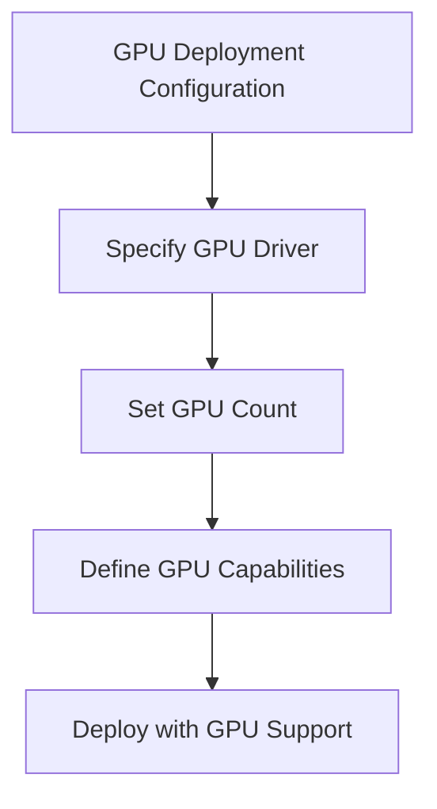
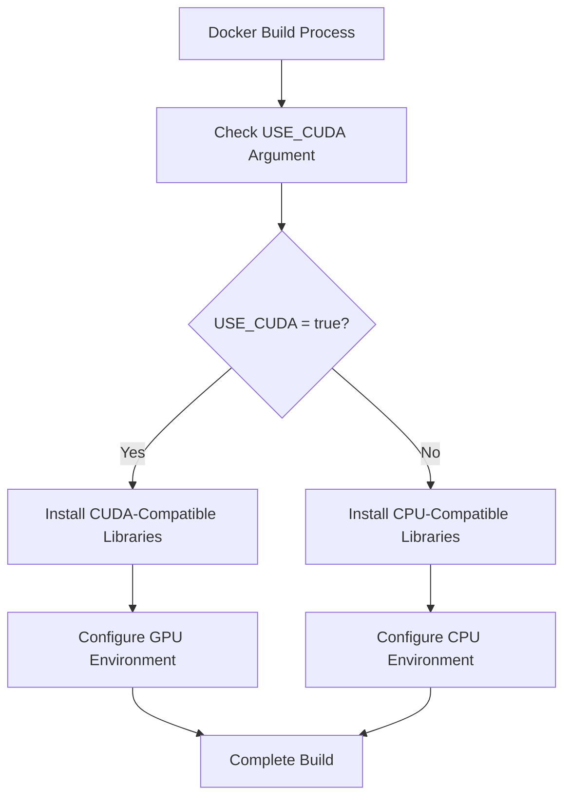
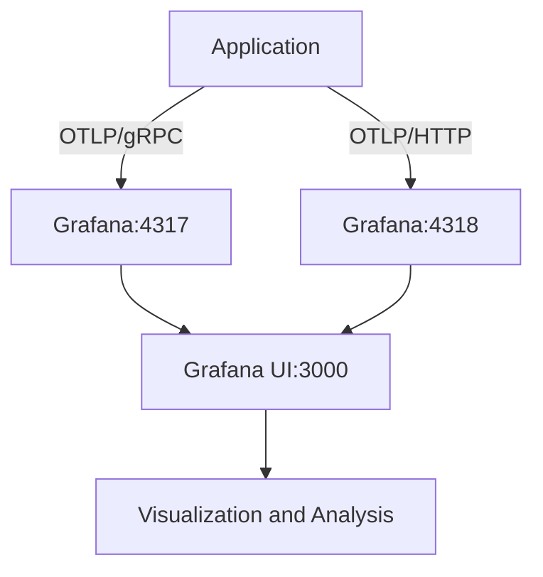
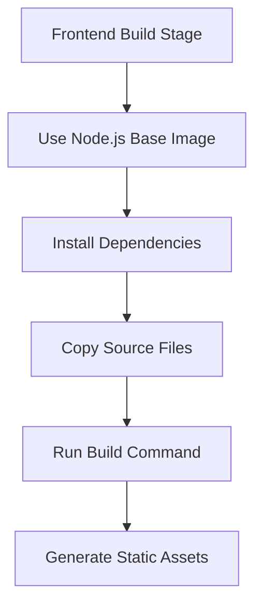
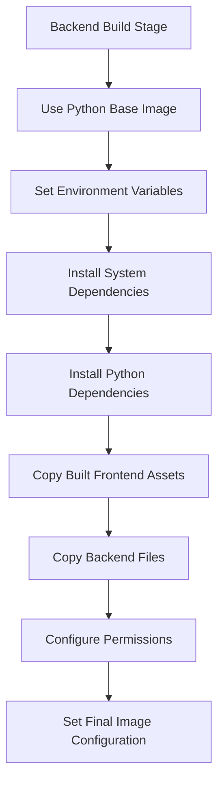
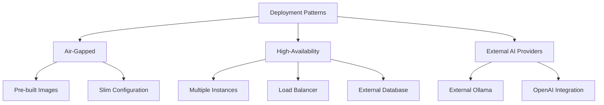
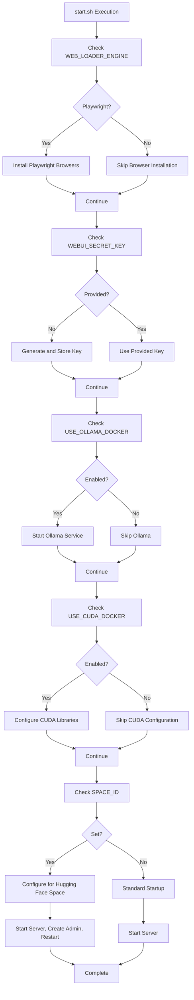
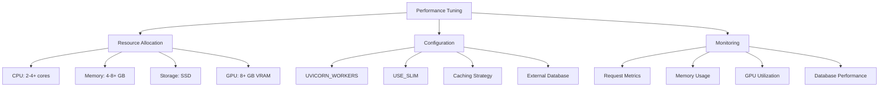

# Advanced Deployment Scenarios

<cite>
**Referenced Files in This Document**   
- [Dockerfile](file://Dockerfile)
- [docker-compose.gpu.yaml](file://docker-compose.gpu.yaml)
- [docker-compose.otel.yaml](file://docker-compose.otel.yaml)
- [docker-compose.yaml](file://docker-compose.yaml)
- [docker-compose.api.yaml](file://docker-compose.api.yaml)
- [docker-compose.data.yaml](file://docker-compose.data.yaml)
- [docker-compose.amdgpu.yaml](file://docker-compose.amdgpu.yaml)
- [backend/start.sh](file://backend/start.sh)
- [run-compose.sh](file://run-compose.sh)
- [run-ollama-docker.sh](file://run-ollama-docker.sh)
- [run.sh](file://run.sh)
</cite>

## Table of Contents
1. [Introduction](#introduction)
2. [GPU-Accelerated Deployment](#gpu-accelerated-deployment)
3. [OpenTelemetry Integration](#opentelemetry-integration)
4. [Docker Build Process](#docker-build-process)
5. [Specialized Deployment Patterns](#specialized-deployment-patterns)
6. [Customization of start.sh](#customization-of-startsh)
7. [Performance Tuning and Resource Allocation](#performance-tuning-and-resource-allocation)
8. [Conclusion](#conclusion)

## Introduction
This document provides comprehensive guidance on advanced deployment scenarios for open-webui, focusing on GPU-accelerated deployment, observability through OpenTelemetry, and specialized deployment patterns. The documentation covers the build process in Dockerfile, including multi-stage builds and build-time variables, as well as customization of the start.sh script for pre-launch configuration and health checks. The goal is to provide a detailed reference for deploying open-webui in production environments with optimal performance and reliability.

## GPU-Accelerated Deployment

open-webui supports GPU-accelerated deployment through Docker Compose configuration files and Docker build arguments. The deployment leverages GPU resources for enhanced performance in AI model processing and inference tasks.

The primary mechanism for GPU acceleration is through the `docker-compose.gpu.yaml` file, which configures GPU device reservations for the Ollama service. This configuration uses Docker's deploy resources feature to specify GPU device requirements:



**Diagram sources**
- [docker-compose.gpu.yaml](file://docker-compose.gpu.yaml#L1-L12)

The Docker build process supports GPU acceleration through build arguments such as `USE_CUDA` and `USE_OLLAMA`. When `USE_CUDA` is set to true, the build process installs CUDA-compatible versions of PyTorch and related libraries, enabling GPU acceleration for deep learning models:



For AMD GPU support, the repository provides a specialized `docker-compose.amdgpu.yaml` file that configures the necessary devices and environment variables for AMD GPU acceleration. This configuration maps AMD-specific devices (`/dev/kfd` and `/dev/dri`) into the container and sets the appropriate environment variables for ROCm support.

**Section sources**
- [Dockerfile](file://Dockerfile#L4-9)
- [docker-compose.gpu.yaml](file://docker-compose.gpu.yaml#L1-L12)
- [docker-compose.amdgpu.yaml](file://docker-compose.amdgpu.yaml#L1-L8)

## OpenTelemetry Integration

open-webui integrates with OpenTelemetry for comprehensive observability, enabling monitoring, tracing, and metrics collection for the application. The integration is configured through the `docker-compose.otel.yaml` file, which sets up a complete observability stack with Grafana as the visualization and analysis platform.

The OpenTelemetry configuration deploys a Grafana container with the OTel-LGTM (Logs, Metrics, Traces, Metrics) stack, providing a unified interface for monitoring application performance and behavior. The configuration exposes the necessary ports for OTLP (OpenTelemetry Protocol) ingestion over both gRPC and HTTP:



**Diagram sources**
- [docker-compose.otel.yaml](file://docker-compose.otel.yaml#L1-L36)

The application container is configured with environment variables to enable OpenTelemetry instrumentation and specify the export endpoint. Key environment variables include:

- `ENABLE_OTEL=true`: Enables OpenTelemetry instrumentation
- `ENABLE_OTEL_METRICS=true`: Enables metrics collection
- `OTEL_EXPORTER_OTLP_INSECURE=true`: Configures insecure connection for OTLP (for development)
- `OTEL_EXPORTER_OTLP_ENDPOINT=http://grafana:4317`: Specifies the OTLP endpoint
- `OTEL_SERVICE_NAME=airis`: Sets the service name for telemetry data

The integration allows for detailed monitoring of application performance, including request tracing, metric collection, and log aggregation. This enables operators to identify performance bottlenecks, troubleshoot issues, and optimize resource utilization.

**Section sources**
- [docker-compose.otel.yaml](file://docker-compose.otel.yaml#L1-L36)
- [Dockerfile](file://Dockerfile#L74-L78)

## Docker Build Process

The Docker build process for open-webui is implemented in the Dockerfile and follows a multi-stage build pattern to optimize image size and build efficiency. The process consists of two main stages: frontend build and backend build.

The frontend build stage uses a Node.js base image to compile the Svelte frontend application. This stage installs dependencies, copies source files, and runs the build command to generate optimized static assets:



**Diagram sources**
- [Dockerfile](file://Dockerfile#L26-L43)

The backend build stage uses a Python base image and incorporates the built frontend assets. This stage installs Python dependencies, configures environment variables, and sets up the application runtime environment. The multi-stage build pattern allows the final image to include only the necessary runtime components, significantly reducing image size.

The build process supports several build-time variables that customize the resulting image:

- `USE_CUDA`: Enables CUDA support for GPU acceleration
- `USE_OLLAMA`: Installs and configures Ollama within the container
- `USE_SLIM`: Creates a slim version of the image
- `USE_PERMISSION_HARDENING`: Applies security hardening for OpenShift environments
- `USE_EMBEDDING_MODEL`: Specifies the sentence transformer model for embeddings
- `USE_RERANKING_MODEL`: Specifies the model for reranking results
- `BUILD_HASH`: Sets the build version identifier

The build process also includes optimization techniques such as layer caching, minimal package installation, and cleanup of temporary files. The use of `--no-cache-dir` flags for pip and uv installations prevents caching within the image, reducing final image size.



**Diagram sources**
- [Dockerfile](file://Dockerfile#L45-L192)

**Section sources**
- [Dockerfile](file://Dockerfile#L1-L192)

## Specialized Deployment Patterns

open-webui supports several specialized deployment patterns to accommodate different operational requirements and environments. These patterns are implemented through modular Docker Compose configuration files that can be combined as needed.

### Air-Gapped Environments
For air-gapped environments where internet access is restricted, the deployment can be configured to use pre-downloaded models and dependencies. The build process can be executed in an environment with internet access, and the resulting images can be transferred to the air-gapped environment for deployment. The `USE_SLIM` build argument can be used to create a minimal image that excludes unnecessary components.

### High-Availability Setups
High-availability deployments can be achieved by combining multiple instances of the open-webui service behind a load balancer. The stateless nature of the application allows for horizontal scaling, while external databases (such as PostgreSQL) provide persistent storage that can be shared across instances. The `docker-compose.yaml` file includes a PostgreSQL service that can be externalized for high-availability database configurations.

### External AI Provider Integration
The deployment supports integration with external AI providers through configuration options. The `OLLAMA_BASE_URL` environment variable can be set to point to an external Ollama instance, allowing the web interface to connect to AI models hosted elsewhere. Similarly, the `OPENAI_API_BASE_URL` and `OPENAI_API_KEY` variables enable integration with OpenAI services.

The modular Docker Compose architecture allows these patterns to be combined through the use of multiple compose files. For example, a high-availability setup with external AI providers can be deployed using:

```bash
docker compose -f docker-compose.yaml -f docker-compose.api.yaml up -d
```

This approach enables flexible configuration without requiring custom compose files for each deployment scenario.



**Section sources**
- [docker-compose.yaml](file://docker-compose.yaml#L1-L60)
- [docker-compose.api.yaml](file://docker-compose.api.yaml#L1-L6)
- [run-compose.sh](file://run-compose.sh#L1-L251)

## Customization of start.sh

The `start.sh` script serves as the entry point for the open-webui container and provides extensive customization options for pre-launch configuration and health checks. The script handles various initialization tasks and environment-specific configurations.

Key functionalities of the start.sh script include:

- **Playwright Browser Installation**: When the `WEB_LOADER_ENGINE` is set to "playwright", the script installs the necessary Chromium browser components for web scraping functionality.
- **Secret Key Management**: The script generates and manages the `WEBUI_SECRET_KEY` if not provided through environment variables, storing it in a file for persistence across container restarts.
- **Ollama Service Management**: When `USE_OLLAMA_DOCKER` is enabled, the script starts the Ollama service as a background process within the container.
- **CUDA Environment Configuration**: When `USE_CUDA_DOCKER` is enabled, the script configures the `LD_LIBRARY_PATH` to include CUDA libraries for GPU acceleration.
- **Hugging Face Space Configuration**: The script supports deployment on Hugging Face Spaces by automatically creating an admin user when `SPACE_ID` is set.

The script also implements health checks and startup sequencing, particularly for Hugging Face Space deployments. It starts the web server, waits for it to become responsive, creates the admin user via API calls, and then restarts the server with the configured user.



**Diagram sources**
- [backend/start.sh](file://backend/start.sh#L1-L87)

**Section sources**
- [backend/start.sh](file://backend/start.sh#L1-L87)

## Performance Tuning and Resource Allocation

Effective performance tuning and resource allocation are critical for production deployments of open-webui. The following recommendations provide guidance for optimizing the application's performance and resource utilization.

### Resource Allocation Guidelines
- **CPU**: Allocate at least 2 cores for moderate workloads, scaling to 4+ cores for high-concurrency scenarios
- **Memory**: Allocate a minimum of 4GB RAM, with 8GB+ recommended for GPU-accelerated deployments
- **Storage**: Use SSD storage for the data volume to ensure fast access to cached models and embeddings
- **GPU**: For GPU-accelerated deployments, allocate appropriate VRAM based on model requirements (minimum 8GB recommended)

### Configuration Recommendations
- **UVICORN_WORKERS**: Set this environment variable to match the number of CPU cores for optimal concurrency handling
- **USE_SLIM**: Use the slim build option in resource-constrained environments to reduce memory footprint
- **Caching**: Ensure adequate storage is allocated for model caching in the `/app/backend/data/cache` directory
- **Database**: Use an external PostgreSQL instance for production deployments to ensure data persistence and performance

### Monitoring and Optimization
The OpenTelemetry integration provides valuable insights for performance optimization. Key metrics to monitor include:
- Request latency and throughput
- Memory usage patterns
- GPU utilization (for GPU-accelerated deployments)
- Database query performance

The `run-compose.sh` script provides a convenient interface for configuring resource allocation, including GPU count, API port, and web UI port. This script automates the selection of appropriate compose files based on the desired configuration, simplifying deployment setup.



**Section sources**
- [Dockerfile](file://Dockerfile#L21-L23)
- [backend/start.sh](file://backend/start.sh#L73-L80)
- [run-compose.sh](file://run-compose.sh#L98-L104)

## Conclusion
This document has provided comprehensive coverage of advanced deployment scenarios for open-webui, including GPU-accelerated deployment, OpenTelemetry integration, Docker build processes, specialized deployment patterns, start.sh customization, and performance tuning recommendations. The modular architecture of the deployment configuration enables flexible adaptation to various operational requirements, from air-gapped environments to high-availability setups. By following the guidelines outlined in this document, operators can deploy open-webui in production environments with confidence in performance, reliability, and maintainability.