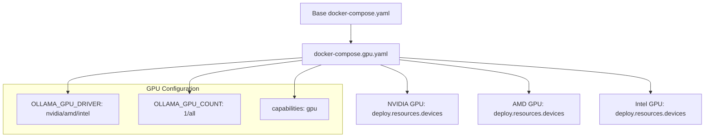
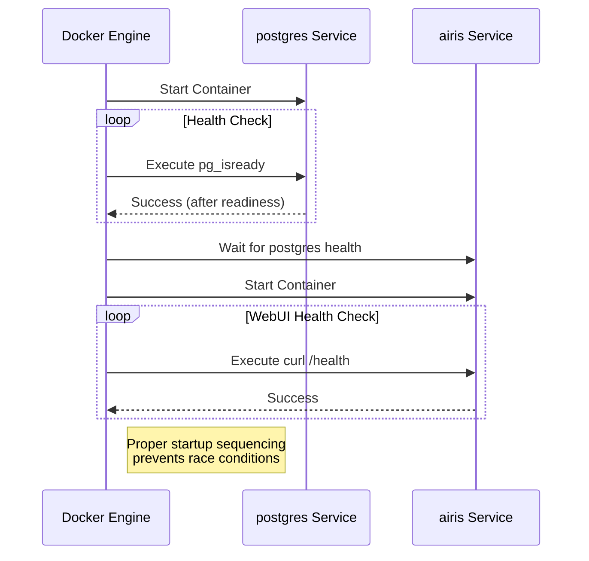
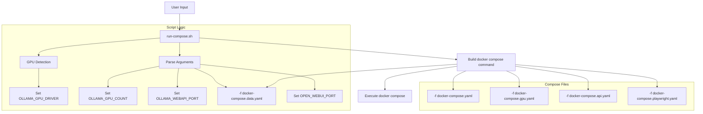

# Docker Configuration

<cite>
**Referenced Files in This Document**   
- [docker-compose.yaml](file://docker-compose.yaml)
- [docker-compose.gpu.yaml](file://docker-compose.gpu.yaml)
- [docker-compose.api.yaml](file://docker-compose.api.yaml)
- [docker-compose.data.yaml](file://docker-compose.data.yaml)
- [docker-compose.otel.yaml](file://docker-compose.otel.yaml)
- [docker-compose.a1111-test.yaml](file://docker-compose.a1111-test.yaml)
- [docker-compose.amdgpu.yaml](file://docker-compose.amdgpu.yaml)
- [Dockerfile](file://Dockerfile)
- [run-compose.sh](file://run-compose.sh)
- [backend/start.sh](file://backend/start.sh)
- [.env.example](file://.env.example)
</cite>

## Table of Contents
1. [Introduction](#introduction)
2. [Core Service Definitions](#core-service-definitions)
3. [Specialized Compose Files](#specialized-compose-files)
4. [Network and Dependency Configuration](#network-and-dependency-configuration)
5. [Health Checks and Service Readiness](#health-checks-and-service-readiness)
6. [Configuration Extension Mechanisms](#configuration-extension-mechanisms)
7. [Best Practices for Multi-Environment Deployments](#best-practices-for-multi-environment-deployments)
8. [Custom Deployment Merging Strategies](#custom-deployment-merging-strategies)
9. [Conclusion](#conclusion)

## Introduction

The open-webui project utilizes a modular Docker Compose configuration system that enables flexible deployment options for different environments and requirements. The architecture centers around three primary services: the webui interface, PostgreSQL database, and optional Ollama inference server. This documentation provides comprehensive guidance on the service definitions, specialized configuration files, network setup, and extension mechanisms that allow users to customize their deployments for various use cases including GPU acceleration, external API access, and persistent data storage.

**Section sources**
- [docker-compose.yaml](file://docker-compose.yaml#L1-L60)
- [README.md](file://README.md#L1-L27)

## Core Service Definitions

The main `docker-compose.yaml` file defines the essential services required for the open-webui application. The configuration includes three key components: the PostgreSQL database, the webui application, and commented-out Ollama service configuration.

The **postgres** service uses the `postgres:16-alpine` image and is configured with environment variables for database credentials that can be overridden via environment variables with default values. It exposes port 5432 (configurable via `POSTGRES_PORT`) and mounts a named volume `postgres-data` for data persistence. The service includes a health check that verifies database readiness using `pg_isready`.

The **airis** service (webui) is built from the project's Dockerfile and can pull a pre-built image from GHCR. It exposes port 3000 (configurable via `OPEN_WEBUI_PORT`) mapped to container port 8080. The service depends on the postgres database and waits for it to be healthy before starting. It mounts a named volume `airis` to `/app/backend/data` for application data persistence and receives database connection details through environment variables.

The Ollama service is commented out in the base configuration, allowing users to selectively enable it through specialized compose files. This modular approach provides flexibility in deployment scenarios.

```mermaid
graph TD
subgraph "open-webui Stack"
WebUI[airis WebUI Service]
Postgres[postgres Database Service]
Ollama[Ollama Service<br>(Optional)]
end
WebUI --> Postgres
WebUI --> Ollama
Postgres -.-> HealthCheck["Health Check: pg_isready"]
WebUI -.-> HealthCheck["Health Check: HTTP /health"]
style WebUI fill:#4C82AF,stroke:#333
style Postgres fill:#336699,stroke:#333
style Ollama fill:#669966,stroke:#333
```

**Diagram sources**
- [docker-compose.yaml](file://docker-compose.yaml#L11-L59)

**Section sources**
- [docker-compose.yaml](file://docker-compose.yaml#L11-L59)
- [Dockerfile](file://Dockerfile#L25-L192)

## Specialized Compose Files

The open-webui project provides several specialized Docker Compose files that extend the base configuration for specific use cases. These files are designed to be used as overlays with the main compose file using Docker Compose's multiple file merging capabilities.

### GPU Support Configuration

The `docker-compose.gpu.yaml` file enables GPU acceleration for the Ollama service by configuring device reservations in the container deployment. It specifies GPU resources with configurable driver (default: nvidia), count (default: 1), and capabilities. This configuration uses Docker's deploy resources syntax to reserve GPU devices for the container.



**Diagram sources**
- [docker-compose.gpu.yaml](file://docker-compose.gpu.yaml#L1-L12)

### External API Configuration

The `docker-compose.api.yaml` file exposes the Ollama API externally by mapping port 11434 (configurable via `OLLAMA_WEBAPI_PORT`) from the host to the container. This allows external applications to interact directly with the Ollama service without going through the webui interface.

### Data Persistence Configuration

The `docker-compose.data.yaml` file configures persistent storage for Ollama by mounting a host directory (configurable via `OLLAMA_DATA_DIR` with default `./ollama-data`) to `/root/.ollama` in the container. This ensures that downloaded models and other Ollama data persist across container restarts.

### AMD GPU Specific Configuration

The `docker-compose.amdgpu.yaml` file provides AMD-specific GPU configuration, including device mappings for `/dev/kfd` and `/dev/dri`, using the ROCm-enabled Ollama image tag, and setting the `HSA_OVERRIDE_GFX_VERSION` environment variable for compatibility with different AMD GPU architectures.

### Observability Configuration

The `docker-compose.otel.yaml` file configures OpenTelemetry integration with Grafana for monitoring and observability. It adds a Grafana container that receives telemetry data and configures the webui service to export metrics and traces to the Grafana instance.

### Integration Testing Configuration

The `docker-compose.a1111-test.yaml` file sets up a stable-diffusion-webui container for integration testing image generation capabilities. It configures the webui service to connect to this container for image generation functionality.

**Section sources**
- [docker-compose.gpu.yaml](file://docker-compose.gpu.yaml#L1-L12)
- [docker-compose.api.yaml](file://docker-compose.api.yaml#L1-L6)
- [docker-compose.data.yaml](file://docker-compose.data.yaml#L1-L5)
- [docker-compose.amdgpu.yaml](file://docker-compose.amdgpu.yaml#L1-L8)
- [docker-compose.otel.yaml](file://docker-compose.otel.yaml#L1-L36)
- [docker-compose.a1111-test.yaml](file://docker-compose.a1111-test.yaml#L1-L32)

## Network and Dependency Configuration

The Docker Compose configuration establishes a default network for service communication and defines explicit dependencies between services. The webui service depends on the postgres database service, with a health-based startup condition that ensures the database is fully ready before the webui starts.

The configuration uses Docker Compose's built-in DNS-based service discovery, allowing services to communicate using their service names as hostnames. The webui service connects to the postgres database using the hostname "postgres" and to Ollama using the hostname "ollama" when the service is enabled.

Network isolation is maintained by not exposing database ports to the host by default, while the webui interface and optional Ollama API are exposed on configurable ports. The configuration also includes `extra_hosts` to map `host.docker.internal` to the host gateway, enabling container access to services running on the host machine.

```mermaid
graph LR
Client[External Client] --> WebUI["airis:3000"]
Client --> OllamaAPI["ollama:11434<br>(if enabled)"]
subgraph "Docker Network"
WebUI[airis Service]
Postgres[postgres Service]
Ollama[ollama Service<br>(if enabled)]
end
WebUI --> Postgres
WebUI --> Ollama
WebUI --> Host["host.docker.internal"]
style WebUI fill:#4C82AF,stroke:#333
style Postgres fill:#336699,stroke:#333
style Ollama fill:#669966,stroke:#333
```

**Diagram sources**
- [docker-compose.yaml](file://docker-compose.yaml#L29-L40)
- [docker-compose.api.yaml](file://docker-compose.api.yaml#L4-L5)

**Section sources**
- [docker-compose.yaml](file://docker-compose.yaml#L29-L40)
- [docker-compose.api.yaml](file://docker-compose.api.yaml#L4-L5)

## Health Checks and Service Readiness

The configuration implements comprehensive health checks to ensure service reliability and proper startup sequencing. The postgres service includes a health check that uses `pg_isready` to verify database readiness, with configurable interval (10s), timeout (5s), and retry attempts (5).

The webui service inherits a health check from its Dockerfile that tests the `/health` endpoint using curl and jq to validate the response. This ensures that the application is fully initialized and responsive before being considered healthy.

The dependency configuration between services leverages these health checks to establish proper startup order. The webui service is configured with `depends_on: postgres: condition: service_healthy`, which prevents the webui from starting until the postgres service has passed its health check. This prevents race conditions and connection errors during application startup.



**Diagram sources**
- [docker-compose.yaml](file://docker-compose.yaml#L23-L27)
- [Dockerfile](file://Dockerfile#L172)

**Section sources**
- [docker-compose.yaml](file://docker-compose.yaml#L23-L27)
- [Dockerfile](file://Dockerfile#L172)

## Configuration Extension Mechanisms

The open-webui project employs Docker Compose's multiple file merging capabilities to provide flexible configuration extension. Users can combine the base `docker-compose.yaml` with one or more specialized files using the `-f` flag to create custom configurations.

The `run-compose.sh` script automates this extension mechanism, providing a user-friendly interface for enabling various features. The script detects GPU hardware, sets appropriate environment variables, and constructs the docker compose command with the necessary configuration files based on user options.

Key extension parameters include:
- `--enable-gpu[count=COUNT]`: Enables GPU support with specified count
- `--enable-api[port=PORT]`: Exposes Ollama API on specified port
- `--webui[port=PORT]`: Sets web interface port
- `--data[folder=PATH]`: Configures Ollama data directory
- `--playwright`: Enables Playwright support
- `--build`: Rebuilds Docker images

The script sets environment variables like `OLLAMA_GPU_DRIVER`, `OLLAMA_GPU_COUNT`, `OLLAMA_WEBAPI_PORT`, and `OLLAMA_DATA_DIR` that are referenced in the compose files, enabling dynamic configuration based on runtime conditions.



**Diagram sources**
- [run-compose.sh](file://run-compose.sh#L1-L251)

**Section sources**
- [run-compose.sh](file://run-compose.sh#L1-L251)
- [docker-compose.gpu.yaml](file://docker-compose.gpu.yaml#L1-L12)
- [docker-compose.api.yaml](file://docker-compose.api.yaml#L1-L6)
- [docker-compose.data.yaml](file://docker-compose.data.yaml#L1-L5)

## Best Practices for Multi-Environment Deployments

For effective management of multiple deployment environments, the following best practices are recommended:

1. **Environment-Specific Overrides**: Create environment-specific compose files (e.g., `docker-compose.prod.yaml`, `docker-compose.dev.yaml`) that extend the base configuration with environment-appropriate settings.

2. **Environment Variable Management**: Use `.env` files to manage environment-specific variables, with a `.env.example` file providing documentation of available options.

3. **Modular Configuration**: Leverage the existing modular compose file structure, combining only the necessary configuration files for each deployment scenario.

4. **GPU Detection Automation**: Utilize the `run-compose.sh` script's GPU detection capabilities to automatically configure GPU settings based on available hardware.

5. **Resource Management**: Configure appropriate resource limits and reservations, especially for GPU-enabled deployments, to ensure stable operation.

6. **Data Persistence Strategy**: Implement a consistent data persistence strategy across environments, using the `docker-compose.data.yaml` approach for production deployments.

7. **Security Configuration**: Ensure proper secret management using environment variables or Docker secrets, avoiding hardcoding sensitive information.

8. **Monitoring Integration**: Enable observability features in staging and production environments using the `docker-compose.otel.yaml` configuration.

**Section sources**
- [.env.example](file://.env.example)
- [run-compose.sh](file://run-compose.sh#L13-L49)
- [docker-compose.otel.yaml](file://docker-compose.otel.yaml#L1-L36)

## Custom Deployment Merging Strategies

When creating custom deployments, Docker Compose's configuration merging rules should be understood and leveraged:

1. **Service Merging**: When multiple files define the same service, Docker Compose merges the configurations, with later files overriding earlier ones. This allows selective modification of service properties.

2. **Array Element Merging**: For array properties like `ports`, `volumes`, and `environment`, elements are appended from multiple files, creating a union of all specified values.

3. **Strategic File Ordering**: The order of `-f` flags matters, with later files taking precedence. The recommended pattern is base configuration first, followed by feature-specific overlays.

4. **Conditional Inclusion**: Use shell scripts like `run-compose.sh` to conditionally include configuration files based on runtime conditions or user input.

5. **Environment Variable Interpolation**: Leverage Docker Compose's environment variable interpolation with default values (e.g., `${VAR-default}`) to create flexible, configurable templates.

6. **Validation and Testing**: Always validate merged configurations using `docker compose config` before deployment to ensure the expected configuration is produced.

Example of a custom deployment command combining multiple features:
```bash
./run-compose.sh --enable-gpu[count=all] --enable-api[port=11434] --webui[port=3000] --data[folder=./ollama-data] --build
```

This command would merge the base configuration with GPU, API exposure, data persistence, and rebuild options.

**Section sources**
- [run-compose.sh](file://run-compose.sh#L165-L202)
- [docker-compose.yaml](file://docker-compose.yaml#L1-L60)

## Conclusion

The open-webui Docker configuration provides a flexible, modular system for deploying the application in various environments and configurations. By leveraging Docker Compose's multiple file merging capabilities, the project offers specialized configuration files for GPU acceleration, external API access, data persistence, and other features that can be combined as needed. The `run-compose.sh` script simplifies complex configuration scenarios by automating GPU detection and command construction. This approach enables users to create tailored deployments that meet their specific requirements while maintaining a clean, maintainable configuration structure.