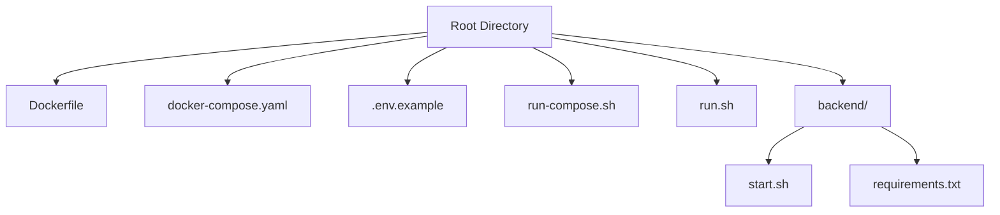
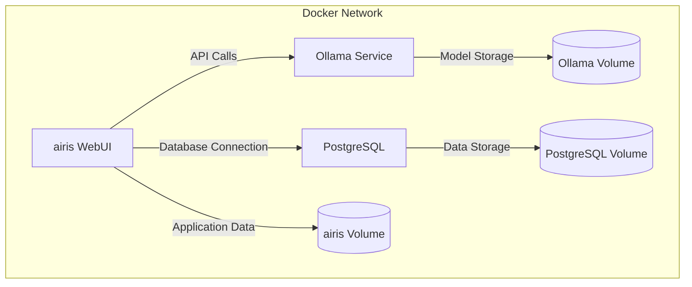
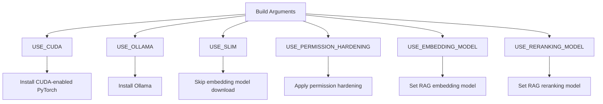
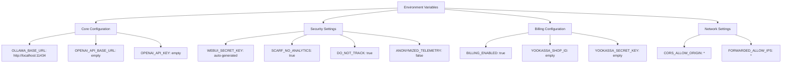
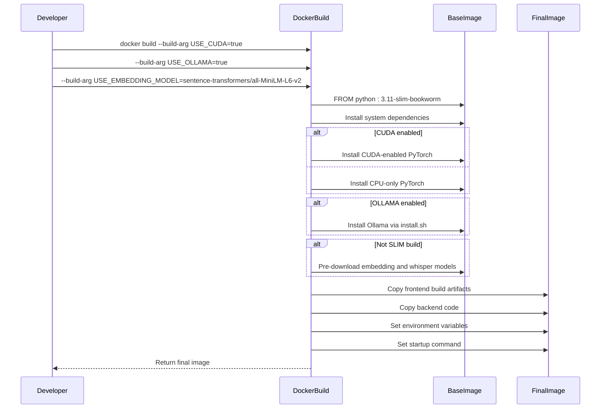
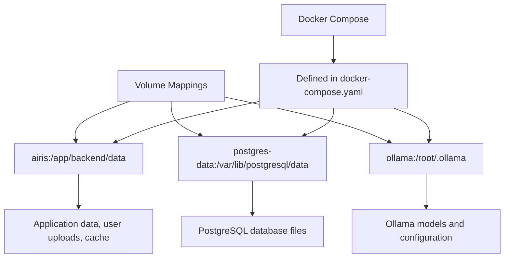
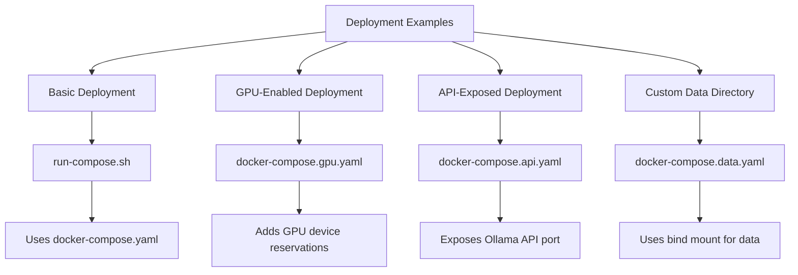

# Docker Installation

<cite>
**Referenced Files in This Document**   
- [Dockerfile](file://Dockerfile)
- [docker-compose.yaml](file://docker-compose.yaml)
- [.env.example](file://.env.example)
- [run-compose.sh](file://run-compose.sh)
- [run.sh](file://run.sh)
- [backend/start.sh](file://backend/start.sh)
- [backend/requirements.txt](file://backend/requirements.txt)
</cite>

## Table of Contents
1. [Introduction](#introduction)
2. [Project Structure](#project-structure)
3. [Core Components](#core-components)
4. [Architecture Overview](#architecture-overview)
5. [Detailed Component Analysis](#detailed-component-analysis)
6. [Dependency Analysis](#dependency-analysis)
7. [Performance Considerations](#performance-considerations)
8. [Troubleshooting Guide](#troubleshooting-guide)
9. [Conclusion](#conclusion)

## Introduction
This document provides comprehensive guidance for installing and running open-webui using Docker and docker-compose. It covers service configuration, environment variables, build processes, volume mappings, and deployment examples for both basic and GPU-enabled setups. The documentation also addresses common issues and performance optimization for production environments.

## Project Structure
The open-webui project is structured with a clear separation between frontend and backend components, along with comprehensive Docker configuration files. The main Docker-related files are located at the root directory, while the backend service is contained in the `backend/` directory.



**Diagram sources**
- [Dockerfile](file://Dockerfile)
- [docker-compose.yaml](file://docker-compose.yaml)
- [.env.example](file://.env.example)
- [run-compose.sh](file://run-compose.sh)
- [run.sh](file://run.sh)
- [backend/start.sh](file://backend/start.sh)

**Section sources**
- [Dockerfile](file://Dockerfile)
- [docker-compose.yaml](file://docker-compose.yaml)
- [.env.example](file://.env.example)

## Core Components
The Docker installation for open-webui consists of three main services: the webui (airis), PostgreSQL database, and optional Ollama service. The system uses Docker build arguments to customize the build process and environment variables for runtime configuration.

**Section sources**
- [Dockerfile](file://Dockerfile#L1-L192)
- [docker-compose.yaml](file://docker-compose.yaml#L1-L60)
- [.env.example](file://.env.example#L1-L22)

## Architecture Overview
The Docker architecture for open-webui follows a microservices pattern with clear separation of concerns. The webui service acts as the main application container, connecting to a PostgreSQL database for persistent storage and optionally integrating with Ollama for AI model serving.



**Diagram sources**
- [docker-compose.yaml](file://docker-compose.yaml#L1-L60)
- [Dockerfile](file://Dockerfile#L1-L192)

## Detailed Component Analysis

### Docker Build Configuration
The Docker build process is highly configurable through build arguments that enable various features and optimizations. These build arguments are defined in the Dockerfile and can be passed during the build process to customize the container image.



**Diagram sources**
- [Dockerfile](file://Dockerfile#L4-L16)

**Section sources**
- [Dockerfile](file://Dockerfile#L1-L192)

### Service Configuration in docker-compose.yaml
The docker-compose.yaml file defines the services required for open-webui, including the webui (airis), PostgreSQL database, and commented-out Ollama service. The configuration includes volume mappings, port configurations, and environment variables.

```mermaid
classDiagram
class PostgresService {
+image : postgres : 16-alpine
+container_name : airis-postgres
+environment : POSTGRES_DB, POSTGRES_USER, POSTGRES_PASSWORD
+volumes : postgres-data : /var/lib/postgresql/data
+ports : ${POSTGRES_PORT-5432} : 5432
+healthcheck : pg_isready command
}
class AirisService {
+build : context : ., dockerfile : Dockerfile
+image : ghcr.io/open-webui/open-webui : ${WEBUI_DOCKER_TAG-main}
+container_name : airis
+volumes : airis : /app/backend/data
+depends_on : postgres (service_healthy)
+ports : ${OPEN_WEBUI_PORT-3000} : 8080
+environment : OLLAMA_BASE_URL, WEBUI_SECRET_KEY, DATABASE_URL
+extra_hosts : host.docker.internal : host-gateway
}
class Volumes {
+ollama : {}
+airis : {}
+postgres-data : {}
}
AirisService --> PostgresService : "depends on"
```

**Diagram sources**
- [docker-compose.yaml](file://docker-compose.yaml#L1-L60)

**Section sources**
- [docker-compose.yaml](file://docker-compose.yaml#L1-L60)

### Environment Variables Configuration
Environment variables are used to configure the runtime behavior of the open-webui application. These variables can be set directly or through a .env file, with default values provided for essential configuration options.



**Diagram sources**
- [.env.example](file://.env.example#L1-L22)
- [docker-compose.yaml](file://docker-compose.yaml#L43-L54)

**Section sources**
- [.env.example](file://.env.example#L1-L22)
- [docker-compose.yaml](file://docker-compose.yaml#L43-L54)

### Build Process and Arguments
The Docker build process is defined in the Dockerfile and supports several build arguments that customize the resulting image. These arguments control the inclusion of CUDA support, Ollama integration, and embedding models.



**Diagram sources**
- [Dockerfile](file://Dockerfile#L1-L192)
- [backend/start.sh](file://backend/start.sh#L1-L87)

**Section sources**
- [Dockerfile](file://Dockerfile#L1-L192)

### Volume Mappings and Persistent Storage
The Docker configuration includes volume mappings for persistent data storage across container restarts. These volumes ensure that application data, database information, and Ollama models are preserved.



**Diagram sources**
- [docker-compose.yaml](file://docker-compose.yaml#L36-L37)
- [docker-compose.yaml](file://docker-compose.yaml#L20-L21)
- [docker-compose.yaml](file://docker-compose.yaml#L57-L59)

**Section sources**
- [docker-compose.yaml](file://docker-compose.yaml#L1-L60)

### Deployment Examples
The open-webui project provides multiple deployment examples for different use cases, including basic deployment, GPU-enabled deployment, and API exposure.



**Diagram sources**
- [run-compose.sh](file://run-compose.sh#L1-L251)
- [docker-compose.gpu.yaml](file://docker-compose.gpu.yaml#L1-L12)
- [docker-compose.api.yaml](file://docker-compose.api.yaml#L1-L6)
- [docker-compose.data.yaml](file://docker-compose.data.yaml#L1-L5)

**Section sources**
- [run-compose.sh](file://run-compose.sh#L1-L251)
- [docker-compose.gpu.yaml](file://docker-compose.gpu.yaml#L1-L12)

## Dependency Analysis
The open-webui Docker installation has several dependencies that are managed through Docker images, Python packages, and external services.

```mermaid
graph TD
A[open-webui] --> B[PostgreSQL 16]
A --> C[Ollama (optional)]
A --> D[Node.js 22]
A --> E[Python 3.11]
E --> F[FastAPI]
E --> G[Uvicorn]
E --> H[SQLAlchemy]
E --> I[PyTorch]
E --> J[ChromaDB]
E --> K[Playwright (optional)]
F --> L[Backend API]
G --> M[ASGI server]
H --> N[Database ORM]
I --> O[Machine learning framework]
J --> P[Vector database]
K --> Q[Web scraping engine]
A --> R[Docker Engine]
A --> S[Docker Compose]
```

**Diagram sources**
- [Dockerfile](file://Dockerfile#L26-L45)
- [backend/requirements.txt](file://backend/requirements.txt#L1-L153)
- [docker-compose.yaml](file://docker-compose.yaml#L11-L28)

**Section sources**
- [Dockerfile](file://Dockerfile#L1-L192)
- [backend/requirements.txt](file://backend/requirements.txt#L1-L153)

## Performance Considerations
For production deployments, several performance optimization strategies can be applied to improve the efficiency and responsiveness of the open-webui application.

```mermaid
flowchart TD
A[Performance Optimization] --> B[GPU Acceleration]
A --> C[Model Caching]
A --> D[Resource Allocation]
A --> E[Database Optimization]
A --> F[Network Configuration]
B --> G[Enable CUDA with USE_CUDA=true]
B --> H[Set appropriate GPU count]
B --> I[Use GPU-optimized models]
C --> J[Pre-download embedding models]
C --> K[Cache Ollama models]
C --> L[Use persistent volumes]
D --> M[Adjust UVICORN_WORKERS]
D --> N[Set appropriate memory limits]
D --> O[Configure CPU shares]
E --> P[Optimize PostgreSQL settings]
E --> Q[Use connection pooling]
E --> R[Regular database maintenance]
F --> S[Optimize network policies]
F --> T[Use CDN for static assets]
F --> U[Enable compression]
```



**Section sources**
- [Dockerfile](file://Dockerfile#L4-L16)
- [backend/start.sh](file://backend/start.sh#L73-L80)
- [docker-compose.yaml](file://docker-compose.yaml#L11-L28)

## Troubleshooting Guide
Common issues with the Docker installation of open-webui include container networking problems, volume permission issues, and database initialization errors.

```mermaid
graph TD
A[Troubleshooting] --> B[Container Networking]
A --> C[Volume Permissions]
A --> D[Database Initialization]
A --> E[GPU Support]
A --> F[API Connectivity]
B --> G[Check extra_hosts configuration]
B --> H[Verify network bridge settings]
B --> I[Test container-to-container communication]
C --> J[Ensure proper UID/GID settings]
C --> K[Check volume mount points]
C --> L[Verify directory permissions]
D --> M[Monitor healthcheck status]
D --> N[Check database logs]
D --> O[Verify connection strings]
E --> P[Confirm GPU drivers installed]
E --> Q[Check docker-compose.gpu.yaml]
E --> R[Test nvidia-smi in container]
F --> S[Validate OLLAMA_BASE_URL]
F --> T[Check port mappings]
F --> U[Test API endpoints]
```



**Section sources**
- [docker-compose.yaml](file://docker-compose.yaml#L52-L54)
- [Dockerfile](file://Dockerfile#L106-L111)
- [backend/start.sh](file://backend/start.sh#L23-L26)

## Conclusion
The Docker installation process for open-webui provides a flexible and robust deployment option with support for various configurations and hardware setups. By leveraging Docker and docker-compose, users can easily deploy the application with persistent storage, optional GPU acceleration, and customizable environment settings. The comprehensive configuration options and deployment scripts make it suitable for both development and production environments.