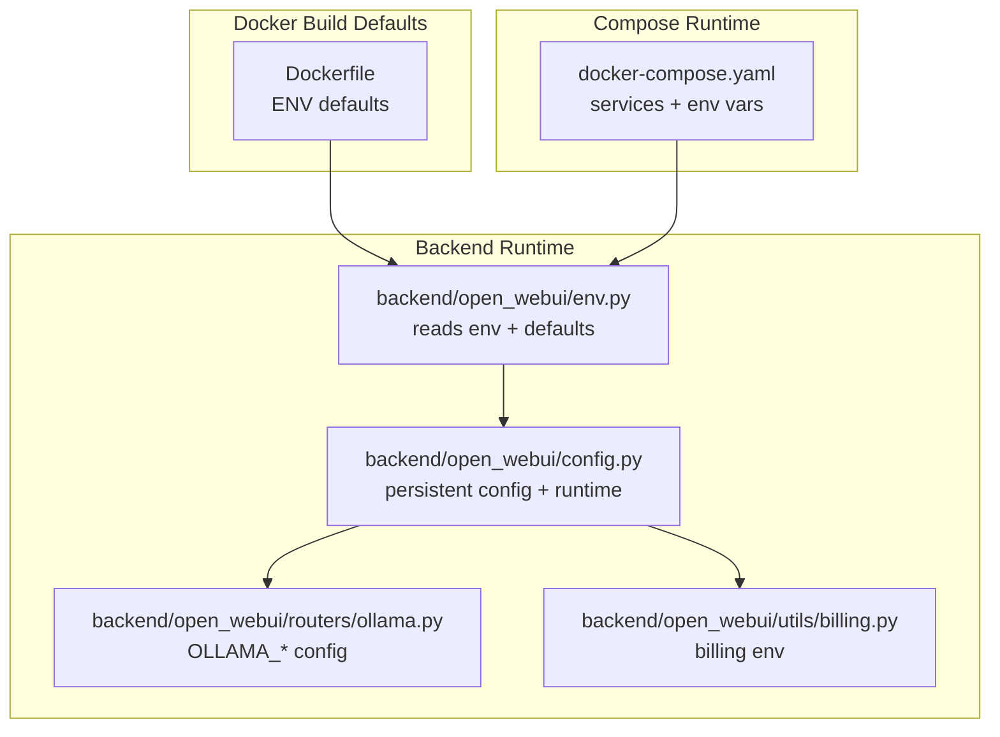
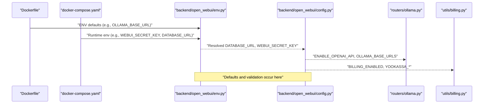
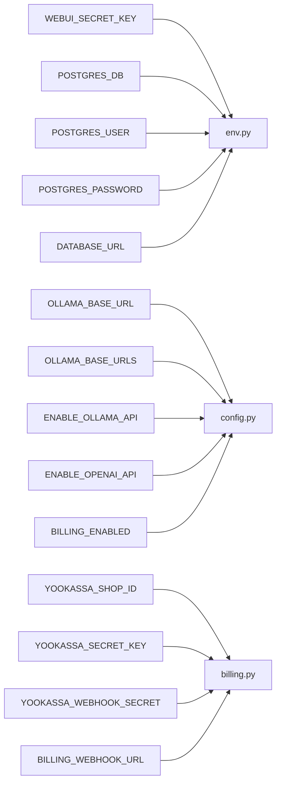

# Environment Variables

<cite>
**Referenced Files in This Document**
- [.env.example](file://.env.example)
- [Dockerfile](file://Dockerfile)
- [docker-compose.yaml](file://docker-compose.yaml)
- [backend/open_webui/env.py](file://backend/open_webui/env.py)
- [backend/open_webui/config.py](file://backend/open_webui/config.py)
- [backend/open_webui/routers/ollama.py](file://backend/open_webui/routers/ollama.py)
- [backend/open_webui/utils/billing.py](file://backend/open_webui/utils/billing.py)
- [backend/open_webui/constants.py](file://backend/open_webui/constants.py)
</cite>

## Table of Contents
1. [Introduction](#introduction)
2. [Project Structure](#project-structure)
3. [Core Components](#core-components)
4. [Architecture Overview](#architecture-overview)
5. [Detailed Component Analysis](#detailed-component-analysis)
6. [Dependency Analysis](#dependency-analysis)
7. [Performance Considerations](#performance-considerations)
8. [Troubleshooting Guide](#troubleshooting-guide)
9. [Conclusion](#conclusion)
10. [Appendices](#appendices)

## Introduction
This document explains the environment variables used in the Open WebUI Docker deployment. It focuses on the variables that control secrets, database connectivity, model providers, and billing features. It also provides practical configuration examples for development, production, and air-gapped environments, along with guidance on sensitive handling, defaults, validation, and common troubleshooting steps.

## Project Structure
The environment configuration spans:
- A Dockerfile that sets defaults and exposes runtime environment variables
- A docker-compose file that wires PostgreSQL credentials and billing variables
- Backend configuration that reads and validates environment variables
- Billing utilities that consume billing-related environment variables

**Diagram sources**
- [Dockerfile](file://Dockerfile#L58-L90)
- [docker-compose.yaml](file://docker-compose.yaml#L41-L54)
- [backend/open_webui/env.py](file://backend/open_webui/env.py#L280-L309)
- [backend/open_webui/config.py](file://backend/open_webui/config.py#L962-L1004)
- [backend/open_webui/routers/ollama.py](file://backend/open_webui/routers/ollama.py#L278-L309)
- [backend/open_webui/utils/billing.py](file://backend/open_webui/utils/billing.py#L1-L50)

**Section sources**
- [Dockerfile](file://Dockerfile#L58-L90)
- [docker-compose.yaml](file://docker-compose.yaml#L11-L54)
- [backend/open_webui/env.py](file://backend/open_webui/env.py#L280-L309)
- [backend/open_webui/config.py](file://backend/open_webui/config.py#L962-L1004)

## Core Components
This section documents the key environment variables used in Docker deployments and their roles.

- WEBUI_SECRET_KEY
  - Purpose: Cryptographic secret used to sign sessions and tokens. Required for secure operation.
  - Default: Not set by default in the Dockerfile; must be provided in production.
  - Validation: The backend enforces that this variable must be set when authentication is enabled.
  - Impact: Without a strong secret, sessions and tokens are insecure.
  - Security: Treat as highly sensitive; rotate regularly and restrict access to the deployment environment.

- OLLAMA_BASE_URL
  - Purpose: Base URL for the Ollama service used by the backend.
  - Default: Set to a placeholder in the Dockerfile; production defaults are computed at runtime based on deployment mode.
  - Behavior: In production, the backend adjusts this value depending on whether Docker or Kubernetes is used, or if a dedicated service is present.
  - Impact: Incorrect value leads to model retrieval failures and chat errors.

- POSTGRES_DB, POSTGRES_USER, POSTGRES_PASSWORD
  - Purpose: PostgreSQL credentials and database name for the backend database.
  - Default: Provided via docker-compose defaults; can be overridden.
  - Impact: Incorrect credentials cause database connection failures during startup.

- ENABLE_OLLAMA_API
  - Purpose: Enables or disables the Open WebUI integration with Ollama APIs.
  - Default: Enabled by default in persistent configuration.
  - Impact: Disabling prevents model listings and chat completion via Ollama.

- ENABLE_OPENAI_API
  - Purpose: Enables or disables the Open WebUI integration with OpenAI-compatible APIs.
  - Default: Enabled by default in persistent configuration.
  - Impact: Disabling prevents model listings and chat completion via OpenAI-compatible endpoints.

- BILLING_ENABLED
  - Purpose: Enables billing and subscription features.
  - Default: Enabled by default in docker-compose.
  - Impact: Disabling removes billing UI and webhook handling.

- YOOKASSA_SHOP_ID, YOOKASSA_SECRET_KEY, YOOKASSA_WEBHOOK_SECRET, BILLING_WEBHOOK_URL
  - Purpose: Payment provider integration and webhook configuration for billing.
  - Default: Not set by default; required when billing is enabled.
  - Impact: Missing values prevent payment processing and webhook verification.

**Section sources**
- [Dockerfile](file://Dockerfile#L70-L78)
- [backend/open_webui/env.py](file://backend/open_webui/env.py#L452-L482)
- [backend/open_webui/config.py](file://backend/open_webui/config.py#L962-L1004)
- [docker-compose.yaml](file://docker-compose.yaml#L15-L19)
- [docker-compose.yaml](file://docker-compose.yaml#L41-L54)
- [backend/open_webui/utils/billing.py](file://backend/open_webui/utils/billing.py#L374-L447)

## Architecture Overview
The runtime environment is assembled from build-time defaults, compose-time overrides, and backend-time resolution.

**Diagram sources**
- [Dockerfile](file://Dockerfile#L58-L90)
- [docker-compose.yaml](file://docker-compose.yaml#L41-L54)
- [backend/open_webui/env.py](file://backend/open_webui/env.py#L280-L309)
- [backend/open_webui/config.py](file://backend/open_webui/config.py#L962-L1004)
- [backend/open_webui/routers/ollama.py](file://backend/open_webui/routers/ollama.py#L278-L309)
- [backend/open_webui/utils/billing.py](file://backend/open_webui/utils/billing.py#L374-L447)

## Detailed Component Analysis

### WEBUI_SECRET_KEY
- Definition and defaults
  - The backend reads this variable and falls back to a legacy key name if needed. If WEBUI_AUTH is enabled and this variable is empty, the application terminates with a specific error message indicating a missing environment variable.
- Security implications
  - This secret underpins session cookies and JWT signing. It must be strong and unique per deployment.
- Operational guidance
  - Always set this in production and CI/CD secrets management.
  - Rotate periodically and ensure it is not logged or exposed in configuration files.

**Section sources**
- [backend/open_webui/env.py](file://backend/open_webui/env.py#L452-L482)
- [backend/open_webui/constants.py](file://backend/open_webui/constants.py#L19-L36)

### OLLAMA_BASE_URL and OLLAMA_BASE_URLS
- Definition and defaults
  - The Dockerfile sets a placeholder base URL. At runtime, the backend resolves a production-safe default based on deployment mode (Docker vs Kubernetes) and whether Ollama is bundled.
  - The backend also exposes a persistent configuration for multiple base URLs and API configs.
- Behavior
  - When multiple base URLs are provided, they are parsed and stored as a persistent configuration.
- Impact
  - Incorrect base URL leads to model discovery and chat failures.

**Section sources**
- [Dockerfile](file://Dockerfile#L69-L72)
- [backend/open_webui/config.py](file://backend/open_webui/config.py#L962-L987)
- [backend/open_webui/routers/ollama.py](file://backend/open_webui/routers/ollama.py#L278-L309)

### Database Connectivity (DATABASE_URL and PostgreSQL variables)
- Definition and defaults
  - The backend constructs DATABASE_URL from either a single DATABASE_URL environment variable or individual components (type, user, password, host, port, name).
  - docker-compose provides PostgreSQL credentials and builds a DATABASE_URL targeting the postgres service.
- Behavior
  - The backend normalizes postgres:// to postgresql:// for compatibility.
- Impact
  - Incorrect credentials or URL cause startup failures and database initialization errors.

**Section sources**
- [backend/open_webui/env.py](file://backend/open_webui/env.py#L280-L309)
- [docker-compose.yaml](file://docker-compose.yaml#L15-L19)
- [docker-compose.yaml](file://docker-compose.yaml#L41-L46)

### Provider Integrations (ENABLE_OLLAMA_API, ENABLE_OPENAI_API)
- Definition and defaults
  - Both are persisted configuration values with defaults set to enabled.
  - The backend reads these values and applies them to routing and model discovery.
- Impact
  - Disabling either provider removes access to models served by that provider.

**Section sources**
- [backend/open_webui/config.py](file://backend/open_webui/config.py#L993-L1004)

### Billing and Payments (BILLING_ENABLED, YOOKASSA_*, BILLING_WEBHOOK_URL)
- Definition and defaults
  - docker-compose enables billing by default and passes billing-related environment variables.
  - The billing service requires YOO_KASSA_SHOP_ID, YOO_KASSA_SECRET_KEY, and optionally YOO_KASSA_WEBHOOK_SECRET and BILLING_WEBHOOK_URL.
- Behavior
  - When billing is enabled, the backend initializes billing services and processes webhooks.
- Impact
  - Missing billing variables prevent payment creation and webhook handling.

**Section sources**
- [docker-compose.yaml](file://docker-compose.yaml#L46-L51)
- [backend/open_webui/utils/billing.py](file://backend/open_webui/utils/billing.py#L374-L447)

## Dependency Analysis
The environment variables influence multiple subsystems. The following diagram shows how variables flow from compose to backend configuration and into feature-specific modules.

**Diagram sources**
- [docker-compose.yaml](file://docker-compose.yaml#L15-L19)
- [docker-compose.yaml](file://docker-compose.yaml#L41-L54)
- [backend/open_webui/env.py](file://backend/open_webui/env.py#L280-L309)
- [backend/open_webui/config.py](file://backend/open_webui/config.py#L962-L1004)
- [backend/open_webui/utils/billing.py](file://backend/open_webui/utils/billing.py#L374-L447)

**Section sources**
- [docker-compose.yaml](file://docker-compose.yaml#L15-L19)
- [docker-compose.yaml](file://docker-compose.yaml#L41-L54)
- [backend/open_webui/env.py](file://backend/open_webui/env.py#L280-L309)
- [backend/open_webui/config.py](file://backend/open_webui/config.py#L962-L1004)
- [backend/open_webui/utils/billing.py](file://backend/open_webui/utils/billing.py#L374-L447)

## Performance Considerations
- Avoid excessive environment parsing overhead by setting only required variables.
- Prefer a single DATABASE_URL over multiple components when possible to reduce conditional logic.
- Keep billing disabled in low-resource environments to minimize webhook processing overhead.

[No sources needed since this section provides general guidance]

## Troubleshooting Guide
Common configuration errors and resolutions:

- WEBUI_SECRET_KEY not set
  - Symptom: Application fails early with a specific error indicating a missing environment variable.
  - Resolution: Provide WEBUI_SECRET_KEY in your deployment environment.

- OLLAMA_BASE_URL unreachable
  - Symptom: Model lists empty or chat requests fail.
  - Resolution: Verify OLLAMA_BASE_URL points to a reachable Ollama instance. In Docker, ensure host.docker.internal mapping is correct; in Kubernetes, ensure the service FQDN is correct.

- PostgreSQL connection failure
  - Symptom: Startup errors mentioning database connection issues.
  - Resolution: Confirm POSTGRES_DB, POSTGRES_USER, POSTGRES_PASSWORD match the database configuration. Ensure DATABASE_URL is constructed correctly (compose injects a DATABASE_URL targeting the postgres service).

- Billing webhook not processed
  - Symptom: Payments succeed but subscriptions are not created.
  - Resolution: Ensure BILLING_ENABLED is true and YOOKASSA_SHOP_ID, YOOKASSA_SECRET_KEY, and BILLING_WEBHOOK_URL are set. Verify webhook endpoint and signature secret if used.

- Provider APIs disabled
  - Symptom: Models from a provider do not appear.
  - Resolution: Set ENABLE_OPENAI_API or ENABLE_OLLAMA_API to true in persistent configuration.

**Section sources**
- [backend/open_webui/env.py](file://backend/open_webui/env.py#L452-L482)
- [backend/open_webui/config.py](file://backend/open_webui/config.py#L962-L1004)
- [backend/open_webui/utils/billing.py](file://backend/open_webui/utils/billing.py#L374-L447)

## Conclusion
Environment variables are central to Open WebUI’s Docker deployment. Correctly configuring secrets, database connectivity, provider integrations, and billing settings ensures secure, reliable operation. Use the provided examples and troubleshooting guidance to tailor your deployment to development, production, or air-gapped scenarios.

[No sources needed since this section summarizes without analyzing specific files]

## Appendices

### Example Configurations

- Development (local)
  - Set WEBUI_SECRET_KEY to a strong secret.
  - Use the default OLLAMA_BASE_URL placeholder; if running Ollama locally, adjust to http://host.docker.internal:11434.
  - Use docker-compose defaults for PostgreSQL; mount a volume for persistence.
  - Keep BILLING_ENABLED disabled or set billing variables only if integrating with a payment provider.

- Production (standalone)
  - Provide WEBUI_SECRET_KEY and DATABASE_URL pointing to a managed PostgreSQL instance.
  - Configure OLLAMA_BASE_URL to the production Ollama endpoint or service FQDN.
  - Enable billing only if integrating with a payment provider; set YOOKASSA_* and BILLING_WEBHOOK_URL accordingly.

- Air-gapped
  - Provide WEBUI_SECRET_KEY and DATABASE_URL.
  - Disable provider integrations (ENABLE_OPENAI_API and ENABLE_OLLAMA_API) if external access is not available.
  - Ensure all required models and embeddings are preloaded in the container image or mounted volumes.

[No sources needed since this section provides general guidance]