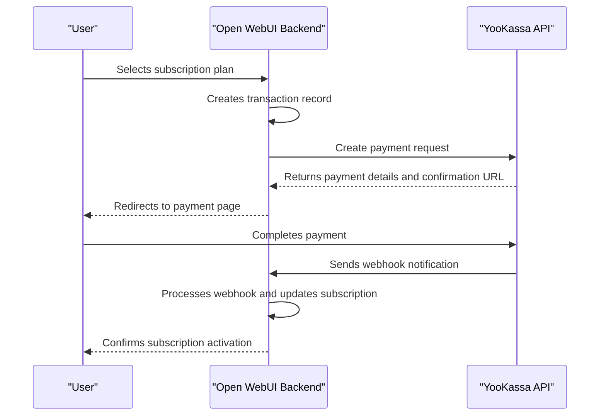
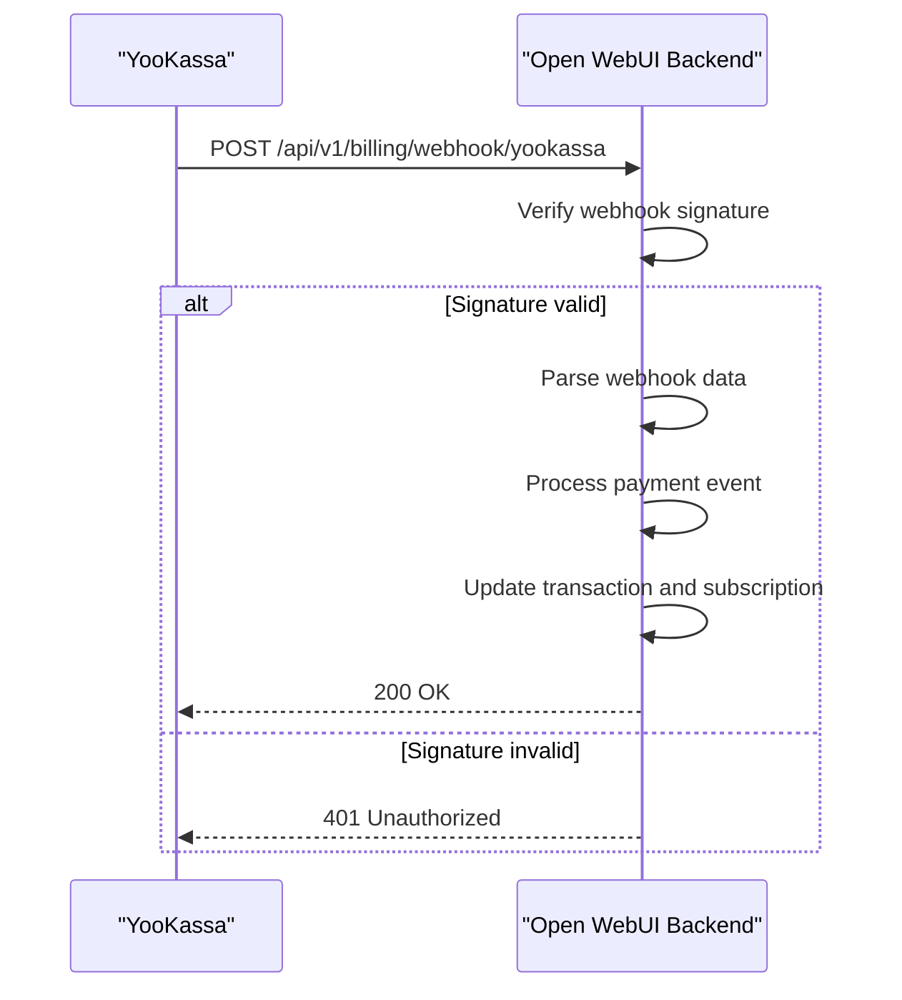
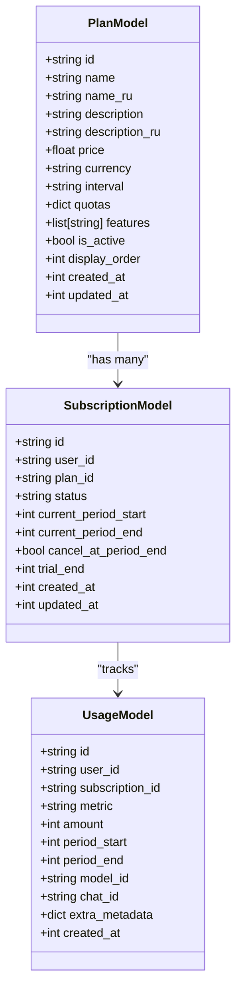
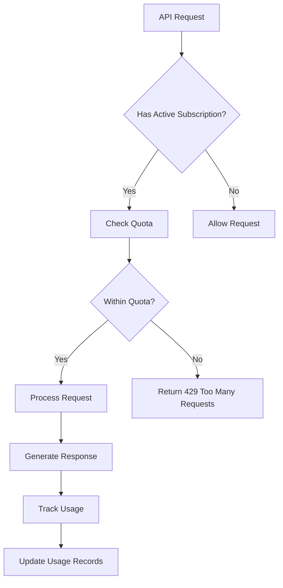
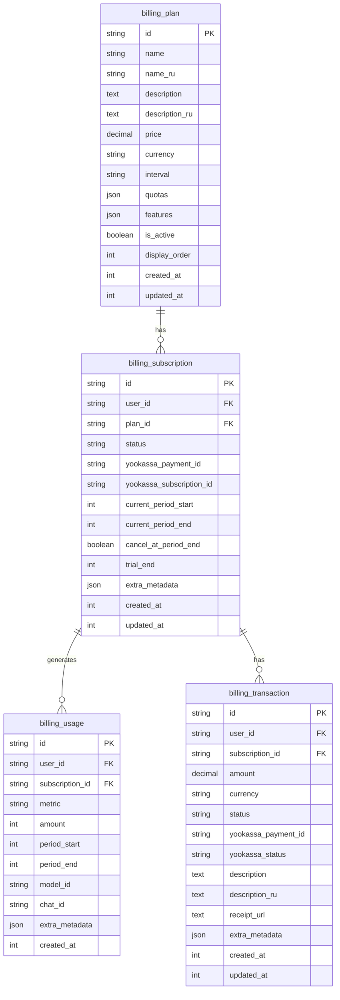

# Billing Configuration

<cite>
**Referenced Files in This Document**   
- [BILLING_SETUP.md](file://BILLING_SETUP.md)
- [backend/scripts/init_billing_plans.py](file://backend/scripts/init_billing_plans.py)
- [backend/open_webui/utils/billing.py](file://backend/open_webui/utils/billing.py)
- [backend/open_webui/utils/yookassa.py](file://backend/open_webui/utils/yookassa.py)
- [backend/open_webui/models/billing.py](file://backend/open_webui/models/billing.py)
- [backend/open_webui/routers/billing.py](file://backend/open_webui/routers/billing.py)
- [backend/open_webui/routers/admin_billing.py](file://backend/open_webui/routers/admin_billing.py)
- [backend/open_webui/utils/plan_templates.py](file://backend/open_webui/utils/plan_templates.py)
- [backend/open_webui/env.py](file://backend/open_webui/env.py)
</cite>

## Table of Contents
1. [Introduction](#introduction)
2. [Billing Environment Variables](#billing-environment-variables)
3. [YooKassa Payment Integration](#yookassa-payment-integration)
4. [Webhook Configuration](#webhook-configuration)
5. [Subscription Plans and Pricing Tiers](#subscription-plans-and-pricing-tiers)
6. [Billing Analytics and Usage Tracking](#billing-analytics-and-usage-tracking)
7. [Initializing Billing Plans](#initializing-billing-plans)
8. [Configuration Examples](#configuration-examples)
9. [Troubleshooting](#troubleshooting)
10. [Conclusion](#conclusion)

## Introduction

This document provides comprehensive guidance on configuring the billing system in open-webui, focusing on the integration with YooKassa as the payment gateway. The billing system enables monetization through subscription plans, usage tracking, and payment processing. It supports various billing scenarios including free tiers, paid subscriptions, and enterprise plans. The configuration involves setting environment variables, creating subscription plans, configuring webhooks, and initializing billing plans through scripts. This documentation covers all aspects of billing configuration, from initial setup to advanced scenarios and troubleshooting.

**Section sources**
- [BILLING_SETUP.md](file://BILLING_SETUP.md#L1-L333)

## Billing Environment Variables

The billing system in open-webui is configured through several environment variables that control the YooKassa integration and billing behavior. These variables must be set in the `.env` file or through the deployment environment.

### BILLING_ENABLED
This environment variable controls whether the billing system is enabled. When set to `true`, the billing features are activated, allowing users to subscribe to plans and make payments. When set to `false`, the billing system is disabled, and all users have unrestricted access to the platform's features.

### YOOKASSA_ACCOUNT_ID
This variable, also referred to as `YOOKASSA_SHOP_ID` in the codebase, contains the merchant account identifier provided by YooKassa. This ID is used to authenticate API requests to YooKassa and associate transactions with the correct merchant account. It must be obtained from the YooKassa dashboard after creating a merchant account.

### YOOKASSA_SECRET_KEY
The secret key is used for authenticating API requests to YooKassa. It serves as a password for the API and must be kept confidential. This key is used to sign requests and verify webhook payloads, ensuring secure communication between open-webui and YooKassa.

### BILLING_PLANS_CONFIG
This variable defines the configuration for subscription plans. It can be used to specify a JSON configuration of plans or point to a configuration file. The plans configuration includes details such as plan name, price, billing interval, quotas, and features. When not specified, the system uses default plan templates.

Additional environment variables for YooKassa integration include:
- `YOOKASSA_WEBHOOK_SECRET`: Optional secret for verifying webhook signatures
- `YOOKASSA_API_URL`: API endpoint URL (defaults to `https://api.yookassa.ru/v3`)

After configuring these variables, the system logs will indicate whether YooKassa billing is initialized successfully or if configuration is missing.

**Section sources**
- [BILLING_SETUP.md](file://BILLING_SETUP.md#L52-L62)
- [backend/open_webui/env.py](file://backend/open_webui/env.py#L888-L892)

## YooKassa Payment Integration

The integration with YooKassa enables secure payment processing for subscription plans in open-webui. This integration handles the entire payment lifecycle, from creating payment requests to processing webhook notifications.

### Integration Setup

To set up YooKassa integration, follow these steps:

1. **Register with YooKassa**: Create a merchant account at https://yookassa.ru and complete the verification process.
2. **Obtain API Credentials**: In the YooKassa dashboard, navigate to "Settings" → "API and Webhook" to obtain the Shop ID and Secret Key.
3. **Configure Environment Variables**: Set the `YOOKASSA_SHOP_ID` and `YOOKASSA_SECRET_KEY` environment variables with the credentials obtained from YooKassa.

The integration is implemented through the `YooKassaClient` class in `backend/open_webui/utils/yookassa.py`, which provides methods for creating payments, retrieving payment information, capturing payments, and processing refunds.

### Payment Processing Flow

The payment processing flow involves the following steps:

1. **Create Payment**: When a user selects a subscription plan, the system creates a payment request through the YooKassa API.
2. **Redirect to Payment Page**: The user is redirected to YooKassa's payment page to complete the transaction.
3. **Webhook Notification**: After payment completion, YooKassa sends a webhook notification to the open-webui server.
4. **Subscription Activation**: The webhook handler processes the notification and activates or renews the user's subscription.

The `create_payment` method in the `BillingService` class orchestrates this flow by creating a transaction record, calling the YooKassa API to create a payment, and returning a confirmation URL for the user.



**Diagram sources**
- [backend/open_webui/utils/billing.py](file://backend/open_webui/utils/billing.py#L374-L447)
- [backend/open_webui/utils/yookassa.py](file://backend/open_webui/utils/yookassa.py#L86-L137)

## Webhook Configuration

Webhook configuration is critical for the billing system to receive real-time notifications from YooKassa about payment status changes. Webhooks ensure that subscriptions are activated, renewed, or canceled based on actual payment events.

### Webhook Setup

To configure webhooks:

1. In the YooKassa dashboard, navigate to "Settings" → "Notifications".
2. Add the webhook URL: `https://your-domain.com/api/v1/billing/webhook/yookassa`
3. Select the events to receive notifications for:
   - `payment.succeeded`: Triggered when a payment is successfully completed
   - `payment.canceled`: Triggered when a payment is canceled
   - `payment.waiting_for_capture`: Triggered when a payment is authorized but requires manual capture

### Webhook Security

The system implements webhook security through signature verification using HMAC-SHA256. When `YOOKASSA_WEBHOOK_SECRET` is configured, the system verifies the signature of each webhook request to ensure it originates from YooKassa and has not been tampered with.

The webhook handler is implemented in the `billing.py` router at the `/webhook/yookassa` endpoint. It performs the following steps:
1. Verifies the webhook signature if a webhook secret is configured
2. Parses the webhook payload
3. Processes the payment event by updating transaction status and managing subscriptions
4. Returns an appropriate HTTP response to acknowledge receipt



**Diagram sources**
- [backend/open_webui/routers/billing.py](file://backend/open_webui/routers/billing.py#L363-L413)
- [backend/open_webui/utils/yookassa.py](file://backend/open_webui/utils/yookassa.py#L262-L293)

## Subscription Plans and Pricing Tiers

Subscription plans define the pricing tiers and feature sets available to users. Each plan includes pricing information, usage quotas, and included features that determine what users can access.

### Plan Structure

A subscription plan includes the following properties:
- **id**: Unique identifier for the plan
- **name**: Display name of the plan
- **price**: Monthly or annual price
- **currency**: Currency code (default: RUB)
- **interval**: Billing interval (month, year)
- **quotas**: Usage limits for various metrics
- **features**: List of features available in the plan
- **is_active**: Whether the plan is available for subscription

### Default Plan Templates

The system provides default plan templates through the `plan_templates.py` module, which includes four tiers:

1. **Free Plan**: Entry-level plan with basic features and limited quotas
2. **Starter Plan**: For students and hobbyists with moderate quotas
3. **Pro Plan**: For professionals with advanced features and higher quotas
4. **Business Plan**: For companies and power users with extensive quotas

Each plan defines quotas for metrics such as input tokens, output tokens, and requests. The templates also support annual billing with a 20% discount compared to monthly billing.

### Creating Custom Plans

Plans can be created through the admin API or programmatically. The admin interface allows administrators to create, update, and manage plans with validation rules to prevent breaking changes to plans with active subscribers.

When updating plans with active subscribers, the system enforces business rules:
- Quotas cannot be decreased
- Price changes are allowed but logged as warnings
- Active status can be toggled to deactivate plans without deleting them



**Diagram sources**
- [backend/open_webui/models/billing.py](file://backend/open_webui/models/billing.py#L83-L104)
- [backend/open_webui/utils/plan_templates.py](file://backend/open_webui/utils/plan_templates.py#L27-L181)

## Billing Analytics and Usage Tracking

The billing system includes comprehensive analytics and usage tracking to monitor resource consumption and ensure fair usage according to subscription plans.

### Usage Metrics

The system tracks several usage metrics defined in the `UsageMetric` enum:
- **TOKENS_INPUT**: Number of input tokens consumed
- **TOKENS_OUTPUT**: Number of output tokens generated
- **REQUESTS**: Number of API requests made
- **IMAGES**: Number of images generated
- **AUDIO_MINUTES**: Minutes of audio processed

### Quota Enforcement

Before each API request, the system checks if the user has sufficient quota remaining. The `check_quota` method in the `BillingService` class verifies whether the requested usage would exceed the user's quota limit.

If a user exceeds their quota, the system raises a `QuotaExceededError` with the message "Quota exceeded for {metric}. Please upgrade your plan." This prevents users from consuming resources beyond their subscription limits.

### Usage Tracking Implementation

Usage is tracked automatically after each successful API call. The `track_usage` method records the amount of resources consumed, associated with the user's subscription. This data is stored in the `billing_usage` table and used for:
- Real-time quota calculations
- Billing analytics and reporting
- Usage history for users
- Subscription renewal decisions

The system calculates usage for the current billing period, which aligns with the subscription period (typically monthly). For users without an active subscription, usage is tracked but not enforced, allowing for flexible access control policies.



**Diagram sources**
- [backend/open_webui/utils/billing.py](file://backend/open_webui/utils/billing.py#L227-L351)
- [backend/open_webui/models/billing.py](file://backend/open_webui/models/billing.py#L206-L224)

## Initializing Billing Plans

Billing plans are initialized through the `init_billing_plans.py` script, which creates the default subscription plans from templates. This script is essential for setting up the billing system after installation or when resetting the configuration.

### Script Usage

The script can be executed with the following options:
- `--include-annual`: Creates annual versions of plans with 20% discount
- `--include-promo`: Creates promotional plans for special events
- `--force`: Overwrites existing plans with the same ID

```bash
python -m backend.scripts.init_billing_plans [--include-annual] [--include-promo] [--force]
```

### Initialization Process

The initialization process follows these steps:

1. **Load Plan Templates**: The script imports plan templates from `plan_templates.py`
2. **Check Existing Plans**: For each plan, it checks if a plan with the same ID already exists
3. **Apply Configuration**: Depending on the `--force` flag, it either skips existing plans or updates them
4. **Create or Update**: Creates new plans or updates existing ones with the template configuration
5. **Generate Summary**: Outputs a summary of created, updated, and skipped plans

The script ensures idempotent execution, meaning it can be run multiple times without creating duplicate plans (unless the `--force` flag is used). This makes it safe to include in deployment scripts and initialization routines.

### Database Schema

The billing system uses four main database tables created by the migration script `b2f8a9c1d5e3_add_billing_tables.py`:

- **billing_plan**: Stores subscription plan definitions
- **billing_subscription**: Tracks user subscriptions
- **billing_usage**: Records resource usage by users
- **billing_transaction**: Maintains payment transaction history

These tables are automatically created when the application starts, ensuring the billing system is ready for use.



**Diagram sources**
- [backend/scripts/init_billing_plans.py](file://backend/scripts/init_billing_plans.py#L1-L120)
- [backend/open_webui/migrations/versions/b2f8a9c1d5e3_add_billing_tables.py](file://backend/open_webui/migrations/versions/b2f8a9c1d5e3_add_billing_tables.py#L1-L167)

## Configuration Examples

This section provides practical examples of billing configurations for different scenarios, demonstrating how to set up free tiers, paid subscriptions, and enterprise plans.

### Free Tier Configuration

The free tier allows users to access basic features with limited quotas. This encourages user adoption while reserving premium features for paid subscribers.

```python
{
    "id": "free",
    "name": "Free",
    "name_ru": "Бесплатный",
    "description": "Perfect for trying out AI models",
    "description_ru": "Идеально для знакомства с AI моделями",
    "price": 0.0,
    "currency": "RUB",
    "interval": "month",
    "quotas": {
        "tokens_input": 100000,
        "tokens_output": 50000,
        "requests": 500
    },
    "features": [
        "GPT 5 Nano",
        "GPT OSS 20B",
        "DeepSeek V3.2",
        "Qwen 3 8B",
        "Basic support"
    ],
    "is_active": True,
    "display_order": 0
}
```

### Paid Subscription Configuration

Paid subscriptions offer enhanced features and higher quotas. The Pro plan example demonstrates a premium offering:

```python
{
    "id": "pro",
    "name": "Pro",
    "name_ru": "Профессиональный",
    "description": "Advanced features and higher quotas",
    "description_ru": "Расширенные возможности и увеличенные квоты",
    "price": 1490.0,
    "currency": "RUB",
    "interval": "month",
    "quotas": {
        "tokens_input": 5000000,
        "tokens_output": 2000000,
        "requests": 20000
    },
    "features": [
        "All Starter models",
        "GPT-4o",
        "GPT-4o Mini",
        "Claude 4.5 Sonnet",
        "Gemini 2.5 Pro",
        "o4-mini",
        "Mistral Large",
        "Qwen 3 Max",
        "Priority processing",
        "Email support"
    ],
    "is_active": True,
    "display_order": 2
}
```

### Enterprise Plan Configuration

Enterprise plans provide comprehensive access with unlimited resources or custom quotas. The Business plan example shows a high-tier offering:

```python
{
    "id": "business",
    "name": "Business",
    "name_ru": "Бизнес",
    "description": "For companies and power users",
    "description_ru": "Для компаний и профессионалов",
    "price": 4990.0,
    "currency": "RUB",
    "interval": "month",
    "quotas": {
        "tokens_input": 20000000,
        "tokens_output": 10000000,
        "requests": 100000
    },
    "features": [
        "All Pro models",
        "GPT-5.1",
        "o1",
        "o3",
        "Claude 4.5 Opus",
        "Claude Opus-4.1",
        "Gemini 3 Pro Preview",
        "xAI Grok 4",
        "DeepSeek R1",
        "Priority processing",
        "API access",
        "Dedicated support",
        "SLA 99.9%"
    ],
    "is_active": True,
    "display_order": 3
}
```

### Annual Billing Configuration

Annual plans offer a discount for users who commit to longer-term subscriptions. The system automatically calculates a 20% discount:

```python
{
    "id": "pro_annual",
    "name": "Pro Annual",
    "name_ru": "Профессиональный (Годовой)",
    "description": "Pro plan billed annually - save 20%",
    "description_ru": "План Профессиональный с годовой оплатой - экономия 20%",
    "price": 14304.0,  # 1490 * 12 * 0.8
    "currency": "RUB",
    "interval": "year",
    "quotas": {
        "tokens_input": 5000000,
        "tokens_output": 2000000,
        "requests": 20000
    },
    "features": [
        "All Pro features",
        "20% discount for annual payment",
        "2 months free"
    ],
    "is_active": True,
    "display_order": 6
}
```

**Section sources**
- [backend/open_webui/utils/plan_templates.py](file://backend/open_webui/utils/plan_templates.py#L27-L305)

## Troubleshooting

This section addresses common issues encountered when configuring and operating the billing system, providing solutions and diagnostic steps.

### Payment Processing Failures

**Symptoms**: Users cannot complete payments, or payment status does not update.

**Causes and Solutions**:
- **Missing API credentials**: Verify that `YOOKASSA_SHOP_ID` and `YOOKASSA_SECRET_KEY` are correctly set in the environment variables.
- **Network connectivity**: Ensure the server can reach `api.yookassa.ru` (port 443).
- **Invalid return URL**: Check that the return URL in the payment request is valid and accessible.
- **Insufficient funds**: Users may have insufficient funds or card issues; this is handled by YooKassa's payment interface.

**Diagnostic Steps**:
1. Check server logs for YooKassa API errors
2. Verify webhook configuration in the YooKassa dashboard
3. Test with YooKassa's test mode and test card numbers

### Webhook Verification Errors

**Symptoms**: Webhook requests are rejected with 401 Unauthorized errors.

**Causes and Solutions**:
- **Missing webhook secret**: If `YOOKASSA_WEBHOOK_SECRET` is configured, ensure it matches the secret in the YooKassa dashboard.
- **Signature mismatch**: Verify that the webhook payload is not being modified in transit.
- **Clock drift**: Ensure the server's clock is synchronized with NTP, as signature verification is time-sensitive.

**Diagnostic Steps**:
1. Check logs for "Invalid webhook signature" messages
2. Temporarily disable webhook secret verification to isolate the issue
3. Verify the webhook URL is correctly configured in YooKassa

### Subscription Status Synchronization Problems

**Symptoms**: User subscription status does not reflect payment status, or quotas are not updated after payment.

**Causes and Solutions**:
- **Webhook delivery failure**: YooKassa may not be able to deliver webhooks to the server.
- **Database transaction errors**: Issues with updating subscription records in the database.
- **Timezone mismatches**: Billing periods may be calculated incorrectly due to timezone differences.

**Diagnostic Steps**:
1. Check for webhook delivery logs in the YooKassa dashboard
2. Verify database connectivity and permissions
3. Examine transaction and subscription records for inconsistencies
4. Test the webhook endpoint manually with sample payloads

### General Troubleshooting Commands

```bash
# Check billing-related logs
docker-compose logs -f open-webui | grep -i "billing\|yookassa\|quota"

# Verify database tables exist
docker-compose exec open-webui alembic current

# Test webhook endpoint
curl -X POST http://localhost:3000/api/v1/billing/webhook/yookassa \
  -H "Content-Type: application/json" \
  -d '{"event": "payment.succeeded", "object": {"id": "test", "status": "succeeded"}}'
```

**Section sources**
- [BILLING_SETUP.md](file://BILLING_SETUP.md#L307-L326)
- [TROUBLESHOOTING.md](file://TROUBLESHOOTING.md#L1-L37)

## Conclusion

The billing configuration in open-webui provides a comprehensive system for monetizing AI services through subscription plans and usage-based pricing. By integrating with YooKassa, the platform enables secure payment processing for users in Russia and other regions where YooKassa operates. The system supports flexible pricing models, including free tiers, monthly subscriptions, annual plans with discounts, and promotional offers.

Key components of the billing system include environment variable configuration, YooKassa integration, webhook handling, subscription plan management, and usage tracking. The initialization script `init_billing_plans.py` simplifies setup by creating default plans from templates, while the admin API allows for custom plan creation and management.

The system enforces quotas to ensure fair usage according to subscription levels, tracking metrics such as input tokens, output tokens, and API requests. Comprehensive logging and monitoring capabilities help diagnose and resolve issues related to payment processing, webhook delivery, and subscription synchronization.

By following the configuration guidelines and troubleshooting steps outlined in this document, administrators can successfully implement and maintain a robust billing system that supports various business models, from freemium offerings to enterprise-level subscriptions.

**Section sources**
- [BILLING_SETUP.md](file://BILLING_SETUP.md#L1-L333)
- [backend/scripts/init_billing_plans.py](file://backend/scripts/init_billing_plans.py#L1-L120)