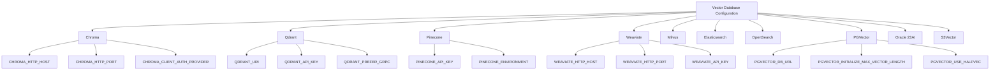
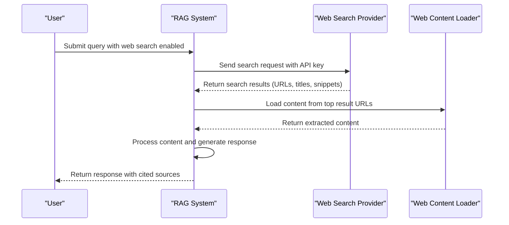
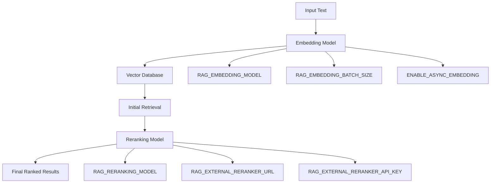

# RAG System Configuration

<cite>
**Referenced Files in This Document**   
- [config.py](file://backend/open_webui/config.py)
- [retrieval.py](file://backend/open_webui/routers/retrieval.py)
- [main.py](file://backend/open_webui/retrieval/vector/main.py)
- [factory.py](file://backend/open_webui/retrieval/vector/factory.py)
- [type.py](file://backend/open_webui/retrieval/vector/type.py)
- [utils.py](file://backend/open_webui/retrieval/utils.py)
- [index.ts](file://src/lib/apis/retrieval/index.ts)
- [tavily.py](file://backend/open_webui/retrieval/web/tavily.py)
- [serpapi.py](file://backend/open_webui/retrieval/web/serpapi.py)
- [external.py](file://backend/open_webui/retrieval/web/external.py)
- [main.py](file://backend/open_webui/retrieval/loaders/main.py)
</cite>

## Table of Contents
1. [Introduction](#introduction)
2. [Core RAG Configuration](#core-rag-configuration)
3. [Vector Database Configuration](#vector-database-configuration)
4. [Document Loaders and Parsers](#document-loaders-and-parsers)
5. [Web Search Integration](#web-search-integration)
6. [Embedding and Reranking Models](#embedding-and-reranking-models)
7. [RAG Configuration Use Cases](#rag-configuration-use-cases)
8. [Troubleshooting Guide](#troubleshooting-guide)

## Introduction
The Retrieval-Augmented Generation (RAG) system in Open WebUI provides a comprehensive framework for enhancing AI responses with external knowledge sources. This documentation covers the complete configuration of the RAG system, including environment variables, vector database settings, document loaders, web search integrations, and model configurations. The system enables users to augment AI responses with information from various sources, including local documents, web search results, and external knowledge bases.

## Core RAG Configuration

The RAG system in Open WebUI is configured through environment variables that control various aspects of the retrieval process. These variables define the behavior of the system, including retrieval parameters, text processing, and integration settings.

### Environment Variables

The following environment variables control the core RAG functionality:

- **RAG_TEMPLATE**: Custom template for formatting RAG responses with inline citations
- **RAG_TOP_K**: Number of top documents to retrieve (default: 3)
- **RAG_RELEVANCE_THRESHOLD**: Minimum relevance score for retrieved documents (default: 0.0)
- **RAG_HYBRID_BM25_WEIGHT**: Weight for hybrid search combining BM25 and vector search (default: 0.5)
- **ENABLE_RAG_HYBRID_SEARCH**: Enable hybrid search combining keyword and vector search
- **RAG_FULL_CONTEXT**: Include full document context in responses
- **CHUNK_SIZE**: Size of text chunks for document processing (default: 1000)
- **CHUNK_OVERLAP**: Overlap between text chunks (default: 100)
- **TIKTOKEN_ENCODING_NAME**: Token encoding for text processing (default: cl100k_base)

### Retrieval Parameters

The retrieval process is controlled by several key parameters that determine how documents are retrieved and ranked:

- **TOP_K**: Controls the number of documents retrieved from the vector database
- **TOP_K_RERANKER**: Number of documents to pass to the reranking model
- **RELEVANCE_THRESHOLD**: Minimum relevance score for including documents in results
- **ENABLE_RAG_HYBRID_SEARCH**: When enabled, combines BM25 keyword search with vector search for improved retrieval accuracy

**Section sources**
- [config.py](file://backend/open_webui/config.py#L2582-L2799)

## Vector Database Configuration

Open WebUI supports multiple vector database backends for storing and retrieving document embeddings. The vector database is configured through environment variables that specify the database type and connection parameters.

### Supported Vector Databases

The system supports the following vector databases:

- Chroma
- Qdrant
- Pinecone
- Weaviate
- Milvus
- Elasticsearch
- OpenSearch
- PGVector
- Oracle 23AI
- S3Vector

### Configuration

The vector database is selected using the `VECTOR_DB` environment variable, which specifies the database type. Each database has specific configuration options:



**Diagram sources**
- [config.py](file://backend/open_webui/config.py#L2115-L2299)
- [type.py](file://backend/open_webui/retrieval/vector/type.py#L1-L14)
- [factory.py](file://backend/open_webui/retrieval/vector/factory.py#L1-L78)

**Section sources**
- [config.py](file://backend/open_webui/config.py#L2115-L2299)
- [factory.py](file://backend/open_webui/retrieval/vector/factory.py#L1-L78)
- [type.py](file://backend/open_webui/retrieval/vector/type.py#L1-L14)

## Document Loaders and Parsers

The RAG system includes various document loaders and parsers for processing different file types. These loaders extract text content from documents and prepare them for embedding and retrieval.

### Supported File Types

The system supports loading and parsing the following file types:

- PDF (.pdf)
- CSV (.csv)
- Microsoft Office documents (.docx, .pptx, .xlsx)
- HTML (.html, .htm)
- Markdown (.md)
- EPUB (.epub)
- Plain text (.txt)
- Code files (various programming languages)
- Email messages (.msg)
- XML and JSON files

### Document Loading Configuration

Document loading is configured through environment variables that specify the loading method and parameters:

- **CONTENT_EXTRACTION_ENGINE**: Engine for content extraction (tika, datalab_marker, docling, document_intelligence, mineru, mistral_ocr)
- **TIKA_SERVER_URL**: URL for Apache Tika server
- **DATALAB_MARKER_API_KEY**: API key for Datalab Marker service
- **DATALAB_MARKER_API_BASE_URL**: Base URL for Datalab Marker API
- **DOCLING_SERVER_URL**: URL for Docling document processing server
- **DOCUMENT_INTELLIGENCE_ENDPOINT**: Azure Document Intelligence endpoint
- **MINERU_API_MODE**: Mode for MinerU document processing (local, api)
- **MINERU_API_URL**: URL for MinerU API server

The document loading process follows a priority order based on the configured engine and file type. For example, when using the "datalab_marker" engine, supported file types are processed through the Datalab Marker API, while other files fall back to default loaders.

**Section sources**
- [main.py](file://backend/open_webui/retrieval/loaders/main.py#L1-L398)

## Web Search Integration

The RAG system integrates with multiple web search providers to retrieve current information from the internet. These integrations allow the system to augment responses with up-to-date web content.

### Web Search Providers

The following web search providers are supported:

- Tavily
- SerpAPI
- Serper
- Serply
- SearchAPI
- Google Programmable Search Engine (PSE)
- Bing Search
- Brave Search
- Exa
- Perplexity
- SearXNG
- Yacy
- Kagi
- Mojeek
- Bocha
- Sougou
- Jina Search

### API Key Configuration

Each web search provider requires an API key for authentication:

- **TAVILY_API_KEY**: API key for Tavily search
- **SERPAPI_API_KEY**: API key for SerpAPI
- **SERPER_API_KEY**: API key for Serper
- **SERPLY_API_KEY**: API key for Serply
- **SEARCHAPI_API_KEY**: API key for SearchAPI
- **GOOGLE_PSE_API_KEY**: API key for Google PSE
- **BING_SEARCH_V7_SUBSCRIPTION_KEY**: Subscription key for Bing Search
- **BRAVE_SEARCH_API_KEY**: API key for Brave Search
- **EXA_API_KEY**: API key for Exa
- **PERPLEXITY_API_KEY**: API key for Perplexity
- **KAGI_SEARCH_API_KEY**: API key for Kagi Search
- **MOJEEK_SEARCH_API_KEY**: API key for Mojeek Search
- **BOCHA_SEARCH_API_KEY**: API key for Bocha Search
- **YACY_USERNAME** and **YACY_PASSWORD**: Credentials for Yacy search
- **SOUGOU_API_SID** and **SOUGOU_API_SK**: Credentials for Sougou search

### Search Configuration

Additional configuration options control web search behavior:

- **WEB_SEARCH_RESULT_COUNT**: Number of search results to retrieve (default: 4)
- **WEB_SEARCH_CONCURRENT_REQUESTS**: Number of concurrent web search requests
- **WEB_SEARCH_DOMAIN_FILTER_LIST**: List of domains to filter search results
- **WEB_SEARCH_TRUST_ENV**: Whether to trust environment proxy settings
- **ENABLE_WEB_LOADER_SSL_VERIFICATION**: Enable SSL verification for web content loading



**Diagram sources**
- [tavily.py](file://backend/open_webui/retrieval/web/tavily.py#L1-L52)
- [serpapi.py](file://backend/open_webui/retrieval/web/serpapi.py#L1-L51)
- [external.py](file://backend/open_webui/retrieval/web/external.py#L1-L63)
- [config.py](file://backend/open_webui/config.py#L2999-L3051)

**Section sources**
- [tavily.py](file://backend/open_webui/retrieval/web/tavily.py#L1-L52)
- [serpapi.py](file://backend/open_webui/retrieval/web/serpapi.py#L1-L51)
- [external.py](file://backend/open_webui/retrieval/web/external.py#L1-L63)
- [config.py](file://backend/open_webui/config.py#L2999-L3051)

## Embedding and Reranking Models

The RAG system uses embedding models to convert text into vector representations and reranking models to improve the relevance of retrieved documents.

### Embedding Models

The embedding model is configured using the following environment variables:

- **RAG_EMBEDDING_MODEL**: Name of the embedding model (default: sentence-transformers/all-MiniLM-L6-v2)
- **RAG_EMBEDDING_MODEL_AUTO_UPDATE**: Automatically update embedding models
- **RAG_EMBEDDING_MODEL_TRUST_REMOTE_CODE**: Trust remote code in embedding models
- **RAG_EMBEDDING_BATCH_SIZE**: Batch size for embedding generation
- **ENABLE_ASYNC_EMBEDDING**: Enable asynchronous embedding generation
- **RAG_EMBEDDING_QUERY_PREFIX**: Prefix for query embeddings
- **RAG_EMBEDDING_CONTENT_PREFIX**: Prefix for content embeddings
- **RAG_EMBEDDING_PREFIX_FIELD_NAME**: Field name for embedding prefixes

The system supports various embedding providers:

- Local sentence-transformers models
- OpenAI embeddings
- Azure OpenAI embeddings
- Ollama embeddings

### Reranking Models

Reranking improves the relevance of retrieved documents by reordering them based on a more sophisticated scoring mechanism. The reranking configuration includes:

- **RAG_RERANKING_ENGINE**: Reranking engine (default: empty)
- **RAG_RERANKING_MODEL**: Name of the reranking model
- **RAG_RERANKING_MODEL_AUTO_UPDATE**: Automatically update reranking models
- **RAG_RERANKING_MODEL_TRUST_REMOTE_CODE**: Trust remote code in reranking models
- **RAG_EXTERNAL_RERANKER_URL**: URL for external reranker service
- **RAG_EXTERNAL_RERANKER_API_KEY**: API key for external reranker service

Supported reranking models include:

- Cross-encoder models from sentence-transformers
- Jina ColBERT model (jinaai/jina-colbert-v2)
- External reranker services via API



**Diagram sources**
- [config.py](file://backend/open_webui/config.py#L2683-L2756)
- [retrieval.py](file://backend/open_webui/routers/retrieval.py#L132-L196)
- [utils.py](file://backend/open_webui/retrieval/utils.py#L777-L800)

**Section sources**
- [config.py](file://backend/open_webui/config.py#L2683-L2756)
- [retrieval.py](file://backend/open_webui/routers/retrieval.py#L132-L196)
- [utils.py](file://backend/open_webui/retrieval/utils.py#L777-L800)

## RAG Configuration Use Cases

The RAG system can be configured for various use cases, from enterprise knowledge bases to public web search augmentation.

### Enterprise Knowledge Base

For enterprise knowledge management, configure the RAG system to prioritize internal documents:

```env
VECTOR_DB=chroma
RAG_EMBEDDING_MODEL=intfloat/e5-large-v2
RAG_TOP_K=5
RAG_RELEVANCE_THRESHOLD=0.3
ENABLE_RAG_HYBRID_SEARCH=true
RAG_HYBRID_BM25_WEIGHT=0.3
CHUNK_SIZE=512
CHUNK_OVERLAP=64
CONTENT_EXTRACTION_ENGINE=datalab_marker
DATALAB_MARKER_API_KEY=your_api_key_here
```

This configuration uses a more sophisticated embedding model, increases the number of retrieved documents, enables hybrid search with a lower BM25 weight (favoring semantic search), and uses smaller chunks for more precise retrieval.

### Public Web Search Augmentation

For applications requiring current information from the web:

```env
VECTOR_DB=chroma
RAG_EMBEDDING_MODEL=sentence-transformers/all-MiniLM-L6-v2
RAG_TOP_K=3
ENABLE_RAG_HYBRID_SEARCH=false
WEB_SEARCH_RESULT_COUNT=6
TAVILY_API_KEY=your_tavily_api_key
SERPAPI_API_KEY=your_serpapi_api_key
BING_SEARCH_V7_SUBSCRIPTION_KEY=your_bing_key
WEB_SEARCH_CONCURRENT_REQUESTS=3
```

This configuration disables hybrid search (focusing on vector similarity), increases the number of web search results, and enables multiple search providers for comprehensive coverage.

### Research Assistant

For research applications requiring high precision:

```env
VECTOR_DB=qdrant
QDRANT_URI=http://qdrant:6333
RAG_EMBEDDING_MODEL=intfloat/multilingual-e5-large
RAG_RERANKING_MODEL=ms-marco-MiniLM-L-6-v2
RAG_TOP_K=10
RAG_TOP_K_RERANKER=5
RAG_RELEVANCE_THRESHOLD=0.4
ENABLE_RAG_HYBRID_SEARCH=true
RAG_HYBRID_BM25_WEIGHT=0.4
CHUNK_SIZE=256
CHUNK_OVERLAP=32
PDF_EXTRACT_IMAGES=true
```

This configuration uses a multilingual embedding model, enables reranking for improved precision, increases retrieval count with aggressive filtering, uses very small chunks for fine-grained retrieval, and extracts images from PDFs for comprehensive analysis.

## Troubleshooting Guide

This section addresses common issues encountered when configuring and using the RAG system.

### Document Indexing Failures

**Issue**: Documents fail to index or appear in search results.

**Solutions**:
1. Verify the document format is supported by checking the file extension against the supported types
2. Check the CONTENT_EXTRACTION_ENGINE setting and ensure the required service is available
3. For Tika extraction, verify the TIKA_SERVER_URL is correct and accessible
4. For Datalab Marker, ensure the DATALAB_MARKER_API_KEY is valid
5. Check logs for specific error messages related to document loading

**Section sources**
- [main.py](file://backend/open_webui/retrieval/loaders/main.py#L1-L398)

### Retrieval Accuracy Problems

**Issue**: Retrieved documents are not relevant to the query.

**Solutions**:
1. Adjust the RAG_RELEVANCE_THRESHOLD to filter out low-quality results
2. Tune the CHUNK_SIZE and CHUNK_OVERLAP parameters for better context preservation
3. Experiment with different embedding models (e.g., e5-large-v2 for better semantic understanding)
4. Enable hybrid search (ENABLE_RAG_HYBRID_SEARCH=true) to combine keyword and semantic search
5. Adjust the HYBRID_BM25_WEIGHT to balance between keyword and vector search

**Section sources**
- [config.py](file://backend/open_webui/config.py#L2582-L2799)
- [utils.py](file://backend/open_webui/retrieval/utils.py#L207-L314)

### Vector Database Connection Errors

**Issue**: Unable to connect to the vector database.

**Solutions**:
1. Verify the VECTOR_DB environment variable matches a supported database type
2. Check database-specific connection parameters (e.g., QDRANT_URI, WEAVIATE_HTTP_HOST)
3. Ensure the database service is running and accessible from the application
4. Verify authentication credentials (API keys, usernames, passwords) are correct
5. Check network connectivity and firewall settings

For Qdrant:
```env
QDRANT_URI=http://localhost:6333
QDRANT_API_KEY=your_api_key
QDRANT_PREFER_GRPC=false
```

For Weaviate:
```env
WEAVIATE_HTTP_HOST=localhost
WEAVIATE_HTTP_PORT=8080
WEAVIATE_API_KEY=your_api_key
```

**Section sources**
- [config.py](file://backend/open_webui/config.py#L2161-L2178)
- [factory.py](file://backend/open_webui/retrieval/vector/factory.py#L1-L78)

### Web Search Integration Issues

**Issue**: Web search results are not returned or limited.

**Solutions**:
1. Verify the appropriate API key is set (e.g., TAVILY_API_KEY, SERPAPI_API_KEY)
2. Check that the web search provider is enabled in the configuration
3. Verify the API key has sufficient quota or is not rate-limited
4. Check network connectivity to the search provider's API
5. Review the WEB_SEARCH_DOMAIN_FILTER_LIST to ensure it's not overly restrictive

**Section sources**
- [tavily.py](file://backend/open_webui/retrieval/web/tavily.py#L1-L52)
- [serpapi.py](file://backend/open_webui/retrieval/web/serpapi.py#L1-L51)
- [config.py](file://backend/open_webui/config.py#L2999-L3051)