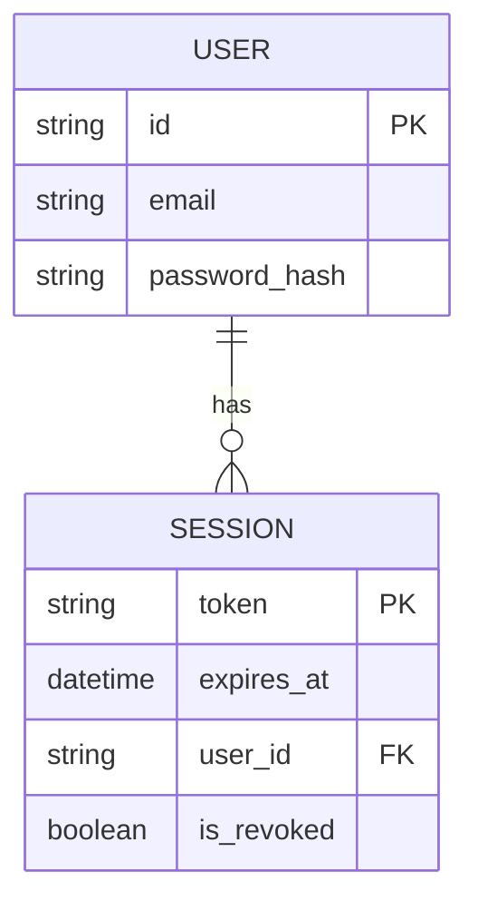
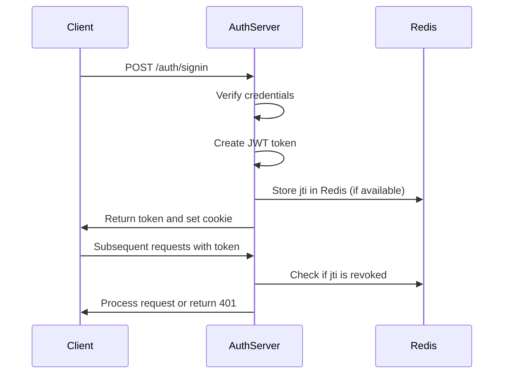
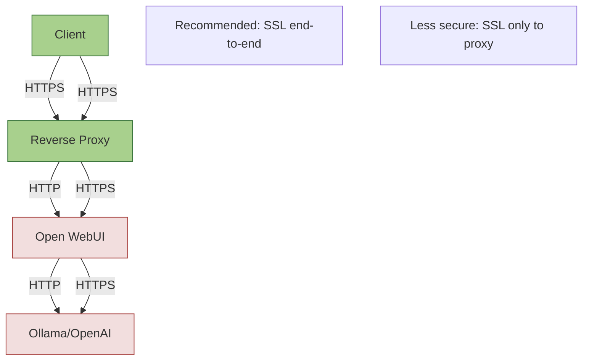
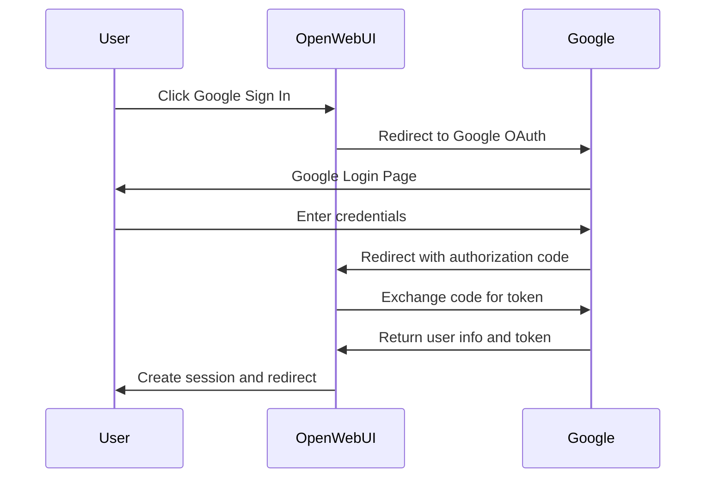

# Security Configuration

<cite>
**Referenced Files in This Document**   
- [.env.example](file://.env.example)
- [backend/open_webui/config.py](file://backend/open_webui/config.py)
- [backend/open_webui/env.py](file://backend/open_webui/env.py)
- [backend/open_webui/utils/auth.py](file://backend/open_webui/utils/auth.py)
- [backend/open_webui/utils/security_headers.py](file://backend/open_webui/utils/security_headers.py)
- [backend/open_webui/routers/auths.py](file://backend/open_webui/routers/auths.py)
- [backend/open_webui/main.py](file://backend/open_webui/main.py)
- [backend/open_webui/utils/oauth.py](file://backend/open_webui/utils/oauth.py)
</cite>

## Table of Contents
1. [Introduction](#introduction)
2. [Security Environment Variables](#security-environment-variables)
3. [JWT Authentication and Session Management](#jwt-authentication-and-session-management)
4. [Security Headers and CORS Configuration](#security-headers-and-cors-configuration)
5. [HTTPS/SSL Termination and Secure Cookie Policies](#httpsssl-termination-and-secure-cookie-policies)
6. [OAuth Provider Configuration](#oauth-provider-configuration)
7. [Best Practices for Securing Sensitive Data](#best-practices-for-securing-sensitive-data)
8. [Production Security Configuration Examples](#production-security-configuration-examples)
9. [Conclusion](#conclusion)

## Introduction
Open WebUI provides a comprehensive security framework to protect user data and ensure secure access to AI models and services. This document details the security configuration options available in Open WebUI, focusing on authentication mechanisms, session management, security headers, and secure deployment practices. The system implements multiple layers of security including JWT-based authentication, OAuth integration, security header enforcement, and secure cookie policies to protect against common web vulnerabilities.

**Section sources**
- [backend/open_webui/main.py](file://backend/open_webui/main.py#L440-L800)
- [backend/open_webui/config.py](file://backend/open_webui/config.py#L1-L800)

## Security Environment Variables
Open WebUI uses several environment variables to configure security settings. These variables control authentication, session management, and security policies.

### WEBUI_SECRET_KEY
The `WEBUI_SECRET_KEY` environment variable is used to sign and verify JWT tokens. This key should be a cryptographically secure random string and must be kept secret. It's used for both session tokens and JWT authentication.



**Diagram sources**
- [backend/open_webui/utils/auth.py](file://backend/open_webui/utils/auth.py#L51-L52)
- [backend/open_webui/env.py](file://backend/open_webui/env.py#L455-L460)

### WEBUI_JWT_SECRET_KEY
This is a deprecated environment variable that has been replaced by `WEBUI_SECRET_KEY`. For backward compatibility, if `WEBUI_SECRET_KEY` is not set, the system will fall back to using `WEBUI_JWT_SECRET_KEY`.

### OAUTH_ENABLE
The OAuth functionality is enabled by configuring specific OAuth provider credentials. When any of the following provider credentials are set, OAuth authentication becomes available:
- `GOOGLE_CLIENT_ID` and `GOOGLE_CLIENT_SECRET`
- `MICROSOFT_CLIENT_ID` and `MICROSOFT_CLIENT_SECRET`
- `GITHUB_CLIENT_ID` and `GITHUB_CLIENT_SECRET`

### SSL_ENABLE
SSL/TLS termination is typically handled at the reverse proxy level (e.g., Nginx, Apache). The system respects the `X-Forwarded-Proto` header to determine if the original request was HTTPS. When running behind a proxy, ensure that `FORWARDED_ALLOW_IPS` is properly configured.

**Section sources**
- [.env.example](file://.env.example#L1-L22)
- [backend/open_webui/env.py](file://backend/open_webui/env.py#L455-L460)
- [backend/open_webui/config.py](file://backend/open_webui/config.py#L314-L369)

## JWT Authentication and Session Management
Open WebUI implements JWT-based authentication for secure user sessions. The system uses HS256 algorithm to sign tokens with the secret key provided in the environment.

### Token Creation and Validation
When a user authenticates successfully, a JWT token is created containing the user's ID and a unique JWT ID (jti). The token includes an expiration timestamp based on the `JWT_EXPIRES_IN` configuration.



**Diagram sources**
- [backend/open_webui/utils/auth.py](file://backend/open_webui/utils/auth.py#L194-L242)
- [backend/open_webui/routers/auths.py](file://backend/open_webui/routers/auths.py#L558-L763)

### Session Management
The system implements secure session management with the following features:
- Token revocation: When a user signs out, the token's jti is stored in Redis with an expiration matching the token's remaining lifetime
- Secure cookies: Authentication tokens are stored in HTTP-only cookies with configurable SameSite and Secure attributes
- Token validation: All tokens are validated against Redis to check for revocation

The session cookie security is configured through the following environment variables:
- `WEBUI_SESSION_COOKIE_SAME_SITE`: Configures the SameSite attribute (default: "lax")
- `WEBUI_SESSION_COOKIE_SECURE`: Configures the Secure attribute (default: false)
- `WEBUI_AUTH_COOKIE_SAME_SITE`: Authentication cookie SameSite (defaults to session value)
- `WEBUI_AUTH_COOKIE_SECURE`: Authentication cookie Secure flag (defaults to session value)

**Section sources**
- [backend/open_webui/utils/auth.py](file://backend/open_webui/utils/auth.py#L194-L242)
- [backend/open_webui/routers/auths.py](file://backend/open_webui/routers/auths.py#L106-L140)

## Security Headers and CORS Configuration
Open WebUI provides comprehensive security header configuration through environment variables, allowing administrators to enforce security policies at the HTTP level.

### Security Headers
The system supports the following security headers, configurable via environment variables:

```mermaid
flowchart TD
A[Security Headers Middleware] --> B{Environment Variable Set?}
B --> |Yes| C[Apply Header Value]
B --> |No| D[Apply Default Value]
C --> E[Add to Response Headers]
D --> E
E --> F[Return Response]
subgraph Header Types
G[CACHE_CONTROL]
H[HSTS]
I[PERMISSIONS_POLICY]
J[REFERRER_POLICY]
K[XCONTENT_TYPE]
L[XDOWNLOAD_OPTIONS]
M[XFRAME_OPTIONS]
N[XPERMITTED_CROSS_DOMAIN_POLICIES]
O[CONTENT_SECURITY_POLICY]
end
A --> Header Types
```

**Diagram sources**
- [backend/open_webui/utils/security_headers.py](file://backend/open_webui/utils/security_headers.py#L1-L133)

Each header has validation and default values:
- **HSTS**: Must match pattern `^max-age=(\d+)(;includeSubDomains)?(;preload)?$`, defaults to `max-age=31536000;includeSubDomains`
- **X-Frame-Options**: Must be `DENY` or `SAMEORIGIN`, defaults to `DENY`
- **Permissions-Policy**: Validates against allowed features, defaults to `none`
- **Referrer-Policy**: Must be a valid referrer policy, defaults to `no-referrer`
- **Cache-Control**: Validates cache directives, defaults to `no-store, max-age=0`
- **X-Content-Type-Options**: Must be `nosniff`, defaults to `nosniff`
- **X-Download-Options**: Must be `noopen`, defaults to `noopen`
- **X-Permitted-Cross-Domain-Policies**: Must be a valid value, defaults to `none`

### CORS Configuration
Cross-Origin Resource Sharing (CORS) is configured using the `CORS_ALLOW_ORIGIN` environment variable. This variable accepts a semicolon-separated list of allowed origins. For production deployments, it's recommended to specify exact origins rather than using wildcard (`*`).

The CORS middleware is configured in the main application with the following settings:
- Supports credentials
- Allows all methods and headers
- Respects the `CORS_ALLOW_ORIGIN` environment variable

**Section sources**
- [backend/open_webui/utils/security_headers.py](file://backend/open_webui/utils/security_headers.py#L1-L133)
- [backend/open_webui/main.py](file://backend/open_webui/main.py#L410-L411)

## HTTPS/SSL Termination and Secure Cookie Policies
Proper SSL/TLS configuration is critical for securing Open WebUI deployments. The system provides mechanisms to ensure secure communication and cookie handling.

### SSL Termination
SSL termination should be handled at the reverse proxy level. When configuring SSL, consider the following:



**Diagram sources**
- [docs/apache.md](file://docs/apache.md#L1-L160)
- [backend/open_webui/main.py](file://backend/open_webui/main.py#L459-L460)

### Secure Cookie Policies
The system implements secure cookie policies to prevent session hijacking:
- **HttpOnly**: Authentication cookies are marked HttpOnly to prevent access via JavaScript
- **Secure**: Cookies can be configured to only transmit over HTTPS connections
- **SameSite**: Configurable SameSite policy to prevent CSRF attacks

The cookie security settings are controlled by environment variables:
- `WEBUI_SESSION_COOKIE_SECURE`: Set to `true` in production to ensure cookies are only sent over HTTPS
- `WEBUI_AUTH_COOKIE_SECURE`: Authentication cookie Secure flag
- `WEBUI_SESSION_COOKIE_SAME_SITE`: Recommended to use `lax` or `strict` in production

**Section sources**
- [backend/open_webui/env.py](file://backend/open_webui/env.py#L462-L478)
- [backend/open_webui/routers/auths.py](file://backend/open_webui/routers/auths.py#L137-L138)

## OAuth Provider Configuration
Open WebUI supports integration with multiple OAuth providers including Google, Microsoft, and GitHub. Each provider requires specific configuration.

### Google OAuth
To configure Google OAuth, set the following environment variables:
- `GOOGLE_CLIENT_ID`: Your Google OAuth client ID
- `GOOGLE_CLIENT_SECRET`: Your Google OAuth client secret
- `GOOGLE_OAUTH_SCOPE`: OAuth scope (default: "openid email profile")
- `GOOGLE_REDIRECT_URI`: Redirect URI (typically your domain + /oauth/callback/google)



**Diagram sources**
- [backend/open_webui/config.py](file://backend/open_webui/config.py#L346-L369)
- [backend/open_webui/utils/oauth.py](file://backend/open_webui/utils/oauth.py#L636-L657)

### Microsoft OAuth
Microsoft OAuth configuration requires:
- `MICROSOFT_CLIENT_ID`: Microsoft OAuth client ID
- `MICROSOFT_CLIENT_SECRET`: Microsoft OAuth client secret
- `MICROSOFT_CLIENT_TENANT_ID`: Azure AD tenant ID
- `MICROSOFT_CLIENT_LOGIN_BASE_URL`: Login URL (default: "https://login.microsoftonline.com")
- `MICROSOFT_OAUTH_SCOPE`: OAuth scope (default: "openid email profile")

### GitHub OAuth
GitHub OAuth configuration requires:
- `GITHUB_CLIENT_ID`: GitHub OAuth client ID
- `GITHUB_CLIENT_SECRET`: GitHub OAuth client secret
- `GITHUB_CLIENT_SCOPE`: OAuth scope (default: "user:email")
- `GITHUB_CLIENT_REDIRECT_URI`: Redirect URI for GitHub callback

### OAuth Security Features
The system implements several security features for OAuth:
- Token encryption: OAuth client information is encrypted using Fernet encryption
- Session management: OAuth sessions are stored server-side with expiration tracking
- Group and role management: OAuth claims can be mapped to application roles and groups
- Domain restrictions: OAuth logins can be restricted to specific email domains

**Section sources**
- [backend/open_webui/config.py](file://backend/open_webui/config.py#L346-L722)
- [backend/open_webui/utils/oauth.py](file://backend/open_webui/utils/oauth.py#L109-L131)

## Best Practices for Securing Sensitive Data
Implementing proper security practices is essential for protecting user data and preventing common vulnerabilities.

### Preventing XSS Attacks
To prevent Cross-Site Scripting (XSS) attacks:
- Always set `X-Content-Type-Options: nosniff` to prevent MIME type sniffing
- Use `Content-Security-Policy` to restrict script sources
- Validate and sanitize all user input
- Use secure cookie attributes (HttpOnly, Secure, SameSite)

### Preventing CSRF Attacks
To prevent Cross-Site Request Forgery (CSRF) attacks:
- Use SameSite cookie attributes (recommended: `lax` or `strict`)
- Implement proper authentication token validation
- Use CSRF tokens for state-changing operations
- Validate the `Origin` and `Referer` headers for sensitive operations

### Preventing Insecure Direct Object References
To prevent Insecure Direct Object References (IDOR):
- Implement proper access control checks for all resources
- Use UUIDs instead of sequential IDs for resource identifiers
- Validate that users have permission to access requested resources
- Implement rate limiting to prevent enumeration attacks

### Securing Sensitive Configuration
Best practices for securing sensitive configuration data:
- Never commit secrets to version control
- Use environment variables for sensitive data
- Rotate secrets regularly
- Limit access to configuration files
- Use strong, randomly generated secret keys

**Section sources**
- [backend/open_webui/utils/security_headers.py](file://backend/open_webui/utils/security_headers.py#L1-L133)
- [backend/open_webui/utils/auth.py](file://backend/open_webui/utils/auth.py#L163-L193)

## Production Security Configuration Examples
The following examples demonstrate secure configuration for production deployments.

### Example 1: Basic Production Configuration
```env
# Security keys - use strong, randomly generated values
WEBUI_SECRET_KEY=your_strong_secret_key_here
JWT_EXPIRES_IN=24h

# OAuth providers - configure as needed
GOOGLE_CLIENT_ID=your_google_client_id
GOOGLE_CLIENT_SECRET=your_google_client_secret

# Security headers
HSTS=max-age=31536000;includeSubDomains;preload
XFRAME_OPTIONS=DENY
REFERRER_POLICY=strict-origin-when-cross-origin
CACHE_CONTROL=no-store, max-age=0
XCONTENT_TYPE=nosniff

# CORS - specify exact origins
CORS_ALLOW_ORIGIN=https://yourdomain.com;https://www.yourdomain.com

# Cookie security
WEBUI_SESSION_COOKIE_SECURE=true
WEBUI_AUTH_COOKIE_SECURE=true
WEBUI_SESSION_COOKIE_SAME_SITE=strict

# Rate limiting and security
SIGNIN_RATE_LIMIT=5/3m
```

### Example 2: High-Security Configuration with Redis
```env
# Security configuration with Redis for session management
WEBUI_SECRET_KEY=your_strong_secret_key_here
JWT_EXPIRES_IN=1h

# Redis configuration for secure session storage
REDIS_URL=redis://localhost:6379
REDIS_KEY_PREFIX=open-webui

# Enhanced security headers
HSTS=max-age=31536000;includeSubDomains;preload
XFRAME_OPTIONS=DENY
PERMISSIONS_POLICY=accelerometer=(),autoplay=(),camera=(),clipboard-read=(),clipboard-write=(),fullscreen=(),geolocation=(),gyroscope=(),magnetometer=(),microphone=(),midi=(),payment=(),picture-in-picture=(),sync-xhr=(),usb=(),xr-spatial-tracking=()
REFERRER_POLICY=strict-origin
CACHE_CONTROL=no-store, max-age=0
XCONTENT_TYPE=nosniff
XDOWNLOAD_OPTIONS=noopen
XPERMITTED_CROSS_DOMAIN_POLICIES=none

# Content Security Policy - restrict to trusted sources
CONTENT_SECURITY_POLICY=default-src 'self'; script-src 'self' 'unsafe-inline'; style-src 'self' 'unsafe-inline'; img-src 'self' data: https:; font-src 'self' data:; frame-ancestors 'none'; form-action 'self'

# CORS - restrict to specific domains
CORS_ALLOW_ORIGIN=https://yourdomain.com

# Cookie security - strict settings
WEBUI_SESSION_COOKIE_SECURE=true
WEBUI_AUTH_COOKIE_SECURE=true
WEBUI_SESSION_COOKIE_SAME_SITE=strict

# OAuth security
ENABLE_OAUTH_SIGNUP=false
OAUTH_ALLOWED_DOMAINS=yourcompany.com
OAUTH_ALLOWED_ROLES=user,admin
```

### Example 3: Reverse Proxy Configuration (Apache)
For deployments behind an Apache reverse proxy, configure SSL termination and security headers:

```apache
<VirtualHost *:443>
    ServerName yourdomain.com
    
    SSLEngine on
    SSLCertificateFile /path/to/certificate.crt
    SSLCertificateKeyFile /path/to/private.key
    
    # Security headers
    Header always set Strict-Transport-Security "max-age=31536000; includeSubDomains; preload"
    Header always set X-Frame-Options "DENY"
    Header always set X-Content-Type-Options "nosniff"
    Header always set Referrer-Policy "strict-origin-when-cross-origin"
    Header always set Cache-Control "no-store, max-age=0"
    
    # Proxy configuration
    ProxyPreserveHost On
    ProxyPass / http://localhost:3000/
    ProxyPassReverse / http://localhost:3000/
    
    # WebSocket support
    ProxyPass /ws/ ws://localhost:3000/ws/
    ProxyPassReverse /ws/ ws://localhost:3000/ws/
</VirtualHost>
```

**Section sources**
- [.env.example](file://.env.example#L1-L22)
- [docs/apache.md](file://docs/apache.md#L1-L160)
- [backend/open_webui/utils/security_headers.py](file://backend/open_webui/utils/security_headers.py#L1-L133)

## Conclusion
Open WebUI provides a robust security framework that can be configured to meet various security requirements. By properly configuring environment variables, implementing secure deployment practices, and following security best practices, administrators can ensure that their Open WebUI instances are protected against common web vulnerabilities. Key security considerations include using strong secret keys, enabling HTTPS, configuring appropriate security headers, and properly managing OAuth integrations. Regular security reviews and updates are recommended to maintain a secure environment.