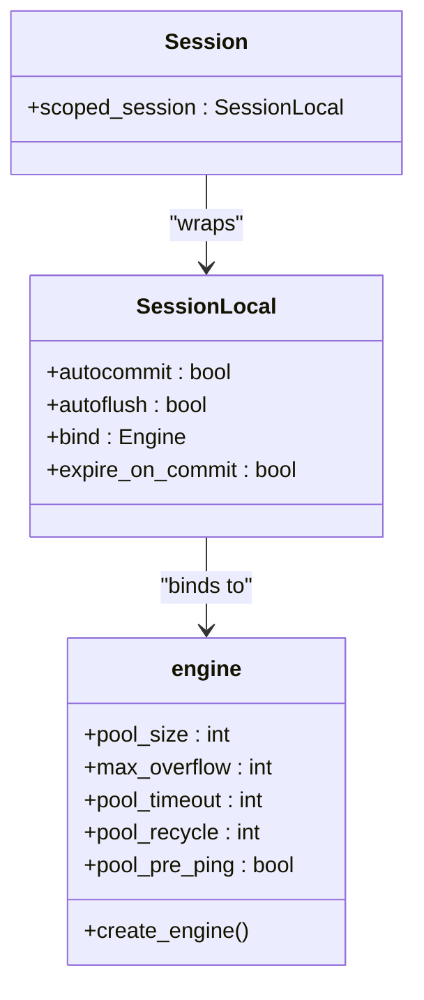
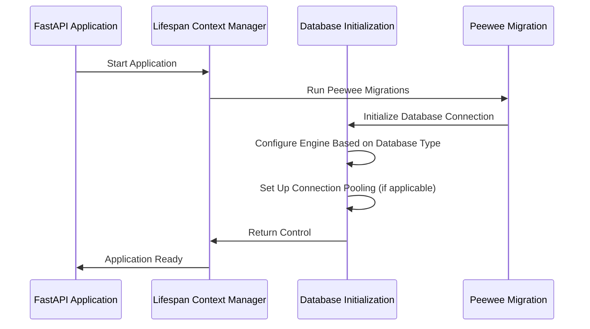
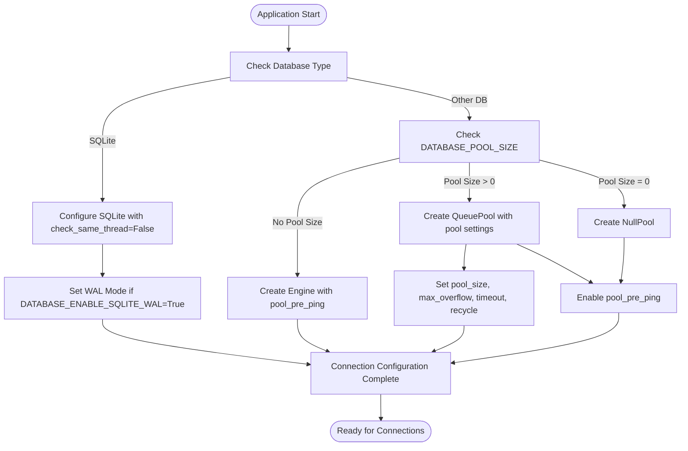

# Database Initialization

<cite>
**Referenced Files in This Document**   
- [main.py](file://backend/open_webui/main.py)
- [db.py](file://backend/open_webui/internal/db.py)
- [env.py](file://backend/open_webui/env.py)
- [config.py](file://backend/open_webui/config.py)
</cite>

## Table of Contents
1. [Introduction](#introduction)
2. [Database Engine and Session Management](#database-engine-and-session-management)
3. [Database Connection Initialization](#database-connection-initialization)
4. [Environment Variables for Database Configuration](#environment-variables-for-database-configuration)
5. [Connection Pooling and Thread Settings](#connection-pooling-and-thread-settings)
6. [Database Connectivity Verification](#database-connectivity-verification)
7. [Troubleshooting Common Connection Issues](#troubleshooting-common-connection-issues)
8. [Best Practices for Production Environments](#best-practices-for-production-environments)
9. [Conclusion](#conclusion)

## Introduction
This document provides comprehensive guidance on database initialization for open-webui, focusing on the setup process using SQLAlchemy for database engine creation and session management. The documentation covers the initialization of database connections, configuration of the engine with connection pooling and thread settings, environment variables affecting database connectivity and performance, verification of database connectivity during startup, and troubleshooting common connection issues. Additionally, it includes best practices for database configuration in production environments, including connection pooling settings and SSL configuration.

**Section sources**
- [main.py](file://backend/open_webui/main.py#L1-L2352)
- [db.py](file://backend/open_webui/internal/db.py#L1-L165)

## Database Engine and Session Management
The open-webui application utilizes SQLAlchemy for database engine creation and session management. The database engine is configured based on the database type specified in the environment variables, with different configurations for SQLite, PostgreSQL, and other database systems. For SQLite databases, the engine is created with specific connection arguments to handle threading, while for other databases, connection pooling parameters are applied when specified.

The session management system uses SQLAlchemy's scoped_session in conjunction with sessionmaker to provide thread-safe database sessions. The Session object is configured as a scoped session that ensures each thread receives its own session instance, preventing thread-safety issues in concurrent environments. The session is configured with autocommit set to False and autoflush set to False to provide explicit control over transaction boundaries.



**Diagram sources**
- [db.py](file://backend/open_webui/internal/db.py#L148-L153)

**Section sources**
- [db.py](file://backend/open_webui/internal/db.py#L83-L165)

## Database Connection Initialization
The database connection initialization process in open-webui begins in the main.py file where the FastAPI application is configured. The database engine and session are imported from the internal db module and made available to the application state. During application startup, the database connection is established through the lifespan context manager, which ensures proper initialization and cleanup of database resources.

The initialization process first checks for the presence of a legacy database file (ollama.db) and migrates it to the current database name (webui.db) if found. The database URL is constructed from environment variables, with special handling for PostgreSQL URLs to ensure the correct protocol prefix (postgresql:// instead of postgres://). For SQLite databases, additional configuration options are available, including the ability to enable WAL (Write-Ahead Logging) mode for improved concurrency.



**Diagram sources**
- [main.py](file://backend/open_webui/main.py#L569-L655)
- [db.py](file://backend/open_webui/internal/db.py#L80-L165)

**Section sources**
- [main.py](file://backend/open_webui/main.py#L569-L655)
- [db.py](file://backend/open_webui/internal/db.py#L80-L165)

## Environment Variables for Database Configuration
The open-webui application uses several environment variables to configure database connectivity and performance. These variables allow for flexible configuration across different deployment environments and database types. The primary environment variables include:

- **DATABASE_URL**: Specifies the connection URL for the database, supporting various database types including SQLite, PostgreSQL, and others.
- **DATABASE_TYPE**: Defines the type of database being used (e.g., sqlite, postgresql).
- **DATABASE_USER**: Username for database authentication.
- **DATABASE_PASSWORD**: Password for database authentication.
- **DATABASE_HOST**: Hostname or IP address of the database server.
- **DATABASE_PORT**: Port number for the database connection.
- **DATABASE_NAME**: Name of the database to connect to.
- **DATABASE_SCHEMA**: Schema name for the database (used with PostgreSQL).
- **DATABASE_POOL_SIZE**: Number of connections to maintain in the connection pool.
- **DATABASE_POOL_MAX_OVERFLOW**: Maximum number of connections that can be created beyond the pool size.
- **DATABASE_POOL_TIMEOUT**: Timeout for acquiring a connection from the pool.
- **DATABASE_POOL_RECYCLE**: Time interval after which connections are recycled.
- **DATABASE_ENABLE_SQLITE_WAL**: Enables WAL mode for SQLite databases to improve concurrency.

These environment variables provide comprehensive control over database configuration, allowing administrators to optimize performance and reliability based on their specific requirements and infrastructure.

**Section sources**
- [env.py](file://backend/open_webui/env.py#L272-L352)
- [db.py](file://backend/open_webui/internal/db.py#L11-L18)

## Connection Pooling and Thread Settings
The open-webui application implements sophisticated connection pooling and thread management to ensure optimal database performance and reliability. For non-SQLite databases, the application configures SQLAlchemy's connection pool with parameters derived from environment variables. When DATABASE_POOL_SIZE is specified and greater than zero, the application creates a QueuePool with the specified size, maximum overflow, timeout, and recycle settings. The pool_pre_ping parameter is always enabled to verify the health of connections before they are used, helping to prevent errors from stale connections.

For SQLite databases, the application uses a different approach due to SQLite's threading limitations. The engine is created with connect_args={"check_same_thread": False} to allow the database connection to be used across multiple threads. Additionally, an event listener is configured to execute PRAGMA commands when connections are established, enabling WAL mode if DATABASE_ENABLE_SQLITE_WAL is set to true. This improves concurrency by allowing multiple readers to coexist with a single writer.

The application also configures the thread pool size for FastAPI/AnyIO through the THREAD_POOL_SIZE environment variable, which controls the number of worker threads available for handling requests. This setting helps balance the load between database operations and other application tasks.



**Diagram sources**
- [db.py](file://backend/open_webui/internal/db.py#L114-L146)

**Section sources**
- [db.py](file://backend/open_webui/internal/db.py#L114-L146)
- [main.py](file://backend/open_webui/main.py#L599-L602)

## Database Connectivity Verification
The open-webui application includes built-in mechanisms to verify database connectivity during startup and at runtime. The primary verification method is implemented through the healthcheck_with_db endpoint, which executes a simple SQL query (SELECT 1;) against the database to confirm connectivity. This endpoint is accessible at /health/db and returns a 200 status code with {"status": true} when the database connection is healthy.

During application startup, the database connection is automatically tested as part of the initialization process. The application attempts to establish a connection to the database using the configured URL and credentials. If the connection fails, the application logs an error message and may raise an exception, preventing the application from starting with an invalid database configuration.

The application also implements connection health checks through SQLAlchemy's pool_pre_ping feature, which verifies the health of a connection before it is used from the connection pool. This helps prevent errors caused by stale or broken connections, particularly in environments with network instability or database server restarts.

```mermaid
sequenceDiagram
participant Client as Client Application
participant API as FastAPI Endpoint
participant DB as Database
Client->>API : GET /health/db
API->>DB : Execute "SELECT 1;"
DB-->>API : Return result
API-->>Client : HTTP 200 {"status" : true}
Note over API,DB : Connection verification successful
```

**Diagram sources**
- [main.py](file://backend/open_webui/main.py#L2306-L2309)

**Section sources**
- [main.py](file://backend/open_webui/main.py#L2306-L2309)

## Troubleshooting Common Connection Issues
When encountering database connection issues in open-webui, several common problems and their solutions should be considered:

**Authentication Failures**: These typically occur when the database username or password is incorrect. Verify that the DATABASE_USER and DATABASE_PASSWORD environment variables are correctly set and that the credentials have the necessary permissions to access the database. For SQLite databases with SQLCipher encryption, ensure that the DATABASE_PASSWORD is provided and correct.

**Network Timeouts**: These issues may arise when the database server is unreachable or experiencing high latency. Check the DATABASE_HOST and DATABASE_PORT settings, ensure that the database server is running, and verify network connectivity between the application and database server. Adjust the DATABASE_POOL_TIMEOUT value if necessary to accommodate slower network conditions.

**Incorrect Connection Strings**: Verify that the DATABASE_URL is correctly formatted for the database type being used. For PostgreSQL databases, ensure that the URL uses the postgresql:// prefix rather than postgres://. For SQLite databases, confirm that the file path is correct and that the application has write permissions to the directory containing the database file.

**Connection Pool Exhaustion**: If the application is unable to acquire database connections, check the DATABASE_POOL_SIZE and DATABASE_POOL_MAX_OVERFLOW settings. Increase these values if the application is handling a high volume of concurrent requests. Monitor the application logs for messages indicating that connections are timing out or being recycled.

**SQLite Locking Issues**: When using SQLite, ensure that DATABASE_ENABLE_SQLITE_WAL is set to true to enable WAL mode, which improves concurrency. If multiple processes are accessing the database, consider switching to a client-server database system like PostgreSQL.

**SSL Configuration Issues**: For databases requiring SSL connections, ensure that the appropriate SSL parameters are included in the connection URL or that the database driver is configured to use SSL. Check the database server's SSL configuration and certificate validity.

**Section sources**
- [env.py](file://backend/open_webui/env.py#L272-L352)
- [db.py](file://backend/open_webui/internal/db.py#L86-L113)
- [main.py](file://backend/open_webui/main.py#L2306-L2309)

## Best Practices for Production Environments
For optimal performance and reliability in production environments, the following best practices should be implemented for database configuration in open-webui:

**Connection Pooling Settings**: Configure appropriate connection pool sizes based on the expected workload. For moderate to high traffic applications, set DATABASE_POOL_SIZE to a value that balances resource usage with performance needs (typically 10-50 connections). Set DATABASE_POOL_MAX_OVERFLOW to allow for temporary spikes in traffic, and configure DATABASE_POOL_RECYCLE to prevent connection staleness (recommended: 300-600 seconds).

**SSL Configuration**: Enable SSL/TLS encryption for database connections to protect data in transit. For PostgreSQL, include sslmode=require or sslmode=verify-ca in the DATABASE_URL. Ensure that the database server has a valid SSL certificate from a trusted certificate authority.

**Monitoring and Logging**: Enable detailed database logging to monitor query performance and identify potential issues. Configure appropriate log levels for database operations and regularly review logs for slow queries or connection errors.

**Backup and Recovery**: Implement regular database backups and test the recovery process. For SQLite databases, ensure that backups are performed when the database is not actively being written to, or use WAL mode to allow for hot backups.

**Resource Limits**: Set appropriate resource limits on the database server to prevent a single application from consuming excessive resources. Configure query timeouts and memory limits to prevent long-running queries from impacting overall system performance.

**High Availability**: For critical applications, consider implementing database replication and failover mechanisms. Use connection strings that support multiple hosts or implement a load balancer in front of multiple database servers.

**Security**: Use strong, unique passwords for database authentication and rotate them periodically. Limit database user permissions to the minimum required for the application to function. Regularly update the database server and client libraries to address security vulnerabilities.

**Section sources**
- [env.py](file://backend/open_webui/env.py#L312-L352)
- [db.py](file://backend/open_webui/internal/db.py#L129-L146)

## Conclusion
The database initialization process in open-webui is a comprehensive system that provides robust database connectivity and management through SQLAlchemy. The application supports multiple database types with flexible configuration options through environment variables, allowing for easy adaptation to different deployment scenarios. The implementation of connection pooling, thread-safe session management, and health checks ensures reliable database operations even under heavy load.

By following the best practices outlined in this document, administrators can optimize database performance and reliability in production environments. The combination of proper connection pooling settings, SSL encryption, monitoring, and security measures provides a solid foundation for deploying open-webui in mission-critical applications.

The health check endpoints and comprehensive error logging make troubleshooting connection issues straightforward, while the modular design allows for easy adaptation to different database backends and infrastructure requirements.