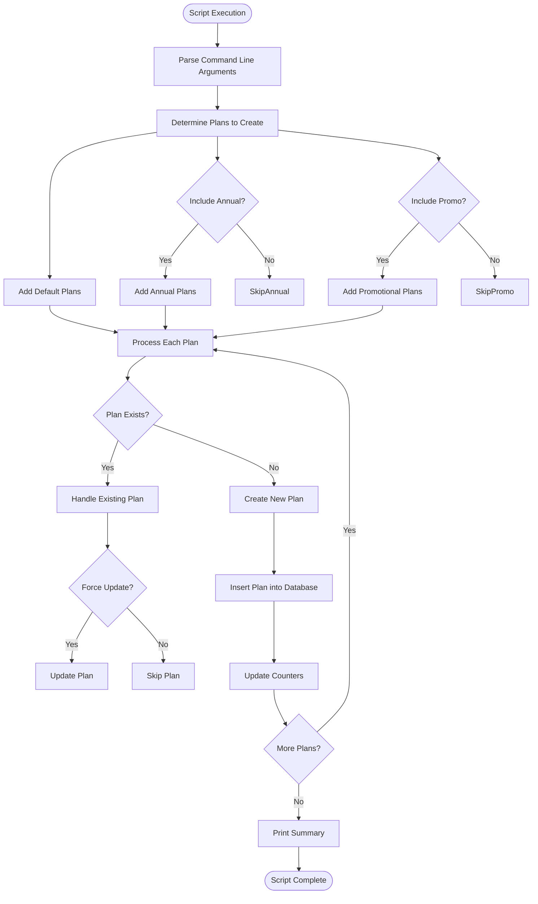
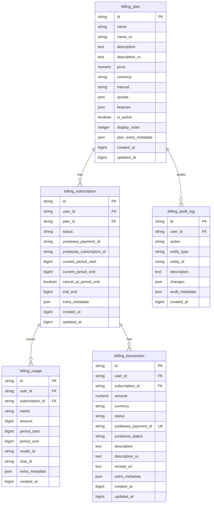
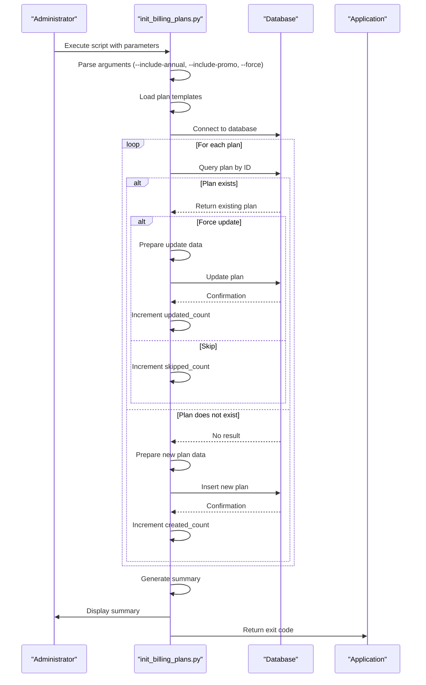
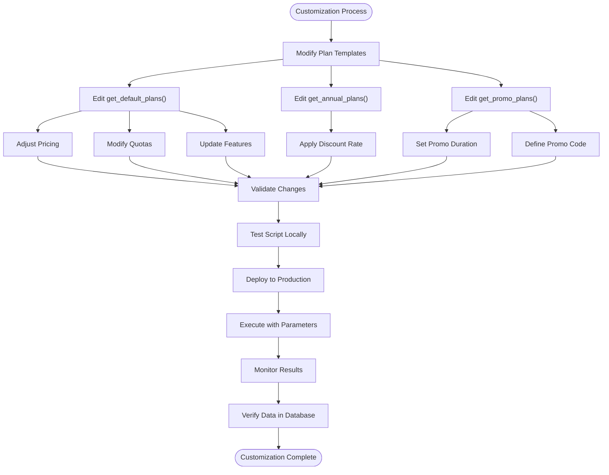
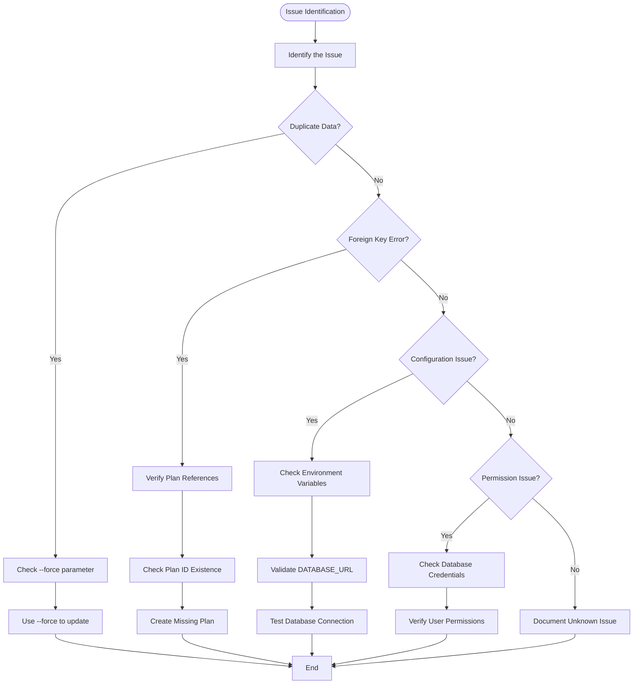

# Initial Data Population

<cite>
**Referenced Files in This Document**   
- [init_billing_plans.py](file://backend/scripts/init_billing_plans.py)
- [main.py](file://backend/open_webui/main.py)
- [billing.py](file://backend/open_webui/models/billing.py)
- [plan_templates.py](file://backend/open_webui/utils/plan_templates.py)
- [db.py](file://backend/open_webui/internal/db.py)
- [b2f8a9c1d5e3_add_billing_tables.py](file://backend/open_webui/migrations/versions/b2f8a9c1d5e3_add_billing_tables.py)
- [env.py](file://backend/open_webui/env.py)
</cite>

## Table of Contents
1. [Introduction](#introduction)
2. [Billing Plan Initialization Script](#billing-plan-initialization-script)
3. [Database Schema and Migration](#database-schema-and-migration)
4. [Application Lifecycle Integration](#application-lifecycle-integration)
5. [Customization and Extension](#customization-and-extension)
6. [Common Issues and Troubleshooting](#common-issues-and-troubleshooting)
7. [Conclusion](#conclusion)

## Introduction
This document provides comprehensive guidance on the initial data population process for open-webui, with a focus on the initialization of billing plans through the `init_billing_plans.py` script. The system requires specific initial data to function properly, particularly for the billing functionality that manages subscription plans, user quotas, and payment processing. The initialization process ensures that the database contains the necessary default billing configurations when the application starts for the first time. This documentation covers the technical implementation, integration with the application lifecycle, customization options, and common issues related to initial data setup.

## Billing Plan Initialization Script

The `init_billing_plans.py` script is responsible for populating the system with default billing plan configurations. This standalone Python script can be executed independently to initialize or update the billing plans in the database. The script follows a structured approach to ensure data consistency and prevent duplicate entries.

The initialization process begins by importing the necessary modules and setting up the Python path to access the application's core components. It imports the `Plans` model from `open_webui.models.billing` and plan template functions from `open_webui.utils.plan_templates`. The script defines an `init_plans` function that orchestrates the creation of billing plans based on templates, with options to include annual and promotional plans.

**Diagram sources**
- [init_billing_plans.py](file://backend/scripts/init_billing_plans.py#L29-L74)

**Section sources**
- [init_billing_plans.py](file://backend/scripts/init_billing_plans.py#L1-L120)

## Database Schema and Migration

The billing system relies on a well-defined database schema that was created through Alembic migrations. The migration script `b2f8a9c1d5e3_add_billing_tables.py` establishes the necessary tables for the billing functionality, including `billing_plan`, `billing_subscription`, `billing_usage`, and `billing_transaction`. These tables form the foundation for the initial data population process.

The `billing_plan` table is central to the initialization process, storing the configuration for each subscription tier. It includes fields for the plan ID, name, description, pricing information, quotas, features, and metadata. The script connects to the database through the SQLAlchemy ORM layer, using the `Plans` singleton instance that provides CRUD operations for the billing plan data. The database connection is established through the `get_db` context manager in `db.py`, which handles session management and transaction boundaries.

**Diagram sources**
- [b2f8a9c1d5e3_add_billing_tables.py](file://backend/open_webui/migrations/versions/b2f8a9c1d5e3_add_billing_tables.py#L18-L187)
- [billing.py](file://backend/open_webui/models/billing.py#L54-L292)

**Section sources**
- [b2f8a9c1d5e3_add_billing_tables.py](file://backend/open_webui/migrations/versions/b2f8a9c1d5e3_add_billing_tables.py#L1-L187)
- [db.py](file://backend/open_webui/internal/db.py#L1-L165)

## Application Lifecycle Integration

The initialization of billing plans is integrated into the application lifecycle through conditional execution based on configuration settings in `main.py`. The application's startup process includes a comprehensive initialization sequence that ensures all required components are properly configured before the service becomes available.

During the application startup, the `lifespan` context manager in `main.py` executes various initialization tasks. While the billing plan initialization is not automatically executed on every startup, the configuration system provides mechanisms to trigger it when needed. The `RESET_CONFIG_ON_START` environment variable can be set to reset the configuration, which could be extended to include billing plan initialization.

The script is designed to be idempotent, meaning it can be safely executed multiple times without creating duplicate data. When a plan with a specific ID already exists in the database, the script checks the `force` parameter to determine whether to update the existing plan or skip it. This behavior prevents data inconsistencies during first-time setup and subsequent deployments.

**Diagram sources**
- [main.py](file://backend/open_webui/main.py#L574-L575)
- [init_billing_plans.py](file://backend/scripts/init_billing_plans.py#L77-L119)

**Section sources**
- [main.py](file://backend/open_webui/main.py#L569-L655)
- [init_billing_plans.py](file://backend/scripts/init_billing_plans.py#L77-L119)

## Customization and Extension

The initial data population process can be customized and extended to accommodate different deployment scenarios. The `init_billing_plans.py` script provides command-line arguments that allow administrators to control which plans are created: `--include-annual` for annual subscription plans with a 20% discount, `--include-promo` for promotional plans, and `--force` to overwrite existing plans.

Customization can be achieved by modifying the plan templates in `plan_templates.py`. This module contains three functions: `get_default_plans()`, `get_annual_plans()`, and `get_promo_plans()`, each returning a list of plan configurations as dictionaries. Administrators can modify these templates to adjust pricing, quotas, features, or add new plan tiers specific to their deployment requirements.

For extending the initialization process with additional data sets, developers can create similar scripts for other entities such as user roles, default configurations, or system settings. The pattern established by `init_billing_plans.py` can be replicated, using the appropriate models and data templates. The script's modular design makes it easy to extend by adding new template functions and corresponding command-line arguments.

**Diagram sources**
- [plan_templates.py](file://backend/open_webui/utils/plan_templates.py#L10-L305)
- [init_billing_plans.py](file://backend/scripts/init_billing_plans.py#L79-L89)

**Section sources**
- [plan_templates.py](file://backend/open_webui/utils/plan_templates.py#L1-L305)
- [init_billing_plans.py](file://backend/scripts/init_billing_plans.py#L79-L89)

## Common Issues and Troubleshooting

Several common issues may arise during the initial data population process, particularly related to duplicate data insertion, foreign key constraints, and environment-specific configuration requirements. Understanding these issues and their solutions is crucial for ensuring a smooth deployment.

Duplicate data insertion is prevented by the script's design, which checks for existing plans before creating new ones. However, if the `force` parameter is not used when updates are needed, changes to plan templates may not be reflected in the database. Administrators should use the `--force` flag when they need to update existing plans with new configurations.

Foreign key constraints are not a concern for the billing plan initialization itself, as the `billing_plan` table is a top-level entity. However, when creating subscriptions or usage records that reference plans, it's essential to ensure the referenced plan IDs exist. This is typically handled by the application logic, but during bulk data operations, foreign key violations could occur if plan IDs are incorrect.

Environment-specific configuration requirements include setting the appropriate database connection parameters and ensuring the script can access the database. The script relies on the same environment variables as the main application, particularly `DATABASE_URL`. In containerized deployments, network connectivity between the script and database container must be properly configured.

**Diagram sources**
- [init_billing_plans.py](file://backend/scripts/init_billing_plans.py#L53-L61)
- [env.py](file://backend/open_webui/env.py#L11-L20)

**Section sources**
- [init_billing_plans.py](file://backend/scripts/init_billing_plans.py#L53-L61)
- [env.py](file://backend/open_webui/env.py#L11-L20)

## Conclusion
The initial data population process for open-webui, particularly the initialization of billing plans, is a critical step in setting up the application for production use. The `init_billing_plans.py` script provides a robust mechanism for populating the database with default billing configurations, with safeguards against duplicate data insertion and options for customization. The integration with the application lifecycle through configuration settings ensures that the initialization can be controlled based on deployment requirements. By understanding the database schema, customization options, and common issues, administrators can effectively manage the initial data setup and ensure the billing system functions correctly from the start.