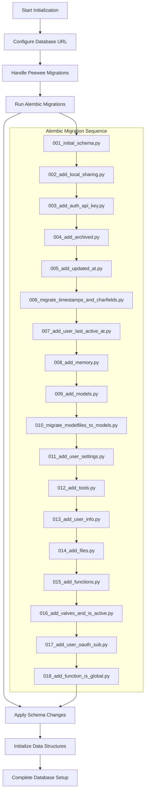
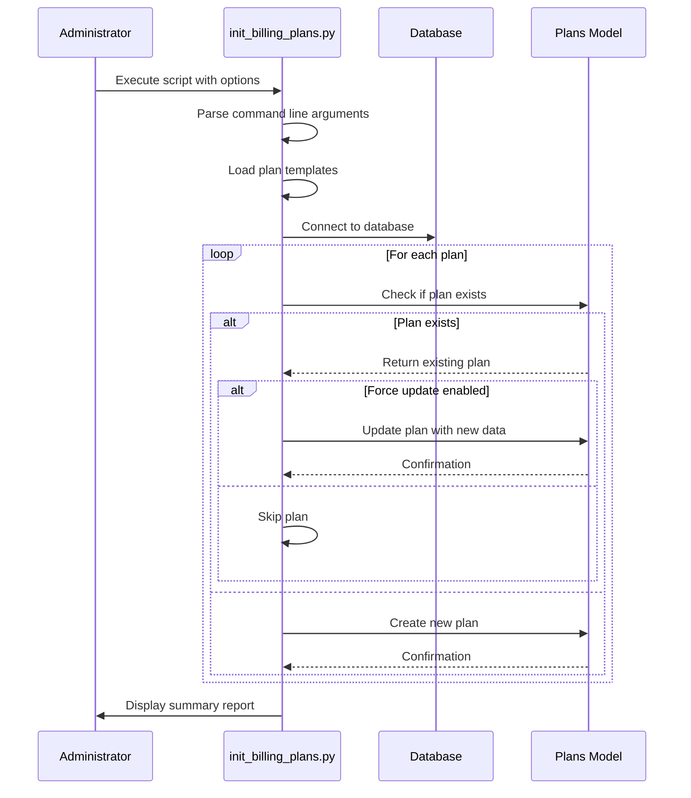
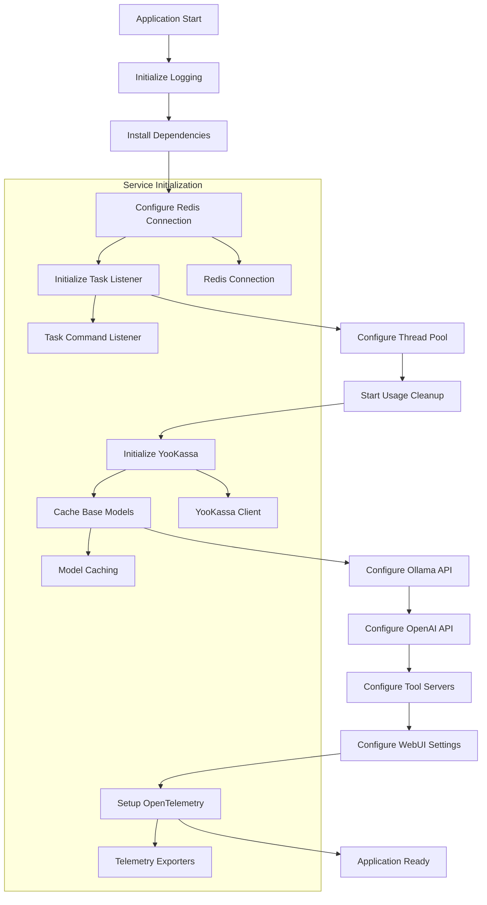
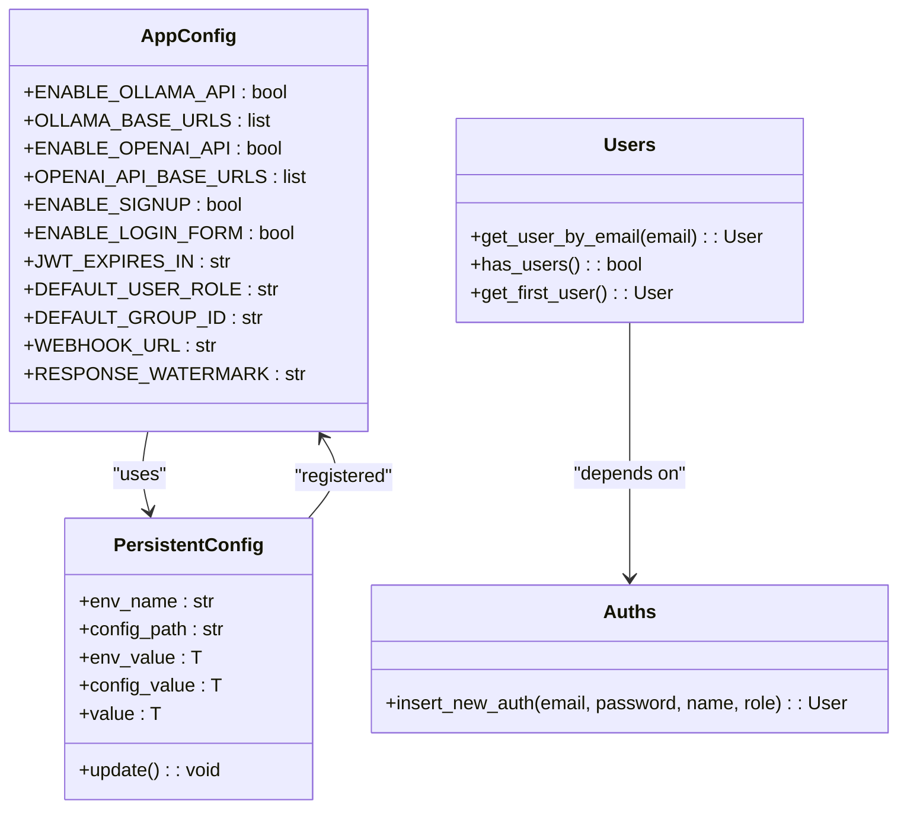
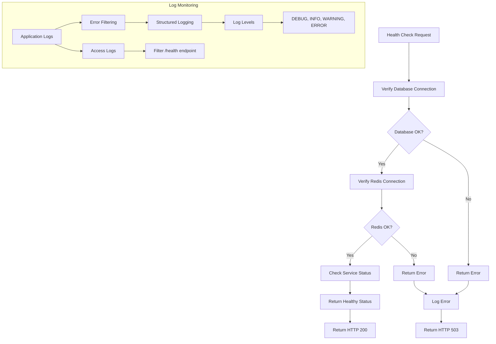
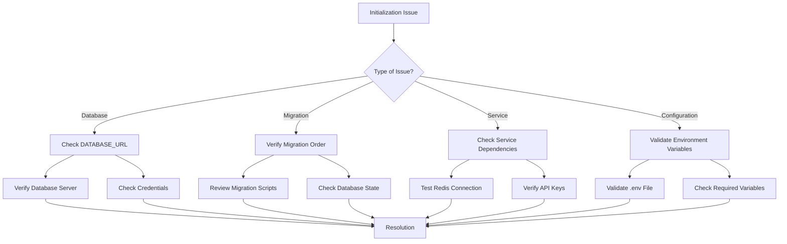

# Initialization and Setup

<cite>
**Referenced Files in This Document**   
- [main.py](file://backend/open_webui/main.py)
- [init_billing_plans.py](file://backend/scripts/init_billing_plans.py)
- [db.py](file://backend/open_webui/internal/db.py)
- [env.py](file://backend/open_webui/migrations/env.py)
- [config.py](file://backend/open_webui/config.py)
- [provider.py](file://backend/open_webui/storage/provider.py)
- [auths.py](file://backend/open_webui/routers/auths.py)
</cite>

## Table of Contents
1. [Introduction](#introduction)
2. [Database Initialization and Schema Migration](#database-initialization-and-schema-migration)
3. [Billing Plans Initialization](#billing-plans-initialization)
4. [Application Startup Sequence](#application-startup-sequence)
5. [Initial Admin User and System Configuration](#initial-admin-user-and-system-configuration)
6. [Health Checks and Log Monitoring](#health-checks-and-log-monitoring)
7. [Common Initialization Issues](#common-initialization-issues)
8. [Post-Installation Configuration](#post-installation-configuration)
9. [Security Hardening Recommendations](#security-hardening-recommendations)

## Introduction
This document provides comprehensive guidance for initializing and setting up Open WebUI, an open-source web interface for AI applications. The setup process covers database initialization, schema migration, billing plan configuration, application startup, and system verification. The document details the initialization workflow, including the migration system using Alembic, the creation of initial data, and the startup sequence of core services. It also addresses common initialization issues and provides recommendations for post-installation configuration and security hardening.

## Database Initialization and Schema Migration

Open WebUI uses a robust database initialization and migration system to ensure data consistency and schema evolution. The process begins with the configuration of the database connection through environment variables, with the primary configuration point being the `DATABASE_URL` environment variable. The system supports multiple database backends including SQLite, PostgreSQL, and encrypted SQLite databases using SQLCipher.

The migration system is implemented using Alembic, a lightweight database migration tool for SQLAlchemy. Migrations are stored in two locations: the legacy `internal/migrations` directory using peewee migrations, and the primary `migrations/versions` directory using Alembic. The initialization process first runs peewee migrations to handle legacy schema changes before proceeding with Alembic migrations.

The migration sequence follows a chronological order based on version numbers, with each migration script addressing specific schema changes:

**Diagram sources**
- [db.py](file://backend/open_webui/internal/db.py#L55-L80)
- [env.py](file://backend/open_webui/migrations/env.py#L28-L31)
- [config.py](file://backend/open_webui/config.py#L53-L68)

**Section sources**
- [db.py](file://backend/open_webui/internal/db.py#L1-L165)
- [env.py](file://backend/open_webui/migrations/env.py#L1-L109)
- [config.py](file://backend/open_webui/config.py#L53-L70)

## Billing Plans Initialization

The billing system in Open WebUI is initialized through a dedicated script that creates predefined billing plans from templates. The initialization process is handled by the `init_billing_plans.py` script located in the `backend/scripts/` directory. This script provides a flexible way to initialize billing plans with options for different plan types and configurations.

The billing plan initialization supports three categories of plans:
- **Default plans**: Always created during initialization
- **Annual plans**: Optional plans with discounted pricing (20% discount)
- **Promotional plans**: Optional plans for special promotions or trials

The initialization process follows these steps:
1. Load plan templates from the `utils.plan_templates` module
2. Check for existing plans in the database
3. Create new plans or update existing ones based on configuration
4. Provide summary statistics of the initialization process

The script provides command-line options for flexible initialization:
- `--include-annual`: Include annual subscription plans
- `--include-promo`: Include promotional plans
- `--force`: Overwrite existing plans with updated configurations

**Diagram sources**
- [init_billing_plans.py](file://backend/scripts/init_billing_plans.py#L29-L73)
- [billing.py](file://backend/open_webui/models/billing.py)

**Section sources**
- [init_billing_plans.py](file://backend/scripts/init_billing_plans.py#L1-L120)
- [plan_templates.py](file://backend/open_webui/utils/plan_templates.py)

## Application Startup Sequence

The application startup sequence in Open WebUI is orchestrated through the `main.py` file, which serves as the entry point for the FastAPI application. The startup process follows a well-defined lifecycle managed by the FastAPI lifespan context manager, ensuring proper initialization and cleanup of resources.

The startup sequence begins with the creation of the FastAPI application instance and the configuration of middleware components. Key initialization steps include:

The `lifespan` context manager in `main.py` handles the application lifecycle, performing the following initialization tasks:
- Setting up the instance ID and logger
- Resetting configuration if configured
- Installing external dependencies for functions and tools
- Establishing Redis connections for session management and task handling
- Configuring thread pool size for async operations
- Initializing the YooKassa billing client if credentials are provided
- Caching base models if enabled in configuration
- Setting up OpenTelemetry for observability

The application also initializes various configuration settings for different services:
- Ollama API integration
- OpenAI API integration
- Direct connections to AI services
- SCIM (System for Cross-domain Identity Management)
- WebUI appearance and behavior settings

**Diagram sources**
- [main.py](file://backend/open_webui/main.py#L569-L654)
- [config.py](file://backend/open_webui/config.py)

**Section sources**
- [main.py](file://backend/open_webui/main.py#L1-L800)
- [config.py](file://backend/open_webui/config.py#L1-L200)

## Initial Admin User and System Configuration

The creation of the initial admin user and system configuration is a critical step in the Open WebUI initialization process. The system automatically creates the first user as an administrator when no users exist in the database, providing immediate access to administrative functions.

The initial admin user creation follows this process:
1. During the signup process, the system checks if any users exist using `Users.has_users()`
2. If no users exist, the first registered user is assigned the "admin" role
3. The user is automatically assigned to the default group
4. An authentication token is generated for session management

System configuration is managed through environment variables and persistent configuration storage. Key configuration aspects include:

The system also supports configuration through the admin interface, where administrators can modify settings such as:
- Default user role and group assignment
- JWT token expiration
- Community sharing and message rating
- User webhook integration
- Response watermarking
- Pending user overlay content

**Diagram sources**
- [auths.py](file://backend/open_webui/routers/auths.py#L403-L417)
- [config.py](file://backend/open_webui/config.py#L165-L200)

**Section sources**
- [auths.py](file://backend/open_webui/routers/auths.py#L389-L1015)
- [config.py](file://backend/open_webui/config.py#L113-L155)

## Health Checks and Log Monitoring

Health checks and log monitoring are essential for verifying the successful installation and operation of Open WebUI. The system provides built-in health check endpoints and comprehensive logging to facilitate monitoring and troubleshooting.

The health check implementation includes:
- Database connectivity verification
- Redis connection status
- Service availability
- Configuration validation

Log monitoring is configured through various logging settings that control the verbosity and destination of log messages. The system uses Python's built-in logging module with custom configurations for different components.

The system implements an `EndpointFilter` to exclude health check endpoints from access logs, preventing log spam while maintaining visibility into actual user activity. Logging levels can be configured independently for different components through the `SRC_LOG_LEVELS` environment variable.

Key log monitoring practices include:
- Monitoring the main application logs for startup messages
- Checking database connection logs for initialization status
- Verifying Redis connection establishment
- Monitoring migration execution logs
- Tracking service initialization messages

**Diagram sources**
- [main.py](file://backend/open_webui/main.py#L39-L45)
- [config.py](file://backend/open_webui/config.py#L39-L45)

**Section sources**
- [main.py](file://backend/open_webui/main.py#L2312-L2351)
- [config.py](file://backend/open_webui/config.py#L39-L45)

## Common Initialization Issues

Several common issues may arise during the initialization of Open WebUI. Understanding these issues and their solutions is crucial for successful deployment.

### Database Connection Failures
Database connection failures are among the most common initialization issues. These can occur due to:
- Incorrect database URL format
- Missing database password for encrypted databases
- Network connectivity issues
- Database server not running

Solutions include:
- Verify the `DATABASE_URL` environment variable format
- Ensure the `DATABASE_PASSWORD` is set for SQLCipher databases
- Check network connectivity to the database server
- Verify the database server is running and accessible

### Migration Conflicts
Migration conflicts can occur when:
- Migration scripts are executed out of order
- Database schema is manually modified
- Multiple instances attempt migrations simultaneously
- Migration scripts contain errors

Prevention and resolution strategies:
- Always run migrations in the correct sequence
- Avoid manual schema modifications
- Use proper locking mechanisms in production
- Test migration scripts thoroughly in development

### Service Startup Errors
Service startup errors may include:
- Redis connection failures
- Missing environment variables
- Dependency installation issues
- Port conflicts
- Permission issues

Troubleshooting steps:
- Verify all required environment variables are set
- Check Redis server status and connection details
- Ensure proper file permissions for data directories
- Verify port availability for web server and services
- Check dependency installation logs for errors

**Diagram sources**
- [db.py](file://backend/open_webui/internal/db.py#L86-L113)
- [env.py](file://backend/open_webui/migrations/env.py#L66-L88)
- [main.py](file://backend/open_webui/main.py#L585-L592)

**Section sources**
- [db.py](file://backend/open_webui/internal/db.py#L80-L113)
- [env.py](file://backend/open_webui/migrations/env.py#L66-L88)
- [main.py](file://backend/open_webui/main.py#L585-L592)

## Post-Installation Configuration

After successful initialization, several post-installation configuration steps should be performed to optimize the Open WebUI deployment.

### Storage Configuration
Configure the storage backend according to your requirements:
- Local storage for simple deployments
- S3 for scalable cloud storage
- Google Cloud Storage for GCP integration
- Azure Blob Storage for Azure environments

Storage configuration involves setting appropriate environment variables:
- `STORAGE_PROVIDER`: Specifies the storage backend
- Provider-specific credentials and configuration
- Upload directory settings

### Retrieval and Embedding Configuration
Configure the retrieval system for optimal performance:
- Select appropriate embedding models
- Configure chunk size and overlap
- Set up web search engines
- Configure document processing pipelines

### Security Configuration
Implement security best practices:
- Configure HTTPS for production deployments
- Set up proper authentication methods
- Configure CORS policies
- Implement rate limiting
- Set up secure session management

### Performance Optimization
Optimize system performance by:
- Configuring database connection pooling
- Adjusting thread pool size
- Enabling model caching
- Optimizing retrieval settings
- Configuring appropriate logging levels

## Security Hardening Recommendations

Security hardening is critical for protecting Open WebUI deployments. The following recommendations should be implemented:

### Authentication and Authorization
- Enforce strong password policies
- Implement multi-factor authentication
- Use secure token expiration settings
- Regularly audit user permissions
- Implement role-based access control

### Data Protection
- Encrypt sensitive data at rest
- Use secure database connections
- Implement proper backup procedures
- Regularly update encryption keys
- Secure configuration files

### Network Security
- Use HTTPS with valid certificates
- Configure firewalls to restrict access
- Implement WAF (Web Application Firewall)
- Use secure headers and CSP
- Regularly update dependencies

### Monitoring and Logging
- Implement comprehensive logging
- Set up alerting for security events
- Regularly review access logs
- Monitor for suspicious activity
- Implement intrusion detection

### Regular Maintenance
- Keep all components updated
- Regularly review security configurations
- Perform security audits
- Test backup and recovery procedures
- Stay informed about security vulnerabilities

These security measures should be implemented according to your specific deployment environment and security requirements, ensuring a robust and secure Open WebUI installation.