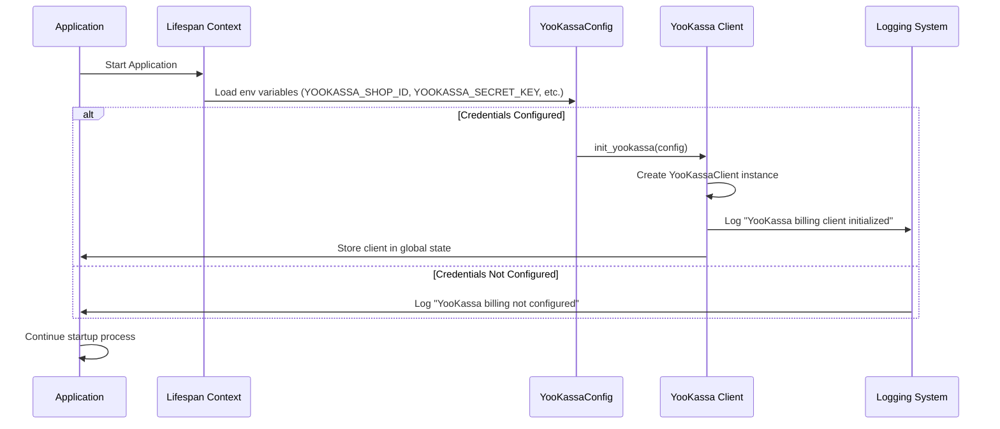
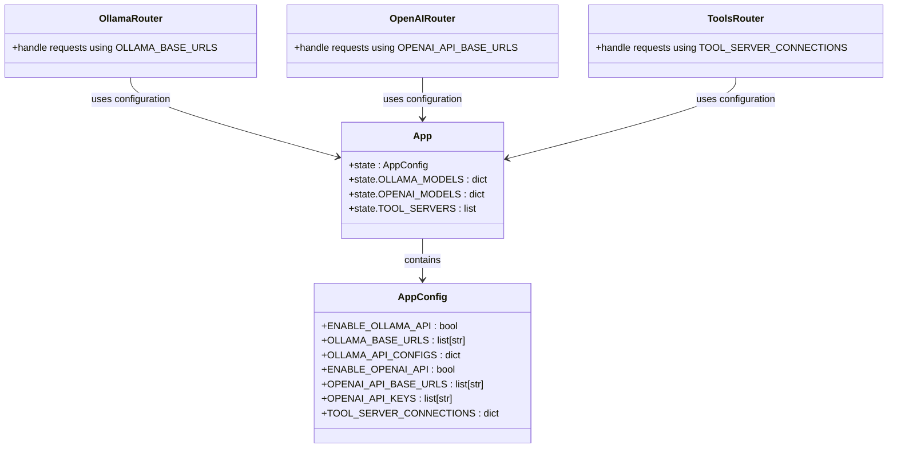
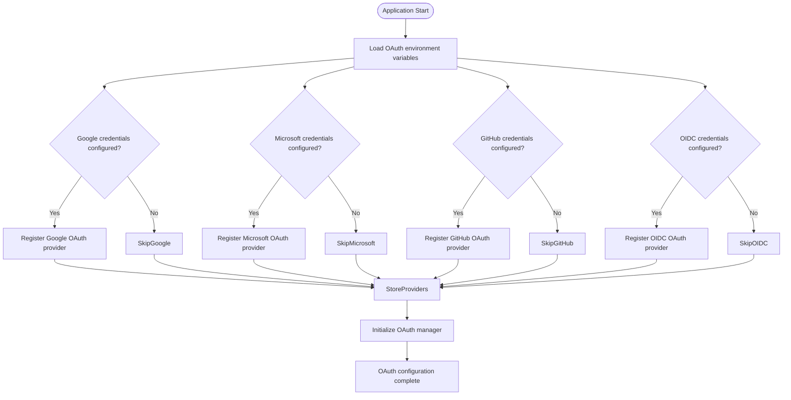

# External Services Initialization

<cite>
**Referenced Files in This Document**   
- [main.py](file://backend/open_webui/main.py)
- [yookassa.py](file://backend/open_webui/utils/yookassa.py)
- [env.py](file://backend/open_webui/env.py)
- [config.py](file://backend/open_webui/config.py)
- [billing.py](file://backend/open_webui/routers/billing.py)
- [retrieval.py](file://backend/open_webui/routers/retrieval.py)
- [oauth.py](file://backend/open_webui/utils/oauth.py)
</cite>

## Table of Contents
1. [Introduction](#introduction)
2. [YooKassa Billing Client Initialization](#yookassa-billing-client-initialization)
3. [External AI Model Endpoint Integration](#external-ai-model-endpoint-integration)
4. [OAuth Provider Configuration](#oauth-provider-configuration)
5. [Web Search Engine and Document Processing Services](#web-search-engine-and-document-processing-services)
6. [Security and Health Monitoring](#security-and-health-monitoring)
7. [Conclusion](#conclusion)

## Introduction
This document provides comprehensive guidance on the initialization of external service clients during application startup in open-webui, with a focus on the main.py implementation. The system integrates various external services including payment processing, AI model endpoints, authentication providers, and web search engines. The initialization process is designed to be secure, configurable, and resilient, with proper error handling and health monitoring. The configuration follows a hierarchical pattern where environment variables are loaded, validated, and then used to initialize service clients that are stored in the application state for global access throughout the application lifecycle.

**Section sources**
- [main.py](file://backend/open_webui/main.py#L1-L100)

## YooKassa Billing Client Initialization

The YooKassa billing client is initialized during the application startup process when the required configuration parameters are present in the environment. The initialization occurs within the lifespan context manager in main.py, which ensures that the client is properly set up before the application begins handling requests and is cleaned up during shutdown.

The client configuration requires four key parameters: shop ID, secret key, webhook secret, and API URL. These are loaded from environment variables through the env.py configuration module. The YooKassaConfig class encapsulates these parameters and provides a structured way to pass them to the client initialization function. When both the shop ID and secret key are configured, the system initializes the YooKassa client by creating a YooKassaConfig instance with the provided parameters and calling the init_yookassa function.

The initialization process follows a conditional pattern: if the required credentials are present, the client is initialized and stored as a global instance that can be accessed throughout the application via the get_yookassa_client function. If the credentials are not configured, the system logs an informational message indicating that YooKassa billing is not enabled, allowing the application to continue running without payment processing capabilities.

**Diagram sources**
- [main.py](file://backend/open_webui/main.py#L605-L627)
- [yookassa.py](file://backend/open_webui/utils/yookassa.py#L22-L36)
- [env.py](file://backend/open_webui/env.py#L889-L892)

**Section sources**
- [main.py](file://backend/open_webui/main.py#L605-L627)
- [yookassa.py](file://backend/open_webui/utils/yookassa.py#L22-L355)
- [env.py](file://backend/open_webui/env.py#L889-L892)

## External AI Model Endpoint Integration

The open-webui application supports integration with multiple external AI model endpoints, including Ollama, OpenAI, and custom tool servers. The initialization of these services is handled through a configuration-driven approach that allows for flexible deployment scenarios and multiple endpoint configurations.

For Ollama integration, the system supports multiple base URLs through the OLLAMA_BASE_URLS environment variable, enabling connection to multiple Ollama instances. The configuration also includes OLLAMA_API_CONFIGS which allows for per-instance API settings. During initialization, these values are loaded from the environment and stored in the application state configuration object, making them available to the Ollama router which handles API requests.

Similarly, OpenAI integration is configured through environment variables including ENABLE_OPENAI_API, OPENAI_API_BASE_URLS, and OPENAI_API_KEYS. The system supports multiple API keys and base URLs, allowing for load balancing or failover between different OpenAI-compatible endpoints. These configurations are also stored in the application state and used by the OpenAI router to route requests appropriately.

Tool server connections are configured through the TOOL_SERVER_CONNECTIONS environment variable, which defines the endpoints for external tool servers that provide function calling capabilities. These connections are initialized during application startup and stored in the application state for use by the tools router.

**Diagram sources**
- [main.py](file://backend/open_webui/main.py#L704-L730)
- [config.py](file://backend/open_webui/config.py#L117-L132)
- [ollama.py](file://backend/open_webui/routers/ollama.py)
- [openai.py](file://backend/open_webui/routers/openai.py)
- [tools.py](file://backend/open_webui/routers/tools.py)

**Section sources**
- [main.py](file://backend/open_webui/main.py#L704-L730)
- [config.py](file://backend/open_webui/config.py#L117-L132)
- [ollama.py](file://backend/open_webui/routers/ollama.py)
- [openai.py](file://backend/open_webui/routers/openai.py)
- [tools.py](file://backend/open_webui/routers/tools.py)

## OAuth Provider Configuration

The OAuth provider configuration system in open-webui enables integration with multiple identity providers for user authentication and authorization. The initialization process loads configuration from environment variables and dynamically registers OAuth providers based on the provided credentials.

The system supports several OAuth providers including Google, Microsoft, GitHub, and generic OpenID Connect (OIDC) providers. Each provider has specific configuration parameters that must be set in the environment for the provider to be enabled. For example, Google OAuth requires GOOGLE_CLIENT_ID and GOOGLE_CLIENT_SECRET, while Microsoft OAuth requires MICROSOFT_CLIENT_ID, MICROSOFT_CLIENT_SECRET, and MICROSOFT_CLIENT_TENANT_ID.

During application initialization, the load_oauth_providers function in config.py checks for the presence of these environment variables and registers the corresponding OAuth providers. The configuration is highly flexible, allowing for custom scopes, redirect URIs, and timeout settings. The OAuth manager is initialized in main.py and stored in the application state, making it available to the authentication routes.

The system also supports advanced OAuth features such as role management, group mapping, and domain restrictions. These are configured through environment variables like ENABLE_OAUTH_ROLE_MANAGEMENT, OAUTH_ROLES_CLAIM, and OAUTH_ALLOWED_DOMAINS, which control how user roles and groups are mapped from the identity provider to the application's permission system.

**Diagram sources**
- [config.py](file://backend/open_webui/config.py#L632-L793)
- [main.py](file://backend/open_webui/main.py#L665-L670)
- [oauth.py](file://backend/open_webui/utils/oauth.py)

**Section sources**
- [config.py](file://backend/open_webui/config.py#L632-L793)
- [main.py](file://backend/open_webui/main.py#L665-L670)
- [oauth.py](file://backend/open_webui/utils/oauth.py)

## Web Search Engine and Document Processing Services

The open-webui application integrates with various web search engines and document processing services to enhance its retrieval-augmented generation (RAG) capabilities. These services are initialized during application startup and configured through environment variables that specify API keys and endpoint URLs.

The system supports multiple web search engines including Google Programmable Search Engine (PSE), Bing Search, Brave Search, Exa, Perplexity, Tavily, SerpAPI, Jina Search, and others. Each service has its own configuration parameters, typically consisting of an API key and sometimes additional settings like engine IDs or custom endpoints. For example, Google PSE requires GOOGLE_PSE_API_KEY and GOOGLE_PSE_ENGINE_ID, while Bing Search requires BING_SEARCH_V7_SUBSCRIPTION_KEY and BING_SEARCH_V7_ENDPOINT.

Document processing services are also integrated to extract content from various sources. These include Tika Server (TIKA_SERVER_URL), Docling Server (DOCLING_SERVER_URL), Azure Document Intelligence (DOCUMENT_INTELLIGENCE_ENDPOINT), and specialized services like DataLab Marker (DATALAB_MARKER_API_KEY) and MinerU (MINERU_API_KEY). These services are used to process uploaded documents, web pages, and other content for use in the RAG pipeline.

The configuration for these services is loaded into the application state during initialization, making them available to the retrieval router which handles search and document processing requests. The system also supports external web search and document loader services through EXTERNAL_WEB_SEARCH_URL and EXTERNAL_DOCUMENT_LOADER_URL, allowing for custom or proprietary services to be integrated.

```mermaid
graph TB
subgraph "Web Search Engines"
GooglePSE[Google PSE]
Bing[Bing Search]
Brave[Brave Search]
Exa[Exa]
Perplexity[Perplexity]
Tavily[Tavily]
SerpAPI[SerpAPI]
Jina[Jina Search]
SeoTools[SEO Tools]
end
subgraph "Document Processing"
Tika[Tika Server]
Docling[Docling Server]
AzureDoc[Azure Document Intelligence]
DataLab[DataLab Marker]
MinerU[MinerU]
MistralOCR[Mistral OCR]
end
subgraph "External Services"
ExternalSearch[External Web Search]
ExternalLoader[External Document Loader]
end
AppConfig --> GooglePSE
AppConfig --> Bing
AppConfig --> Brave
AppConfig --> Exa
AppConfig --> Perplexity
AppConfig --> Tavily
AppConfig --> SerpAPI
AppConfig --> Jina
AppConfig --> SeoTools
AppConfig --> Tika
AppConfig --> Docling
AppConfig --> AzureDoc
AppConfig --> DataLab
AppConfig --> MinerU
AppConfig --> MistralOCR
AppConfig --> ExternalSearch
AppConfig --> ExternalLoader
style AppConfig fill:#f9f,stroke:#333,stroke-width:2px
```

**Diagram sources**
- [main.py](file://backend/open_webui/main.py#L944-L996)
- [config.py](file://backend/open_webui/config.py#L287-L326)
- [retrieval.py](file://backend/open_webui/routers/retrieval.py)

**Section sources**
- [main.py](file://backend/open_webui/main.py#L944-L996)
- [config.py](file://backend/open_webui/config.py#L287-L326)
- [retrieval.py](file://backend/open_webui/routers/retrieval.py)

## Security and Health Monitoring

The external services initialization in open-webui incorporates several security and health monitoring mechanisms to ensure reliable and secure operation. These mechanisms include secure storage of API keys, connection timeout configuration, and health checking of external services.

API keys and sensitive credentials are stored securely using environment variables rather than hard-coding them in the source code. The system follows the principle of least privilege by only loading and using credentials when the corresponding service is explicitly configured. For OAuth client information, the system provides encryption capabilities using OAUTH_CLIENT_INFO_ENCRYPTION_KEY, which defaults to the WEBUI_SECRET_KEY if not explicitly set.

Connection timeouts are configured for various external services to prevent hanging requests and ensure responsive user experiences. The OAuth system supports a configurable timeout through the OAUTH_TIMEOUT environment variable, which is applied to all OAuth provider requests. For web search and document processing services, the system uses concurrent request limits (WEB_SEARCH_CONCURRENT_REQUESTS, WEB_LOADER_CONCURRENT_REQUESTS) to prevent overwhelming external services.

Health monitoring is implemented through periodic checks and connection pooling. For database connections, the Oracle 23ai vector store implementation includes a start_health_monitor method that runs periodic health checks on the connection pool. The system also uses Redis for caching and session management, with support for Redis Sentinel and Redis Cluster configurations that provide high availability and automatic failover.

The application startup process includes comprehensive logging of the initialization status for each external service, allowing administrators to quickly identify configuration issues. Services that are not properly configured log informative messages indicating what configuration is missing, helping with troubleshooting and setup.

```mermaid
flowchart TD
Security[Security Measures] --> EnvVars["Store API keys in environment variables"]
Security --> Encryption["Encrypt OAuth client information"]
Security --> LeastPrivilege["Apply least privilege principle"]
Security --> Validation["Validate configuration before use"]
Timeouts[Timeout Configuration] --> OAuthTimeout["OAUTH_TIMEOUT for OAuth requests"]
Timeouts --> ConcurrentRequests["Concurrent request limits"]
Timeouts --> ConnectionPooling["Database connection pooling"]
Timeouts --> RequestTimeouts["Individual request timeouts"]
Monitoring[Health Monitoring] --> PeriodicChecks["Periodic health checks"]
Monitoring --> ConnectionPool["Connection pool monitoring"]
Monitoring --> Logging["Comprehensive initialization logging"]
Monitoring --> Failover["Redis Sentinel/Cluster failover"]
EnvVars --> Implementation
Encryption --> Implementation
LeastPrivilege --> Implementation
Validation --> Implementation
OAuthTimeout --> Implementation
ConcurrentRequests --> Implementation
ConnectionPooling --> Implementation
RequestTimeouts --> Implementation
PeriodicChecks --> Implementation
ConnectionPool --> Implementation
Logging --> Implementation
Failover --> Implementation
Implementation[Implementation in Code] --> main.py
Implementation --> env.py
Implementation --> config.py
Implementation --> utils/
```

**Diagram sources**
- [env.py](file://backend/open_webui/env.py)
- [config.py](file://backend/open_webui/config.py)
- [main.py](file://backend/open_webui/main.py)
- [utils/redis.py](file://backend/open_webui/utils/redis.py)
- [retrieval/vector/dbs/oracle23ai.py](file://backend/open_webui/retrieval/vector/dbs/oracle23ai.py)

**Section sources**
- [env.py](file://backend/open_webui/env.py)
- [config.py](file://backend/open_webui/config.py)
- [main.py](file://backend/open_webui/main.py)
- [utils/redis.py](file://backend/open_webui/utils/redis.py)
- [retrieval/vector/dbs/oracle23ai.py](file://backend/open_webui/retrieval/vector/dbs/oracle23ai.py)

## Conclusion
The external services initialization in open-webui demonstrates a well-structured approach to integrating multiple third-party services while maintaining security, flexibility, and reliability. The system uses a configuration-driven model where environment variables control the initialization of services such as YooKassa billing, AI model endpoints, OAuth providers, and web search engines. Each service is initialized conditionally based on the presence of required credentials, with comprehensive logging to aid in troubleshooting. The architecture separates configuration from implementation, storing service clients in the application state for global access while following security best practices for credential management. This design allows for easy configuration and deployment in various environments, from development to production, while providing the extensibility needed to support additional services in the future.