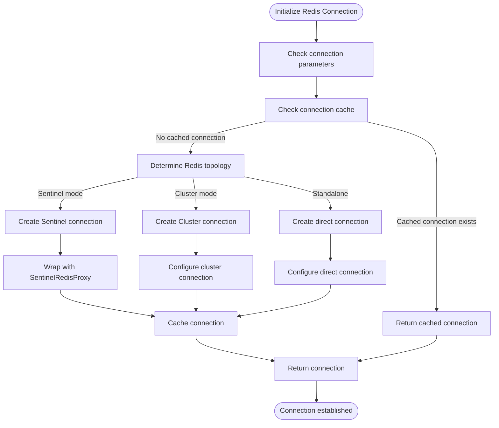
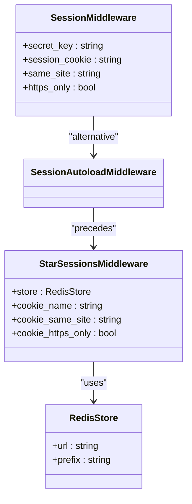
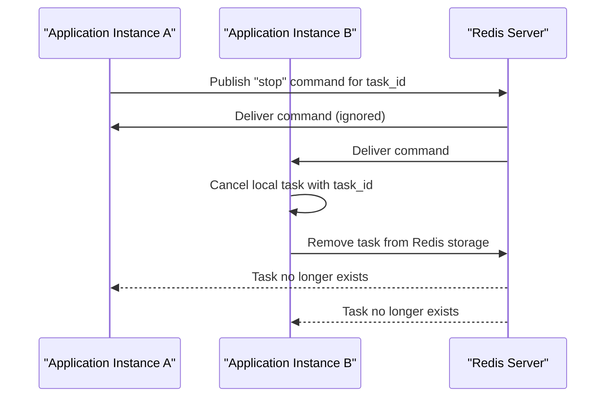

# Redis Initialization

<cite>
**Referenced Files in This Document**   
- [main.py](file://backend/open_webui/main.py)
- [redis.py](file://backend/open_webui/utils/redis.py)
- [env.py](file://backend/open_webui/env.py)
- [tasks.py](file://backend/open_webui/tasks.py)
- [socket/main.py](file://backend/open_webui/socket/main.py)
</cite>

## Table of Contents
1. [Introduction](#introduction)
2. [Redis Configuration Environment Variables](#redis-configuration-environment-variables)
3. [Redis Connection Initialization](#redis-connection-initialization)
4. [Session Management with Redis](#session-management-with-redis)
5. [Task Coordination with Redis](#task-coordination-with-redis)
6. [Redis in WebSockets and Real-time Features](#redis-in-websockets-and-real-time-features)
7. [Best Practices for Production Deployments](#best-practices-for-production-deployments)
8. [Conclusion](#conclusion)

## Introduction
The open-webui application utilizes Redis as a critical component for session management, task coordination, and real-time features. This document details the initialization and configuration of Redis connections as implemented in the application, focusing on the `main.py` file and related components. The system supports various Redis deployment topologies including standalone, cluster, and sentinel modes, providing flexibility for different deployment scenarios. The implementation leverages environment variables for configuration, allowing for easy adaptation to different environments without code changes.

## Redis Configuration Environment Variables
The open-webui application uses several environment variables to configure Redis connections, supporting different deployment topologies and providing flexibility for various deployment scenarios.

### Core Redis Configuration
The primary environment variables for Redis configuration include:

- **REDIS_URL**: Specifies the connection URL for Redis in the format `redis://[:password@]host:port/db`. This is the fundamental configuration parameter for connecting to Redis.
- **REDIS_CLUSTER**: A boolean flag (true/false) that indicates whether Redis is running in cluster mode. When enabled, the application uses Redis Cluster-specific connection methods.
- **REDIS_KEY_PREFIX**: A string prefix applied to all Redis keys used by the application, allowing for namespace isolation when multiple applications share the same Redis instance.

### Sentinel Configuration
For high-availability deployments using Redis Sentinel, the following environment variables are available:

- **REDIS_SENTINEL_HOSTS**: A comma-separated list of Redis Sentinel hostnames or IP addresses.
- **REDIS_SENTINEL_PORT**: The port number on which Redis Sentinel is listening (default: 26379).
- **REDIS_SENTINEL_MAX_RETRY_COUNT**: The maximum number of retry attempts for Redis operations during failover scenarios (default: 2).

### WebSocket-Specific Redis Configuration
The application also provides separate Redis configuration for WebSocket functionality:

- **WEBSOCKET_REDIS_URL**: Redis URL specifically for WebSocket connections (defaults to REDIS_URL if not specified).
- **WEBSOCKET_REDIS_CLUSTER**: Indicates whether WebSocket Redis is in cluster mode.
- **WEBSOCKET_SENTINEL_HOSTS** and **WEBSOCKET_SENTINEL_PORT**: Sentinel configuration specifically for WebSocket Redis connections.

These environment variables allow administrators to configure Redis connections appropriately for their deployment topology, whether using standalone Redis, Redis Cluster for horizontal scaling, or Redis Sentinel for high availability.

**Section sources**
- [env.py](file://backend/open_webui/env.py#L378-L394)
- [main.py](file://backend/open_webui/main.py#L444-L450)

## Redis Connection Initialization
The Redis connection initialization process in open-webui is implemented through the `get_redis_connection` utility function, which handles different Redis deployment topologies and provides connection caching for efficiency.

### get_redis_connection Utility Function
The `get_redis_connection` function is the central component for establishing Redis connections. It accepts several parameters:

- **redis_url**: The Redis connection URL
- **redis_sentinels**: A list of sentinel host-port tuples
- **redis_cluster**: Boolean indicating cluster mode
- **async_mode**: Boolean indicating whether to use async Redis client
- **decode_responses**: Boolean indicating whether to decode Redis responses

The function implements connection caching using an in-memory dictionary `_CONNECTION_CACHE` to avoid creating duplicate connections. The cache key is a tuple of the connection parameters, ensuring that connections with identical configurations are reused.

### Handling Different Redis Topologies
The function intelligently handles three different Redis deployment scenarios:

**Standalone Redis**: When no sentinel hosts are specified and cluster mode is disabled, the function creates a direct connection to the Redis server using `Redis.from_url()` for synchronous operations or `redis.from_url()` for asynchronous operations.

**Redis Sentinel**: When sentinel hosts are provided, the function creates a Sentinel connection that automatically handles failover. It uses the `SentinelRedisProxy` class to wrap the sentinel connection, providing retry logic for operations that fail due to master-slave failover events.

**Redis Cluster**: When cluster mode is enabled, the function uses `RedisCluster.from_url()` to create a connection that automatically handles cluster topology and key distribution.

The implementation includes comprehensive error handling, with specific retry logic for sentinel deployments to handle temporary connection issues during failover events.

**Diagram sources **
- [redis.py](file://backend/open_webui/utils/redis.py#L132-L209)

**Section sources**
- [redis.py](file://backend/open_webui/utils/redis.py#L132-L209)
- [main.py](file://backend/open_webui/main.py#L585-L592)

## Session Management with Redis
The open-webui application implements session management using Redis as the backend store, leveraging the starsessions library for secure and efficient session handling.

### RedisStore Configuration
The application uses the `RedisStore` class from the starsessions library to store session data in Redis. The store is configured with the following parameters:

- **url**: The Redis connection URL from the REDIS_URL environment variable
- **prefix**: A key prefix that combines the REDIS_KEY_PREFIX with "session:" to create a dedicated namespace for session data

The prefix ensures that session keys are isolated from other application data in Redis, following the pattern `{REDIS_KEY_PREFIX}:session:` when a prefix is specified, or simply "session:" when no prefix is configured.

### Session Middleware Setup
The session management is implemented through FastAPI middleware. When `ENABLE_STAR_SESSIONS_MIDDLEWARE` is enabled in the environment, the application configures the session middleware as follows:

1. Adds the `SessionAutoloadMiddleware` to automatically load session data
2. Adds the `StarSessionsMiddleware` with the Redis store configuration
3. Configures session cookie parameters including name ("owui-session"), SameSite policy, and HTTPS-only flag based on environment variables

If Redis configuration is not available or the star sessions middleware cannot be initialized, the application falls back to using the standard FastAPI `SessionMiddleware` with in-memory storage, though this is not recommended for production deployments as it doesn't support horizontal scaling.

The session implementation supports secure cookie settings, including configurable SameSite policies (typically "lax") and HTTPS-only cookies for enhanced security in production environments.

**Diagram sources **
- [main.py](file://backend/open_webui/main.py#L2090-L2114)

**Section sources**
- [main.py](file://backend/open_webui/main.py#L2090-L2114)
- [redis.py](file://backend/open_webui/utils/redis.py#L58-L59)

## Task Coordination with Redis
The open-webui application implements a distributed task coordination system using Redis for managing background tasks across multiple application instances.

### Redis Task Command Listener
The core of the task coordination system is the `redis_task_command_listener` function, which runs as an asynchronous task during application lifespan. This listener:

1. Subscribes to a Redis pub/sub channel (`{REDIS_KEY_PREFIX}:tasks:commands`)
2. Listens for incoming task commands
3. Processes "stop" commands by canceling local tasks with matching IDs

The listener enables distributed task management, allowing any instance in a cluster to send a command to stop a specific task, which will be received and processed by all instances. This ensures consistent task state across the application cluster.

### Task Management Functions
The system provides several functions for task management:

- **create_task**: Creates a new asyncio task and registers it in both local memory and Redis
- **stop_task**: Cancels a running task and sends a distributed command to ensure it's stopped across all instances
- **list_tasks**: Retrieves a list of active task IDs from Redis
- **list_task_ids_by_item_id**: Lists tasks associated with a specific item ID

Tasks are stored in Redis using two data structures:
- A hash map (`{REDIS_KEY_PREFIX}:tasks`) mapping task IDs to item IDs
- A set (`{REDIS_KEY_PREFIX}:tasks:item:{item_id}`) containing all task IDs associated with a specific item

This structure enables efficient lookup of tasks by both ID and item association, supporting use cases where all tasks for a specific item need to be managed together.

**Diagram sources **
- [tasks.py](file://backend/open_webui/tasks.py#L27-L44)
- [main.py](file://backend/open_webui/main.py#L595-L597)

**Section sources**
- [tasks.py](file://backend/open_webui/tasks.py#L27-L187)
- [main.py](file://backend/open_webui/main.py#L514-L520)

## Redis in WebSockets and Real-time Features
Redis plays a crucial role in the WebSocket implementation of open-webui, enabling real-time collaboration features and distributed state management.

### WebSocket Manager Configuration
When `WEBSOCKET_MANAGER` is set to "redis", the application configures Socket.IO to use Redis as the message broker, enabling horizontal scaling across multiple application instances. The configuration includes:

- **AsyncRedisManager**: Creates a Redis-based client manager for Socket.IO
- **Redis connection**: Established using the same connection logic as the main application, supporting sentinel and cluster modes
- **Connection options**: Configurable through the WEBSOCKET_REDIS_OPTIONS environment variable

### Distributed State Management
The application uses Redis to maintain distributed state for real-time features:

- **MODELS**: A Redis-backed dictionary that tracks which models are currently in use
- **SESSION_POOL**: Stores user session information across instances
- **USAGE_POOL**: Tracks active connections and usage metrics

These Redis dictionaries are implemented using the `RedisDict` class, which provides a dictionary-like interface backed by Redis hash maps. This allows multiple application instances to share state and coordinate user activity.

### Real-time Collaboration
For collaborative editing features, the application uses Redis to store Yjs document updates and user presence information:

- **Document updates**: Stored in Redis lists with keys following the pattern `{REDIS_KEY_PREFIX}:ydoc:documents:{document_id}:updates`
- **User presence**: Stored in Redis sets with keys following the pattern `{REDIS_KEY_PREFIX}:ydoc:documents:{document_id}:users`

This implementation enables real-time collaboration across multiple instances, with Redis serving as the single source of truth for document state and user presence.

**Section sources**
- [socket/main.py](file://backend/open_webui/socket/main.py#L64-L140)
- [socket/utils.py](file://backend/open_webui/socket/utils.py#L49-L118)

## Best Practices for Production Deployments
When deploying open-webui in production environments, several best practices should be followed to ensure reliable and secure Redis operations.

### Connection Pooling and Resource Management
The application's Redis implementation includes built-in connection caching through the `_CONNECTION_CACHE` dictionary, which prevents the creation of duplicate connections. For production deployments:

- Ensure adequate connection limits on the Redis server to accommodate all application instances
- Monitor connection usage and adjust Redis server configuration as needed
- Consider using connection pooling at the infrastructure level for additional efficiency

### Error Handling and Resilience
The implementation includes several resilience features:

- **Sentinel retry logic**: The `SentinelRedisProxy` class includes retry logic for operations that fail during failover events
- **Graceful degradation**: When Redis is unavailable, the application can fall back to in-memory storage for sessions (though this limits horizontal scaling)
- **Task cleanup**: Completed or canceled tasks are automatically removed from Redis storage to prevent resource leaks

For production deployments, monitor Redis connectivity and implement alerting for connection failures or high latency.

### Security Considerations
Key security practices include:

- **Secure Redis URLs**: Ensure Redis URLs include authentication credentials when required
- **Network isolation**: Deploy Redis on a private network segment, not directly accessible from the internet
- **Encryption**: Use TLS/SSL for Redis connections when data traverses untrusted networks
- **Key prefixing**: Use the REDIS_KEY_PREFIX to isolate open-webui data from other applications sharing the same Redis instance

### Performance Optimization
To optimize Redis performance:

- **Monitor memory usage**: Redis is memory-bound, so monitor usage and plan for adequate resources
- **Configure appropriate eviction policies**: Set appropriate maxmemory policies based on your data retention requirements
- **Use efficient data structures**: The application uses hash maps and sets appropriately for different use cases
- **Consider Redis Cluster**: For high-traffic deployments, consider Redis Cluster to distribute load across multiple nodes

### High Availability Configuration
For mission-critical deployments:

- **Use Redis Sentinel**: Configure Redis Sentinel for automatic failover and high availability
- **Multi-zone deployment**: Deploy Redis instances across multiple availability zones for resilience
- **Regular backups**: Implement regular Redis persistence and backup procedures
- **Monitoring**: Implement comprehensive monitoring of Redis metrics including memory usage, connection count, and command latency

**Section sources**
- [redis.py](file://backend/open_webui/utils/redis.py#L22-L101)
- [env.py](file://backend/open_webui/env.py#L378-L394)
- [socket/utils.py](file://backend/open_webui/socket/utils.py#L9-L47)

## Conclusion
The Redis initialization and configuration in open-webui provides a robust foundation for session management, task coordination, and real-time features. The implementation supports multiple Redis deployment topologies, including standalone, cluster, and sentinel modes, allowing for flexibility in different deployment scenarios. The use of environment variables for configuration enables easy adaptation to various environments without code changes. The system implements connection caching for efficiency and includes comprehensive error handling for resilience. For production deployments, following the recommended best practices for connection management, security, and performance optimization will ensure reliable operation of the application.