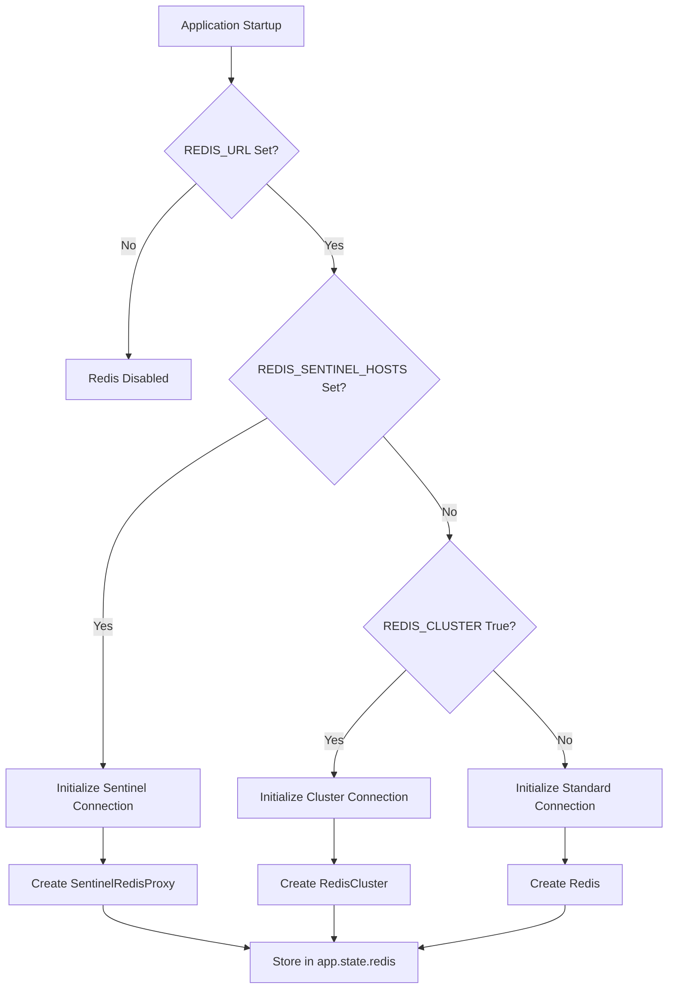
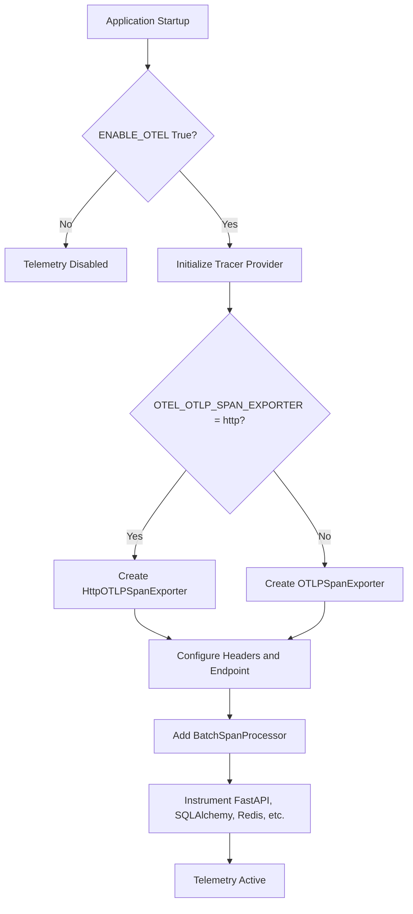

# Service Initialization

<cite>
**Referenced Files in This Document**   
- [main.py](file://backend/open_webui/main.py)
- [config.py](file://backend/open_webui/config.py)
- [env.py](file://backend/open_webui/env.py)
- [utils/redis.py](file://backend/open_webui/utils/redis.py)
- [utils/telemetry/setup.py](file://backend/open_webui/utils/telemetry/setup.py)
- [utils/yookassa.py](file://backend/open_webui/utils/yookassa.py)
- [tasks.py](file://backend/open_webui/tasks.py)
</cite>

## Table of Contents
1. [Introduction](#introduction)
2. [Redis Initialization](#redis-initialization)
3. [Thread Pool and Background Task Configuration](#thread-pool-and-background-task-configuration)
4. [Telemetry and OpenTelemetry Integration](#telemetry-and-opentelemetry-integration)
5. [External Service Client Initialization](#external-service-client-initialization)
6. [Service Dependency Management and Health Checking](#service-dependency-management-and-health-checking)
7. [Conclusion](#conclusion)

## Introduction
The open-webui application orchestrates the initialization of its core services during startup through the `main.py` file. This document details the initialization process for critical components including Redis for session and task management, thread pools for background processing, OpenTelemetry for observability, and external service clients for billing and AI models. The initialization is managed within a FastAPI lifespan context manager, ensuring that services are properly set up before the application begins handling requests and are gracefully shut down afterward. Configuration is driven by environment variables, allowing for flexible deployment across different environments.

**Section sources**
- [main.py](file://backend/open_webui/main.py#L569-L654)

## Redis Initialization

The application initializes a Redis connection to manage sessions, coordinate background tasks, and store application state. The initialization process supports standard Redis connections, Redis clusters, and Redis Sentinel configurations for high availability.

The Redis connection is established using the `get_redis_connection` function from `utils/redis.py`, which accepts several configuration parameters:
- `redis_url`: The connection URL for the Redis instance.
- `redis_sentinels`: A list of sentinel hosts and ports for high-availability setups.
- `redis_cluster`: A boolean flag indicating if the connection is to a Redis cluster.
- `async_mode`: A boolean flag to enable asynchronous operations.

The configuration is sourced from environment variables:
- `REDIS_URL`: Specifies the Redis connection URL.
- `REDIS_CLUSTER`: Enables cluster mode when set to "true".
- `REDIS_SENTINEL_HOSTS`: A comma-separated list of sentinel hostnames.
- `REDIS_SENTINEL_PORT`: The port number for the sentinel instances (default is 26379).

When using Redis Sentinel, the `get_sentinels_from_env` function parses the `REDIS_SENTINEL_HOSTS` string into a list of tuples containing the host and port. The `SentinelRedisProxy` class provides a wrapper that handles failover by automatically reconnecting to the new master when a failover occurs, retrying operations up to `REDIS_SENTINEL_MAX_RETRY_COUNT` times.

The initialized Redis connection is stored in the FastAPI app state (`app.state.redis`) and is used throughout the application for various purposes, including session management with `StarSessionsMiddleware` and task coordination.

**Diagram sources**
- [main.py](file://backend/open_webui/main.py#L585-L592)
- [utils/redis.py](file://backend/open_webui/utils/redis.py#L132-L209)

**Section sources**
- [main.py](file://backend/open_webui/main.py#L585-L592)
- [utils/redis.py](file://backend/open_webui/utils/redis.py#L132-L209)

## Thread Pool and Background Task Configuration

The application configures the thread pool size for background task execution using the `THREAD_POOL_SIZE` environment variable. This setting controls the maximum number of threads available for the `anyio` thread limiter, which manages the execution of synchronous code within the asynchronous FastAPI event loop.

The configuration is applied within the lifespan context manager in `main.py`. The `anyio.to_thread.current_default_thread_limiter()` is retrieved, and its `total_tokens` attribute is set to the value of `THREAD_POOL_SIZE`. This effectively limits the number of concurrent threads that can be used for background operations.

This configuration is crucial for managing the application's resource usage, especially when performing CPU-intensive tasks or making blocking I/O calls. By default, if `THREAD_POOL_SIZE` is not set or is set to a non-positive value, the thread pool size remains unmodified, relying on the system's default configuration.

**Section sources**
- [main.py](file://backend/open_webui/main.py#L599-L601)

## Telemetry and OpenTelemetry Integration

The application integrates with OpenTelemetry for comprehensive observability, enabling distributed tracing, metrics collection, and logging. This integration is controlled by the `ENABLE_OTEL` environment variable, which must be set to "true" to activate the telemetry system.

When enabled, the `setup_opentelemetry` function from `utils/telemetry/setup.py` is called during application startup. This function configures the OpenTelemetry tracer provider with a service name specified by the `OTEL_SERVICE_NAME` environment variable (defaulting to "open-webui").

The tracing exporter is configured based on the `OTEL_OTLP_SPAN_EXPORTER` environment variable:
- If set to "http", an `HttpOTLPSpanExporter` is used.
- For any other value (or if not set), the default `OTLPSpanExporter` (gRPC) is used.

The exporter is configured with the endpoint specified by `OTEL_EXPORTER_OTLP_ENDPOINT`. If `OTEL_EXPORTER_OTLP_INSECURE` is set to "true", the gRPC exporter will connect without TLS. Basic authentication can be configured using `OTEL_BASIC_AUTH_USERNAME` and `OTEL_BASIC_AUTH_PASSWORD`, which are base64-encoded and added to the request headers.

The instrumentation process, managed by the `Instrumentor` class in `utils/telemetry/instrumentors.py`, automatically instruments several components:
- The FastAPI application itself.
- The SQLAlchemy database engine.
- Redis operations.
- HTTP requests made via `requests`, `httpx`, and `aiohttp` libraries.
- Python logging.

This instrumentation captures detailed telemetry data, including request durations, database query performance, and external API call latencies, providing deep insights into the application's behavior.

**Diagram sources**
- [main.py](file://backend/open_webui/main.py#L691-L694)
- [utils/telemetry/setup.py](file://backend/open_webui/utils/telemetry/setup.py#L28-L58)

**Section sources**
- [main.py](file://backend/open_webui/main.py#L691-L694)
- [utils/telemetry/setup.py](file://backend/open_webui/utils/telemetry/setup.py#L28-L58)

## External Service Client Initialization

The application initializes clients for various external services during startup, enabling integration with billing systems and AI model providers.

### YooKassa Billing Client
The YooKassa (YooMoney) billing client is initialized if the `YOOKASSA_SHOP_ID` and `YOOKASSA_SECRET_KEY` environment variables are set. The initialization process creates a `YooKassaConfig` object with the provided credentials and an optional `YOOKASSA_WEBHOOK_SECRET` for webhook signature verification. This configuration is then passed to the `init_yookassa` function, which creates a global `YooKassaClient` instance stored in the module. This client is used to create payments, check payment status, and handle refunds.

### OAuth Providers
The application supports multiple OAuth providers (Google, Microsoft, GitHub, OpenID Connect, Feishu) for user authentication. Configuration for each provider is defined by specific environment variables (e.g., `GOOGLE_CLIENT_ID`, `MICROSOFT_CLIENT_ID`). During initialization, the `load_oauth_providers` function in `config.py` checks these environment variables and registers the configured providers with the `OAuthManager`. This allows users to sign in using their accounts from these external services.

### AI Model Endpoints
The application connects to AI model endpoints from Ollama and OpenAI. Configuration for these endpoints is managed through lists of base URLs (`OLLAMA_BASE_URLS`, `OPENAI_API_BASE_URLS`) and corresponding API keys (`OLLAMA_API_KEYS`, `OPENAI_API_KEYS`). These configurations are loaded into the application state during startup, allowing the application to route requests to the appropriate backend services. The application also supports direct connections to AI models when `ENABLE_DIRECT_CONNECTIONS` is enabled.

**Section sources**
- [main.py](file://backend/open_webui/main.py#L605-L627)
- [utils/yookassa.py](file://backend/open_webui/utils/yookassa.py#L344-L349)
- [config.py](file://backend/open_webui/config.py#L632-L794)

## Service Dependency Management and Health Checking

The application manages service dependencies through a well-defined startup sequence orchestrated by the FastAPI lifespan context manager. Services are initialized in a specific order to ensure that dependencies are available before the services that rely on them are started.

The primary dependency is the Redis connection, which is established early in the startup process. Other services, such as the Redis task command listener and the YooKassa client, are only initialized if their required dependencies (like the Redis connection or API keys) are present.

Health checking is implemented through the `/health` endpoint, which is implicitly provided by FastAPI. The application also includes a `healthcheck_with_db` endpoint in the `main.py` file that can be used to verify the health of both the application and its database connection. The logging system is configured to filter out health check requests to prevent log spam.

The application uses a `lifespan` context manager to manage the startup and shutdown lifecycle. During startup, all services are initialized. During shutdown, cleanup tasks are performed, such as canceling the `redis_task_command_listener` task to ensure a graceful shutdown.

**Section sources**
- [main.py](file://backend/open_webui/main.py#L569-L654)

## Conclusion
The service initialization process in open-webui is a comprehensive and well-structured system that ensures all core components are properly configured and ready before the application becomes available. By leveraging environment variables for configuration, the application achieves high flexibility and ease of deployment. The use of Redis for state management, OpenTelemetry for observability, and a modular approach to external service integration provides a robust foundation for a scalable and maintainable application. The clear separation of concerns and the use of established patterns like the lifespan context manager make the initialization process both reliable and easy to understand.