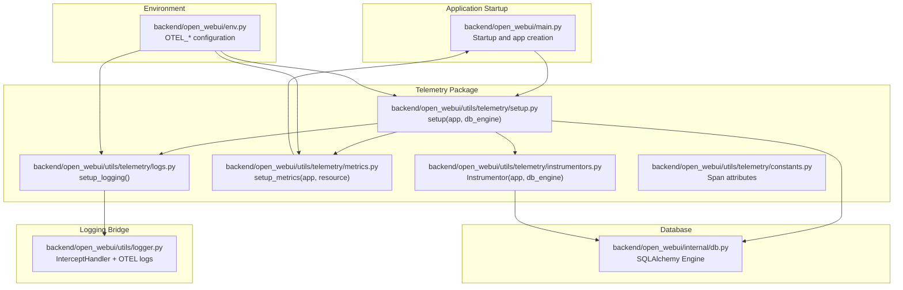
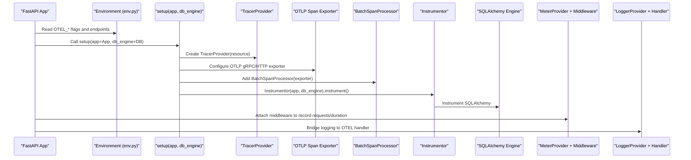
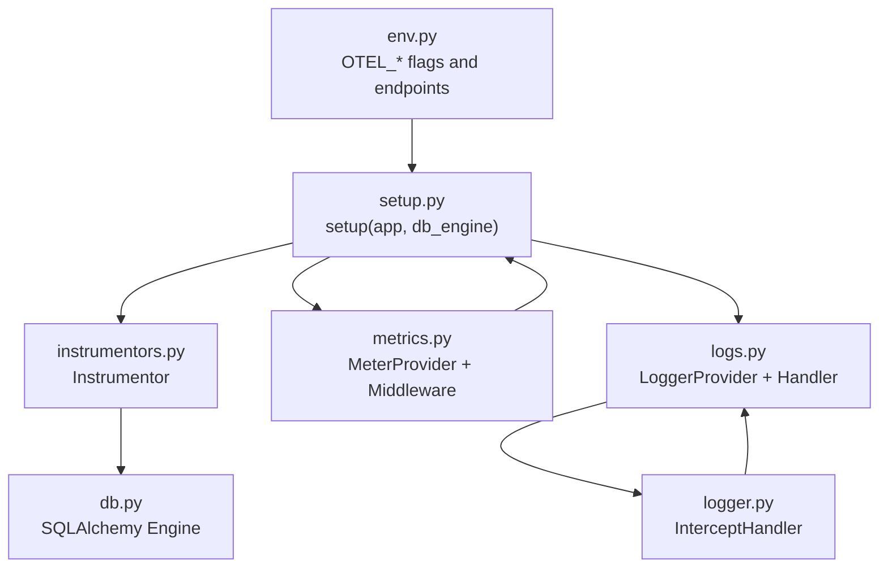

# Telemetry Initialization

<cite>
**Referenced Files in This Document**
- [main.py](file://backend/open_webui/main.py)
- [setup.py](file://backend/open_webui/utils/telemetry/setup.py)
- [instrumentors.py](file://backend/open_webui/utils/telemetry/instrumentors.py)
- [metrics.py](file://backend/open_webui/utils/telemetry/metrics.py)
- [logs.py](file://backend/open_webui/utils/telemetry/logs.py)
- [constants.py](file://backend/open_webui/utils/telemetry/constants.py)
- [env.py](file://backend/open_webui/env.py)
- [db.py](file://backend/open_webui/internal/db.py)
- [logger.py](file://backend/open_webui/utils/logger.py)
- [docker-compose.otel.yaml](file://docker-compose.otel.yaml)
</cite>

## Table of Contents
1. [Introduction](#introduction)
2. [Project Structure](#project-structure)
3. [Core Components](#core-components)
4. [Architecture Overview](#architecture-overview)
5. [Detailed Component Analysis](#detailed-component-analysis)
6. [Dependency Analysis](#dependency-analysis)
7. [Performance Considerations](#performance-considerations)
8. [Troubleshooting Guide](#troubleshooting-guide)
9. [Conclusion](#conclusion)
10. [Appendices](#appendices)

## Introduction
This document explains how OpenWebUI initializes OpenTelemetry for monitoring and observability. It focuses on the orchestration in the FastAPI application lifecycle, the setup function that configures tracing, metrics, and logging, and the integration with the FastAPI app and the SQLAlchemy database engine. It also covers exporter selection, authentication headers, and operational guidance for production deployments.

## Project Structure
Telemetry is implemented under the backend module in a dedicated telemetry package. The main application wires telemetry during startup when the environment enables it.

**Diagram sources**
- [main.py](file://backend/open_webui/main.py#L685-L700)
- [setup.py](file://backend/open_webui/utils/telemetry/setup.py#L28-L59)
- [instrumentors.py](file://backend/open_webui/utils/telemetry/instrumentors.py#L167-L203)
- [metrics.py](file://backend/open_webui/utils/telemetry/metrics.py#L114-L204)
- [logs.py](file://backend/open_webui/utils/telemetry/logs.py#L24-L54)
- [constants.py](file://backend/open_webui/utils/telemetry/constants.py#L1-L27)
- [env.py](file://backend/open_webui/env.py#L802-L892)
- [db.py](file://backend/open_webui/internal/db.py#L112-L146)
- [logger.py](file://backend/open_webui/utils/logger.py#L45-L85)

**Section sources**
- [main.py](file://backend/open_webui/main.py#L685-L700)
- [setup.py](file://backend/open_webui/utils/telemetry/setup.py#L28-L59)
- [env.py](file://backend/open_webui/env.py#L802-L892)

## Core Components
- Telemetry setup orchestrator: The application conditionally invokes the setup function during startup to configure tracing, metrics, and logging.
- Tracing pipeline: Creates a tracer provider with a resource, adds a batch span processor exporting spans via OTLP (gRPC or HTTP), and instruments the FastAPI app and SQLAlchemy engine.
- Metrics pipeline: Initializes a meter provider with periodic exporting and attaches a middleware to record request counts and durations.
- Logging pipeline: Sets up an OTEL logger provider and handler to export logs via OTLP, bridged by the application logger.
- Instrumentors: A custom instrumentor wraps several OpenTelemetry instrumentation libraries to capture HTTP, Redis, SQLAlchemy, and logging spans.

**Section sources**
- [main.py](file://backend/open_webui/main.py#L685-L700)
- [setup.py](file://backend/open_webui/utils/telemetry/setup.py#L28-L59)
- [metrics.py](file://backend/open_webui/utils/telemetry/metrics.py#L114-L204)
- [logs.py](file://backend/open_webui/utils/telemetry/logs.py#L24-L54)
- [instrumentors.py](file://backend/open_webui/utils/telemetry/instrumentors.py#L167-L203)

## Architecture Overview
The telemetry initialization follows a layered approach:
- Environment configuration drives feature toggles and endpoints.
- The setup function constructs resources and providers, selects exporters, and registers processors.
- Instrumentors attach to the FastAPI app and SQLAlchemy engine to produce spans.
- Metrics middleware measures HTTP server performance.
- Logs bridge standard logging to OTEL for centralized log collection.

**Diagram sources**
- [main.py](file://backend/open_webui/main.py#L685-L700)
- [setup.py](file://backend/open_webui/utils/telemetry/setup.py#L28-L59)
- [metrics.py](file://backend/open_webui/utils/telemetry/metrics.py#L114-L204)
- [logs.py](file://backend/open_webui/utils/telemetry/logs.py#L24-L54)
- [instrumentors.py](file://backend/open_webui/utils/telemetry/instrumentors.py#L167-L203)
- [env.py](file://backend/open_webui/env.py#L802-L892)

## Detailed Component Analysis

### Application Startup and Telemetry Orchestration
- The application checks an environment flag to decide whether to initialize telemetry.
- If enabled, it calls the setup function with the FastAPI app and the SQLAlchemy engine.
- This ensures telemetry is initialized early in the application lifecycle.

**Section sources**
- [main.py](file://backend/open_webui/main.py#L685-L700)

### setup_opentelemetry Function (setup.py)
- Creates a resource with service name from environment.
- Conditionally enables tracing:
  - Sets a tracer provider with the resource.
  - Builds Basic Authentication headers when credentials are provided.
  - Chooses OTLP exporter based on the selected protocol (gRPC or HTTP).
  - Adds a batch span processor to export spans.
  - Instruments the app and database engine via the instrumentor.
- Conditionally enables metrics:
  - Calls the metrics setup to configure meter provider and attach middleware.

Key configuration points:
- Service name, exporter endpoint, insecure mode, and protocol selection.
- Basic authentication headers for exporters.
- Conditional enabling of traces and metrics.

**Section sources**
- [setup.py](file://backend/open_webui/utils/telemetry/setup.py#L28-L59)
- [env.py](file://backend/open_webui/env.py#L802-L892)

### Instrumentors (instrumentors.py)
- Wraps OpenTelemetry instrumentors for:
  - FastAPI (chromadb telemetry integration).
  - SQLAlchemy (database spans).
  - Redis (requests hooks).
  - HTTP clients (requests, HTTPX, aiohttp) with request/response hooks.
  - Standard logging.
- Provides hooks to enrich spans with HTTP method, URL, status code, and database attributes.
- Implements uninstrumentation to cleanly revert changes.

Integration with the database:
- Uses the SQLAlchemy instrumentor with the application’s engine to capture SQL spans.

**Section sources**
- [instrumentors.py](file://backend/open_webui/utils/telemetry/instrumentors.py#L167-L203)
- [constants.py](file://backend/open_webui/utils/telemetry/constants.py#L1-L27)

### Metrics Pipeline (metrics.py)
- Builds a meter provider with periodic exporting to an OTLP endpoint.
- Supports HTTP or gRPC exporters and Basic Authentication.
- Defines views to constrain cardinality by selecting specific attributes.
- Attaches a middleware to measure:
  - Total HTTP requests (counter).
  - Duration histogram (milliseconds).
- Observes user metrics via callback gauges (total users, active users, active today).

**Section sources**
- [metrics.py](file://backend/open_webui/utils/telemetry/metrics.py#L114-L204)
- [env.py](file://backend/open_webui/env.py#L802-L892)

### Logging Pipeline (logs.py)
- Creates a logger provider with a resource and a batch log record processor.
- Selects OTLP exporter for logs (gRPC or HTTP) and applies Basic Authentication.
- Exposes a handler to bridge standard logging to OTEL.

Integration with application logging:
- The application logger bridges standard logging to OTEL when enabled.

**Section sources**
- [logs.py](file://backend/open_webui/utils/telemetry/logs.py#L24-L54)
- [logger.py](file://backend/open_webui/utils/logger.py#L45-L85)
- [env.py](file://backend/open_webui/env.py#L802-L892)

### Database Engine Integration (db.py)
- Constructs the SQLAlchemy engine used by the telemetry instrumentor to capture SQL spans.
- Supports various database backends and pooling configurations.

**Section sources**
- [db.py](file://backend/open_webui/internal/db.py#L112-L146)

## Dependency Analysis
The telemetry subsystem depends on environment configuration and integrates with the application and database layers.

**Diagram sources**
- [env.py](file://backend/open_webui/env.py#L802-L892)
- [setup.py](file://backend/open_webui/utils/telemetry/setup.py#L28-L59)
- [instrumentors.py](file://backend/open_webui/utils/telemetry/instrumentors.py#L167-L203)
- [metrics.py](file://backend/open_webui/utils/telemetry/metrics.py#L114-L204)
- [logs.py](file://backend/open_webui/utils/telemetry/logs.py#L24-L54)
- [logger.py](file://backend/open_webui/utils/logger.py#L45-L85)
- [db.py](file://backend/open_webui/internal/db.py#L112-L146)

**Section sources**
- [env.py](file://backend/open_webui/env.py#L802-L892)
- [setup.py](file://backend/open_webui/utils/telemetry/setup.py#L28-L59)
- [instrumentors.py](file://backend/open_webui/utils/telemetry/instrumentors.py#L167-L203)
- [metrics.py](file://backend/open_webui/utils/telemetry/metrics.py#L114-L204)
- [logs.py](file://backend/open_webui/utils/telemetry/logs.py#L24-L54)
- [logger.py](file://backend/open_webui/utils/logger.py#L45-L85)
- [db.py](file://backend/open_webui/internal/db.py#L112-L146)

## Performance Considerations
- Export intervals and batching:
  - Metrics use a periodic exporter with a fixed interval to balance overhead and latency.
  - Spans are exported via a batch processor to reduce network overhead.
- Cardinality control:
  - Views limit attributes for high-cardinality labels to keep metrics manageable.
- Instrumentation overhead:
  - HTTP, Redis, and SQLAlchemy instrumentation adds span overhead; enable only what is needed.
- Logging:
  - Bridging standard logging to OTEL incurs additional processing; ensure exporter endpoints are reachable and not overly verbose.

[No sources needed since this section provides general guidance]

## Troubleshooting Guide
- Tracing disabled:
  - Verify the environment flag enabling traces and that the exporter endpoint is reachable.
- Metrics not appearing:
  - Ensure metrics are enabled and the exporter endpoint is configured; check exporter protocol and authentication.
- Logs not exported:
  - Confirm logging is enabled and the logger provider is set; verify exporter endpoint and credentials.
- Authentication failures:
  - Ensure Basic Authentication username/password pairs match the collector’s expectations.
- Database spans missing:
  - Confirm the SQLAlchemy engine is passed to the instrumentor and that the engine is active.
- Collector connectivity:
  - Use the provided Docker Compose example to validate OTLP endpoints and protocols.

**Section sources**
- [env.py](file://backend/open_webui/env.py#L802-L892)
- [setup.py](file://backend/open_webui/utils/telemetry/setup.py#L28-L59)
- [metrics.py](file://backend/open_webui/utils/telemetry/metrics.py#L114-L204)
- [logs.py](file://backend/open_webui/utils/telemetry/logs.py#L24-L54)
- [docker-compose.otel.yaml](file://docker-compose.otel.yaml#L1-L36)

## Conclusion
OpenWebUI’s telemetry initialization provides a robust foundation for distributed tracing, metrics, and logs. It is configurable via environment variables, integrates with the FastAPI application and SQLAlchemy engine, and supports both gRPC and HTTP OTLP exporters with optional Basic Authentication. Production deployments should carefully tune exporter endpoints, authentication, and instrumentation scope to balance observability and performance.

[No sources needed since this section summarizes without analyzing specific files]

## Appendices

### Configuration Reference
- Feature toggles:
  - Enable telemetry, traces, metrics, and logs.
- Endpoints:
  - Traces, metrics, and logs endpoints; protocol selection (gRPC or HTTP); insecure mode.
- Authentication:
  - Separate credentials for traces, metrics, and logs.
- Service name and resource attributes.

**Section sources**
- [env.py](file://backend/open_webui/env.py#L802-L892)

### Example Production Guidance
- Use HTTPS endpoints and secure credentials.
- Prefer HTTP for containerized environments when collectors are colocated.
- Limit metrics cardinality by relying on views and avoiding high-cardinality attributes.
- Monitor exporter backpressure and adjust intervals or batching as needed.

[No sources needed since this section provides general guidance]