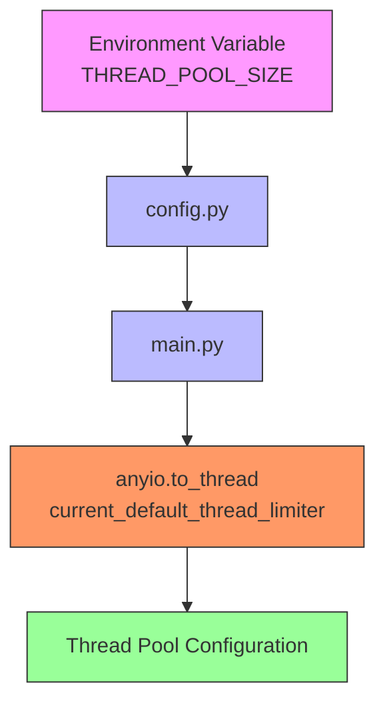
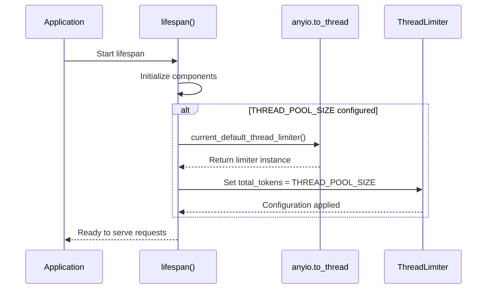
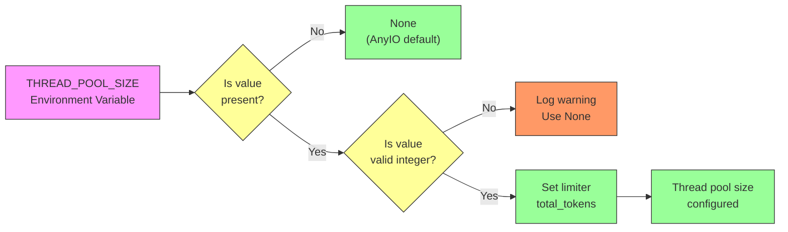

# Thread Pool Initialization

<cite>
**Referenced Files in This Document**   
- [main.py](file://backend/open_webui/main.py)
- [config.py](file://backend/open_webui/config.py)
- [env.py](file://backend/open_webui/env.py)
- [tasks.py](file://backend/open_webui/tasks.py)
</cite>

## Table of Contents
1. [Introduction](#introduction)
2. [Thread Pool Configuration](#thread-pool-configuration)
3. [Initialization Process](#initialization-process)
4. [Impact on Application Performance](#impact-on-application-performance)
5. [Configuration Parameter Relationship](#configuration-parameter-relationship)
6. [Tuning Recommendations](#tuning-recommendations)
7. [Conclusion](#conclusion)

## Introduction
This document provides comprehensive documentation on thread pool initialization in the open-webui application, focusing on the configuration and management of background task processing. The thread pool is a critical component that enables the application to handle synchronous operations efficiently within an asynchronous framework. The implementation leverages AnyIO's thread limiter to control the number of worker threads available for executing blocking operations, ensuring optimal performance and resource utilization.

**Section sources**
- [main.py](file://backend/open_webui/main.py#L1-L100)

## Thread Pool Configuration
The thread pool configuration in open-webui is controlled through the `THREAD_POOL_SIZE` environment variable, which determines the maximum number of worker threads available for background task execution. This configuration parameter is defined in the `config.py` file and is initialized from the environment variables during application startup.

The thread pool size can be set to any positive integer value, with the default being `None` (which allows AnyIO to determine the optimal number of threads based on the system configuration). When a specific value is provided, it directly sets the `total_tokens` property of AnyIO's default thread limiter, effectively capping the number of concurrent threads that can be used for synchronous operations.

**Diagram sources **
- [config.py](file://backend/open_webui/config.py#L1576-L1587)
- [main.py](file://backend/open_webui/main.py#L599-L602)

**Section sources**
- [config.py](file://backend/open_webui/config.py#L1576-L1587)
- [main.py](file://backend/open_webui/main.py#L599-L602)

## Initialization Process
The thread pool initialization occurs during the application's lifespan setup, specifically within the `lifespan` context manager in the `main.py` file. This initialization takes place before the application begins handling requests, ensuring that the thread pool configuration is established early in the startup process.

The initialization process follows these steps:
1. The application checks if `THREAD_POOL_SIZE` is defined and greater than zero
2. If valid, it retrieves the current default thread limiter from AnyIO
3. The limiter's `total_tokens` property is set to the specified thread pool size
4. The configuration takes effect immediately for all subsequent thread operations

This initialization is implemented as a conditional check that only configures the thread pool when a valid size is specified, allowing the application to fall back to AnyIO's default behavior when no explicit configuration is provided.

**Diagram sources **
- [main.py](file://backend/open_webui/main.py#L569-L602)

**Section sources**
- [main.py](file://backend/open_webui/main.py#L569-L602)

## Impact on Application Performance
The thread pool size has a significant impact on the application's performance and concurrency characteristics. A properly configured thread pool ensures efficient handling of synchronous operations without overwhelming system resources.

When the thread pool size is too small, the application may experience bottlenecks when handling multiple concurrent blocking operations, leading to increased latency and potential timeouts. Conversely, when the thread pool size is too large, it can lead to excessive memory consumption and CPU context switching overhead, which can degrade overall performance.

The thread pool primarily affects operations that cannot be easily converted to asynchronous equivalents, such as:
- CPU-intensive computations
- Blocking I/O operations from third-party libraries
- Legacy code that doesn't support async/await patterns
- External system integrations with synchronous APIs

By controlling the number of worker threads, the application can balance responsiveness with resource efficiency, preventing thread exhaustion while maintaining good throughput for background tasks.

**Section sources**
- [main.py](file://backend/open_webui/main.py#L599-L602)
- [tasks.py](file://backend/open_webui/tasks.py#L1-L50)

## Configuration Parameter Relationship
The relationship between the `THREAD_POOL_SIZE` configuration parameter and the actual thread pool configuration is direct and straightforward. The environment variable value is converted to an integer and assigned to the `total_tokens` property of AnyIO's default thread limiter.

The configuration process includes validation to ensure the provided value is a valid integer. If the environment variable contains a non-numeric value, the application logs a warning and defaults to `None`, allowing AnyIO to use its default thread pool sizing strategy.

The configuration parameter is defined in `config.py` with the following implementation:
- It reads the `THREAD_POOL_SIZE` environment variable
- Attempts to convert the string value to an integer
- Handles conversion errors gracefully by logging a warning and using `None`
- Makes the validated value available to the application through the configuration system

This approach provides flexibility in deployment while ensuring robust error handling for invalid configurations.

**Diagram sources **
- [config.py](file://backend/open_webui/config.py#L1576-L1587)

**Section sources**
- [config.py](file://backend/open_webui/config.py#L1576-L1587)

## Tuning Recommendations
When tuning the thread pool size for optimal performance, consider the following guidelines based on system resources and workload characteristics:

### System Resource Considerations
- **CPU Cores**: As a general rule, the thread pool size should not exceed the number of CPU cores for CPU-intensive workloads
- **Memory**: Each thread consumes memory for its stack, so ensure sufficient RAM is available
- **I/O Bound Workloads**: For I/O-heavy applications, a larger thread pool may be beneficial as threads spend time waiting

### Workload-Based Recommendations
- **Light Workloads**: Start with 2-4 threads for applications with minimal background processing
- **Moderate Workloads**: Use 8-16 threads for applications with regular background tasks
- **Heavy Workloads**: Consider 32+ threads for applications with intensive processing requirements

### Monitoring and Adjustment
- Monitor application performance metrics before and after changes
- Watch for signs of thread starvation (increased latency) or resource exhaustion
- Adjust incrementally and test thoroughly in a staging environment
- Consider the overall system load and other running processes

The optimal thread pool size depends on the specific use case, hardware configuration, and expected workload patterns. It's recommended to start with conservative values and adjust based on performance monitoring and real-world usage patterns.

**Section sources**
- [config.py](file://backend/open_webui/config.py#L1576-L1587)
- [main.py](file://backend/open_webui/main.py#L599-L602)

## Conclusion
The thread pool initialization in open-webui provides a flexible mechanism for controlling background task execution through the `THREAD_POOL_SIZE` configuration parameter. By leveraging AnyIO's thread limiter, the application can efficiently manage synchronous operations within its asynchronous architecture. Proper configuration of the thread pool size is crucial for achieving optimal performance, balancing responsiveness with resource efficiency. The initialization process is well-integrated into the application's startup sequence, ensuring that thread pool settings are applied before the application begins handling requests. When tuning the thread pool size, administrators should consider their specific hardware, workload characteristics, and performance requirements to achieve the best results.