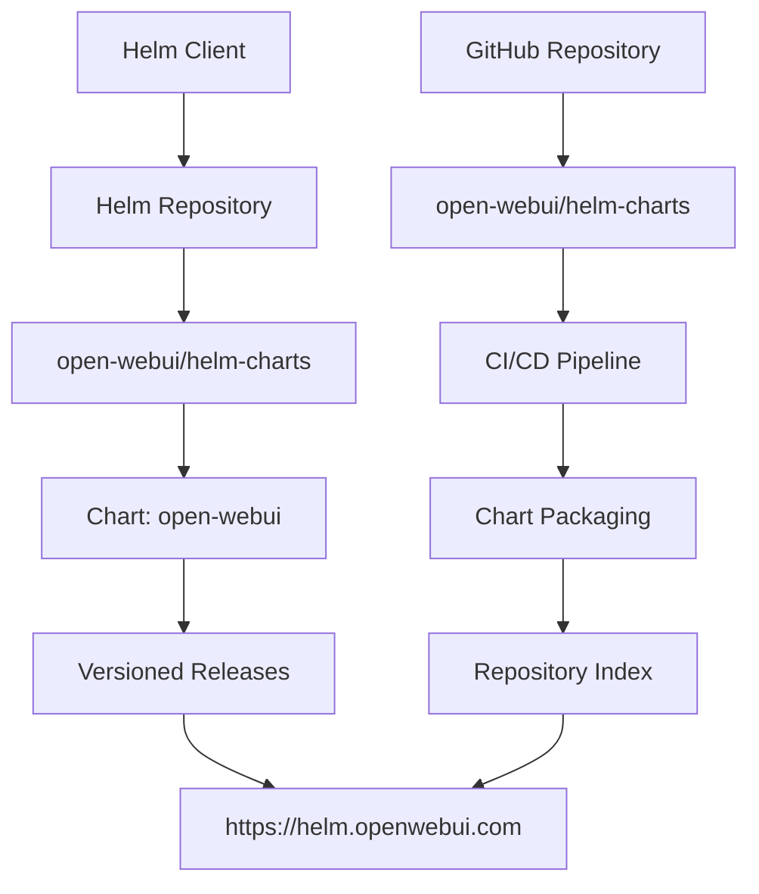
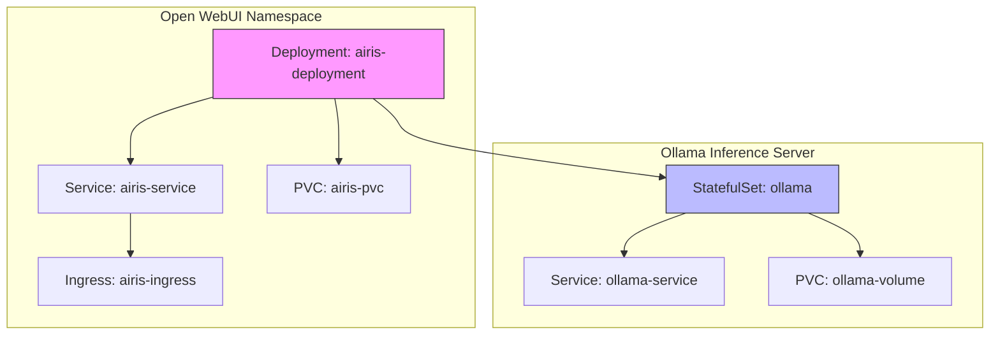
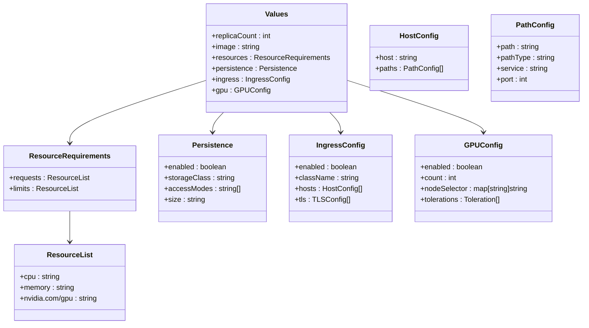
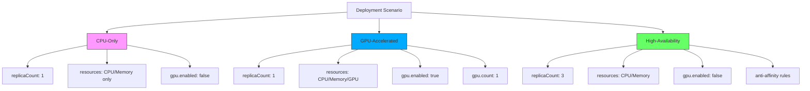
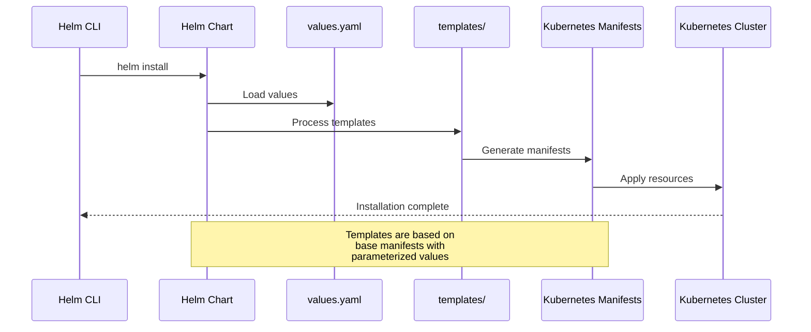
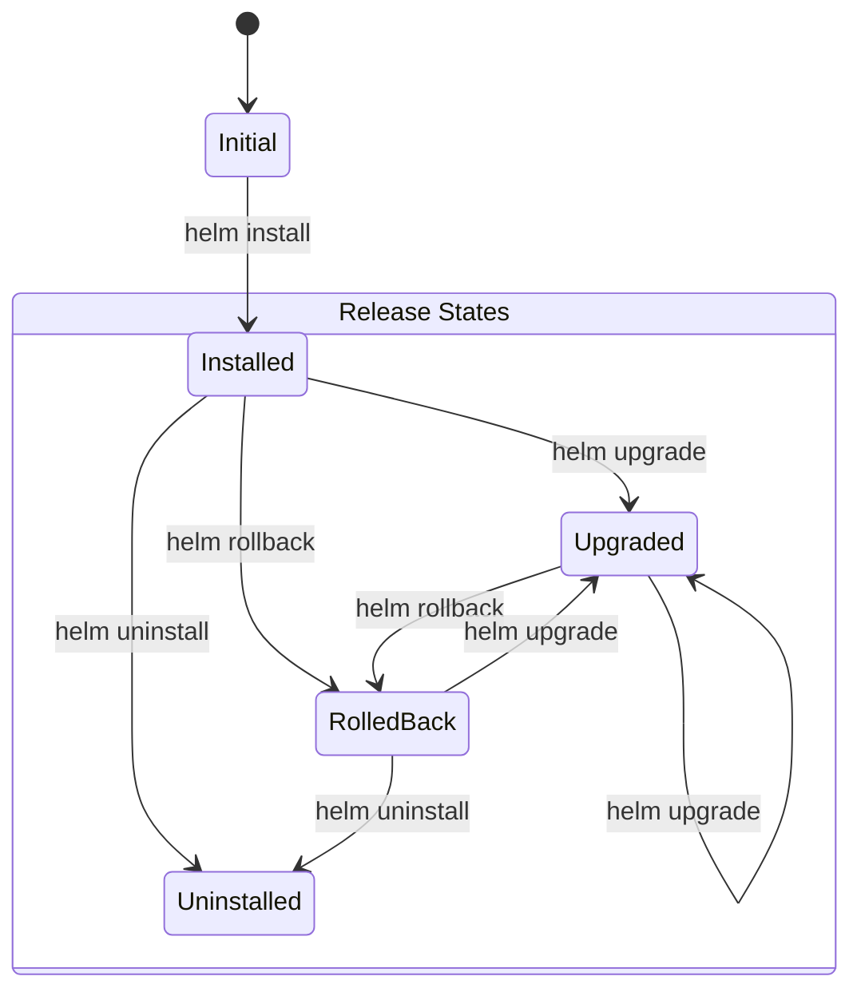
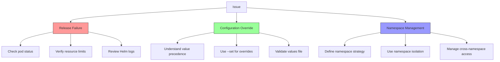

# Helm Deployment

<cite>
**Referenced Files in This Document**   
- [README.md](file://kubernetes/helm/README.md)
- [webui-deployment.yaml](file://kubernetes/manifest/base/webui-deployment.yaml)
- [webui-service.yaml](file://kubernetes/manifest/base/webui-service.yaml)
- [webui-ingress.yaml](file://kubernetes/manifest/base/webui-ingress.yaml)
- [webui-pvc.yaml](file://kubernetes/manifest/base/webui-pvc.yaml)
- [ollama-statefulset.yaml](file://kubernetes/manifest/base/ollama-statefulset.yaml)
- [ollama-service.yaml](file://kubernetes/manifest/base/ollama-service.yaml)
- [kustomization.yaml](file://kubernetes/manifest/base/kustomization.yaml)
- [ollama-statefulset-gpu.yaml](file://kubernetes/manifest/gpu/ollama-statefulset-gpu.yaml)
- [kustomization.yaml](file://kubernetes/manifest/gpu/kustomization.yaml)
</cite>

## Table of Contents
1. [Introduction](#introduction)
2. [Helm Chart Structure and Repository](#helm-chart-structure-and-repository)
3. [Core Components Overview](#core-components-overview)
4. [Values Configuration Options](#values-configuration-options)
5. [Deployment Scenarios](#deployment-scenarios)
6. [Helm Template Resource Generation](#helm-template-resource-generation)
7. [Release Management](#release-management)
8. [Common Helm Issues and Troubleshooting](#common-helm-issues-and-troubleshooting)
9. [Conclusion](#conclusion)

## Introduction
This document provides comprehensive guidance on deploying Open WebUI using Helm, a Kubernetes package manager. The focus is on understanding the Helm chart structure, configuration options, and deployment workflows for the Open WebUI application. Although the Helm charts are hosted externally, this documentation explains how to use them effectively with the base Kubernetes manifests provided in the repository. The deployment includes both the Open WebUI frontend/backend and the Ollama inference server, with support for CPU-only and GPU-accelerated configurations.

## Helm Chart Structure and Repository
The Open WebUI Helm charts are maintained in a separate repository and published to a dedicated Helm repository. This separation allows for independent versioning and distribution of the Helm charts from the main application codebase.

**Diagram sources**
- [README.md](file://kubernetes/helm/README.md)

**Section sources**
- [README.md](file://kubernetes/helm/README.md)

## Core Components Overview
The Open WebUI deployment consists of several core Kubernetes components that work together to provide the complete application functionality. These components are defined in the base manifests and can be customized through Helm values.

**Diagram sources**
- [webui-deployment.yaml](file://kubernetes/manifest/base/webui-deployment.yaml)
- [webui-service.yaml](file://kubernetes/manifest/base/webui-service.yaml)
- [webui-ingress.yaml](file://kubernetes/manifest/base/webui-ingress.yaml)
- [webui-pvc.yaml](file://kubernetes/manifest/base/webui-pvc.yaml)
- [ollama-statefulset.yaml](file://kubernetes/manifest/base/ollama-statefulset.yaml)
- [ollama-service.yaml](file://kubernetes/manifest/base/ollama-service.yaml)

**Section sources**
- [webui-deployment.yaml](file://kubernetes/manifest/base/webui-deployment.yaml)
- [webui-service.yaml](file://kubernetes/manifest/base/webui-service.yaml)
- [webui-ingress.yaml](file://kubernetes/manifest/base/webui-ingress.yaml)
- [webui-pvc.yaml](file://kubernetes/manifest/base/webui-pvc.yaml)
- [ollama-statefulset.yaml](file://kubernetes/manifest/base/ollama-statefulset.yaml)
- [ollama-service.yaml](file://kubernetes/manifest/base/ollama-service.yaml)

## Values Configuration Options
The Helm chart for Open WebUI supports various configuration options through values that can be customized during installation. These values control key aspects of the deployment including scaling, resource allocation, storage, networking, and hardware acceleration.

### Replica Count
The number of pod replicas for both the Open WebUI application and Ollama service can be configured to support different availability and performance requirements.

### Resource Allocation
CPU and memory resources can be specified for both requests and limits, allowing for proper resource management and quality of service guarantees.

### Persistent Storage
Persistent Volume Claims (PVCs) are used to ensure data persistence for both the Open WebUI application data and Ollama model storage.

### Ingress Settings
Ingress configuration allows for external access to the application with customizable hostnames and path routing.

### GPU Enablement
The deployment supports GPU acceleration for the Ollama inference server, with configurable GPU resource limits.

**Diagram sources**
- [webui-deployment.yaml](file://kubernetes/manifest/base/webui-deployment.yaml)
- [ollama-statefulset.yaml](file://kubernetes/manifest/base/ollama-statefulset.yaml)
- [webui-service.yaml](file://kubernetes/manifest/base/webui-service.yaml)
- [webui-ingress.yaml](file://kubernetes/manifest/base/webui-ingress.yaml)
- [webui-pvc.yaml](file://kubernetes/manifest/base/webui-pvc.yaml)

**Section sources**
- [webui-deployment.yaml](file://kubernetes/manifest/base/webui-deployment.yaml)
- [ollama-statefulset.yaml](file://kubernetes/manifest/base/ollama-statefulset.yaml)
- [webui-service.yaml](file://kubernetes/manifest/base/webui-service.yaml)
- [webui-ingress.yaml](file://kubernetes/manifest/base/webui-ingress.yaml)
- [webui-pvc.yaml](file://kubernetes/manifest/base/webui-pvc.yaml)

## Deployment Scenarios
The Helm chart supports various deployment scenarios through custom values files that configure the application for specific use cases.

### CPU-Only Deployment
A standard deployment that uses only CPU resources for both the Open WebUI application and Ollama inference server.

### GPU-Accelerated Deployment
A deployment that enables GPU acceleration for the Ollama inference server to improve model inference performance.

### High-Availability Deployment
A deployment configuration with multiple replicas and redundant components for improved availability.

**Diagram sources**
- [webui-deployment.yaml](file://kubernetes/manifest/base/webui-deployment.yaml)
- [ollama-statefulset.yaml](file://kubernetes/manifest/base/ollama-statefulset.yaml)
- [ollama-statefulset-gpu.yaml](file://kubernetes/manifest/gpu/ollama-statefulset-gpu.yaml)

**Section sources**
- [webui-deployment.yaml](file://kubernetes/manifest/base/webui-deployment.yaml)
- [ollama-statefulset.yaml](file://kubernetes/manifest/base/ollama-statefulset.yaml)
- [ollama-statefulset-gpu.yaml](file://kubernetes/manifest/gpu/ollama-statefulset-gpu.yaml)

## Helm Template Resource Generation
The Helm templates generate the necessary Kubernetes resources based on the provided values. These templates are derived from the base manifests in the repository and are parameterized to allow for customization.

**Diagram sources**
- [webui-deployment.yaml](file://kubernetes/manifest/base/webui-deployment.yaml)
- [webui-service.yaml](file://kubernetes/manifest/base/webui-service.yaml)
- [webui-ingress.yaml](file://kubernetes/manifest/base/webui-ingress.yaml)
- [webui-pvc.yaml](file://kubernetes/manifest/base/webui-pvc.yaml)
- [ollama-statefulset.yaml](file://kubernetes/manifest/base/ollama-statefulset.yaml)
- [ollama-service.yaml](file://kubernetes/manifest/base/ollama-service.yaml)

**Section sources**
- [webui-deployment.yaml](file://kubernetes/manifest/base/webui-deployment.yaml)
- [webui-service.yaml](file://kubernetes/manifest/base/webui-service.yaml)
- [webui-ingress.yaml](file://kubernetes/manifest/base/webui-ingress.yaml)
- [webui-pvc.yaml](file://kubernetes/manifest/base/webui-pvc.yaml)
- [ollama-statefulset.yaml](file://kubernetes/manifest/base/ollama-statefulset.yaml)
- [ollama-service.yaml](file://kubernetes/manifest/base/ollama-service.yaml)

## Release Management
Effective release management is crucial for maintaining a stable Open WebUI deployment. This includes installation, upgrades, rollbacks, and uninstallation procedures.

### Installation
The Helm chart can be installed using the `helm install` command with custom values.

### Upgrading
Releases can be upgraded to new versions or with updated configuration using `helm upgrade`.

### Rollbacks
If an upgrade causes issues, the release can be rolled back to a previous revision using `helm rollback`.

### Uninstallation
The deployment can be completely removed using `helm uninstall`.

**Section sources**
- [webui-deployment.yaml](file://kubernetes/manifest/base/webui-deployment.yaml)
- [ollama-statefulset.yaml](file://kubernetes/manifest/base/ollama-statefulset.yaml)

## Common Helm Issues and Troubleshooting
Several common issues may arise when working with Helm charts for Open WebUI. Understanding these issues and their solutions is essential for successful deployment and maintenance.

### Release Failures
Installation or upgrade failures can occur due to various reasons including resource constraints, network issues, or configuration errors.

### Configuration Overrides
Understanding how values are merged and overridden is crucial for managing complex configurations across multiple environments.

### Namespace Management
Proper namespace management ensures isolation and organization of resources, but requires careful planning and coordination.

**Section sources**
- [webui-deployment.yaml](file://kubernetes/manifest/base/webui-deployment.yaml)
- [ollama-statefulset.yaml](file://kubernetes/manifest/base/ollama-statefulset.yaml)
- [webui-service.yaml](file://kubernetes/manifest/base/webui-service.yaml)

## Conclusion
The Helm deployment of Open WebUI provides a flexible and scalable way to deploy the application on Kubernetes. By leveraging the externally hosted Helm chart and understanding the base manifests, users can customize their deployments for various scenarios including CPU-only, GPU-accelerated, and high-availability configurations. Effective release management practices ensure smooth operations, while awareness of common issues enables quick troubleshooting and resolution. The separation of the Helm charts from the main repository allows for independent versioning and distribution, making it easier to maintain and update the deployment configuration.