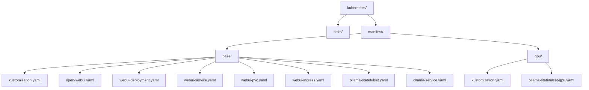
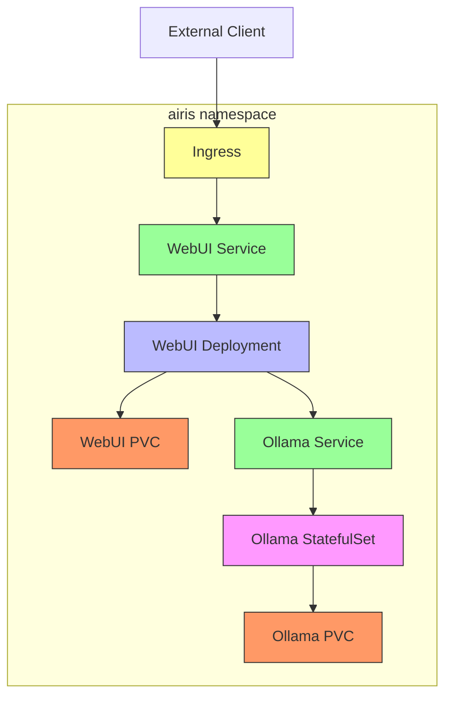
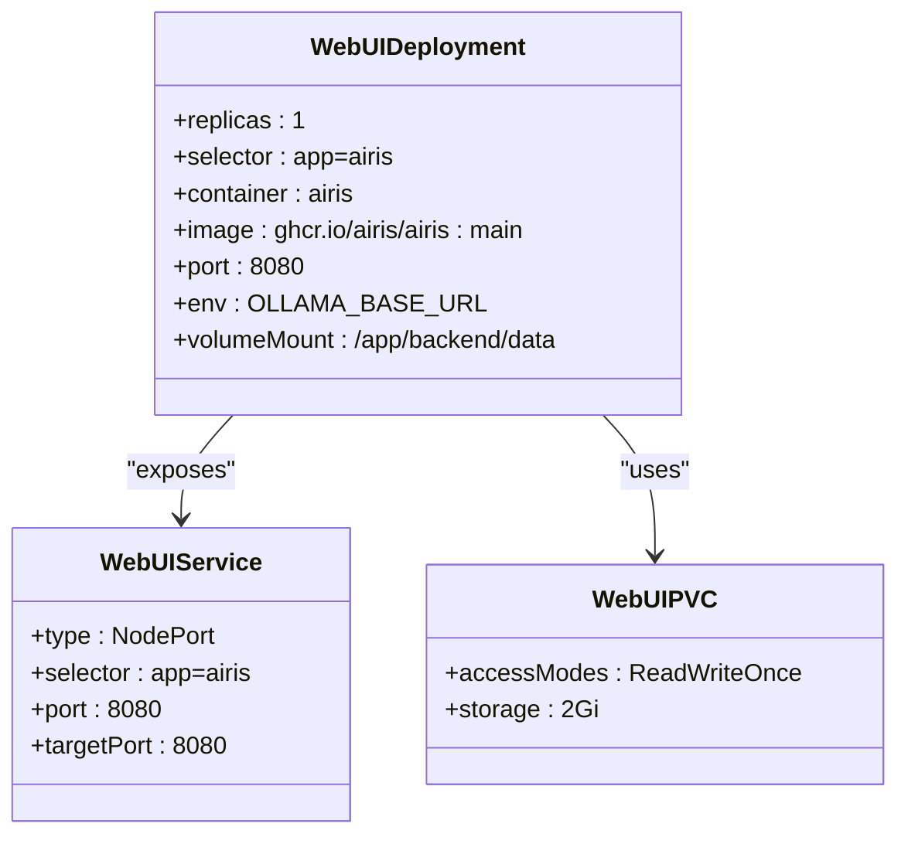
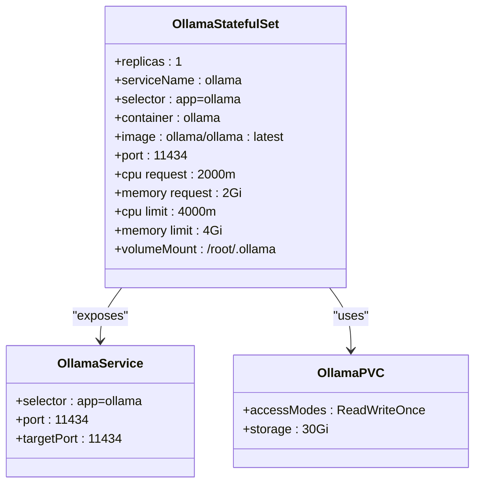
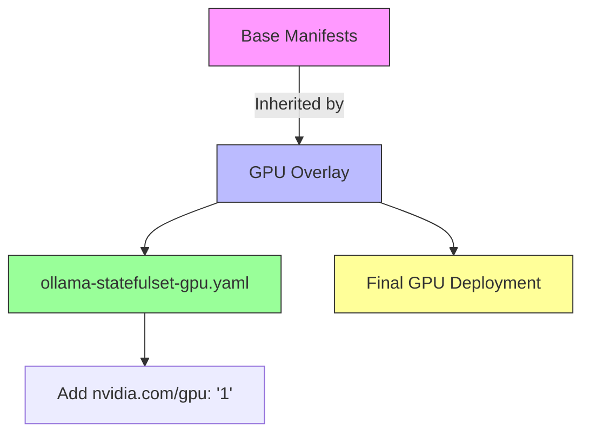
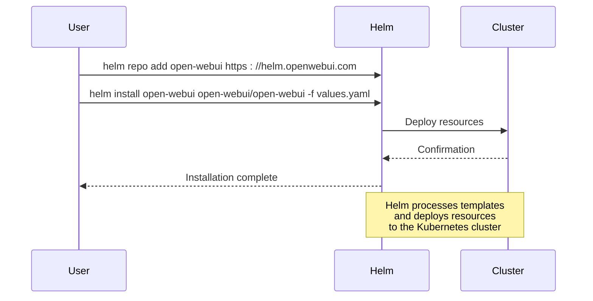
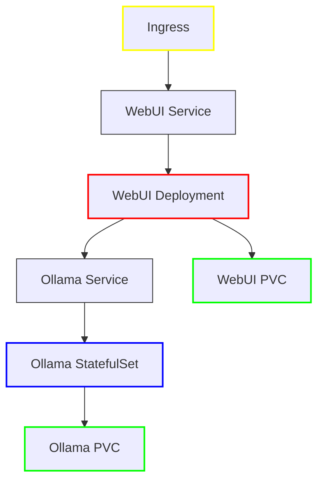

# Kubernetes Deployment

<cite>
**Referenced Files in This Document**   
- [kustomization.yaml](file://kubernetes/manifest/base/kustomization.yaml)
- [webui-deployment.yaml](file://kubernetes/manifest/base/webui-deployment.yaml)
- [webui-service.yaml](file://kubernetes/manifest/base/webui-service.yaml)
- [webui-pvc.yaml](file://kubernetes/manifest/base/webui-pvc.yaml)
- [webui-ingress.yaml](file://kubernetes/manifest/base/webui-ingress.yaml)
- [open-webui.yaml](file://kubernetes/manifest/base/open-webui.yaml)
- [ollama-statefulset.yaml](file://kubernetes/manifest/base/ollama-statefulset.yaml)
- [ollama-service.yaml](file://kubernetes/manifest/base/ollama-service.yaml)
- [gpu/kustomization.yaml](file://kubernetes/manifest/gpu/kustomization.yaml)
- [gpu/ollama-statefulset-gpu.yaml](file://kubernetes/manifest/gpu/ollama-statefulset-gpu.yaml)
- [helm/README.md](file://kubernetes/helm/README.md)
</cite>

## Table of Contents
1. [Introduction](#introduction)
2. [Project Structure](#project-structure)
3. [Core Components](#core-components)
4. [Architecture Overview](#architecture-overview)
5. [Detailed Component Analysis](#detailed-component-analysis)
6. [Dependency Analysis](#dependency-analysis)
7. [Performance Considerations](#performance-considerations)
8. [Troubleshooting Guide](#troubleshooting-guide)
9. [Conclusion](#conclusion)

## Introduction
This document provides comprehensive guidance for deploying Open WebUI on Kubernetes using both Kustomize and Helm. The deployment configuration supports both CPU-only and GPU-accelerated environments, with dedicated manifests for each use case. The documentation covers the base Kubernetes manifests, Kustomize overlays for GPU configurations, and references the external Helm chart repository for advanced deployment options.

## Project Structure



**Diagram sources**
- [kustomization.yaml](file://kubernetes/manifest/base/kustomization.yaml)
- [open-webui.yaml](file://kubernetes/manifest/base/open-webui.yaml)
- [webui-deployment.yaml](file://kubernetes/manifest/base/webui-deployment.yaml)
- [webui-service.yaml](file://kubernetes/manifest/base/webui-service.yaml)
- [webui-pvc.yaml](file://kubernetes/manifest/base/webui-pvc.yaml)
- [webui-ingress.yaml](file://kubernetes/manifest/base/webui-ingress.yaml)
- [ollama-statefulset.yaml](file://kubernetes/manifest/base/ollama-statefulset.yaml)
- [ollama-service.yaml](file://kubernetes/manifest/base/ollama-service.yaml)
- [gpu/kustomization.yaml](file://kubernetes/manifest/gpu/kustomization.yaml)
- [gpu/ollama-statefulset-gpu.yaml](file://kubernetes/manifest/gpu/ollama-statefulset-gpu.yaml)

**Section sources**
- [kustomization.yaml](file://kubernetes/manifest/base/kustomization.yaml)
- [open-webui.yaml](file://kubernetes/manifest/base/open-webui.yaml)
- [webui-deployment.yaml](file://kubernetes/manifest/base/webui-deployment.yaml)
- [webui-service.yaml](file://kubernetes/manifest/base/webui-service.yaml)
- [webui-pvc.yaml](file://kubernetes/manifest/base/webui-pvc.yaml)
- [webui-ingress.yaml](file://kubernetes/manifest/base/webui-ingress.yaml)
- [ollama-statefulset.yaml](file://kubernetes/manifest/base/ollama-statefulset.yaml)
- [ollama-service.yaml](file://kubernetes/manifest/base/ollama-service.yaml)
- [gpu/kustomization.yaml](file://kubernetes/manifest/gpu/kustomization.yaml)
- [gpu/ollama-statefulset-gpu.yaml](file://kubernetes/manifest/gpu/ollama-statefulset-gpu.yaml)

## Core Components

The Open WebUI Kubernetes deployment consists of several core components organized in the kubernetes/ directory. The base manifests provide a complete CPU-only deployment configuration, while the GPU-specific configuration extends this base with GPU resource allocation. The architecture includes separate StatefulSets for Ollama and the web UI, persistent volume claims for data storage, services for internal communication, and ingress configuration for external access.

**Section sources**
- [kustomization.yaml](file://kubernetes/manifest/base/kustomization.yaml)
- [webui-deployment.yaml](file://kubernetes/manifest/base/webui-deployment.yaml)
- [ollama-statefulset.yaml](file://kubernetes/manifest/base/ollama-statefulset.yaml)
- [webui-pvc.yaml](file://kubernetes/manifest/base/webui-pvc.yaml)
- [webui-service.yaml](file://kubernetes/manifest/base/webui-service.yaml)
- [ollama-service.yaml](file://kubernetes/manifest/base/ollama-service.yaml)

## Architecture Overview



**Diagram sources**
- [webui-deployment.yaml](file://kubernetes/manifest/base/webui-deployment.yaml)
- [ollama-statefulset.yaml](file://kubernetes/manifest/base/ollama-statefulset.yaml)
- [webui-pvc.yaml](file://kubernetes/manifest/base/webui-pvc.yaml)
- [ollama-statefulset.yaml](file://kubernetes/manifest/base/ollama-statefulset.yaml)
- [webui-service.yaml](file://kubernetes/manifest/base/webui-service.yaml)
- [ollama-service.yaml](file://kubernetes/manifest/base/ollama-service.yaml)
- [webui-ingress.yaml](file://kubernetes/manifest/base/webui-ingress.yaml)

## Detailed Component Analysis

### Base Manifests Analysis

The base manifests in kubernetes/manifest/base provide a complete CPU-only deployment configuration for Open WebUI. The architecture consists of a dedicated namespace, deployments for both the web UI and Ollama service, persistent volume claims for data persistence, services for internal communication, and ingress configuration for external access.

#### Namespace Configuration
The deployment creates a dedicated namespace named "airis" to isolate the Open WebUI components from other applications in the cluster. This provides better resource management and security isolation.

**Section sources**
- [open-webui.yaml](file://kubernetes/manifest/base/open-webui.yaml)

#### Web UI Deployment
The web UI is deployed as a Deployment resource with resource requests and limits configured for CPU and memory. The container is configured to connect to the Ollama service via a service DNS name and mounts a persistent volume for data storage.



**Diagram sources**
- [webui-deployment.yaml](file://kubernetes/manifest/base/webui-deployment.yaml)
- [webui-service.yaml](file://kubernetes/manifest/base/webui-service.yaml)
- [webui-pvc.yaml](file://kubernetes/manifest/base/webui-pvc.yaml)

**Section sources**
- [webui-deployment.yaml](file://kubernetes/manifest/base/webui-deployment.yaml)
- [webui-service.yaml](file://kubernetes/manifest/base/webui-service.yaml)
- [webui-pvc.yaml](file://kubernetes/manifest/base/webui-pvc.yaml)

#### Ollama Service Configuration
Ollama is deployed as a StatefulSet to ensure stable network identifiers and persistent storage. The configuration includes resource requests and limits optimized for CPU-based inference workloads, with a large persistent volume claim to store models.



**Diagram sources**
- [ollama-statefulset.yaml](file://kubernetes/manifest/base/ollama-statefulset.yaml)
- [ollama-service.yaml](file://kubernetes/manifest/base/ollama-service.yaml)

**Section sources**
- [ollama-statefulset.yaml](file://kubernetes/manifest/base/ollama-statefulset.yaml)
- [ollama-service.yaml](file://kubernetes/manifest/base/ollama-service.yaml)

### GPU Configuration Analysis

The GPU-specific configuration in kubernetes/manifest/gpu extends the base manifests with GPU resource allocation for Ollama. This configuration enables hardware acceleration for inference workloads, significantly improving performance for large language models.

#### Kustomize Overlay Structure
The GPU configuration uses Kustomize overlays to modify the base deployment. The kustomization.yaml file references the base manifests and applies a patch to add GPU resources to the Ollama StatefulSet.



**Diagram sources**
- [gpu/kustomization.yaml](file://kubernetes/manifest/gpu/kustomization.yaml)
- [gpu/ollama-statefulset-gpu.yaml](file://kubernetes/manifest/gpu/ollama-statefulset-gpu.yaml)

**Section sources**
- [gpu/kustomization.yaml](file://kubernetes/manifest/gpu/kustomization.yaml)

#### GPU Resource Patch
The GPU patch modifies the Ollama StatefulSet to request one NVIDIA GPU for the container. This enables the Ollama service to leverage GPU acceleration for model inference, dramatically reducing response times for complex queries.

```mermaid
classDiagram
class OllamaStatefulSetBase {
+cpu request : 2000m
+memory request : 2Gi
+cpu limit : 4000m
+memory limit : 4Gi
+nvidia.com/gpu : "0"
}
class OllamaStatefulSetGPU {
+cpu request : 2000m
+memory request : 2Gi
+cpu limit : 4000m
+memory limit : 4Gi
+nvidia.com/gpu : "1"
}
OllamaStatefulSetBase --> OllamaStatefulSetGPU : "patched with"
note right of OllamaStatefulSetGPU
GPU patch adds nvidia.com/gpu : "1"
to enable GPU acceleration
end note
```

**Diagram sources**
- [gpu/ollama-statefulset-gpu.yaml](file://kubernetes/manifest/gpu/ollama-statefulset-gpu.yaml)

**Section sources**
- [gpu/ollama-statefulset-gpu.yaml](file://kubernetes/manifest/gpu/ollama-statefulset-gpu.yaml)

### Helm Chart Deployment

The Open WebUI project provides Helm charts for simplified deployment and management. The charts are hosted in a separate repository and published to a dedicated Helm repository, enabling easy installation and upgrades.

#### Helm Chart Configuration
The Helm charts offer a comprehensive set of configuration options through values.yaml, allowing customization of resources, ingress settings, persistence, and other deployment parameters. This provides a more flexible and maintainable deployment approach compared to raw manifests.



**Section sources**
- [helm/README.md](file://kubernetes/helm/README.md)

## Dependency Analysis



**Diagram sources**
- [webui-deployment.yaml](file://kubernetes/manifest/base/webui-deployment.yaml)
- [webui-service.yaml](file://kubernetes/manifest/base/webui-service.yaml)
- [webui-pvc.yaml](file://kubernetes/manifest/base/webui-pvc.yaml)
- [ollama-statefulset.yaml](file://kubernetes/manifest/base/ollama-statefulset.yaml)
- [ollama-service.yaml](file://kubernetes/manifest/base/ollama-service.yaml)
- [webui-ingress.yaml](file://kubernetes/manifest/base/webui-ingress.yaml)

**Section sources**
- [webui-deployment.yaml](file://kubernetes/manifest/base/webui-deployment.yaml)
- [webui-service.yaml](file://kubernetes/manifest/base/webui-service.yaml)
- [webui-pvc.yaml](file://kubernetes/manifest/base/webui-pvc.yaml)
- [ollama-statefulset.yaml](file://kubernetes/manifest/base/ollama-statefulset.yaml)
- [ollama-service.yaml](file://kubernetes/manifest/base/ollama-service.yaml)
- [webui-ingress.yaml](file://kubernetes/manifest/base/webui-ingress.yaml)

## Performance Considerations

The Kubernetes deployment configuration for Open WebUI includes several performance optimizations. The base manifests allocate substantial CPU and memory resources to both the web UI and Ollama components, ensuring smooth operation for typical workloads. The Ollama StatefulSet is configured with 2-4 CPU cores and 2-4GB of memory, which is sufficient for CPU-based inference with smaller language models.

For GPU-accelerated deployments, the configuration enables hardware acceleration by requesting an NVIDIA GPU resource. This dramatically improves inference performance, particularly for larger models that benefit from parallel processing on GPU hardware. The separation of the web UI and Ollama into different StatefulSets allows for independent scaling and resource allocation based on workload requirements.

Persistent storage is configured with appropriate sizes for both components: 2GB for the web UI's data storage and 30GB for Ollama's model storage. This ensures sufficient space for application data and downloaded models while allowing for future expansion.

## Troubleshooting Guide

Common deployment issues may include:
- **Networking problems**: Verify that the Ingress host (airis.minikube.local) is resolvable and that the Ingress controller is properly configured
- **Resource allocation issues**: Ensure that nodes have sufficient CPU, memory, and GPU resources available, especially for GPU deployments
- **Pod initialization failures**: Check that persistent volumes are properly provisioned and accessible
- **Service connectivity**: Verify that the OLLAMA_BASE_URL environment variable in the web UI deployment matches the Ollama service DNS name
- **GPU driver issues**: For GPU deployments, ensure that NVIDIA drivers and device plugins are properly installed on worker nodes

When troubleshooting, examine pod logs and events using kubectl commands, verify resource availability, and check the status of all Kubernetes resources in the airis namespace.

**Section sources**
- [webui-deployment.yaml](file://kubernetes/manifest/base/webui-deployment.yaml)
- [ollama-statefulset.yaml](file://kubernetes/manifest/base/ollama-statefulset.yaml)
- [webui-ingress.yaml](file://kubernetes/manifest/base/webui-ingress.yaml)

## Conclusion

The Kubernetes deployment configuration for Open WebUI provides a robust foundation for both CPU-only and GPU-accelerated deployments. The use of Kustomize enables flexible configuration management through overlays, while the availability of Helm charts offers an alternative deployment method with enhanced customization options. The architecture separates concerns between the web UI and Ollama service, provides persistent storage for data and models, and includes ingress configuration for external access. By following the documented deployment procedures and understanding the component relationships, users can successfully deploy and manage Open WebUI in various Kubernetes environments.