# Kustomize Deployment

<cite>
**Referenced Files in This Document**   
- [kustomization.yaml](file://kubernetes/manifest/base/kustomization.yaml)
- [webui-deployment.yaml](file://kubernetes/manifest/base/webui-deployment.yaml)
- [webui-service.yaml](file://kubernetes/manifest/base/webui-service.yaml)
- [webui-pvc.yaml](file://kubernetes/manifest/base/webui-pvc.yaml)
- [webui-ingress.yaml](file://kubernetes/manifest/base/webui-ingress.yaml)
- [ollama-statefulset.yaml](file://kubernetes/manifest/base/ollama-statefulset.yaml)
- [ollama-service.yaml](file://kubernetes/manifest/base/ollama-service.yaml)
- [open-webui.yaml](file://kubernetes/manifest/base/open-webui.yaml)
- [gpu/kustomization.yaml](file://kubernetes/manifest/gpu/kustomization.yaml)
- [gpu/ollama-statefulset-gpu.yaml](file://kubernetes/manifest/gpu/ollama-statefulset-gpu.yaml)
</cite>

## Table of Contents
1. [Introduction](#introduction)
2. [Project Structure](#project-structure)
3. [Core Components](#core-components)
4. [Architecture Overview](#architecture-overview)
5. [Detailed Component Analysis](#detailed-component-analysis)
6. [Dependency Analysis](#dependency-analysis)
7. [Performance Considerations](#performance-considerations)
8. [Troubleshooting Guide](#troubleshooting-guide)
9. [Conclusion](#conclusion)

## Introduction
This document provides comprehensive guidance on deploying open-webui using Kustomize, focusing on the base configuration in kubernetes/manifest/base and its customization through overlays for different environments. The deployment consists of two main components: the open-webui interface and the Ollama backend service, both configured to run in a Kubernetes cluster with support for both CPU and GPU workloads.

## Project Structure
The Kustomize configuration is organized into base and overlay directories, following Kubernetes best practices for configuration management. The base directory contains common manifests that define the core application resources, while the gpu overlay provides environment-specific modifications for GPU-enabled deployments.

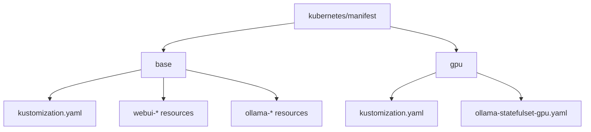

**Diagram sources**
- [kustomization.yaml](file://kubernetes/manifest/base/kustomization.yaml)
- [gpu/kustomization.yaml](file://kubernetes/manifest/gpu/kustomization.yaml)

**Section sources**
- [kustomization.yaml](file://kubernetes/manifest/base/kustomization.yaml)
- [gpu/kustomization.yaml](file://kubernetes/manifest/gpu/kustomization.yaml)

## Core Components
The deployment consists of several Kubernetes resources that work together to provide the open-webui service. These include Deployment, Service, PVC, Ingress, and StatefulSet resources, each serving a specific purpose in the application architecture. The base configuration is designed to be environment-agnostic, allowing for easy customization through overlays.

**Section sources**
- [webui-deployment.yaml](file://kubernetes/manifest/base/webui-deployment.yaml)
- [ollama-statefulset.yaml](file://kubernetes/manifest/base/ollama-statefulset.yaml)
- [webui-service.yaml](file://kubernetes/manifest/base/webui-service.yaml)
- [ollama-service.yaml](file://kubernetes/manifest/base/ollama-service.yaml)

## Architecture Overview
The architecture consists of two main applications: open-webui (referred to as airis in the manifests) and Ollama. The open-webui application provides the user interface and backend services, while Ollama serves as the AI model backend. These components communicate through internal Kubernetes services, with persistent storage provided by PVCs and external access enabled through Ingress.

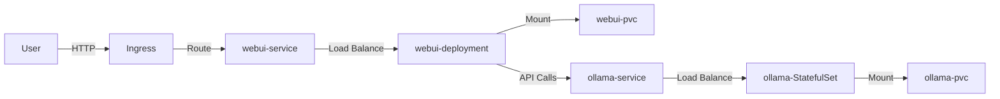

**Diagram sources**
- [webui-deployment.yaml](file://kubernetes/manifest/base/webui-deployment.yaml)
- [webui-service.yaml](file://kubernetes/manifest/base/webui-service.yaml)
- [webui-ingress.yaml](file://kubernetes/manifest/base/webui-ingress.yaml)
- [ollama-statefulset.yaml](file://kubernetes/manifest/base/ollama-statefulset.yaml)
- [ollama-service.yaml](file://kubernetes/manifest/base/ollama-service.yaml)

## Detailed Component Analysis

### Base Kustomize Configuration
The base configuration in kubernetes/manifest/base provides the foundation for deploying open-webui and Ollama. It includes all necessary Kubernetes resources with default settings suitable for CPU-based deployments. The kustomization.yaml file references all the individual manifests, allowing them to be applied as a single unit.

**Section sources**
- [kustomization.yaml](file://kubernetes/manifest/base/kustomization.yaml)

#### Deployment Resource
The webui-deployment.yaml defines the open-webui application deployment with resource requests and limits configured for CPU and memory. The container is configured to connect to the Ollama service via environment variable and mounts persistent storage for application data.

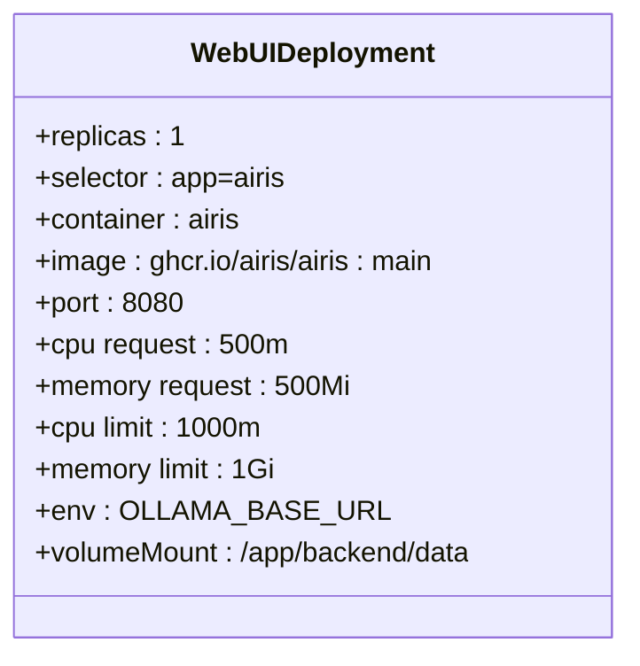

**Diagram sources**
- [webui-deployment.yaml](file://kubernetes/manifest/base/webui-deployment.yaml)

**Section sources**
- [webui-deployment.yaml](file://kubernetes/manifest/base/webui-deployment.yaml)

#### Service Resource
The webui-service.yaml defines a NodePort service that exposes the open-webui deployment within the cluster. This service can be accessed internally by other pods and externally through the NodePort or Ingress configuration.

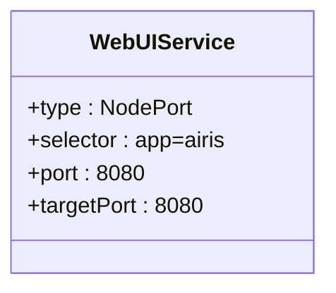

**Diagram sources**
- [webui-service.yaml](file://kubernetes/manifest/base/webui-service.yaml)

**Section sources**
- [webui-service.yaml](file://kubernetes/manifest/base/webui-service.yaml)

#### Persistent Volume Claim
The webui-pvc.yaml defines a PersistentVolumeClaim that provides 2Gi of storage for the open-webui application. This storage is used to persist user data, configurations, and other application state across pod restarts.

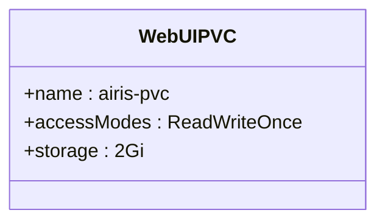

**Diagram sources**
- [webui-pvc.yaml](file://kubernetes/manifest/base/webui-pvc.yaml)

**Section sources**
- [webui-pvc.yaml](file://kubernetes/manifest/base/webui-pvc.yaml)

#### Ingress Configuration
The webui-ingress.yaml defines an Ingress resource that routes external traffic to the open-webui service. The configuration includes a host-based rule for airis.minikube.local, making the application accessible through a specific domain name.

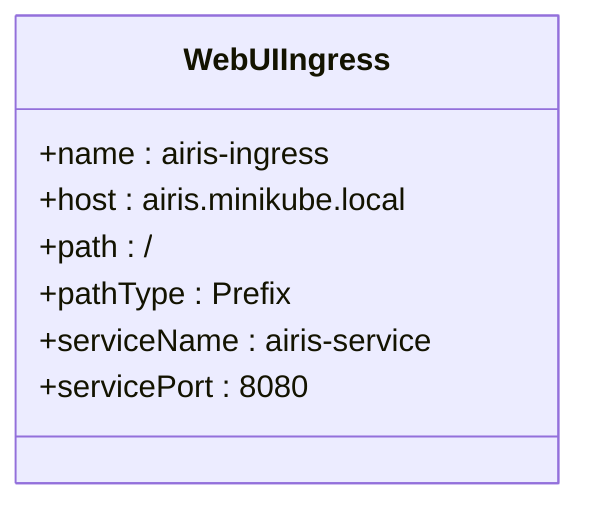

**Diagram sources**
- [webui-ingress.yaml](file://kubernetes/manifest/base/webui-ingress.yaml)

**Section sources**
- [webui-ingress.yaml](file://kubernetes/manifest/base/webui-ingress.yaml)

#### Ollama StatefulSet
The ollama-statefulset.yaml defines a StatefulSet for the Ollama service, which requires stable network identities and persistent storage for model data. The configuration includes resource requests and limits for CPU and memory, with GPU resources set to zero in the base configuration.

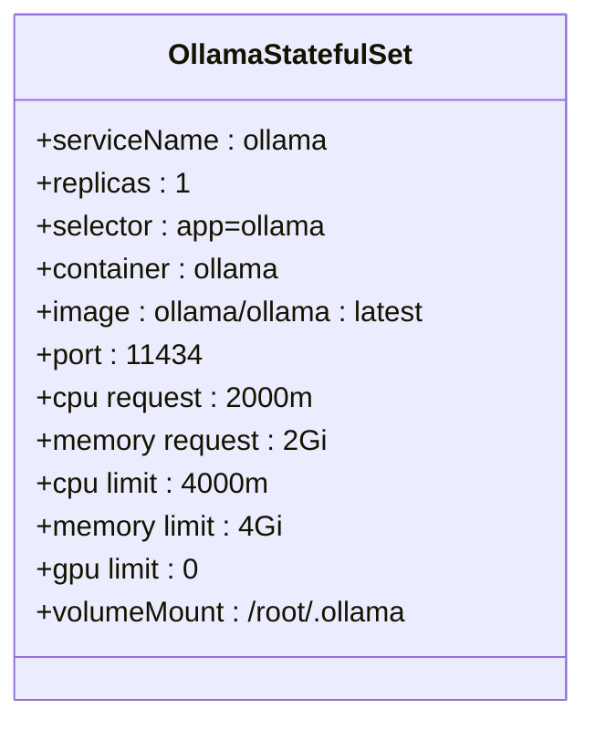

**Diagram sources**
- [ollama-statefulset.yaml](file://kubernetes/manifest/base/ollama-statefulset.yaml)

**Section sources**
- [ollama-statefulset.yaml](file://kubernetes/manifest/base/ollama-statefulset.yaml)

#### Ollama Service
The ollama-service.yaml defines a cluster-internal service that exposes the Ollama StatefulSet to other pods within the cluster. This service is used by the open-webui application to communicate with the Ollama backend.

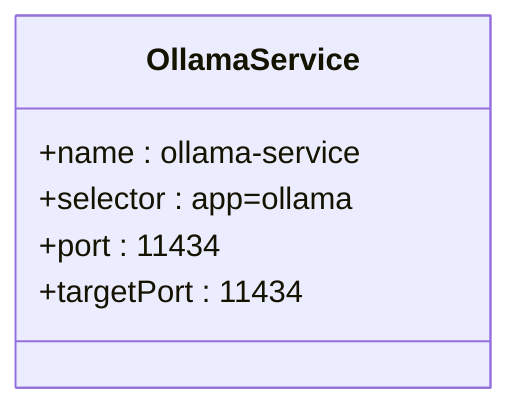

**Diagram sources**
- [ollama-service.yaml](file://kubernetes/manifest/base/ollama-service.yaml)

**Section sources**
- [ollama-service.yaml](file://kubernetes/manifest/base/ollama-service.yaml)

#### Namespace Configuration
The open-webui.yaml defines a dedicated namespace named "airis" for the application. This provides isolation from other applications in the cluster and allows for namespace-scoped resource management.

**Section sources**
- [open-webui.yaml](file://kubernetes/manifest/base/open-webui.yaml)

### Environment Customization with Overlays
The gpu overlay demonstrates how to customize the base configuration for GPU-enabled environments. This overlay uses Kustomize patches to modify the Ollama StatefulSet configuration, adding GPU resource requirements and node affinity rules.

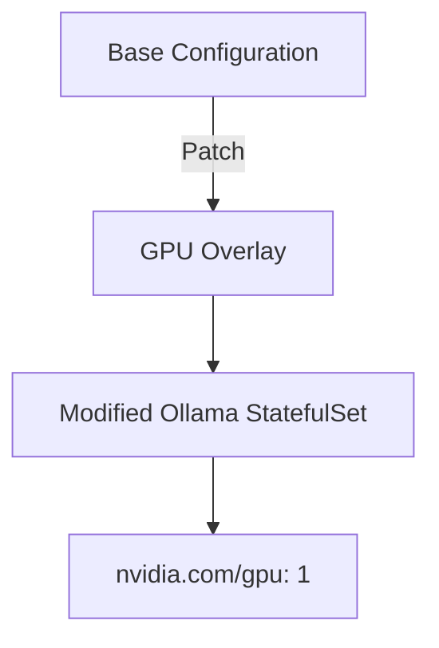

**Diagram sources**
- [gpu/kustomization.yaml](file://kubernetes/manifest/gpu/kustomization.yaml)
- [gpu/ollama-statefulset-gpu.yaml](file://kubernetes/manifest/gpu/ollama-statefulset-gpu.yaml)

**Section sources**
- [gpu/kustomization.yaml](file://kubernetes/manifest/gpu/kustomization.yaml)
- [gpu/ollama-statefulset-gpu.yaml](file://kubernetes/manifest/gpu/ollama-statefulset-gpu.yaml)

#### GPU Configuration Patch
The ollama-statefulset-gpu.yaml patch specifically targets the Ollama StatefulSet to enable GPU support. It modifies the resource limits to request one NVIDIA GPU, which triggers the Kubernetes scheduler to place the pod on a node with available GPU resources.

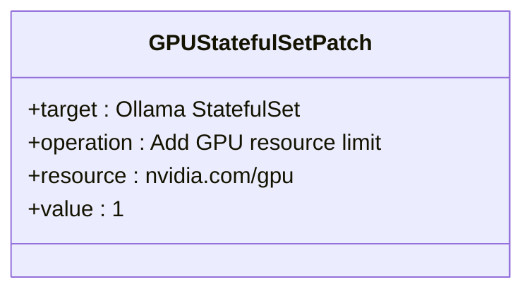

**Diagram sources**
- [gpu/ollama-statefulset-gpu.yaml](file://kubernetes/manifest/gpu/ollama-statefulset-gpu.yaml)

**Section sources**
- [gpu/ollama-statefulset-gpu.yaml](file://kubernetes/manifest/gpu/ollama-statefulset-gpu.yaml)

## Dependency Analysis
The deployment has several key dependencies between components, both within the Kubernetes cluster and external to it. The open-webui application depends on the Ollama service for AI model capabilities, while both applications depend on persistent storage for data retention.

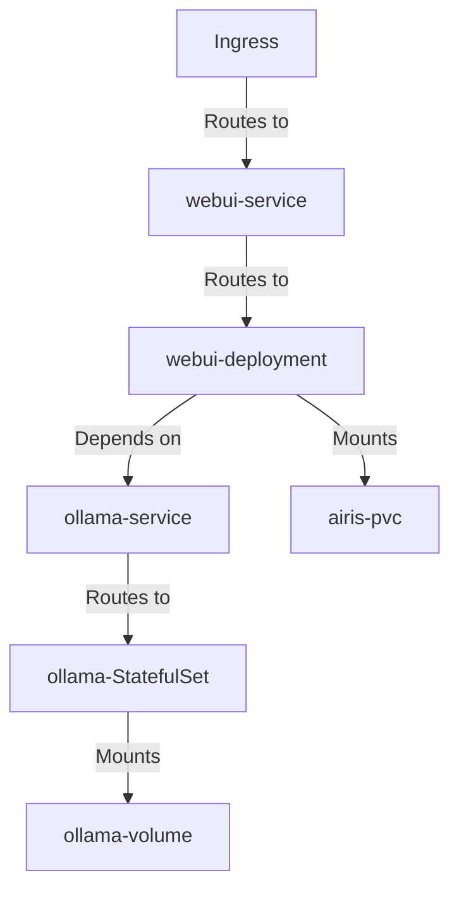

**Diagram sources**
- [webui-deployment.yaml](file://kubernetes/manifest/base/webui-deployment.yaml)
- [ollama-statefulset.yaml](file://kubernetes/manifest/base/ollama-statefulset.yaml)
- [webui-service.yaml](file://kubernetes/manifest/base/webui-service.yaml)
- [ollama-service.yaml](file://kubernetes/manifest/base/ollama-service.yaml)
- [webui-pvc.yaml](file://kubernetes/manifest/base/webui-pvc.yaml)

**Section sources**
- [webui-deployment.yaml](file://kubernetes/manifest/base/webui-deployment.yaml)
- [ollama-statefulset.yaml](file://kubernetes/manifest/base/ollama-statefulset.yaml)

## Performance Considerations
The base configuration provides reasonable resource requests and limits for CPU and memory, but these should be adjusted based on the specific workload and cluster capacity. For GPU deployments, additional considerations include GPU memory requirements and node availability.

### Resource Configuration
The current configuration requests 500m CPU and 500Mi memory for the open-webui application, with limits set to 1000m CPU and 1Gi memory. The Ollama service requests 2000m CPU and 2Gi memory, with limits at 4000m CPU and 4Gi memory. These values should be monitored and adjusted based on actual usage patterns.

### Storage Requirements
The open-webui PVC is configured with 2Gi of storage, while the Ollama volume claim template requests 30Gi. The larger storage requirement for Ollama accounts for AI model storage, which can be substantial depending on the models deployed.

## Troubleshooting Guide
Common issues with the Kustomize deployment include persistent volume binding problems, image pull errors, and service exposure through Ingress.

### Persistent Volume Binding
If pods fail to start due to persistent volume binding issues, verify that the storage class is correctly configured and that sufficient storage capacity is available in the cluster. Check the PVC and PV status using kubectl commands.

### Image Pull Errors
Image pull errors can occur if the container registry requires authentication or if the image tag is incorrect. Verify the image names and tags in the deployment manifests, and ensure that image pull secrets are configured if needed.

### Ingress Configuration
If the application is not accessible through the Ingress, verify that an Ingress controller is installed in the cluster and that the host name in the Ingress resource matches the DNS configuration. Check the Ingress controller logs for any configuration errors.

**Section sources**
- [webui-ingress.yaml](file://kubernetes/manifest/base/webui-ingress.yaml)
- [webui-deployment.yaml](file://kubernetes/manifest/base/webui-deployment.yaml)
- [webui-pvc.yaml](file://kubernetes/manifest/base/webui-pvc.yaml)

## Conclusion
The Kustomize deployment configuration for open-webui provides a flexible and maintainable approach to deploying the application in Kubernetes. The base configuration offers a solid foundation for CPU-based deployments, while the GPU overlay demonstrates how to extend this configuration for GPU-accelerated workloads. By following the patterns outlined in this document, users can customize the deployment for their specific environments and requirements.