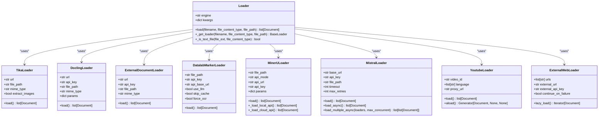
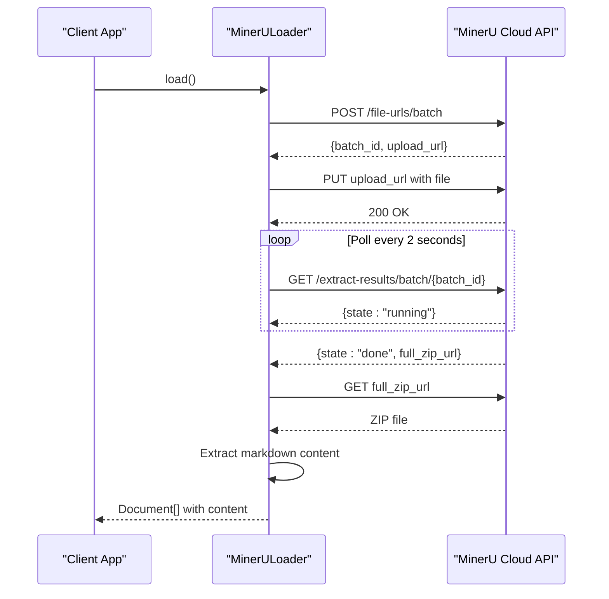
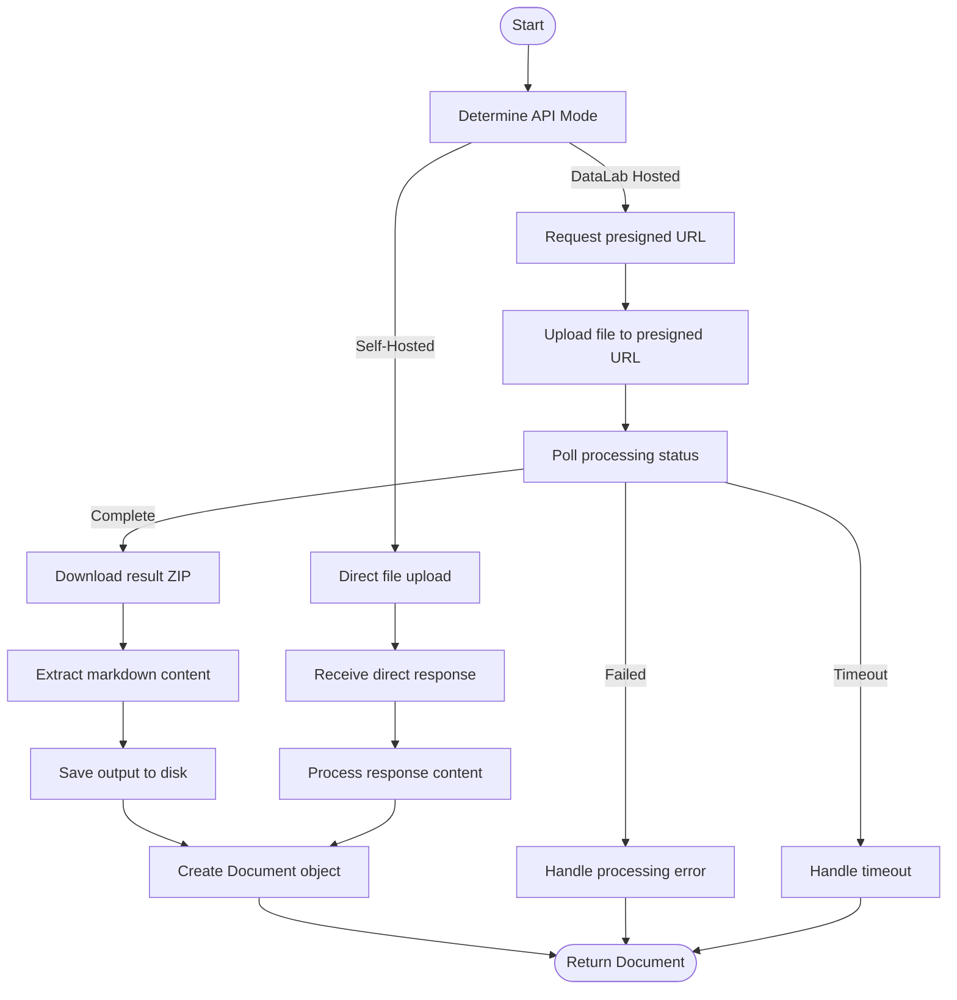
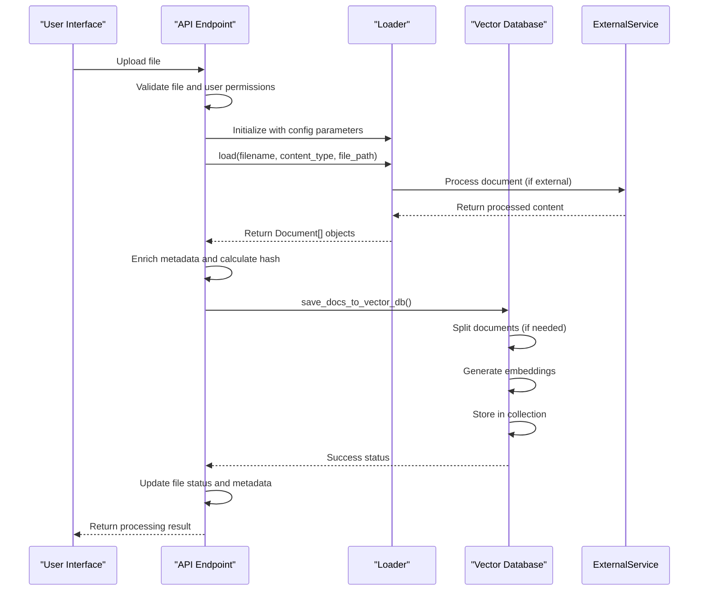
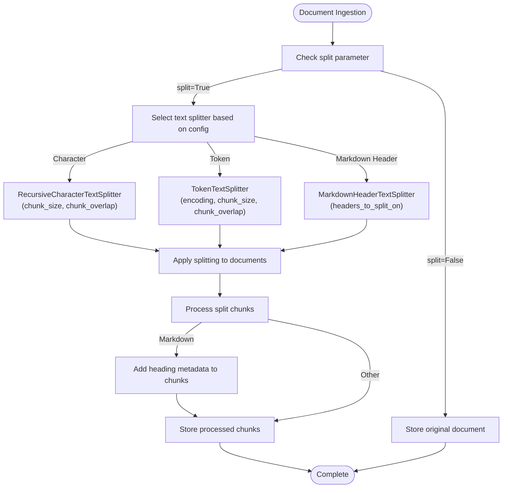

# Document Loaders

<cite>
**Referenced Files in This Document**   
- [main.py](file://backend/open_webui/retrieval/loaders/main.py)
- [mineru.py](file://backend/open_webui/retrieval/loaders/mineru.py)
- [datalab_marker.py](file://backend/open_webui/retrieval/loaders/datalab_marker.py)
- [external_document.py](file://backend/open_webui/retrieval/loaders/external_document.py)
- [mistral.py](file://backend/open_webui/retrieval/loaders/mistral.py)
- [youtube.py](file://backend/open_webui/retrieval/loaders/youtube.py)
- [external_web.py](file://backend/open_webui/retrieval/loaders/external_web.py)
- [retrieval.py](file://backend/open_webui/routers/retrieval.py)
</cite>

## Table of Contents
1. [Introduction](#introduction)
2. [Loader Architecture](#loader-architecture)
3. [Core Loader Implementations](#core-loader-implementations)
4. [Knowledge Base Integration](#knowledge-base-integration)
5. [Text Extraction and Processing](#text-extraction-and-processing)
6. [Chunking Strategies](#chunking-strategies)
7. [Metadata Enrichment](#metadata-enrichment)
8. [Error Handling and Troubleshooting](#error-handling-and-troubleshooting)
9. [Performance Optimization](#performance-optimization)
10. [Custom Loader Extension](#custom-loader-extension)

## Introduction

The Document Loaders component in the RAG system is responsible for ingesting and processing various document types to create knowledge bases for retrieval-augmented generation. This system supports multiple document formats including PDFs, web pages, structured data, and multimedia content through specialized loader implementations. The loaders extract text content, apply chunking strategies, enrich metadata, and integrate with the knowledge base creation workflow to enable effective information retrieval.

The architecture is designed to be extensible, allowing for both built-in and external document processing services. Each loader is optimized for specific document types and processing requirements, with configurable parameters for different use cases. The system handles various challenges including parsing errors, large file processing, and encoding issues through robust error handling and fallback mechanisms.

**Section sources**
- [main.py](file://backend/open_webui/retrieval/loaders/main.py#L1-L398)

## Loader Architecture

The Document Loaders system follows a factory pattern with a central Loader class that routes document processing requests to appropriate specialized loaders based on configuration and document type. The architecture supports multiple extraction engines and provides a consistent interface for document ingestion regardless of the underlying processing method.

**Diagram sources**
- [main.py](file://backend/open_webui/retrieval/loaders/main.py#L187-L398)

**Section sources**
- [main.py](file://backend/open_webui/retrieval/loaders/main.py#L1-L398)

## Core Loader Implementations

### MinerU Loader

The MinerU loader provides advanced document parsing capabilities through both local and cloud APIs. It supports PDF documents with features like OCR, formula recognition, and table extraction. The loader implements a dual-mode architecture with synchronous processing for local deployments and asynchronous batch processing for cloud services.

For local API mode, the loader sends documents directly to a self-hosted MinerU service with immediate response handling. The cloud API mode uses a three-step process: requesting a presigned upload URL, uploading the document, and polling for results with a 10-minute timeout. This approach enables processing of large documents while maintaining system responsiveness.

**Diagram sources**
- [mineru.py](file://backend/open_webui/retrieval/loaders/mineru.py#L14-L523)

**Section sources**
- [mineru.py](file://backend/open_webui/retrieval/loaders/mineru.py#L1-L523)

### Datalab Marker Loader

The Datalab Marker loader processes various document formats including PDF, Office documents, and images through the Marker API. It supports both the hosted DataLab service and self-hosted deployments with different response patterns. The loader implements a polling mechanism for the hosted service and direct response handling for self-hosted instances.

Key configuration parameters include OCR options (force_ocr, strip_existing_ocr), layout preservation (paginate, format_lines), and image handling (disable_image_extraction). The loader automatically detects MIME types based on file extensions and includes comprehensive metadata in the output documents, including page count, processing cost, and image information.

**Diagram sources**
- [datalab_marker.py](file://backend/open_webui/retrieval/loaders/datalab_marker.py#L13-L279)

**Section sources**
- [datalab_marker.py](file://backend/open_webui/retrieval/loaders/datalab_marker.py#L1-L279)

### External Document Loader

The External Document Loader enables integration with custom document processing services through a standardized API interface. It sends documents to external endpoints with configurable authentication and headers, supporting both single document and batch processing workflows. The loader preserves user context by including user information in request headers when available.

The implementation uses a simple PUT request with the document content in the body and metadata in headers, including content type, filename, and authorization. Response handling supports both single document and batch responses, with appropriate error handling for connection issues, authentication failures, and invalid responses. This loader serves as a bridge to specialized document processing services not natively supported by the system.

**Section sources**
- [external_document.py](file://backend/open_webui/retrieval/loaders/external_document.py#L1-L92)

### YouTube Loader

The YouTube Loader extracts transcripts from YouTube videos using the youtube_transcript_api library. It supports multiple languages with a fallback mechanism that prioritizes manually created transcripts over automatically generated ones. The loader implements a language priority system, attempting to retrieve transcripts in the specified order with English as the final fallback.

The implementation includes robust error handling for common issues such as disabled transcripts, region restrictions, and empty transcripts. It processes the transcript pieces into a continuous text string while preserving the original timing information in the metadata. The loader also provides asynchronous loading capabilities through Python's asyncio framework for improved performance in batch operations.

**Section sources**
- [youtube.py](file://backend/open_webui/retrieval/loaders/youtube.py#L1-L167)

### External Web Loader

The External Web Loader retrieves content from web pages through external processing services. It implements batch processing with a configurable batch size (default 20 URLs) to optimize API usage and reduce request overhead. The loader continues processing on failure when configured, allowing partial success in batch operations with individual error reporting.

The implementation uses POST requests with JSON payloads containing URL arrays, enabling efficient processing of multiple web pages in a single request. It includes standard headers identifying the client and providing authentication, with configurable continuation behavior on errors. This loader is particularly useful for processing large sets of web content through specialized web scraping or content extraction services.

**Section sources**
- [external_web.py](file://backend/open_webui/retrieval/loaders/external_web.py#L1-L54)

## Knowledge Base Integration

The Document Loaders integrate with the knowledge base creation workflow through the process_file function, which orchestrates document ingestion, processing, and storage. The workflow begins with file retrieval and validation, followed by content extraction using the appropriate loader based on configuration and document type.

**Diagram sources**
- [retrieval.py](file://backend/open_webui/routers/retrieval.py#L1445-L1644)

**Section sources**
- [retrieval.py](file://backend/open_webui/routers/retrieval.py#L1445-L1644)

## Text Extraction and Processing

The system employs different text extraction strategies based on document type and configured extraction engine. For text-based files, it uses direct reading with encoding detection, while binary formats like PDFs use specialized libraries or external services. The main.py file defines the routing logic that selects the appropriate extraction method based on file extension, content type, and configuration settings.

Text processing includes normalization using the ftfy library to fix common Unicode and encoding issues, ensuring consistent text representation across different document sources. The system also handles various edge cases such as malformed HTML, corrupted PDFs, and non-standard encodings through fallback mechanisms and error recovery strategies.

For structured documents like PDFs, the system supports multiple extraction approaches including PyPDFLoader for basic text extraction, Tika for comprehensive content analysis, and specialized services like MinerU and Datalab Marker for advanced layout preservation and element recognition. The choice of extraction method can be configured globally or on a per-document basis.

**Section sources**
- [main.py](file://backend/open_webui/retrieval/loaders/main.py#L1-L398)

## Chunking Strategies

Document chunking is handled by the save_docs_to_vector_db function, which applies configurable splitting strategies before embedding and storage. The system supports multiple text splitter types, each optimized for different content structures and retrieval requirements.

The available chunking strategies include:
- **Character-based splitting**: Uses RecursiveCharacterTextSplitter to divide text by characters with configurable chunk size and overlap
- **Token-based splitting**: Uses TokenTextSplitter with specified encoding (e.g., cl100k_base) for more accurate token counting
- **Markdown header splitting**: Uses MarkdownHeaderTextSplitter to preserve document structure by splitting at heading levels

**Diagram sources**
- [retrieval.py](file://backend/open_webui/routers/retrieval.py#L1232-L1431)

**Section sources**
- [retrieval.py](file://backend/open_webui/routers/retrieval.py#L1232-L1431)

## Metadata Enrichment

The system enriches document metadata at multiple stages of the processing pipeline, combining source metadata with system-generated information. During loading, each loader adds processing-specific metadata such as API mode, backend version, and document characteristics. The process_file function then augments this with file-level metadata including name, user ID, and file ID.

Metadata enrichment follows a hierarchical approach:
1. **Source metadata**: Extracted from the document or provided by the loader
2. **Processing metadata**: Added by the loader during extraction (e.g., page count, processing time)
3. **System metadata**: Added by the orchestration layer (e.g., user ID, timestamps, collection name)
4. **Embedding metadata**: Added during vectorization (e.g., embedding configuration, content hash)

The metadata structure is designed to support efficient filtering and retrieval, with key fields indexed in the vector database. Sensitive information is filtered through the filter_metadata function before storage, ensuring data privacy and security compliance.

**Section sources**
- [retrieval.py](file://backend/open_webui/routers/retrieval.py#L1445-L1644)

## Error Handling and Troubleshooting

The Document Loaders implement comprehensive error handling to address common issues in document processing. Each loader includes specific error handling for its processing method, with standardized HTTP exception handling for network-related issues and detailed error reporting for debugging.

Common issues and their handling strategies include:
- **Parsing errors**: Handled through fallback mechanisms and alternative processing methods
- **Large file handling**: Managed through streaming uploads, timeout configuration, and memory-efficient processing
- **Encoding problems**: Addressed through automatic encoding detection and text normalization
- **Network issues**: Mitigated with retry logic, connection pooling, and timeout management
- **Authentication failures**: Detected and reported with specific error messages for configuration correction

The system logs detailed error information at appropriate levels, with debug logs for troubleshooting and error logs for operational monitoring. Failed processing attempts are recorded in the file status, allowing for retry mechanisms and user notification.

**Section sources**
- [mineru.py](file://backend/open_webui/retrieval/loaders/mineru.py#L1-L523)
- [datalab_marker.py](file://backend/open_webui/retrieval/loaders/datalab_marker.py#L1-L279)
- [mistral.py](file://backend/open_webui/retrieval/loaders/mistral.py#L1-L771)

## Performance Optimization

The system includes several performance optimization features for efficient document processing, particularly for batch operations and large files. The MistralLoader implementation demonstrates advanced optimization techniques including connection pooling, keepalive optimization, and semaphore-based concurrency control.

Key performance optimizations include:
- **Connection pooling**: Reuses HTTP connections to reduce connection overhead
- **Keepalive optimization**: Maintains persistent connections for multiple requests
- **Memory-efficient streaming**: Processes large files without loading them entirely into memory
- **Concurrent processing**: Supports batch processing with controlled concurrency
- **Exponential backoff**: Implements intelligent retry logic with jitter to avoid thundering herd problems
- **Timeout differentiation**: Applies different timeouts for different operations based on expected duration

For batch processing, the load_multiple_async method enables concurrent processing of multiple documents with configurable concurrency limits, significantly improving throughput for large-scale ingestion tasks. The system also includes performance monitoring and logging to identify bottlenecks and optimize resource usage.

**Section sources**
- [mistral.py](file://backend/open_webui/retrieval/loaders/mistral.py#L1-L771)

## Custom Loader Extension

The Document Loaders system is designed to be extensible, allowing for the addition of custom document sources through several mechanisms. The ExternalDocumentLoader and ExternalWebLoader provide standardized interfaces for integrating with external processing services, while the modular architecture allows for adding new loader classes.

To create a custom loader:
1. Implement a new loader class inheriting from BaseLoader or extending existing functionality
2. Register the loader in the main Loader class's _get_loader method
3. Add configuration parameters to support the new loader
4. Implement error handling and logging according to system standards
5. Test integration with the knowledge base creation workflow

The system's plugin architecture supports both local processing and cloud-based services, enabling integration with specialized document processing tools and AI services. Custom loaders can leverage the existing metadata enrichment and chunking infrastructure, ensuring consistent behavior across different document sources.

**Section sources**
- [main.py](file://backend/open_webui/retrieval/loaders/main.py#L1-L398)
- [external_document.py](file://backend/open_webui/retrieval/loaders/external_document.py#L1-L92)