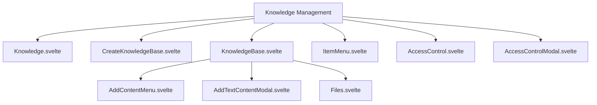
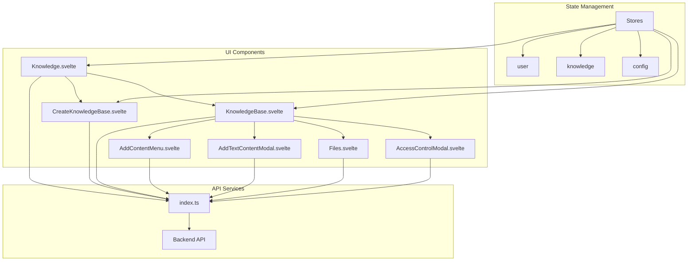
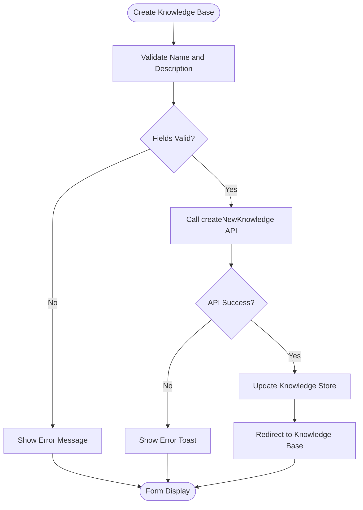
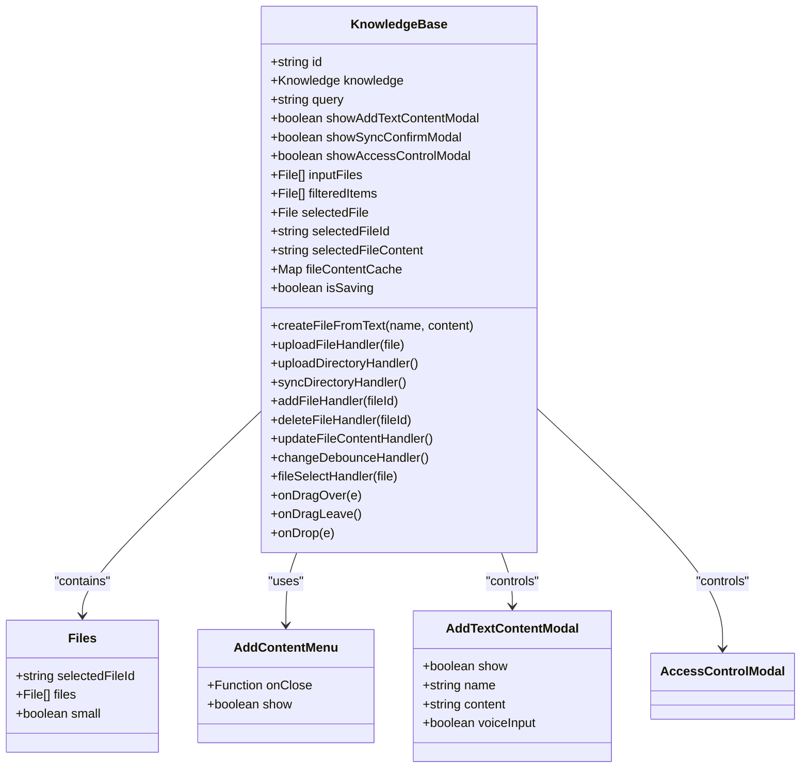
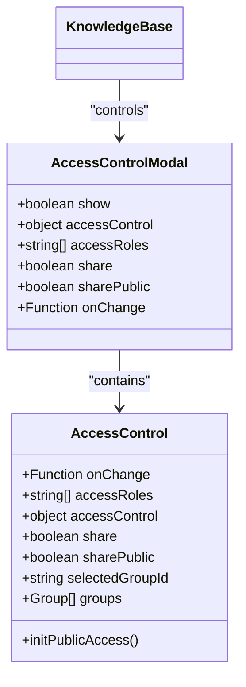
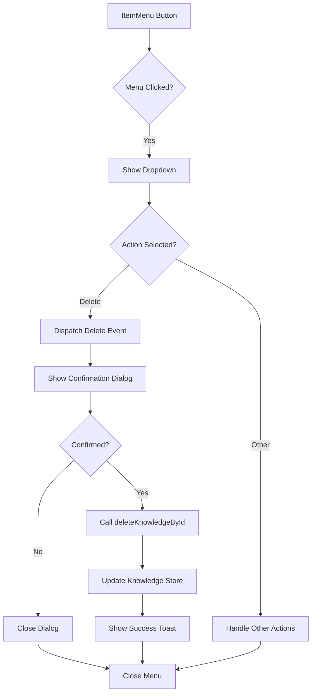
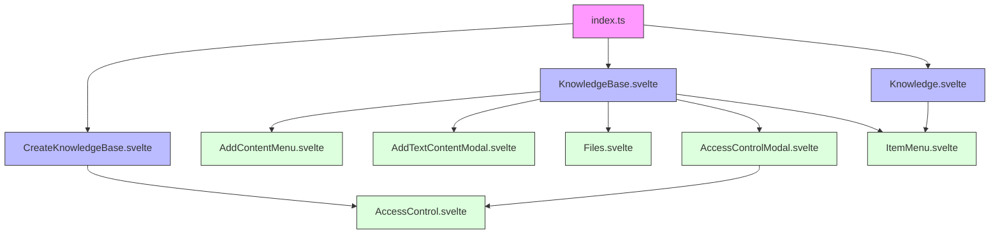

# Knowledge Base Management

<cite>
**Referenced Files in This Document**   
- [Knowledge.svelte](file://src/lib/components/workspace/Knowledge.svelte)
- [CreateKnowledgeBase.svelte](file://src/lib/components/workspace/Knowledge/CreateKnowledgeBase.svelte)
- [KnowledgeBase.svelte](file://src/lib/components/workspace/Knowledge/KnowledgeBase.svelte)
- [ItemMenu.svelte](file://src/lib/components/workspace/Knowledge/ItemMenu.svelte)
- [AddContentMenu.svelte](file://src/lib/components/workspace/Knowledge/KnowledgeBase/AddContentMenu.svelte)
- [AddTextContentModal.svelte](file://src/lib/components/workspace/Knowledge/KnowledgeBase/AddTextContentModal.svelte)
- [Files.svelte](file://src/lib/components/workspace/Knowledge/KnowledgeBase/Files.svelte)
- [AccessControl.svelte](file://src/lib/components/workspace/common/AccessControl.svelte)
- [AccessControlModal.svelte](file://src/lib/components/workspace/common/AccessControlModal.svelte)
- [index.ts](file://src/lib/apis/knowledge/index.ts)
</cite>

## Table of Contents
1. [Introduction](#introduction)
2. [Project Structure](#project-structure)
3. [Core Components](#core-components)
4. [Architecture Overview](#architecture-overview)
5. [Detailed Component Analysis](#detailed-component-analysis)
6. [Dependency Analysis](#dependency-analysis)
7. [Performance Considerations](#performance-considerations)
8. [Troubleshooting Guide](#troubleshooting-guide)
9. [Conclusion](#conclusion)

## Introduction
The Knowledge Base Management interface provides a comprehensive system for creating, organizing, and managing knowledge collections within the Open WebUI platform. This documentation details the UI components, user interaction patterns, and workflows for knowledge base management, including creation, editing, access control, and content organization. The system supports various content loaders and provides robust sharing and deletion workflows.

## Project Structure
The Knowledge Base Management components are organized within the workspace section of the application, following a modular structure that separates concerns between different functional areas. The components are built using Svelte and follow a hierarchical pattern with parent containers managing state and child components handling specific UI interactions.

**Diagram sources**
- [Knowledge.svelte](file://src/lib/components/workspace/Knowledge.svelte)
- [CreateKnowledgeBase.svelte](file://src/lib/components/workspace/Knowledge/CreateKnowledgeBase.svelte)
- [KnowledgeBase.svelte](file://src/lib/components/workspace/Knowledge/KnowledgeBase.svelte)

**Section sources**
- [Knowledge.svelte](file://src/lib/components/workspace/Knowledge.svelte)
- [CreateKnowledgeBase.svelte](file://src/lib/components/workspace/Knowledge/CreateKnowledgeBase.svelte)
- [KnowledgeBase.svelte](file://src/lib/components/workspace/Knowledge/KnowledgeBase.svelte)

## Core Components
The Knowledge Base Management system consists of several core components that work together to provide a seamless user experience for managing knowledge collections. These components include the main Knowledge interface for browsing collections, the CreateKnowledgeBase component for initiating new knowledge bases, and the KnowledgeBase component for detailed management of individual collections.

**Section sources**
- [Knowledge.svelte](file://src/lib/components/workspace/Knowledge.svelte)
- [CreateKnowledgeBase.svelte](file://src/lib/components/workspace/Knowledge/CreateKnowledgeBase.svelte)
- [KnowledgeBase.svelte](file://src/lib/components/workspace/Knowledge/KnowledgeBase.svelte)

## Architecture Overview
The Knowledge Base Management architecture follows a component-based design pattern with clear separation of concerns. The system is organized around three main views: the knowledge collection browser, the knowledge base creation interface, and the individual knowledge base management interface. These components communicate through event dispatching and shared stores, maintaining a consistent state across the application.

**Diagram sources**
- [index.ts](file://src/lib/apis/knowledge/index.ts)
- [Knowledge.svelte](file://src/lib/components/workspace/Knowledge.svelte)
- [KnowledgeBase.svelte](file://src/lib/components/workspace/Knowledge/KnowledgeBase.svelte)

## Detailed Component Analysis

### CreateKnowledgeBase Component
The CreateKnowledgeBase component provides a form interface for users to create new knowledge bases. It includes fields for name and description, along with access control settings that determine who can view and edit the knowledge base.

**Diagram sources**
- [CreateKnowledgeBase.svelte](file://src/lib/components/workspace/Knowledge/CreateKnowledgeBase.svelte)
- [index.ts](file://src/lib/apis/knowledge/index.ts)

**Section sources**
- [CreateKnowledgeBase.svelte](file://src/lib/components/workspace/Knowledge/CreateKnowledgeBase.svelte)

### KnowledgeBase Component
The KnowledgeBase component serves as the main interface for managing an individual knowledge collection. It provides a dual-pane layout on larger screens, with a file list on the right and content editor on the left. On smaller screens, it uses a drawer pattern to maintain usability.

**Diagram sources**
- [KnowledgeBase.svelte](file://src/lib/components/workspace/Knowledge/KnowledgeBase.svelte)
- [Files.svelte](file://src/lib/components/workspace/Knowledge/KnowledgeBase/Files.svelte)
- [AddContentMenu.svelte](file://src/lib/components/workspace/Knowledge/KnowledgeBase/AddContentMenu.svelte)
- [AddTextContentModal.svelte](file://src/lib/components/workspace/Knowledge/KnowledgeBase/AddTextContentModal.svelte)

**Section sources**
- [KnowledgeBase.svelte](file://src/lib/components/workspace/Knowledge/KnowledgeBase.svelte)

### Access Control System
The access control system manages permissions for knowledge bases, allowing owners to specify who can read and write to their collections. The system supports both private and public visibility modes, with granular control over user and group access.

**Diagram sources**
- [AccessControl.svelte](file://src/lib/components/workspace/common/AccessControl.svelte)
- [AccessControlModal.svelte](file://src/lib/components/workspace/common/AccessControlModal.svelte)
- [KnowledgeBase.svelte](file://src/lib/components/workspace/Knowledge/KnowledgeBase.svelte)

**Section sources**
- [AccessControl.svelte](file://src/lib/components/workspace/common/AccessControl.svelte)
- [AccessControlModal.svelte](file://src/lib/components/workspace/common/AccessControlModal.svelte)

### ItemMenu Component
The ItemMenu component provides a dropdown menu for actions on knowledge base items, including deletion. It uses a tooltip and dropdown pattern to conserve space while providing access to secondary actions.

**Diagram sources**
- [ItemMenu.svelte](file://src/lib/components/workspace/Knowledge/ItemMenu.svelte)
- [index.ts](file://src/lib/apis/knowledge/index.ts)

**Section sources**
- [ItemMenu.svelte](file://src/lib/components/workspace/Knowledge/ItemMenu.svelte)

## Dependency Analysis
The Knowledge Base Management components have a well-defined dependency structure, with higher-level components depending on lower-level utility components and API services. The dependency graph shows how data flows from the API layer through the component hierarchy.

**Diagram sources**
- [index.ts](file://src/lib/apis/knowledge/index.ts)
- [Knowledge.svelte](file://src/lib/components/workspace/Knowledge.svelte)
- [CreateKnowledgeBase.svelte](file://src/lib/components/workspace/Knowledge/CreateKnowledgeBase.svelte)
- [KnowledgeBase.svelte](file://src/lib/components/workspace/Knowledge/KnowledgeBase.svelte)

**Section sources**
- [index.ts](file://src/lib/apis/knowledge/index.ts)

## Performance Considerations
The Knowledge Base Management interface implements several performance optimizations to handle large document sets efficiently. These include client-side search with Fuse.js for fast filtering, content caching to minimize API calls, and debounced updates to prevent excessive server requests during editing.

The component also implements responsive design patterns that adapt the layout based on screen size, using a dual-pane interface on larger screens and a drawer pattern on mobile devices. File uploads support both individual files and entire directories, with progress tracking for large uploads.

## Troubleshooting Guide
Common issues with the Knowledge Base Management interface typically relate to file uploads, access permissions, and synchronization. Users experiencing problems with file uploads should check file size limits and ensure they have proper permissions. For synchronization issues, users should verify directory access permissions and check for hidden files that may be excluded from uploads.

When encountering access control issues, users should verify their role permissions and ensure they have the appropriate sharing rights configured in their user settings. For performance issues with large document sets, users can improve responsiveness by using the search functionality to filter results rather than loading all documents at once.

**Section sources**
- [KnowledgeBase.svelte](file://src/lib/components/workspace/Knowledge/KnowledgeBase.svelte)
- [CreateKnowledgeBase.svelte](file://src/lib/components/workspace/Knowledge/CreateKnowledgeBase.svelte)
- [AccessControl.svelte](file://src/lib/components/workspace/common/AccessControl.svelte)

## Conclusion
The Knowledge Base Management interface provides a comprehensive solution for organizing and maintaining knowledge collections within the Open WebUI platform. With its intuitive component hierarchy, robust access control system, and support for various content loaders, the interface enables users to effectively manage their knowledge bases from creation through ongoing maintenance. The responsive design and performance optimizations ensure a smooth user experience across different devices and document set sizes.