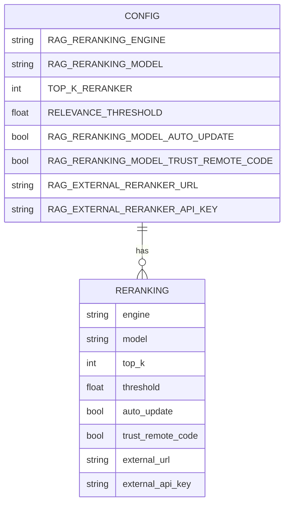

# Reranking Models

<cite>
**Referenced Files in This Document**   
- [base_reranker.py](file://backend/open_webui/retrieval/models/base_reranker.py)
- [colbert.py](file://backend/open_webui/retrieval/models/colbert.py)
- [external.py](file://backend/open_webui/retrieval/models/external.py)
- [utils.py](file://backend/open_webui/retrieval/utils.py)
- [config.py](file://backend/open_webui/config.py)
- [retrieval.py](file://backend/open_webui/routers/retrieval.py)
- [main.py](file://backend/open_webui/main.py)
</cite>

## Table of Contents
1. [Introduction](#introduction)
2. [Reranker Interface and Base Implementation](#reranker-interface-and-base-implementation)
3. [ColBERT Reranker Implementation](#colbert-reranker-implementation)
4. [External Reranker Implementation](#external-reranker-implementation)
5. [Reranking Integration in Query Pipeline](#reranking-integration-in-query-pipeline)
6. [Configuration Options](#configuration-options)
7. [Performance Trade-offs and Optimization](#performance-trade-offs-and-optimization)
8. [Common Issues and Troubleshooting](#common-issues-and-troubleshooting)
9. [Best Practices for Cascaded Ranking](#best-practices-for-cascaded-ranking)
10. [Conclusion](#conclusion)

## Introduction
Reranking models play a crucial role in enhancing retrieval relevance within Retrieval-Augmented Generation (RAG) systems. After initial vector search retrieves candidate documents based on embedding similarity, rerankers further refine the results by reordering them according to more sophisticated semantic similarity measures. This document details the implementation of reranking models in the system, focusing on ColBERT and external reranker models. It explains the base reranker interface, implementation specifics, integration into the query pipeline, configuration options, performance considerations, and best practices for optimizing retrieval accuracy and efficiency.

**Section sources**
- [base_reranker.py](file://backend/open_webui/retrieval/models/base_reranker.py)
- [colbert.py](file://backend/open_webui/retrieval/models/colbert.py)
- [external.py](file://backend/open_webui/retrieval/models/external.py)

## Reranker Interface and Base Implementation
The reranking system is built around a common interface defined by the `BaseReranker` abstract base class. This interface standardizes the prediction method across different reranker implementations, ensuring consistent integration with the retrieval pipeline.

The `BaseReranker` class defines a single abstract method `predict` that takes a list of sentence pairs (query-document tuples) and returns a list of relevance scores. This design allows different reranking models to be swapped in and out while maintaining compatibility with the rest of the system.

**Diagram sources**
- [base_reranker.py](file://backend/open_webui/retrieval/models/base_reranker.py#L5-L8)

**Section sources**
- [base_reranker.py](file://backend/open_webui/retrieval/models/base_reranker.py#L1-L9)

## ColBERT Reranker Implementation
The ColBERT reranker implements the contextualized late interaction over BERT model, which computes fine-grained similarity between queries and documents by comparing each query token against each document token.

The implementation uses the official ColBERT library and follows a multi-step process:
1. Initialize the ColBERT checkpoint with the specified model name
2. Embed both the query and documents using the ColBERT model
3. Calculate similarity scores through a series of tensor operations including matrix multiplication and max pooling
4. Normalize the final scores using softmax

Key features of the ColBERT implementation include:
- GPU acceleration when available
- Special handling for Docker environments to address torch extension loading issues
- Dimension validation to ensure compatibility between query and document embeddings
- Use of max-similarity (MaxSim) scoring to capture the highest semantic similarity across document sequences

**Diagram sources**
- [colbert.py](file://backend/open_webui/retrieval/models/colbert.py#L16-L89)

**Section sources**
- [colbert.py](file://backend/open_webui/retrieval/models/colbert.py#L1-L90)

## External Reranker Implementation
The external reranker provides a flexible interface to integrate third-party reranking services through a standardized API. This allows the system to leverage specialized reranking models hosted externally.

The `ExternalReranker` class implements the base reranker interface by making HTTP POST requests to a configurable external service endpoint. It requires:
- An API key for authentication
- A URL pointing to the external reranking service
- A model name identifier

When processing a query, the external reranker:
1. Constructs a JSON payload containing the query, documents, and model information
2. Sends the request with appropriate headers including authorization
3. Handles the response and extracts relevance scores
4. Returns the scores in the expected format

The implementation includes robust error handling and logging to diagnose connectivity issues or response format problems. It also supports forwarding user information headers when enabled in the system configuration.

**Diagram sources**
- [external.py](file://backend/open_webui/retrieval/models/external.py#L16-L70)

**Section sources**
- [external.py](file://backend/open_webui/retrieval/models/external.py#L1-L71)

## Reranking Integration in Query Pipeline
Reranking is integrated into the retrieval pipeline as a contextual compression step that occurs after initial vector search. The system uses LangChain's ContextualCompressionRetriever to wrap the reranking functionality.

The query pipeline follows this sequence:
1. Initial retrieval using vector similarity search
2. (Optional) Hybrid search combining vector and keyword (BM25) results
3. Reranking of retrieved documents using the selected reranker model
4. Filtering based on relevance threshold
5. Final result compilation and return

The integration is handled by the `RerankCompressor` class, which serves as an adapter between the system's reranking functions and LangChain's document compression interface. This compressor can operate in two modes:
- Using an external reranking function (ColBERT or external service)
- Falling back to embedding-based cosine similarity when no reranker is configured

**Diagram sources**
- [utils.py](file://backend/open_webui/retrieval/utils.py#L1245-L1324)
- [utils.py](file://backend/open_webui/retrieval/utils.py#L207-L311)

**Section sources**
- [utils.py](file://backend/open_webui/retrieval/utils.py#L1245-L1324)

## Configuration Options
The reranking system offers several configuration options that can be adjusted to balance performance and accuracy:

### Reranker Selection
- **RAG_RERANKING_ENGINE**: Specifies the reranking engine to use (empty for internal models, "external" for external services)
- **RAG_RERANKING_MODEL**: Defines the specific model to use (e.g., "jinaai/jina-colbert-v2" for ColBERT, model name for external services)

### Threshold Settings
- **TOP_K_RERANKER**: Number of documents to consider during reranking (typically higher than final TOP_K to allow for reordering)
- **RELEVANCE_THRESHOLD**: Minimum relevance score for documents to be included in results (0.0 means no filtering)

### Performance Parameters
- **RAG_RERANKING_MODEL_AUTO_UPDATE**: Whether to automatically update the reranking model when changes are detected
- **RAG_RERANKING_MODEL_TRUST_REMOTE_CODE**: Whether to trust remote code when loading the model

### External Service Configuration
- **RAG_EXTERNAL_RERANKER_URL**: Endpoint URL for external reranking service
- **RAG_EXTERNAL_RERANKER_API_KEY**: Authentication key for external service

These configuration values are managed through the PersistentConfig system and can be updated via API endpoints. The system initializes these values from environment variables and allows runtime modification through the admin interface.

**Diagram sources**
- [config.py](file://backend/open_webui/config.py#L2721-L2754)
- [retrieval.py](file://backend/open_webui/routers/retrieval.py#L479-L484)

**Section sources**
- [config.py](file://backend/open_webui/config.py#L2721-L2754)
- [main.py](file://backend/open_webui/main.py#L921-L924)

## Performance Trade-offs and Optimization
Implementing reranking involves several performance trade-offs that must be carefully balanced:

### Latency vs. Accuracy
Reranking significantly improves retrieval accuracy by considering fine-grained semantic relationships between queries and documents. However, this comes at the cost of increased latency, as reranking requires additional computation beyond the initial vector search.

The system mitigates this through:
- Cascaded ranking strategies (retrieving more documents initially, then reranking a subset)
- Asynchronous processing where possible
- Caching of frequently accessed models

### Resource Utilization
ColBERT models are computationally intensive and require substantial GPU memory. The implementation includes Docker-specific optimizations to handle torch extension loading issues that commonly occur in containerized environments.

External rerankers shift the computational burden to the external service but introduce network latency and dependency on external system availability.

### Memory Management
The system implements model unloading and garbage collection to manage memory usage, particularly important when running on resource-constrained environments. The `unload_embedding_model` function explicitly clears VRAM cache when switching models.

Best practices for performance optimization include:
- Using appropriate TOP_K_RERANKER values (typically 2-3x the final TOP_K)
- Setting reasonable relevance thresholds to filter out low-quality results
- Monitoring system resources and adjusting batch sizes accordingly
- Considering the trade-off between local model inference and external service calls

**Section sources**
- [colbert.py](file://backend/open_webui/retrieval/models/colbert.py#L19-L38)
- [main.py](file://backend/open_webui/main.py#L1012-L1030)
- [utils.py](file://backend/open_webui/retrieval/utils.py#L800-L854)

## Common Issues and Troubleshooting
Several common issues may arise when working with reranking models:

### Model Loading Failures
- **ColBERT in Docker**: The implementation includes specific handling for Docker environments where torch extensions may fail to load due to file locking issues. The solution removes lock files before loading.
- **Missing Models**: Ensure that the specified model exists in the Hugging Face model hub or is available locally.
- **Remote Code Trust**: Some models require `trust_remote_code=True` to load properly.

### Latency Impact
- Monitor response times and adjust TOP_K_RERANKER values to balance quality and performance.
- Consider using external rerankers if local inference is too slow, but be aware of network latency.
- Implement caching strategies for frequently asked queries.

### Relevance Tuning
- Adjust the RELEVANCE_THRESHOLD parameter to control the strictness of result filtering.
- Experiment with different TOP_K_RERANKER values to ensure important documents aren't filtered out before reranking.
- Validate results with sample queries to ensure the reranker is improving rather than degrading quality.

### Configuration Issues
- Verify that environment variables are correctly set, especially for external services.
- Check API keys and endpoint URLs for external rerankers.
- Ensure that the RAG_RERANKING_ENGINE is correctly set to match the intended reranking approach.

The system provides comprehensive logging to help diagnose these issues, with log levels configurable through the SRC_LOG_LEVELS setting.

**Section sources**
- [colbert.py](file://backend/open_webui/retrieval/models/colbert.py#L21-L33)
- [external.py](file://backend/open_webui/retrieval/models/external.py#L68-L70)
- [main.py](file://backend/open_webui/main.py#L1028-L1030)

## Best Practices for Cascaded Ranking
To achieve optimal performance and accuracy, follow these best practices for implementing cascaded ranking strategies:

### Two-Stage Retrieval
Implement a two-stage approach:
1. **First stage**: Use fast vector search to retrieve a larger set of candidate documents (e.g., TOP_K_RERANKER = 20-50)
2. **Second stage**: Apply the more computationally expensive reranker to re-rank these candidates and select the final results (e.g., TOP_K = 5-10)

This approach balances efficiency with accuracy, leveraging the speed of vector search for broad retrieval and the precision of reranking for final selection.

### Hybrid Search Integration
Combine vector search with keyword-based retrieval (BM25) using the hybrid search functionality. This can be particularly effective when:
- Documents contain technical terms or proper nouns that may not be well-represented in embeddings
- Query-document matching benefits from exact term matching
- You want to leverage metadata fields in the ranking process

Configure the HYBRID_BM25_WEIGHT parameter to control the balance between vector and keyword search components.

### Progressive Enrichment
Enhance document representations with metadata before reranking by enabling enriched texts. This incorporates filename, title, section headings, and source information into the text used for similarity calculation, potentially improving relevance.

### Monitoring and Validation
Regularly evaluate reranking performance by:
- Comparing results with and without reranking
- Testing with diverse query types
- Monitoring latency and resource usage
- Collecting user feedback on result quality

Adjust configuration parameters based on these evaluations to maintain optimal performance.

**Section sources**
- [utils.py](file://backend/open_webui/retrieval/utils.py#L207-L311)
- [retrieval.py](file://backend/open_webui/routers/retrieval.py#L144-L155)
- [config.py](file://backend/open_webui/config.py#L2736-L2738)

## Conclusion
Reranking models are essential components in modern RAG systems, significantly improving retrieval relevance by reordering search results based on sophisticated semantic similarity measures. The implementation supports both ColBERT and external reranker models through a consistent interface, allowing flexibility in model selection. The integration into the query pipeline as a contextual compression step enables seamless enhancement of retrieval quality. By carefully configuring reranker selection, threshold settings, and performance parameters, and following best practices for cascaded ranking, systems can achieve an optimal balance between retrieval accuracy and computational efficiency.