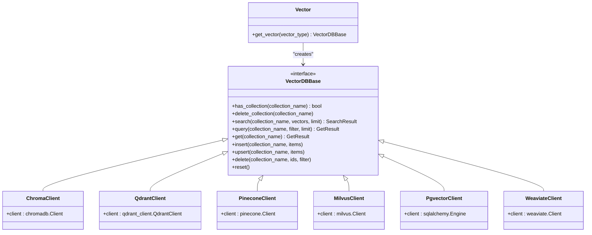

# Retrieval-Augmented Generation (RAG) System

<cite>
**Referenced Files in This Document**   
- [retrieval.py](file://backend/open_webui/routers/retrieval.py)
- [knowledge.py](file://backend/open_webui/models/knowledge.py)
- [main.py](file://backend/open_webui/retrieval/loaders/main.py)
- [factory.py](file://backend/open_webui/retrieval/vector/factory.py)
- [main.py](file://backend/open_webui/retrieval/web/main.py)
- [utils.py](file://backend/open_webui/retrieval/utils.py)
- [chroma.py](file://backend/open_webui/retrieval/vector/dbs/chroma.py)
- [tavily.py](file://backend/open_webui/retrieval/web/tavily.py)
- [serpapi.py](file://backend/open_webui/retrieval/web/serpapi.py)
- [google_pse.py](file://backend/open_webui/retrieval/web/google_pse.py)
- [base_reranker.py](file://backend/open_webui/retrieval/models/base_reranker.py)
</cite>

## Table of Contents
1. [Introduction](#introduction)
2. [RAG Pipeline Overview](#rag-pipeline-overview)
3. [Document Ingestion and Processing](#document-ingestion-and-processing)
4. [Vector Database Architecture](#vector-database-architecture)
5. [Web Search Integration](#web-search-integration)
6. [Knowledge Base Management](#knowledge-base-management)
7. [Configuration and Usage Examples](#configuration-and-usage-examples)
8. [Performance Considerations](#performance-considerations)
9. [Conclusion](#conclusion)

## Introduction

The Retrieval-Augmented Generation (RAG) System in open-webui provides a comprehensive framework for enhancing language model responses with external knowledge sources. This system enables users to augment chat sessions with information from uploaded documents, knowledge bases, and real-time web search results. The architecture is designed to be modular and extensible, supporting various document types, vector databases, and web search providers.

The RAG system follows a pipeline approach that begins with document ingestion and processing, continues through vectorization and storage, and culminates in retrieval during chat sessions. This documentation provides a detailed analysis of the complete RAG pipeline, including the retrieval module architecture, web search integration, knowledge base management, and practical configuration examples.

**Section sources**
- [retrieval.py](file://backend/open_webui/routers/retrieval.py#L1-L2504)
- [knowledge.py](file://backend/open_webui/models/knowledge.py#L1-L371)

## RAG Pipeline Overview

The RAG pipeline in open-webui consists of several interconnected components that work together to retrieve relevant information during chat sessions. The pipeline begins with document ingestion, where various document types are processed and converted into text content. This content is then chunked according to configurable parameters and converted into vector embeddings using a specified embedding model.

**Diagram sources **
- [retrieval.py](file://backend/open_webui/routers/retrieval.py#L1-L2504)
- [utils.py](file://backend/open_webui/retrieval/utils.py#L1-L800)

The retrieval process during chat sessions involves querying one or more vector databases with the user's query, potentially combined with web search results. The system supports hybrid search approaches that combine semantic search with keyword-based BM25 retrieval, followed by reranking to improve result relevance. The retrieved documents are then used to augment the context provided to the language model, enabling more informed and accurate responses.

**Section sources**
- [retrieval.py](file://backend/open_webui/routers/retrieval.py#L1-L2504)
- [utils.py](file://backend/open_webui/retrieval/utils.py#L1-L800)

## Document Ingestion and Processing

The document ingestion system in open-webui supports a wide variety of document types through specialized loaders. These loaders are responsible for extracting text content from different file formats, which is then processed for vectorization and storage.

**Diagram sources **
- [main.py](file://backend/open_webui/retrieval/loaders/main.py#L1-L398)

The system supports document loaders for various content extraction engines, including:
- **Internal processing**: Using PyPDFLoader for PDFs, CSVLoader for CSV files, and TextLoader for plain text
- **Tika Server**: For document content extraction via Apache Tika
- **Datalab Marker**: For advanced PDF and document processing with AI-powered extraction
- **Docling**: For document conversion and content extraction
- **Azure Document Intelligence**: For enterprise-grade document analysis
- **MinerU**: For PDF processing with specialized models
- **Mistral OCR**: For OCR-based document processing

Each loader is selected based on the configured content extraction engine and the document type. The system also supports external document loaders via API, allowing integration with custom or third-party document processing services.

Text splitting is configurable through parameters such as CHUNK_SIZE and CHUNK_OVERLAP, which determine how documents are divided into smaller chunks for vectorization. The system uses LangChain's text splitters, including RecursiveCharacterTextSplitter and TokenTextSplitter, to handle different chunking strategies based on characters or tokens.

**Section sources**
- [main.py](file://backend/open_webui/retrieval/loaders/main.py#L1-L398)
- [retrieval.py](file://backend/open_webui/routers/retrieval.py#L31-L33)

## Vector Database Architecture

The vector database architecture in open-webui is designed to be flexible and support multiple vector database backends through a factory pattern implementation. This allows users to choose from various vector databases based on their requirements and infrastructure.

**Diagram sources **
- [factory.py](file://backend/open_webui/retrieval/vector/factory.py#L1-L79)
- [chroma.py](file://backend/open_webui/retrieval/vector/dbs/chroma.py#L1-L199)

The system supports the following vector databases:
- **Chroma**: An open-source vector database with both in-memory and persistent storage options
- **Qdrant**: A high-performance vector search engine with advanced filtering capabilities
- **Pinecone**: A managed vector database service with serverless and dedicated options
- **Milvus**: A highly scalable vector database designed for large-scale applications
- **Pgvector**: A PostgreSQL extension that adds vector similarity search capabilities
- **Weaviate**: An open-source vector database with built-in ML model integration
- **Elasticsearch**: With vector search capabilities for hybrid search scenarios
- **OpenSearch**: The open-source fork of Elasticsearch with vector search support
- **Oracle 23ai**: Oracle's database with native vector search capabilities
- **S3Vector**: For storing vectors in Amazon S3 with metadata indexing

The Vector factory class implements a singleton pattern that creates and returns the appropriate vector database client based on the configured VECTOR_DB setting. This abstraction allows the rest of the system to interact with vector databases through a consistent interface, regardless of the underlying implementation.

**Diagram sources **
- [factory.py](file://backend/open_webui/retrieval/vector/factory.py#L1-L79)
- [retrieval.py](file://backend/open_webui/routers/retrieval.py#L1-L2504)

**Section sources**
- [factory.py](file://backend/open_webui/retrieval/vector/factory.py#L1-L79)
- [chroma.py](file://backend/open_webui/retrieval/vector/dbs/chroma.py#L1-L199)

## Web Search Integration

The web search integration in open-webui provides real-time access to current information from various search providers. This capability allows the RAG system to supplement knowledge from uploaded documents with up-to-date web content during chat sessions.

**Diagram sources **
- [main.py](file://backend/open_webui/retrieval/web/main.py#L1-L47)
- [tavily.py](file://backend/open_webui/retrieval/web/tavily.py#L1-L52)
- [serpapi.py](file://backend/open_webui/retrieval/web/serpapi.py#L1-L51)
- [google_pse.py](file://backend/open_webui/retrieval/web/google_pse.py#L1-L75)

The system supports integration with multiple web search providers:
- **Tavily**: An AI-native search API optimized for LLM applications
- **SerpAPI**: A service that provides structured data from various search engines
- **Google Programmable Search Engine (PSE)**: Google's custom search API
- **Bing Search API**: Microsoft's search engine API
- **Brave Search API**: Privacy-focused search engine API
- **Perplexity API**: An AI-powered search engine with conversational capabilities
- **Serpstack**: A real-time search API with global coverage
- **Serper**: A Google search API with JSON results
- **SearchApi**: A search API with multiple engine options
- **Jina Search**: An AI search engine with API access
- **Exa**: An AI search engine focused on research and development
- **Firecrawl**: A web scraping and crawling service for content extraction

Each search provider is implemented as a separate module with a consistent interface, allowing for easy addition of new providers. The system can be configured to use one or more search engines simultaneously, with results combined and deduplicated.

Web search results are processed similarly to uploaded documents, with URLs being crawled and content extracted before being included in the retrieval context. The system includes domain filtering capabilities to restrict search results to specific websites or exclude unwanted domains.

**Section sources**
- [main.py](file://backend/open_webui/retrieval/web/main.py#L1-L47)
- [tavily.py](file://backend/open_webui/retrieval/web/tavily.py#L1-L52)
- [serpapi.py](file://backend/open_webui/retrieval/web/serpapi.py#L1-L51)
- [google_pse.py](file://backend/open_webui/retrieval/web/google_pse.py#L1-L75)

## Knowledge Base Management

The knowledge base management system in open-webui provides a structured approach to organizing and accessing retrieved information. Knowledge bases serve as containers for related documents and their vector representations, enabling targeted retrieval from specific collections of information.

**Diagram sources **
- [knowledge.py](file://backend/open_webui/models/knowledge.py#L1-L371)

Knowledge bases support access control through configurable permissions that determine who can read from or write to a knowledge base. The access control system supports:
- **Public access**: Available to all users with the "user" role
- **Private access**: Restricted exclusively to the owner
- **Custom permissions**: Specific access control for reading and writing, with support for group or user-level restrictions

The knowledge base system allows users to create multiple knowledge bases for different topics or projects, each containing one or more documents. Documents can be shared across multiple knowledge bases, enabling flexible organization of information.

The system provides APIs for managing knowledge bases, including creating, updating, and deleting knowledge bases, as well as adding or removing documents from knowledge bases. These operations are reflected in the vector database, with documents being added to or removed from the appropriate collections.

**Section sources**
- [knowledge.py](file://backend/open_webui/models/knowledge.py#L1-L371)

## Configuration and Usage Examples

The RAG system in open-webui is highly configurable through environment variables and API endpoints. This section provides practical examples of configuring and using the system for various scenarios.

### Setting up a New Vector Database

To configure a new vector database, modify the VECTOR_DB environment variable and corresponding database-specific settings:

**Diagram sources **
- [factory.py](file://backend/open_webui/retrieval/vector/factory.py#L1-L79)

### Adding Web Search to a Model

To integrate web search with a language model, configure the web search provider and enable it in the RAG settings:

**Diagram sources **
- [retrieval.py](file://backend/open_webui/routers/retrieval.py#L498-L548)

The system provides API endpoints for retrieving and updating RAG configuration, allowing for dynamic reconfiguration without restarting the application. The configuration includes settings for:
- Embedding models and batch sizes
- Chunking strategies (size and overlap)
- Retrieval parameters (top-k results)
- Reranking models and relevance thresholds
- Web search providers and result counts
- Content extraction engines for different document types

**Section sources**
- [retrieval.py](file://backend/open_webui/routers/retrieval.py#L225-L800)

## Performance Considerations

The RAG system in open-webui includes several performance optimization features to ensure efficient document processing and retrieval. These considerations are crucial for maintaining responsive chat experiences, especially with large document collections.

### Chunking Strategies

The system supports configurable chunking strategies that balance information completeness with retrieval precision. Key parameters include:
- **CHUNK_SIZE**: The maximum number of characters or tokens in each chunk
- **CHUNK_OVERLAP**: The number of characters or tokens that overlap between adjacent chunks
- **TEXT_SPLITTER**: The method used for splitting text (recursive character, token-based, or markdown headers)

Optimal chunk sizes depend on the use case and the language model's context window. Smaller chunks provide more precise retrieval but may lack context, while larger chunks preserve more context but may retrieve irrelevant information.

### Relevance Tuning

The system implements hybrid search and reranking to improve result relevance:
- **Hybrid search**: Combines semantic vector search with keyword-based BM25 retrieval
- **Reranking**: Uses cross-encoder models to re-rank results based on query relevance
- **Relevance threshold**: Filters results below a minimum relevance score

**Diagram sources **
- [utils.py](file://backend/open_webui/retrieval/utils.py#L207-L315)

The system supports various reranking models, including:
- Sentence Transformers cross-encoders
- Jina ColBERT models
- External reranking APIs

### Asynchronous Processing

To improve performance with large document collections, the system supports asynchronous embedding generation:
- **ENABLE_ASYNC_EMBEDDING**: When enabled, document processing occurs in the background
- **RAG_EMBEDDING_BATCH_SIZE**: Controls the number of documents processed in each batch
- Thread pool execution for CPU-bound operations

These performance considerations allow the RAG system to scale effectively with growing document collections while maintaining responsive chat interactions.

**Section sources**
- [utils.py](file://backend/open_webui/retrieval/utils.py#L207-L315)
- [retrieval.py](file://backend/open_webui/routers/retrieval.py#L244-L251)

## Conclusion

The Retrieval-Augmented Generation (RAG) System in open-webui provides a comprehensive and flexible framework for enhancing language model interactions with external knowledge sources. The system's modular architecture supports a wide range of document types, vector databases, and web search providers, making it adaptable to various use cases and deployment scenarios.

Key strengths of the system include:
- Support for multiple content extraction engines and document loaders
- Flexible vector database backend with support for popular solutions
- Integration with numerous web search providers for real-time information access
- Comprehensive knowledge base management with access control
- Configurable chunking, embedding, and retrieval parameters
- Hybrid search and reranking for improved result relevance

The system is designed to be both powerful and accessible, with clear configuration options and APIs for managing the RAG pipeline. By combining uploaded documents with real-time web search results, the system enables language models to provide more accurate, up-to-date, and contextually relevant responses.

Future enhancements could include support for additional vector databases, improved document preprocessing pipelines, and more sophisticated relevance tuning mechanisms. The open architecture of the system makes it well-suited for customization and extension to meet specific requirements.