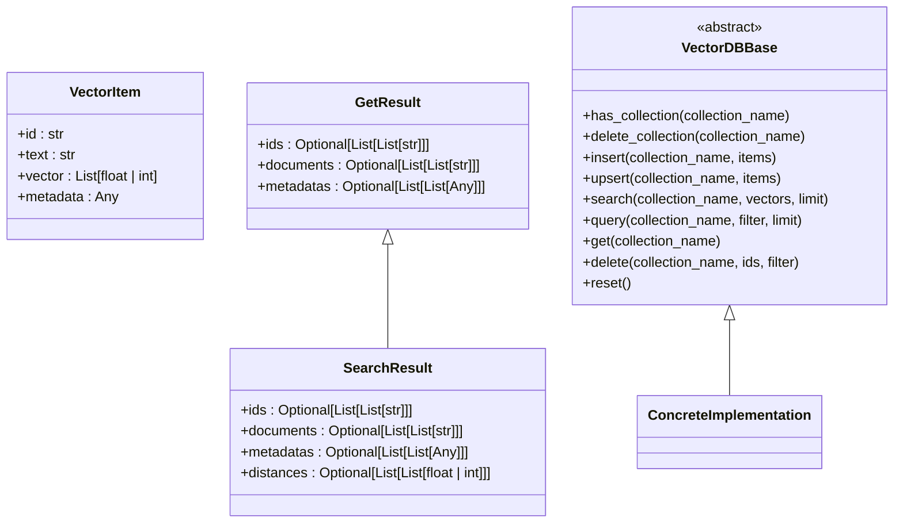

# Vector Database Integration

<cite>
**Referenced Files in This Document**   
- [factory.py](file://backend/open_webui/retrieval/vector/factory.py)
- [main.py](file://backend/open_webui/retrieval/vector/main.py)
- [type.py](file://backend/open_webui/retrieval/vector/type.py)
- [chroma.py](file://backend/open_webui/retrieval/vector/dbs/chroma.py)
- [pgvector.py](file://backend/open_webui/retrieval/vector/dbs/pgvector.py)
- [qdrant_multitenancy.py](file://backend/open_webui/retrieval/vector/dbs/qdrant_multitenancy.py)
- [milvus_multitenancy.py](file://backend/open_webui/retrieval/vector/dbs/milvus_multitenancy.py)
- [config.py](file://backend/open_webui/config.py)
- [utils.py](file://backend/open_webui/retrieval/vector/utils.py)
- [retrieval.py](file://backend/open_webui/routers/retrieval.py)
</cite>

## Table of Contents
1. [Introduction](#introduction)
2. [Architecture Overview](#architecture-overview)
3. [Vector Database Abstraction](#vector-database-abstraction)
4. [Factory Pattern Implementation](#factory-pattern-implementation)
5. [Supported Vector Databases](#supported-vector-databases)
6. [Configuration Options](#configuration-options)
7. [Multitenancy Support](#multitenancy-support)
8. [Data Operations](#data-operations)
9. [Performance Considerations](#performance-considerations)
10. [Database Selection Guidance](#database-selection-guidance)

## Introduction

The Vector Database Integration in the RAG system provides a flexible and extensible architecture for storing and retrieving vector embeddings. This system supports multiple vector database backends through a unified interface, enabling seamless integration with various vector storage solutions. The architecture is designed to support Retrieval-Augmented Generation (RAG) workflows by providing efficient similarity search capabilities for semantic search and knowledge retrieval.

The system implements a factory pattern to instantiate the appropriate vector database client based on configuration, with support for Chroma, Qdrant, Pinecone, PGVector, Weaviate, Milvus, Elasticsearch, OpenSearch, Oracle23ai, and S3Vector. This modular design allows users to select the most appropriate vector database for their deployment requirements, from lightweight local solutions to scalable cloud-based services.

**Section sources**
- [factory.py](file://backend/open_webui/retrieval/vector/factory.py#L1-L79)
- [main.py](file://backend/open_webui/retrieval/vector/main.py#L1-L87)

## Architecture Overview

The vector database integration architecture follows a modular design with clear separation of concerns. At the core is an abstract base class that defines the common interface for all vector database operations, ensuring consistent behavior across different backends. The factory pattern is used to instantiate the appropriate database client based on configuration, providing a clean separation between interface and implementation.

**Diagram sources **
- [main.py](file://backend/open_webui/retrieval/vector/main.py#L23-L87)
- [factory.py](file://backend/open_webui/retrieval/vector/factory.py#L10-L79)
- [type.py](file://backend/open_webui/retrieval/vector/type.py#L4-L15)

## Vector Database Abstraction

The vector database integration is built around a common interface defined by the `VectorDBBase` abstract base class. This interface standardizes operations across all supported vector databases, ensuring consistent behavior regardless of the underlying implementation. The abstraction layer handles vector storage, retrieval, and similarity search operations through a unified API.

The `VectorItem` model defines the structure for vector data, containing an ID, text content, vector embedding, and metadata. The system provides two result types: `GetResult` for retrieval operations and `SearchResult` for similarity search, both including IDs, documents, and metadata, with the latter also providing distance scores.

The abstraction supports essential operations including collection management (creation, deletion, existence checking), vector insertion and upsertion, similarity search with configurable limits, metadata-based querying, and bulk deletion by ID or filter. The `reset` method provides a way to clear all data from the vector database, useful for testing and development.

**Diagram sources **
- [main.py](file://backend/open_webui/retrieval/vector/main.py#L6-L87)

## Factory Pattern Implementation

The factory pattern implementation provides a clean mechanism for instantiating the appropriate vector database client based on configuration. The `Vector` class contains a static `get_vector` method that takes a vector type parameter and returns the corresponding database client instance. This approach enables runtime selection of the vector database backend without requiring changes to the application code.

The factory uses pattern matching to determine the appropriate database client based on the vector type. For certain databases like Qdrant and Milvus, the factory also considers multitenancy configuration flags to instantiate the appropriate variant (standard or multitenancy-enabled). This allows the system to support different deployment models for the same database technology.

The factory pattern ensures that only one instance of the vector database client is created and reused throughout the application lifecycle. The `VECTOR_DB_CLIENT` constant is initialized at module load time by calling `Vector.get_vector(VECTOR_DB)`, where `VECTOR_DB` is obtained from environment configuration. This singleton pattern optimizes resource usage and ensures consistent behavior across the application.

**Diagram sources **
- [factory.py](file://backend/open_webui/retrieval/vector/factory.py#L10-L79)

## Supported Vector Databases

The system supports multiple vector database backends, each implemented as a concrete class inheriting from the `VectorDBBase` abstract base class. The supported databases include Chroma, Qdrant, Pinecone, PGVector, Weaviate, Milvus, Elasticsearch, OpenSearch, Oracle23ai, and S3Vector, providing flexibility for different deployment scenarios and requirements.

Each database implementation follows the same interface but adapts to the specific features and requirements of the underlying technology. For example, the Chroma implementation supports both persistent local storage and HTTP-based remote access, while the PGVector implementation leverages PostgreSQL's pgvector extension for vector operations. The Pinecone implementation connects to the cloud-based Pinecone service, and the Weaviate implementation supports both HTTP and gRPC connections.

The system uses the `VectorType` enumeration to define the available database options, ensuring type safety and preventing invalid configurations. This approach allows for easy extension to support additional vector databases in the future by implementing the common interface and adding the new type to the enumeration.

**Diagram sources **
- [type.py](file://backend/open_webui/retrieval/vector/type.py#L4-L15)
- [factory.py](file://backend/open_webui/retrieval/vector/factory.py#L17-L75)

## Configuration Options

The vector database system provides extensive configuration options through environment variables, allowing fine-tuning of database connections, performance parameters, and operational behavior. Configuration is centralized in the `config.py` file, where environment variables are read and validated.

For Chroma, configuration includes data path, HTTP host and port, authentication providers, headers, and SSL settings. Qdrant configuration supports URI, API key, on-disk storage, gRPC preferences, timeout, and HNSW parameters. Pinecone requires API key, environment, index name, dimension, metric, and cloud provider settings.

PGVector offers comprehensive configuration including database URL, vector dimension, indexing method (HNSW or IVF), pool settings, and encryption options. Milvus configuration includes URI, token, database name, index type, metric type, and multitenancy settings. Elasticsearch and OpenSearch support URL, credentials, SSL settings, and index prefixes.

The system validates critical configuration parameters at startup, raising exceptions for invalid settings. For example, PGVector validates that the vector dimension does not exceed limits without enabling half-precision vectors, and Pinecone requires both API key and environment to be set for cloud deployments.

**Section sources**
- [config.py](file://backend/open_webui/config.py#L2114-L2309)

## Multitenancy Support

The system provides multitenancy support for Qdrant and Milvus through specialized implementations that route data based on collection naming conventions. When multitenancy mode is enabled, the system maps traditional collection names to shared collections with tenant identifiers, allowing multiple users or applications to share the same vector database instance while maintaining data isolation.

For Qdrant, the multitenancy implementation creates shared collections for different data types (memories, knowledge, files, web search, hash-based) and uses a tenant ID field in the payload to distinguish between tenants. The system creates appropriate indexes on the tenant ID and metadata fields to optimize query performance. HNSW indexing is configured with m=0 to disable global index building, as recommended for multi-tenant deployments.

Milvus multitenancy follows a similar approach, using shared collections with a resource ID field to partition data. The implementation ensures that queries include filters on the resource ID to maintain data isolation. Collection creation and indexing are handled automatically, with index parameters configurable through environment variables.

The multitenancy mapping relies on specific naming conventions in Open WebUI (e.g., "user-memory-" prefix, "file-" prefix, web search patterns, or hash formats). Changes to these naming conventions could break the mapping and potentially cause data corruption, so this dependency is clearly documented in the implementation.

**Diagram sources **
- [qdrant_multitenancy.py](file://backend/open_webui/retrieval/vector/dbs/qdrant_multitenancy.py#L48-L200)
- [milvus_multitenancy.py](file://backend/open_webui/retrieval/vector/dbs/milvus_multitenancy.py#L37-L200)

## Data Operations

The vector database integration provides a comprehensive set of operations for managing vector data, including insertion, upsertion, search, querying, and deletion. These operations are standardized across all database implementations through the common interface, ensuring consistent behavior regardless of the underlying technology.

The `insert` method adds new vector items to a collection, creating the collection if it doesn't exist. The `upsert` method updates existing items or inserts new ones, providing idempotent operations. Both methods handle batching and error recovery, with appropriate logging for monitoring and debugging.

Similarity search is performed using the `search` method, which takes query vectors and returns the most similar items based on the configured distance metric. The system normalizes distance scores to a 0-1 range for consistency across databases with different distance calculation methods. For example, Chroma's cosine distance (2 to 0) is converted to a similarity score (0 to 1).

Metadata-based querying is supported through the `query` method, which filters results based on metadata fields. The system processes metadata to remove large fields and convert non-serializable types to strings, optimizing storage and query performance. The `delete` method supports removal by ID or metadata filter, with appropriate error handling for non-existent collections.

**Diagram sources **
- [main.py](file://backend/open_webui/retrieval/vector/main.py#L45-L85)
- [chroma.py](file://backend/open_webui/retrieval/vector/dbs/chroma.py#L140-L198)
- [pgvector.py](file://backend/open_webui/retrieval/vector/dbs/pgvector.py#L306-L683)

## Performance Considerations

The vector database integration includes several performance optimizations to ensure efficient operations at scale. Indexing strategies are configurable through environment variables, allowing users to select the most appropriate method for their data size and query patterns. PGVector supports both HNSW and IVF indexing methods, with parameters for M, ef_construction, and lists that can be tuned for specific workloads.

Distance metrics are standardized across implementations, with cosine similarity being the primary metric for most databases. The system normalizes distance scores to a consistent 0-1 range, making it easier to compare results across different databases. For Chroma and PGVector, the raw distance values are transformed to provide a consistent similarity score.

Connection pooling is implemented for PGVector when using a separate database URL, with configurable pool size, maximum overflow, timeout, and recycle settings. This helps manage database connections efficiently, especially in high-concurrency scenarios. The system also includes vector length adjustment logic to handle embeddings of different dimensions, padding with zeros or truncating as needed.

Query optimization is achieved through appropriate indexing and filtering. The multitenancy implementations use tenant ID or resource ID fields as filters to ensure data isolation while maintaining performance. Metadata fields used for filtering are indexed to speed up query operations. The system also includes batch processing for insert operations to reduce the number of database round-trips.

**Section sources**
- [pgvector.py](file://backend/open_webui/retrieval/vector/dbs/pgvector.py#L169-L256)
- [config.py](file://backend/open_webui/config.py#L2268-L2299)

## Database Selection Guidance

Choosing the right vector database depends on deployment scale, infrastructure requirements, and performance needs. For development and small-scale deployments, Chroma provides a simple, lightweight solution that can run locally with minimal setup. It's ideal for testing and prototyping RAG applications without requiring external services.

For production deployments with moderate scale, PGVector offers a robust solution by extending PostgreSQL with vector capabilities. This is particularly advantageous when PostgreSQL is already part of the technology stack, as it eliminates the need for additional infrastructure. PGVector supports encryption through pgcrypto and can handle high-dimensional embeddings using half-precision vectors.

Large-scale deployments requiring high performance and scalability should consider cloud-based solutions like Pinecone or managed services like Qdrant Cloud. Pinecone provides a fully managed service with automatic scaling and optimization, making it suitable for applications with unpredictable workloads. Qdrant offers excellent performance with support for both HTTP and gRPC protocols, and its multitenancy features make it ideal for multi-user applications.

For organizations already invested in specific technology ecosystems, the choice may be influenced by existing infrastructure. Elasticsearch and OpenSearch are natural choices for organizations using these search platforms, while Oracle23ai integrates well with Oracle database environments. Milvus provides high-performance vector search capabilities and is suitable for applications requiring advanced indexing options.

When selecting a database, consider factors such as data volume, query latency requirements, budget constraints, and operational complexity. Local solutions like Chroma and PGVector have lower operational overhead but may require more manual optimization at scale. Cloud-based solutions typically have higher costs but provide better scalability and reliability with less operational burden.

**Section sources**
- [factory.py](file://backend/open_webui/retrieval/vector/factory.py#L1-L79)
- [config.py](file://backend/open_webui/config.py#L2114-L2309)