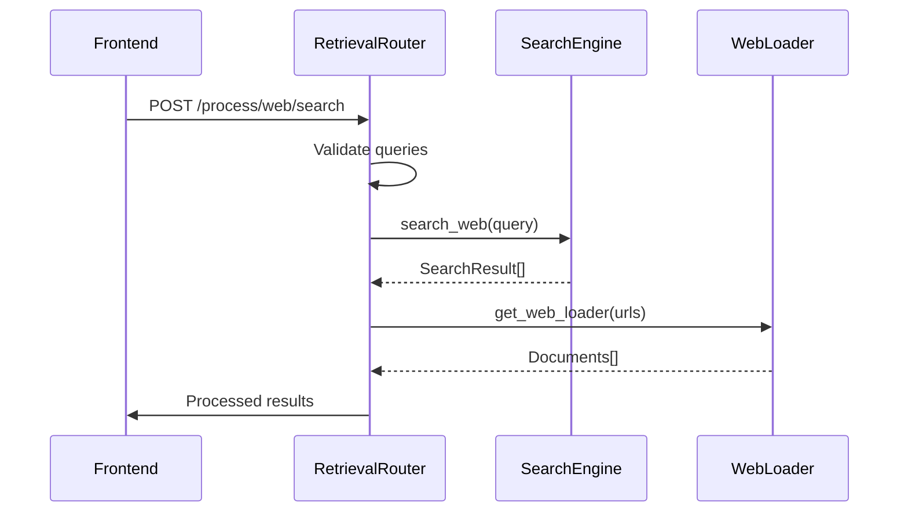
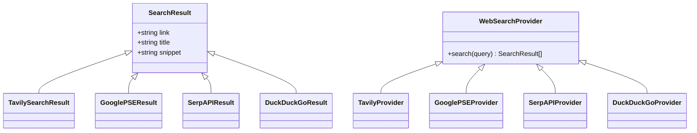
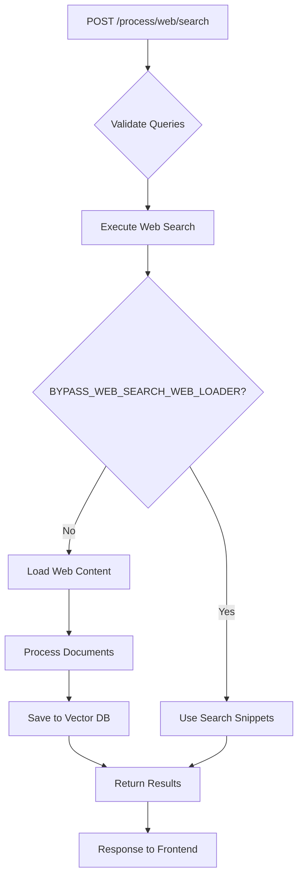

# Web Search Integration

<cite>
**Referenced Files in This Document**   
- [retrieval.py](file://backend/open_webui/routers/retrieval.py)
- [main.py](file://backend/open_webui/retrieval/web/main.py)
- [utils.py](file://backend/open_webui/retrieval/web/utils.py)
- [tavily.py](file://backend/open_webui/retrieval/web/tavily.py)
- [serpapi.py](file://backend/open_webui/retrieval/web/serpapi.py)
- [google_pse.py](file://backend/open_webui/retrieval/web/google_pse.py)
- [duckduckgo.py](file://backend/open_webui/retrieval/web/duckduckgo.py)
- [external.py](file://backend/open_webui/retrieval/web/external.py)
- [config.py](file://backend/open_webui/config.py)
</cite>

## Table of Contents
1. [Introduction](#introduction)
2. [Search Orchestration](#search-orchestration)
3. [Result Normalization](#result-normalization)
4. [Citation Generation](#citation-generation)
5. [API Endpoints](#api-endpoints)
6. [Authentication and Rate Limiting](#authentication-and-rate-limiting)
7. [Error Handling](#error-handling)
8. [Configuration and Usage](#configuration-and-usage)
9. [Privacy and Cost Management](#privacy-and-cost-management)
10. [Fallback Strategies](#fallback-strategies)

## Introduction
The Web Search Integration in the RAG system enables the retrieval of up-to-date information from external search providers to enhance the knowledge base available to the AI assistant. This integration supports multiple search engines including Tavily, Google PSE, SerpAPI, and DuckDuckGo, allowing users to query the web directly from the chat interface. The system orchestrates search requests, normalizes results, and integrates them into the retrieval pipeline to provide comprehensive and current information in response to user queries.

**Section sources**
- [retrieval.py](file://backend/open_webui/routers/retrieval.py#L1-L2504)

## Search Orchestration
The search orchestration logic is implemented in the `search_web` function within the retrieval router. This function determines which search engine to use based on the configured `WEB_SEARCH_ENGINE` and routes the query accordingly. The orchestration supports multiple search providers, each with its own implementation file in the `retrieval/web` directory. When a search request is received, the system selects the appropriate search engine based on the configuration and executes the search using the corresponding API.

The orchestration includes support for various search engines through dedicated functions such as `search_tavily`, `search_google_pse`, `search_serpapi`, and `search_duckduckgo`. Each function handles the specific API requirements of its respective search provider, including authentication, query parameters, and response parsing. The system also supports concurrent search requests through the `WEB_SEARCH_CONCURRENT_REQUESTS` configuration parameter, allowing multiple queries to be processed simultaneously for improved performance.

**Diagram sources**
- [retrieval.py](file://backend/open_webui/routers/retrieval.py#L1764-L2188)
- [utils.py](file://backend/open_webui/retrieval/web/utils.py#L654-L713)

**Section sources**
- [retrieval.py](file://backend/open_webui/routers/retrieval.py#L1764-L2188)
- [utils.py](file://backend/open_webui/retrieval/web/utils.py#L654-L713)

## Result Normalization
The system normalizes search results through the `SearchResult` model defined in `retrieval/web/main.py`. This model standardizes the output format across different search providers by defining a common structure with fields for `link`, `title`, and `snippet`. When search results are received from various providers, they are converted to this standardized format, ensuring consistency in how results are processed and displayed.

The normalization process includes filtering results based on domain restrictions through the `get_filtered_results` function. This function checks each result's domain against a configurable filter list and excludes results from blocked domains. The filtering is applied to both search results and web content loading, providing a consistent mechanism for controlling which content is retrieved and processed.

**Diagram sources**
- [main.py](file://backend/open_webui/retrieval/web/main.py#L43-L47)
- [tavily.py](file://backend/open_webui/retrieval/web/tavily.py#L12-L52)
- [google_pse.py](file://backend/open_webui/retrieval/web/google_pse.py#L12-L75)
- [serpapi.py](file://backend/open_webui/retrieval/web/serpapi.py#L13-L51)
- [duckduckgo.py](file://backend/open_webui/retrieval/web/duckduckgo.py#L13-L53)

**Section sources**
- [main.py](file://backend/open_webui/retrieval/web/main.py#L12-L47)
- [utils.py](file://backend/open_webui/retrieval/web/utils.py#L12-L40)

## Citation Generation
Citation generation is handled through the metadata attached to documents retrieved from web sources. When content is loaded from URLs, the system creates Document objects with metadata that includes the source URL, title, and other relevant information. This metadata is preserved throughout the retrieval pipeline and can be used to generate citations in the final response.

The system supports different web loader engines (safe_web, playwright, firecrawl, tavily) which extract content from web pages and include source information in the document metadata. For search results, the citation information is derived from the SearchResult objects, with the link serving as the primary citation source. When results are processed and stored in the vector database, the source URL is included in the metadata, enabling proper attribution when the content is retrieved.

**Section sources**
- [retrieval.py](file://backend/open_webui/routers/retrieval.py#L1717-L1755)
- [utils.py](file://backend/open_webui/retrieval/web/utils.py#L654-L713)

## API Endpoints
The retrieval system exposes several API endpoints for web search functionality, primarily through the `retrieval.py` router. The main endpoint for web search is `POST /process/web/search`, which accepts a list of queries and returns search results along with loaded content. This endpoint orchestrates the entire search process, from querying search engines to loading and processing web content.

Additional endpoints include `GET /` for retrieving the current status and configuration, `GET /config` for retrieving detailed configuration settings, and `POST /config/update` for updating configuration parameters. These endpoints allow the frontend to interact with the retrieval system, configure search settings, and retrieve information about the current state of the system.

**Diagram sources**
- [retrieval.py](file://backend/open_webui/routers/retrieval.py#L2056-L2188)

**Section sources**
- [retrieval.py](file://backend/open_webui/routers/retrieval.py#L2056-L2188)

## Authentication and Rate Limiting
Authentication for external search services is managed through API keys stored in environment variables or configuration files. Each search provider has its own configuration parameters for API keys, such as `TAVILY_API_KEY`, `GOOGLE_PSE_API_KEY`, and `SERPAPI_API_KEY`. These keys are securely stored and referenced in the configuration system, ensuring that sensitive credentials are not exposed in the codebase.

Rate limiting is implemented at multiple levels to prevent abuse and ensure fair usage of external services. The system includes configurable parameters for concurrent requests (`WEB_SEARCH_CONCURRENT_REQUESTS` and `WEB_LOADER_CONCURRENT_REQUESTS`) that limit the number of simultaneous operations. Additionally, some search providers have built-in rate limiting mechanisms that are respected by the integration code.

**Section sources**
- [config.py](file://backend/open_webui/config.py#L2975-L3051)
- [retrieval.py](file://backend/open_webui/routers/retrieval.py#L498-L548)

## Error Handling
The system implements comprehensive error handling for external service interactions. Each search provider function includes try-catch blocks to handle API errors, network issues, and invalid responses. When an error occurs, the system logs the error details and returns an appropriate response to the caller, either an empty result set or a structured error message.

For search operations, the system gracefully handles failures by continuing to process other queries even if one fails. This is achieved through the use of `asyncio.gather` with proper error handling, ensuring that a single failed search does not prevent other searches from completing. The system also includes fallback mechanisms, such as attempting alternative search providers when the primary provider fails.

**Section sources**
- [tavily.py](file://backend/open_webui/retrieval/web/tavily.py#L12-L52)
- [google_pse.py](file://backend/open_webui/retrieval/web/google_pse.py#L12-L75)
- [retrieval.py](file://backend/open_webui/routers/retrieval.py#L2092-L2188)

## Configuration and Usage
The web search integration is highly configurable through environment variables and API endpoints. Key configuration parameters include `ENABLE_WEB_SEARCH` to enable or disable web search functionality, `WEB_SEARCH_ENGINE` to specify the default search provider, and `WEB_SEARCH_RESULT_COUNT` to control the number of results returned.

To use the web search functionality in chat contexts, users can trigger searches through the frontend interface, which sends queries to the `POST /process/web/search` endpoint. The system then processes these queries, retrieves results from the configured search engine, loads the content from the top results, and makes it available for retrieval and response generation.

**Section sources**
- [config.py](file://backend/open_webui/config.py#L2948-L3051)
- [retrieval.py](file://backend/open_webui/routers/retrieval.py#L498-L548)

## Privacy and Cost Management
The system includes several features to address privacy and cost management concerns. Domain filtering through `WEB_SEARCH_DOMAIN_FILTER_LIST` allows administrators to restrict searches to trusted domains, reducing the risk of accessing inappropriate or malicious content. SSL verification can be enabled or disabled through `ENABLE_WEB_LOADER_SSL_VERIFICATION` to balance security with accessibility.

Cost management is addressed through rate limiting and concurrent request controls, which help prevent excessive usage that could lead to high costs with paid search APIs. The system also supports bypass modes (`BYPASS_WEB_SEARCH_EMBEDDING_AND_RETRIEVAL` and `BYPASS_WEB_SEARCH_WEB_LOADER`) that allow administrators to optimize performance and cost based on their specific requirements.

**Section sources**
- [config.py](file://backend/open_webui/config.py#L2948-L3051)
- [utils.py](file://backend/open_webui/retrieval/web/utils.py#L62-L95)

## Fallback Strategies
The system implements multiple fallback strategies to ensure reliability when external searches fail. If a primary search provider is unavailable or returns an error, the system can be configured to try alternative providers. The search orchestration logic includes error handling that allows the system to continue processing other queries even when individual searches fail.

Additionally, the system supports a bypass mode for web content loading (`BYPASS_WEB_SEARCH_WEB_LOADER`) that uses search result snippets directly instead of loading full web pages. This provides a fallback when web page loading fails due to network issues, SSL errors, or other problems. The system also includes retry logic for certain operations and graceful degradation when external services are unavailable.

**Section sources**
- [retrieval.py](file://backend/open_webui/routers/retrieval.py#L2107-L2111)
- [utils.py](file://backend/open_webui/retrieval/web/utils.py#L549-L653)