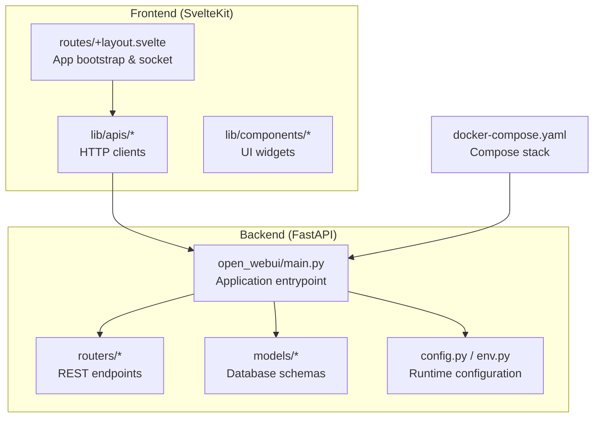
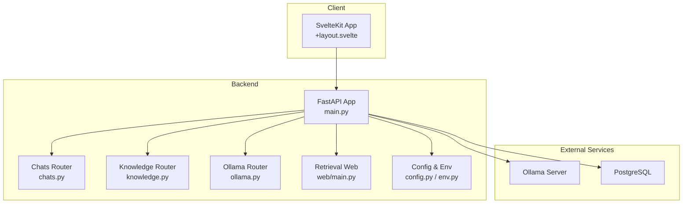
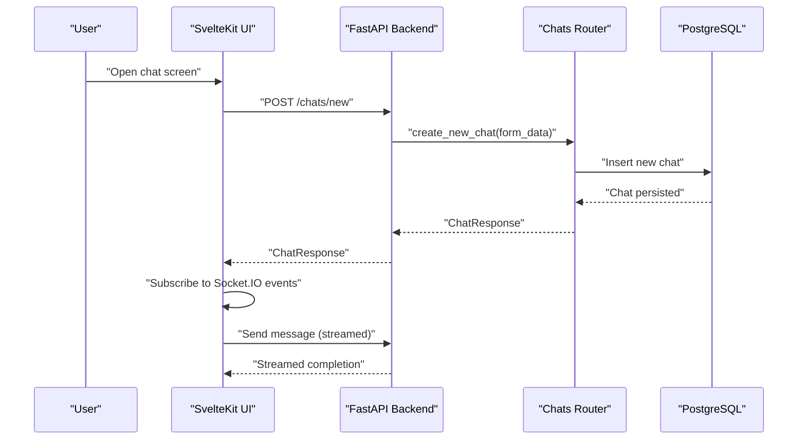
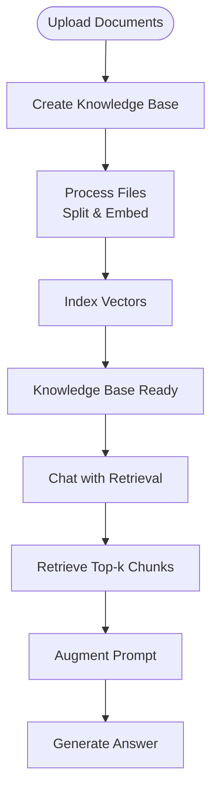
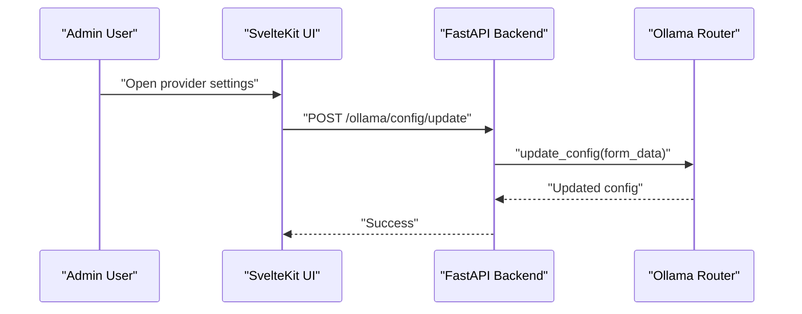
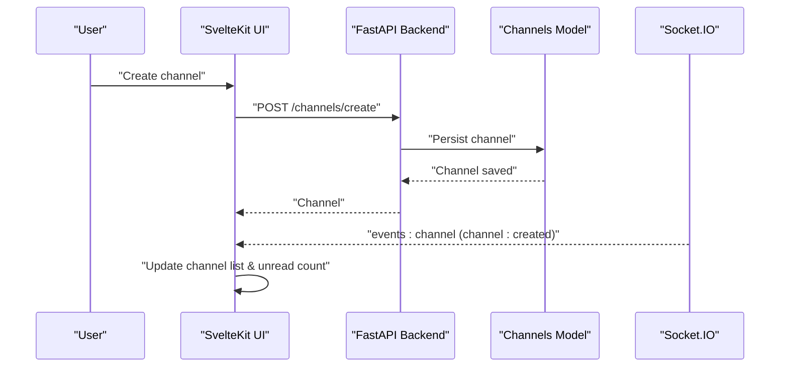
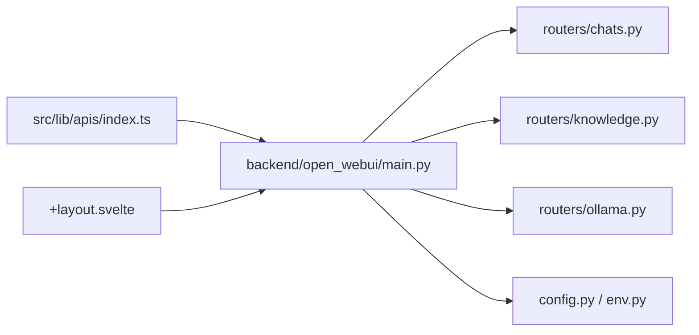

# System Overview

<cite>
**Referenced Files in This Document**
- [README.md](file://README.md)
- [backend/open_webui/main.py](file://backend/open_webui/main.py)
- [backend/open_webui/config.py](file://backend/open_webui/config.py)
- [backend/open_webui/env.py](file://backend/open_webui/env.py)
- [backend/open_webui/routers/chats.py](file://backend/open_webui/routers/chats.py)
- [backend/open_webui/routers/knowledge.py](file://backend/open_webui/routers/knowledge.py)
- [backend/open_webui/routers/ollama.py](file://backend/open_webui/routers/ollama.py)
- [backend/open_webui/retrieval/web/main.py](file://backend/open_webui/retrieval/web/main.py)
- [backend/open_webui/models/channels.py](file://backend/open_webui/models/channels.py)
- [src/lib/apis/index.ts](file://src/lib/apis/index.ts)
- [src/lib/apis/channels/index.ts](file://src/lib/apis/channels/index.ts)
- [src/lib/apis/ollama/index.ts](file://src/lib/apis/ollama/index.ts)
- [src/routes/+layout.svelte](file://src/routes/+layout.svelte)
- [docker-compose.yaml](file://docker-compose.yaml)
</cite>

## Table of Contents
1. [Introduction](#introduction)
2. [Project Structure](#project-structure)
3. [Core Components](#core-components)
4. [Architecture Overview](#architecture-overview)
5. [Detailed Component Analysis](#detailed-component-analysis)
6. [Dependency Analysis](#dependency-analysis)
7. [Performance Considerations](#performance-considerations)
8. [Troubleshooting Guide](#troubleshooting-guide)
9. [Conclusion](#conclusion)

## Introduction
AIris is a private, web-based user interface designed for secure, local-first AI interactions. It enables users to manage models, engage in chat sessions, process documents for knowledge retrieval, and collaborate via channels. The platform integrates with local and remote AI providers (notably Ollama and OpenAI-compatible APIs) and supports extensibility through tool servers and plugins. It is built as a full-stack application with a Svelte frontend and a FastAPI backend, offering a modern, responsive experience with real-time collaboration and robust configuration controls.

## Project Structure
At a high level, the repository is organized into:
- backend: FastAPI application, routers, models, utilities, and configuration
- src: SvelteKit frontend, APIs, stores, components, and routes
- docs, kubernetes, scripts, and static assets for deployment and documentation

**Diagram sources**
- [backend/open_webui/main.py](file://backend/open_webui/main.py#L656-L720)
- [src/routes/+layout.svelte](file://src/routes/+layout.svelte#L1-L120)
- [docker-compose.yaml](file://docker-compose.yaml#L1-L60)

**Section sources**
- [README.md](file://README.md#L1-L27)
- [docker-compose.yaml](file://docker-compose.yaml#L1-L60)

## Core Components
- Frontend (SvelteKit): Provides the user interface, real-time collaboration via Socket.IO, and typed API clients for backend endpoints.
- Backend (FastAPI): Exposes REST endpoints for chat, knowledge, models, retrieval, channels, and integrations; manages configuration and persistence.
- Retrieval and RAG: Vector indexing, embedding, reranking, and web search utilities for document processing and knowledge retrieval.
- AI Providers: Ollama and OpenAI-compatible integrations with configurable endpoints and model lists.
- Team Collaboration: Channels and group-based messaging with access control and notifications.

Practical capabilities:
- Start a chat session and receive streamed responses
- Upload documents to a knowledge base for retrieval-augmented generation
- Configure AI models and providers via the admin UI
- Collaborate in channels with real-time events and notifications

**Section sources**
- [src/lib/apis/index.ts](file://src/lib/apis/index.ts#L1-L160)
- [backend/open_webui/routers/chats.py](file://backend/open_webui/routers/chats.py#L1-L120)
- [backend/open_webui/routers/knowledge.py](file://backend/open_webui/routers/knowledge.py#L1-L120)
- [backend/open_webui/routers/ollama.py](file://backend/open_webui/routers/ollama.py#L278-L309)

## Architecture Overview
The system follows a classic full-stack architecture:
- SvelteKit frontend communicates with FastAPI backend via REST and Socket.IO for real-time events.
- Backend orchestrates model providers, retrieval pipelines, and persistence.
- Retrieval subsystem supports local knowledge bases and web search, with pluggable embedding and reranking engines.

**Diagram sources**
- [backend/open_webui/main.py](file://backend/open_webui/main.py#L656-L720)
- [backend/open_webui/routers/chats.py](file://backend/open_webui/routers/chats.py#L1-L120)
- [backend/open_webui/routers/knowledge.py](file://backend/open_webui/routers/knowledge.py#L1-L120)
- [backend/open_webui/routers/ollama.py](file://backend/open_webui/routers/ollama.py#L278-L309)
- [backend/open_webui/retrieval/web/main.py](file://backend/open_webui/retrieval/web/main.py#L1-L47)
- [backend/open_webui/config.py](file://backend/open_webui/config.py#L1-L120)
- [backend/open_webui/env.py](file://backend/open_webui/env.py#L1-L120)

## Detailed Component Analysis

### Chat Workflow (Beginner-Friendly)
- User starts a new chat session from the UI.
- The frontend sends a request to the backend chat router to create a new chat.
- The backend persists the chat metadata and returns a chat identifier.
- The frontend subscribes to real-time events via Socket.IO and streams model responses.

**Diagram sources**
- [backend/open_webui/routers/chats.py](file://backend/open_webui/routers/chats.py#L129-L160)
- [src/routes/+layout.svelte](file://src/routes/+layout.svelte#L325-L479)

**Section sources**
- [backend/open_webui/routers/chats.py](file://backend/open_webui/routers/chats.py#L129-L160)
- [src/routes/+layout.svelte](file://src/routes/+layout.svelte#L325-L479)

### Knowledge Base and Retrieval (Beginner-Friendly)
- User creates a knowledge base and uploads documents.
- The backend processes files, extracts text, splits into chunks, generates embeddings, and stores vectors.
- During chat, the system retrieves relevant chunks and augments the prompt for grounded answers.

**Diagram sources**
- [backend/open_webui/routers/knowledge.py](file://backend/open_webui/routers/knowledge.py#L1-L120)
- [backend/open_webui/retrieval/web/main.py](file://backend/open_webui/retrieval/web/main.py#L1-L47)

**Section sources**
- [backend/open_webui/routers/knowledge.py](file://backend/open_webui/routers/knowledge.py#L1-L120)
- [backend/open_webui/retrieval/web/main.py](file://backend/open_webui/retrieval/web/main.py#L1-L47)

### AI Provider Integration (Beginner-Friendly)
- Configure Ollama or OpenAI-compatible endpoints in the admin UI.
- The frontend calls the Ollama router to update provider URLs and model configurations.
- The backend validates and persists the configuration for model discovery and chat routing.

**Diagram sources**
- [backend/open_webui/routers/ollama.py](file://backend/open_webui/routers/ollama.py#L284-L309)
- [src/lib/apis/ollama/index.ts](file://src/lib/apis/ollama/index.ts#L62-L136)

**Section sources**
- [backend/open_webui/routers/ollama.py](file://backend/open_webui/routers/ollama.py#L278-L309)
- [src/lib/apis/ollama/index.ts](file://src/lib/apis/ollama/index.ts#L62-L136)

### Team Collaboration (Beginner-Friendly)
- Users create channels (group, direct message, or discussion) with access control.
- Real-time events propagate via Socket.IO to notify participants and update unread counts.

**Diagram sources**
- [backend/open_webui/models/channels.py](file://backend/open_webui/models/channels.py#L1-L57)
- [src/lib/apis/channels/index.ts](file://src/lib/apis/channels/index.ts#L1-L74)
- [src/routes/+layout.svelte](file://src/routes/+layout.svelte#L482-L569)

**Section sources**
- [backend/open_webui/models/channels.py](file://backend/open_webui/models/channels.py#L1-L57)
- [src/lib/apis/channels/index.ts](file://src/lib/apis/channels/index.ts#L1-L74)
- [src/routes/+layout.svelte](file://src/routes/+layout.svelte#L482-L569)

## Dependency Analysis
- Frontend-to-backend coupling is primarily via typed API modules that call REST endpoints and consume Socket.IO events.
- Backend routers depend on models and utilities for persistence, retrieval, and provider orchestration.
- Configuration is centralized in config.py and env.py, enabling runtime toggles for features like API keys, OAuth, and webhooks.

**Diagram sources**
- [src/lib/apis/index.ts](file://src/lib/apis/index.ts#L1-L160)
- [src/routes/+layout.svelte](file://src/routes/+layout.svelte#L1-L120)
- [backend/open_webui/main.py](file://backend/open_webui/main.py#L656-L720)
- [backend/open_webui/routers/chats.py](file://backend/open_webui/routers/chats.py#L1-L120)
- [backend/open_webui/routers/knowledge.py](file://backend/open_webui/routers/knowledge.py#L1-L120)
- [backend/open_webui/routers/ollama.py](file://backend/open_webui/routers/ollama.py#L278-L309)
- [backend/open_webui/config.py](file://backend/open_webui/config.py#L1-L120)
- [backend/open_webui/env.py](file://backend/open_webui/env.py#L1-L120)

**Section sources**
- [src/lib/apis/index.ts](file://src/lib/apis/index.ts#L1-L160)
- [src/routes/+layout.svelte](file://src/routes/+layout.svelte#L1-L120)
- [backend/open_webui/main.py](file://backend/open_webui/main.py#L656-L720)

## Performance Considerations
- Streaming responses reduce latency and improve perceived responsiveness during chat.
- Asynchronous processing and thread pools help scale retrieval and embedding operations.
- Caching and base model caches can accelerate model discovery and reduce repeated network calls.
- Efficient vector indexing and top-k retrieval minimize latency for RAG.

[No sources needed since this section provides general guidance]

## Troubleshooting Guide
Common issues and checks:
- Authentication failures: Verify tokens and API keys; ensure admin permissions for provider configuration.
- Provider connectivity: Confirm Ollama/OpenAI endpoint URLs and credentials; validate network access.
- Retrieval errors: Check vector database readiness and embedding model availability; reindex knowledge bases if needed.
- Real-time events: Ensure WebSocket is enabled and the Socket.IO connection is established.

**Section sources**
- [backend/open_webui/routers/ollama.py](file://backend/open_webui/routers/ollama.py#L284-L309)
- [src/lib/apis/ollama/index.ts](file://src/lib/apis/ollama/index.ts#L62-L136)
- [src/routes/+layout.svelte](file://src/routes/+layout.svelte#L95-L177)

## Conclusion
AIris delivers a comprehensive, extensible platform for private AI interactions. Its full-stack design combines a reactive Svelte frontend with a robust FastAPI backend, enabling secure chat, powerful retrieval-augmented generation, flexible model management, and team collaboration. With strong configuration controls and provider integrations, it supports both beginner-friendly workflows and advanced customization for production environments.