# API Connectivity Issues

<cite>
**Referenced Files in This Document**   
- [main.py](file://backend/open_webui/main.py)
- [ollama.py](file://backend/open_webui/routers/ollama.py)
- [openai.py](file://backend/open_webui/routers/openai.py)
- [middleware.py](file://backend/open_webui/utils/middleware.py)
- [response.py](file://backend/open_webui/utils/response.py)
- [payload.py](file://backend/open_webui/utils/payload.py)
- [constants.py](file://backend/open_webui/constants.py)
- [security_headers.py](file://backend/open_webui/utils/security_headers.py)
- [config.py](file://backend/open_webui/config.py)
- [socket/main.py](file://backend/open_webui/socket/main.py)
- [TROUBLESHOOTING.md](file://TROUBLESHOOTING.md)
- [apache.md](file://docs/apache.md)
- [+layout.svelte](file://src/routes/+layout.svelte)
- [index.ts](file://src/lib/apis/ollama/index.ts)
</cite>

## Table of Contents
1. [Introduction](#introduction)
2. [API Endpoint Structure](#api-endpoint-structure)
3. [Request/Response Patterns](#requestresponse-patterns)
4. [Error Handling Mechanisms](#error-handling-mechanisms)
5. [WebSocket Connection Issues](#websocket-connection-issues)
6. [CORS-Related Errors](#cors-related-errors)
7. [Reverse Proxy Configurations](#reverse-proxy-configurations)
8. [SSL/TLS Termination](#ssltls-termination)
9. [Load Balancer Settings](#load-balancer-settings)
10. [OpenAI-Compatible API Integration](#openai-compatible-api-integration)
11. [Ollama Integration Issues](#ollama-integration-issues)
12. [Third-Party Service Connections](#third-party-service-connections)
13. [Common HTTP Status Codes](#common-http-status-codes)
14. [Troubleshooting Guide](#troubleshooting-guide)
15. [Conclusion](#conclusion)

## Introduction
This document provides comprehensive guidance on diagnosing and resolving API connectivity issues in the open-webui application. It covers various aspects of API communication, including failed requests, WebSocket connection problems, and CORS-related errors. The document explains the API endpoint structure, request/response patterns, and error handling mechanisms. It also addresses configuration issues related to reverse proxies, SSL/TLS termination, and load balancers. Special attention is given to integration with the OpenAI-compatible API, Ollama, and third-party services. Common HTTP status codes and their meanings in the context of this application are provided to assist in troubleshooting.

**Section sources**
- [TROUBLESHOOTING.md](file://TROUBLESHOOTING.md#L1-L37)

## API Endpoint Structure
The open-webui application exposes a comprehensive set of API endpoints for various functionalities. The API structure is organized into different routers based on functionality, with each router handling specific types of requests.

The main API endpoints are categorized as follows:
- **Ollama API**: Handles interactions with Ollama services for model management and inference
- **OpenAI API**: Provides OpenAI-compatible endpoints for chat completions, embeddings, and other AI operations
- **Authentication API**: Manages user authentication, API keys, and session management
- **Configuration API**: Allows administrators to configure system settings and integrations
- **File and Knowledge Management API**: Handles file uploads, knowledge base operations, and retrieval

The API endpoints follow RESTful principles with clear URL patterns and consistent response formats. The application uses FastAPI as the web framework, which provides automatic OpenAPI documentation generation.

```mermaid
graph TD
A[API Endpoints] --> B[Ollama API]
A --> C[OpenAI API]
A --> D[Authentication API]
A --> E[Configuration API]
A --> F[File and Knowledge Management API]
B --> B1[/ollama/api/tags]
B --> B2[/ollama/api/ps]
B --> B3[/ollama/api/version]
B --> B4[/ollama/api/pull]
B --> B5[/ollama/api/push]
B --> B6[/ollama/api/create]
B --> B7[/ollama/api/copy]
C --> C1[/openai/models]
C --> C2[/openai/audio/speech]
C --> C3[/openai/chat/completions]
C --> C4[/openai/embeddings]
D --> D1[/auths/me]
D --> D2[/auths/signup]
D --> D3[/auths/login]
D --> D4[/auths/api_key]
E --> E1[/config]
E --> E2[/config/update]
E --> E3[/verify]
F --> F1[/files/upload]
F --> F2[/files/list]
F --> F3[/knowledge/add]
F --> F4[/retrieval/query]
```

**Diagram sources**
- [ollama.py](file://backend/open_webui/routers/ollama.py#L210-L800)
- [openai.py](file://backend/open_webui/routers/openai.py#L212-L800)
- [auths.py](file://backend/open_webui/routers/auths.py#L1-L100)
- [configs.py](file://backend/open_webui/routers/configs.py#L1-L100)
- [files.py](file://backend/open_webui/routers/files.py#L1-L100)
- [retrieval.py](file://backend/open_webui/routers/retrieval.py#L1-L100)

**Section sources**
- [ollama.py](file://backend/open_webui/routers/ollama.py#L210-L800)
- [openai.py](file://backend/open_webui/routers/openai.py#L212-L800)

## Request/Response Patterns
The open-webui application follows consistent request and response patterns across its API endpoints. These patterns ensure predictable behavior and ease of integration for clients.

### Request Patterns
API requests typically follow these patterns:
- **HTTP Methods**: Standard HTTP methods (GET, POST, PUT, DELETE) are used according to REST principles
- **Content-Type**: Requests with a body use `application/json` as the content type
- **Authentication**: Most endpoints require authentication via Bearer tokens in the Authorization header
- **Query Parameters**: Used for filtering, pagination, and optional parameters
- **Request Body**: JSON format for complex data structures

For Ollama API requests, the application acts as a reverse proxy, forwarding requests to the configured Ollama server. The request structure maintains compatibility with the Ollama API while adding authentication and logging capabilities.

For OpenAI-compatible API requests, the application translates OpenAI API requests to the appropriate format for the underlying AI service (Ollama or other providers), ensuring compatibility with OpenAI's API specification.

### Response Patterns
API responses follow consistent patterns:
- **Success Responses**: Return appropriate HTTP status codes (200, 201, etc.) with JSON data
- **Error Responses**: Return appropriate HTTP status codes with error details in JSON format
- **Streaming Responses**: For chat completions and similar operations, responses can be streamed using Server-Sent Events (SSE)
- **Headers**: Responses include relevant headers such as content type, cache control, and security headers

The application uses response models to ensure consistent response structures. For example, model listing endpoints return a standardized structure with model details, while chat completion endpoints return responses compatible with the OpenAI API format.

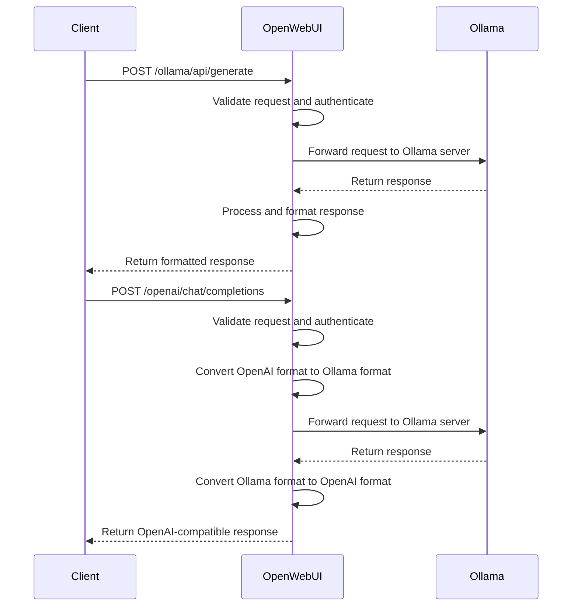

**Diagram sources**
- [middleware.py](file://backend/open_webui/utils/middleware.py#L1-L800)
- [payload.py](file://backend/open_webui/utils/payload.py#L1-L400)
- [response.py](file://backend/open_webui/utils/response.py#L1-L200)

**Section sources**
- [middleware.py](file://backend/open_webui/utils/middleware.py#L1-L800)
- [payload.py](file://backend/open_webui/utils/payload.py#L1-L400)
- [response.py](file://backend/open_webui/utils/response.py#L1-L200)

## Error Handling Mechanisms
The open-webui application implements comprehensive error handling mechanisms to provide meaningful feedback to clients and facilitate troubleshooting.

### Error Response Structure
Error responses follow a consistent structure:
- **HTTP Status Code**: Appropriate status code indicating the type of error
- **JSON Body**: Contains error details with a standardized format
- **Error Detail**: Human-readable description of the error
- **Error Code**: Optional machine-readable error code

The application defines a set of standard error messages in the `ERROR_MESSAGES` enum in `constants.py`. These messages provide consistent error descriptions across the application.

### Error Types and Handling
The application handles various types of errors:

**Client Errors (4xx)**:
- **400 Bad Request**: Invalid request parameters or body
- **401 Unauthorized**: Authentication required or failed
- **403 Forbidden**: Insufficient permissions
- **404 Not Found**: Resource not found
- **429 Too Many Requests**: Rate limiting

**Server Errors (5xx)**:
- **500 Internal Server Error**: Generic server error
- **502 Bad Gateway**: Error communicating with upstream services
- **503 Service Unavailable**: Service temporarily unavailable
- **504 Gateway Timeout**: Timeout communicating with upstream services

The application uses FastAPI's exception handling to catch and format errors consistently. Custom HTTPException classes are used to raise specific errors with appropriate status codes and messages.

### Error Logging
The application implements comprehensive logging for error diagnosis:
- **Structured Logging**: Uses structured logging with relevant context
- **Error Details**: Logs include error type, message, and relevant request information
- **Sensitive Data Protection**: Ensures sensitive data is not logged

The logging configuration is set up in `main.py`, with different log levels for various components of the application.

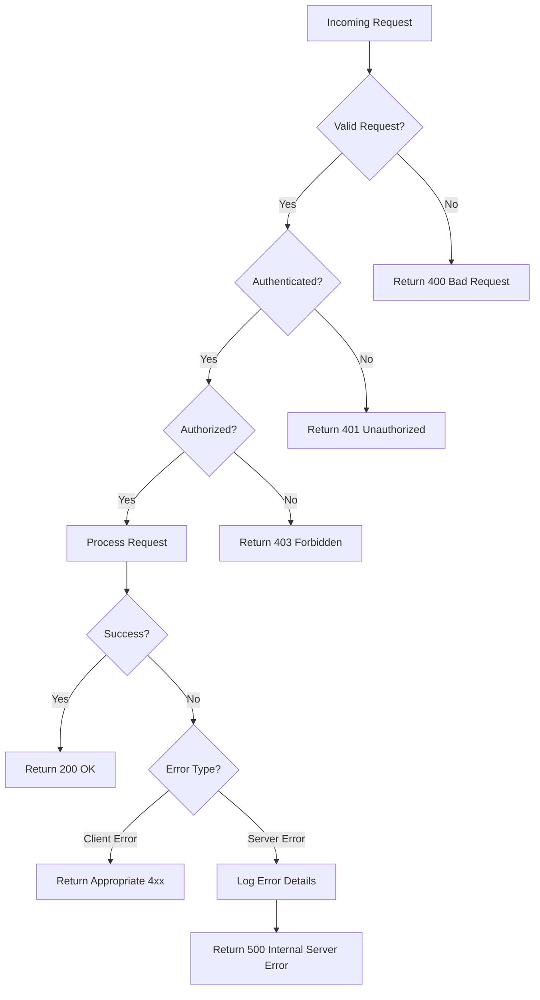

**Diagram sources**
- [constants.py](file://backend/open_webui/constants.py#L1-L127)
- [main.py](file://backend/open_webui/main.py#L1-L2352)
- [middleware.py](file://backend/open_webui/utils/middleware.py#L1-L800)

**Section sources**
- [constants.py](file://backend/open_webui/constants.py#L1-L127)
- [main.py](file://backend/open_webui/main.py#L1-L2352)
- [middleware.py](file://backend/open_webui/utils/middleware.py#L1-L800)

## WebSocket Connection Issues
WebSocket connections in open-webui are used for real-time communication between the client and server, particularly for streaming chat completions and real-time updates.

### WebSocket Configuration
The application uses Socket.IO for WebSocket communication, providing fallback mechanisms for environments where WebSockets are not available. The WebSocket configuration is set up in `main.py` and `socket/main.py`.

Key configuration options:
- **Transports**: Supports both WebSocket and HTTP long-polling
- **Ping Interval**: Frequency of ping messages to keep connections alive
- **Ping Timeout**: Time to wait for a response before disconnecting
- **CORS**: Configurable CORS settings for WebSocket connections

The WebSocket server is configured to handle authentication using JWT tokens passed in the connection handshake.

### Common WebSocket Issues
Common WebSocket connection issues include:

**Connection Establishment Failures**:
- **Network Issues**: Firewall or network configuration blocking WebSocket connections
- **CORS Issues**: Incorrect CORS configuration preventing connection
- **Authentication Issues**: Invalid or missing authentication tokens

**Connection Stability Issues**:
- **Timeouts**: Connections dropping due to inactivity or network issues
- **Reconnection**: Client-side reconnection logic not working properly
- **Message Loss**: Messages not being delivered or processed

**Performance Issues**:
- **High Latency**: Slow message delivery
- **Resource Exhaustion**: Too many concurrent connections consuming server resources

### Troubleshooting WebSocket Issues
To troubleshoot WebSocket issues:

1. **Check Browser Console**: Look for JavaScript errors related to WebSocket connections
2. **Verify Network Requests**: Use browser developer tools to inspect WebSocket handshake requests
3. **Check Server Logs**: Look for WebSocket-related errors in the application logs
4. **Test Connectivity**: Verify that the WebSocket endpoint is accessible from the client
5. **Review Configuration**: Check WebSocket-related environment variables and settings

The client-side WebSocket connection is established in `+layout.svelte`, where the Socket.IO client is configured with the appropriate URL and authentication token.

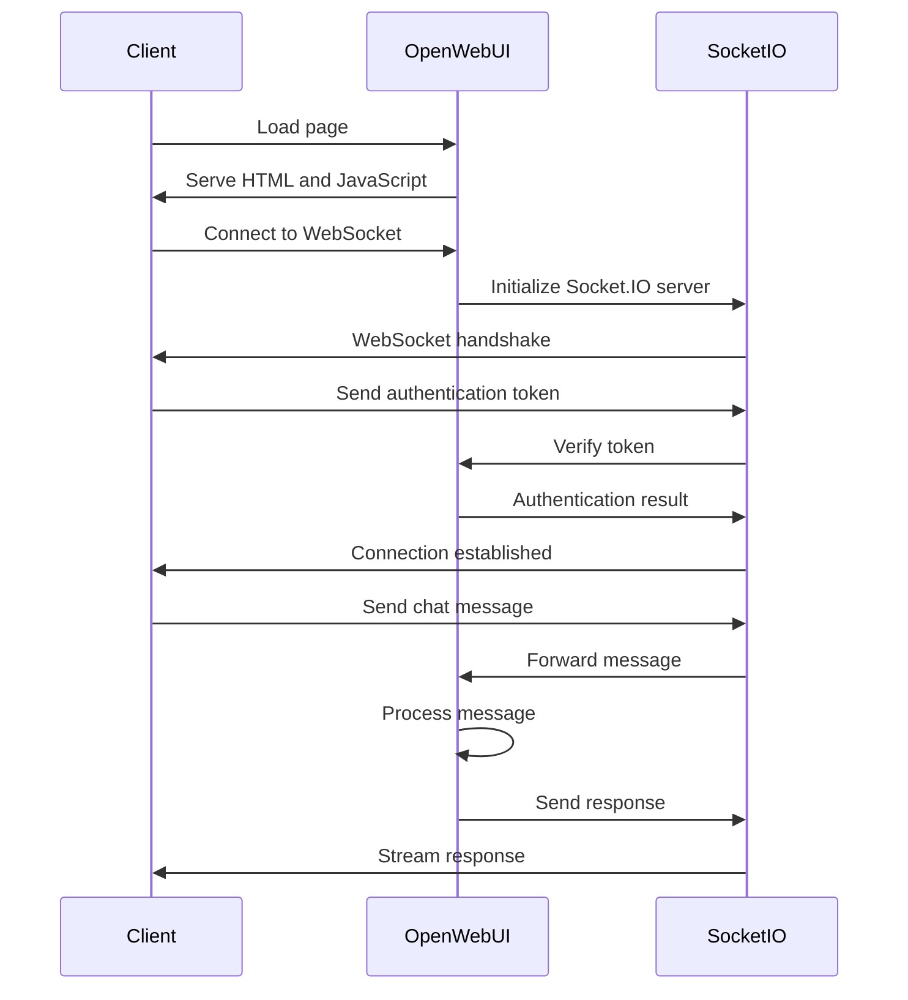

**Diagram sources**
- [socket/main.py](file://backend/open_webui/socket/main.py#L1-L800)
- [+layout.svelte](file://src/routes/+layout.svelte#L97-L142)
- [main.py](file://backend/open_webui/main.py#L656-L748)

**Section sources**
- [socket/main.py](file://backend/open_webui/socket/main.py#L1-L800)
- [+layout.svelte](file://src/routes/+layout.svelte#L97-L142)

## CORS-Related Errors
Cross-Origin Resource Sharing (CORS) is a security feature implemented by browsers to prevent unauthorized access to resources from different origins. The open-webui application includes CORS configuration to allow legitimate cross-origin requests while maintaining security.

### CORS Configuration
The application's CORS configuration is set up in `main.py` using FastAPI's CORSMiddleware. The configuration is controlled by the `CORS_ALLOW_ORIGIN` environment variable, which can specify one or more allowed origins.

Key aspects of the CORS configuration:
- **Allowed Origins**: Specifies which origins are allowed to access the API
- **Allowed Methods**: Specifies which HTTP methods are allowed
- **Allowed Headers**: Specifies which headers are allowed in requests
- **Credentials**: Controls whether credentials (cookies, authorization headers) are allowed

The application validates CORS origins to ensure they use allowed schemes (http, https, or custom schemes specified in `CORS_ALLOW_CUSTOM_SCHEME`).

### Common CORS Issues
Common CORS-related issues include:

**Blocked Requests**:
- **Origin Not Allowed**: Request origin not in the allowed list
- **Method Not Allowed**: HTTP method not permitted for cross-origin requests
- **Headers Not Allowed**: Request includes headers not permitted for cross-origin requests

**Preflight Request Issues**:
- **OPTIONS Request Blocked**: Browser preflight request blocked by server
- **Missing CORS Headers**: Server not including required CORS headers in response
- **Invalid CORS Headers**: CORS headers with invalid values

**Credentials Issues**:
- **Credentials Not Allowed**: Server not allowing credentials in cross-origin requests
- **Insecure Origins**: Credentials not allowed for non-HTTPS origins

### Troubleshooting CORS Issues
To troubleshoot CORS issues:

1. **Check Browser Console**: Look for CORS-related error messages
2. **Inspect Network Requests**: Use browser developer tools to examine request and response headers
3. **Verify CORS Configuration**: Check the `CORS_ALLOW_ORIGIN` environment variable
4. **Test with Different Origins**: Verify behavior with different origins
5. **Check Preflight Requests**: Ensure OPTIONS requests are handled correctly

The CORS validation logic is implemented in `config.py`, where the `validate_cors_origin` function ensures that only valid origins are allowed.

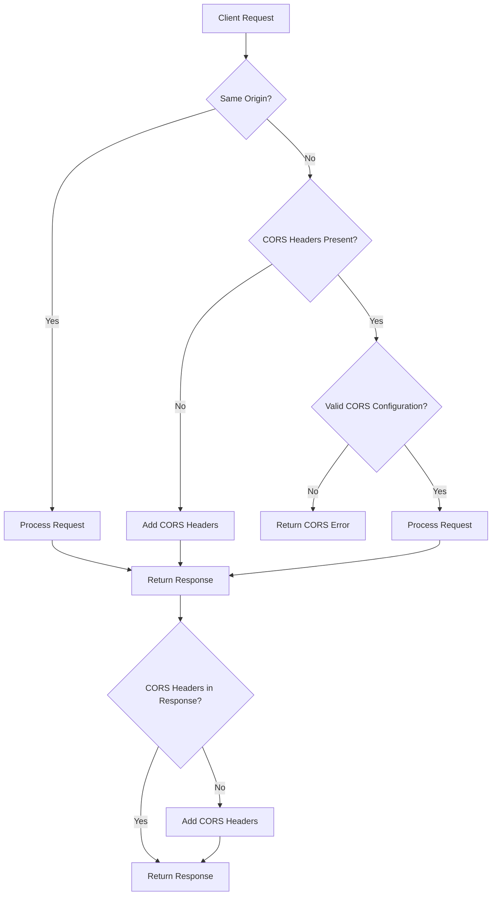

**Diagram sources**
- [main.py](file://backend/open_webui/main.py#L42-L44)
- [config.py](file://backend/open_webui/config.py#L1589-L1614)
- [security_headers.py](file://backend/open_webui/utils/security_headers.py#L1-L133)

**Section sources**
- [main.py](file://backend/open_webui/main.py#L42-L44)
- [config.py](file://backend/open_webui/config.py#L1589-L1614)

## Reverse Proxy Configurations
Reverse proxy configurations are essential when deploying open-webui in production environments, particularly when using SSL/TLS termination or load balancing.

### Apache Reverse Proxy
The application documentation includes an example configuration for Apache as a reverse proxy. This configuration forwards requests from the web server to the open-webui backend.

Key aspects of the Apache configuration:
- **ProxyPass**: Directs requests to the open-webui backend
- **ProxyPassReverse**: Ensures correct response headers
- **WebSocket Support**: Special configuration for WebSocket connections
- **SSL/TLS**: Configuration for SSL/TLS termination

The Apache configuration must include specific directives for WebSocket support, as WebSockets require different handling than regular HTTP requests.

### Nginx Reverse Proxy
Although not explicitly documented, Nginx can also be used as a reverse proxy for open-webui. A typical Nginx configuration would include:

- **proxy_pass**: Directs requests to the backend server
- **proxy_set_header**: Preserves original request headers
- **proxy_http_version**: Uses HTTP/1.1 for WebSocket support
- **proxy_set_header Upgrade**: Handles WebSocket upgrade requests
- **proxy_set_header Connection**: Manages connection headers for WebSockets

### Common Reverse Proxy Issues
Common issues with reverse proxy configurations include:

**WebSocket Connection Failures**:
- **Missing WebSocket Configuration**: Proxy not configured to handle WebSocket upgrade requests
- **Incorrect Headers**: Required headers not preserved or correctly set
- **Protocol Mismatch**: HTTP/1.0 used instead of HTTP/1.1

**SSL/TLS Issues**:
- **Certificate Errors**: Invalid or expired SSL certificates
- **Mixed Content**: HTTP and HTTPS resources on the same page
- **Header Stripping**: SSL-related headers removed by the proxy

**Performance Issues**:
- **Buffering**: Response buffering causing delays in streaming
- **Timeouts**: Proxy timeouts interrupting long-running requests
- **Compression**: Compression settings affecting performance

### Troubleshooting Reverse Proxy Issues
To troubleshoot reverse proxy issues:

1. **Verify Proxy Configuration**: Check that all required directives are present and correct
2. **Test Connectivity**: Ensure the proxy can reach the backend server
3. **Check Headers**: Verify that required headers are preserved
4. **Review Logs**: Examine proxy and application logs for errors
5. **Test Without Proxy**: Verify the application works directly before adding the proxy

The application's architecture is designed to work behind a reverse proxy, with the backend reverse proxy handling requests to Ollama and other services.

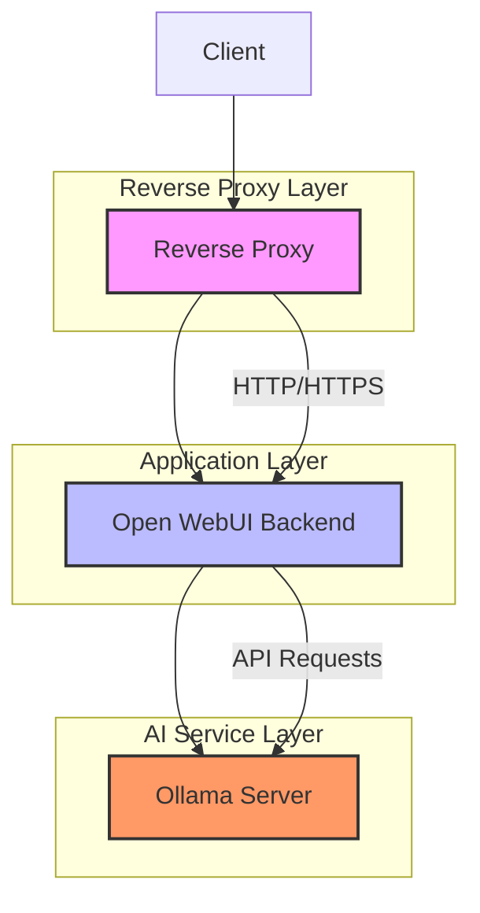

**Diagram sources**
- [apache.md](file://docs/apache.md#L1-L160)
- [TROUBLESHOOTING.md](file://TROUBLESHOOTING.md#L7-L10)

**Section sources**
- [apache.md](file://docs/apache.md#L1-L160)

## SSL/TLS Termination
SSL/TLS termination is the process of decrypting HTTPS traffic at a proxy server before forwarding it to the backend server over HTTP. This is a common deployment pattern for web applications.

### SSL/TLS Configuration
The open-webui application can be deployed with SSL/TLS termination at the reverse proxy level. The application itself does not need to handle SSL/TLS directly when using this pattern.

Key considerations for SSL/TLS termination:

**Certificate Management**:
- **Certificate Installation**: SSL certificates installed on the reverse proxy
- **Certificate Renewal**: Automated renewal processes (e.g., Let's Encrypt)
- **Certificate Chain**: Complete certificate chain including intermediate certificates

**Security Configuration**:
- **Protocol Versions**: Support for modern TLS versions (1.2, 1.3)
- **Cipher Suites**: Strong cipher suites only
- **HSTS**: HTTP Strict Transport Security header
- **OCSP Stapling**: Online Certificate Status Protocol stapling

**Performance Considerations**:
- **Session Resumption**: TLS session resumption for improved performance
- **Hardware Acceleration**: Use of hardware acceleration for SSL/TLS processing
- **Connection Pooling**: Efficient connection management

### Common SSL/TLS Issues
Common issues with SSL/TLS termination include:

**Certificate Errors**:
- **Expired Certificates**: SSL certificates that have expired
- **Domain Mismatch**: Certificate not valid for the requested domain
- **Chain Issues**: Incomplete certificate chain
- **Revoked Certificates**: Certificates that have been revoked

**Protocol and Cipher Issues**:
- **Weak Protocols**: Support for outdated protocols (SSLv3, TLS 1.0)
- **Weak Ciphers**: Use of weak or vulnerable cipher suites
- **Incompatible Clients**: Clients that don't support modern protocols

**Configuration Issues**:
- **Mixed Content**: HTTP resources on HTTPS pages
- **Redirect Loops**: Infinite redirect loops between HTTP and HTTPS
- **Header Stripping**: Important headers removed during termination

### Troubleshooting SSL/TLS Issues
To troubleshoot SSL/TLS issues:

1. **Check Certificate Validity**: Verify the certificate is valid and not expired
2. **Test with SSL Tools**: Use online SSL testing tools to identify issues
3. **Examine Browser Warnings**: Review browser security warnings
4. **Check Server Configuration**: Verify SSL/TLS settings on the proxy
5. **Test Connectivity**: Ensure the backend is accessible over HTTP

The application's security headers, including HSTS, are configured through environment variables and applied via the `SecurityHeadersMiddleware`.

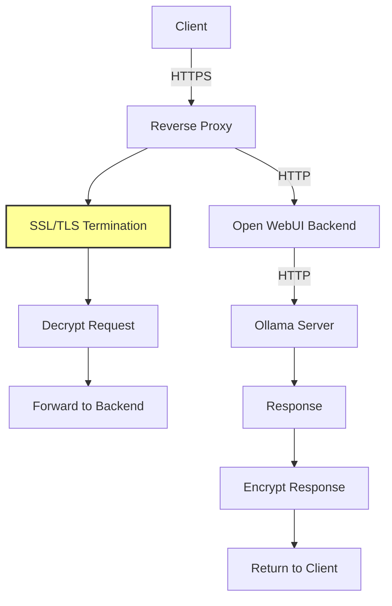

**Diagram sources**
- [apache.md](file://docs/apache.md#L30-L51)
- [security_headers.py](file://backend/open_webui/utils/security_headers.py#L1-L133)

**Section sources**
- [apache.md](file://docs/apache.md#L30-L51)

## Load Balancer Settings
Load balancing is essential for scaling the open-webui application across multiple servers or containers. Proper load balancer configuration ensures high availability and optimal performance.

### Load Balancer Configuration
When deploying open-webui with a load balancer, several configuration aspects need attention:

**Session Persistence**:
- **Sticky Sessions**: Required for WebSocket connections to ensure all requests from a client go to the same backend server
- **Session Storage**: Use of Redis or similar for shared session storage across backend instances

**Health Checks**:
- **Endpoint Configuration**: Health check endpoint (`/`) returns status information
- **Check Frequency**: Appropriate interval for health checks
- **Timeout Settings**: Reasonable timeout for health check responses

**Connection Management**:
- **Keep-Alive**: HTTP keep-alive settings for connection reuse
- **Timeouts**: Appropriate timeout values for idle connections
- **Connection Limits**: Maximum connections per server

**WebSocket Support**:
- **Upgrade Handling**: Proper handling of WebSocket upgrade requests
- **Long-Lived Connections**: Configuration for long-lived WebSocket connections
- **Idle Timeout**: Appropriate idle timeout for WebSocket connections

### Common Load Balancer Issues
Common issues with load balancer configurations include:

**Session Affinity Problems**:
- **WebSocket Disconnections**: WebSocket connections dropped when requests are routed to different servers
- **Inconsistent State**: Application state inconsistent across requests
- **Authentication Issues**: Authentication tokens not recognized across servers

**Health Check Failures**:
- **False Positives**: Healthy servers marked as unhealthy
- **False Negatives**: Unhealthy servers marked as healthy
- **Check Interval**: Too frequent or infrequent health checks

**Performance Issues**:
- **Uneven Load Distribution**: Traffic not evenly distributed across servers
- **Bottlenecks**: Load balancer becoming a performance bottleneck
- **Resource Exhaustion**: Backend servers overwhelmed by traffic

### Troubleshooting Load Balancer Issues
To troubleshoot load balancer issues:

1. **Verify Session Persistence**: Ensure sticky sessions are configured for WebSocket traffic
2. **Check Health Check Configuration**: Verify health check settings are appropriate
3. **Monitor Load Distribution**: Ensure traffic is evenly distributed
4. **Review Connection Settings**: Verify timeout and keep-alive settings
5. **Examine Logs**: Check load balancer and application logs for errors

The application's WebSocket functionality, particularly with Redis-based session management, is designed to work in load-balanced environments.

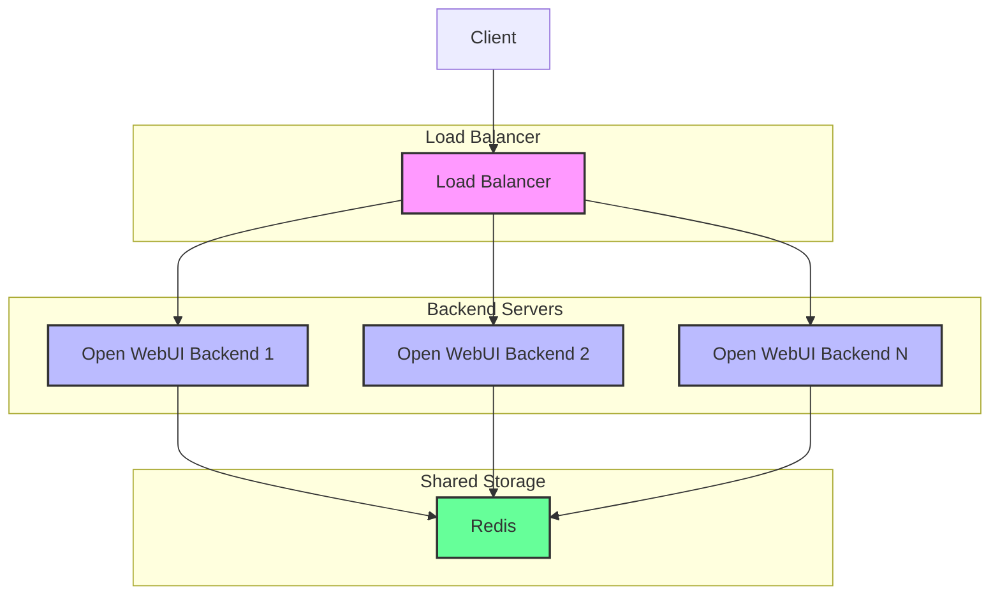

**Diagram sources**
- [socket/main.py](file://backend/open_webui/socket/main.py#L64-L75)
- [main.py](file://backend/open_webui/main.py#L585-L592)

**Section sources**
- [socket/main.py](file://backend/open_webui/socket/main.py#L64-L75)

## OpenAI-Compatible API Integration
The open-webui application provides an OpenAI-compatible API that allows clients to use OpenAI API calls while leveraging Ollama or other AI services as the backend.

### API Compatibility
The application implements compatibility with the OpenAI API specification, supporting key endpoints:

**Chat Completions**:
- `/openai/chat/completions` - Compatible with OpenAI's chat completions API
- Supports streaming responses with Server-Sent Events
- Handles message formatting and role definitions

**Embeddings**:
- `/openai/embeddings` - Compatible with OpenAI's embeddings API
- Converts requests and responses between formats

**Audio**:
- `/openai/audio/speech` - Text-to-speech functionality
- Audio file generation and caching

The compatibility layer translates OpenAI API requests to the appropriate format for the underlying AI service (typically Ollama) and converts responses back to the OpenAI format.

### Request Translation
The application performs several translations between OpenAI and Ollama formats:

**Request Translation**:
- **Model Names**: Maps OpenAI model names to Ollama model names
- **Parameters**: Converts OpenAI-specific parameters to Ollama equivalents
- **Message Format**: Transforms message structure between formats
- **Options**: Maps OpenAI options to Ollama options

**Response Translation**:
- **Message Format**: Converts Ollama response format to OpenAI format
- **Usage Information**: Transforms usage statistics
- **Streaming Format**: Adapts streaming responses to OpenAI SSE format
- **Error Messages**: Standardizes error messages

The translation logic is implemented in `payload.py` and `response.py`, with functions to convert between OpenAI and Ollama formats.

### Configuration
The OpenAI API integration is configured through environment variables:

- **ENABLE_OPENAI_API**: Enables or disables the OpenAI-compatible API
- **OPENAI_API_BASE_URLS**: URLs of OpenAI-compatible services
- **OPENAI_API_KEYS**: API keys for authentication with external services
- **OPENAI_API_CONFIGS**: Additional configuration for each API endpoint

Administrators can configure multiple OpenAI-compatible services and manage their settings through the API.

### Common Integration Issues
Common issues with OpenAI-compatible API integration include:

**Authentication Issues**:
- **Invalid API Keys**: Incorrect or missing API keys
- **Permission Errors**: Insufficient permissions for API access
- **Token Expiration**: Expired authentication tokens

**Compatibility Issues**:
- **Unsupported Features**: OpenAI features not supported by the backend service
- **Parameter Mismatches**: Parameters not correctly translated
- **Format Differences**: Response format differences

**Performance Issues**:
- **Latency**: High latency in API responses
- **Timeouts**: Requests timing out
- **Rate Limiting**: Hitting rate limits on external services

### Troubleshooting Integration Issues
To troubleshoot OpenAI-compatible API issues:

1. **Verify Configuration**: Check environment variables and API settings
2. **Test Connectivity**: Ensure the backend service is accessible
3. **Check Authentication**: Verify API keys and authentication settings
4. **Examine Request/Response**: Compare actual requests and responses with expected formats
5. **Review Logs**: Check application logs for error messages

The application provides a verification endpoint (`/openai/verify`) to test connections to OpenAI-compatible services.

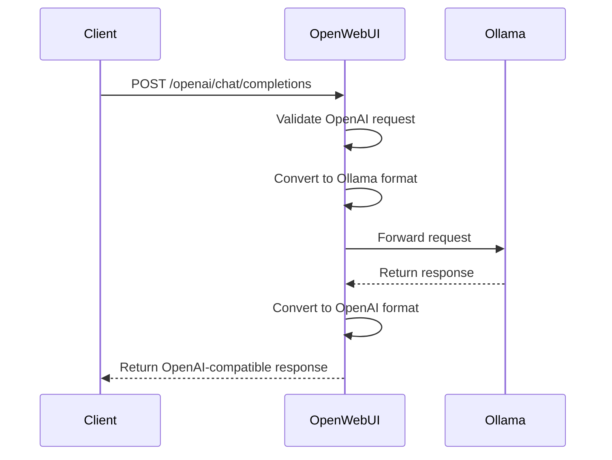

**Diagram sources**
- [openai.py](file://backend/open_webui/routers/openai.py#L212-L800)
- [payload.py](file://backend/open_webui/utils/payload.py#L198-L391)
- [response.py](file://backend/open_webui/utils/response.py#L82-L119)

**Section sources**
- [openai.py](file://backend/open_webui/routers/openai.py#L212-L800)

## Ollama Integration Issues
Ollama integration is a core feature of the open-webui application, enabling local AI model hosting and inference.

### Ollama Configuration
The application connects to Ollama services through configurable endpoints:

- **OLLAMA_BASE_URLS**: URLs of Ollama servers
- **OLLAMA_API_CONFIGS**: Configuration for each Ollama endpoint
- **ENABLE_OLLAMA_API**: Enables or disables Ollama API integration

The application can connect to multiple Ollama instances, allowing for load balancing and redundancy.

### Common Ollama Issues
Common issues with Ollama integration include:

**Connection Issues**:
- **Network Connectivity**: Unable to reach the Ollama server
- **Authentication**: Authentication failures with Ollama
- **Firewall Rules**: Network restrictions blocking access

**Model Issues**:
- **Model Not Found**: Requested model not available on the Ollama server
- **Model Loading**: Issues loading models into memory
- **Model Compatibility**: Incompatible model formats

**Performance Issues**:
- **Slow Responses**: Long response times from Ollama
- **Resource Exhaustion**: Ollama server running out of memory or other resources
- **Timeouts**: Requests timing out

### Troubleshooting Ollama Issues
To troubleshoot Ollama integration issues:

1. **Verify Ollama Server**: Ensure the Ollama server is running and accessible
2. **Check Network Connectivity**: Verify network connectivity between open-webui and Ollama
3. **Test Ollama API**: Use curl or similar tools to test the Ollama API directly
4. **Check Model Availability**: Verify the requested model is available on the Ollama server
5. **Review Logs**: Check both open-webui and Ollama logs for error messages

The application provides several endpoints for managing Ollama integration, including model listing, pulling, and unloading.

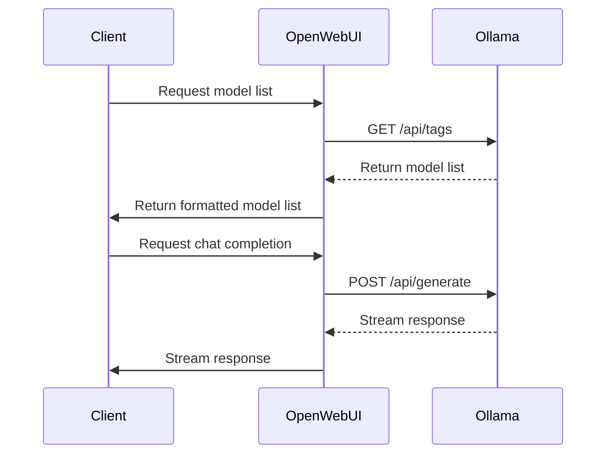

**Diagram sources**
- [ollama.py](file://backend/open_webui/routers/ollama.py#L210-L800)
- [TROUBLESHOOTING.md](file://TROUBLESHOOTING.md#L11-L19)

**Section sources**
- [ollama.py](file://backend/open_webui/routers/ollama.py#L210-L800)

## Third-Party Service Connections
The open-webui application supports connections to various third-party services for enhanced functionality.

### Supported Services
The application can integrate with several third-party services:

**AI Services**:
- **OpenAI**: Cloud-based AI models
- **Azure OpenAI**: Microsoft's AI service
- **Google Gemini**: Google's AI platform

**Search Services**:
- **Tavily**: AI-powered search
- **Perplexity**: Research-focused search
- **Serper**: Google search API
- **SerpAPI**: Search engine results API

**Authentication Services**:
- **OAuth Providers**: Google, GitHub, and other OAuth services
- **LDAP**: Enterprise directory integration

**Storage Services**:
- **Google Drive**: Cloud storage integration
- **OneDrive**: Microsoft cloud storage

### Configuration
Third-party service connections are configured through environment variables and API settings:

- **API Keys**: Authentication credentials for external services
- **Base URLs**: Endpoints for external services
- **Configuration Options**: Service-specific settings

The application provides a secure way to manage API keys and other sensitive credentials.

### Common Connection Issues
Common issues with third-party service connections include:

**Authentication Issues**:
- **Invalid Credentials**: Incorrect API keys or tokens
- **Permission Errors**: Insufficient permissions for API access
- **Token Expiration**: Expired authentication tokens

**Network Issues**:
- **Connectivity Problems**: Unable to reach the external service
- **Firewall Restrictions**: Network policies blocking access
- **DNS Issues**: Domain name resolution problems

**Rate Limiting**:
- **API Limits**: Hitting rate limits on external services
- **Quota Exceeded**: Exceeding usage quotas
- **Throttling**: Requests being throttled by the service

### Troubleshooting Third-Party Connections
To troubleshoot third-party service connection issues:

1. **Verify Credentials**: Check that API keys and other credentials are correct
2. **Test Connectivity**: Ensure the external service is accessible from the server
3. **Check Rate Limits**: Verify that rate limits have not been exceeded
4. **Review Documentation**: Consult the external service's documentation for requirements
5. **Examine Logs**: Check application logs for error messages related to the service

The application provides verification endpoints for testing connections to third-party services.

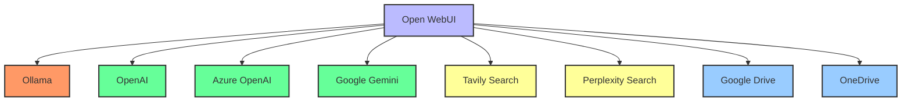

**Diagram sources**
- [retrieval/web/utils.py](file://backend/open_webui/retrieval/web/utils.py#L221-L236)
- [retrieval/web/](file://backend/open_webui/retrieval/web/)
- [env.py](file://backend/open_webui/env.py)

**Section sources**
- [retrieval/web/utils.py](file://backend/open_webui/retrieval/web/utils.py#L221-L236)

## Common HTTP Status Codes
Understanding HTTP status codes is essential for diagnosing API connectivity issues in the open-webui application.

### Success Codes (2xx)
- **200 OK**: Request successful - used for most successful GET, PUT, and DELETE requests
- **201 Created**: Resource created successfully - used for successful POST requests
- **204 No Content**: Request successful but no content to return - used for successful DELETE requests
- **206 Partial Content**: Partial content returned - used for range requests

### Client Error Codes (4xx)
- **400 Bad Request**: Invalid request parameters or body
- **401 Unauthorized**: Authentication required or failed
- **403 Forbidden**: Insufficient permissions for the requested resource
- **404 Not Found**: Requested resource not found
- **405 Method Not Allowed**: HTTP method not supported for the endpoint
- **409 Conflict**: Request conflicts with current state
- **413 Payload Too Large**: Request payload exceeds limits
- **429 Too Many Requests**: Rate limit exceeded

### Server Error Codes (5xx)
- **500 Internal Server Error**: Generic server error
- **501 Not Implemented**: Feature not implemented
- **502 Bad Gateway**: Error communicating with upstream service
- **503 Service Unavailable**: Service temporarily unavailable
- **504 Gateway Timeout**: Timeout communicating with upstream service

### Specific Error Messages
The application defines specific error messages for common scenarios:

- **RATE_LIMIT_EXCEEDED**: "API rate limit exceeded"
- **UNAUTHORIZED**: "401 Unauthorized"
- **ACCESS_PROHIBITED**: "You do not have permission to access this resource"
- **OLLAMA_NOT_FOUND**: "WebUI could not connect to Ollama"
- **OPENAI_NOT_FOUND**: "OpenAI API was not found"
- **MODEL_NOT_FOUND**: "Model '{name}' was not found"

These error messages are defined in the `ERROR_MESSAGES` enum in `constants.py` and provide user-friendly descriptions of common error conditions.

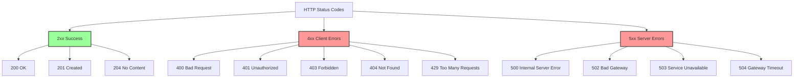

**Diagram sources**
- [constants.py](file://backend/open_webui/constants.py#L55-L75)
- [main.py](file://backend/open_webui/main.py#L27-L38)

**Section sources**
- [constants.py](file://backend/open_webui/constants.py#L55-L75)

## Troubleshooting Guide
This section provides a comprehensive troubleshooting guide for common API connectivity issues in the open-webui application.

### General Troubleshooting Steps
When experiencing API connectivity issues, follow these general steps:

1. **Check Application Logs**: Examine the application logs for error messages and warnings
2. **Verify Configuration**: Ensure all environment variables and settings are correctly configured
3. **Test Network Connectivity**: Verify that all required services are accessible
4. **Check Authentication**: Ensure authentication credentials are correct and not expired
5. **Review Error Messages**: Carefully read error messages for clues about the issue

### Specific Issue Resolution
For specific types of issues, use the following approaches:

**Failed API Requests**:
- Verify the API endpoint URL is correct
- Check that required headers (e.g., Authorization) are included
- Ensure the request body is properly formatted
- Test the endpoint with a simple request (e.g., GET)
- Check server logs for error details

**WebSocket Connection Problems**:
- Verify the WebSocket URL is correct
- Check that the proxy (if used) supports WebSocket connections
- Ensure SSL/TLS configuration is correct for WebSocket connections
- Test WebSocket connectivity directly (without the application)
- Check browser console for JavaScript errors

**CORS-Related Errors**:
- Verify the `CORS_ALLOW_ORIGIN` environment variable is correctly set
- Check that the request origin matches the allowed origins
- Ensure the proxy (if used) is not modifying CORS headers
- Test with different origins to isolate the issue
- Check browser console for CORS error details

**Reverse Proxy Configuration Issues**:
- Verify the proxy configuration includes all required directives
- Ensure WebSocket connections are properly configured
- Check that SSL/TLS termination is correctly set up
- Test connectivity between the proxy and backend
- Review proxy logs for errors

**SSL/TLS Termination Issues**:
- Verify SSL certificates are valid and not expired
- Check that the certificate chain is complete
- Ensure HSTS headers are correctly configured
- Test with SSL validation tools
- Check for mixed content issues

**Load Balancer Settings Issues**:
- Verify sticky sessions are configured for WebSocket traffic
- Check health check configuration and intervals
- Ensure session storage is shared across backend instances
- Monitor load distribution across servers
- Review load balancer logs for errors

**OpenAI-Compatible API Issues**:
- Verify the OpenAI API is enabled in the configuration
- Check that API keys are correctly configured
- Ensure model names are correctly mapped
- Test the OpenAI compatibility layer with simple requests
- Check translation logs for format conversion issues

**Ollama Integration Issues**:
- Verify the Ollama server is running and accessible
- Check that the Ollama API is enabled in the configuration
- Ensure model names are correct and available
- Test Ollama connectivity directly
- Check Ollama server logs for errors

**Third-Party Service Connection Issues**:
- Verify API keys and credentials are correct
- Check that the service URL is accessible
- Ensure rate limits have not been exceeded
- Test the connection with direct API calls
- Review service-specific documentation for requirements

### Diagnostic Tools
The application provides several diagnostic tools:

- **Health Check Endpoint**: `/` returns status information
- **Version Endpoint**: `/version` returns application version
- **Configuration Endpoint**: `/config` returns current configuration
- **Verification Endpoints**: `/verify` endpoints test connections to external services
- **Logging**: Comprehensive logs for diagnosis

Use these tools to gather information about the application's state and connectivity.

**Section sources**
- [TROUBLESHOOTING.md](file://TROUBLESHOOTING.md#L1-L37)
- [main.py](file://backend/open_webui/main.py#L215-L216)
- [ollama.py](file://backend/open_webui/routers/ollama.py#L224-L227)
- [openai.py](file://backend/open_webui/routers/openai.py#L215-L217)

## Conclusion
This document has provided comprehensive guidance on diagnosing and resolving API connectivity issues in the open-webui application. We've covered the API endpoint structure, request/response patterns, and error handling mechanisms. We've also addressed specific issues related to WebSocket connections, CORS, reverse proxy configurations, SSL/TLS termination, and load balancer settings.

The document detailed integration with the OpenAI-compatible API, Ollama, and various third-party services, providing troubleshooting steps for common issues. We've also explained the meaning of common HTTP status codes in the context of this application.

By following the troubleshooting guide and understanding the application's architecture and configuration, users and administrators can effectively diagnose and resolve connectivity issues. The open-webui application is designed with robust error handling and diagnostic capabilities to facilitate maintenance and support.

For ongoing issues or additional assistance, consult the application logs, documentation, and community resources. Regularly updating to the latest version of the application and its dependencies can also help prevent and resolve connectivity issues.