# External Service Connectivity

<cite>
**Referenced Files in This Document**   
- [ollama.py](file://backend/open_webui/retrieval/web/ollama.py)
- [ollama.py](file://backend/open_webui/routers/ollama.py)
- [openai.py](file://backend/open_webui/routers/openai.py)
- [main.py](file://backend/open_webui/retrieval/web/main.py)
- [utils.py](file://backend/open_webui/retrieval/web/utils.py)
- [env.py](file://backend/open_webui/env.py)
- [config.py](file://backend/open_webui/config.py)
- [constants.py](file://backend/open_webui/constants.py)
</cite>

## Table of Contents
1. [Introduction](#introduction)
2. [API Client Implementations](#api-client-implementations)
3. [Request/Response Transformation Patterns](#requestresponse-transformation-patterns)
4. [Error Handling Strategies](#error-handling-strategies)
5. [Troubleshooting Guide](#troubleshooting-guide)
6. [Configuration Requirements](#configuration-requirements)
7. [Service-Specific Integration Details](#service-specific-integration-details)

## Introduction
This document provides comprehensive guidance on diagnosing and resolving connectivity issues with external services in Open WebUI, specifically focusing on Ollama, OpenAI, and web search integrations. It covers the architecture of API client implementations, request/response transformation patterns, error handling strategies, and configuration requirements for service endpoints, timeout settings, and SSL/TLS certificate validation. The document includes troubleshooting steps for common issues such as network connectivity problems, API key validation failures, rate limiting, and service-specific error responses.

## API Client Implementations

Open WebUI implements robust API client patterns for external service connectivity using both synchronous and asynchronous HTTP clients. The system primarily utilizes `aiohttp` for asynchronous operations and `requests` for synchronous operations, providing flexibility for different use cases.

For Ollama integration, the `send_post_request` function in `ollama.py` serves as the primary interface for making API calls. This function handles authentication, headers, and response processing with comprehensive error handling:

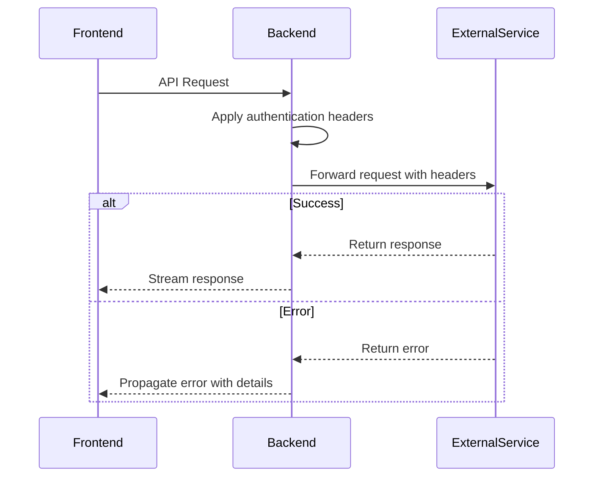
```mermaid
sequenceDiagram
participant Frontend
participant Backend
participant ExternalService
Frontend->>Backend : API Request
Backend->>Backend : Apply authentication headers
Backend->>ExternalService : Forward request with headers
alt Success
ExternalService-->>Backend : Return response
Backend-->>Frontend : Stream response
else Error
ExternalService-->>Backend : Return error
Backend-->>Frontend : Propagate error with details
end
```

**Diagram sources**
- [ollama.py](file://backend/open_webui/routers/ollama.py#L115-L190)
- [openai.py](file://backend/open_webui/routers/openai.py#L105-L184)

For OpenAI integration, the `get_headers_and_cookies` function in `openai.py` manages authentication headers and cookies, supporting various authentication types including bearer tokens, session-based authentication, and OAuth:

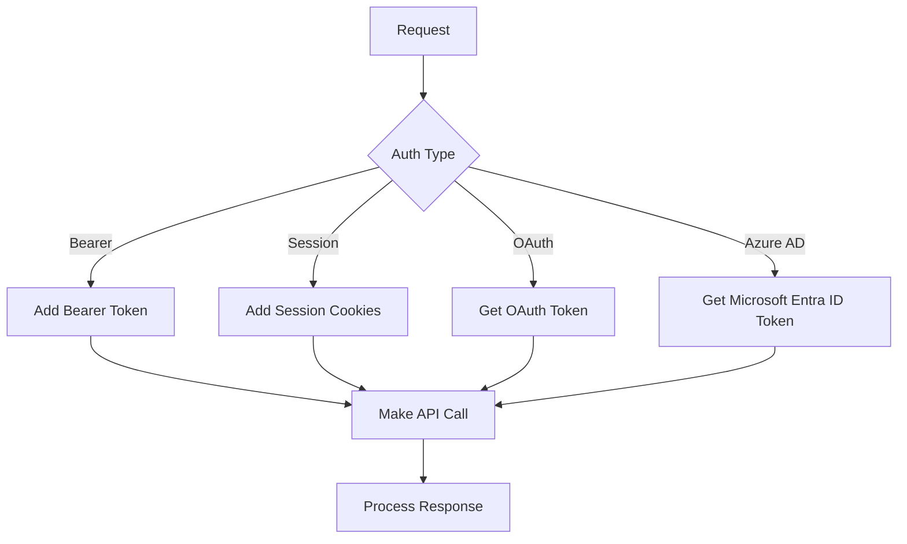
```mermaid
flowchart TD
A[Request] --> B{Auth Type}
B --> |Bearer| C[Add Bearer Token]
B --> |Session| D[Add Session Cookies]
B --> |OAuth| E[Get OAuth Token]
B --> |Azure AD| F[Get Microsoft Entra ID Token]
C --> G[Make API Call]
D --> G
E --> G
F --> G
G --> H[Process Response]
```

**Diagram sources**
- [openai.py](file://backend/open_webui/routers/openai.py#L126-L188)

**Section sources**
- [ollama.py](file://backend/open_webui/routers/ollama.py#L81-L193)
- [openai.py](file://backend/open_webui/routers/openai.py#L72-L189)

## Request/Response Transformation Patterns

Open WebUI implements sophisticated request/response transformation patterns to ensure compatibility between the frontend and various external services. These transformations handle parameter mapping, content type conversion, and service-specific requirements.

For Ollama services, the system transforms requests by applying model parameters and system prompts through utility functions like `apply_model_params_to_body_ollama` and `apply_system_prompt_to_body`. The response handling includes proper status code propagation and error message formatting:

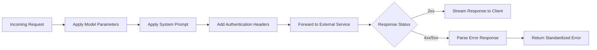
```mermaid
flowchart LR
A[Incoming Request] --> B[Apply Model Parameters]
B --> C[Apply System Prompt]
C --> D[Add Authentication Headers]
D --> E[Forward to External Service]
E --> F{Response Status}
F --> |2xx| G[Stream Response to Client]
F --> |4xx/5xx| H[Parse Error Response]
H --> I[Return Standardized Error]
```

**Diagram sources**
- [ollama.py](file://backend/open_webui/routers/ollama.py#L48-L51)
- [openai.py](file://backend/open_webui/routers/openai.py#L41-L44)

For OpenAI services, additional transformation logic handles reasoning models and Azure-specific requirements. The `openai_reasoning_model_handler` function converts parameters for reasoning models, while `convert_to_azure_payload` adapts requests for Azure OpenAI API compatibility:

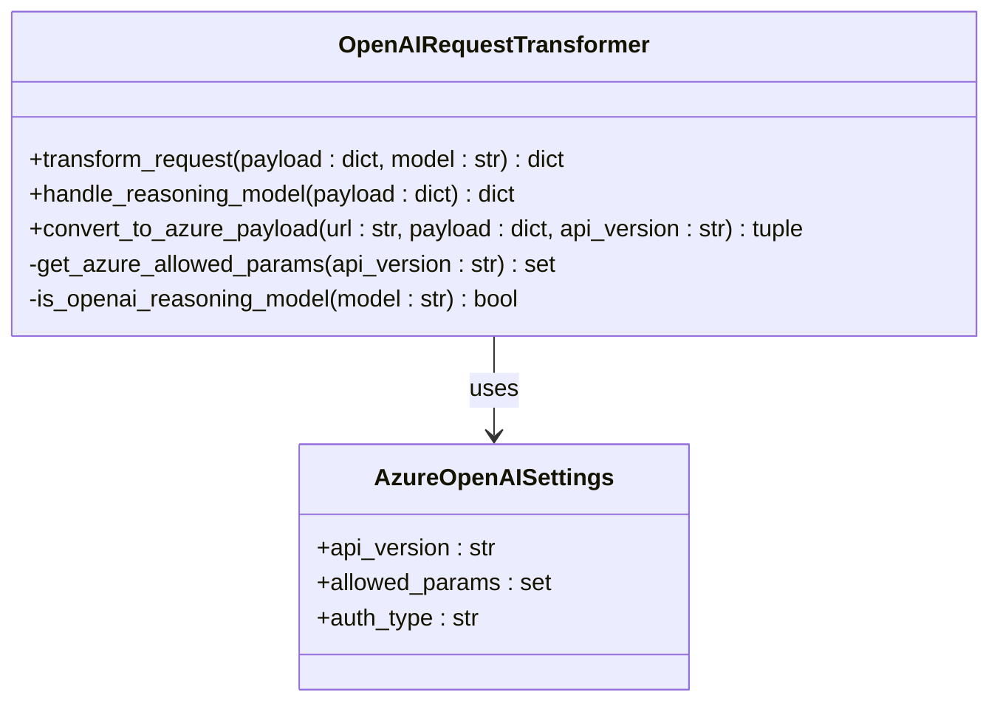
```mermaid
classDiagram
class OpenAIRequestTransformer {
+transform_request(payload : dict, model : str) dict
+handle_reasoning_model(payload : dict) dict
+convert_to_azure_payload(url : str, payload : dict, api_version : str) tuple
-get_azure_allowed_params(api_version : str) set
-is_openai_reasoning_model(model : str) bool
}
class AzureOpenAISettings {
+api_version : str
+allowed_params : set
+auth_type : str
}
OpenAIRequestTransformer --> AzureOpenAISettings : uses
```

**Diagram sources**
- [openai.py](file://backend/open_webui/routers/openai.py#L105-L204)
- [openai.py](file://backend/open_webui/routers/openai.py#L729-L780)

The web search integration uses a modular approach with different loader classes for various search providers. The `get_web_loader` function selects the appropriate loader based on configuration:

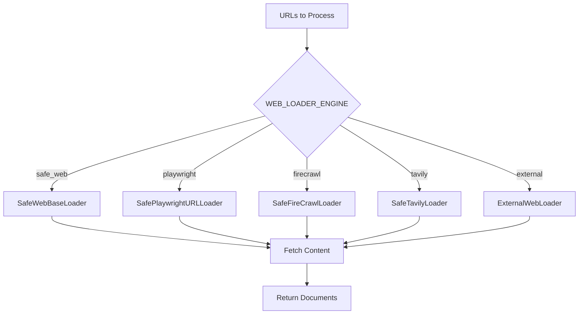
```mermaid
flowchart TD
A[URLs to Process] --> B{WEB_LOADER_ENGINE}
B --> |safe_web| C[SafeWebBaseLoader]
B --> |playwright| D[SafePlaywrightURLLoader]
B --> |firecrawl| E[SafeFireCrawlLoader]
B --> |tavily| F[SafeTavilyLoader]
B --> |external| G[ExternalWebLoader]
C --> H[Fetch Content]
D --> H
E --> H
F --> H
G --> H
H --> I[Return Documents]
```

**Diagram sources**
- [utils.py](file://backend/open_webui/retrieval/web/utils.py#L654-L712)

**Section sources**
- [openai.py](file://backend/open_webui/routers/openai.py#L105-L204)
- [utils.py](file://backend/open_webui/retrieval/web/utils.py#L654-L712)

## Error Handling Strategies

Open WebUI implements comprehensive error handling strategies to provide meaningful feedback to users while maintaining system stability. The error handling spans multiple layers from network connectivity to service-specific responses.

The system uses a layered exception handling approach where low-level network errors are caught and transformed into meaningful HTTP exceptions. In `ollama.py`, the `send_post_request` function demonstrates this pattern:

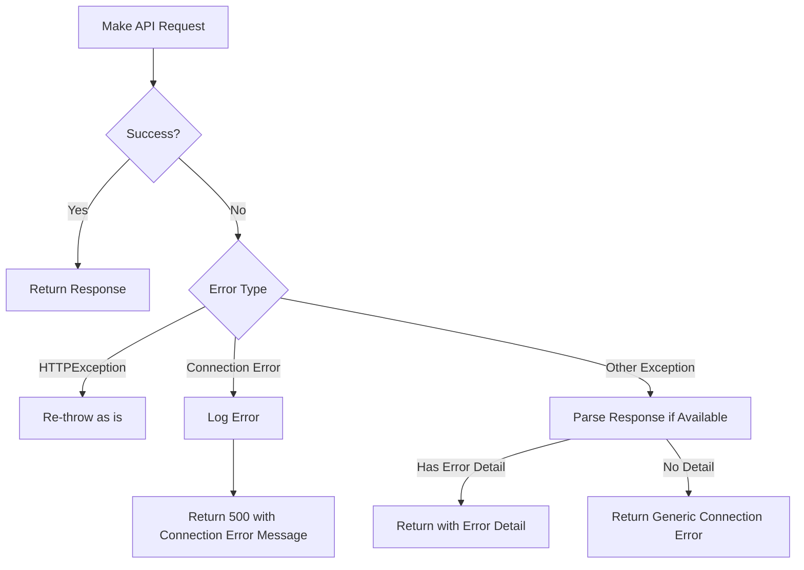
```mermaid
flowchart TD
A[Make API Request] --> B{Success?}
B --> |Yes| C[Return Response]
B --> |No| D{Error Type}
D --> |HTTPException| E[Re-throw as is]
D --> |Connection Error| F[Log Error]
F --> G[Return 500 with Connection Error Message]
D --> |Other Exception| H[Parse Response if Available]
H --> |Has Error Detail| I[Return with Error Detail]
H --> |No Detail| J[Return Generic Connection Error]
```

**Diagram sources**
- [ollama.py](file://backend/open_webui/routers/ollama.py#L115-L190)

For web search operations, the system implements safety checks and validation before processing URLs. The `validate_url` function in `utils.py` performs multiple validation steps:

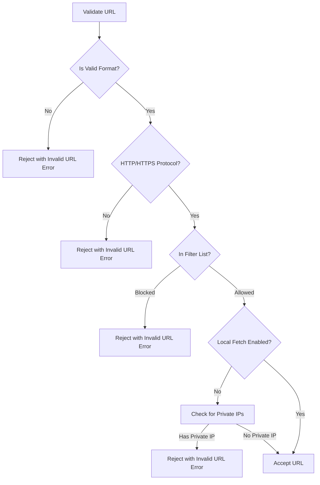
```mermaid
flowchart TD
A[Validate URL] --> B{Is Valid Format?}
B --> |No| C[Reject with Invalid URL Error]
B --> |Yes| D{HTTP/HTTPS Protocol?}
D --> |No| E[Reject with Invalid URL Error]
D --> |Yes| F{In Filter List?}
F --> |Blocked| G[Reject with Invalid URL Error]
F --> |Allowed| H{Local Fetch Enabled?}
H --> |No| I[Check for Private IPs]
I --> |Has Private IP| J[Reject with Invalid URL Error]
I --> |No Private IP| K[Accept URL]
H --> |Yes| K
```

**Diagram sources**
- [utils.py](file://backend/open_webui/retrieval/web/utils.py#L62-L95)

The error propagation to the frontend follows a standardized pattern using the `ERROR_MESSAGES` enum in `constants.py`. This ensures consistent error messaging across the application:

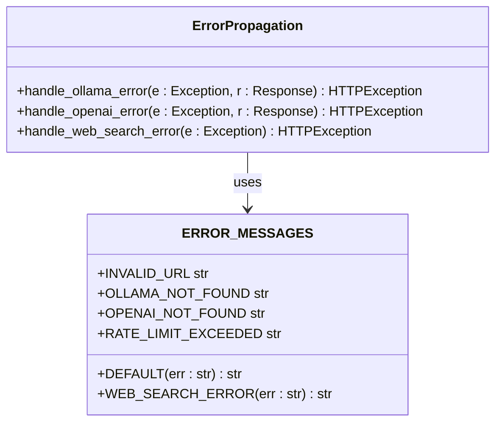
```mermaid
classDiagram
class ERROR_MESSAGES {
+DEFAULT(err : str) str
+INVALID_URL str
+WEB_SEARCH_ERROR(err : str) str
+OLLAMA_NOT_FOUND str
+OPENAI_NOT_FOUND str
+RATE_LIMIT_EXCEEDED str
}
class ErrorPropagation {
+handle_ollama_error(e : Exception, r : Response) HTTPException
+handle_openai_error(e : Exception, r : Response) HTTPException
+handle_web_search_error(e : Exception) HTTPException
}
ErrorPropagation --> ERROR_MESSAGES : uses
```

**Diagram sources**
- [constants.py](file://backend/open_webui/constants.py#L19-L94)
- [ollama.py](file://backend/open_webui/routers/ollama.py#L490-L484)
- [openai.py](file://backend/open_webui/routers/openai.py#L330-L345)

**Section sources**
- [ollama.py](file://backend/open_webui/routers/ollama.py#L115-L190)
- [openai.py](file://backend/open_webui/routers/openai.py#L307-L345)
- [utils.py](file://backend/open_webui/retrieval/web/utils.py#L62-L95)
- [constants.py](file://backend/open_webui/constants.py#L19-L94)

## Troubleshooting Guide

This section provides step-by-step troubleshooting guidance for common external service connectivity issues in Open WebUI.

### Network Connectivity Issues
When experiencing network connectivity problems, follow these steps:

1. **Verify service availability**: Use the `/verify` endpoint to test connectivity to external services
2. **Check network configuration**: Ensure that firewalls and network policies allow outbound connections
3. **Test DNS resolution**: Verify that service endpoints can be resolved properly
4. **Validate SSL/TLS certificates**: Ensure certificates are valid and trusted

The system provides built-in connectivity verification through the `verify_connection` endpoints in both `ollama.py` and `openai.py`:

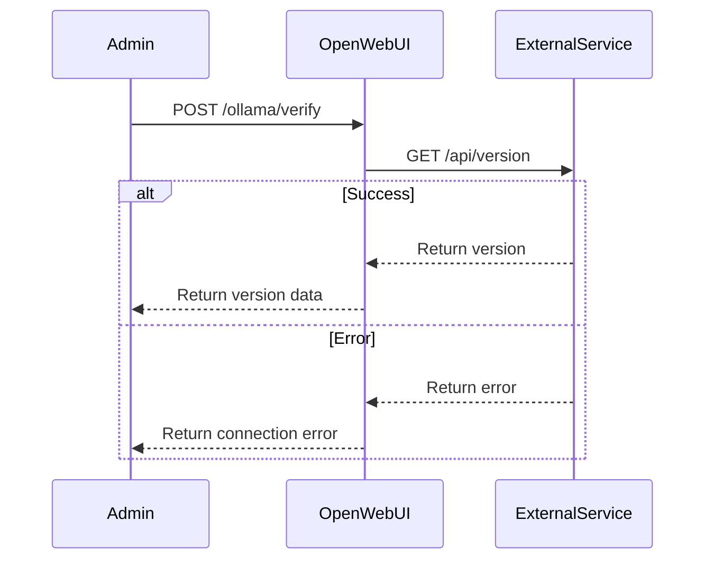
```mermaid
sequenceDiagram
participant Admin
participant OpenWebUI
participant ExternalService
Admin->>OpenWebUI : POST /ollama/verify
OpenWebUI->>ExternalService : GET /api/version
alt Success
ExternalService-->>OpenWebUI : Return version
OpenWebUI-->>Admin : Return version data
else Error
ExternalService-->>OpenWebUI : Return error
OpenWebUI-->>Admin : Return connection error
end
```

**Diagram sources**
- [ollama.py](file://backend/open_webui/routers/ollama.py#L224-L266)
- [openai.py](file://backend/open_webui/routers/openai.py#L643-L727)

### API Key Validation
For API key validation issues, verify the following:

1. **Key format**: Ensure the API key matches the expected format for the service
2. **Key permissions**: Verify the key has the necessary permissions for the requested operations
3. **Key configuration**: Check that the key is properly configured in the system settings
4. **Key expiration**: Confirm the key has not expired

The system handles API key validation through configuration-specific logic in both routers:

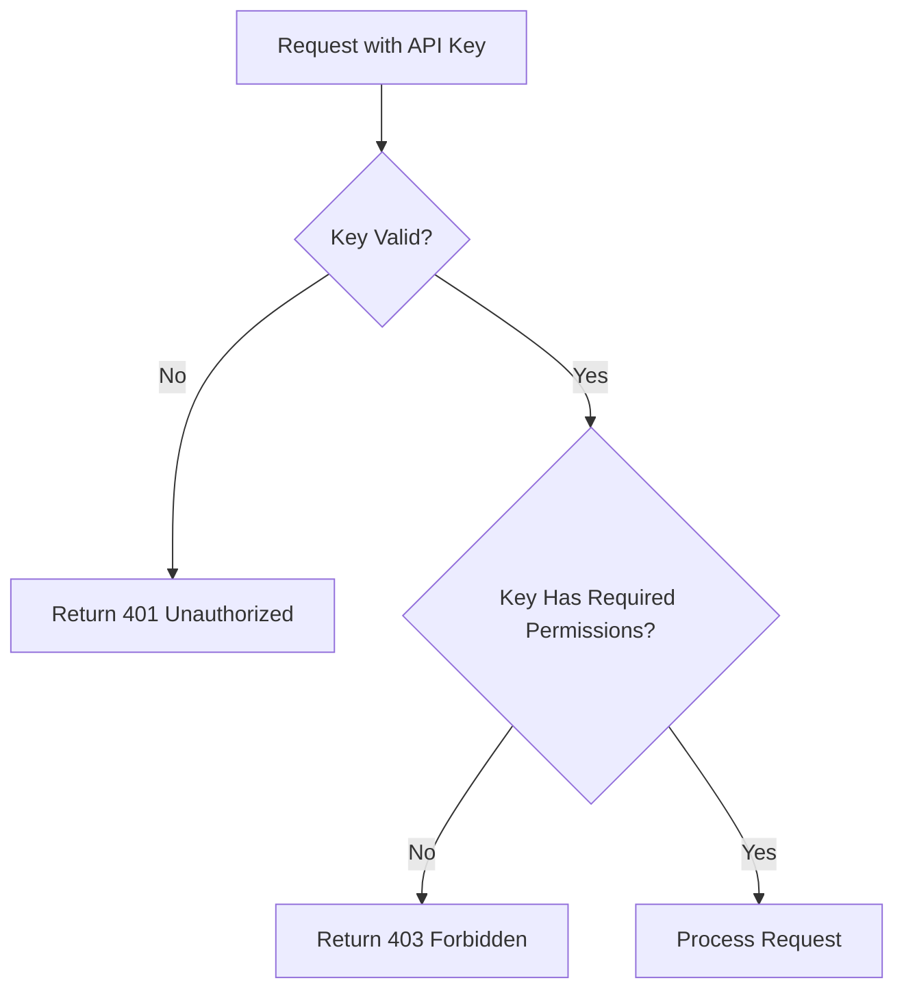
```mermaid
flowchart TD
A[Request with API Key] --> B{Key Valid?}
B --> |No| C[Return 401 Unauthorized]
B --> |Yes| D{Key Has Required Permissions?}
D --> |No| E[Return 403 Forbidden]
D --> |Yes| F[Process Request]
```

**Diagram sources**
- [ollama.py](file://backend/open_webui/routers/ollama.py#L87-L88)
- [openai.py](file://backend/open_webui/routers/openai.py#L77-L78)

### Rate Limiting
When encountering rate limiting issues:

1. **Check rate limit headers**: Examine response headers for rate limit information
2. **Implement retry logic**: Use exponential backoff for retry attempts
3. **Monitor usage**: Track API usage to stay within limits
4. **Request higher limits**: Contact service providers for increased quotas if needed

The system implements rate limiting awareness through response handling:

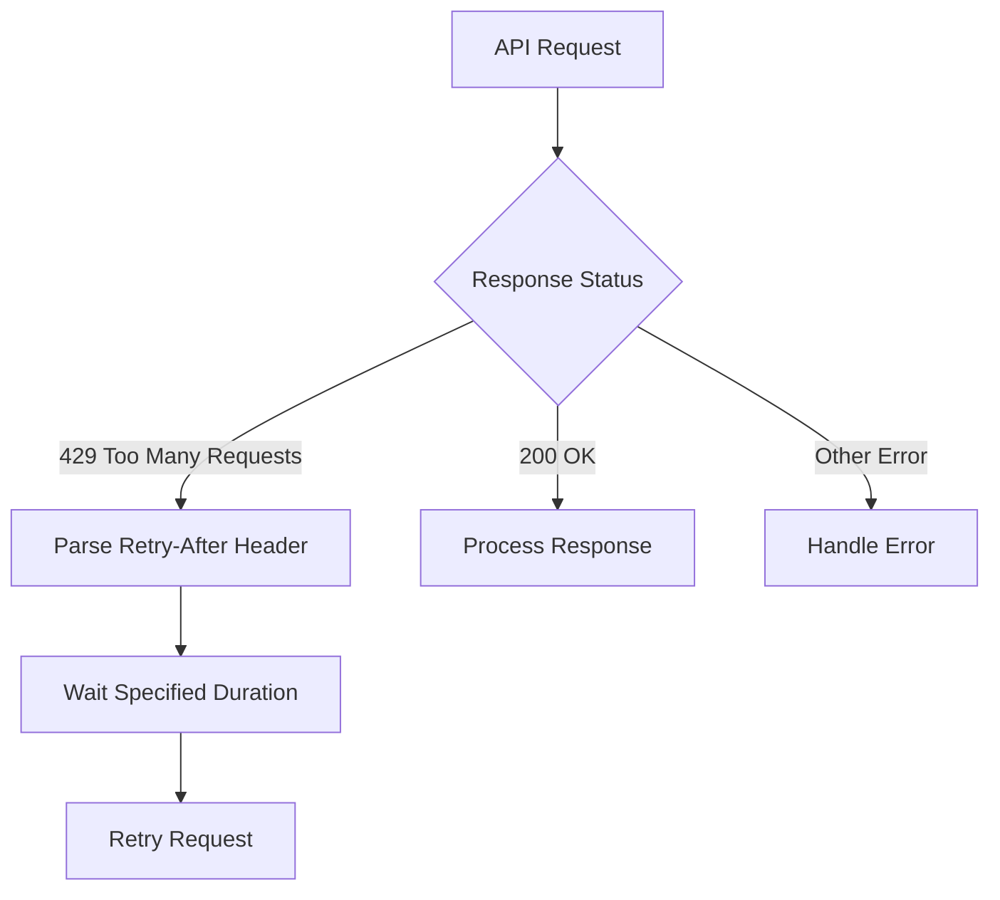
```mermaid
flowchart TD
A[API Request] --> B{Response Status}
B --> |429 Too Many Requests| C[Parse Retry-After Header]
C --> D[Wait Specified Duration]
D --> E[Retry Request]
B --> |200 OK| F[Process Response]
B --> |Other Error| G[Handle Error]
```

**Diagram sources**
- [ollama.py](file://backend/open_webui/routers/ollama.py#L148-L153)
- [openai.py](file://backend/open_webui/routers/openai.py#L590-L595)

### Service-Specific Error Responses
Different services return unique error responses that require specific handling:

- **Ollama**: Returns structured JSON errors with "error" field
- **OpenAI**: Returns detailed error objects with code, message, and type
- **Web Search**: Returns various HTTP status codes with service-specific messages

The error handling code transforms these service-specific responses into consistent application errors:

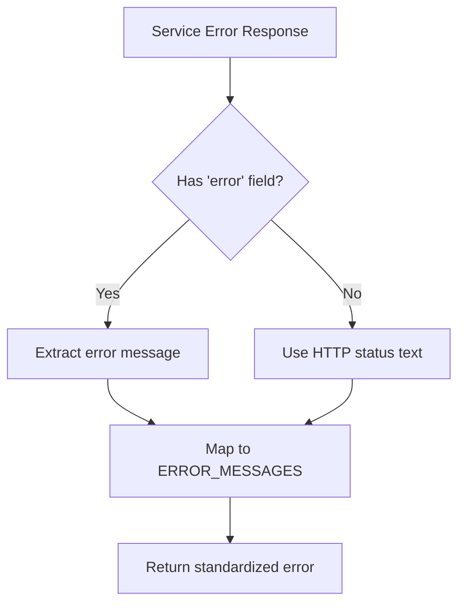
```mermaid
flowchart TD
A[Service Error Response] --> B{Has 'error' field?}
B --> |Yes| C[Extract error message]
B --> |No| D[Use HTTP status text]
C --> E[Map to ERROR_MESSAGES]
D --> E
E --> F[Return standardized error]
```

**Diagram sources**
- [ollama.py](file://backend/open_webui/routers/ollama.py#L469-L484)
- [openai.py](file://backend/open_webui/routers/openai.py#L334-L341)

**Section sources**
- [ollama.py](file://backend/open_webui/routers/ollama.py#L224-L266)
- [openai.py](file://backend/open_webui/routers/openai.py#L643-L727)
- [ollama.py](file://backend/open_webui/routers/ollama.py#L87-L88)
- [openai.py](file://backend/open_webui/routers/openai.py#L77-L78)

## Configuration Requirements

Proper configuration is essential for successful external service connectivity in Open WebUI. This section outlines the key configuration requirements for service endpoints, timeout settings, and SSL/TLS certificate validation.

### Service Endpoints
Service endpoints must be configured correctly in the system settings:

- **Ollama**: Configure `OLLAMA_BASE_URLS` and `OLLAMA_API_CONFIGS`
- **OpenAI**: Configure `OPENAI_API_BASE_URLS` and `OPENAI_API_KEYS`
- **Web Search**: Configure `WEB_LOADER_ENGINE` and provider-specific settings

The configuration system uses persistent configuration with Redis caching for performance:

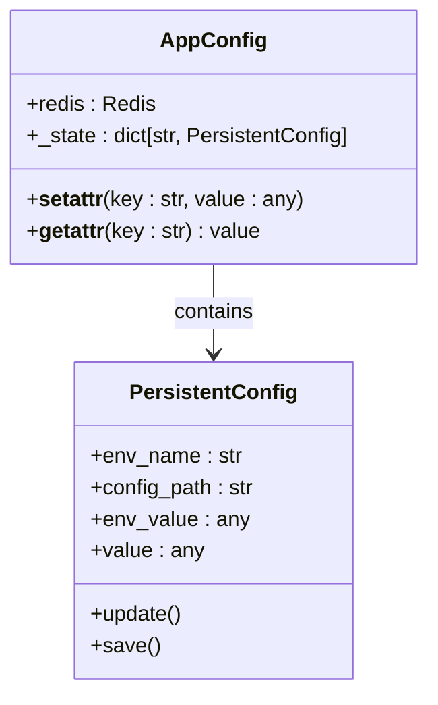
```mermaid
classDiagram
class AppConfig {
+redis : Redis
+_state : dict[str, PersistentConfig]
+__setattr__(key : str, value : any)
+__getattr__(key : str) value
}
class PersistentConfig {
+env_name : str
+config_path : str
+env_value : any
+value : any
+update()
+save()
}
AppConfig --> PersistentConfig : contains
```

**Diagram sources**
- [config.py](file://backend/open_webui/config.py#L224-L284)

### Timeout Settings
Timeout settings are critical for preventing hanging requests and ensuring system responsiveness:

- **AIOHTTP_CLIENT_TIMEOUT**: Global timeout for API requests
- **AIOHTTP_CLIENT_TIMEOUT_MODEL_LIST**: Timeout for model listing requests
- **AIOHTTP_CLIENT_TIMEOUT_TOOL_SERVER_DATA**: Timeout for tool server data

These settings are configured in `env.py` and can be overridden via environment variables:

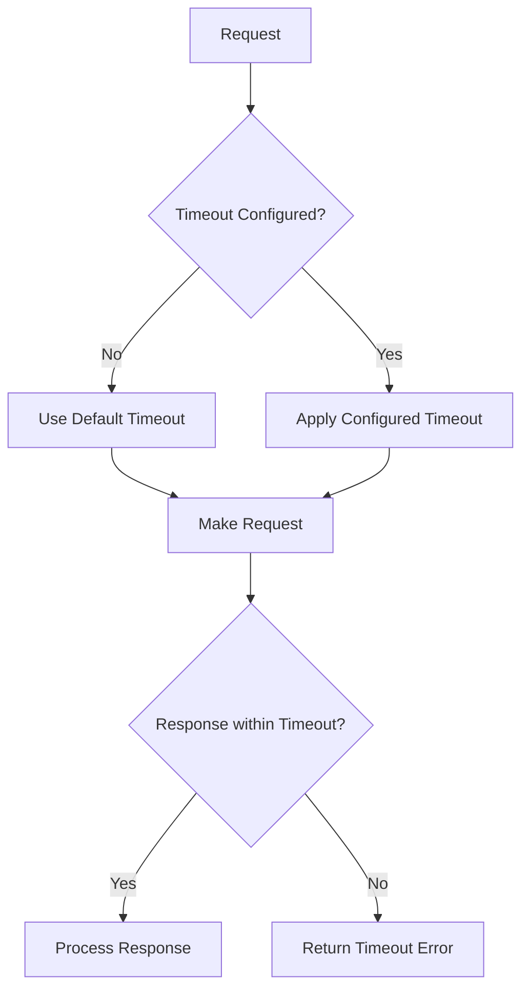
```mermaid
flowchart TD
A[Request] --> B{Timeout Configured?}
B --> |No| C[Use Default Timeout]
B --> |Yes| D[Apply Configured Timeout]
C --> E[Make Request]
D --> E
E --> F{Response within Timeout?}
F --> |Yes| G[Process Response]
F --> |No| H[Return Timeout Error]
```

**Diagram sources**
- [env.py](file://backend/open_webui/env.py#L664-L691)

### SSL/TLS Certificate Validation
SSL/TLS certificate validation ensures secure connections to external services:

- **AIOHTTP_CLIENT_SESSION_SSL**: Enables SSL verification for aiohttp sessions
- **verify_ssl_cert function**: Validates SSL certificates for URLs
- **SafeWebBaseLoader**: Includes SSL verification in web content fetching

The system provides configurable SSL validation with the ability to disable verification for development or testing:

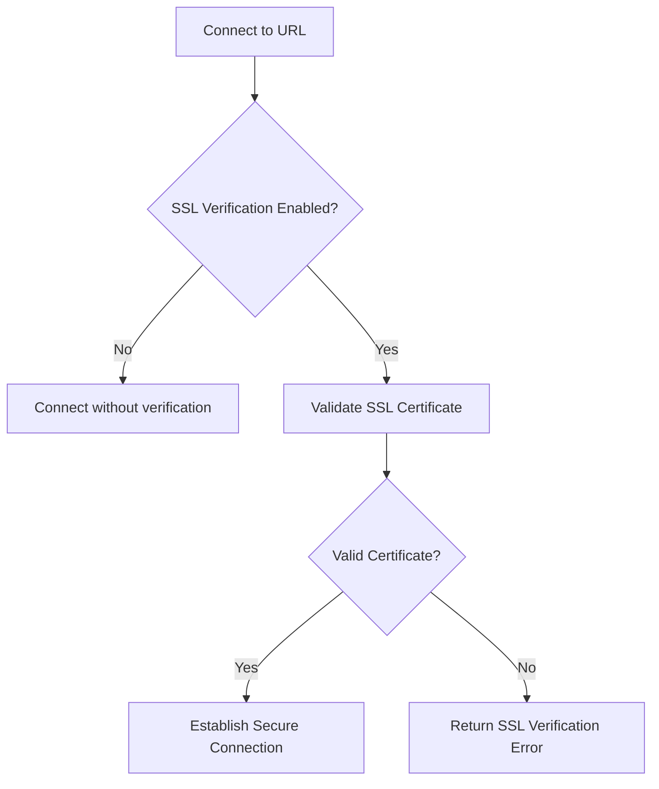
```mermaid
flowchart TD
A[Connect to URL] --> B{SSL Verification Enabled?}
B --> |No| C[Connect without verification]
B --> |Yes| D[Validate SSL Certificate]
D --> E{Valid Certificate?}
E --> |Yes| F[Establish Secure Connection]
E --> |No| G[Return SSL Verification Error]
```

**Diagram sources**
- [env.py](file://backend/open_webui/env.py#L675-L677)
- [utils.py](file://backend/open_webui/retrieval/web/utils.py#L125-L140)

**Section sources**
- [config.py](file://backend/open_webui/config.py#L224-L284)
- [env.py](file://backend/open_webui/env.py#L664-L691)
- [utils.py](file://backend/open_webui/retrieval/web/utils.py#L125-L140)

## Service-Specific Integration Details

This section provides detailed information about the integration patterns for each external service supported by Open WebUI.

### Ollama Integration
The Ollama integration in Open WebUI provides comprehensive support for model management and inference operations. The system supports multiple Ollama instances through the `OLLAMA_BASE_URLS` configuration, enabling load balancing and high availability.

Key features of the Ollama integration include:
- Model listing and filtering through the `/api/tags` endpoint
- Version compatibility checking via the `/api/version` endpoint
- Model loading and unloading management
- Support for multiple authentication configurations

The integration uses a round-robin approach for distributing requests among multiple backend instances, with plans to implement more sophisticated load balancing algorithms:

```mermaid
flowchart TD
A[Client Request] --> B{Multiple Ollama Instances?}
B --> |No| C[Send to Single Instance]
B --> |Yes| D[Select Instance (Round Robin)]
D --> E[Forward Request]
E --> F[Aggregate Responses]
F --> G[Return Unified Response]
```

**Diagram sources**
- [ollama.py](file://backend/open_webui/routers/ollama.py#L308-L356)
- [ollama.py](file://backend/open_webui/routers/ollama.py#L492-L551)

### OpenAI Integration
The OpenAI integration supports both standard OpenAI API and Azure OpenAI Service, with special handling for different model types and authentication methods.

Key features of the OpenAI integration include:
- Support for reasoning models (o1, o3, o4 series)
- Azure OpenAI API compatibility with proper parameter filtering
- Multiple authentication methods (bearer tokens, Azure AD, OAuth)
- Response streaming for chat completions

The system handles reasoning models differently by converting parameters and enforcing model-specific constraints:

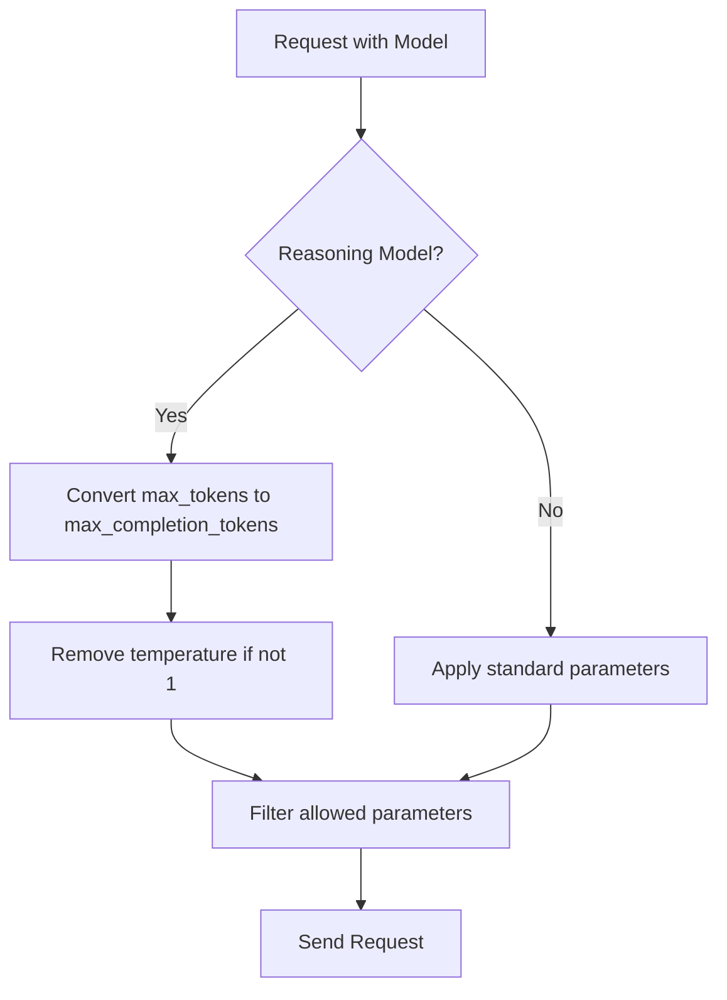
```mermaid
flowchart TD
A[Request with Model] --> B{Reasoning Model?}
B --> |Yes| C[Convert max_tokens to max_completion_tokens]
B --> |No| D[Apply standard parameters]
C --> E[Remove temperature if not 1]
E --> F[Filter allowed parameters]
D --> F
F --> G[Send Request]
```

**Diagram sources**
- [openai.py](file://backend/open_webui/routers/openai.py#L105-L123)
- [openai.py](file://backend/open_webui/routers/openai.py#L775-L797)

### Web Search Integration
The web search integration provides flexible content retrieval from various sources through multiple loader implementations. The system supports different web scraping engines based on the `WEB_LOADER_ENGINE` configuration.

Available web loader engines include:
- **safe_web**: Basic web content fetching with safety checks
- **playwright**: Browser-based scraping with JavaScript rendering
- **firecrawl**: Advanced web crawling and scraping service
- **tavily**: Research-focused web search and content extraction
- **external**: Custom external web loader service

Each loader implements safety features including URL validation, SSL verification, and rate limiting:

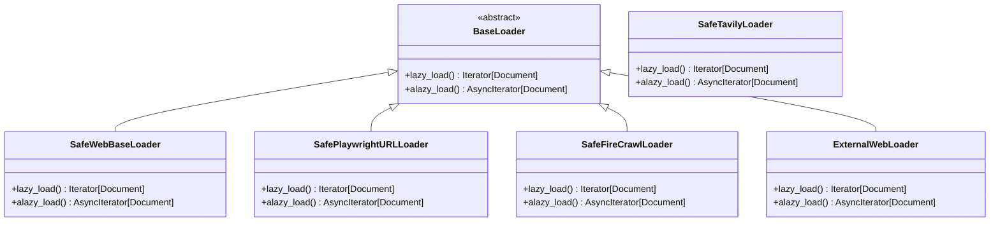
```mermaid
classDiagram
class BaseLoader {
<<abstract>>
+lazy_load() Iterator[Document]
+alazy_load() AsyncIterator[Document]
}
class SafeWebBaseLoader {
+lazy_load() Iterator[Document]
+alazy_load() AsyncIterator[Document]
}
class SafePlaywrightURLLoader {
+lazy_load() Iterator[Document]
+alazy_load() AsyncIterator[Document]
}
class SafeFireCrawlLoader {
+lazy_load() Iterator[Document]
+alazy_load() AsyncIterator[Document]
}
class SafeTavilyLoader {
+lazy_load() Iterator[Document]
+alazy_load() AsyncIterator[Document]
}
class ExternalWebLoader {
+lazy_load() Iterator[Document]
+alazy_load() AsyncIterator[Document]
}
BaseLoader <|-- SafeWebBaseLoader
BaseLoader <|-- SafePlaywrightURLLoader
BaseLoader <|-- SafeFireCrawlLoader
BaseTavilyLoader
BaseLoader <|-- ExternalWebLoader
```

**Diagram sources**
- [utils.py](file://backend/open_webui/retrieval/web/utils.py#L549-L712)
- [main.py](file://backend/open_webui/retrieval/web/main.py#L43-L47)

The Ollama web search implementation specifically uses the Ollama Search API to retrieve results and transform them into the standard `SearchResult` format:

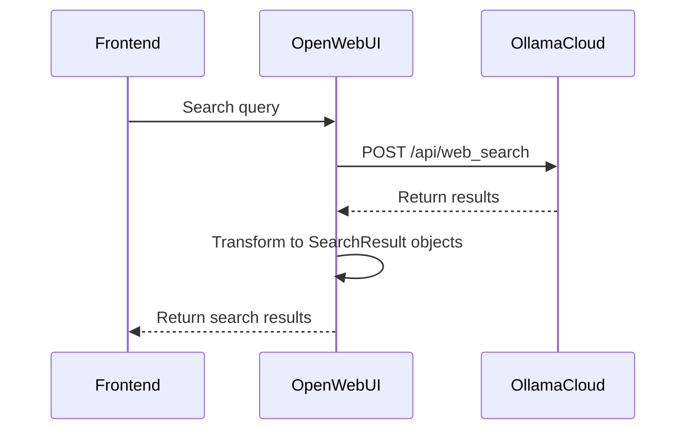
```mermaid
sequenceDiagram
participant Frontend
participant OpenWebUI
participant OllamaCloud
Frontend->>OpenWebUI : Search query
OpenWebUI->>OllamaCloud : POST /api/web_search
OllamaCloud-->>OpenWebUI : Return results
OpenWebUI->>OpenWebUI : Transform to SearchResult objects
OpenWebUI-->>Frontend : Return search results
```

**Diagram sources**
- [ollama.py](file://backend/open_webui/retrieval/web/ollama.py#L13-L51)
- [main.py](file://backend/open_webui/retrieval/web/main.py#L43-L47)

**Section sources**
- [ollama.py](file://backend/open_webui/routers/ollama.py#L308-L356)
- [openai.py](file://backend/open_webui/routers/openai.py#L105-L123)
- [utils.py](file://backend/open_webui/retrieval/web/utils.py#L549-L712)
- [ollama.py](file://backend/open_webui/retrieval/web/ollama.py#L13-L51)