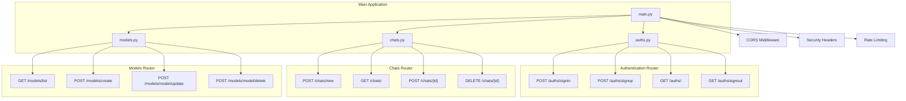
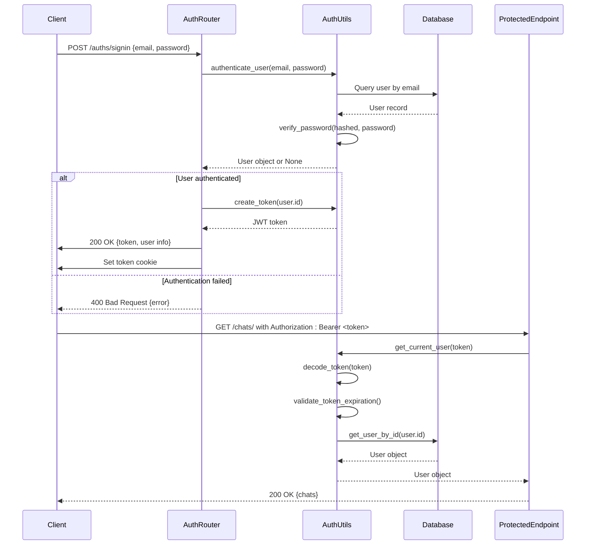
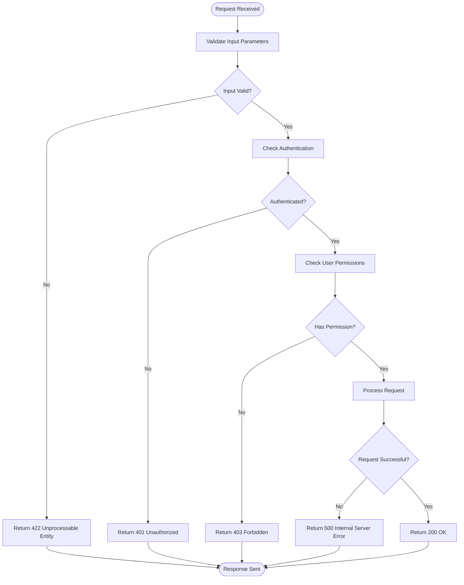

# REST API Connectivity

<cite>
**Referenced Files in This Document**   
- [auths.py](file://backend/open_webui/routers/auths.py)
- [chats.py](file://backend/open_webui/routers/chats.py)
- [models.py](file://backend/open_webui/routers/models.py)
- [auth.py](file://backend/open_webui/utils/auth.py)
- [response.py](file://backend/open_webui/utils/response.py)
- [constants.py](file://backend/open_webui/constants.py)
- [main.py](file://backend/open_webui/main.py)
- [middleware.py](file://backend/open_webui/utils/middleware.py)
- [rate_limit.py](file://backend/open_webui/utils/rate_limit.py)
- [env.py](file://backend/open_webui/env.py)
- [security_headers.py](file://backend/open_webui/utils/security_headers.py)
- [config.py](file://backend/open_webui/config.py)
</cite>

## Table of Contents
1. [Introduction](#introduction)
2. [FastAPI Endpoint Structure](#fastapi-endpoint-structure)
3. [Authentication and Authorization](#authentication-and-authorization)
4. [Request and Response Schemas](#request-and-response-schemas)
5. [Error Handling Patterns](#error-handling-patterns)
6. [CORS and Reverse Proxy Configuration](#cors-and-reverse-proxy-configuration)
7. [Rate Limiting and Request Timeouts](#rate-limiting-and-request-timeouts)
8. [Troubleshooting Common Issues](#troubleshooting-common-issues)
9. [Conclusion](#conclusion)

## Introduction
This document provides comprehensive guidance on diagnosing and resolving REST API connectivity issues in Open WebUI. It covers the FastAPI endpoint structure, authentication mechanisms, request/response schemas, error handling patterns, and configuration for CORS and reverse proxies. The documentation is based on an analysis of the core router implementations in `auths.py`, `chats.py`, and `models.py`, along with supporting utility modules that handle authentication, rate limiting, and response formatting. The goal is to equip developers and administrators with the knowledge to effectively troubleshoot common HTTP errors, configure secure API access, and ensure reliable communication between clients and the Open WebUI backend.

## FastAPI Endpoint Structure
The Open WebUI API is built on FastAPI, with endpoints organized into modular routers based on functionality. The primary routers are located in the `backend/open_webui/routers/` directory, with `auths.py`, `chats.py`, and `models.py` being central to user interaction and data management. Each router defines a set of endpoints using FastAPI's `APIRouter` class, which are then mounted to the main application in `main.py`. The endpoint structure follows RESTful principles, using HTTP methods (GET, POST, PUT, DELETE) to perform operations on resources. For example, the `chats.py` router provides endpoints for creating, retrieving, updating, and deleting chat sessions, while `models.py` manages AI model configurations. The use of Pydantic models for request and response validation ensures data integrity and provides clear API contracts.

**Diagram sources**
- [main.py](file://backend/open_webui/main.py#L70-L98)
- [auths.py](file://backend/open_webui/routers/auths.py#L81)
- [chats.py](file://backend/open_webui/routers/chats.py#L31)
- [models.py](file://backend/open_webui/routers/models.py#L36)

## Authentication and Authorization
Open WebUI implements a robust authentication and authorization system centered around JWT tokens and API keys. The system is primarily managed in `auths.py` and `auth.py`. Authentication is performed via the `/auths/signin` endpoint, which accepts user credentials and returns a JWT token that is stored in an HTTP-only cookie for web clients or returned in the response body for API clients. The token contains a user ID and expiration time, which are validated on subsequent requests. The `get_current_user` dependency in `auth.py` is used to extract and verify the token from the `Authorization` header or cookie, ensuring that only authenticated users can access protected endpoints. For programmatic access, API keys (prefixed with `sk-`) can be used in the `Authorization` header, providing an alternative to session-based authentication.

**Diagram sources**
- [auths.py](file://backend/open_webui/routers/auths.py#L507-L632)
- [auth.py](file://backend/open_webui/utils/auth.py#L272-L367)
- [auths.py](file://backend/open_webui/routers/auths.py#L106-L162)

## Request and Response Schemas
The Open WebUI API uses Pydantic models to define the structure of requests and responses, ensuring type safety and automatic validation. These models are defined in the `models` subdirectory of each router (e.g., `backend/open_webui/models/auths.py`, `backend/open_webui/models/chats.py`). For example, the `SigninForm` model in `auths.py` defines the required fields for authentication, while the `ChatForm` in `chats.py` specifies the structure for creating a new chat. Responses are similarly defined, with models like `SessionUserResponse` and `ChatResponse` dictating the output format. The API also includes utility functions in `response.py` to convert responses from external services (like Ollama) into OpenAI-compatible formats, ensuring a consistent interface for clients.

**Section sources**
- [auths.py](file://backend/open_webui/routers/auths.py#L10-L20)
- [chats.py](file://backend/open_webui/routers/chats.py#L6-L14)
- [models.py](file://backend/open_webui/routers/models.py#L9-L15)
- [response.py](file://backend/open_webui/utils/response.py#L1-L190)

## Error Handling Patterns
The Open WebUI API employs a consistent error handling strategy using FastAPI's `HTTPException` and a centralized `ERROR_MESSAGES` enum in `constants.py`. When an error occurs, an `HTTPException` is raised with a specific status code and a detailed error message from the `ERROR_MESSAGES` enum. These messages are designed to be user-friendly while providing enough information for debugging. For example, an invalid token results in a 401 Unauthorized error with the message "Your session has expired or the token is invalid. Please sign in again." The system also uses custom error codes for specific scenarios, such as `ERROR_MESSAGES.EMAIL_TAKEN` for duplicate email addresses during signup. This pattern ensures that clients receive meaningful error information in a standardized format.

**Diagram sources**
- [constants.py](file://backend/open_webui/constants.py#L19-L110)
- [auths.py](file://backend/open_webui/routers/auths.py#L630-L631)
- [chats.py](file://backend/open_webui/routers/chats.py#L64-L66)
- [models.py](file://backend/open_webui/routers/models.py#L140-L142)

## CORS and Reverse Proxy Configuration
Open WebUI's CORS and reverse proxy configuration is managed through environment variables and middleware in `main.py`. The `CORS_ALLOW_ORIGIN` environment variable, defined in `config.py`, specifies which origins are permitted to make cross-origin requests. By default, it is set to "*", but for production, it should be restricted to specific domains. The application uses FastAPI's `CORSMiddleware` to enforce these rules. For reverse proxy setups, it is crucial to ensure that headers like `X-Forwarded-For`, `X-Real-IP`, and `X-Forwarded-Proto` are properly forwarded by the proxy server. The `AIOHTTP_CLIENT_SESSION_SSL` setting in `env.py` controls whether SSL verification is performed for internal HTTP requests, which may need to be disabled when using certain reverse proxies.

**Section sources**
- [main.py](file://backend/open_webui/main.py#L42)
- [config.py](file://backend/open_webui/config.py#L1589-L1614)
- [env.py](file://backend/open_webui/env.py#L675-L677)

## Rate Limiting and Request Timeouts
Rate limiting in Open WebUI is implemented using a `RateLimiter` class in `rate_limit.py`, which leverages Redis for distributed rate limiting across multiple instances. The `signin_rate_limiter` in `auths.py` is configured to allow 15 failed login attempts every 3 minutes, helping to prevent brute-force attacks. The system uses a rolling window algorithm to track request counts. For request timeouts, the `AIOHTTP_CLIENT_TIMEOUT` setting in `env.py` controls the timeout for HTTP requests made by the application, with a default of 300 seconds. This can be adjusted based on network conditions and the performance of upstream services. These mechanisms work together to protect the API from abuse and ensure stable performance under load.

**Section sources**
- [rate_limit.py](file://backend/open_webui/utils/rate_limit.py#L6-L140)
- [auths.py](file://backend/open_webui/routers/auths.py#L86-L88)
- [env.py](file://backend/open_webui/env.py#L664-L672)

## Troubleshooting Common Issues
This section provides guidance for diagnosing and resolving common API connectivity issues.

### Authentication Errors (401 Unauthorized)
A 401 error typically indicates an invalid or missing authentication token. First, verify that the `Authorization` header is present and correctly formatted as `Bearer <token>`. If using cookies, ensure the `token` cookie is being sent with the request. Check the token's expiration time by decoding it (it is a JWT). If the token is expired, the client must re-authenticate via the `/auths/signin` endpoint. Also, verify that the user account is still active and has not been deleted.

### Forbidden Access (403 Forbidden)
A 403 error means the authenticated user lacks the necessary permissions for the requested action. This can occur if the user's role has been changed or if the endpoint requires a specific permission that the user does not have. Check the `USER_PERMISSIONS` configuration and the user's role in the database. For example, only admin users can access certain endpoints in `admin_billing.py`.

### Payload Validation Issues (422 Unprocessable Entity)
A 422 error indicates that the request body failed Pydantic validation. Carefully review the request payload against the expected schema defined in the relevant router's models. Common issues include missing required fields, incorrect data types, or values that exceed length limits (e.g., model IDs must be less than 256 characters). The error response will include details about which field failed validation.

### Server Errors (500 Internal Server Error)
A 500 error signifies an unhandled exception on the server. Check the application logs for stack traces and error messages. Common causes include database connection issues, missing environment variables, or failures in external services (like Ollama). Ensure that all required services are running and that the database schema is up to date by running any pending migrations.

### CORS Configuration Issues
If requests are being blocked due to CORS, verify the `CORS_ALLOW_ORIGIN` environment variable. It should be set to the exact origin of the frontend application (e.g., `http://localhost:8080`). If using a reverse proxy, ensure it is not stripping or modifying the `Origin` header. Test the API directly from the command line using `curl` to isolate whether the issue is with the client or the server configuration.

**Section sources**
- [constants.py](file://backend/open_webui/constants.py#L43-L50)
- [auths.py](file://backend/open_webui/routers/auths.py#L510-L513)
- [chats.py](file://backend/open_webui/routers/chats.py#L74-L83)
- [models.py](file://backend/open_webui/routers/models.py#L147-L149)

## Conclusion
The Open WebUI REST API provides a well-structured and secure interface for interacting with the application. Its foundation on FastAPI ensures robust request validation and error handling, while the modular router design promotes maintainability. The authentication system, based on JWT tokens and API keys, provides flexible access control for both web and programmatic clients. By understanding the endpoint structure, request/response schemas, and error handling patterns, developers can effectively integrate with and troubleshoot the API. Proper configuration of CORS, rate limiting, and reverse proxy settings is essential for deploying the application in production environments. This documentation serves as a comprehensive guide for diagnosing connectivity issues and ensuring reliable API operation.