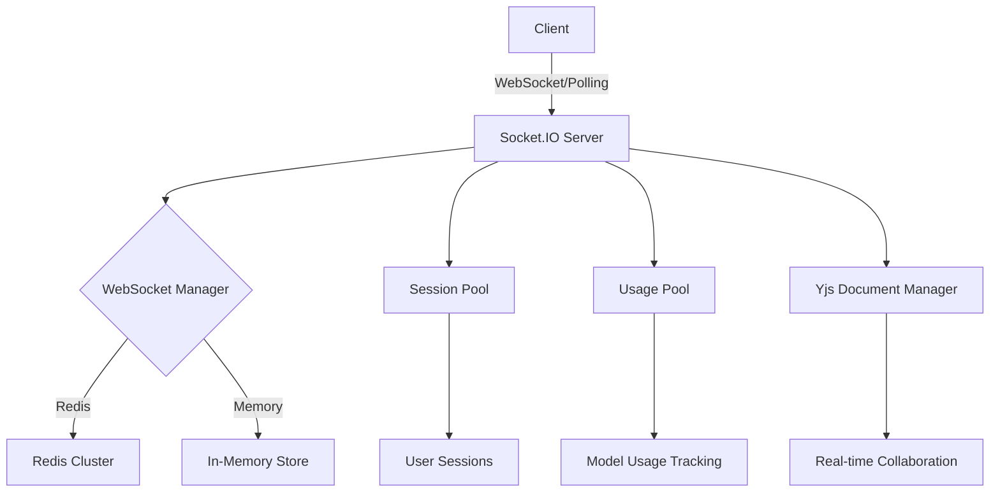
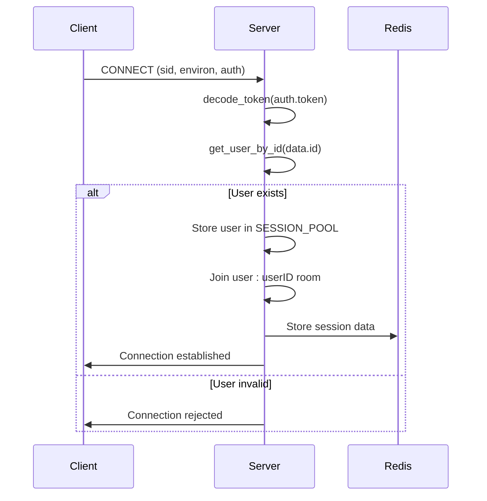
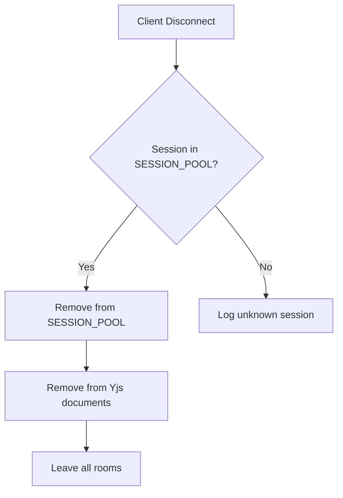
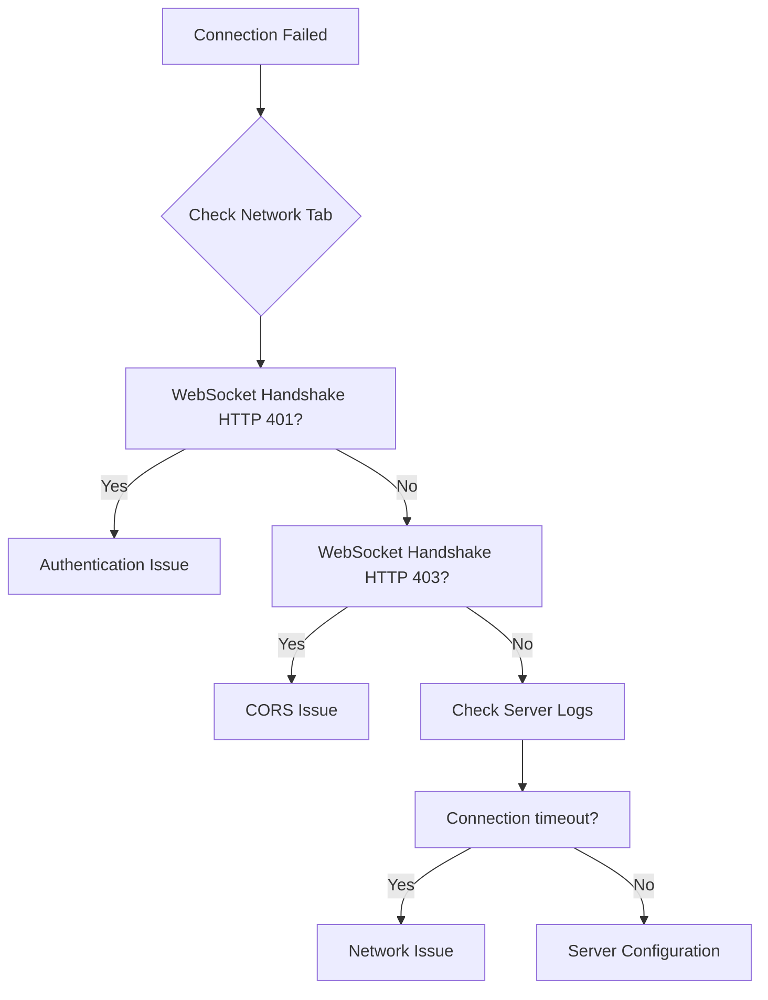
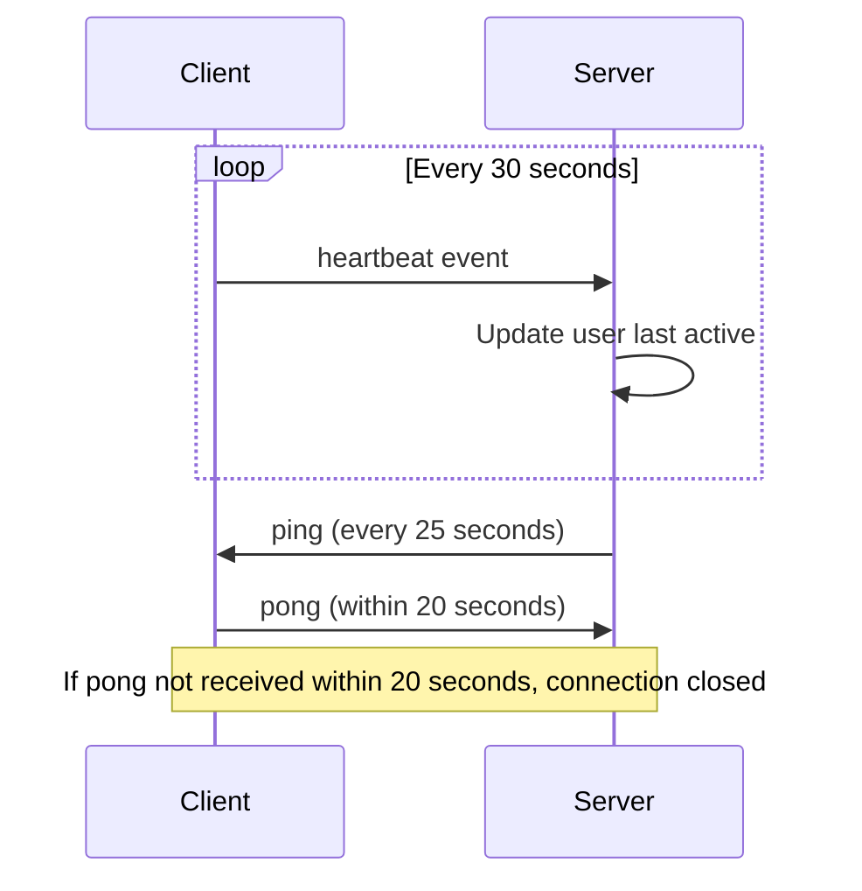
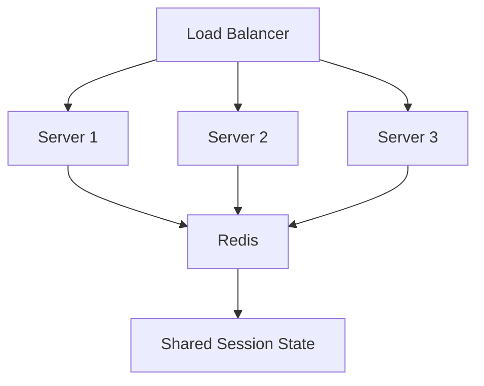
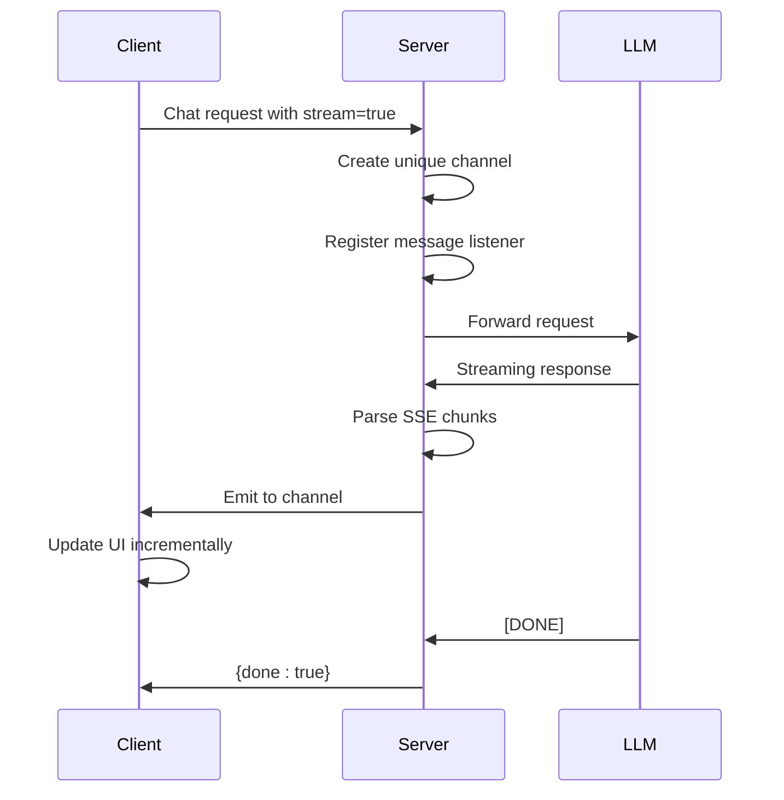
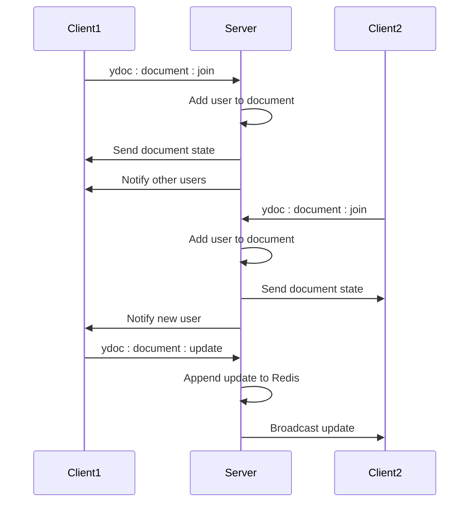

# WebSocket Connectivity

<cite>
**Referenced Files in This Document**   
- [main.py](file://backend/open_webui/socket/main.py)
- [utils.py](file://backend/open_webui/socket/utils.py)
- [main.py](file://backend/open_webui/main.py)
- [env.py](file://backend/open_webui/env.py)
- [config.py](file://backend/open_webui/config.py)
- [index.ts](file://src/lib/apis/chats/index.ts)
- [index.ts](file://src/lib/stores/index.ts)
- [Channel.svelte](file://src/lib/components/channel/Channel.svelte)
- [chat.py](file://backend/open_webui/utils/chat.py)
</cite>

## Table of Contents
1. [Introduction](#introduction)
2. [WebSocket Implementation](#websocket-implementation)
3. [Connection Lifecycle](#connection-lifecycle)
4. [Event Handling and Message Formats](#event-handling-and-message-formats)
5. [Troubleshooting Connection Issues](#troubleshooting-connection-issues)
6. [Proxy and Load Balancer Configuration](#proxy-and-load-balancer-configuration)
7. [Real-time Features](#real-time-features)
8. [Error Handling](#error-handling)
9. [Configuration Options](#configuration-options)
10. [Conclusion](#conclusion)

## Introduction
WebSocket connectivity in open-webui enables real-time communication between clients and the server for features like chat streaming, presence indicators, collaborative editing, and live updates. This document provides comprehensive guidance on diagnosing and resolving WebSocket connectivity issues, understanding the Socket.IO implementation, and configuring the system for optimal performance.

The WebSocket implementation uses Socket.IO with support for both WebSocket and HTTP long-polling transports, with Redis for distributed session management in clustered environments. The system handles connection establishment, message transmission, and disconnection events with proper authentication and authorization.

**Section sources**
- [main.py](file://backend/open_webui/socket/main.py#L1-L839)
- [main.py](file://backend/open_webui/main.py#L1-L2352)

## WebSocket Implementation

### Socket.IO Configuration
The open-webui WebSocket implementation uses Socket.IO with configurable transport options and Redis-based session management. The server is configured in `socket/main.py` with support for both standalone and distributed deployments.



**Diagram sources**
- [main.py](file://backend/open_webui/socket/main.py#L64-L99)
- [utils.py](file://backend/open_webui/socket/utils.py#L120-L224)

### Transport Configuration
The WebSocket server supports multiple transport methods with configurable options:

- **WebSocket**: Primary transport for real-time communication
- **Polling**: Fallback transport when WebSocket is not available
- **Transports configuration**: Controlled by `ENABLE_WEBSOCKET_SUPPORT` environment variable
- **Connection upgrades**: Configurable via `allow_upgrades` parameter

The server is configured to prefer WebSocket transport when available, with polling as a fallback mechanism for environments where WebSocket connections are blocked.

**Section sources**
- [main.py](file://backend/open_webui/socket/main.py#L79-L81)
- [env.py](file://backend/open_webui/env.py#L613-L615)

## Connection Lifecycle

### Connection Establishment
The connection lifecycle begins with the client establishing a WebSocket connection to the server. The process involves several stages:

1. **Client connection**: The client connects to the WebSocket endpoint
2. **Authentication**: Token-based authentication is performed
3. **Session creation**: User session is created and stored
4. **Room joining**: User joins relevant rooms based on permissions



**Diagram sources**
- [main.py](file://backend/open_webui/socket/main.py#L303-L317)
- [main.py](file://backend/open_webui/socket/main.py#L318-L351)

### Connection Events
The system implements several connection-related events:

- **connect**: Triggered when a client connects
- **user-join**: Explicit user join event with authentication
- **disconnect**: Triggered when a client disconnects
- **heartbeat**: Periodic keep-alive signal

The `user-join` event is particularly important as it handles authentication and room joining for the user's channels and notes.

**Section sources**
- [main.py](file://backend/open_webui/socket/main.py#L303-L351)
- [main.py](file://backend/open_webui/socket/main.py#L318-L351)

### Disconnection Handling
When a client disconnects, the system performs cleanup operations:



The disconnection handler removes the user session from the session pool and cleans up any Yjs document associations. This ensures proper resource cleanup and presence indicator updates.

**Section sources**
- [main.py](file://backend/open_webui/socket/main.py#L684-L693)

## Event Handling and Message Formats

### Event Naming Conventions
The system uses a consistent event naming convention with namespaces and prefixes:

- **events**: General events for chat updates
- **events:channel**: Channel-specific events (typing, read status)
- **ydoc:document**: Yjs document collaboration events
- **usage**: Model usage tracking
- **heartbeat**: Keep-alive signals

The naming convention follows the pattern `namespace:event` or `namespace:subnamespace:event` for better organization and filtering.

**Section sources**
- [main.py](file://backend/open_webui/socket/main.py#L288-L299)
- [main.py](file://backend/open_webui/socket/main.py#L413-L447)

### Message Formats
Events follow a standardized message format with consistent structure:

```json
{
  "event": "events",
  "data": {
    "chat_id": "string",
    "message_id": "string",
    "data": {
      "type": "string",
      "data": {}
    }
  }
}
```

For channel events, the format includes additional context:

```json
{
  "event": "events:channel",
  "data": {
    "channel_id": "string",
    "message_id": "string",
    "data": {
      "type": "typing|last_read_at",
      "data": {}
    },
    "user": {
      "id": "string",
      "name": "string"
    }
  }
}
```

**Section sources**
- [main.py](file://backend/open_webui/socket/main.py#L701-L710)
- [main.py](file://backend/open_webui/socket/main.py#L434-L443)

### Event Emission Patterns
The system uses several patterns for event emission:

- **Room-based broadcasting**: Events sent to specific rooms
- **User-specific messaging**: Events sent to individual users
- **Channel-based updates**: Real-time updates for specific channels

The `emit_to_users` function demonstrates the pattern for sending events to multiple users:

```mermaid
flowchart TD
A[emit_to_users] --> B[Iterate through user_ids]
B --> C[Construct room name: user:{user_id}]
C --> D[Emit event to room]
D --> E[Handle emission errors]
```

**Section sources**
- [main.py](file://backend/open_webui/socket/main.py#L256-L269)

## Troubleshooting Connection Issues

### Connection Establishment Failures
Common causes of connection establishment failures include:

- **Authentication issues**: Invalid or missing tokens
- **CORS configuration**: Origin not allowed
- **Network connectivity**: Firewall or proxy blocking WebSocket
- **Server configuration**: WebSocket support disabled

To diagnose connection issues:

1. Check browser developer tools for WebSocket connection errors
2. Verify the token is present in localStorage
3. Check server logs for connection attempts
4. Validate CORS configuration matches client origin



**Section sources**
- [main.py](file://backend/open_webui/socket/main.py#L303-L317)
- [env.py](file://backend/open_webui/env.py#L613-L615)

### Message Transmission Problems
Issues with message transmission can occur due to:

- **Channel naming conflicts**: Incorrect channel names
- **Permission issues**: User lacks access to target room
- **Serialization errors**: Invalid JSON in message payload
- **Network interruptions**: Temporary connectivity issues

The system includes error handling in event emission:

```python
try:
    await sio.emit(event, data, room=f"user:{user_id}")
except Exception as e:
    log.debug(f"Failed to emit event {event} to users {user_ids}: {e}")
```

**Section sources**
- [main.py](file://backend/open_webui/socket/main.py#L268-L269)

### Disconnection Issues
Unexpected disconnections can be caused by:

- **Timeout settings**: Ping interval and timeout values
- **Network instability**: Intermittent connectivity
- **Server overload**: High CPU or memory usage
- **Client-side issues**: Browser tab closing or refresh

The system uses heartbeat events to maintain connection health:



**Diagram sources**
- [main.py](file://backend/open_webui/socket/main.py#L354-L359)
- [main.py](file://backend/open_webui/socket/main.py#L84-L85)

## Proxy and Load Balancer Configuration

### SSL/TLS Termination
When using SSL/TLS termination at the proxy level, ensure proper configuration:

- **WebSocket upgrade headers**: Proxy must handle WebSocket upgrade requests
- **Secure connections**: Use wss:// for production environments
- **Header forwarding**: Forward necessary headers for authentication

Common proxy configurations:

```nginx
location /ws/socket.io/ {
    proxy_pass http://backend;
    proxy_http_version 1.1;
    proxy_set_header Upgrade $http_upgrade;
    proxy_set_header Connection "upgrade";
    proxy_set_header Host $host;
    proxy_set_header X-Real-IP $remote_addr;
    proxy_set_header X-Forwarded-For $proxy_add_x_forwarded_for;
    proxy_set_header X-Forwarded-Proto $scheme;
}
```

**Section sources**
- [main.py](file://backend/open_webui/socket/main.py#L77-L78)
- [env.py](file://backend/open_webui/env.py#L61-L62)

### Load Balancer Settings
For load-balanced deployments, configure:

- **Session affinity**: Sticky sessions to maintain WebSocket connections
- **Redis-based session management**: Use Redis for distributed session storage
- **Connection timeouts**: Align with load balancer timeout settings

The system supports Redis-based WebSocket management:



**Section sources**
- [main.py](file://backend/open_webui/socket/main.py#L64-L75)
- [env.py](file://backend/open_webui/env.py#L618-L634)

### Proxy Configuration Issues
Common proxy-related issues include:

- **Missing upgrade headers**: WebSocket handshake fails
- **Incorrect path configuration**: WebSocket endpoint not properly routed
- **Timeout mismatches**: Proxy timeout shorter than WebSocket ping interval
- **SSL certificate issues**: Certificate validation failures

To troubleshoot proxy issues:

1. Verify the proxy is forwarding WebSocket upgrade headers
2. Check that the WebSocket path (/ws/socket.io) is correctly configured
3. Ensure timeout values are consistent across proxy and application
4. Validate SSL certificates if using HTTPS/WSS

**Section sources**
- [main.py](file://backend/open_webui/socket/main.py#L219-L222)
- [env.py](file://backend/open_webui/env.py#L651-L661)

## Real-time Features

### Real-time Chat Updates
The system implements real-time chat updates through streaming responses:



The streaming implementation uses Server-Sent Events (SSE) format with proper chunking and error handling.

**Section sources**
- [chat.py](file://backend/open_webui/utils/chat.py#L91-L149)
- [index.ts](file://src/lib/apis/streaming/index.ts#L43-L93)

### Presence Indicators
Presence indicators are implemented through:

- **Heartbeat events**: Regular client-to-server pings
- **Last active tracking**: User activity timestamp updates
- **Room membership**: Active session tracking in rooms

The heartbeat mechanism updates the user's last active timestamp:

```python
@sio.on("heartbeat")
async def heartbeat(sid, data):
    user = SESSION_POOL.get(sid)
    if user:
        Users.update_last_active_by_id(user["id"])
```

**Section sources**
- [main.py](file://backend/open_webui/socket/main.py#L354-L359)
- [Channel.svelte](file://src/lib/components/channel/Channel.svelte#L57-L64)

### Collaborative Editing
Collaborative editing uses Yjs for real-time document synchronization:



The Yjs document manager handles document state persistence and user presence.

**Section sources**
- [main.py](file://backend/open_webui/socket/main.py#L448-L652)
- [utils.py](file://backend/open_webui/socket/utils.py#L120-L224)

## Error Handling

### Connection Error Handling
The system implements comprehensive error handling for WebSocket connections:

- **Connection errors**: Handled with connect_error event
- **Reconnection logic**: Automatic reconnection attempts
- **Graceful degradation**: Fallback to polling when WebSocket fails

Client-side reconnection handling:

```javascript
_socket.on('connect_error', (err) => {
    console.log('connect_error', err);
});

_socket.on('reconnect_attempt', (attempt) => {
    console.log('reconnect_attempt', attempt);
});

_socket.on('reconnect_failed', () => {
    console.log('reconnect_failed');
});
```

**Section sources**
- [main.py](file://backend/open_webui/socket/main.py#L684-L693)
- [index.ts](file://src/lib/stores/index.ts#L28-L29)

### Message Error Handling
Message transmission includes error handling:

```python
async def emit_to_users(event: str, data: dict, user_ids: list[str]):
    try:
        for user_id in user_ids:
            await sio.emit(event, data, room=f"user:{user_id}")
    except Exception as e:
        log.debug(f"Failed to emit event {event} to users {user_ids}: {e}")
```

The system logs emission failures but continues processing other users to prevent cascading failures.

**Section sources**
- [main.py](file://backend/open_webui/socket/main.py#L268-L269)

### Timeout and Keep-alive
The system uses configurable timeout settings:

- **Ping interval**: How often server pings clients (default: 25 seconds)
- **Ping timeout**: How long to wait for pong response (default: 20 seconds)
- **Heartbeat interval**: Client-side heartbeat (30 seconds)

These values can be configured via environment variables:

```bash
WEBSOCKET_SERVER_PING_INTERVAL=25
WEBSOCKET_SERVER_PING_TIMEOUT=20
```

**Section sources**
- [env.py](file://backend/open_webui/env.py#L651-L661)
- [main.py](file://backend/open_webui/socket/main.py#L84-L85)

## Configuration Options

### WebSocket Configuration
The system provides extensive configuration options through environment variables:

| Environment Variable | Default | Description |
|----------------------|--------|-------------|
| ENABLE_WEBSOCKET_SUPPORT | True | Enable WebSocket transport |
| WEBSOCKET_MANAGER | "" | Manager type (redis or empty for memory) |
| WEBSOCKET_REDIS_URL | REDIS_URL | Redis URL for WebSocket manager |
| WEBSOCKET_REDIS_CLUSTER | REDIS_CLUSTER | Redis cluster mode |
| WEBSOCKET_SENTINEL_HOSTS | "" | Redis Sentinel hosts |
| WEBSOCKET_SENTINEL_PORT | "26379" | Redis Sentinel port |
| WEBSOCKET_SERVER_PING_TIMEOUT | "20" | Server ping timeout in seconds |
| WEBSOCKET_SERVER_PING_INTERVAL | "25" | Server ping interval in seconds |
| WEBSOCKET_SERVER_LOGGING | False | Enable Socket.IO server logging |

**Section sources**
- [env.py](file://backend/open_webui/env.py#L613-L661)
- [main.py](file://backend/open_webui/socket/main.py#L64-L99)

### Client Configuration
Client-side WebSocket configuration is handled in the frontend:

```javascript
const setupSocket = async (enableWebsocket) => {
    const _socket = io(`${WEBUI_BASE_URL}` || undefined, {
        reconnection: true,
        reconnectionDelay: 1000,
        reconnectionDelayMax: 5000,
        randomizationFactor: 0.5,
        path: '/ws/socket.io',
        transports: enableWebsocket ? ['websocket'] : ['polling', 'websocket'],
        auth: { token: localStorage.token }
    });
};
```

The client respects the server's WebSocket enablement setting and falls back to polling if necessary.

**Section sources**
- [index.ts](file://src/lib/stores/index.ts#L28-L29)
- [Channel.svelte](file://src/lib/components/channel/Channel.svelte#L97-L106)

## Conclusion
WebSocket connectivity in open-webui provides a robust foundation for real-time features including chat streaming, presence indicators, and collaborative editing. The Socket.IO implementation with Redis support enables scalable deployments with proper session management.

Key considerations for maintaining reliable WebSocket connectivity include:
- Proper proxy and load balancer configuration
- Appropriate timeout settings
- Correct SSL/TLS termination
- Adequate error handling and reconnection logic
- Monitoring of connection health and performance

By following the configuration guidelines and troubleshooting steps outlined in this document, administrators can ensure optimal WebSocket performance and reliability in their open-webui deployments.

**Section sources**
- [main.py](file://backend/open_webui/socket/main.py#L1-L839)
- [env.py](file://backend/open_webui/env.py#L613-L661)
- [main.py](file://backend/open_webui/main.py#L1-L2352)