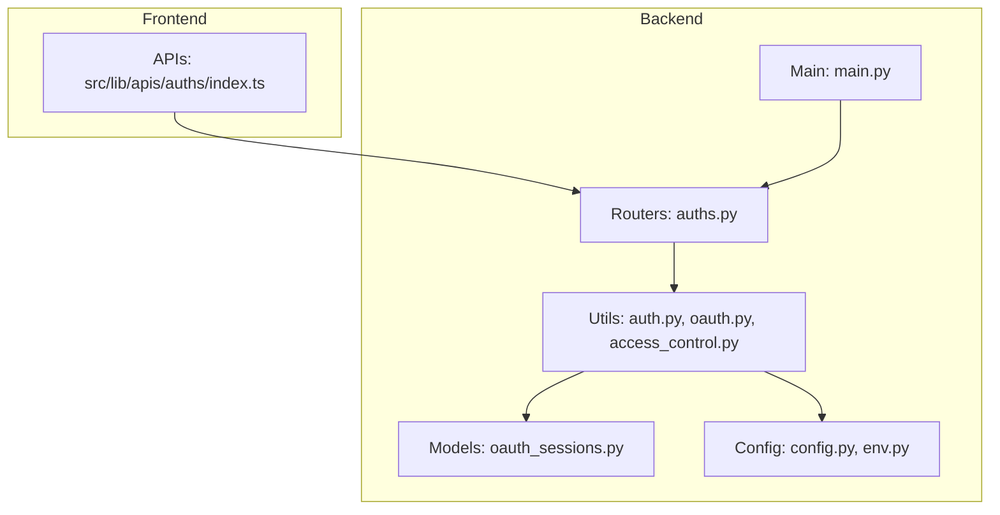
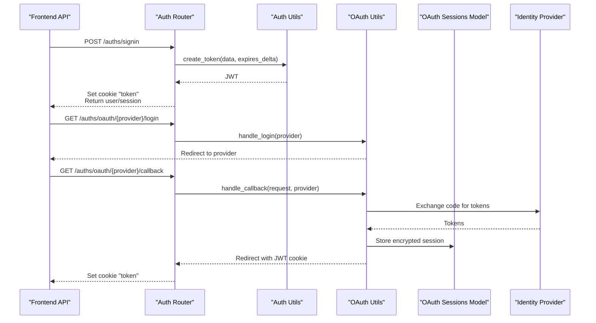
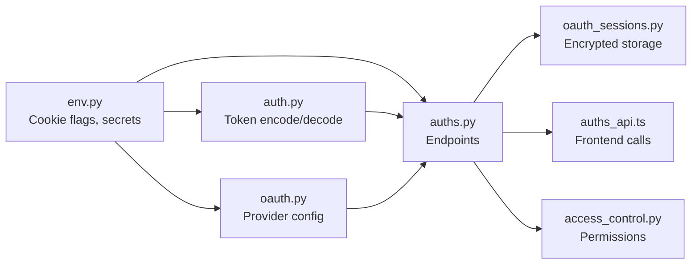

# Authentication Errors

<cite>
**Referenced Files in This Document**
- [auths.py](file://backend/open_webui/routers/auths.py)
- [auth.py](file://backend/open_webui/utils/auth.py)
- [oauth.py](file://backend/open_webui/utils/oauth.py)
- [access_control.py](file://backend/open_webui/utils/access_control.py)
- [oauth_sessions.py](file://backend/open_webui/models/oauth_sessions.py)
- [auths_api.ts](file://src/lib/apis/auths/index.ts)
- [constants.py](file://backend/open_webui/constants.py)
- [env.py](file://backend/open_webui/env.py)
- [config.py](file://backend/open_webui/config.py)
- [main.py](file://backend/open_webui/main.py)
</cite>

## Table of Contents
1. [Introduction](#introduction)
2. [Project Structure](#project-structure)
3. [Core Components](#core-components)
4. [Architecture Overview](#architecture-overview)
5. [Detailed Component Analysis](#detailed-component-analysis)
6. [Dependency Analysis](#dependency-analysis)
7. [Performance Considerations](#performance-considerations)
8. [Troubleshooting Guide](#troubleshooting-guide)
9. [Conclusion](#conclusion)

## Introduction
This document focuses on diagnosing and resolving authentication errors in Open WebUI. It covers login failures, OAuth integration issues, session expiration, token validation errors, cookie configuration pitfalls, identity provider misconfigurations (Google, GitHub, Microsoft), role-based access control failures, and session persistence problems. It also provides practical debugging steps for tracing authentication requests and inspecting token payloads.

## Project Structure
Authentication spans backend routers, utilities, models, and frontend API calls:
- Backend routers define endpoints for login, signup, signout, and session retrieval.
- Utilities handle token creation, decoding, validation, and revocation.
- OAuth utilities manage provider integrations, dynamic client registration, and token refresh.
- Models persist OAuth sessions and enforce encryption.
- Frontend APIs call backend endpoints and surface errors to users.

**Diagram sources**
- [auths.py](file://backend/open_webui/routers/auths.py#L106-L763)
- [auth.py](file://backend/open_webui/utils/auth.py#L194-L368)
- [oauth.py](file://backend/open_webui/utils/oauth.py#L1-L200)
- [access_control.py](file://backend/open_webui/utils/access_control.py#L1-L175)
- [oauth_sessions.py](file://backend/open_webui/models/oauth_sessions.py#L1-L278)
- [auths_api.ts](file://src/lib/apis/auths/index.ts#L85-L143)
- [config.py](file://backend/open_webui/config.py#L659-L722)
- [env.py](file://backend/open_webui/env.py#L423-L520)
- [main.py](file://backend/open_webui/main.py#L437-L477)

**Section sources**
- [auths.py](file://backend/open_webui/routers/auths.py#L106-L763)
- [auth.py](file://backend/open_webui/utils/auth.py#L194-L368)
- [oauth.py](file://backend/open_webui/utils/oauth.py#L1-L200)
- [access_control.py](file://backend/open_webui/utils/access_control.py#L1-L175)
- [oauth_sessions.py](file://backend/open_webui/models/oauth_sessions.py#L1-L278)
- [auths_api.ts](file://src/lib/apis/auths/index.ts#L85-L143)
- [config.py](file://backend/open_webui/config.py#L659-L722)
- [env.py](file://backend/open_webui/env.py#L423-L520)
- [main.py](file://backend/open_webui/main.py#L437-L477)

## Core Components
- Login/Logout endpoints: password-based, LDAP, trusted headers, and signout with OpenID Connect end-session support.
- Token lifecycle: creation, decoding, validation, revocation, and cookie setting.
- OAuth integration: provider registration, dynamic client registration, token refresh, and callback error handling.
- Role-based access control: permission computation from groups and defaults.
- Session persistence: encrypted OAuth sessions stored server-side.

**Section sources**
- [auths.py](file://backend/open_webui/routers/auths.py#L106-L763)
- [auth.py](file://backend/open_webui/utils/auth.py#L194-L368)
- [oauth.py](file://backend/open_webui/utils/oauth.py#L1-L200)
- [access_control.py](file://backend/open_webui/utils/access_control.py#L1-L175)
- [oauth_sessions.py](file://backend/open_webui/models/oauth_sessions.py#L1-L278)

## Architecture Overview
The authentication flow integrates frontend API calls with backend routers and utilities. Providers are configured centrally and used by OAuth utilities to authorize and exchange tokens.

**Diagram sources**
- [auths_api.ts](file://src/lib/apis/auths/index.ts#L85-L143)
- [auths.py](file://backend/open_webui/routers/auths.py#L507-L751)
- [oauth.py](file://backend/open_webui/utils/oauth.py#L718-L800)
- [oauth_sessions.py](file://backend/open_webui/models/oauth_sessions.py#L108-L141)

**Section sources**
- [auths_api.ts](file://src/lib/apis/auths/index.ts#L85-L143)
- [auths.py](file://backend/open_webui/routers/auths.py#L507-L751)
- [oauth.py](file://backend/open_webui/utils/oauth.py#L718-L800)
- [oauth_sessions.py](file://backend/open_webui/models/oauth_sessions.py#L108-L141)

## Detailed Component Analysis

### Login and Logout Failures
Common failure points:
- Invalid credentials or rate limiting during password login.
- Trusted header mismatches when using trusted auth.
- LDAP bind/search failures and group attribute extraction issues.
- Signout attempts to call provider end-session with metadata discovery.

Debugging steps:
- Inspect router logs for rate limit and credential checks.
- Verify trusted headers presence and values.
- Review LDAP TLS configuration and attribute extraction warnings.
- Confirm provider metadata discovery and end-session endpoint availability.

**Section sources**
- [auths.py](file://backend/open_webui/routers/auths.py#L507-L751)
- [auths.py](file://backend/open_webui/routers/auths.py#L218-L499)
- [auths.py](file://backend/open_webui/routers/auths.py#L753-L800)

### Token Validation and Revocation
Key behaviors:
- Decoding JWT and validating expiration.
- Checking Redis for revoked tokens using JTI.
- Deleting cookies and invalidating tokens on signout.
- Handling API key vs JWT authentication paths.

Common issues:
- Expired or malformed tokens.
- Missing Redis leading to bypassed revocation checks.
- Cookie security flags causing browser rejection.

**Section sources**
- [auth.py](file://backend/open_webui/utils/auth.py#L194-L368)
- [auths.py](file://backend/open_webui/routers/auths.py#L106-L140)
- [auths.py](file://backend/open_webui/routers/auths.py#L753-L800)

### OAuth Integration Issues
Provider-specific pitfalls:
- Dynamic client registration failures and invalid client errors.
- Missing state parameter or upstream provider errors in callbacks.
- Email extraction fallbacks and missing claims.
- Token refresh failures and missing refresh tokens.

Google, GitHub, Microsoft:
- Provider registration and redirect URIs are configured centrally.
- GitHub may require fetching primary email if not exposed.
- Microsoft tenant configuration affects metadata discovery.

**Section sources**
- [oauth.py](file://backend/open_webui/utils/oauth.py#L1-L200)
- [oauth.py](file://backend/open_webui/utils/oauth.py#L1337-L1385)
- [config.py](file://backend/open_webui/config.py#L659-L722)

### Session Expiration Problems
Symptoms:
- Frequent re-authentication prompts.
- Token expiration mismatch with cookie expiry.

Root causes:
- JWT expiration calculation and cookie expiry alignment.
- Client clock skew affecting exp comparisons.
- Redis TTL for revoked tokens aligning with token exp.

**Section sources**
- [auth.py](file://backend/open_webui/utils/auth.py#L194-L242)
- [auths.py](file://backend/open_webui/routers/auths.py#L588-L613)

### Cookie Configuration Problems
Misconfigurations:
- SameSite and Secure flags not matching deployment context.
- Cookie domain/path not aligned with frontend origin.
- Mixed content or HTTPS-only cookies on HTTP deployments.

Impact:
- Browser refuses to send cookies, leading to unauthenticated requests.
- Frontend fetch calls may drop cookies without credentials.

**Section sources**
- [auths.py](file://backend/open_webui/routers/auths.py#L605-L613)
- [auths.py](file://backend/open_webui/routers/auths.py#L127-L139)
- [env.py](file://backend/open_webui/env.py#L462-L478)

### Identity Provider Misconfigurations
Common mistakes:
- Incorrect client ID/secret or scopes.
- Wrong redirect URI or missing trailing slash.
- Tenant/base URL mismatch for Microsoft.
- Missing provider metadata discovery endpoints.

Validation:
- Use provider’s OIDC discovery endpoints.
- Verify redirect URIs in provider dashboards.
- Test dynamic client registration preflight.

**Section sources**
- [config.py](file://backend/open_webui/config.py#L659-L722)
- [oauth.py](file://backend/open_webui/utils/oauth.py#L283-L399)

### Role-Based Access Control Failures
Failure scenarios:
- Missing permissions due to group membership or default permissions.
- Hierarchical permission keys not found in group permissions.
- Strict access control denying access when not configured.

Resolution:
- Ensure users belong to groups with required permissions.
- Verify default permissions include required keys.
- Check access control configuration for resources.

**Section sources**
- [access_control.py](file://backend/open_webui/utils/access_control.py#L1-L175)

### Session Persistence Issues
Symptoms:
- Lost OAuth sessions after restarts.
- Encrypted token storage failures.
- Missing encryption keys.

Checks:
- Encryption key format validation for OAuth sessions.
- Database connectivity and migrations.
- Cleanup of stale sessions.

**Section sources**
- [oauth_sessions.py](file://backend/open_webui/models/oauth_sessions.py#L1-L107)
- [oauth_sessions.py](file://backend/open_webui/models/oauth_sessions.py#L108-L278)

### Frontend API Calls and Error Propagation
Frontend calls:
- Session retrieval with credentials included.
- LDAP sign-in and admin endpoints.
- Error handling surfaces detail messages.

Debugging tips:
- Log frontend fetch responses and error payloads.
- Ensure Authorization header is set for protected endpoints.
- Verify credentials option for cross-origin cookies.

**Section sources**
- [auths_api.ts](file://src/lib/apis/auths/index.ts#L85-L143)
- [auths_api.ts](file://src/lib/apis/auths/index.ts#L1-L100)

## Dependency Analysis
Authentication depends on environment configuration, Redis for token revocation, and provider metadata discovery.

**Diagram sources**
- [env.py](file://backend/open_webui/env.py#L423-L520)
- [auth.py](file://backend/open_webui/utils/auth.py#L194-L368)
- [oauth.py](file://backend/open_webui/utils/oauth.py#L1-L200)
- [auths.py](file://backend/open_webui/routers/auths.py#L106-L763)
- [oauth_sessions.py](file://backend/open_webui/models/oauth_sessions.py#L1-L278)
- [auths_api.ts](file://src/lib/apis/auths/index.ts#L85-L143)
- [access_control.py](file://backend/open_webui/utils/access_control.py#L1-L175)

**Section sources**
- [env.py](file://backend/open_webui/env.py#L423-L520)
- [auth.py](file://backend/open_webui/utils/auth.py#L194-L368)
- [oauth.py](file://backend/open_webui/utils/oauth.py#L1-L200)
- [auths.py](file://backend/open_webui/routers/auths.py#L106-L763)
- [oauth_sessions.py](file://backend/open_webui/models/oauth_sessions.py#L1-L278)
- [auths_api.ts](file://src/lib/apis/auths/index.ts#L85-L143)
- [access_control.py](file://backend/open_webui/utils/access_control.py#L1-L175)

## Performance Considerations
- Token validation with Redis reduces repeated database lookups for revoked tokens.
- OAuth token refresh avoids frequent re-authentication for long-lived sessions.
- Rate limiting prevents brute-force attempts on login endpoints.

[No sources needed since this section provides general guidance]

## Troubleshooting Guide

### Diagnose Login Failures
- Check router logs for rate limit and credential verification outcomes.
- Validate trusted header presence and values when using trusted auth mode.
- For LDAP, review TLS configuration and attribute extraction warnings.

**Section sources**
- [auths.py](file://backend/open_webui/routers/auths.py#L507-L751)
- [auths.py](file://backend/open_webui/routers/auths.py#L218-L499)

### Debug JWT-Related Issues
- Decode token payload and verify exp and jti fields.
- Confirm secret key and algorithm consistency.
- Ensure Redis is configured for token revocation checks.

**Section sources**
- [auth.py](file://backend/open_webui/utils/auth.py#L194-L242)
- [auths.py](file://backend/open_webui/routers/auths.py#L106-L140)

### Investigate Cookie Configuration Problems
- Verify SameSite and Secure flags match deployment (HTTPS vs HTTP).
- Confirm cookie domain/path aligns with frontend origin.
- Ensure credentials option is used for cross-origin requests.

**Section sources**
- [auths.py](file://backend/open_webui/routers/auths.py#L605-L613)
- [auths.py](file://backend/open_webui/routers/auths.py#L127-L139)
- [auths_api.ts](file://src/lib/apis/auths/index.ts#L85-L143)

### Resolve OAuth Callback Errors
- Capture and log callback error messages with actionable context.
- Validate provider redirect URIs and scopes.
- Handle missing state parameter and upstream provider errors.

**Section sources**
- [oauth.py](file://backend/open_webui/utils/oauth.py#L167-L196)
- [oauth.py](file://backend/open_webui/utils/oauth.py#L718-L800)

### Fix Identity Provider Misconfigurations
- Validate client ID/secret and redirect URIs.
- Confirm provider metadata discovery endpoints are reachable.
- For Microsoft, ensure tenant base URL and app ID are correct.

**Section sources**
- [config.py](file://backend/open_webui/config.py#L659-L722)
- [oauth.py](file://backend/open_webui/utils/oauth.py#L283-L399)

### Address Role-Based Access Control Failures
- Verify user group memberships and permissions.
- Ensure default permissions include required keys.
- Check strict access control configuration for resources.

**Section sources**
- [access_control.py](file://backend/open_webui/utils/access_control.py#L1-L175)

### Resolve Session Persistence Issues
- Confirm OAuth session encryption key format and initialization.
- Check database connectivity and migrations.
- Investigate encryption/decryption errors for stored tokens.

**Section sources**
- [oauth_sessions.py](file://backend/open_webui/models/oauth_sessions.py#L1-L107)
- [oauth_sessions.py](file://backend/open_webui/models/oauth_sessions.py#L108-L278)

### Trace Authentication Requests and Inspect Token Payloads
- Enable OAuth and MAIN log levels for detailed traces.
- Inspect frontend fetch responses and error payloads.
- Use browser developer tools to verify cookie presence and headers.

**Section sources**
- [env.py](file://backend/open_webui/env.py#L72-L112)
- [auths_api.ts](file://src/lib/apis/auths/index.ts#L85-L143)

## Conclusion
Authentication in Open WebUI relies on robust token lifecycle management, provider configuration, and session persistence. By aligning cookie and secret configurations, validating provider metadata, and leveraging RBAC defaults, most authentication errors can be diagnosed and resolved quickly. Use the provided debugging steps and diagrams to trace failures from frontend API calls through backend routers and utilities.