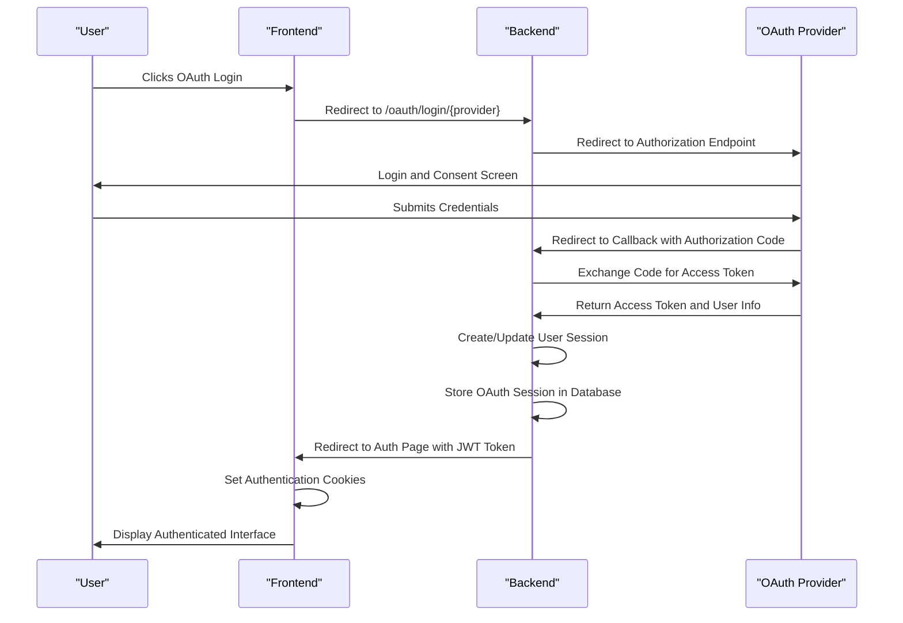
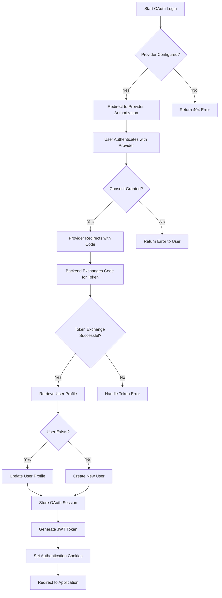
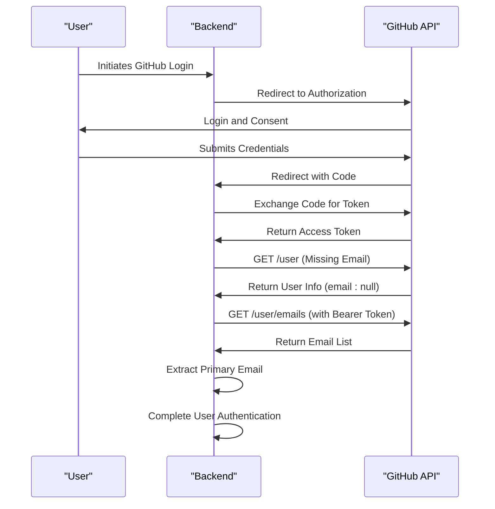
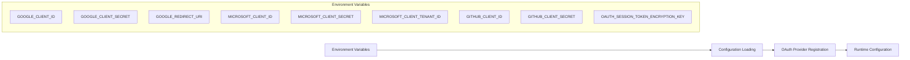
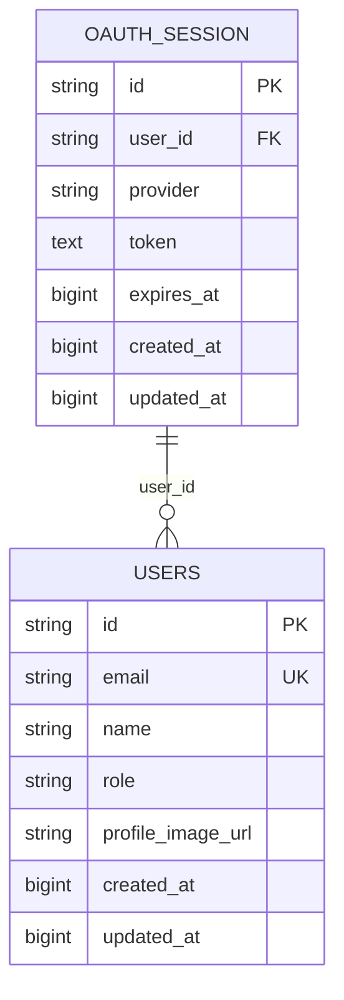

# OAuth Integration Errors

<cite>
**Referenced Files in This Document**   
- [oauth.py](file://backend/open_webui/utils/oauth.py)
- [auths.py](file://backend/open_webui/routers/auths.py)
- [oauth_sessions.py](file://backend/open_webui/models/oauth_sessions.py)
- [config.py](file://backend/open_webui/config.py)
</cite>

## Table of Contents
1. [Introduction](#introduction)
2. [OAuth2 Flow Implementation](#oauth2-flow-implementation)
3. [Common Configuration Issues](#common-configuration-issues)
4. [Provider-Specific Quirks](#provider-specific-quirks)
5. [Debugging OAuth Integration](#debugging-oauth-integration)
6. [Configuration Management](#configuration-management)
7. [Error Handling and Recovery](#error-handling-and-recovery)

## Introduction
This document provides comprehensive guidance on OAuth integration errors in open-webui, focusing on the implementation of OAuth2 flows for Google, GitHub, and Microsoft providers. The system supports authorization code exchange, token refresh, and user profile retrieval through a robust OAuth framework. The documentation covers common misconfigurations, provider-specific behaviors, debugging techniques, and configuration management for OAuth settings in environment variables and database storage.

**Section sources**
- [oauth.py](file://backend/open_webui/utils/oauth.py#L1-L1581)
- [auths.py](file://backend/open_webui/routers/auths.py#L1-L1185)

## OAuth2 Flow Implementation



**Diagram sources**
- [oauth.py](file://backend/open_webui/utils/oauth.py#L1263-L1581)
- [auths.py](file://backend/open_webui/routers/auths.py#L753-L829)

The OAuth2 flow in open-webui follows the standard authorization code grant type with PKCE (Proof Key for Code Exchange) support. When a user initiates login via an OAuth provider, the backend redirects to the provider's authorization endpoint with appropriate parameters. After user authentication and consent, the provider redirects back to the application's callback endpoint with an authorization code. The backend then exchanges this code for an access token and retrieves user profile information.

Token refresh is handled automatically when tokens approach expiration. The system checks if a token will expire within 5 minutes and initiates a refresh request to the provider's token endpoint using the stored refresh token. This ensures uninterrupted service for users with active sessions.



**Diagram sources**
- [oauth.py](file://backend/open_webui/utils/oauth.py#L718-L804)
- [auths.py](file://backend/open_webui/routers/auths.py#L507-L632)

## Common Configuration Issues

### Redirect URI Mismatch
One of the most common OAuth integration errors is incorrect redirect URI configuration. The redirect URI must exactly match what is registered with the OAuth provider. In open-webui, the redirect URI is constructed dynamically based on the application's base URL and the provider-specific endpoint.

For Google OAuth, the redirect URI should be:
```
https://your-domain.com/oauth/callback/google
```

For Microsoft OAuth:
```
https://your-domain.com/oauth/callback/microsoft
```

For GitHub OAuth:
```
https://your-domain.com/oauth/callback/github
```

The system automatically generates these URIs, but they can be overridden using environment variables like `GOOGLE_REDIRECT_URI`, `MICROSOFT_REDIRECT_URI`, and `GITHUB_CLIENT_REDIRECT_URI`.

### Client Secret and ID Errors
Misconfigured client secrets or IDs will prevent successful authentication. These values must be correctly set in the environment variables:

- `GOOGLE_CLIENT_ID` and `GOOGLE_CLIENT_SECRET` for Google
- `MICROSOFT_CLIENT_ID` and `MICROSOFT_CLIENT_SECRET` for Microsoft
- `GITHUB_CLIENT_ID` and `GITHUB_CLIENT_SECRET` for GitHub

The system validates these credentials during the OAuth client registration process and logs appropriate error messages if they are missing or invalid.

### Scope Permission Issues
Insufficient scope permissions can lead to incomplete user profile retrieval or API access failures. The default scopes for each provider are:

- **Google**: `openid email profile` (configurable via `GOOGLE_OAUTH_SCOPE`)
- **Microsoft**: `openid email profile` (configurable via `MICROSOFT_OAUTH_SCOPE`)
- **GitHub**: `user:email read:user` (configurable via `GITHUB_CLIENT_SCOPE`)

If additional API access is required, these scopes should be expanded accordingly. For example, to access GitHub repositories, add `repo` scope.

**Section sources**
- [config.py](file://backend/open_webui/config.py#L632-L829)
- [oauth.py](file://backend/open_webui/utils/oauth.py#L300-L302)

## Provider-Specific Quirks

### Google OAuth
Google's OAuth implementation has several specific characteristics:

1. **Token Revocation**: When a user revokes access through their Google account settings, subsequent token refresh attempts will fail with an "invalid_grant" error. The system automatically detects this condition and removes the invalid OAuth session.

2. **Email Retrieval**: Google typically includes the user's email in the ID token. However, if the email is not verified, it may not be included. The system handles this by treating missing email as an error condition.

3. **Discovery Endpoint**: Google uses a well-known OpenID Connect configuration endpoint:
   ```
   https://accounts.google.com/.well-known/openid-configuration
   ```

### GitHub OAuth
GitHub presents unique challenges in its OAuth implementation:

1. **SSO Requirements**: For organizations with SSO (Single Sign-On) enabled, users must authorize the application through their organization's SSO provider. This requires additional handling as the standard OAuth flow may redirect to an SSO consent screen.

2. **Email Privacy**: GitHub users can choose to keep their email address private. In such cases, the email field in the user profile will be empty. The system addresses this by making an additional API call to the `/user/emails` endpoint with the access token to retrieve the user's email addresses.

3. **Custom Endpoints**: Unlike standard OpenID Connect providers, GitHub uses custom endpoints:
   - Authorization: `https://github.com/login/oauth/authorize`
   - Token: `https://github.com/login/oauth/access_token`
   - User Info: `https://api.github.com/user`



**Diagram sources**
- [oauth.py](file://backend/open_webui/utils/oauth.py#L1342-L1380)
- [auths.py](file://backend/open_webui/routers/auths.py#L219-L299)

### Microsoft OAuth
Microsoft's OAuth implementation has several distinctive features:

1. **Tenant-Specific Configuration**: Microsoft OAuth requires a tenant ID, which is used to construct the OpenID Connect configuration URL:
   ```
   https://login.microsoftonline.com/{tenant-id}/v2.0/.well-known/openid-configuration?appid={client-id}
   ```

2. **Graph API Integration**: While the basic user info is available through the OpenID Connect userinfo endpoint, additional profile information may require calls to Microsoft Graph API.

3. **Picture URL**: Microsoft provides a direct endpoint for retrieving user profile pictures, which is configured via `MICROSOFT_CLIENT_PICTURE_URL`.

**Section sources**
- [config.py](file://backend/open_webui/config.py#L660-L687)
- [oauth.py](file://backend/open_webui/utils/oauth.py#L1418-L1433)

## Debugging OAuth Integration

### Tracing OAuth Handshakes
To debug OAuth handshake issues, enable detailed logging by setting the appropriate log level in the environment. The OAuth module uses structured logging to track each step of the authentication process:

1. **Authorization Request**: Logs the redirect to the provider's authorization endpoint
2. **Callback Processing**: Logs the receipt of the authorization code
3. **Token Exchange**: Logs the request and response for token exchange
4. **User Profile Retrieval**: Logs the user information retrieved from the provider
5. **Session Creation**: Logs the creation of the OAuth session in the database

Common error patterns to look for:
- `Missing state parameter`: Indicates a potential CSRF attack or session expiration
- `Invalid_grant`: Typically means the authorization code has already been used or expired
- `Unauthorized`: Usually indicates incorrect client credentials

### Inspecting Callback Payloads
When debugging callback issues, it's essential to inspect the actual payloads being exchanged. The system provides error handling that captures and sanitizes error messages for user display while logging the full details for debugging:

```python
def _build_oauth_callback_error_message(e: Exception) -> str:
    """
    Produce a user-facing callback error string with actionable context.
    Keeps the message short and strips newlines for safe redirect usage.
    """
    if isinstance(e, OAuth2Error):
        parts = [p for p in [e.error, e.description] if p]
        detail = " - ".join(parts)
    elif isinstance(e, HTTPException):
        detail = e.detail if isinstance(e.detail, str) else str(e.detail)
    elif isinstance(e, aiohttp.ClientResponseError):
        detail = f"Upstream provider returned {e.status}: {e.message}"
    # ... additional error type handling
```

This function ensures that users receive meaningful error messages without exposing sensitive system information.

### Handling Provider API Rate Limits
OAuth providers implement rate limiting to prevent abuse. The open-webui system handles these limits through:

1. **Retry Logic**: For transient errors, the system may implement exponential backoff retries
2. **Caching**: User profile information is cached in the application's OAuth session
3. **Error Detection**: The system identifies rate limit errors from provider responses and logs them appropriately

When a rate limit is encountered, the provider typically returns a 429 status code or includes rate limit information in the response headers. The application should gracefully handle these conditions by informing the user and suggesting they try again later.

**Section sources**
- [oauth.py](file://backend/open_webui/utils/oauth.py#L167-L195)
- [oauth.py](file://backend/open_webui/utils/oauth.py#L552-L597)

## Configuration Management

### Environment Variables
OAuth configuration is primarily managed through environment variables, which are loaded at application startup:



**Diagram sources**
- [config.py](file://backend/open_webui/config.py#L632-L829)
- [env.py](file://backend/open_webui/env.py)

These variables are used to configure the OAuth providers during application initialization. The `load_oauth_providers()` function in `config.py` checks for the presence of required variables and registers each provider accordingly.

### Database Storage
OAuth sessions are securely stored in the database with encryption:



**Diagram sources**
- [oauth_sessions.py](file://backend/open_webui/models/oauth_sessions.py#L25-L43)
- [users.py](file://backend/open_webui/models/users.py)

The OAuth session table stores encrypted tokens using Fernet symmetric encryption with a key derived from `OAUTH_SESSION_TOKEN_ENCRYPTION_KEY`. This ensures that sensitive token information is protected at rest.

## Error Handling and Recovery

The system implements comprehensive error handling for OAuth integration issues:

1. **Graceful Degradation**: When OAuth authentication fails, the system provides meaningful error messages to users while logging detailed information for administrators.

2. **Session Cleanup**: If token refresh fails (e.g., due to revocation), the system automatically removes the invalid OAuth session to prevent repeated failed attempts.

3. **Fallback Mechanisms**: For providers like GitHub where email might not be available in the initial profile, the system implements fallback mechanisms to retrieve required information.

4. **Security Protections**: The system includes protections against common OAuth vulnerabilities such as CSRF attacks through state parameter validation.

The error handling framework converts various exception types into user-friendly messages while preserving the underlying details for debugging purposes. This balance ensures a good user experience without compromising security or debuggability.

**Section sources**
- [oauth.py](file://backend/open_webui/utils/oauth.py#L1507-L1522)
- [oauth_sessions.py](file://backend/open_webui/models/oauth_sessions.py#L108-L144)