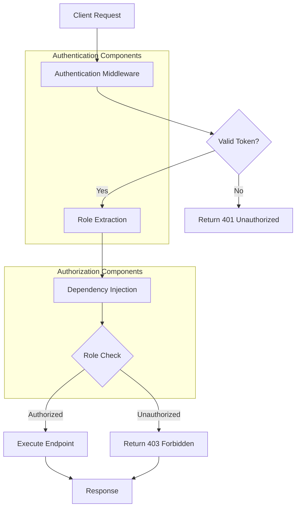
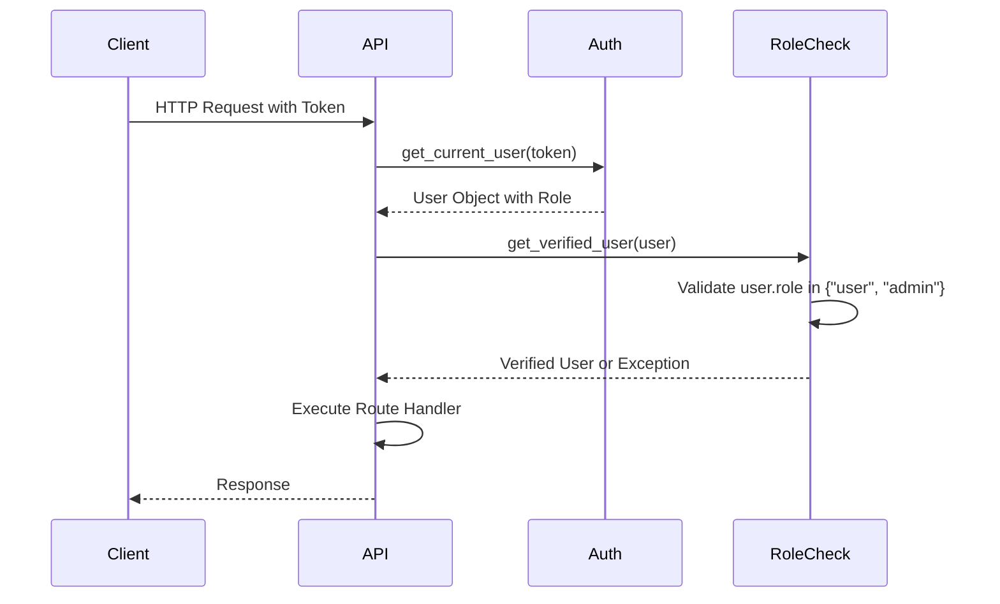
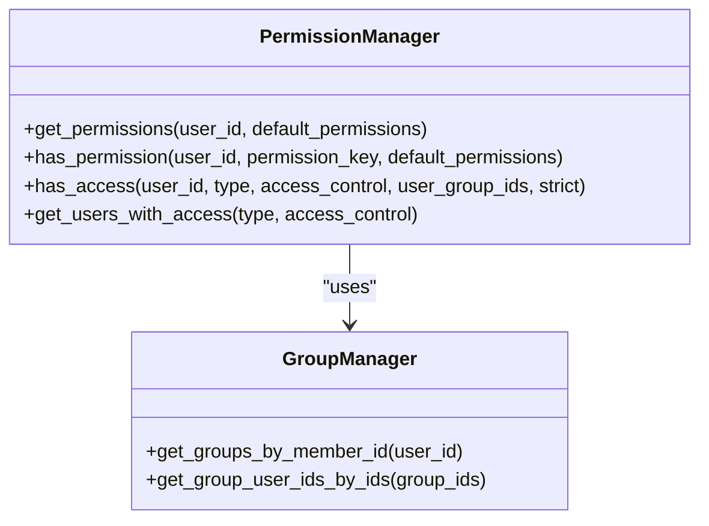
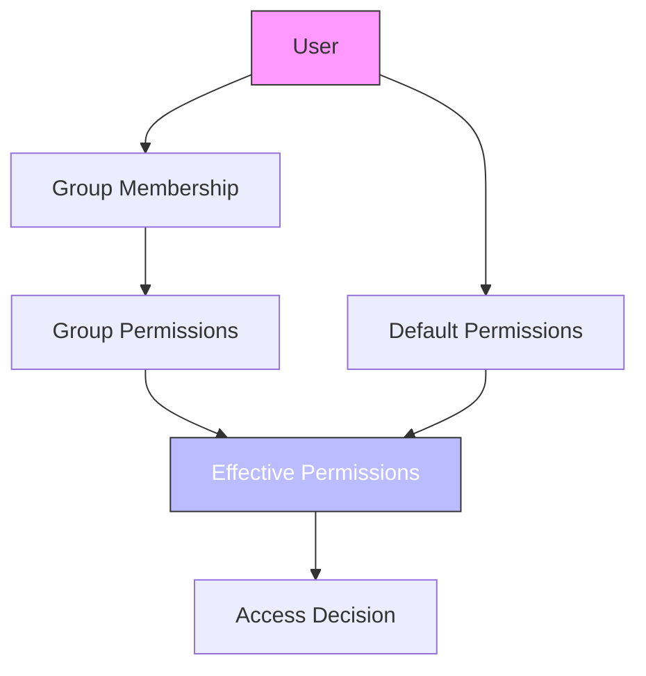

# RBAC Authorization Errors

<cite>
**Referenced Files in This Document**   
- [access_control.py](file://backend/open_webui/utils/access_control.py)
- [auth.py](file://backend/open_webui/utils/auth.py)
- [users.py](file://backend/open_webui/routers/users.py)
- [billing.py](file://backend/open_webui/routers/billing.py)
- [admin_billing.py](file://backend/open_webui/routers/admin_billing.py)
- [models.py](file://backend/open_webui/models/users.py)
- [config.py](file://backend/open_webui/config.py)
- [constants.py](file://backend/open_webui/constants.py)
- [Groups.svelte](file://src/lib/components/admin/Users/Groups.svelte)
</cite>

## Table of Contents
1. [Introduction](#introduction)
2. [Role System Implementation](#role-system-implementation)
3. [Role-Based Access Control Architecture](#role-based-access-control-architecture)
4. [Role Enforcement in API Endpoints](#role-enforcement-in-api-endpoints)
5. [Protected Routes Analysis](#protected-routes-analysis)
6. [Role Validation Utilities](#role-validation-utilities)
7. [Common Authorization Issues](#common-authorization-issues)
8. [Debugging Authorization Decisions](#debugging-authorization-decisions)
9. [Role Policy Configuration](#role-policy-configuration)
10. [Group-Based Access Control](#group-based-access-control)

## Introduction
This document provides a comprehensive analysis of Role-Based Access Control (RBAC) authorization errors in open-webui. It examines the implementation of the role system, including admin, user, and guest permissions, and details how role checks are enforced through dependency injection and middleware. The documentation covers protected routes across various routers, role validation utilities, common issues, debugging techniques, and configuration of role policies with group membership integration.

## Role System Implementation

The open-webui application implements a role-based access control system with three primary roles: admin, user, and guest (pending). The role system is defined in the user model and enforced throughout the application via middleware and dependency injection.

The role implementation follows a hierarchical permission model where:
- **Admin**: Full access to all system resources and administrative functions
- **User**: Standard access to application features with limited administrative capabilities
- **Guest/Pending**: Restricted access with limited functionality until fully registered

User roles are stored in the database as part of the User model and are included in authentication tokens for quick access during request processing. The role system integrates with both JWT-based authentication and API key authentication, ensuring consistent role enforcement across different authentication methods.

**Section sources**
- [models.py](file://backend/open_webui/models/users.py#L48-L83)
- [auth.py](file://backend/open_webui/utils/auth.py#L403-L418)
- [constants.py](file://backend/open_webui/constants.py#L55-L58)

## Role-Based Access Control Architecture

The RBAC architecture in open-webui is implemented through a combination of middleware, dependency injection, and utility functions that work together to enforce role-based access policies.



**Diagram sources**
- [auth.py](file://backend/open_webui/utils/auth.py#L289-L418)
- [access_control.py](file://backend/open_webui/utils/access_control.py#L71-L106)

The architecture follows a layered approach:
1. **Authentication Layer**: Validates tokens and extracts user information including roles
2. **Authorization Layer**: Enforces role-based access policies through dependency injection
3. **Application Layer**: Implements business logic with role-appropriate functionality

This separation of concerns ensures that authentication and authorization concerns are properly encapsulated while providing a consistent interface for role enforcement across the application.

## Role Enforcement in API Endpoints

Role enforcement in API endpoints is implemented through dependency injection using FastAPI's Depends functionality. The system provides several pre-defined dependency functions that can be used as route decorators to enforce role requirements.



**Diagram sources**
- [auth.py](file://backend/open_webui/utils/auth.py#L403-L418)
- [users.py](file://backend/open_webui/routers/users.py#L99-L103)

The primary role enforcement functions are:
- `get_current_user`: Extracts user information from authentication tokens
- `get_verified_user`: Ensures the user has either 'user' or 'admin' role
- `get_admin_user`: Restricts access to users with 'admin' role only

These functions are used as dependencies in route definitions, allowing for declarative role enforcement at the endpoint level. When a user without the required role attempts to access a protected endpoint, the system raises an HTTPException with status code 401 Unauthorized and a descriptive error message.

**Section sources**
- [auth.py](file://backend/open_webui/utils/auth.py#L403-L418)
- [users.py](file://backend/open_webui/routers/users.py#L99-L103)
- [billing.py](file://backend/open_webui/routers/billing.py#L113-L114)

## Protected Routes Analysis

The open-webui application implements role-based protection across various routers, with different levels of access control depending on the sensitivity of the functionality.

### Admin Router Protection
The admin router contains endpoints that are exclusively accessible to users with the admin role. These endpoints typically involve system configuration, user management, and billing plan administration.

```python
@router.post("/plans", response_model=PlanModel)
async def create_plan(
    request: CreatePlanRequest,
    user=Depends(get_admin_user),
):
    """Create new subscription plan (admin only)"""
```

**Section sources**
- [admin_billing.py](file://backend/open_webui/routers/admin_billing.py#L110-L114)
- [billing.py](file://backend/open_webui/routers/billing.py#L110-L114)

### Billing Router Protection
The billing router implements a tiered access model:
- Admin users can create and modify plans
- Verified users can view their own subscription and usage

```python
@router.get("/plans/{plan_id}", response_model=PlanModel)
async def get_plan(plan_id: str, user=Depends(get_verified_user)):
    """Get specific plan by ID"""

@router.post("/plans", response_model=PlanModel)
async def create_plan(
    request: CreatePlanRequest,
    user=Depends(get_admin_user),
):
    """Create new subscription plan (admin only)"""
```

**Section sources**
- [billing.py](file://backend/open_webui/routers/billing.py#L99-L114)

### Users Router Protection
The users router implements fine-grained access control based on user roles and ownership:

```python
@router.get("/all", response_model=UserInfoListResponse)
async def get_all_users(
    user=Depends(get_admin_user),
):
    return Users.get_users()

@router.get("/{user_id}/active", response_model=dict)
async def get_user_active_status_by_id(user_id: str, user=Depends(get_verified_user)):
    return {
        "active": Users.is_user_active(user_id),
    }
```

The router distinguishes between:
- `get_admin_user`: Required for accessing all user data
- `get_verified_user`: Required for accessing specific user information

This ensures that only administrators can view comprehensive user information while regular users can only access their own status information.

**Section sources**
- [users.py](file://backend/open_webui/routers/users.py#L100-L103)
- [users.py](file://backend/open_webui/routers/users.py#L484-L489)

## Role Validation Utilities

The open-webui application provides a comprehensive set of utilities for role validation and permission checking, primarily implemented in the access_control.py module.

### Permission Management
The system implements a hierarchical permission model that combines user roles with group-based permissions:



**Diagram sources**
- [access_control.py](file://backend/open_webui/utils/access_control.py#L10-L174)
- [groups.py](file://backend/open_webui/models/groups.py#L36-L84)

The key utility functions are:

#### get_permissions
Combines permissions from all groups a user belongs to, using the most permissive value when conflicts arise. The function recursively combines nested permission structures and ensures all fields from default permissions are present.

#### has_permission
Checks if a user has a specific permission by examining both group permissions and default permissions. Permission keys can be hierarchical and separated by dots, allowing for fine-grained permission control.

#### has_access
Determines if a user has access to a resource based on access control settings, user group membership, and strict mode requirements. This function is used for resource-level access control beyond simple role checking.

#### get_users_with_access
Retrieves all users who have access to a specific resource, useful for audit and reporting purposes.

These utilities provide a flexible foundation for implementing complex access control policies that go beyond simple role-based restrictions.

**Section sources**
- [access_control.py](file://backend/open_webui/utils/access_control.py#L10-L174)

## Common Authorization Issues

The open-webui RBAC system may encounter several common authorization issues that administrators and developers should be aware of.

### Role Assignment Failures
Role assignment failures can occur during user creation or role modification. The most common causes include:

1. **Primary Admin Protection**: The system prevents modification of the primary admin user by other admins to maintain system security:
```python
if user_id == first_user.id:
    if session_user.id != user_id:
        raise HTTPException(
            status_code=status.HTTP_403_FORBIDDEN,
            detail=ERROR_MESSAGES.ACTION_PROHIBITED,
        )
```

2. **Role Validation**: The system validates role changes to prevent unauthorized privilege escalation.

**Section sources**
- [users.py](file://backend/open_webui/routers/users.py#L503-L519)

### Permission Escalation Attempts
The system protects against permission escalation attempts through several mechanisms:

1. **Role Hierarchy Enforcement**: Only admins can modify user roles, preventing users from elevating their own privileges
2. **Primary Admin Lock**: The primary admin cannot change their own role to a non-admin role
3. **Access Prohibited Messages**: Clear error messages inform users when actions are prohibited

### Group-Based Access Control Conflicts
Group-based access control can lead to conflicts when users belong to multiple groups with conflicting permissions. The system resolves these conflicts by:

1. **Most Permissive Rule**: When combining permissions from multiple groups, the system uses the most permissive value (True > False)
2. **Hierarchical Permission Keys**: Permissions can be organized hierarchically using dot notation, allowing for fine-grained control
3. **Default Permission Fallback**: If a permission is not explicitly set in any group, the system falls back to default permissions

These conflict resolution strategies ensure predictable behavior even in complex group membership scenarios.

**Section sources**
- [access_control.py](file://backend/open_webui/utils/access_control.py#L38-L54)
- [users.py](file://backend/open_webui/routers/users.py#L514-L518)

## Debugging Authorization Decisions

Effective debugging of authorization decisions requires understanding how to trace the authorization process and inspect relevant data.

### Tracing Authorization Decisions
The system provides several mechanisms for tracing authorization decisions:

1. **Structured Logging**: The auth.py module includes detailed logging of authentication and authorization steps
2. **Token Inspection**: Authentication tokens contain user role information that can be inspected
3. **Audit Trails**: The system maintains records of access attempts and authorization decisions

### Inspecting User Role Payloads
User role information is available in multiple locations:

1. **Authentication Tokens**: JWT tokens include the user role in the payload
2. **Request Objects**: The user object is injected into request handlers with role information
3. **Database Records**: User roles are stored in the database and can be queried directly

### Diagnosing Access Denial
When diagnosing access denial for specific endpoints, follow these steps:

1. **Verify Authentication**: Ensure the request includes a valid authentication token
2. **Check User Role**: Confirm the user has the required role for the endpoint
3. **Review Endpoint Requirements**: Examine the route definition to understand the required dependencies
4. **Inspect Error Messages**: The system returns descriptive error messages that can help identify the specific authorization failure

The most common causes of access denial are:
- Missing or invalid authentication tokens
- Insufficient user roles for the requested operation
- Attempting to modify protected user accounts
- Expired or revoked authentication tokens

**Section sources**
- [auth.py](file://backend/open_webui/utils/auth.py#L289-L418)
- [constants.py](file://backend/open_webui/constants.py#L55-L58)
- [access_control.py](file://backend/open_webui/utils/access_control.py#L71-L106)

## Role Policy Configuration

Role policies in open-webui are configured through a combination of environment variables, database settings, and code-level defaults.

### Default User Permissions
The system defines default user permissions in the config.py file:

```python
DEFAULT_USER_PERMISSIONS = {
    # Default permissions for user role
    "chat": {
        "create": True,
        "read": True,
        "update": True,
        "delete": True
    },
    "files": {
        "upload": True,
        "download": True,
        "delete": True
    },
    # Additional default permissions
}
```

These default permissions serve as the baseline for user access and can be overridden by group-specific permissions.

### Environment Configuration
Role-based access control can be configured through environment variables:

- `WEBUI_AUTH`: Enables or disables authentication requirements
- `ENABLE_PASSWORD_VALIDATION`: Controls password validation requirements
- `ADMIN_EMAIL`: Specifies the primary admin email address

### Persistent Configuration
The system supports persistent configuration through the database, allowing role policies to be modified at runtime without requiring application restarts.

The configuration system follows a hierarchy:
1. Environment variables (highest precedence)
2. Database-stored configuration
3. Code-level defaults (lowest precedence)

This allows administrators to override default behavior while maintaining a stable baseline configuration.

**Section sources**
- [config.py](file://backend/open_webui/config.py#L1430-L1450)
- [auth.py](file://backend/open_webui/utils/auth.py#L30-L42)

## Group-Based Access Control

The open-webui application implements a sophisticated group-based access control system that extends the basic role model with more granular permission management.

### Group Permission Model
The group permission model allows administrators to define permissions at the group level, which are then inherited by group members:



**Diagram sources**
- [access_control.py](file://backend/open_webui/utils/access_control.py#L56-L64)
- [groups.py](file://backend/open_webui/models/groups.py#L36-L84)

### Permission Inheritance
The system implements permission inheritance through the following rules:

1. **Group Permission Precedence**: If a permission is explicitly set in any group, that value takes precedence
2. **Most Permissive Rule**: When a user belongs to multiple groups with conflicting permissions, the most permissive value (True) is used
3. **Default Permission Fallback**: If a permission is not set in any group, the system falls back to default permissions

### Admin Interface for Group Management
The frontend provides an administrative interface for managing groups and permissions:

```javascript
// Svelte component for group management
$: filteredGroups = groups.filter((user) => {
    if (search === '') {
        return true;
    } else {
        let name = user.name.toLowerCase();
        const query = search.toLowerCase();
        return name.includes(query);
    }
});

onMount(async () => {
    if ($user?.role !== 'admin') {
        await goto('/');
        return;
    }
});
```

This interface enforces role-based access by redirecting non-admin users away from the group management page.

The group-based access control system provides administrators with flexible tools for managing permissions across user groups while maintaining the security of the overall RBAC framework.

**Section sources**
- [access_control.py](file://backend/open_webui/utils/access_control.py#L38-L67)
- [Groups.svelte](file://src/lib/components/admin/Users/Groups.svelte#L88-L90)
- [groups.py](file://backend/open_webui/models/groups.py#L36-L84)