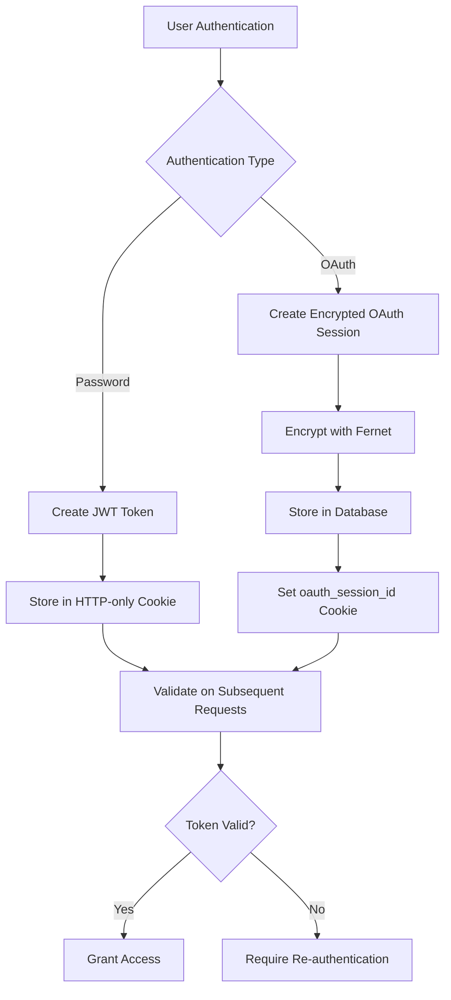
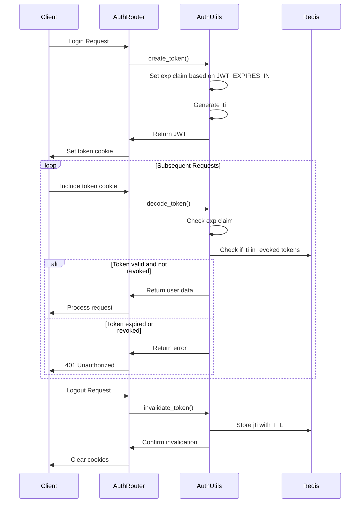

# Session Management Errors

<cite>
**Referenced Files in This Document**   
- [auths.py](file://backend/open_webui/routers/auths.py)
- [auth.py](file://backend/open_webui/utils/auth.py)
- [middleware.py](file://backend/open_webui/utils/middleware.py)
- [env.py](file://backend/open_webui/env.py)
- [main.py](file://backend/open_webui/main.py)
- [oauth_sessions.py](file://backend/open_webui/models/oauth_sessions.py)
- [redis.py](file://backend/open_webui/utils/redis.py)
</cite>

## Table of Contents
1. [Introduction](#introduction)
2. [Session Creation and Authentication Flows](#session-creation-and-authentication-flows)
3. [Session Persistence and Storage Mechanisms](#session-persistence-and-storage-mechanisms)
4. [Session Expiration and Token Management](#session-expiration-and-token-management)
5. [Common Session Errors and Issues](#common-session-errors-and-issues)
6. [Configuration Options for Session Security](#configuration-options-for-session-security)
7. [Debugging Session Lifecycle and Security Issues](#debugging-session-lifecycle-and-security-issues)
8. [Conclusion](#conclusion)

## Introduction
This document provides a comprehensive analysis of session management errors in Open WebUI, focusing on the FastAPI backend implementation. It covers the complete session lifecycle including creation, persistence, and expiration mechanisms. The documentation details common issues such as session cookie misconfiguration, Redis storage failures, and authentication token validation problems. By examining the auth router's login/logout flows and session middleware, this guide offers insights into how session data is serialized and stored, including user context and authentication state. The document also provides debugging steps for tracing session lifecycle, inspecting cookie attributes, and diagnosing session fixation or hijacking vulnerabilities, along with configuration options for session timeout, secure flags, and cross-origin behavior.

## Session Creation and Authentication Flows

The session management system in Open WebUI implements a comprehensive authentication flow that handles both traditional password-based authentication and OAuth-based login methods. The system creates sessions through multiple endpoints, with the primary authentication flow occurring in the `signin` endpoint of the auth router. When a user successfully authenticates, the system generates a JWT (JSON Web Token) containing the user's ID and other relevant information. This token is then stored in an HTTP-only cookie named "token" with appropriate security flags.

The authentication process begins with credential validation, where the system verifies the user's email and password against the stored hashed credentials. Upon successful validation, the system creates a token using the `create_token` function from the auth utility module, which includes an expiration timestamp and a unique JWT ID (jti) for token revocation tracking. The token is then set as a cookie in the response with configurable SameSite and Secure attributes, allowing the frontend to maintain the user's authenticated state across requests.

For OAuth-based authentication, the system implements a more complex flow that involves external identity providers. When a user authenticates via OAuth, the system creates an OAuth session record in the database, storing the access token, refresh token, and ID token in an encrypted format. This encrypted token data is stored in the `oauth_session` table with a unique session ID that is also set as a cookie (`oauth_session_id`) to maintain the OAuth session state.

**Section sources**
- [auths.py](file://backend/open_webui/routers/auths.py#L507-L632)
- [auth.py](file://backend/open_webui/utils/auth.py#L194-L205)
- [main.py](file://backend/open_webui/main.py#L665-L670)

## Session Persistence and Storage Mechanisms

Open WebUI employs a multi-layered approach to session persistence, combining JWT-based authentication tokens with Redis-backed session storage for enhanced security and scalability. The primary session mechanism relies on JWT tokens stored in HTTP-only cookies, which contain the user's authentication state and are validated on each request. These tokens are signed with a secret key (WEBUI_SECRET_KEY) and include standard claims such as expiration time (exp) and a unique identifier (jti) for token revocation.

For OAuth sessions, the system implements a more robust persistence mechanism using database storage with encryption. The OAuth session data, including access tokens and refresh tokens, is encrypted using Fernet symmetric encryption before being stored in the database. The encryption key is derived from the OAUTH_SESSION_TOKEN_ENCRYPTION_KEY environment variable, ensuring that sensitive OAuth credentials are protected at rest. This encrypted data is stored in the `oauth_session` table with indexes on user_id and expires_at for efficient retrieval and cleanup.

The system also leverages Redis for additional session-related functionality, particularly for token revocation and rate limiting. When a user logs out or a token is invalidated, the system stores the token's jti in Redis with a TTL (time-to-live) matching the token's remaining validity period. This allows the system to efficiently check for revoked tokens without requiring database queries on every authentication attempt. The Redis connection is configured with support for Redis Sentinel and Redis Cluster, providing high availability and fault tolerance for session data.

**Diagram sources**
- [oauth_sessions.py](file://backend/open_webui/models/oauth_sessions.py#L24-L43)
- [auth.py](file://backend/open_webui/utils/auth.py#L231-L251)
- [redis.py](file://backend/open_webui/utils/redis.py#L117-L138)

## Session Expiration and Token Management

The session expiration mechanism in Open WebUI is designed to balance security with user convenience through configurable token lifetimes and refresh capabilities. The system implements token expiration through the JWT standard's expiration claim (exp), which is set when the token is created based on the JWT_EXPIRES_IN configuration parameter. This parameter can be specified in various time formats (e.g., "2h", "30m", "7d") and is parsed into a timedelta object that determines the token's validity period.

When a token is created, the system calculates the expiration timestamp by adding the parsed duration to the current time in UTC. This expiration timestamp is included in the JWT payload and is used to validate the token on subsequent requests. The system checks token expiration in multiple locations, including the `get_session_user` endpoint and the `get_current_user` dependency function. If a token is found to be expired, the system returns a 401 Unauthorized response, requiring the user to re-authenticate.

For token management, the system implements a token invalidation mechanism that allows for immediate revocation of sessions. When a user logs out or an administrator revokes access, the system stores the token's jti (JWT ID) in Redis with a TTL equal to the remaining validity period of the token. This approach ensures that even if a token is still technically valid according to its expiration timestamp, it will be rejected if its jti is found in the revoked tokens set. This mechanism provides a way to immediately invalidate sessions without requiring changes to the token expiration policy.

The system also handles token refresh implicitly through the session cookie mechanism. When a valid but soon-to-expire token is used, the system automatically generates a new token with a fresh expiration timestamp and updates the session cookie. This creates a seamless user experience where sessions are extended as long as the user remains active, without requiring explicit token refresh requests from the client.

**Diagram sources**
- [auth.py](file://backend/open_webui/utils/auth.py#L194-L242)
- [auths.py](file://backend/open_webui/routers/auths.py#L753-L779)
- [redis.py](file://backend/open_webui/utils/redis.py#L117-L138)

## Common Session Errors and Issues

Open WebUI's session management system can encounter several common errors and issues that affect user authentication and session persistence. One frequent issue is session cookie misconfiguration, which occurs when the cookie attributes (SameSite, Secure, HttpOnly) are not properly set according to the deployment environment. For example, if the WEBUI_AUTH_COOKIE_SECURE environment variable is not correctly configured for HTTPS deployments, browsers may reject the session cookie, preventing authentication from working properly.

Another common issue is Redis storage failures, which can disrupt session validation and token revocation functionality. When Redis is unavailable or improperly configured, the system cannot check for revoked tokens or maintain rate limiting state, potentially leading to security vulnerabilities or denial of service conditions. The system attempts to handle Redis failures gracefully by continuing authentication when Redis is unavailable, but this means that revoked tokens may still be accepted until they naturally expire.

CSRF (Cross-Site Request Forgery) protection issues can also arise, particularly when the session middleware configuration is not aligned with the application's deployment topology. The system uses SameSite cookie attributes as a primary defense against CSRF attacks, but improper configuration of the WEBUI_AUTH_COOKIE_SAME_SITE environment variable can leave the application vulnerable. Additionally, when using OAuth authentication, the system must properly validate the OAuth state parameter to prevent CSRF attacks during the OAuth callback process.

Token validation problems are another category of common issues, often related to clock skew between servers or incorrect token signing keys. If the system clock on the authentication server is significantly different from client clocks, tokens may appear to be expired prematurely or accepted after their expiration. Similarly, if the WEBUI_SECRET_KEY is changed without proper migration procedures, all existing tokens will become invalid, forcing all users to re-authenticate.

OAuth-specific issues include token refresh failures and provider configuration errors. When an OAuth access token expires, the system attempts to use the refresh token to obtain a new access token, but this process can fail if the refresh token has been revoked by the provider or if the provider's token endpoint is unavailable. Additionally, incorrect configuration of OAuth provider endpoints (authorization, token, userinfo) can prevent successful authentication.

**Section sources**
- [auths.py](file://backend/open_webui/routers/auths.py#L121-L125)
- [auth.py](file://backend/open_webui/utils/auth.py#L216-L228)
- [env.py](file://backend/open_webui/env.py#L462-L478)
- [redis.py](file://backend/open_webui/utils/redis.py#L127-L129)

## Configuration Options for Session Security

Open WebUI provides several configuration options to customize session security settings according to deployment requirements and security policies. These options are primarily controlled through environment variables that can be set in the .env file or passed directly to the container/runtime environment. The most critical configuration is WEBUI_SECRET_KEY, which serves as the cryptographic key for signing JWT tokens and must be kept confidential and rotated periodically for security.

For cookie security, the system offers multiple configurable parameters. WEBUI_AUTH_COOKIE_SAME_SITE determines the SameSite attribute of the session cookie, with valid values of "lax", "strict", or "none". This setting controls whether the cookie is sent with cross-site requests and helps prevent CSRF attacks. WEBUI_AUTH_COOKIE_SECURE controls whether the Secure flag is set on the cookie, restricting transmission to HTTPS connections only. This should be enabled in production environments to prevent session token exposure over unencrypted connections.

The session expiration policy is controlled by the JWT_EXPIRES_IN environment variable, which accepts duration strings like "2h" (2 hours), "30m" (30 minutes), or "7d" (7 days). This setting determines how long authentication tokens remain valid before requiring re-authentication. A shorter expiration time increases security by limiting the window of opportunity for token theft, while a longer expiration improves user experience by reducing re-authentication frequency.

For OAuth session security, the system provides the OAUTH_SESSION_TOKEN_ENCRYPTION_KEY environment variable, which is used to encrypt OAuth tokens before storing them in the database. This key should be a strong, randomly generated value and can be automatically derived from the WEBUI_SECRET_KEY if not explicitly set. The system also supports Redis Sentinel and Redis Cluster configurations through REDIS_SENTINEL_HOSTS, REDIS_SENTINEL_PORT, and REDIS_CLUSTER environment variables, allowing for high-availability session storage.

Additional security configurations include REDIS_KEY_PREFIX, which allows multiple Open WebUI instances to share a Redis server by namespace isolation, and REDIS_SENTINEL_MAX_RETRY_COUNT, which controls the number of retry attempts for Redis operations during failover scenarios. These settings help ensure session reliability and security in distributed environments.

**Section sources**
- [env.py](file://backend/open_webui/env.py#L455-L478)
- [auth.py](file://backend/open_webui/utils/auth.py#L51-L52)
- [oauth_sessions.py](file://backend/open_webui/models/oauth_sessions.py#L72-L87)

## Debugging Session Lifecycle and Security Issues

Effective debugging of session management issues in Open WebUI requires a systematic approach to tracing the session lifecycle and inspecting security configurations. The first step in troubleshooting session problems is to verify the session cookie attributes in the browser's developer tools. Check that the token cookie has the expected Secure, HttpOnly, and SameSite flags set according to the environment configuration. Missing or incorrect flags often indicate configuration issues with the WEBUI_AUTH_COOKIE_SECURE or WEBUI_AUTH_COOKIE_SAME_SITE environment variables.

To trace session creation and validation, examine the server logs for authentication-related messages. The system logs detailed information about token creation, validation, and expiration at various log levels, which can be controlled through the SRC_LOG_LEVELS environment variables. Look for messages from the "AUTH" and "MAIN" log sources that indicate successful or failed authentication attempts, token expiration, and session invalidation.

For Redis-related issues, verify the Redis connection configuration and connectivity. Use the REDIS_URL environment variable to confirm the correct Redis server address and authentication credentials. Check Redis connectivity by attempting to connect with a Redis client and examining the keys in the configured namespace (using REDIS_KEY_PREFIX). Look for session-related keys such as those prefixed with "open-webui:auth:token:" which store revoked token jtis.

When investigating OAuth session issues, examine the encrypted token storage in the database. The oauth_session table contains encrypted token data that can be decrypted using the OAUTH_SESSION_TOKEN_ENCRYPTION_KEY. Verify that the encryption key is correctly configured and that the token data is being properly encrypted and decrypted. Check the expires_at timestamps to ensure they align with the OAuth provider's token expiration policies.

For CSRF protection issues, review the OAuth state parameter flow in the authentication logs. The system should generate a random state parameter for each OAuth login attempt and validate it during the callback. Missing or mismatched state parameters indicate potential CSRF protection bypasses. Additionally, verify that the session middleware is properly configured and that the session cookies are being set with appropriate SameSite attributes.

Common debugging steps include:
1. Verify environment variable configuration for session-related settings
2. Check browser developer tools for cookie attributes and network requests
3. Examine server logs for authentication and session messages
4. Test Redis connectivity and inspect session-related keys
5. Validate database schema and OAuth session records
6. Use curl or Postman to test authentication endpoints directly
7. Enable verbose logging for authentication components

**Section sources**
- [auths.py](file://backend/open_webui/routers/auths.py#L111-L140)
- [auth.py](file://backend/open_webui/utils/auth.py#L272-L367)
- [middleware.py](file://backend/open_webui/utils/middleware.py#L22-L25)
- [redis.py](file://backend/open_webui/utils/redis.py#L117-L138)

## Conclusion
The session management system in Open WebUI provides a robust foundation for user authentication and session persistence, combining JWT-based tokens with encrypted OAuth session storage and Redis-backed token revocation. The system offers comprehensive configuration options for session security, allowing administrators to tailor the authentication experience to their specific security requirements and deployment environments. By understanding the session creation, persistence, and expiration mechanisms, as well as common issues and debugging techniques, administrators can effectively manage user sessions and maintain the security of their Open WebUI deployment. The modular design of the authentication system, with clear separation between token management, session storage, and security controls, enables flexible configuration and reliable operation in various deployment scenarios.