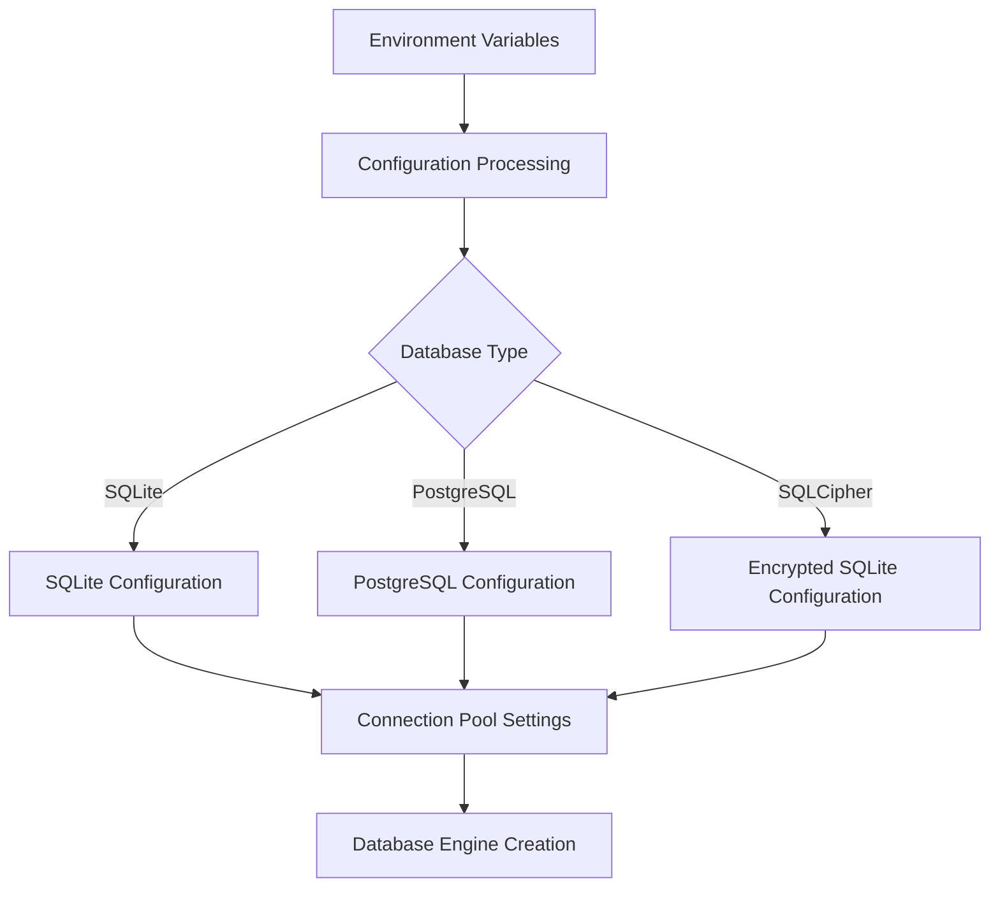
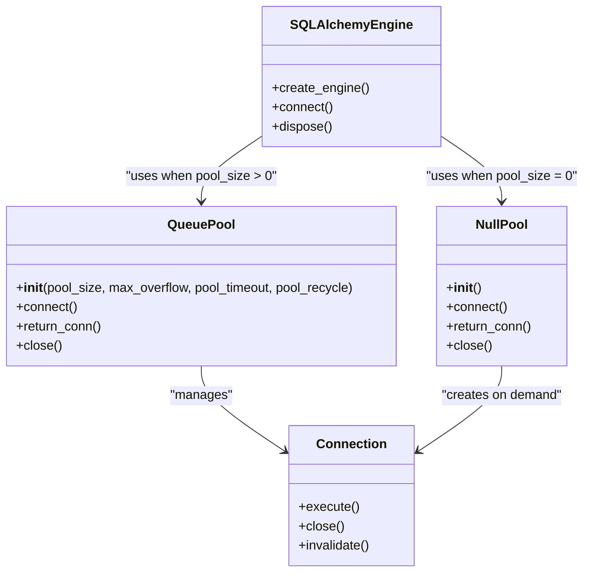
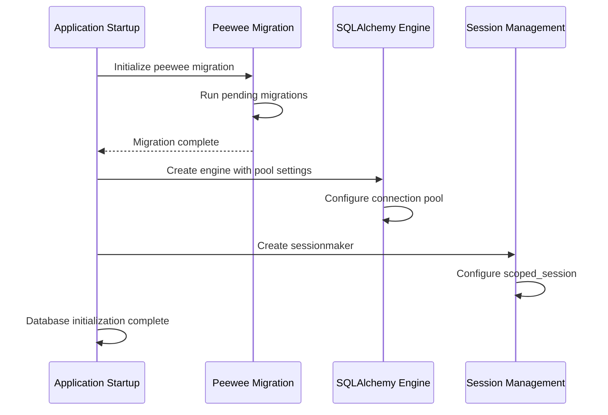
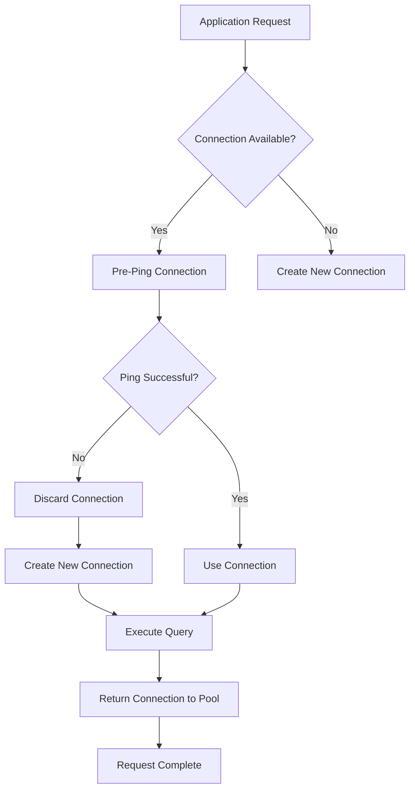

# Database Connectivity

<cite>
**Referenced Files in This Document**   
- [config.py](file://backend/open_webui/config.py)
- [db.py](file://backend/open_webui/internal/db.py)
- [env.py](file://backend/open_webui/env.py)
- [main.py](file://backend/open_webui/main.py)
- [TROUBLESHOOTING.md](file://TROUBLESHOOTING.md)
</cite>

## Table of Contents
1. [Introduction](#introduction)
2. [Database Configuration Parameters](#database-configuration-parameters)
3. [Connection Pooling with SQLAlchemy](#connection-pooling-with-sqlalchemy)
4. [Database Initialization and Lifecycle Management](#database-initialization-and-lifecycle-management)
5. [Connection Resilience and Health Monitoring](#connection-resilience-and-health-monitoring)
6. [Troubleshooting Database Connectivity Issues](#troubleshooting-database-connectivity-issues)
7. [Production Recommendations](#production-recommendations)

## Introduction

Open WebUI establishes database connectivity using SQLAlchemy as the primary ORM (Object-Relational Mapping) framework, with support for multiple database backends including PostgreSQL and SQLite. The application implements robust connection management through SQLAlchemy's connection pooling mechanisms, ensuring efficient database resource utilization and resilience against connection failures. This documentation details how Open WebUI configures, initializes, and manages database connections, covering configuration parameters, connection pooling settings, and strategies for handling connectivity issues in production environments.

The database connectivity system is designed to be flexible, supporting both simple SQLite deployments for development and robust PostgreSQL configurations for production use. The application handles database connections through a centralized configuration system that allows environment variables to control connection behavior, pool sizing, and timeout settings.

**Section sources**
- [config.py](file://backend/open_webui/config.py#L1-L800)
- [db.py](file://backend/open_webui/internal/db.py#L1-L165)
- [env.py](file://backend/open_webui/env.py#L300-L499)

## Database Configuration Parameters

Open WebUI's database connectivity is controlled through a comprehensive set of environment variables that define connection parameters and behavior. The primary configuration parameter is `DATABASE_URL`, which specifies the connection string for the database. The application automatically converts the deprecated `postgres://` protocol prefix to the SQLAlchemy-standard `postgresql://` format to ensure compatibility.

The system supports various database configuration options through environment variables:

- `DATABASE_URL`: The primary connection string specifying the database type, credentials, host, port, and database name
- `DATABASE_SCHEMA`: Optional schema name for PostgreSQL databases
- `DATABASE_POOL_SIZE`: Number of connections to maintain in the connection pool
- `DATABASE_POOL_MAX_OVERFLOW`: Maximum number of connections that can be created beyond the pool size
- `DATABASE_POOL_TIMEOUT`: Timeout in seconds for acquiring a connection from the pool
- `DATABASE_POOL_RECYCLE`: Time in seconds after which connections are recycled
- `DATABASE_ENABLE_SQLITE_WAL`: Enables SQLite Write-Ahead Logging for improved concurrency

These configuration parameters are processed in `env.py` where they are validated and converted to appropriate data types. For example, pool size parameters are converted to integers, with appropriate defaults and error handling for invalid values. The configuration system provides sensible defaults for production use while allowing customization based on deployment requirements.

**Diagram sources**
- [env.py](file://backend/open_webui/env.py#L306-L352)
- [db.py](file://backend/open_webui/internal/db.py#L83-L146)

**Section sources**
- [env.py](file://backend/open_webui/env.py#L306-L352)
- [db.py](file://backend/open_webui/internal/db.py#L83-L146)

## Connection Pooling with SQLAlchemy

Open WebUI implements connection pooling using SQLAlchemy's built-in pooling mechanisms to efficiently manage database connections. The connection pool configuration is conditional based on the `DATABASE_POOL_SIZE` setting, allowing administrators to control resource usage based on their deployment requirements.

When `DATABASE_POOL_SIZE` is set to a positive integer, the application creates a connection pool with the specified parameters:

- `pool_size`: The number of connections to maintain in the pool
- `max_overflow`: The maximum number of connections that can be created beyond the pool size
- `pool_timeout`: The number of seconds to wait before giving up on returning a connection
- `pool_recycle`: The number of seconds after which connections are recycled
- `pool_pre_ping`: Enables connection health checks before use

The application uses SQLAlchemy's `QueuePool` class for connection pooling, which maintains a pool of database connections and provides them to threads as needed. When `DATABASE_POOL_SIZE` is set to 0 or not specified, the application uses `NullPool`, which does not pool connections and instead opens and closes connections on an as-needed basis.

A critical feature of the connection pool configuration is `pool_pre_ping=True`, which enables connection health checks. Before a connection is returned from the pool, SQLAlchemy executes a lightweight "ping" query to verify the connection is still alive. If the ping fails, the connection is discarded and replaced with a new one, preventing applications from receiving stale or broken connections.

**Diagram sources**
- [db.py](file://backend/open_webui/internal/db.py#L129-L145)

**Section sources**
- [db.py](file://backend/open_webui/internal/db.py#L129-L145)

## Database Initialization and Lifecycle Management

The database initialization process in Open WebUI follows a structured sequence to ensure proper setup and migration handling. The initialization begins with peewee migration handling, which processes any legacy database schema changes before the main SQLAlchemy engine is created. This two-step migration approach allows for backward compatibility with previous versions of the application.

The database engine is created in `db.py` with different configurations based on the database type:

1. For SQLCipher-encrypted SQLite databases, a custom connection creator function is used to handle encryption
2. For standard SQLite databases, the connection is configured with thread safety settings
3. For PostgreSQL and other databases, SQLAlchemy's connection pooling is configured based on environment variables

The session management system uses SQLAlchemy's `sessionmaker` to create a factory for database sessions, with `scoped_session` ensuring thread-safe session handling in the web application context. The `get_db` function provides a context manager for database sessions, ensuring proper resource cleanup through try/finally blocks that guarantee session closure.

**Diagram sources**
- [db.py](file://backend/open_webui/internal/db.py#L80-L164)

**Section sources**
- [db.py](file://backend/open_webui/internal/db.py#L80-L164)

## Connection Resilience and Health Monitoring

Open WebUI implements several mechanisms to ensure database connection resilience and handle transient connectivity issues. The primary resilience feature is the `pool_pre_ping` setting, which performs a lightweight health check on connections before they are returned from the pool. This prevents applications from receiving stale or broken connections that might have been closed by the database server due to timeouts.

For encrypted SQLite databases using SQLCipher, the application implements custom connection handling through a creator function that establishes the encryption key upon connection. This ensures that all connections to the encrypted database are properly authenticated and secured.

The application also provides health check endpoints to monitor database connectivity:
- `/health`: Basic application health check
- `/health/db`: Database connectivity health check that executes a simple query

The database health check endpoint (`/health/db`) executes a simple SQL query (`SELECT 1;`) to verify that the database connection is functional. This endpoint can be used by monitoring systems to detect database connectivity issues and trigger appropriate alerts or recovery procedures.

In addition to these built-in mechanisms, the application logs detailed information about database connection events, including successful connections, connection errors, and pool configuration. These logs are essential for diagnosing connectivity issues and optimizing connection pool settings for specific deployment environments.

**Diagram sources**
- [main.py](file://backend/open_webui/main.py#L2306-L2309)
- [db.py](file://backend/open_webui/internal/db.py#L137)

**Section sources**
- [main.py](file://backend/open_webui/main.py#L2306-L2309)
- [db.py](file://backend/open_webui/internal/db.py#L137)

## Troubleshooting Database Connectivity Issues

When encountering database connectivity issues in Open WebUI, several common problems and their solutions should be considered:

**Connection Timeout Issues**: If experiencing connection timeouts, verify that the `DATABASE_POOL_TIMEOUT` value is appropriate for your environment. The default value is 30 seconds, but this may need adjustment based on network conditions or database server load. Also check that the database server is responsive and not overloaded.

**Maximum Connection Limits**: If receiving errors about exceeding maximum connections, review the `DATABASE_POOL_SIZE` and `DATABASE_POOL_MAX_OVERFLOW` settings. These should be configured based on the database server's maximum connection limit. For PostgreSQL, check the `max_connections` setting and ensure the application's pool settings stay within this limit.

**Network Interruptions**: For transient network issues, the connection pool's pre-ping functionality should automatically handle reconnection. However, prolonged network outages may require application restart. Ensure that the `DATABASE_POOL_RECYCLE` setting (default 3600 seconds) is appropriate to prevent connections from becoming stale during periods of inactivity.

**Authentication Problems**: If the database URL contains special characters in the password, ensure they are properly URL-encoded. The application provides a warning message if connection initialization fails, suggesting URL-encoding of special characters in passwords.

**SQLite-Specific Issues**: For SQLite databases, ensure that the `DATABASE_ENABLE_SQLITE_WAL` setting is configured appropriately. Enabling WAL mode improves concurrency but may require additional configuration for network-mounted filesystems.

The TROUBLESHOOTING.md document provides general guidance for connection issues, emphasizing the importance of verifying configuration settings and ensuring compatibility between application and database versions.

**Section sources**
- [env.py](file://backend/open_webui/env.py#L330-L338)
- [db.py](file://backend/open_webui/internal/db.py#L67-L70)
- [main.py](file://backend/open_webui/main.py#L2306-L2309)
- [TROUBLESHOOTING.md](file://TROUBLESHOOTING.md#L1-L37)

## Production Recommendations

For production deployments of Open WebUI, the following database connectivity recommendations should be followed:

1. **Use PostgreSQL**: For production environments, PostgreSQL is recommended over SQLite due to its superior concurrency handling, robustness, and scalability. SQLite is suitable for development and small-scale deployments but may encounter performance limitations under heavy load.

2. **Optimize Pool Sizing**: Configure `DATABASE_POOL_SIZE` based on the expected concurrent user load. A good starting point is 5-10 connections, adjusting based on monitoring and performance testing. Set `DATABASE_POOL_MAX_OVERFLOW` to allow for traffic spikes while preventing excessive connection creation.

3. **Monitor Connection Metrics**: Regularly monitor database connection metrics, including active connections, connection wait times, and connection errors. This helps identify potential bottlenecks and optimize pool configuration.

4. **Implement Connection Health Checks**: Utilize the provided health check endpoints (`/health` and `/health/db`) in monitoring systems to detect connectivity issues early. Consider implementing automated alerts for failed health checks.

5. **Regular Backups**: For SQLite deployments, ensure regular backups are performed, especially when using WAL mode which creates additional journal files. For PostgreSQL, implement a robust backup strategy using pg_dump or similar tools.

6. **Secure Database Credentials**: Store database credentials securely using environment variables or secret management systems, avoiding hard-coding in configuration files.

7. **Plan for Scaling**: Consider the database's role in the overall architecture when planning for scaling. For high-availability deployments, consider database replication and connection routing strategies.

By following these recommendations and understanding the database connectivity architecture, administrators can ensure reliable and performant operation of Open WebUI in production environments.

**Section sources**
- [env.py](file://backend/open_webui/env.py#L312-L348)
- [db.py](file://backend/open_webui/internal/db.py#L132-L139)
- [TROUBLESHOOTING.md](file://TROUBLESHOOTING.md#L1-L37)