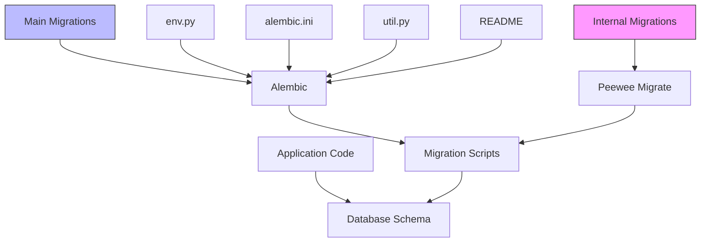
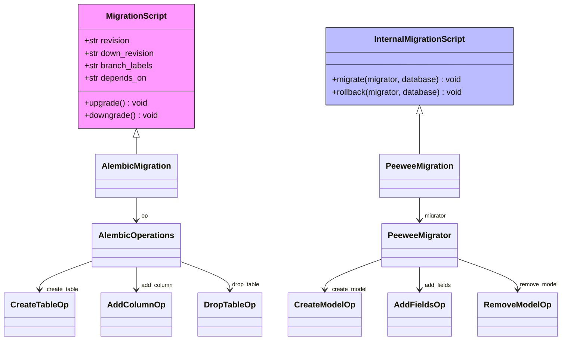
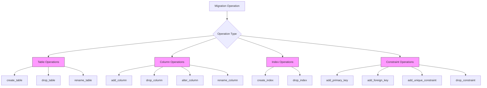
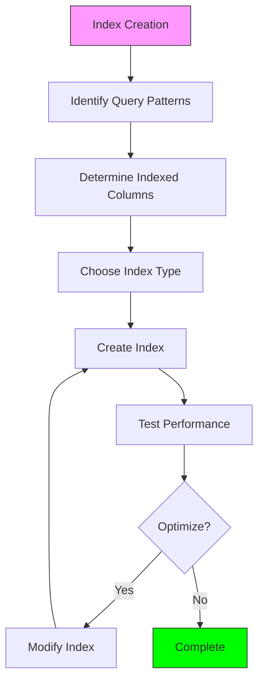
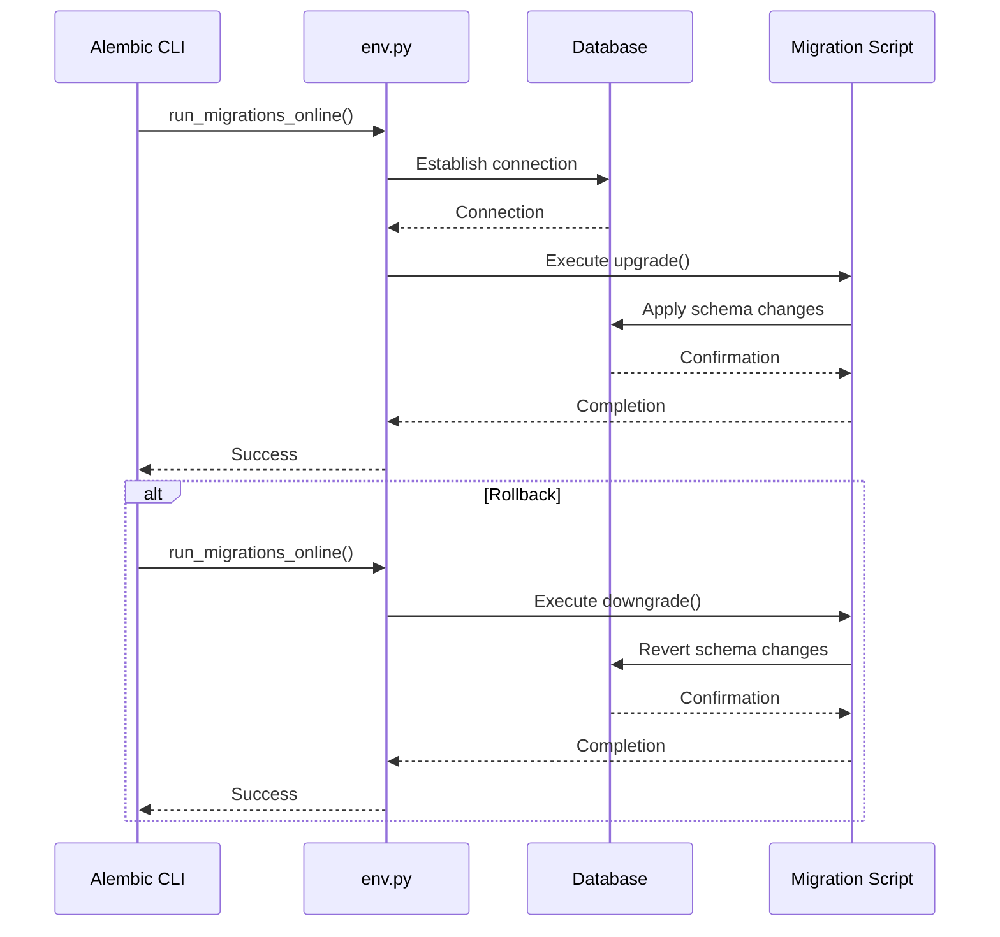
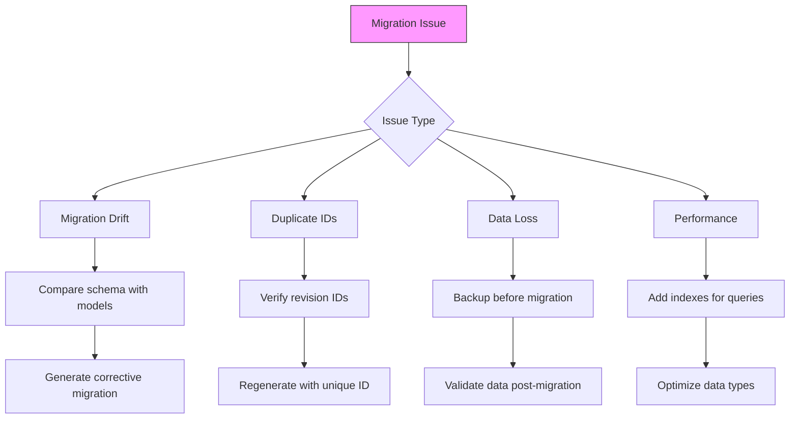

# Database Migrations

<cite>
**Referenced Files in This Document**   
- [001_initial_schema.py](file://backend/open_webui/internal/migrations/001_initial_schema.py)
- [018_add_function_is_global.py](file://backend/open_webui/internal/migrations/018_add_function_is_global.py)
- [af906e964978_add_feedback_table.py](file://backend/open_webui/migrations/versions/af906e964978_add_feedback_table.py)
- [b2f8a9c1d5e3_add_billing_tables.py](file://backend/open_webui/migrations/versions/b2f8a9c1d5e3_add_billing_tables.py)
- [6a39f3d8e55c_add_knowledge_table.py](file://backend/open_webui/migrations/versions/6a39f3d8e55c_add_knowledge_table.py)
- [3781e22d8b01_update_message_table.py](file://backend/open_webui/migrations/versions/3781e22d8b01_update_message_table.py)
- [242a2047eae0_update_chat_table.py](file://backend/open_webui/migrations/versions/242a2047eae0_update_chat_table.py)
- [env.py](file://backend/open_webui/migrations/env.py)
- [alembic.ini](file://backend/open_webui/alembic.ini)
- [util.py](file://backend/open_webui/migrations/util.py)
- [README](file://backend/open_webui/migrations/README)
</cite>

## Table of Contents
1. [Introduction](#introduction)
2. [Migration Architecture](#migration-architecture)
3. [Internal vs Main Migrations](#internal-vs-main-migrations)
4. [Migration Script Structure](#migration-script-structure)
5. [Schema Versioning and Dependencies](#schema-versioning-and-dependencies)
6. [Common Migration Operations](#common-migration-operations)
7. [Data Migration and Transformation](#data-migration-and-transformation)
8. [Index Management](#index-management)
9. [Generating New Migrations](#generating-new-migrations)
10. [Migration Execution Process](#migration-execution-process)
11. [Rollback Procedures](#rollback-procedures)
12. [Handling Migration Conflicts](#handling-migration-conflicts)
13. [Database Synchronization](#database-synchronization)
14. [Common Issues and Solutions](#common-issues-and-solutions)

## Introduction
Open WebUI employs a comprehensive database migration system to manage schema evolution across different database backends. The system supports both internal migrations for core functionality and main migrations for feature development, using different migration frameworks tailored to specific needs. This documentation details the architecture, implementation, and operational procedures for managing database schema changes in Open WebUI, covering versioning strategies, migration generation, execution workflows, and troubleshooting common issues.

## Migration Architecture

**Diagram sources**
- [env.py](file://backend/open_webui/migrations/env.py)
- [alembic.ini](file://backend/open_webui/alembic.ini)
- [util.py](file://backend/open_webui/migrations/util.py)

**Section sources**
- [env.py](file://backend/open_webui/migrations/env.py#L1-L109)
- [alembic.ini](file://backend/open_webui/alembic.ini#L1-L115)

## Internal vs Main Migrations

Open WebUI implements a dual migration system with distinct approaches for internal and main migrations. The internal migrations directory contains Peewee-based migrations primarily for SQLite databases, while the main migrations directory uses Alembic for broader database compatibility.

The internal migration system, located at `internal/migrations/`, utilizes Peewee Migrate to handle schema changes for the core application. These migrations are numbered sequentially (001_, 002_, etc.) and are designed to support SQLite-specific features and constraints. In contrast, the main migration system in `migrations/versions/` uses Alembic with UUID-based revision identifiers, providing more robust dependency tracking and cross-database compatibility.

This dual approach allows Open WebUI to maintain backward compatibility while supporting advanced database features. The internal migrations focus on fundamental schema changes and data model evolution, while main migrations handle feature-specific additions like billing, feedback, and knowledge management systems.

**Section sources**
- [001_initial_schema.py](file://backend/open_webui/internal/migrations/001_initial_schema.py#L1-L255)
- [af906e964978_add_feedback_table.py](file://backend/open_webui/migrations/versions/af906e964978_add_feedback_table.py#L1-L52)

## Migration Script Structure

**Diagram sources**
- [af906e964978_add_feedback_table.py](file://backend/open_webui/migrations/versions/af906e964978_add_feedback_table.py#L1-L52)
- [001_initial_schema.py](file://backend/open_webui/internal/migrations/001_initial_schema.py#L1-L255)

**Section sources**
- [af906e964978_add_feedback_table.py](file://backend/open_webui/migrations/versions/af906e964978_add_feedback_table.py#L1-L52)
- [001_initial_schema.py](file://backend/open_webui/internal/migrations/001_initial_schema.py#L1-L255)

## Schema Versioning and Dependencies

Open WebUI employs two distinct versioning schemes for its migration systems. The internal migration system uses sequential numeric prefixes (001_, 002_, etc.) that reflect the order of migration application. In contrast, the main Alembic-based system uses UUID-style revision identifiers (e.g., af906e964978) that provide globally unique migration identifiers and enable sophisticated dependency tracking.

Each Alembic migration explicitly declares its predecessor through the `down_revision` attribute, creating a directed acyclic graph of migration dependencies. This approach ensures that migrations are applied in the correct order and enables selective rollback operations. For example, the feedback table migration (af906e964978) specifies c29facfe716b as its `down_revision`, indicating it must be applied after that revision.

The system also supports branching migrations through the `branch_labels` attribute, though Open WebUI currently uses a linear migration history. The `depends_on` field allows specifying dependencies across migration branches, providing flexibility for complex schema evolution scenarios. This versioning approach prevents migration conflicts and ensures database schema consistency across different deployment environments.

**Section sources**
- [af906e964978_add_feedback_table.py](file://backend/open_webui/migrations/versions/af906e964978_add_feedback_table.py#L1-L52)
- [b2f8a9c1d5e3_add_billing_tables.py](file://backend/open_webui/migrations/versions/b2f8a9c1d5e3_add_billing_tables.py#L1-L188)

## Common Migration Operations

**Diagram sources**
- [af906e964978_add_feedback_table.py](file://backend/open_webui/migrations/versions/af906e964978_add_feedback_table.py#L1-L52)
- [3781e22d8b01_update_message_table.py](file://backend/open_webui/migrations/versions/3781e22d8b01_update_message_table.py#L1-L71)

**Section sources**
- [af906e964978_add_feedback_table.py](file://backend/open_webui/migrations/versions/af906e964978_add_feedback_table.py#L1-L52)
- [3781e22d8b01_update_message_table.py](file://backend/open_webui/migrations/versions/3781e22d8b01_update_message_table.py#L1-L71)

## Data Migration and Transformation

Open WebUI migration scripts often include data transformation logic to convert existing data to new schema formats. The migration from document to knowledge tables demonstrates a comprehensive data migration pattern, where data from the document table is transformed and inserted into the newly created knowledge table.

The process involves creating the target table, defining source and target table representations, querying existing data, transforming it as needed, and inserting it into the new structure. For example, in the knowledge table migration, document collection names become knowledge IDs, document titles become knowledge names, and document content is parsed to extract tags for metadata storage.

Data type migrations also require transformation logic. The chat table migration converts a text field containing JSON strings to a native JSON column type. This involves renaming the existing column, adding a new JSON column, parsing and converting the data, and finally dropping the old column. The downgrade operation reverses this process by serializing JSON data back to text format.

**Section sources**
- [6a39f3d8e55c_add_knowledge_table.py](file://backend/open_webui/migrations/versions/6a39f3d8e55c_add_knowledge_table.py#L1-L81)
- [242a2047eae0_update_chat_table.py](file://backend/open_webui/migrations/versions/242a2047eae0_update_chat_table.py#L1-L108)

## Index Management

**Diagram sources**
- [b2f8a9c1d5e3_add_billing_tables.py](file://backend/open_webui/migrations/versions/b2f8a9c1d5e3_add_billing_tables.py#L1-L188)

**Section sources**
- [b2f8a9c1d5e3_add_billing_tables.py](file://backend/open_webui/migrations/versions/b2f8a9c1d5e3_add_billing_tables.py#L1-L188)

## Generating New Migrations

The process for generating new migrations differs between the internal and main migration systems. For the main Alembic-based system, developers use the command `DATABASE_URL=<replace with actual url> alembic revision --autogenerate -m "description"` as documented in the README. This command compares the current database state with the model definitions and automatically generates migration operations.

The Alembic configuration in `alembic.ini` specifies the migration script location and other parameters. The `env.py` file contains the runtime environment configuration, including database connection setup and target metadata specification. When generating migrations, Alembic uses the `target_metadata` from the Auth model to determine the current schema state.

For internal migrations, developers manually create Python files with sequential numbering and implement the migrate and rollback functions using Peewee Migrate operations. The system supports both automated schema generation and manual SQL operations, providing flexibility for different migration scenarios.

**Section sources**
- [README](file://backend/open_webui/migrations/README#L1-L5)
- [env.py](file://backend/open_webui/migrations/env.py#L1-L109)
- [alembic.ini](file://backend/open_webui/alembic.ini#L1-L115)

## Migration Execution Process

**Diagram sources**
- [env.py](file://backend/open_webui/migrations/env.py#L1-L109)
- [af906e964978_add_feedback_table.py](file://backend/open_webui/migrations/versions/af906e964978_add_feedback_table.py#L1-L52)

**Section sources**
- [env.py](file://backend/open_webui/migrations/env.py#L1-L109)
- [af906e964978_add_feedback_table.py](file://backend/open_webui/migrations/versions/af906e964978_add_feedback_table.py#L1-L52)

## Rollback Procedures

Rollback procedures in Open WebUI are implemented through the downgrade() function in Alembic migrations and the rollback() function in internal migrations. Each migration must provide a corresponding rollback operation that precisely reverses the changes made by the upgrade operation.

For table creation migrations, the downgrade function drops the created tables. For column additions, the downgrade removes the columns. When multiple operations are performed in a single migration, the downgrade function reverses them in the opposite order. The billing tables migration demonstrates this pattern, where the downgrade first drops indexes and then removes the tables in reverse order of creation.

The system also handles data migration rollbacks by preserving the original data during upgrades. For example, when converting the chat column from text to JSON, the original text column is temporarily renamed rather than immediately dropped, allowing the downgrade to restore the original data format. This approach ensures data integrity during rollback operations.

**Section sources**
- [af906e964978_add_feedback_table.py](file://backend/open_webui/migrations/versions/af906e964978_add_feedback_table.py#L1-L52)
- [b2f8a9c1d5e3_add_billing_tables.py](file://backend/open_webui/migrations/versions/b2f8a9c1d5e3_add_billing_tables.py#L1-L188)
- [001_initial_schema.py](file://backend/open_webui/internal/migrations/001_initial_schema.py#L1-L255)

## Handling Migration Conflicts

Migration conflicts in Open WebUI typically arise from concurrent development branches creating migrations with the same dependency. The Alembic system prevents this by requiring each migration to specify its direct predecessor through the down_revision field. When two migrations depend on the same revision, they must be merged or re-ordered to maintain a linear history.

The util.py file provides helper functions like get_revision_id() that generate unique revision identifiers, reducing the likelihood of ID conflicts. Developers should always check the current head revision before creating new migrations and ensure their migration's down_revision points to the correct predecessor.

In cases where migration conflicts occur, the recommended approach is to create a new migration that combines the changes from conflicting migrations, updating the dependency chain accordingly. This maintains a clean migration history and prevents schema divergence between environments.

**Section sources**
- [util.py](file://backend/open_webui/migrations/util.py#L1-L16)
- [b2f8a9c1d5e3_add_billing_tables.py](file://backend/open_webui/migrations/versions/b2f8a9c1d5e3_add_billing_tables.py#L1-L188)

## Database Synchronization

Database synchronization in Open WebUI involves ensuring schema consistency across development, staging, and production environments. The migration system provides a reliable mechanism for applying schema changes in a controlled, versioned manner. Developers apply migrations locally before committing code, and deployment processes run migrations as part of the release workflow.

The env.py file contains logic to handle different database backends, including special handling for SQLCipher-encrypted SQLite databases. This ensures that migration operations work consistently across different deployment scenarios. The system also supports offline migration generation for environments where direct database access is restricted.

Regular synchronization practices include verifying the migration history, checking for unapplied migrations, and ensuring that the database schema matches the expected state. The Alembic history command can be used to review the migration timeline and verify that all expected migrations have been applied.

**Section sources**
- [env.py](file://backend/open_webui/migrations/env.py#L1-L109)
- [util.py](file://backend/open_webui/migrations/util.py#L1-L16)

## Common Issues and Solutions

**Diagram sources**
- [242a2047eae0_update_chat_table.py](file://backend/open_webui/migrations/versions/242a2047eae0_update_chat_table.py#L1-L108)
- [6a39f3d8e55c_add_knowledge_table.py](file://backend/open_webui/migrations/versions/6a39f3d8e55c_add_knowledge_table.py#L1-L81)

**Section sources**
- [242a2047eae0_update_chat_table.py](file://backend/open_webui/migrations/versions/242a2047eae0_update_chat_table.py#L1-L108)
- [6a39f3d8e55c_add_knowledge_table.py](file://backend/open_webui/migrations/versions/6a39f3d8e55c_add_knowledge_table.py#L1-L81)