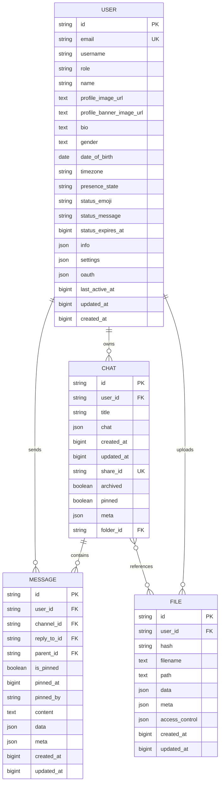
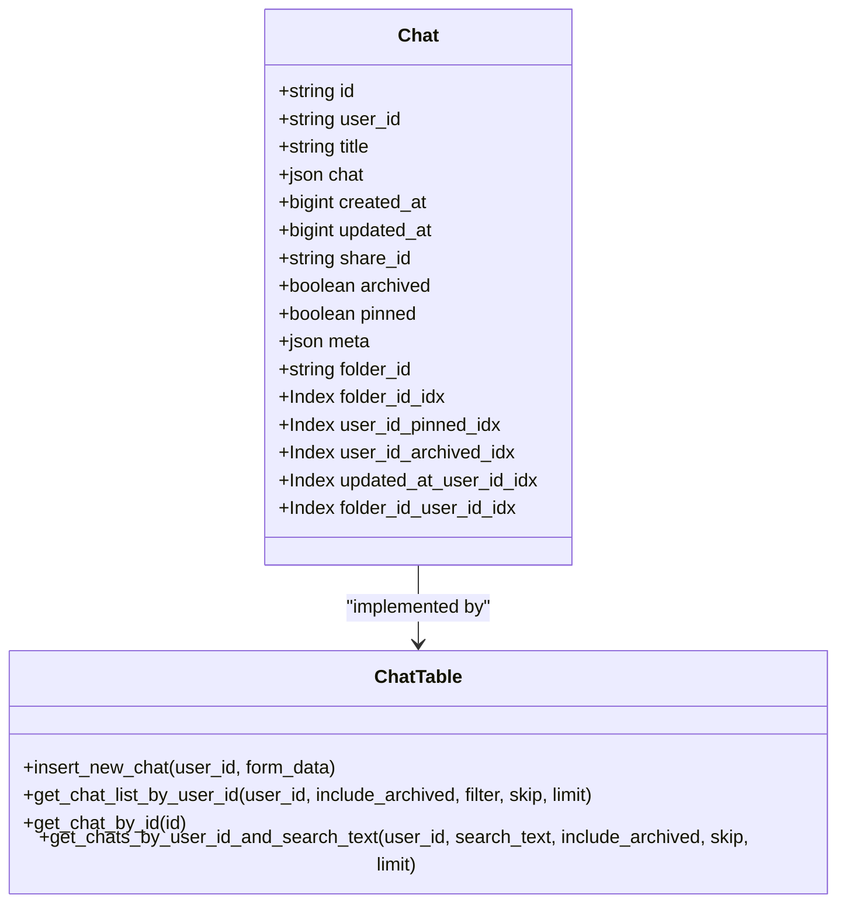
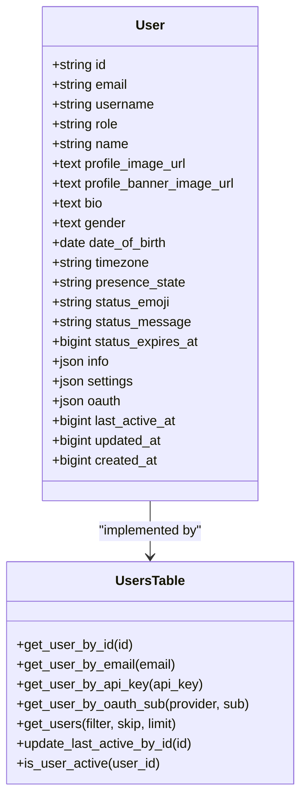
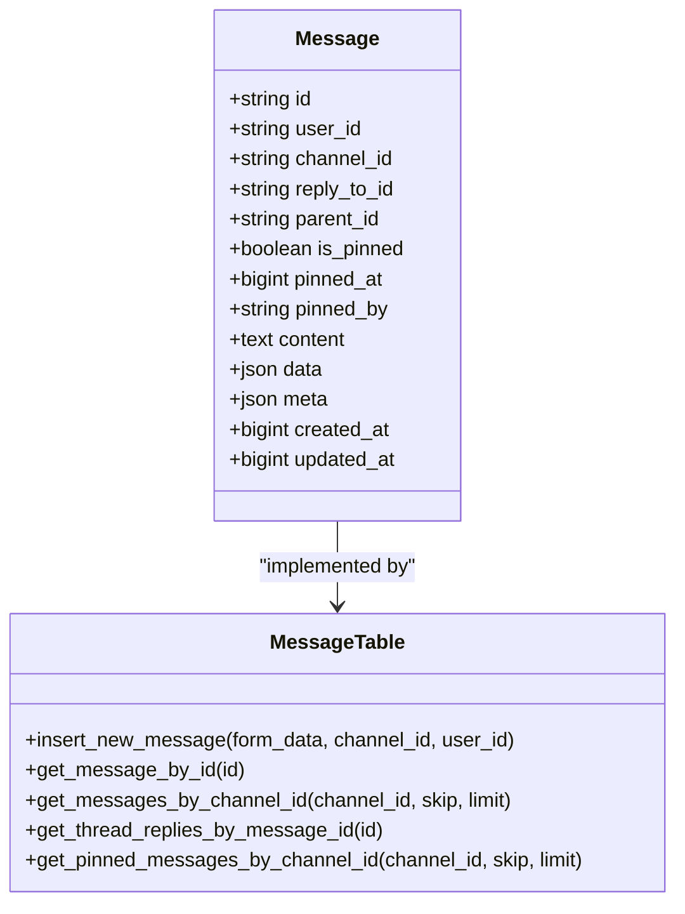
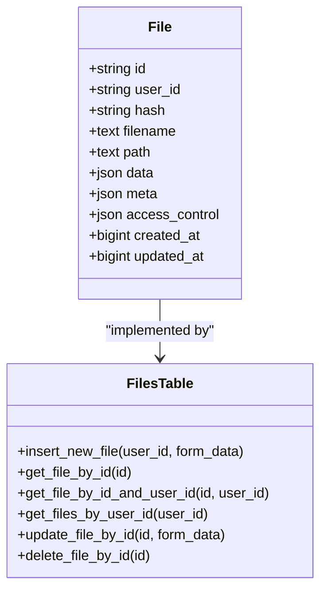
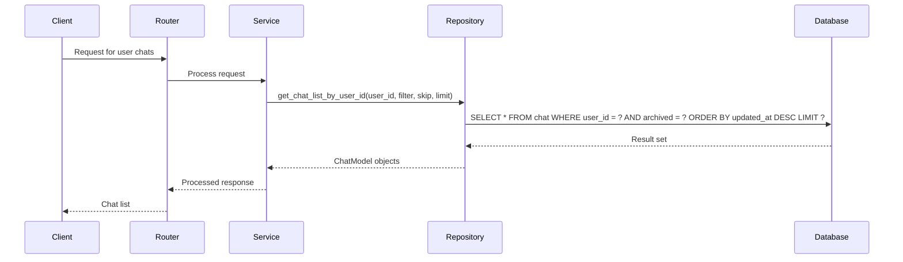
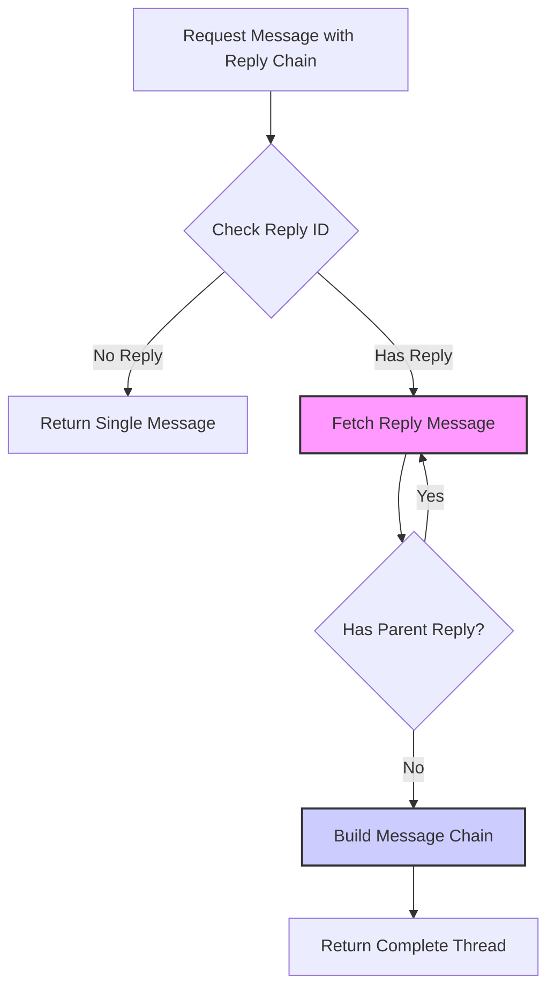
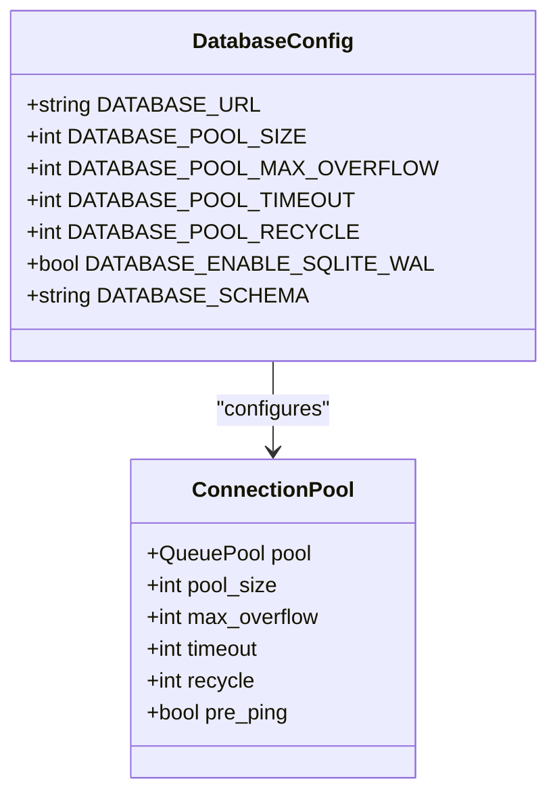
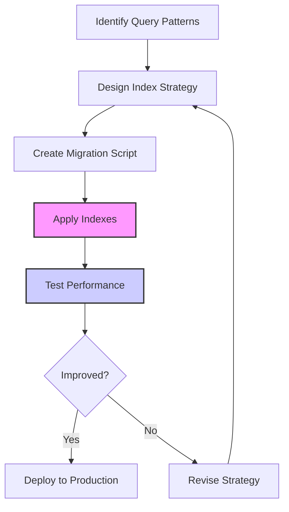

# Database Performance and Optimization

<cite>
**Referenced Files in This Document**   
- [add_indexes.py](file://backend/open_webui/migrations/versions/018012973d35_add_indexes.py)
- [chats.py](file://backend/open_webui/models/chats.py)
- [users.py](file://backend/open_webui/models/users.py)
- [messages.py](file://backend/open_webui/models/messages.py)
- [files.py](file://backend/open_webui/models/files.py)
- [db.py](file://backend/open_webui/internal/db.py)
- [env.py](file://backend/open_webui/env.py)
</cite>

## Table of Contents
1. [Introduction](#introduction)
2. [Index Strategy and Implementation](#index-strategy-and-implementation)
3. [Core Model Optimization](#core-model-optimization)
4. [Query Optimization Techniques](#query-optimization-techniques)
5. [Performance Monitoring and Analysis](#performance-monitoring-and-analysis)
6. [Database Maintenance Best Practices](#database-maintenance-best-practices)
7. [Conclusion](#conclusion)

## Introduction
This document provides a comprehensive analysis of database performance and optimization strategies in the open-webui application. The system employs a sophisticated database architecture with strategic indexing, efficient query patterns, and robust performance monitoring to ensure optimal operation under various load conditions. The documentation focuses on key aspects including index definition and utilization across core models (users, chats, messages, and files), query optimization techniques, and maintenance practices that contribute to the overall database efficiency.

## Index Strategy and Implementation
The open-webui application implements a comprehensive indexing strategy through Alembic migration scripts to optimize query performance across core tables. The primary migration script `add_indexes.py` demonstrates a thoughtful approach to index creation based on common query patterns and access paths.



**Diagram sources**
- [chats.py](file://backend/open_webui/models/chats.py#L26-L56)
- [users.py](file://backend/open_webui/models/users.py#L45-L75)
- [messages.py](file://backend/open_webui/models/messages.py#L42-L62)
- [files.py](file://backend/open_webui/models/files.py#L18-L34)

The indexing strategy is implemented through the migration script `018012973d35_add_indexes.py`, which creates composite indexes on frequently queried columns. For the chat table, indexes are created on combinations such as `(user_id, pinned)`, `(user_id, archived)`, and `(updated_at, user_id)` to optimize common filtering and sorting operations. The tag table has an index on `user_id` to accelerate user-specific tag queries, while the function table has an index on `is_global` to quickly identify global functions.

**Section sources**
- [add_indexes.py](file://backend/open_webui/migrations/versions/018012973d35_add_indexes.py#L1-L47)

## Core Model Optimization
The core models in open-webui are designed with performance considerations in mind, incorporating both structural optimizations and strategic indexing directly within the model definitions.

### Chat Model Optimization
The Chat model implements several performance-enhancing features through its SQLAlchemy definition. The model includes a `__table_args__` section that defines multiple indexes directly within the model, ensuring that critical query patterns are optimized:



**Diagram sources**
- [chats.py](file://backend/open_webui/models/chats.py#L26-L56)

The chat model's indexes are specifically designed to support common user interactions such as retrieving pinned chats, filtering archived conversations, and sorting by update time. The composite index on `(updated_at, user_id)` enables efficient chronological sorting of chats for individual users, while the `(folder_id, user_id)` index supports folder-based organization and navigation.

**Section sources**
- [chats.py](file://backend/open_webui/models/chats.py#L26-L800)

### User Model Optimization
The User model is optimized for both authentication and user management operations. While the model itself doesn't define indexes in its class definition, the migration scripts ensure that critical fields are properly indexed for performance.



**Diagram sources**
- [users.py](file://backend/open_webui/models/users.py#L45-L75)

The user model supports efficient lookups by various criteria including ID, email, API key, and OAuth sub identifier. The `get_user_by_oauth_sub` method includes database-specific implementations for both SQLite and PostgreSQL to leverage their respective JSON querying capabilities, ensuring optimal performance across different database backends.

**Section sources**
- [users.py](file://backend/open_webui/models/users.py#L1-L719)

### Message Model Optimization
The Message model is designed to support real-time communication features with optimized indexing for message retrieval and threading.



**Diagram sources**
- [messages.py](file://backend/open_webui/models/messages.py#L42-L62)

The message model supports efficient retrieval of message threads through the `parent_id` field, which is implicitly indexed through foreign key constraints. The model also includes fields for pinning messages with appropriate timestamps and user references, enabling quick access to important messages within channels.

**Section sources**
- [messages.py](file://backend/open_webui/models/messages.py#L1-L463)

### File Model Optimization
The File model is optimized for document storage and retrieval with considerations for access control and metadata management.



**Diagram sources**
- [files.py](file://backend/open_webui/models/files.py#L18-L34)

The file model includes a hash field for content identification and deduplication, supporting efficient file management. The access_control field enables granular permission management, while the metadata field stores additional file properties for enhanced search and organization capabilities.

**Section sources**
- [files.py](file://backend/open_webui/models/files.py#L1-L290)

## Query Optimization Techniques
The open-webui application employs several query optimization techniques to ensure efficient database operations and minimize response times.

### Efficient ORM Patterns
The application uses SQLAlchemy ORM with careful consideration for query efficiency. The repository pattern is implemented through table classes that encapsulate common database operations, providing a clean interface while maintaining control over query generation.



**Diagram sources**
- [chats.py](file://backend/open_webui/models/chats.py#L535-L573)

The chat retrieval methods demonstrate efficient pagination implementation with proper use of `offset` and `limit` parameters to prevent excessive data loading. The `get_chat_list_by_user_id` method first counts the total results before applying pagination, ensuring accurate pagination information is returned to clients.

**Section sources**
- [chats.py](file://backend/open_webui/models/chats.py#L535-L573)

### Lazy vs Eager Loading
The application strategically uses both lazy and eager loading patterns depending on the use case. For example, when retrieving a message with its reply chain, the application uses eager loading to minimize database round trips:



**Diagram sources**
- [messages.py](file://backend/open_webui/models/messages.py#L159-L188)

The `get_message_by_id` method in the Message model recursively fetches reply messages to build a complete thread, demonstrating a controlled approach to eager loading that prevents infinite recursion while ensuring complete data retrieval.

**Section sources**
- [messages.py](file://backend/open_webui/models/messages.py#L159-L188)

### Bulk Operations
The application implements bulk operations for improved performance when handling multiple records. The chat import functionality demonstrates efficient bulk insertion:

```mermaid
flowchart LR
A[Import Chat Forms] --> B{Validate Forms}
B --> |Invalid| C[Return Error]
B --> |Valid| D[Create Chat Objects]
D --> E[Add to Session]
E --> F[db.add_all(chats)]
F --> G[db.commit()]
G --> H[Return Imported Chats]
style D fill:#f9f,stroke:#333,stroke-width:2px
style F fill:#ccf,stroke:#333,stroke-width:2px
```

**Diagram sources**
- [chats.py](file://backend/open_webui/models/chats.py#L217-L230)

The `import_chats` method uses SQLAlchemy's `add_all` method to insert multiple chat records in a single transaction, significantly improving performance compared to individual inserts. This approach reduces the number of database round trips and leverages transactional efficiency.

**Section sources**
- [chats.py](file://backend/open_webui/models/chats.py#L217-L230)

## Performance Monitoring and Analysis
The open-webui application includes several mechanisms for performance monitoring and analysis to identify and address potential bottlenecks.

### Configuration and Pooling
Database performance is enhanced through configurable connection pooling and optimization settings defined in the environment configuration:



**Diagram sources**
- [env.py](file://backend/open_webui/env.py#L280-L352)
- [db.py](file://backend/open_webui/internal/db.py#L114-L145)

The application supports configurable database connection pooling with parameters for pool size, maximum overflow, timeout, and recycle intervals. For SQLite databases, the application can enable Write-Ahead Logging (WAL) mode, which improves concurrency by allowing multiple readers to coexist with a single writer.

**Section sources**
- [env.py](file://backend/open_webui/env.py#L280-L352)
- [db.py](file://backend/open_webui/internal/db.py#L114-L145)

### Slow Query Considerations
While explicit slow query logging is not implemented in the provided code, the application's architecture supports performance analysis through several mechanisms. The use of indexes on frequently queried fields helps prevent slow queries, and the pagination implementation prevents excessive data retrieval.

The application also includes timestamp-based fields like `created_at` and `updated_at` on all core models, which can be used for performance analysis by identifying frequently accessed or modified records. The `last_active_at` field in the User model enables analysis of user activity patterns, which can inform database optimization strategies.

## Database Maintenance Best Practices
The open-webui application incorporates several best practices for maintaining optimal database performance under load.

### Index Maintenance
The application uses Alembic for database migrations, ensuring that index changes are properly versioned and applied consistently across environments. The migration script `add_indexes.py` demonstrates a structured approach to index management:



**Diagram sources**
- [add_indexes.py](file://backend/open_webui/migrations/versions/018012973d35_add_indexes.py#L1-L47)

The migration-based approach ensures that index creation and removal are tracked and can be rolled back if necessary. This structured process helps maintain database schema integrity while allowing for performance optimizations over time.

**Section sources**
- [add_indexes.py](file://backend/open_webui/migrations/versions/018012973d35_add_indexes.py#L1-L47)

### Vacuuming and Statistics
For SQLite databases, the application can enable Write-Ahead Logging (WAL) mode through the `DATABASE_ENABLE_SQLITE_WAL` environment variable. WAL mode provides several performance benefits, including improved concurrency and reduced locking.

While explicit vacuuming operations are not shown in the code, the use of proper indexing and efficient query patterns helps maintain database performance. The application's architecture encourages regular maintenance through its migration system, which can be extended to include vacuuming and statistics updates as needed.

### Statistics Updates
The application's design supports statistics collection through its comprehensive timestamp fields and usage patterns. The `updated_at` fields on core models enable tracking of data modification frequency, which can inform index optimization and maintenance scheduling.

The application could be extended to include explicit statistics collection by leveraging database-specific features. For example, PostgreSQL provides extensive statistics collection capabilities that could be integrated into the application's monitoring system.

## Conclusion
The open-webui application demonstrates a comprehensive approach to database performance and optimization through strategic indexing, efficient query patterns, and thoughtful architectural design. The implementation of composite indexes on frequently queried fields ensures fast data retrieval for core operations, while the use of SQLAlchemy ORM with careful consideration for lazy and eager loading patterns optimizes database interactions.

The application's migration-based approach to index management provides a structured process for performance optimization, allowing for systematic improvements over time. Configuration options for connection pooling and SQLite WAL mode enable tuning for different deployment scenarios and load conditions.

Future enhancements could include more sophisticated performance monitoring, explicit slow query logging, and automated maintenance tasks such as vacuuming and statistics updates. However, the current implementation provides a solid foundation for optimal database performance, effectively balancing query efficiency with maintainability and scalability.