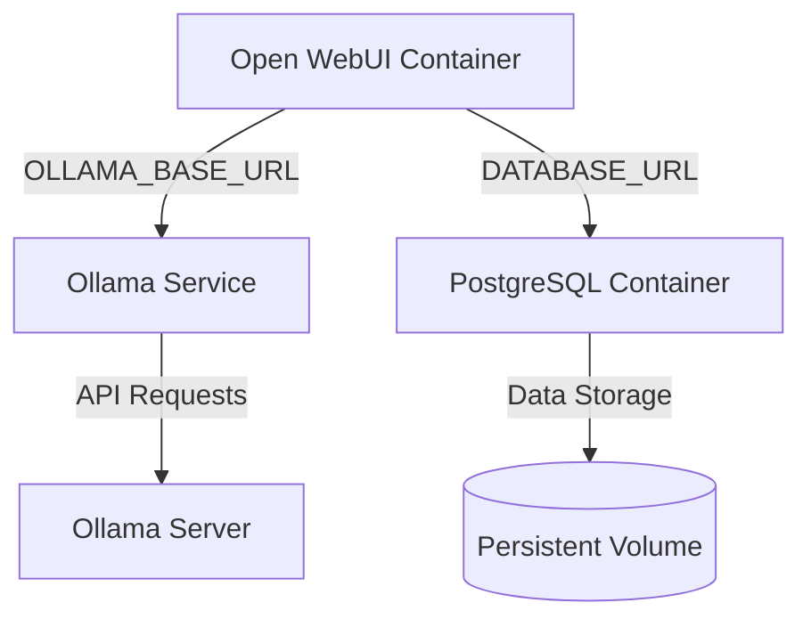
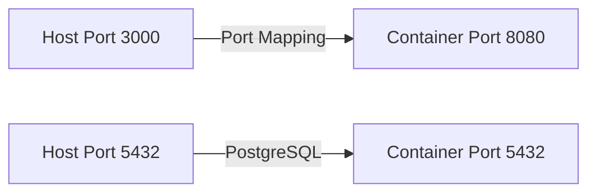
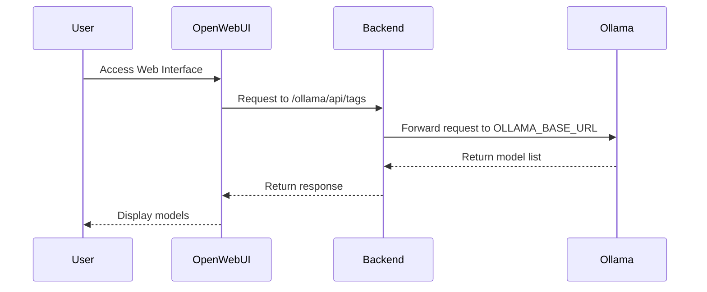

# Container Issues

<cite>
**Referenced Files in This Document**   
- [Dockerfile](file://Dockerfile)
- [docker-compose.yaml](file://docker-compose.yaml)
- [docker-compose.gpu.yaml](file://docker-compose.gpu.yaml)
- [docker-compose.amdgpu.yaml](file://docker-compose.amdgpu.yaml)
- [docker-compose.data.yaml](file://docker-compose.data.yaml)
- [docker-compose.api.yaml](file://docker-compose.api.yaml)
- [backend/start.sh](file://backend/start.sh)
- [TROUBLESHOOTING.md](file://TROUBLESHOOTING.md)
</cite>

## Table of Contents
1. [Introduction](#introduction)
2. [Docker Build Failures](#docker-build-failures)
3. [Runtime Container Problems](#runtime-container-problems)
4. [Container Linkage and Networking](#container-linkage-and-networking)
5. [GPU-Specific Container Issues](#gpu-specific-container-issues)
6. [Debugging Techniques](#debugging-techniques)
7. [Conclusion](#conclusion)

## Introduction
This document addresses common containerization problems encountered during Open WebUI installation and operation. The focus is on Docker-related issues spanning build failures, runtime problems, networking misconfigurations, and GPU-specific challenges. The analysis covers configuration files including Dockerfile, docker-compose.yaml, and specialized variants for different deployment scenarios. Special attention is given to the interaction between Open WebUI and Ollama services, which is critical for the system's functionality.

The Open WebUI system architecture relies on containerized components that must communicate effectively, with proper volume mounting, port exposure, and dependency management. Understanding these containerization aspects is essential for successful deployment and troubleshooting.

**Section sources**
- [Dockerfile](file://Dockerfile#L1-L192)
- [docker-compose.yaml](file://docker-compose.yaml#L1-L60)
- [TROUBLESHOOTING.md](file://TROUBLESHOOTING.md#L1-L37)

## Docker Build Failures

### Layer Caching Issues
Layer caching problems can occur when Docker rebuilds layers unnecessarily or uses stale cached layers. The Dockerfile implements multi-stage builds with clear separation between frontend and backend stages, which helps manage caching effectively. The build process separates Node.js frontend compilation from Python backend installation, allowing independent caching of these components.

Build arguments such as `BUILD_HASH` can be used to invalidate caches when needed. The Dockerfile also uses specific version pins for base images (node:22-alpine3.20 and python:3.11-slim-bookworm) to ensure consistent builds. When cache invalidation is required, users can modify build arguments like `USE_CUDA`, `USE_OLLAMA`, or `BUILD_HASH` to force rebuilds of specific layers.

### Missing Dependencies in Images
Missing dependencies are a common build failure point. The Dockerfile addresses this by explicitly installing system dependencies through apt-get, including essential packages like git, build-essential, pandoc, gcc, netcat-openbsd, curl, jq, python3-dev, ffmpeg, libsm6, and libxext6. These dependencies support various functionality including PDF processing, audio/video handling, and network connectivity.

The Python dependency installation uses a conditional approach based on CUDA and Ollama requirements. When CUDA is enabled, the build installs GPU-accelerated PyTorch packages from the appropriate index URL based on the CUDA version specified by `USE_CUDA_VER`. For CPU-only deployments, it installs the CPU version of PyTorch. The requirements.txt file is installed using uv pip for improved performance and reliability.

### Permission Errors During Build
Permission errors can occur during the Docker build process, particularly when non-root users are specified. The Dockerfile includes build arguments `UID` and `GID` (defaulting to 0 for root) that allow customization of user permissions. When non-root users are created, the Dockerfile ensures proper ownership of critical directories through chown commands.

The `USE_PERMISSION_HARDENING` build argument enables additional security measures, including group ownership of /app and /root directories, group write permissions, and SGID bits on directories to ensure proper group inheritance. This is particularly important for OpenShift and other environments with strict security policies.

**Section sources**
- [Dockerfile](file://Dockerfile#L4-L192)
- [backend/start.sh](file://backend/start.sh#L1-L87)

## Runtime Container Problems

### Container Crashes
Container crashes in Open WebUI deployments often stem from configuration issues or resource constraints. The start.sh script includes several safeguards to prevent crashes, including conditional execution of Playwright browser installation and proper environment variable handling.

Common crash scenarios include:
- Missing WEBUI_SECRET_KEY, which the start.sh script handles by generating a random key if none is provided
- Database connection failures, mitigated by the docker-compose.yaml configuration that ensures postgres service is healthy before starting the airis service
- Memory issues during startup, particularly when loading machine learning models

The HEALTHCHECK directive in the Dockerfile (`curl --silent --fail http://localhost:${PORT:-8080}/health`) provides a mechanism for Docker to detect container health and restart unresponsive instances.

### Health Check Failures
Health check failures indicate that the container is not responding to health probes. The Open WebUI health check verifies the /health endpoint returns a status of true. Failures can occur due to:
- Database connectivity issues
- Port binding conflicts
- Application startup errors

The docker-compose.yaml configuration addresses database dependencies by using the `service_healthy` condition, ensuring the postgres service is fully operational before attempting to start the airis service. This dependency management reduces the likelihood of health check failures due to database connectivity issues.

### Networking Misconfigurations
Networking problems between Open WebUI and Ollama services are among the most common runtime issues. The TROUBLESHOOTING.md documentation highlights that the WebUI container often cannot reach the Ollama server at 127.0.0.1:11434. This occurs because 127.0.0.1 refers to the container's own loopback interface, not the host machine.

The recommended solution is using the `--network=host` flag or configuring the `extra_hosts` directive in docker-compose.yaml to map `host.docker.internal` to the host gateway. The default docker-compose.yaml includes `extra_hosts: - host.docker.internal:host-gateway` to facilitate this connection.

The reverse proxy architecture described in TROUBLESHOOTING.md routes requests from the WebUI through the backend to the Ollama API via the `/ollama` route, using the OLLAMA_BASE_URL environment variable to determine the target. This design prevents direct exposure of the Ollama API to the frontend while resolving CORS issues.

**Section sources**
- [docker-compose.yaml](file://docker-compose.yaml#L1-L60)
- [TROUBLESHOOTING.md](file://TROUBLESHOOTING.md#L1-L37)
- [backend/start.sh](file://backend/start.sh#L1-L87)

## Container Linkage and Networking

### Proper Container Linkage
Effective container linkage between Open WebUI and Ollama services requires proper configuration of environment variables and network settings. The docker-compose.yaml file establishes this linkage through environment variables:



**Diagram sources**
- [docker-compose.yaml](file://docker-compose.yaml#L1-L60)
- [TROUBLESHOOTING.md](file://TROUBLESHOOTING.md#L1-L37)

The OLLAMA_BASE_URL environment variable must point to the Ollama service, typically configured as `http://host.docker.internal:11434` when Ollama runs on the host machine, or `http://ollama:11434` when both services are managed by the same docker-compose file.

### Volume Mounting Strategies
Volume mounting is critical for data persistence in Open WebUI deployments. The docker-compose.yaml file defines three named volumes: ollama, airis, and postgres-data. The airis volume mounts to `/app/backend/data` in the container, preserving user data, configurations, and application state across container restarts.

For Ollama integration, the docker-compose.data.yaml overlay provides a mechanism to mount the Ollama data directory from the host system:

```mermaid
graph TD
A[Host System] --> |Volume Mount| B[Ollama Container]
B --> C[/root/.ollama]
D[Host Directory] --> |${OLLAMA_DATA_DIR-./ollama-data}| C
```

**Diagram sources**
- [docker-compose.data.yaml](file://docker-compose.data.yaml#L1-L5)
- [docker-compose.yaml](file://docker-compose.yaml#L57-L59)

This configuration ensures that downloaded models and Ollama configurations persist across container restarts.

### Port Exposure Configuration
Proper port exposure is essential for service accessibility. The Dockerfile exposes port 8080, which is the default port for the Open WebUI application. The docker-compose.yaml file maps this container port to the host port specified by OPEN_WEBUI_PORT (defaulting to 3000):



**Diagram sources**
- [Dockerfile](file://Dockerfile#L170)
- [docker-compose.yaml](file://docker-compose.yaml#L22-L23)

The docker-compose.api.yaml overlay provides additional port exposure for the Ollama API, mapping host port 11434 to container port 11434, allowing external access to the Ollama service.

**Section sources**
- [docker-compose.yaml](file://docker-compose.yaml#L1-L60)
- [docker-compose.data.yaml](file://docker-compose.data.yaml#L1-L5)
- [docker-compose.api.yaml](file://docker-compose.api.yaml#L1-L6)

## GPU-Specific Container Issues

### CUDA Driver Incompatibilities
GPU support in Open WebUI deployments requires careful attention to CUDA driver compatibility. The Dockerfile includes build arguments for CUDA configuration:
- `USE_CUDA`: Enables CUDA support (true/false)
- `USE_CUDA_VER`: Specifies the CUDA version (default: cu128)

The docker-compose.gpu.yaml file configures GPU resources for the Ollama service using Docker's deploy resources specification:

```mermaid
graph TD
A[Ollama Service] --> B[GPU Resources]
B --> C[Driver: ${OLLAMA_GPU_DRIVER-nvidia}]
B --> D[Count: ${OLLAMA_GPU_COUNT-1}]
B --> E[Capabilities: gpu]
```

**Diagram sources**
- [docker-compose.gpu.yaml](file://docker-compose.gpu.yaml#L1-L12)
- [Dockerfile](file://Dockerfile#L4-L9)

Common issues include:
- Mismatch between host CUDA driver version and container CUDA version
- Insufficient GPU memory for model loading
- Incorrect GPU driver specification in OLLAMA_GPU_DRIVER

The start.sh script addresses library path issues by appending CUDA libraries to LD_LIBRARY_PATH when CUDA is enabled, ensuring the runtime can locate necessary GPU libraries.

### Device Access Permissions
Proper device access permissions are crucial for GPU functionality. The docker-compose.gpu.yaml configuration uses Docker's device reservation system to grant the container access to GPU devices. For AMD GPU support, the docker-compose.amdgpu.yaml file provides specific device mappings:

```mermaid
graph TD
A[Ollama Container] --> B[/dev/kfd]
A --> C[/dev/dri]
B --> D[Kernel Fusion Driver]
C --> E[Direct Rendering Infrastructure]
```

**Diagram sources**
- [docker-compose.amdgpu.yaml](file://docker-compose.amdgpu.yaml#L1-L8)

The configuration also includes the HSA_OVERRIDE_GFX_VERSION environment variable to handle AMD GPU architecture version compatibility.

For NVIDIA GPUs, proper permissions require:
- Installation of NVIDIA Container Toolkit on the host
- Correct Docker runtime configuration
- Sufficient privileges for the container to access GPU devices

The USE_PERMISSION_HARDENING build option in the Dockerfile provides additional security hardening that can help resolve permission-related issues in restricted environments.

**Section sources**
- [docker-compose.gpu.yaml](file://docker-compose.gpu.yaml#L1-L12)
- [docker-compose.amdgpu.yaml](file://docker-compose.amdgpu.yaml#L1-L8)
- [Dockerfile](file://Dockerfile#L4-L192)

## Debugging Techniques

### Using docker logs
The docker logs command is essential for diagnosing container issues. For Open WebUI deployments, key logs to monitor include:
- Application startup messages
- Database connection status
- Model loading progress
- API request/response cycles

The start.sh script provides verbose output for critical operations, such as Playwright browser installation and secret key generation, making these events visible in container logs.

### Using docker exec
The docker exec command allows inspection of running containers. Useful commands include:
- `docker exec -it airis ls /app/backend/data` - Check data directory contents
- `docker exec -it airis env` - Verify environment variables
- `docker exec -it airis df -h` - Check disk usage
- `docker exec -it airis ps aux` - View running processes

These commands help verify volume mounting, environment configuration, resource usage, and process status within the container.

### Network Inspection Tools
Network connectivity issues are common in Open WebUI deployments. Docker provides several tools for network inspection:
- `docker network inspect` - Examine network configuration
- `docker exec -it airis curl http://localhost:8080/health` - Test internal connectivity
- `docker exec -it airis curl http://host.docker.internal:11434/api/tags` - Test Ollama connectivity

The netcat-openbsd package included in the Dockerfile provides additional network diagnostic capabilities. The TROUBLESHOOTING.md documentation recommends verifying the OLLAMA_BASE_URL configuration and testing connectivity to ensure proper network routing between containers.



**Diagram sources**
- [TROUBLESHOOTING.md](file://TROUBLESHOOTING.md#L1-L37)
- [docker-compose.yaml](file://docker-compose.yaml#L1-L60)

This sequence illustrates the request flow from the user interface through the backend proxy to the Ollama service, highlighting potential failure points for network diagnostics.

**Section sources**
- [TROUBLESHOOTING.md](file://TROUBLESHOOTING.md#L1-L37)
- [backend/start.sh](file://backend/start.sh#L1-L87)
- [docker-compose.yaml](file://docker-compose.yaml#L1-L60)

## Conclusion
Containerization issues in Open WebUI deployments primarily revolve around proper configuration of build parameters, runtime environment variables, network connectivity, and GPU resources. Successful deployment requires attention to detail in several key areas:

1. **Build Configuration**: Proper use of build arguments in the Dockerfile to enable/disable features and manage dependencies
2. **Runtime Environment**: Correct setting of environment variables, particularly OLLAMA_BASE_URL and database connection parameters
3. **Network Connectivity**: Appropriate network configuration to enable communication between Open WebUI and Ollama services
4. **Data Persistence**: Effective volume mounting strategies to preserve application data
5. **GPU Support**: Proper GPU driver configuration and device access permissions for accelerated inference

The modular docker-compose configuration files provide flexibility for different deployment scenarios, from basic CPU-only installations to GPU-accelerated deployments with specialized hardware support. Understanding these configuration options and their interactions is essential for troubleshooting and optimizing Open WebUI container deployments.

By following the patterns and configurations documented in the various docker-compose.yaml files and understanding the startup sequence in start.sh, administrators can effectively diagnose and resolve most containerization issues encountered during Open WebUI installation and operation.

**Section sources**
- [Dockerfile](file://Dockerfile#L1-L192)
- [docker-compose.yaml](file://docker-compose.yaml#L1-L60)
- [docker-compose.gpu.yaml](file://docker-compose.gpu.yaml#L1-L12)
- [backend/start.sh](file://backend/start.sh#L1-L87)
- [TROUBLESHOOTING.md](file://TROUBLESHOOTING.md#L1-L37)