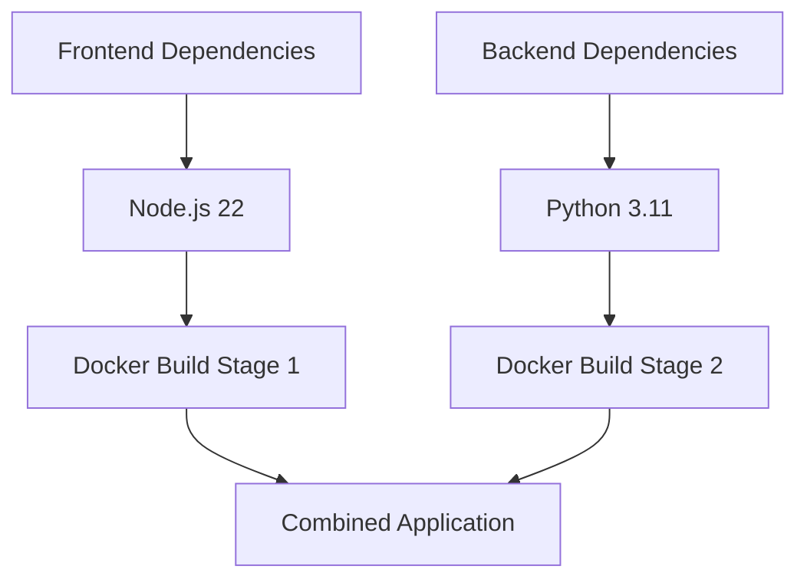
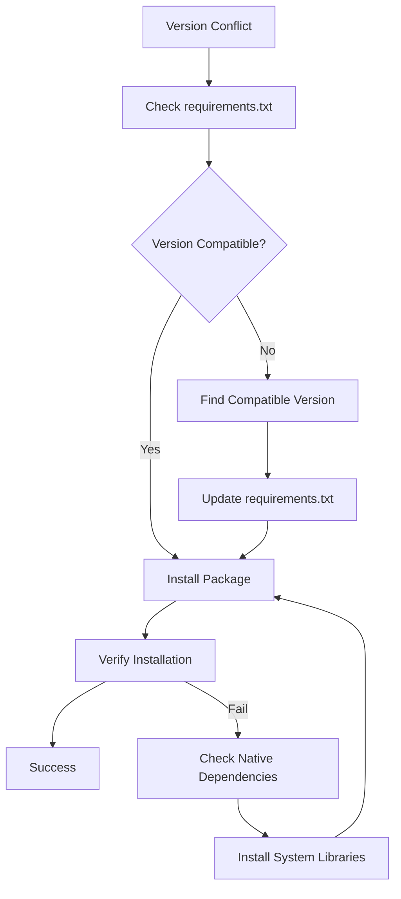
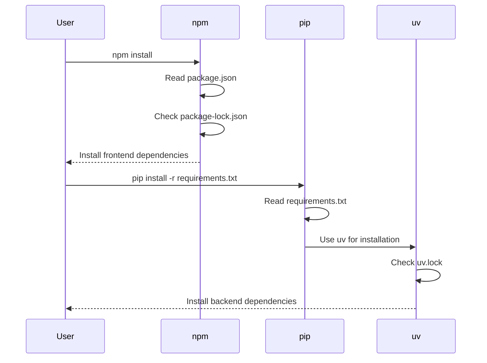
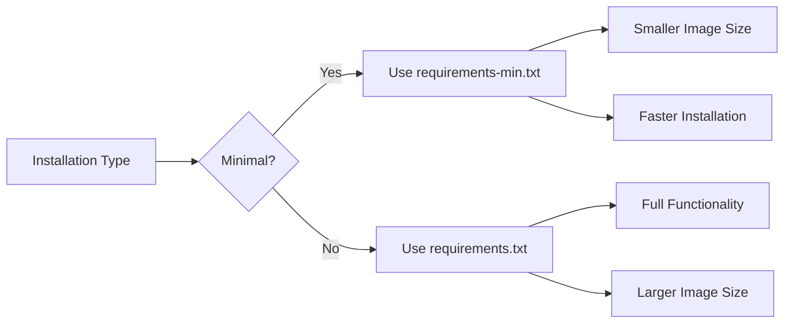
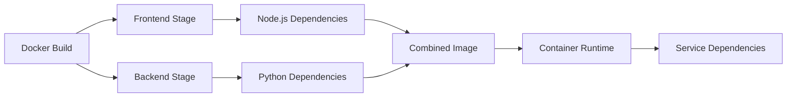

# Dependency Issues

<cite>
**Referenced Files in This Document**   
- [requirements.txt](file://backend/requirements.txt)
- [requirements-min.txt](file://backend/requirements-min.txt)
- [package.json](file://package.json)
- [pyproject.toml](file://pyproject.toml)
- [uv.lock](file://uv.lock)
- [Dockerfile](file://Dockerfile)
- [start.sh](file://backend/start.sh)
- [run-compose.sh](file://run-compose.sh)
</cite>

## Table of Contents
1. [Introduction](#introduction)
2. [Python and Node.js Dependency Conflicts](#python-and-nodejs-dependency-conflicts)
3. [Version Incompatibilities and Native Module Issues](#version-incompatibilities-and-native-module-issues)
4. [Pip and Npm Resolution Problems](#pip-and-npm-resolution-problems)
5. [Dependency Specification Examples](#dependency-specification-examples)
6. [Minimal vs. Full Installation Challenges](#minimal-vs-full-installation-challenges)
7. [Troubleshooting Dependency Issues](#troubleshooting-dependency-issues)
8. [Managing Dependencies in Isolated Environments](#managing-dependencies-in-isolated-environments)
9. [Containerized Dependency Management](#containerized-dependency-management)
10. [Conclusion](#conclusion)

## Introduction
This document addresses dependency-related installation problems in open-webui, focusing on conflicts arising from Python and Node.js package mismatches. The analysis covers version incompatibilities, missing native modules, and issues with pip and npm resolution. The document provides guidance on resolving lockfile conflicts, rebuilding virtual environments, and verifying package integrity. It also covers managing dependencies in isolated environments and container builds, using examples from requirements.txt, package.json, and pyproject.toml to demonstrate correct dependency specifications.

**Section sources**
- [requirements.txt](file://backend/requirements.txt#L1-L153)
- [package.json](file://package.json#L1-L152)
- [pyproject.toml](file://pyproject.toml#L1-L206)

## Python and Node.js Dependency Conflicts
The open-webui project uses both Python and Node.js, creating potential dependency conflicts. The Python backend dependencies are managed through requirements.txt and pyproject.toml, while the frontend uses package.json for Node.js dependencies. This dual dependency management system can lead to version mismatches and compatibility issues.

The project's Dockerfile shows a multi-stage build process that separates frontend and backend dependencies. The frontend build stage uses Node.js 22, while the backend uses Python 3.11. This separation helps isolate dependencies but requires careful coordination to ensure compatibility between frontend and backend components.



**Diagram sources**
- [Dockerfile](file://Dockerfile#L26-L192)

**Section sources**
- [Dockerfile](file://Dockerfile#L26-L192)
- [package.json](file://package.json#L1-L152)
- [pyproject.toml](file://pyproject.toml#L1-L206)

## Version Incompatibilities and Native Module Issues
Version incompatibilities are a significant source of dependency problems in open-webui. The requirements.txt file specifies exact versions for critical packages like fastapi==0.123.0, uvicorn[standard]==0.37.0, and pydantic==2.12.5. These pinned versions prevent automatic updates that could introduce breaking changes but may conflict with other packages requiring different versions.

Native module issues arise particularly with packages like opencv-python-headless==4.11.0.86 and onnxruntime==1.20.1, which require compiled extensions. The Dockerfile addresses this by installing system dependencies like ffmpeg, libsm6, and libxext6 before installing Python packages. The run-compose.sh script also handles GPU driver detection, which is crucial for native modules that leverage hardware acceleration.



**Diagram sources**
- [requirements.txt](file://backend/requirements.txt#L1-L153)
- [Dockerfile](file://Dockerfile#L120-L125)

**Section sources**
- [requirements.txt](file://backend/requirements.txt#L1-L153)
- [Dockerfile](file://Dockerfile#L120-L125)

## Pip and Npm Resolution Problems
Pip and npm resolution problems are common in open-webui installations. The project uses uv, a modern Python package installer, as shown in the Dockerfile with "pip3 install --no-cache-dir uv". This choice helps avoid some of the traditional pip issues like dependency resolution conflicts and slow installation times.

The package.json file reveals npm resolution strategies through its scripts, particularly the "pyodide:fetch" script that prepares Pyodide for the frontend. The use of uv.lock for Python dependencies provides deterministic builds, similar to package-lock.json for Node.js. However, conflicts can still arise when the lock files become out of sync with the requirements files.



**Diagram sources**
- [package.json](file://package.json#L1-L152)
- [requirements.txt](file://backend/requirements.txt#L1-L153)
- [Dockerfile](file://Dockerfile#L130-L148)

**Section sources**
- [package.json](file://package.json#L1-L152)
- [requirements.txt](file://backend/requirements.txt#L1-L153)
- [Dockerfile](file://Dockerfile#L130-L148)

## Dependency Specification Examples
The open-webui project provides clear examples of dependency specifications in its configuration files. The requirements.txt file uses exact version pinning for stability, while pyproject.toml uses dynamic versioning with the hatch build system. The package.json file employs semantic versioning with caret (^) and tilde (~) operators to allow minor updates.

The pyproject.toml file demonstrates optional dependencies through dependency groups, allowing users to install additional functionality as needed. The Dockerfile shows how to handle optional dependencies based on build arguments, such as USE_CUDA and USE_OLLAMA. This approach enables flexible dependency management for different deployment scenarios.

```mermaid
classDiagram
class requirements_txt {
+fastapi==0.123.0
+uvicorn[standard]==0.37.0
+pydantic==2.12.5
}
class pyproject_toml {
+dependencies[]
+optional-dependencies[]
+dependency-groups[]
}
class package_json {
+dependencies{}
+devDependencies{}
+engines{}
}
requirements_txt --> pyproject_toml : extends
pyproject_toml --> package_json : complements
```

**Diagram sources**
- [requirements.txt](file://backend/requirements.txt#L1-L153)
- [pyproject.toml](file://pyproject.toml#L1-L206)
- [package.json](file://package.json#L1-L152)

**Section sources**
- [requirements.txt](file://backend/requirements.txt#L1-L153)
- [pyproject.toml](file://pyproject.toml#L1-L206)
- [package.json](file://package.json#L1-L152)

## Minimal vs. Full Installation Challenges
The open-webui project addresses minimal vs. full installation challenges through the requirements-min.txt file, which contains only essential dependencies for basic functionality. This file serves as a reference for building minimal Docker images and helps reduce attack surface and installation time.

The Dockerfile implements this concept through the USE_SLIM build argument, which controls whether additional models and dependencies are pre-installed. When USE_SLIM is true, the installation skips downloading embedding models and Whisper models, reducing image size significantly. This approach allows users to choose between a full-featured installation and a minimal one based on their needs.



**Diagram sources**
- [requirements-min.txt](file://backend/requirements-min.txt#L1-L52)
- [Dockerfile](file://Dockerfile#L141-L145)

**Section sources**
- [requirements-min.txt](file://backend/requirements-min.txt#L1-L52)
- [Dockerfile](file://Dockerfile#L141-L145)

## Troubleshooting Dependency Issues
Troubleshooting dependency issues in open-webui involves several strategies. The start.sh script provides a foundation for troubleshooting by handling environment-specific configurations and conditional installations. For example, it installs Playwright browsers only when the WEB_LOADER_ENGINE is set to "playwright".

The run-compose.sh script offers a comprehensive troubleshooting approach by automatically detecting GPU drivers and configuring the appropriate Docker compose files. It also provides options to rebuild images and drop existing compose projects, which can resolve persistent dependency issues. The script's verbose output helps identify where installations fail.

Common troubleshooting steps include:
- Verifying Python and Node.js versions match requirements
- Clearing package caches (npm cache clean, pip cache purge)
- Rebuilding virtual environments from scratch
- Checking system dependencies for native modules
- Validating environment variables for conditional installations

**Section sources**
- [start.sh](file://backend/start.sh#L1-L87)
- [run-compose.sh](file://run-compose.sh#L1-L251)

## Managing Dependencies in Isolated Environments
Managing dependencies in isolated environments is crucial for open-webui development and deployment. The project uses Docker containers to create isolated environments, ensuring consistency across different systems. The Dockerfile defines a slim base image and carefully controls the installation of dependencies to minimize security risks.

The use of virtual environments is implied through the Docker-based workflow, where each container represents an isolated environment. The uv package manager further enhances isolation by providing deterministic builds and dependency resolution. For development, the dev.sh script sets up a local environment with hot reloading, allowing developers to work in isolation from production configurations.

Best practices for managing dependencies in isolated environments include:
- Using containerization to ensure environment consistency
- Pinning dependency versions for reproducible builds
- Separating development and production dependencies
- Regularly updating dependencies with security patches
- Monitoring for deprecated or vulnerable packages

**Section sources**
- [Dockerfile](file://Dockerfile#L1-L192)
- [dev.sh](file://backend/dev.sh#L1-L4)

## Containerized Dependency Management
Containerized dependency management is central to open-webui's deployment strategy. The Dockerfile orchestrates the installation of both frontend and backend dependencies in separate build stages, then combines them into a single runtime image. This approach ensures that build-time dependencies don't bloat the final image.

The docker-compose.yaml file defines services with specific dependency requirements, such as the postgres service with its own image and environment variables. The run-compose.sh script extends this by dynamically selecting compose files based on detected hardware and user requirements, creating a flexible dependency management system.

Containerized dependency management provides several benefits:
- Consistent environments across development, testing, and production
- Isolation of application dependencies from host system
- Reproducible builds through Docker layer caching
- Easy scaling and deployment through container orchestration
- Simplified dependency resolution through pre-built images



**Diagram sources**
- [Dockerfile](file://Dockerfile#L1-L192)
- [docker-compose.yaml](file://docker-compose.yaml#L1-L60)

**Section sources**
- [Dockerfile](file://Dockerfile#L1-L192)
- [docker-compose.yaml](file://docker-compose.yaml#L1-L60)

## Conclusion
Dependency management in open-webui presents challenges due to the combination of Python and Node.js ecosystems, but the project provides robust solutions through careful dependency specification, containerization, and isolation strategies. By understanding the interplay between requirements.txt, package.json, and pyproject.toml, users can effectively manage dependencies and avoid common installation problems. The use of Docker and Docker Compose ensures consistent environments, while scripts like run-compose.sh provide flexible configuration options for different deployment scenarios. Following the best practices outlined in this document will help users successfully install and maintain open-webui while minimizing dependency-related issues.