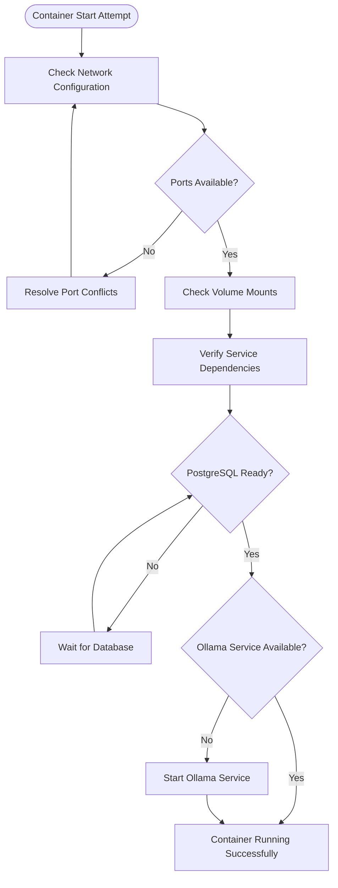
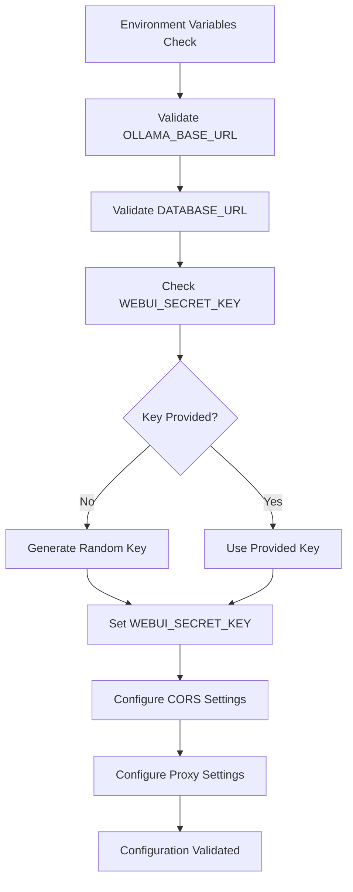
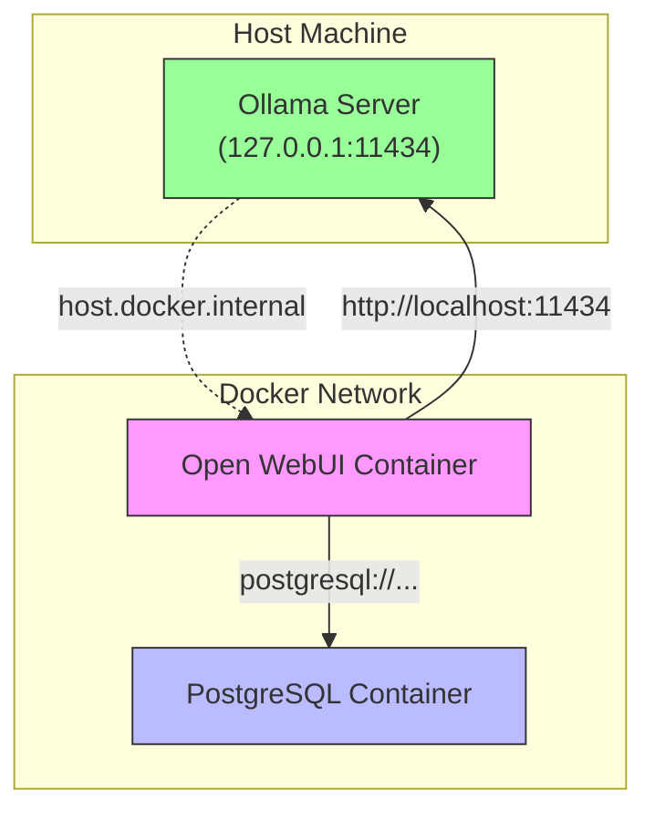
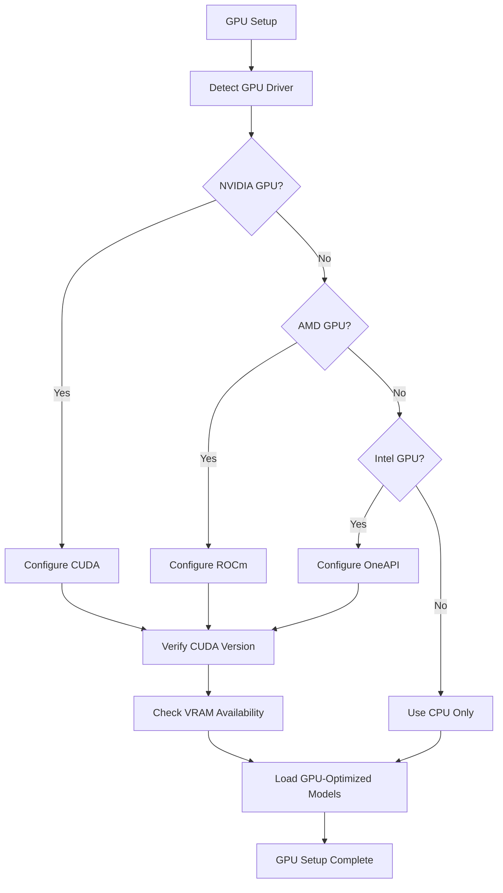

# Installation Issues

<cite>
**Referenced Files in This Document**   
- [README.md](file://README.md)
- [INSTALLATION.md](file://INSTALLATION.md)
- [TROUBLESHOOTING.md](file://TROUBLESHOOTING.md)
- [Dockerfile](file://Dockerfile)
- [docker-compose.yaml](file://docker-compose.yaml)
- [.env.example](file://.env.example)
- [backend/start.sh](file://backend/start.sh)
- [run-compose.sh](file://run-compose.sh)
- [run.sh](file://run.sh)
- [docker-compose.gpu.yaml](file://docker-compose.gpu.yaml)
- [docker-compose.api.yaml](file://docker-compose.api.yaml)
- [docker-compose.data.yaml](file://docker-compose.data.yaml)
- [docker-compose.playwright.yaml](file://docker-compose.playwright.yaml)
- [backend/requirements.txt](file://backend/requirements.txt)
</cite>

## Table of Contents
1. [Introduction](#introduction)
2. [Common Installation Problems](#common-installation-problems)
3. [Docker Container Failures](#docker-container-failures)
4. [Dependency Conflicts](#dependency-conflicts)
5. [Environment Variable Misconfigurations](#environment-variable-misconfigurations)
6. [Failed Builds](#failed-builds)
7. [Networking Issues in Containerized Environments](#networking-issues-in-containerized-environments)
8. [Missing Service Dependencies](#missing-service-dependencies)
9. [Platform-Specific Issues](#platform-specific-issues)
10. [GPU Setup Issues](#gpu-setup-issues)
11. [Verification Steps](#verification-steps)
12. [Troubleshooting Guide](#troubleshooting-guide)

## Introduction
This document provides comprehensive guidance on resolving installation issues encountered when setting up Open WebUI, a web interface for interacting with Ollama. The documentation covers common problems such as Docker container failures, dependency conflicts, environment variable misconfigurations, and platform-specific challenges. It includes step-by-step troubleshooting procedures, examples from docker-compose configurations, and common error messages from installation logs. The guide also addresses GPU setup issues and provides verification steps to confirm successful installation and connectivity between components.

**Section sources**
- [README.md](file://README.md)
- [TROUBLESHOOTING.md](file://TROUBLESHOOTING.md)

## Common Installation Problems
The installation of Open WebUI can encounter several common issues that prevent successful deployment. These include Docker container startup failures, dependency resolution problems, incorrect environment variable configurations, and networking issues between containers. The most frequent problems stem from misconfigured docker-compose files, missing dependencies, and improper GPU setup. Understanding these common issues is essential for efficient troubleshooting and successful deployment of the Open WebUI system.

**Section sources**
- [README.md](file://README.md)
- [TROUBLESHOOTING.md](file://TROUBLESHOOTING.md)
- [docker-compose.yaml](file://docker-compose.yaml)

## Docker Container Failures
Docker container failures are among the most common issues during Open WebUI installation. These failures can occur due to various reasons including network configuration problems, volume mounting issues, and container dependency conflicts. The primary cause is often related to the container's inability to connect to required services such as the PostgreSQL database or the Ollama server.

One frequent issue is the container failing to start due to port conflicts or incorrect network configurations. The docker-compose.yaml file defines the services and their configurations, including port mappings and network settings. When these configurations are incorrect or conflict with existing services on the host machine, container startup fails.

**Diagram sources**
- [docker-compose.yaml](file://docker-compose.yaml)
- [backend/start.sh](file://backend/start.sh)

**Section sources**
- [docker-compose.yaml](file://docker-compose.yaml)
- [backend/start.sh](file://backend/start.sh)
- [run.sh](file://run.sh)

## Dependency Conflicts
Dependency conflicts can arise during the installation process, particularly when multiple versions of the same package are required by different components. The backend/requirements.txt file lists all Python dependencies required by the Open WebUI backend, including fastapi, uvicorn, sqlalchemy, and various AI libraries. Conflicts may occur when these dependencies have incompatible version requirements.

Another source of dependency conflicts is the interaction between the frontend and backend components. The frontend, built with SvelteKit, has its own set of dependencies defined in package.json, while the backend relies on Python packages. When these dependencies require different versions of shared libraries or conflicting system packages, installation issues can occur.

The Dockerfile addresses dependency management by using a multi-stage build process. The first stage builds the frontend with npm ci --force, ensuring consistent dependency resolution. The second stage installs Python dependencies using pip3 and uv pip, with specific versions pinned to prevent conflicts. However, when customizing the installation or adding additional components, dependency conflicts may still arise.

**Section sources**
- [Dockerfile](file://Dockerfile)
- [backend/requirements.txt](file://backend/requirements.txt)
- [package.json](file://package.json)

## Environment Variable Misconfigurations
Environment variable misconfigurations are a frequent cause of installation issues in Open WebUI. The .env.example file provides a template for required environment variables, including OLLAMA_BASE_URL, WEBUI_SECRET_KEY, and database connection parameters. Incorrect values or missing variables can prevent the application from starting or functioning properly.

Key environment variables that commonly cause issues include:
- OLLAMA_BASE_URL: Must point to the correct Ollama server address
- DATABASE_URL: Requires proper PostgreSQL connection details
- WEBUI_SECRET_KEY: Essential for authentication and session management
- CORS_ALLOW_ORIGIN: Controls cross-origin resource sharing
- FORWARDED_ALLOW_IPS: Configures proxy trust settings

The backend/start.sh script handles environment variable processing, including generating a random WEBUI_SECRET_KEY if one is not provided. It also manages conditional execution based on environment variables, such as starting the Ollama service when USE_OLLAMA_DOCKER is set to true.

**Diagram sources**
- [.env.example](file://.env.example)
- [backend/start.sh](file://backend/start.sh)

**Section sources**
- [.env.example](file://.env.example)
- [backend/start.sh](file://backend/start.sh)
- [docker-compose.yaml](file://docker-compose.yaml)

## Failed Builds
Build failures can occur during the Docker image creation process, typically due to issues in the Dockerfile or missing build dependencies. The Dockerfile uses a multi-stage build process with specific build arguments that can affect the build outcome. Common build failure points include:

1. Node.js dependency installation in the frontend build stage
2. Python package installation in the backend stage
3. CUDA and GPU-related dependency installation
4. Downloading and caching of AI models

The build process can fail if network connectivity issues prevent downloading required packages or models. Additionally, insufficient system resources (memory, disk space) can cause build failures, particularly during the installation of large AI libraries and models.

The run-compose.sh script provides options to build the Docker image before running the compose project with the --build flag. This ensures that the latest code and dependencies are used, but can also expose build issues that were not present in pre-built images.

**Section sources**
- [Dockerfile](file://Dockerfile)
- [run-compose.sh](file://run-compose.sh)
- [backend/requirements.txt](file://backend/requirements.txt)

## Networking Issues in Containerized Environments
Networking issues are common in containerized deployments of Open WebUI, particularly when containers cannot communicate with each other or with external services. The primary networking challenge is ensuring that the Open WebUI container can reach the Ollama server at 127.0.0.1:11434 (host.docker.internal:11434) inside the container.

The docker-compose.yaml file addresses networking by using the extra_hosts directive to map host.docker.internal to host-gateway, allowing containers to access services running on the host machine. However, this configuration may not work in all environments, particularly on certain Linux distributions or when using different Docker network drivers.

The TROUBLESHOOTING.md document recommends using the --network=host flag in Docker commands to resolve connection issues. This approach changes the port from 3000 to 8080 and allows the container to share the host's network stack, eliminating network isolation issues.

**Diagram sources**
- [docker-compose.yaml](file://docker-compose.yaml)
- [TROUBLESHOOTING.md](file://TROUBLESHOOTING.md)

**Section sources**
- [docker-compose.yaml](file://docker-compose.yaml)
- [TROUBLESHOOTING.md](file://TROUBLESHOOTING.md)
- [run.sh](file://run.sh)

## Missing Service Dependencies
Missing service dependencies can prevent Open WebUI from functioning correctly. The system relies on several external services, with the most critical being the PostgreSQL database and the Ollama server. The docker-compose.yaml file defines these dependencies, but they may not be properly configured or available in all deployment scenarios.

The airis service in docker-compose.yaml depends on the postgres service, with a health check condition ensuring that the database is ready before starting the web application. This dependency management prevents startup issues caused by the application attempting to connect to an uninitialized database.

Additional services can be enabled through supplementary docker-compose files:
- docker-compose.gpu.yaml: Adds GPU support for Ollama
- docker-compose.api.yaml: Exposes the Ollama API externally
- docker-compose.data.yaml: Configures custom data volume mounting
- docker-compose.playwright.yaml: Adds Playwright service for web scraping

The run-compose.sh script orchestrates the inclusion of these supplementary configurations based on command-line arguments, ensuring that required services are included in the deployment.

**Section sources**
- [docker-compose.yaml](file://docker-compose.yaml)
- [docker-compose.gpu.yaml](file://docker-compose.gpu.yaml)
- [docker-compose.api.yaml](file://docker-compose.api.yaml)
- [docker-compose.data.yaml](file://docker-compose.data.yaml)
- [docker-compose.playwright.yaml](file://docker-compose.playwright.yaml)
- [run-compose.sh](file://run-compose.sh)

## Platform-Specific Issues
Platform-specific issues can arise when deploying Open WebUI on different operating systems. The system is designed to work across various platforms, but certain configurations may require adjustments based on the host operating system.

On Linux systems, the run-compose.sh script automatically detects the GPU driver using lspci and nvidia-smi commands, supporting NVIDIA, AMD, and Intel GPUs. This detection mechanism helps configure the appropriate GPU settings in the docker-compose configuration.

Windows and macOS systems may encounter issues with file path handling, line ending differences, and Docker Desktop configuration. The presence of start_windows.bat suggests specific considerations for Windows deployments, although the primary focus appears to be on Unix-like systems.

The Dockerfile uses Alpine Linux for the frontend build stage and Debian Slim for the backend, providing a consistent environment across different host operating systems. However, differences in Docker engine versions, storage drivers, and network configurations can still lead to platform-specific issues.

**Section sources**
- [run-compose.sh](file://run-compose.sh)
- [Dockerfile](file://Dockerfile)
- [start_windows.bat](file://start_windows.bat)

## GPU Setup Issues
GPU setup issues are common when attempting to leverage hardware acceleration for AI model processing. The open-webui repository provides specific configurations for GPU support through the docker-compose.gpu.yaml file and related build arguments in the Dockerfile.

The docker-compose.gpu.yaml file configures GPU access using Docker's device reservation system, specifying the GPU driver (defaulting to nvidia), count (defaulting to 1), and capabilities. The run-compose.sh script enhances this by automatically detecting the GPU driver and setting appropriate environment variables.

Key GPU-related build arguments in the Dockerfile include:
- USE_CUDA: Enables CUDA support
- USE_CUDA_VER: Specifies the CUDA version (default cu128)
- USE_OLLAMA: Installs Ollama with GPU support

When USE_CUDA is set to true, the Docker build process installs PyTorch with CUDA support and downloads AI models optimized for GPU execution. This can significantly improve performance but requires compatible hardware and drivers.

Common GPU setup issues include:
- Missing or incompatible GPU drivers
- Insufficient VRAM for model loading
- CUDA version mismatches
- Permission issues with device access

**Diagram sources**
- [docker-compose.gpu.yaml](file://docker-compose.gpu.yaml)
- [Dockerfile](file://Dockerfile)
- [run-compose.sh](file://run-compose.sh)

**Section sources**
- [docker-compose.gpu.yaml](file://docker-compose.gpu.yaml)
- [Dockerfile](file://Dockerfile)
- [run-compose.sh](file://run-compose.sh)

## Verification Steps
Verification steps are essential to confirm successful installation and connectivity between components. These steps ensure that all services are running correctly and can communicate with each other.

Basic verification steps include:
1. Checking container status with docker compose ps
2. Verifying service health through health check endpoints
3. Testing database connectivity
4. Confirming Ollama server accessibility
5. Validating API endpoint responses

The Dockerfile includes a HEALTHCHECK command that tests the /health endpoint on the configured port, providing a built-in mechanism for monitoring container health. This endpoint should return a status of true when the application is running correctly.

Additional verification can be performed by accessing the web interface and testing basic functionality, such as loading the login page and checking model availability. The settings page should display the correct Ollama server URL, and API calls to /ollama/api/tags should return the list of available models.

**Section sources**
- [Dockerfile](file://Dockerfile)
- [backend/start.sh](file://backend/start.sh)
- [docker-compose.yaml](file://docker-compose.yaml)

## Troubleshooting Guide
The troubleshooting guide provides step-by-step procedures for resolving common installation issues. Based on the TROUBLESHOOTING.md document and other configuration files, the following systematic approach can resolve most installation problems:

1. **Connection Issues**: If experiencing server connection errors, verify that the Open WebUI container can reach the Ollama server. Use the --network=host flag in Docker commands to resolve networking issues, which changes the access URL to http://localhost:8080.

2. **Environment Variables**: Ensure all required environment variables are correctly set, particularly OLLAMA_BASE_URL and DATABASE_URL. Verify these values in the docker-compose.yaml file and any .env files.

3. **Service Dependencies**: Confirm that dependent services (PostgreSQL, Ollama) are running before starting Open WebUI. Use docker compose ps to check service status and docker compose logs to view error messages.

4. **Build Issues**: If encountering build failures, ensure sufficient system resources (memory, disk space) are available. Clear Docker build cache if necessary and retry the build process.

5. **GPU Configuration**: For GPU-related issues, verify that the correct GPU driver is installed and accessible. Check that the OLLAMA_GPU_DRIVER and OLLAMA_GPU_COUNT environment variables are set correctly.

6. **Timeout Issues**: If experiencing slow response timeouts, adjust the AIOHTTP_CLIENT_TIMEOUT environment variable to increase the timeout duration beyond the default 5 minutes.

7. **Volume Mounting**: Ensure that data volumes are correctly mounted and have appropriate permissions. The airis service requires write access to the /app/backend/data directory.

8. **Port Conflicts**: Check for port conflicts with other services on the host machine. The default configuration uses port 3000 for the web interface and 5432 for PostgreSQL.

The run-compose.sh script provides a comprehensive interface for configuring and troubleshooting the installation, with options to enable GPU support, expose APIs, configure ports, and bind mount data directories.

**Section sources**
- [TROUBLESHOOTING.md](file://TROUBLESHOOTING.md)
- [run-compose.sh](file://run-compose.sh)
- [docker-compose.yaml](file://docker-compose.yaml)
- [backend/start.sh](file://backend/start.sh)
- [Dockerfile](file://Dockerfile)