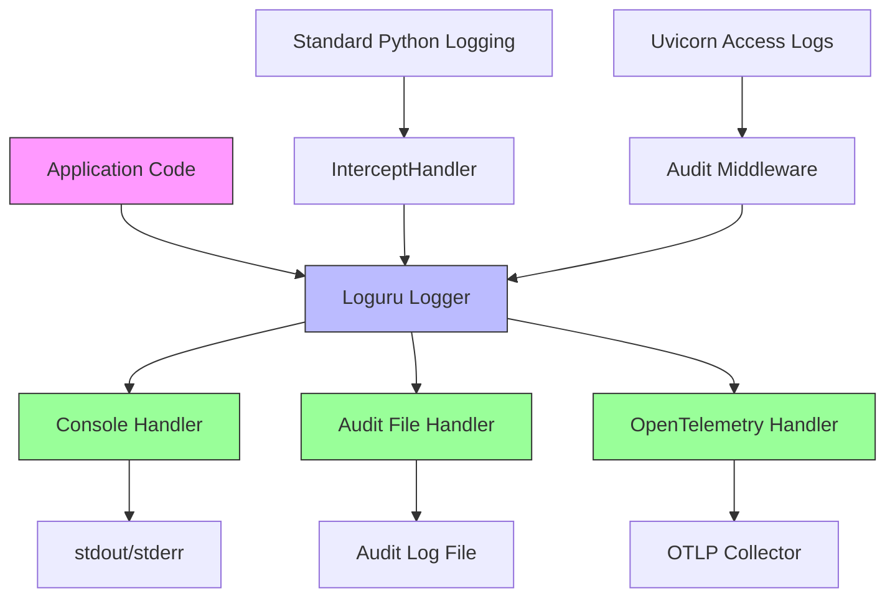
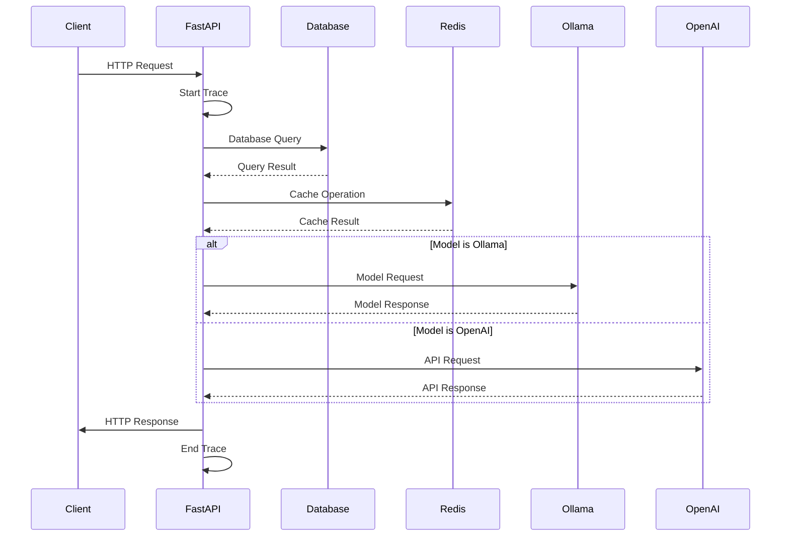
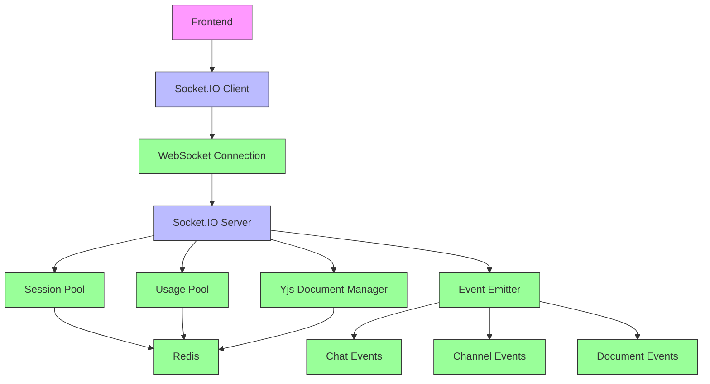
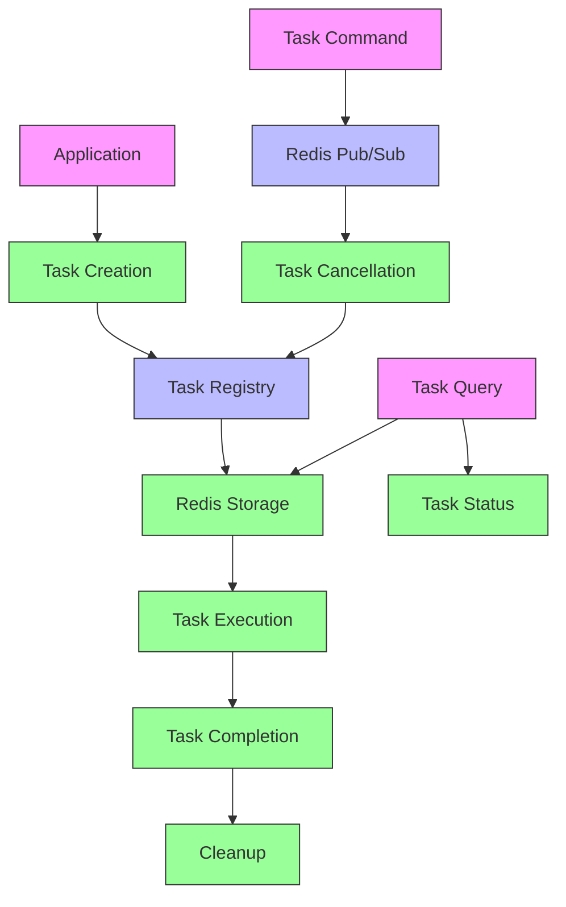

# Logging and Monitoring

<cite>
**Referenced Files in This Document**   
- [backend/open_webui/utils/logger.py](file://backend/open_webui/utils/logger.py)
- [backend/open_webui/utils/telemetry/setup.py](file://backend/open_webui/utils/telemetry/setup.py)
- [backend/open_webui/utils/telemetry/logs.py](file://backend/open_webui/utils/telemetry/logs.py)
- [backend/open_webui/utils/telemetry/metrics.py](file://backend/open_webui/utils/telemetry/metrics.py)
- [backend/open_webui/utils/telemetry/instrumentors.py](file://backend/open_webui/utils/telemetry/instrumentors.py)
- [backend/open_webui/utils/telemetry/constants.py](file://backend/open_webui/utils/telemetry/constants.py)
- [backend/open_webui/env.py](file://backend/open_webui/env.py)
- [backend/open_webui/main.py](file://backend/open_webui/main.py)
- [backend/open_webui/socket/main.py](file://backend/open_webui/socket/main.py)
- [backend/open_webui/utils/audit.py](file://backend/open_webui/utils/audit.py)
- [backend/open_webui/tasks.py](file://backend/open_webui/tasks.py)
</cite>

## Table of Contents
1. [Introduction](#introduction)
2. [Logging Architecture](#logging-architecture)
3. [Log Levels and Configuration](#log-levels-and-configuration)
4. [Audit Logging](#audit-logging)
5. [Telemetry System](#telemetry-system)
6. [WebSocket Monitoring](#websocket-monitoring)
7. [Background Task Monitoring](#background-task-monitoring)
8. [Critical Log Patterns](#critical-log-patterns)
9. [Monitoring Dashboard Setup](#monitoring-dashboard-setup)
10. [Production Alerting](#production-alerting)

## Introduction
Open WebUI provides a comprehensive logging and monitoring system that enables administrators and developers to track application behavior, diagnose issues, and ensure system reliability. The system combines structured logging, audit trails, OpenTelemetry-based metrics collection, and distributed tracing to provide full observability across all components. This documentation details the architecture, configuration options, and best practices for leveraging the monitoring capabilities in both development and production environments.

## Logging Architecture

Open WebUI's logging architecture is built around the Loguru library, which provides enhanced logging capabilities compared to Python's standard logging module. The system integrates with OpenTelemetry for comprehensive telemetry collection and supports multiple output destinations including console, file, and external telemetry collectors.

The core logging components are organized as follows:



**Diagram sources**
- [backend/open_webui/utils/logger.py](file://backend/open_webui/utils/logger.py#L23-L163)
- [backend/open_webui/utils/telemetry/logs.py](file://backend/open_webui/utils/telemetry/logs.py#L24-L54)
- [backend/open_webui/main.py](file://backend/open_webui/main.py#L572)

**Section sources**
- [backend/open_webui/utils/logger.py](file://backend/open_webui/utils/logger.py#L1-L163)
- [backend/open_webui/utils/telemetry/logs.py](file://backend/open_webui/utils/telemetry/logs.py#L1-L54)

## Log Levels and Configuration

Open WebUI supports granular log level configuration through environment variables, allowing different components to have independent logging verbosity. The system implements a hierarchical logging configuration with global and component-specific settings.

### Global and Component Log Levels

The logging system supports the following log levels in descending order of severity:
- CRITICAL
- ERROR
- WARNING
- INFO
- DEBUG
- TRACE

Configuration is managed through environment variables in the `env.py` file:

```mermaid
flowchart TD
A[Environment Variables] --> B[GLOBAL_LOG_LEVEL]
A --> C[AUDIO_LOG_LEVEL]
A --> D[COMFYUI_LOG_LEVEL]
A --> E[CONFIG_LOG_LEVEL]
A --> F[DB_LOG_LEVEL]
A --> G[IMAGES_LOG_LEVEL]
A --> H[MAIN_LOG_LEVEL]
A --> I[MODELS_LOG_LEVEL]
A --> J[OLLAMA_LOG_LEVEL]
A --> K[OPENAI_LOG_LEVEL]
A --> L[RAG_LOG_LEVEL]
A --> M[WEBHOOK_LOG_LEVEL]
A --> N[SOCKET_LOG_LEVEL]
A --> O[OAUTH_LOG_LEVEL]
B --> P[Default: INFO]
C --> P
D --> P
E --> P
F --> P
G --> P
H --> P
I --> P
J --> P
K --> P
L --> P
M --> P
N --> P
O --> P
style A fill:#f9f,stroke:#333
style B fill:#9f9,stroke:#333
style C fill:#9f9,stroke:#333
style D fill:#9f9,stroke:#333
style E fill:#9f9,stroke:#333
style F fill:#9f9,stroke:#333
style G fill:#9f9,stroke:#333
style H fill:#9f9,stroke:#333
style I fill:#9f9,stroke:#333
style J fill:#9f9,stroke:#333
style K fill:#9f9,stroke:#333
style L fill:#9f9,stroke:#333
style M fill:#9f9,stroke:#333
style N fill:#9f9,stroke:#333
style O fill:#9f9,stroke:#333
```



The logging system is initialized in the `start_logger()` function, which configures handlers for both console output and audit logging:

```python
def start_logger():
    """
    Initializes and configures Loguru's logger with distinct handlers:
    
    A console (stdout) handler for general log messages (excluding those marked as auditable).
    An optional file handler for audit logs if audit logging is enabled.
    Additionally, this function reconfigures Python’s standard logging to route through Loguru and adjusts logging levels for Uvicorn.
    """
    logger.remove()
    
    logger.add(
        sys.stdout,
        level=GLOBAL_LOG_LEVEL,
        format=stdout_format,
        filter=lambda record: "auditable" not in record["extra"],
    )
    if AUDIT_LOG_LEVEL != "NONE":
        try:
            logger.add(
                AUDIT_LOGS_FILE_PATH,
                level="INFO",
                rotation=AUDIT_LOG_FILE_ROTATION_SIZE,
                compression="zip",
                format=file_format,
                filter=lambda record: record["extra"].get("auditable") is True,
            )
        except Exception as e:
            logger.error(f"Failed to initialize audit log file handler: {str(e)}")
```

**Section sources**
- [backend/open_webui/env.py](file://backend/open_webui/env.py#L74-L114)
- [backend/open_webui/utils/logger.py](file://backend/open_webui/utils/logger.py#L116-L163)

## Audit Logging

Open WebUI implements comprehensive audit logging to track security-relevant events and API interactions. The audit logging system captures detailed information about requests and responses, with configurable levels of detail.

### Audit Log Levels

The system supports three levels of audit logging, controlled by the `AUDIT_LOG_LEVEL` environment variable:

| Audit Level | Description | Data Captured |
|-------------|-------------|---------------|
| NONE | No audit logging | None |
| METADATA | Basic request metadata | User, timestamp, request URI, HTTP method, status code, source IP, user agent |
| REQUEST | Request metadata and body | All METADATA fields plus request body |
| REQUEST_RESPONSE | Complete request and response | All REQUEST fields plus response body |

### Audit Log Format

Audit logs are written in structured JSON format to facilitate parsing and analysis. Each audit log entry contains the following fields:

```json
{
  "id": "unique-uuid",
  "timestamp": 1700000000,
  "user": {
    "id": "user-id",
    "name": "username",
    "email": "user@example.com",
    "role": "user-role"
  },
  "audit_level": "REQUEST_RESPONSE",
  "verb": "POST",
  "request_uri": "https://example.com/api/v1/chats",
  "response_status_code": 200,
  "source_ip": "192.168.1.1",
  "user_agent": "Mozilla/5.0...",
  "request_object": {"model": "llama2", "messages": [...]},
  "response_object": {"id": "chat-123", "title": "New Chat"},
  "extra": {}
}
```

### Audit Log Configuration

Audit logging is configured through the following environment variables:

- `AUDIT_LOGS_FILE_PATH`: Path to the audit log file (default: `{DATA_DIR}/audit.log`)
- `AUDIT_LOG_FILE_ROTATION_SIZE`: Maximum size before log rotation (default: "10MB")
- `AUDIT_UVICORN_LOGGER_NAMES`: Comma-separated list of logger names to audit (default: "uvicorn.access")
- `AUDIT_LOG_LEVEL`: Audit level (NONE, METADATA, REQUEST, REQUEST_RESPONSE)
- `MAX_BODY_LOG_SIZE`: Maximum size of request/response bodies to log (default: 2048 bytes)
- `AUDIT_EXCLUDED_PATHS`: Comma-separated list of paths to exclude from audit logging (default: "/chats,/chat,/folders")

The audit logging middleware automatically redacts sensitive information such as passwords from logged request bodies.

**Section sources**
- [backend/open_webui/utils/audit.py](file://backend/open_webui/utils/audit.py#L1-L284)
- [backend/open_webui/env.py](file://backend/open_webui/env.py#L773-L800)
- [backend/open_webui/utils/logger.py](file://backend/open_webui/utils/logger.py#L87-L114)

## Telemetry System

Open WebUI integrates with OpenTelemetry to provide comprehensive metrics collection, distributed tracing, and log export capabilities. The telemetry system enables monitoring of application performance, error tracking, and service dependencies.

### Metrics Collection

The system collects the following metrics using OpenTelemetry:

- `http.server.requests`: Counter of HTTP requests with attributes for method, route, and status code
- `http.server.duration`: Histogram of HTTP request duration in milliseconds
- `webui.users.total`: Observable gauge of total registered users
- `webui.users.active`: Observable gauge of currently active users
- `webui.users.active.today`: Observable gauge of users active since midnight

These metrics are exported to an OTLP collector, which can expose them via a Prometheus `/metrics` endpoint for integration with monitoring systems like Grafana.

### Distributed Tracing

Open WebUI implements distributed tracing across multiple components and external services:



The tracing system is automatically instrumented for:
- FastAPI endpoints
- SQLAlchemy database operations
- Redis operations
- HTTP requests (requests, HTTPX, aiohttp)
- Logging framework

### Telemetry Configuration

The telemetry system is configured through environment variables:

- `ENABLE_OTEL`: Enable OpenTelemetry (default: false)
- `ENABLE_OTEL_TRACES`: Enable distributed tracing (default: true if ENABLE_OTEL)
- `ENABLE_OTEL_METRICS`: Enable metrics collection (default: true if ENABLE_OTEL)
- `ENABLE_OTEL_LOGS`: Enable log export (default: true if ENABLE_OTEL)
- `OTEL_SERVICE_NAME`: Service name for telemetry (default: "open-webui")
- `OTEL_EXPORTER_OTLP_ENDPOINT`: OTLP collector endpoint
- `OTEL_EXPORTER_OTLP_INSECURE`: Disable TLS for OTLP exporter
- `OTEL_BASIC_AUTH_USERNAME` and `OTEL_BASIC_AUTH_PASSWORD`: Basic authentication for OTLP endpoint

**Diagram sources**
- [backend/open_webui/utils/telemetry/setup.py](file://backend/open_webui/utils/telemetry/setup.py#L1-L59)
- [backend/open_webui/utils/telemetry/metrics.py](file://backend/open_webui/utils/telemetry/metrics.py#L1-L204)
- [backend/open_webui/utils/telemetry/instrumentors.py](file://backend/open_webui/utils/telemetry/instrumentors.py#L1-L203)

**Section sources**
- [backend/open_webui/utils/telemetry/setup.py](file://backend/open_webui/utils/telemetry/setup.py#L1-L59)
- [backend/open_webui/utils/telemetry/metrics.py](file://backend/open_webui/utils/telemetry/metrics.py#L1-L204)
- [backend/open_webui/utils/telemetry/instrumentors.py](file://backend/open_webui/utils/telemetry/instrumentors.py#L1-L203)

## WebSocket Monitoring

Open WebUI uses Socket.IO for real-time communication between the frontend and backend, particularly for chat completions and collaborative editing. The WebSocket system includes comprehensive monitoring and logging capabilities.

### WebSocket Architecture



### WebSocket Configuration

WebSocket monitoring is configured through the following environment variables:

- `ENABLE_WEBSOCKET_SUPPORT`: Enable WebSocket support (default: true)
- `WEBSOCKET_MANAGER`: Manager type (redis or memory)
- `WEBSOCKET_REDIS_URL`: Redis URL for WebSocket manager
- `WEBSOCKET_REDIS_CLUSTER`: Enable Redis cluster mode
- `WEBSOCKET_REDIS_LOCK_TIMEOUT`: Lock timeout for Redis operations
- `WEBSOCKET_SENTINEL_HOSTS`: Redis Sentinel hosts
- `WEBSOCKET_SENTINEL_PORT`: Redis Sentinel port
- `WEBSOCKET_SERVER_LOGGING`: Enable Socket.IO server logging
- `WEBSOCKET_SERVER_ENGINEIO_LOGGING`: Enable Engine.IO logging
- `WEBSOCKET_SERVER_PING_TIMEOUT`: Ping timeout in seconds
- `WEBSOCKET_SERVER_PING_INTERVAL`: Ping interval in seconds

The system maintains several pools for monitoring WebSocket activity:
- **Session Pool**: Tracks active user sessions
- **Usage Pool**: Tracks model usage by WebSocket connections
- **Yjs Document Manager**: Manages collaborative editing sessions

**Section sources**
- [backend/open_webui/socket/main.py](file://backend/open_webui/socket/main.py#L1-L839)
- [backend/open_webui/env.py](file://backend/open_webui/env.py#L613-L662)

## Background Task Monitoring

Open WebUI manages background tasks using asyncio and Redis for distributed task coordination. The system provides monitoring and control capabilities for long-running operations.

### Task Management Architecture



### Task Monitoring Features

The background task system provides the following monitoring capabilities:

- **Task Creation**: Each task is assigned a unique UUID and registered in Redis
- **Task Association**: Tasks can be associated with specific items (e.g., documents, chats)
- **Task Listing**: APIs to list all active tasks or tasks associated with a specific item
- **Task Cancellation**: Distributed task cancellation via Redis Pub/Sub
- **Automatic Cleanup**: Tasks are automatically cleaned up when completed or cancelled

Key functions for task monitoring:
- `create_task()`: Create and register a new background task
- `list_tasks()`: List all active task IDs
- `list_task_ids_by_item_id()`: List tasks associated with a specific item
- `stop_task()`: Cancel a specific task
- `stop_item_tasks()`: Cancel all tasks associated with an item
- `redis_task_command_listener()`: Listen for distributed task commands

**Section sources**
- [backend/open_webui/tasks.py](file://backend/open_webui/tasks.py#L1-L187)
- [backend/open_webui/socket/main.py](file://backend/open_webui/socket/main.py#L44-L67)

## Critical Log Patterns

Certain log patterns indicate potential system issues or security concerns that require immediate attention.

### Database Connection Issues
```
ERROR:db: Failed to connect to database: connection timeout
ERROR:db: Database pool exhausted - increase DATABASE_POOL_SIZE
WARNING:db: Long-running query detected (>30s): SELECT * FROM large_table
```

### Authentication and Security Issues
```
WARNING:auth: Failed login attempt from IP 192.168.1.100
ERROR:auth: Invalid JWT token: signature verification failed
WARNING:audit: Multiple failed login attempts from same IP - potential brute force attack
```

### Resource Exhaustion
```
ERROR:MAIN: Task queue full - unable to process new requests
WARNING:MAIN: Memory usage above 80% threshold
ERROR:SOCKET: WebSocket connection limit reached
WARNING:REDIS: Redis memory usage above 80% threshold
```

### External Service Failures
```
ERROR:OLLAMA: Failed to connect to Ollama server at http://localhost:11434
ERROR:OPENAI: OpenAI API request failed: rate limit exceeded
ERROR:RETRIEVAL: Web search failed: connection timeout to search API
```

### Performance Issues
```
WARNING:MAIN: HTTP request duration > 10s for endpoint POST /api/v1/chat/completions
ERROR:MAIN: Background task timeout after 300s
WARNING:MAIN: High latency detected in database query (2.5s)
```

### Configuration Issues
```
ERROR:CONFIG: Invalid configuration value for CHUNK_SIZE: must be positive integer
WARNING:CONFIG: Deprecated environment variable OLLAMA_BASE_URL used - use OLLAMA_BASE_URLS instead
ERROR:CONFIG: Required environment variable WEBUI_SECRET_KEY not set
```

## Monitoring Dashboard Setup

To set up comprehensive monitoring for Open WebUI, integrate with standard observability tools using the available telemetry data.

### Prometheus and Grafana Setup

1. **Configure OTLP Exporter**:
```yaml
# docker-compose.yaml
services:
  otel-collector:
    image: otel/opentelemetry-collector
    command: ["--config=/etc/otel-collector-config.yaml"]
    volumes:
      - ./otel-config.yaml:/etc/otel-collector-config.yaml
    ports:
      - "4317:4317"  # OTLP gRPC
      - "8888:8888"  # Prometheus metrics

  prometheus:
    image: prom/prometheus
    ports:
      - "9090:9090"
    volumes:
      - ./prometheus.yml:/etc/prometheus/prometheus.yml

  grafana:
    image: grafana/grafana
    ports:
      - "3000:3000"
    environment:
      - GF_SECURITY_ADMIN_PASSWORD=admin
```

2. **OTEL Collector Configuration** (`otel-config.yaml`):
```yaml
receivers:
  otlp:
    protocols:
      grpc:
      http:

processors:
  batch:

exporters:
  prometheus:
    endpoint: "0.0.0.0:8888"
    resource_to_telemetry_conversion:
      enabled: true

service:
  pipelines:
    metrics:
      receivers: [otlp]
      processors: [batch]
      exporters: [prometheus]
```

3. **Environment Variables**:
```bash
ENABLE_OTEL=true
ENABLE_OTEL_METRICS=true
OTEL_EXPORTER_OTLP_ENDPOINT=http://otel-collector:4317
OTEL_SERVICE_NAME=open-webui
```

### Key Dashboard Metrics

Create Grafana dashboards with the following panels:

**System Overview**
- HTTP Request Rate (requests per second)
- HTTP Error Rate (4xx and 5xx responses)
- Average Request Duration
- Active WebSocket Connections
- Active Users (current and daily)

**Database Performance**
- Database Query Rate
- Slow Query Count (>1s)
- Database Connection Pool Usage
- Database Latency Percentiles

**Model Performance**
- Model Request Rate by model
- Model Error Rate by model
- Model Latency by model
- Active Models in Use

**Resource Utilization**
- Memory Usage
- CPU Usage
- Redis Memory Usage
- Disk I/O

## Production Alerting

Implement alerting rules to proactively identify and respond to system issues in production environments.

### Critical Alerts

**High HTTP Error Rate**
```
IF: http_server_requests_count{status_code=~"5.."}[5m] / http_server_requests_count[5m] > 0.1
FOR: 2m
LABELS: severity=critical
ANNOTATIONS: 
  summary: "High error rate on Open WebUI"
  description: "More than 10% of requests are failing with 5xx errors"
```

**Service Unavailable**
```
IF: up{job="open-webui"} == 0
FOR: 1m
LABELS: severity=critical
ANNOTATIONS:
  summary: "Open WebUI service down"
  description: "Open WebUI instance is not reachable"
```

**Database Connection Issues**
```
IF: rate(http_server_requests_count{status_code="500", endpoint="/api/v1/db/health"}[5m]) > 0
FOR: 5m
LABELS: severity=critical
ANNOTATIONS:
  summary: "Database connectivity issues"
  description: "Database health checks are failing"
```

### Warning Alerts

**High Request Latency**
```
IF: histogram_quantile(0.95, sum(rate(http_server_duration_bucket[5m])) by (le)) > 5
FOR: 10m
LABELS: severity=warning
ANNOTATIONS:
  summary: "High API latency"
  description: "95th percentile of API requests taking more than 5 seconds"
```

**Memory Pressure**
```
IF: process_resident_memory_bytes / machine_memory_bytes > 0.8
FOR: 15m
LABELS: severity=warning
ANNOTATIONS:
  summary: "High memory usage"
  description: "Open WebUI is using more than 80% of available memory"
```

**WebSocket Connection Limits**
```
IF: websocket_connections > 0.9 * max_websocket_connections
FOR: 5m
LABELS: severity=warning
ANNOTATIONS:
  summary: "WebSocket connection limit approaching"
  description: "WebSocket connections are approaching the configured limit"
```

### Audit Log Alerts

**Suspicious Authentication Activity**
```
IF: count_over_time(audit_log_entries{audit_level="METADATA", verb="POST", request_uri="/api/v1/auths/signin", response_status_code="401"}[15m]) > 10
FOR: 1m
LABELS: severity=warning
ANNOTATIONS:
  summary: "Potential brute force attack"
  description: "Multiple failed login attempts detected from the same source"
```

**Unauthorized Access Attempts**
```
IF: count_over_time(audit_log_entries{audit_level="METADATA", response_status_code="403"}[1h]) > 50
FOR: 5m
LABELS: severity=warning
ANNOTATIONS:
  summary: "Multiple unauthorized access attempts"
  description: "High number of 403 responses indicating access control issues"
```

These alerts should be integrated with notification systems such as email, Slack, or PagerDuty to ensure timely response to critical issues.

**Section sources**
- [backend/open_webui/utils/telemetry/metrics.py](file://backend/open_webui/utils/telemetry/metrics.py#L7-L204)
- [backend/open_webui/utils/audit.py](file://backend/open_webui/utils/audit.py#L1-L284)
- [backend/open_webui/socket/main.py](file://backend/open_webui/socket/main.py#L1-L839)