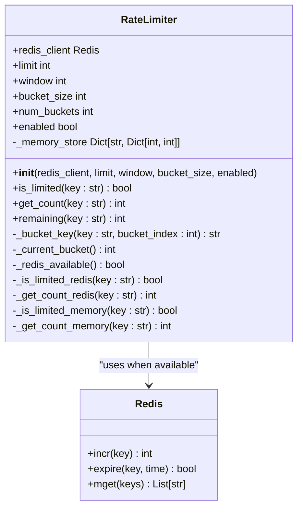
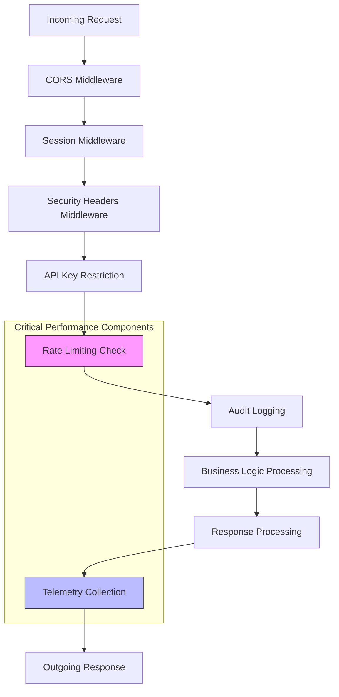
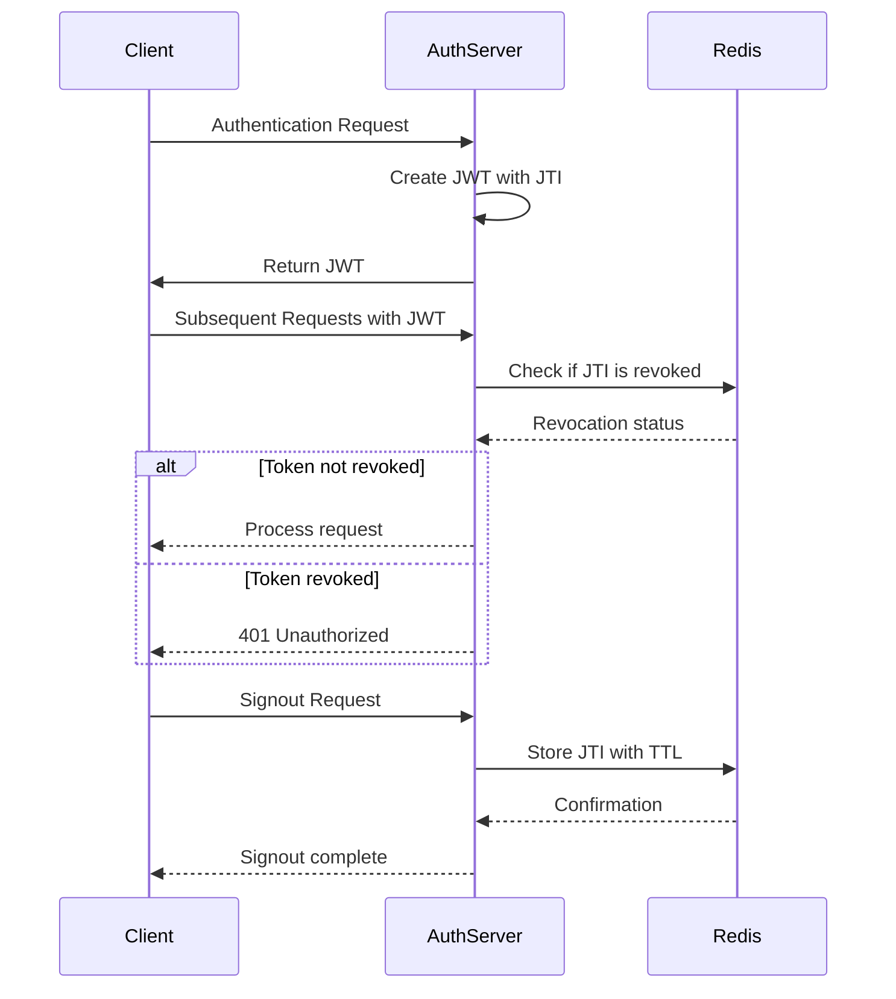
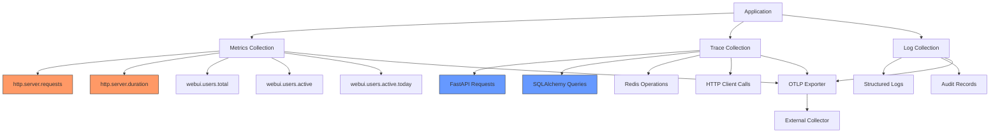

# Backend Performance Optimization

<cite>
**Referenced Files in This Document**   
- [rate_limit.py](file://backend/open_webui/utils/rate_limit.py)
- [middleware.py](file://backend/open_webui/utils/middleware.py)
- [main.py](file://backend/open_webui/main.py)
- [auths.py](file://backend/open_webui/routers/auths.py)
- [redis.py](file://backend/open_webui/utils/redis.py)
- [telemetry/metrics.py](file://backend/open_webui/utils/telemetry/metrics.py)
- [telemetry/setup.py](file://backend/open_webui/utils/telemetry/setup.py)
- [telemetry/instrumentors.py](file://backend/open_webui/utils/telemetry/instrumentors.py)
- [config.py](file://backend/open_webui/config.py)
- [env.py](file://backend/open_webui/env.py)
</cite>

## Table of Contents
1. [Introduction](#introduction)
2. [Rate Limiting System](#rate-limiting-system)
3. [Middleware Pipeline](#middleware-pipeline)
4. [API Response Optimization](#api-response-optimization)
5. [JWT Configuration and Management](#jwt-configuration-and-management)
6. [Concurrency and Thread Pool Settings](#concurrency-and-thread-pool-settings)
7. [Telemetry and Performance Monitoring](#telemetry-and-performance-monitoring)
8. [Scaling Best Practices](#scaling-best-practices)
9. [Conclusion](#conclusion)

## Introduction
This document provides comprehensive guidance on backend performance optimization for the open-webui application. It covers critical aspects including rate limiting, middleware pipeline configuration, API response optimization, JWT management, concurrency settings, and performance monitoring. The document focuses on the implementation details of the RateLimiter class, which uses Redis with a fallback to in-memory storage, and explains how to configure and tune this system for optimal performance. Additionally, it addresses best practices for scaling the FastAPI backend under high load conditions and provides insights into the telemetry metrics collection system used for performance analysis.

## Rate Limiting System

The open-webui application implements a robust rate limiting system through the RateLimiter class, which provides protection against abuse while maintaining high availability. The system is designed with a fallback mechanism to ensure functionality even when Redis is unavailable.

The RateLimiter class uses a rolling window strategy to track request counts over time. It is initialized with parameters that define the maximum number of allowed events within a specified time window. The implementation supports both Redis-based storage for distributed environments and in-memory storage as a fallback option.

For authentication endpoints, a specific rate limiter instance is configured with a limit of 15 requests within a 3-minute window. This configuration is applied to the signin endpoint to prevent brute force attacks while allowing legitimate users to authenticate normally. The rate limiter is integrated into the authentication flow by checking the limit before processing login credentials, and returning a 429 Too Many Requests status if the limit is exceeded.

**Diagram sources**
- [rate_limit.py](file://backend/open_webui/utils/rate_limit.py#L6-L140)
- [redis.py](file://backend/open_webui/utils/redis.py#L1-L231)

**Section sources**
- [rate_limit.py](file://backend/open_webui/utils/rate_limit.py#L1-L140)
- [auths.py](file://backend/open_webui/routers/auths.py#L85-L88)
- [main.py](file://backend/open_webui/main.py#L585-L592)

## Middleware Pipeline

The application implements a comprehensive middleware pipeline that processes requests and responses through multiple stages. This pipeline is responsible for various cross-cutting concerns including authentication, rate limiting, logging, and performance monitoring.

The middleware architecture follows a layered approach where each middleware component focuses on a specific responsibility. The pipeline begins with CORS handling, followed by session management, security headers, and custom business logic middleware. The order of middleware execution is crucial for proper functionality, with authentication and rate limiting components positioned early in the pipeline to reject unauthorized or abusive requests before they consume significant resources.

Key middleware components include:
- **CompressMiddleware**: Handles response compression to reduce bandwidth usage
- **SecurityHeadersMiddleware**: Adds security-related HTTP headers to responses
- **APIKeyRestrictionMiddleware**: Enforces API key access restrictions based on configuration
- **AuditLoggingMiddleware**: Captures request and response data for auditing purposes
- **Telemetry middleware**: Collects performance metrics and traces for monitoring

The middleware pipeline also includes specialized components for handling WebSocket connections and redirecting specific URL patterns. These components work together to create a robust foundation for the application's request processing flow.

**Diagram sources**
- [main.py](file://backend/open_webui/main.py#L1249-L1387)
- [middleware.py](file://backend/open_webui/utils/middleware.py#L1-L800)
- [security_headers.py](file://backend/open_webui/utils/security_headers.py)

**Section sources**
- [main.py](file://backend/open_webui/main.py#L1249-L1387)
- [middleware.py](file://backend/open_webui/utils/middleware.py#L1-L800)

## API Response Optimization

The application implements several strategies to optimize API response times and improve overall performance. These optimizations focus on reducing latency, minimizing payload sizes, and efficiently handling different types of requests.

One key optimization is the implementation of response compression through the CompressMiddleware. This middleware automatically compresses response bodies when appropriate, significantly reducing bandwidth usage and improving response times for clients with limited connectivity. The compression is applied selectively based on content type and size to avoid unnecessary processing overhead for small responses.

For streaming responses, the application uses FastAPI's StreamingResponse class to enable server-sent events. This allows for real-time data transmission without requiring the client to poll for updates. The streaming implementation includes configurable chunk sizes to balance between responsiveness and network efficiency.

The application also optimizes JSON responses by using Pydantic models for serialization, which provides both type safety and performance benefits. Response models are carefully designed to include only necessary fields, reducing payload sizes and improving parsing performance on the client side.

Additional optimizations include:
- Caching of frequently accessed data
- Efficient database query patterns
- Asynchronous processing of non-critical operations
- Connection pooling for database and external service calls

**Section sources**
- [middleware.py](file://backend/open_webui/utils/middleware.py#L1-L800)
- [main.py](file://backend/open_webui/main.py#L1249-L1387)
- [response.py](file://backend/open_webui/utils/response.py)

## JWT Configuration and Management

The application uses JSON Web Tokens (JWT) for authentication and session management, with configurable expiration settings to balance security and user experience. The JWT configuration is managed through environment variables and persistent configuration settings, allowing administrators to adjust token lifetimes without code changes.

The default JWT expiration is set to 4 weeks ("4w"), providing a reasonable balance between security and convenience for users. This value can be adjusted using the JWT_EXPIRES_IN environment variable, which accepts various time units including milliseconds (ms), seconds (s), minutes (m), hours (h), days (d), and weeks (w). A special value of "-1" can be used to create tokens that never expire, though this is not recommended for production environments due to security implications.

Token management includes features for token invalidation and revocation. When a user signs out, the token's JTI (JWT ID) is stored in Redis with a TTL matching the remaining token lifetime, effectively blacklisting it. This prevents the use of previously valid tokens after signout. The token validation process checks Redis for revoked tokens before accepting them, ensuring that invalidated sessions cannot be reused.

The JWT implementation also supports trusted email headers for environments where authentication is handled by a reverse proxy or external identity provider. This allows the application to accept user identity information from trusted sources without requiring additional authentication steps.

**Diagram sources**
- [auth.py](file://backend/open_webui/utils/auth.py#L194-L242)
- [auths.py](file://backend/open_webui/routers/auths.py#L589-L592)
- [config.py](file://backend/open_webui/config.py#L314-L316)

**Section sources**
- [auth.py](file://backend/open_webui/utils/auth.py#L194-L242)
- [auths.py](file://backend/open_webui/routers/auths.py#L589-L592)
- [config.py](file://backend/open_webui/config.py#L314-L369)
- [env.py](file://backend/open_webui/env.py#L440-L458)

## Concurrency and Thread Pool Settings

The application configures concurrency settings to optimize performance under varying load conditions. These settings control the number of threads available for handling requests and background tasks, balancing resource utilization with responsiveness.

The thread pool size is configurable through the THREAD_POOL_SIZE environment variable. When this variable is set to a positive value, it limits the number of concurrent threads that can be used for request processing. This helps prevent resource exhaustion under high load by limiting the number of simultaneous operations. The default behavior is to use the system's default thread pool configuration, which typically scales with the number of CPU cores.

For asynchronous operations, the application uses AnyIO as the backend for FastAPI, which provides efficient coroutine scheduling. The thread pool configuration affects both synchronous and asynchronous code paths, as async code may still need to run synchronous functions in threads.

The concurrency model also considers the nature of different operations:
- CPU-intensive tasks are limited to prevent overwhelming the processor
- I/O-bound operations can utilize more threads since they spend time waiting for external resources
- Background tasks are managed separately to avoid impacting request response times

Proper tuning of concurrency settings requires monitoring system resources and adjusting based on observed performance. Under-provisioning can lead to poor responsiveness during peak loads, while over-provisioning can cause excessive context switching and memory usage.

**Section sources**
- [main.py](file://backend/open_webui/main.py#L599-L602)
- [config.py](file://backend/open_webui/config.py#L130-L131)
- [env.py](file://backend/open_webui/env.py#L129-L131)

## Telemetry and Performance Monitoring

The application includes a comprehensive telemetry system for performance monitoring and analysis. This system collects metrics, traces, and logs to provide insights into application behavior and identify performance bottlenecks.

When OpenTelemetry (OTEL) is enabled, the application exports metrics and traces to an external collector. The metrics collected include HTTP server request counts and duration histograms, with attributes for HTTP method, route, and status code. These metrics enable detailed analysis of API performance across different endpoints and response types.

The telemetry system is configured through environment variables that control:
- Service name for identification in monitoring systems
- OTLP endpoint for exporting data
- Authentication credentials for secure transmission
- Exporter type (gRPC or HTTP)

Key metrics collected by the system:
- **http.server.requests**: Counter of HTTP requests, useful for monitoring traffic patterns
- **http.server.duration**: Histogram of request processing times, essential for identifying slow endpoints
- **webui.users.total**: Gauge of total registered users
- **webui.users.active**: Gauge of currently active users
- **webui.users.active.today**: Gauge of users active during the current day

The system also instruments various components including:
- FastAPI application
- SQLAlchemy database operations
- Redis commands
- HTTP client requests (requests, HTTPX, aiohttp)

This comprehensive instrumentation provides end-to-end visibility into the application's performance characteristics and helps identify optimization opportunities.

**Diagram sources**
- [setup.py](file://backend/open_webui/utils/telemetry/setup.py#L1-L32)
- [metrics.py](file://backend/open_webui/utils/telemetry/metrics.py#L1-L179)
- [instrumentors.py](file://backend/open_webui/utils/telemetry/instrumentors.py#L1-L203)
- [main.py](file://backend/open_webui/main.py#L691-L694)

**Section sources**
- [setup.py](file://backend/open_webui/utils/telemetry/setup.py#L1-L32)
- [metrics.py](file://backend/open_webui/utils/telemetry/metrics.py#L1-L179)
- [instrumentors.py](file://backend/open_webui/utils/telemetry/instrumentors.py#L1-L203)
- [main.py](file://backend/open_webui/main.py#L691-L694)

## Scaling Best Practices

To effectively scale the FastAPI backend under high load, several best practices should be followed. These practices address both vertical scaling (increasing resources on a single server) and horizontal scaling (adding more servers).

For vertical scaling, optimize resource allocation by:
- Adjusting the thread pool size based on CPU core count and workload characteristics
- Ensuring sufficient memory is available for the application and its dependencies
- Using Redis for distributed rate limiting and session storage
- Configuring appropriate connection pool sizes for database and external services

For horizontal scaling, implement:
- Load balancing across multiple application instances
- Shared Redis instance for rate limiting and session data
- Shared database with appropriate connection pooling
- External storage for file uploads and other shared resources

Additional scaling considerations:
- **Caching strategy**: Implement multi-level caching using Redis for frequently accessed data
- **Database optimization**: Use connection pooling, optimize queries, and consider read replicas for high-read workloads
- **Static file serving**: Offload static file serving to a CDN or dedicated web server
- **Background processing**: Move long-running tasks to background workers to keep request processing fast
- **Monitoring and alerting**: Implement comprehensive monitoring to detect performance issues early

When deploying in containerized environments, ensure proper resource limits and requests are configured to prevent resource contention. Use health checks to ensure load balancers route traffic only to healthy instances.

**Section sources**
- [main.py](file://backend/open_webui/main.py#L585-L592)
- [redis.py](file://backend/open_webui/utils/redis.py#L1-L231)
- [config.py](file://backend/open_webui/config.py)
- [env.py](file://backend/open_webui/env.py)

## Conclusion
The open-webui application provides a comprehensive set of performance optimization features that can be configured to meet various deployment requirements. The rate limiting system, built around the RateLimiter class with Redis fallback, effectively protects against abuse while maintaining availability. The middleware pipeline efficiently handles cross-cutting concerns, and the telemetry system provides valuable insights for performance analysis.

By properly configuring JWT expiration, concurrency settings, and leveraging the telemetry capabilities, administrators can optimize the application for their specific use cases. Following the scaling best practices outlined in this document will help ensure reliable performance even under high load conditions. Regular monitoring and adjustment of these settings based on actual usage patterns will further enhance the application's performance and user experience.