# Middleware Pipeline Optimization

<cite>
**Referenced Files in This Document**   
- [middleware.py](file://backend/open_webui/utils/middleware.py)
- [main.py](file://backend/open_webui/main.py)
- [security_headers.py](file://backend/open_webui/utils/security_headers.py)
- [rate_limit.py](file://backend/open_webui/utils/rate_limit.py)
- [auth.py](file://backend/open_webui/utils/auth.py)
- [config.py](file://backend/open_webui/config.py)
</cite>

## Table of Contents
1. [Introduction](#introduction)
2. [Middleware Execution Order](#middleware-execution-order)
3. [Authentication and Authorization](#authentication-and-authorization)
4. [Security Headers Configuration](#security-headers-configuration)
5. [Rate Limiting Implementation](#rate-limiting-implementation)
6. [Request Timing and Performance Monitoring](#request-timing-and-performance-monitoring)
7. [CORS Handling](#cors-handling)
8. [Error Handling and Response Processing](#error-handling-and-response-processing)
9. [Best Practices for Middleware Optimization](#best-practices-for-middleware-optimization)
10. [Performance Impact Analysis](#performance-impact-analysis)
11. [Conclusion](#conclusion)

## Introduction
The FastAPI backend of the Open WebUI application implements a comprehensive middleware pipeline to handle various aspects of request processing, including authentication, security, rate limiting, and performance monitoring. This document provides a detailed analysis of the middleware optimization strategies employed in the system, focusing on the request processing pipeline, middleware execution order, and performance implications. The middleware architecture is designed to ensure secure, efficient, and reliable handling of user requests while maintaining flexibility for various authentication methods and security requirements.

## Middleware Execution Order
The middleware execution order in the FastAPI backend follows a specific sequence that ensures proper handling of requests and responses. The middleware components are registered in the following order:

1. **RedirectMiddleware**: Handles URL redirection for shared content and YouTube videos
2. **SecurityHeadersMiddleware**: Applies security headers to all responses
3. **APIKeyRestrictionMiddleware**: Restricts API key access to specific endpoints
4. **commit_session_after_request**: Commits database sessions after each request
5. **check_url**: Processes URL parameters and measures request processing time
6. **inspect_websocket**: Validates WebSocket upgrade requests
7. **CORSMiddleware**: Handles Cross-Origin Resource Sharing
8. **AuditLoggingMiddleware**: Logs audit information for security and compliance
9. **SessionMiddleware/StarSessionsMiddleware**: Manages user sessions

This execution order is critical for the proper functioning of the application, as each middleware component builds upon the work of the previous ones. For example, security headers are applied before any response is sent, and session management occurs after authentication but before the main request processing.

**Diagram sources**
- [main.py](file://backend/open_webui/main.py#L1293-L1386)

**Section sources**
- [main.py](file://backend/open_webui/main.py#L1293-L1386)

## Authentication and Authorization
The authentication and authorization system in the Open WebUI backend is implemented through a combination of JWT tokens, API keys, and OAuth2. The system supports multiple authentication methods, allowing users to authenticate via traditional username/password, API keys, or third-party OAuth providers.

The authentication process begins with the `get_current_user` function in the auth.py module, which checks for authentication credentials in both the Authorization header and cookies. The system first attempts to authenticate using a Bearer token, and if that fails, it checks for a token in the cookies. For API key authentication, the system verifies that the key starts with "sk-" and validates it against the stored API keys in the database.

JWT token validation is performed using the `decode_token` function, which verifies the token's signature and expiration. The system also supports token revocation through Redis, allowing for immediate invalidation of tokens when necessary. For OAuth2 authentication, the system uses the OAuthManager class to handle the OAuth flow, including dynamic client registration for MCP tool servers.

**Diagram sources**
- [auth.py](file://backend/open_webui/utils/auth.py#L272-L350)
- [main.py](file://backend/open_webui/main.py#L2090-L2115)

**Section sources**
- [auth.py](file://backend/open_webui/utils/auth.py#L272-L350)
- [main.py](file://backend/open_webui/main.py#L2090-L2115)

## Security Headers Configuration
The security headers configuration in the Open WebUI backend is implemented through the SecurityHeadersMiddleware class, which applies a comprehensive set of security headers to all responses. The middleware uses environment variables to configure the security headers, allowing for flexible configuration without code changes.

The security headers include:
- **Cache-Control**: Prevents caching of sensitive content with a default value of "no-store, max-age=0"
- **Content-Security-Policy**: Restricts the sources from which content can be loaded
- **Permissions-Policy**: Controls which browser features and APIs can be used
- **Referrer-Policy**: Controls how much referrer information is included in requests
- **Strict-Transport-Security (HSTS)**: Enforces HTTPS connections with a default of "max-age=31536000;includeSubDomains"
- **X-Content-Type-Options**: Prevents MIME type sniffing with a value of "nosniff"
- **X-Download-Options**: Prevents execution of downloaded files with a value of "noopen"
- **X-Frame-Options**: Prevents clickjacking attacks with a default of "DENY"
- **X-Permitted-Cross-Domain-Policies**: Restricts cross-domain requests with a default of "none"

The middleware reads these configurations from environment variables and applies them to all responses. If an environment variable is not set or contains an invalid value, the middleware applies a secure default value. This approach ensures that even if the configuration is incomplete or incorrect, the application maintains a baseline level of security.

**Diagram sources**
- [security_headers.py](file://backend/open_webui/utils/security_headers.py#L9-L134)

**Section sources**
- [security_headers.py](file://backend/open_webui/utils/security_headers.py#L9-L134)

## Rate Limiting Implementation
The rate limiting implementation in the Open WebUI backend uses a rolling window strategy with Redis as the primary storage mechanism. The RateLimiter class provides a general-purpose rate limiting solution that can be easily integrated into various parts of the application.

The rate limiter is configured with the following parameters:
- **limit**: The maximum number of allowed events in the time window
- **window**: The time window in seconds
- **bucket_size**: The resolution of the buckets used to track requests
- **enabled**: A flag to turn rate limiting on or off globally

The implementation uses Redis to store request counts in time-based buckets. Each bucket represents a specific time interval (determined by bucket_size), and the system tracks the number of requests in each bucket. When checking if a request should be rate limited, the system sums the request counts across all relevant buckets within the time window.

If Redis is not available, the rate limiter falls back to an in-memory storage mechanism using a dictionary to store request counts. This ensures that rate limiting continues to function even if the Redis connection fails, although the in-memory storage is not shared across multiple application instances.

The rate limiter is designed to handle high loads efficiently by using Redis's atomic operations (INCR and MGET) to update and retrieve request counts. The system also handles Redis connection failures gracefully, falling back to the in-memory storage when necessary.

**Diagram sources**
- [rate_limit.py](file://backend/open_webui/utils/rate_limit.py#L6-L140)

**Section sources**
- [rate_limit.py](file://backend/open_webui/utils/rate_limit.py#L6-L140)

## Request Timing and Performance Monitoring
The request timing and performance monitoring in the Open WebUI backend is implemented through the check_url middleware, which measures the processing time for each request. The middleware records the start time of each request and calculates the processing time when the response is ready to be sent.

The processing time is added to the response headers as "X-Process-Time", providing visibility into the server-side processing duration. This information can be used for performance monitoring, debugging, and identifying bottlenecks in the application.

In addition to the basic timing information, the application also includes more comprehensive performance monitoring through the OpenTelemetry integration. When ENABLE_OTEL is set to true, the application sets up OpenTelemetry instrumentation to collect detailed performance metrics, traces, and logs.

The performance monitoring system also includes task-based processing for long-running operations. The application uses background tasks and asynchronous processing to handle operations that might take longer to complete, such as chat completions with multiple processing steps. This approach ensures that the main request-response cycle remains fast while allowing for complex operations to be performed in the background.

**Diagram sources**
- [main.py](file://backend/open_webui/main.py#L1348-L1359)

**Section sources**
- [main.py](file://backend/open_webui/main.py#L1348-L1359)

## CORS Handling
The CORS (Cross-Origin Resource Sharing) handling in the Open WebUI backend is implemented using FastAPI's built-in CORSMiddleware. The middleware is configured to allow requests from specified origins, with support for credentials, all HTTP methods, and all headers.

The allowed origins are configured through the CORS_ALLOW_ORIGIN environment variable, which can contain multiple origins separated by semicolons. The default value is "*", which allows requests from any origin. For production deployments, it is recommended to specify the exact origins that should be allowed to access the API.

The middleware is configured with the following settings:
- **allow_origins**: List of allowed origins (from CORS_ALLOW_ORIGIN environment variable)
- **allow_credentials**: True, allowing credentials to be sent with requests
- **allow_methods**: ["*"], allowing all HTTP methods
- **allow_headers**: ["*"], allowing all headers

The application also supports custom URL schemes through the CORS_ALLOW_CUSTOM_SCHEME environment variable, which allows origins with custom schemes (e.g., app://) to be used. This is particularly useful for desktop clients or mobile applications that use custom URL schemes.

**Diagram sources**
- [main.py](file://backend/open_webui/main.py#L1380-L1386)
- [config.py](file://backend/open_webui/config.py#L1589-L1614)

**Section sources**
- [main.py](file://backend/open_webui/main.py#L1380-L1386)
- [config.py](file://backend/open_webui/config.py#L1589-L1614)

## Error Handling and Response Processing
The error handling and response processing in the Open WebUI backend is designed to provide consistent and informative responses to clients while maintaining security by not exposing sensitive information.

The system uses FastAPI's exception handling mechanisms to catch and process various types of errors, including HTTP exceptions, validation errors, and internal server errors. When an error occurs, the system returns a JSON response with an appropriate status code and error message.

For authentication-related errors, the system returns 401 Unauthorized responses with messages indicating the nature of the authentication failure. For authorization errors (when a user is authenticated but doesn't have permission to perform an action), the system returns 403 Forbidden responses.

The response processing pipeline includes several steps to ensure that responses are properly formatted and contain the necessary information:
1. Authentication and authorization checks
2. Request validation and processing
3. Business logic execution
4. Response formatting and enrichment
5. Security header application
6. Response sending

The system also includes specialized error handling for specific scenarios, such as WebSocket connection errors and OAuth callback errors. These handlers provide appropriate error responses while maintaining the overall consistency of the API.

```mermaid
flowchart TD
A[Incoming Request] --> B[Authentication Check]
B --> C{Authenticated?}
C --> |No| D[Return 401 Unauthorized]
C --> |Yes| E[Authorization Check]
E --> F{Authorized?}
F --> |No| G[Return 403 Forbidden]
F --> |Yes| H[Request Validation]
H --> I{Valid?}
I --> |No| J[Return 422 Unprocessable Entity]
I --> |Yes| K[Business Logic Execution]
K --> L{Error?}
L --> |Yes| M[Log Error, Return 500 Internal Server Error]
L --> |No| N[Format Response]
N --> O[Add Security Headers]
O --> P[Send Response]
D --> P
G --> P
J --> P
M --> P
```

**Diagram sources**
- [main.py](file://backend/open_webui/main.py#L1297-L1333)
- [auth.py](file://backend/open_webui/utils/auth.py#L272-L350)

**Section sources**
- [main.py](file://backend/open_webui/main.py#L1297-L1333)
- [auth.py](file://backend/open_webui/utils/auth.py#L272-L350)

## Best Practices for Middleware Optimization
Based on the analysis of the Open WebUI backend middleware implementation, several best practices for middleware optimization can be identified:

### Minimizing Middleware Overhead
1. **Order middleware by specificity**: Place middleware that can quickly reject requests (like rate limiting or authentication) early in the pipeline to avoid unnecessary processing.
2. **Use efficient data structures**: The rate limiter uses Redis for fast atomic operations, minimizing the performance impact of rate limiting checks.
3. **Avoid unnecessary computations**: The security headers middleware only processes environment variables that are actually set, reducing overhead.

### Optimizing Security Header Configuration
1. **Use secure defaults**: The security headers middleware applies secure default values when environment variables are not set or contain invalid values.
2. **Validate input values**: Regular expressions are used to validate the format of security header values before applying them.
3. **Centralize configuration**: All security headers are configured through environment variables, making it easy to manage and update security policies.

### Reducing Request Processing Latency
1. **Implement asynchronous processing**: Long-running operations are handled as background tasks, keeping the main request-response cycle fast.
2. **Use connection pooling**: The application uses Redis connection pooling to minimize the overhead of establishing database connections.
3. **Cache frequently accessed data**: The system caches model information and other frequently accessed data to reduce database queries.

### Optimizing Middleware Composition
1. **Use middleware chaining**: The middleware components are designed to work together, with each component building on the work of the previous ones.
2. **Implement graceful degradation**: The rate limiter falls back to in-memory storage when Redis is unavailable, ensuring that rate limiting continues to function.
3. **Provide clear error messages**: Error responses include descriptive messages that help clients understand what went wrong without exposing sensitive information.

### Improving Error Handling
1. **Use consistent error formats**: All error responses follow a consistent JSON format with status codes and descriptive messages.
2. **Log errors appropriately**: Errors are logged with sufficient detail for debugging while avoiding the logging of sensitive information.
3. **Handle edge cases**: The system includes special handling for edge cases like WebSocket connection errors and OAuth callback errors.

## Performance Impact Analysis
The middleware pipeline in the Open WebUI backend has several performance implications that should be considered when optimizing the system:

### Positive Performance Impacts
1. **Efficient authentication**: The JWT-based authentication system allows for stateless authentication, reducing database queries for each request.
2. **Caching mechanisms**: The use of Redis for rate limiting and session storage provides fast access to frequently accessed data.
3. **Asynchronous processing**: Long-running operations are handled asynchronously, preventing them from blocking the main request-response cycle.

### Potential Performance Bottlenecks
1. **Redis dependency**: The rate limiter and session management depend on Redis, creating a single point of failure and potential performance bottleneck.
2. **Multiple database queries**: Some middleware components may trigger multiple database queries, especially during authentication and authorization checks.
3. **Header processing overhead**: The security headers middleware processes multiple environment variables for each request, adding some overhead.

### Recommendations for High Load Scenarios
1. **Implement Redis clustering**: To handle high loads, consider implementing Redis clustering to distribute the load across multiple Redis instances.
2. **Optimize database queries**: Use database indexing and query optimization techniques to reduce the latency of database operations.
3. **Implement response caching**: For frequently accessed endpoints, consider implementing response caching to reduce the load on the backend.
4. **Monitor middleware performance**: Use the X-Process-Time header and OpenTelemetry integration to monitor the performance of individual middleware components and identify bottlenecks.

## Conclusion
The middleware pipeline in the Open WebUI FastAPI backend demonstrates a well-designed approach to handling authentication, security, rate limiting, and performance monitoring. The system effectively balances security requirements with performance considerations, providing a robust foundation for the application.

Key strengths of the middleware implementation include:
- Comprehensive security measures through security headers and authentication
- Flexible configuration through environment variables
- Efficient rate limiting with Redis backend and in-memory fallback
- Asynchronous processing for long-running operations
- Consistent error handling and response formatting

To further optimize the middleware pipeline, consider implementing Redis clustering for high availability, optimizing database queries, and adding response caching for frequently accessed endpoints. Additionally, continuous monitoring of middleware performance using the provided metrics will help identify and address any performance bottlenecks that may arise under high load conditions.

The current middleware architecture provides a solid foundation that can be extended and optimized as the application grows and evolves.