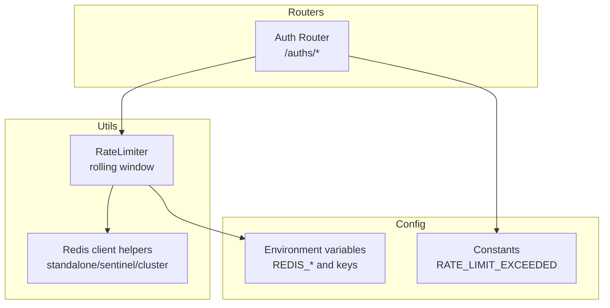
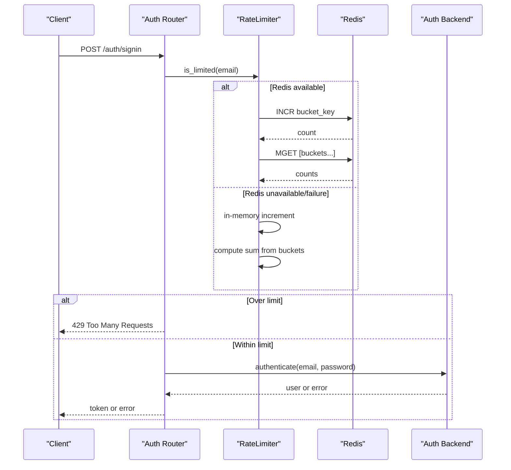
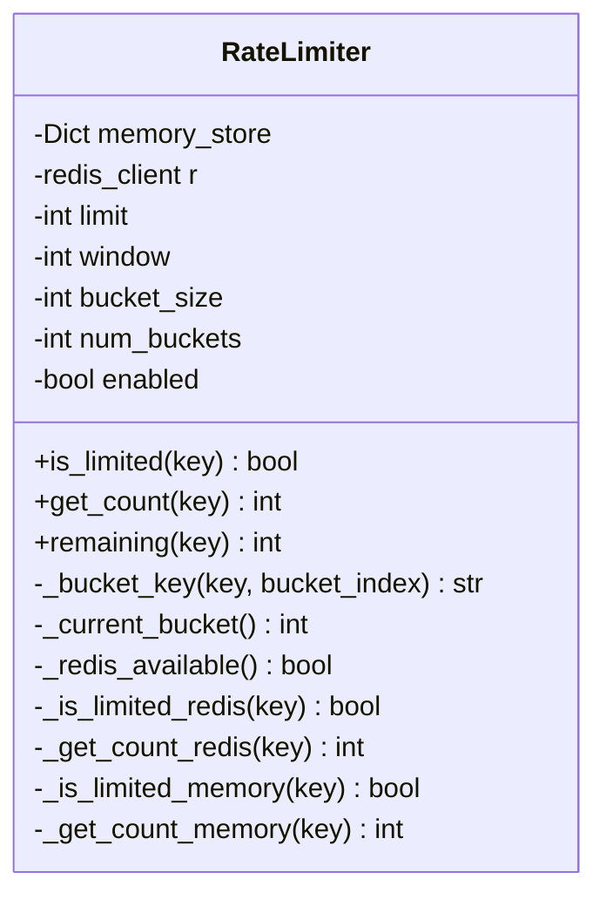
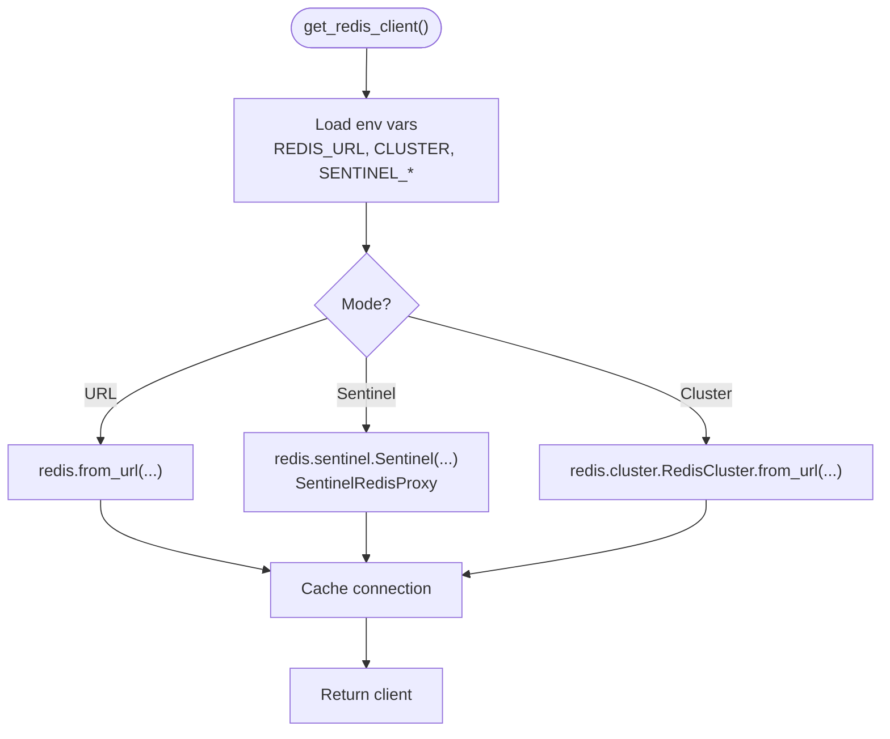
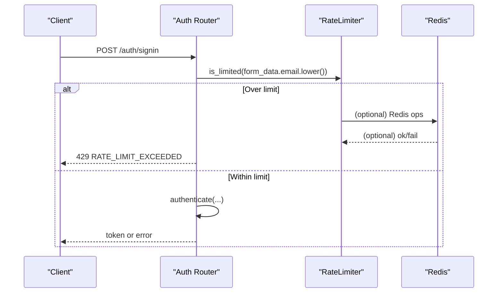
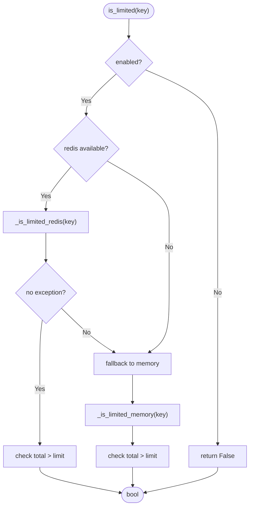
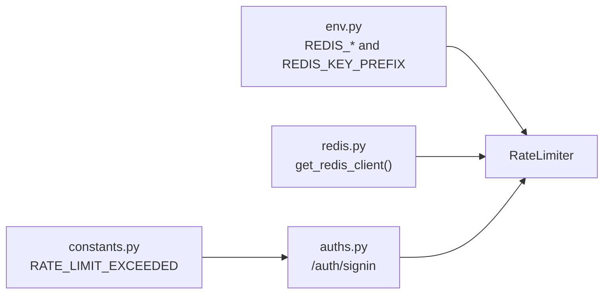

# Rate Limiting Configuration

<cite>
**Referenced Files in This Document**
- [rate_limit.py](file://backend/open_webui/utils/rate_limit.py)
- [redis.py](file://backend/open_webui/utils/redis.py)
- [auths.py](file://backend/open_webui/routers/auths.py)
- [env.py](file://backend/open_webui/env.py)
- [constants.py](file://backend/open_webui/constants.py)
</cite>

## Table of Contents
1. [Introduction](#introduction)
2. [Project Structure](#project-structure)
3. [Core Components](#core-components)
4. [Architecture Overview](#architecture-overview)
5. [Detailed Component Analysis](#detailed-component-analysis)
6. [Dependency Analysis](#dependency-analysis)
7. [Performance Considerations](#performance-considerations)
8. [Troubleshooting Guide](#troubleshooting-guide)
9. [Conclusion](#conclusion)
10. [Appendices](#appendices)

## Introduction
This document explains the rate limiting system in Open WebUI. It focuses on the RateLimiter class that implements a sliding window algorithm using Redis with an in-memory fallback. It also documents how rate limiting is applied to critical endpoints (notably authentication) via middleware integration, configuration options for Redis and rate limits, and operational guidance for tuning and graceful degradation.

## Project Structure
The rate limiting implementation spans three main areas:
- A general-purpose RateLimiter utility that uses Redis with a rolling window and falls back to memory.
- Redis connection helpers that support standalone, sentinel, and cluster modes.
- Authentication router integration that applies rate limiting to sign-in requests.

**Diagram sources**
- [rate_limit.py](file://backend/open_webui/utils/rate_limit.py#L1-L140)
- [redis.py](file://backend/open_webui/utils/redis.py#L117-L231)
- [auths.py](file://backend/open_webui/routers/auths.py#L86-L90)
- [env.py](file://backend/open_webui/env.py#L376-L395)
- [constants.py](file://backend/open_webui/constants.py#L70-L76)

**Section sources**
- [rate_limit.py](file://backend/open_webui/utils/rate_limit.py#L1-L140)
- [redis.py](file://backend/open_webui/utils/redis.py#L117-L231)
- [auths.py](file://backend/open_webui/routers/auths.py#L86-L90)
- [env.py](file://backend/open_webui/env.py#L376-L395)
- [constants.py](file://backend/open_webui/constants.py#L70-L76)

## Core Components
- RateLimiter: Implements a sliding window using fixed-size buckets stored per-key. Uses Redis when available; otherwise falls back to an in-memory dictionary keyed by bucket indices.
- Redis client helpers: Provides a unified way to obtain a Redis client supporting standalone, sentinel, and cluster topologies, with connection caching and retry logic for sentinel.
- Authentication integration: Creates a RateLimiter instance and checks it before processing sign-in requests.

Key behaviors:
- Rolling window via bucketing: The window is divided into equal-sized buckets. The current bucket is derived from the current time and bucket size. The limiter sums counts across the current and previous N buckets.
- Redis primary, memory fallback: When Redis is available, increment and aggregate counts via Redis; on exceptions, fall back to memory. When Redis is unavailable, operate purely in-memory.
- Graceful degradation: If Redis is unreachable, the limiter continues operating with in-memory state, preserving fairness within a single process.

**Section sources**
- [rate_limit.py](file://backend/open_webui/utils/rate_limit.py#L1-L140)
- [redis.py](file://backend/open_webui/utils/redis.py#L117-L231)
- [auths.py](file://backend/open_webui/routers/auths.py#L86-L90)

## Architecture Overview
The rate limiting pipeline integrates with the FastAPI application via router-level checks. The authentication endpoint constructs a RateLimiter with Redis-backed storage and enforces limits before attempting authentication.

**Diagram sources**
- [auths.py](file://backend/open_webui/routers/auths.py#L507-L572)
- [rate_limit.py](file://backend/open_webui/utils/rate_limit.py#L46-L103)
- [redis.py](file://backend/open_webui/utils/redis.py#L117-L231)

## Detailed Component Analysis

### RateLimiter Class
The RateLimiter implements a sliding window using fixed-size buckets. It supports:
- Configurable limit and window size.
- Adjustable bucket size to trade precision vs. memory usage.
- Global enable/disable flag.
- Redis primary with in-memory fallback.

Implementation highlights:
- Bucket key construction uses a prefix from environment plus a normalized key and bucket index.
- Current bucket computed from current time divided by bucket size.
- Redis path increments a per-bucket counter and sets TTL to slightly exceed window to avoid race conditions.
- Aggregation across the current and previous N buckets to compute the total within the window.
- Memory path mirrors Redis logic using an in-process dictionary keyed by bucket index.

**Diagram sources**
- [rate_limit.py](file://backend/open_webui/utils/rate_limit.py#L1-L140)

**Section sources**
- [rate_limit.py](file://backend/open_webui/utils/rate_limit.py#L1-L140)

### Redis Client Helpers
The Redis helpers provide:
- Standalone Redis via URL.
- Sentinel-based HA with automatic fail-over and retry.
- Cluster mode support.
- Connection caching keyed by configuration to avoid redundant connections.
- Async and sync variants.

Key configuration:
- REDIS_URL, REDIS_CLUSTER, REDIS_KEY_PREFIX.
- REDIS_SENTINEL_HOSTS, REDIS_SENTINEL_PORT, REDIS_SENTINEL_MAX_RETRY_COUNT.

**Diagram sources**
- [redis.py](file://backend/open_webui/utils/redis.py#L117-L231)

**Section sources**
- [redis.py](file://backend/open_webui/utils/redis.py#L117-L231)
- [env.py](file://backend/open_webui/env.py#L376-L395)

### Authentication Router Integration
The authentication router creates a RateLimiter instance and checks it before processing sign-in requests. The limiter is configured with a specific limit and window suitable for brute-force protection.

Behavior:
- Constructs a RateLimiter bound to Redis via get_redis_client().
- Checks is_limited on the email (normalized) before attempting authentication.
- Raises HTTP 429 Too Many Requests with a standardized message when exceeded.

**Diagram sources**
- [auths.py](file://backend/open_webui/routers/auths.py#L86-L90)
- [auths.py](file://backend/open_webui/routers/auths.py#L507-L572)
- [constants.py](file://backend/open_webui/constants.py#L70-L76)

**Section sources**
- [auths.py](file://backend/open_webui/routers/auths.py#L86-L90)
- [auths.py](file://backend/open_webui/routers/auths.py#L507-L572)
- [constants.py](file://backend/open_webui/constants.py#L70-L76)

### Sliding Window Algorithm and Exception Handling
- Sliding window: The window is split into N equal buckets. The current bucket is derived from time. The limiter sums counts across the current and previous N buckets.
- Redis operations: INCR increments the current bucket; MGET aggregates counts across the window; EXPIRE ensures buckets expire after the window plus one bucket duration.
- Exception handling: Redis failures trigger fallback to in-memory counters. Memory path mirrors Redis logic and cleans up expired buckets.

**Diagram sources**
- [rate_limit.py](file://backend/open_webui/utils/rate_limit.py#L46-L103)

**Section sources**
- [rate_limit.py](file://backend/open_webui/utils/rate_limit.py#L46-L103)

## Dependency Analysis
- RateLimiter depends on:
  - Redis client (via get_redis_client) for distributed counters.
  - Environment variables for Redis configuration and key prefix.
- Authentication router depends on:
  - RateLimiter for pre-authentication throttling.
  - Constants for the standardized rate limit error message.

**Diagram sources**
- [rate_limit.py](file://backend/open_webui/utils/rate_limit.py#L1-L140)
- [redis.py](file://backend/open_webui/utils/redis.py#L117-L231)
- [auths.py](file://backend/open_webui/routers/auths.py#L507-L572)
- [env.py](file://backend/open_webui/env.py#L376-L395)
- [constants.py](file://backend/open_webui/constants.py#L70-L76)

**Section sources**
- [rate_limit.py](file://backend/open_webui/utils/rate_limit.py#L1-L140)
- [redis.py](file://backend/open_webui/utils/redis.py#L117-L231)
- [auths.py](file://backend/open_webui/routers/auths.py#L507-L572)
- [env.py](file://backend/open_webui/env.py#L376-L395)
- [constants.py](file://backend/open_webui/constants.py#L70-L76)

## Performance Considerations
- Bucket granularity: Smaller bucket_size increases precision but increases Redis memory and network overhead due to more keys accessed per check.
- Window size: Larger windows smooth out bursts but increase the time-to-detection of spikes.
- Redis vs. memory: Redis provides cross-instance fairness and persistence across restarts; memory is faster but only protects within a single process.
- TTL safety: The limiter sets bucket expiration to slightly exceed the window to avoid race conditions around bucket boundaries.
- Connection reuse: The Redis helper caches connections keyed by configuration to reduce overhead.

[No sources needed since this section provides general guidance]

## Troubleshooting Guide
Common issues and resolutions:
- Redis connectivity problems:
  - Symptom: Frequent fallback to memory or intermittent 429 responses.
  - Resolution: Verify REDIS_URL, REDIS_CLUSTER, REDIS_SENTINEL_HOSTS, REDIS_SENTINEL_PORT, REDIS_SENTINEL_MAX_RETRY_COUNT. Ensure network access and credentials are correct.
- Uneven rate distribution across instances:
  - Symptom: Clients behind load balancers observe inconsistent limits.
  - Resolution: Use Redis-backed counters (default). Ensure all instances share the same REDIS_URL/cluster topology and REDIS_KEY_PREFIX.
- Redis latency spikes:
  - Symptom: Increased latency on authentication.
  - Resolution: Reduce bucket_size or increase window to lower per-request key operations; monitor Redis latency and scale horizontally.
- Graceful degradation:
  - Behavior: When Redis fails, the limiter falls back to memory. This preserves protection within a single process but does not coordinate across instances.
  - Monitoring: Watch for fallback exceptions in logs; consider enabling Redis sentinel and retry settings to improve resilience.

**Section sources**
- [redis.py](file://backend/open_webui/utils/redis.py#L117-L231)
- [rate_limit.py](file://backend/open_webui/utils/rate_limit.py#L46-L103)

## Conclusion
Open WebUI’s rate limiting system centers on a flexible, Redis-backed sliding window with a robust in-memory fallback. The authentication router integrates this mechanism to protect against brute-force attacks. Proper configuration of Redis settings and careful tuning of bucket size and window enables balanced protection and performance across diverse deployment scenarios.

[No sources needed since this section summarizes without analyzing specific files]

## Appendices

### Configuration Options
- Redis connectivity and topology:
  - REDIS_URL: Redis server URL (supports standalone and sentinel URLs).
  - REDIS_CLUSTER: Enable cluster mode.
  - REDIS_SENTINEL_HOSTS: Comma-separated sentinel hosts.
  - REDIS_SENTINEL_PORT: Sentinel port.
  - REDIS_SENTINEL_MAX_RETRY_COUNT: Number of retries for sentinel fail-over.
- Key prefix:
  - REDIS_KEY_PREFIX: Namespace for rate limit keys.
- Example usage in authentication:
  - The authentication router constructs a RateLimiter with a specific limit and window for sign-in attempts.

**Section sources**
- [env.py](file://backend/open_webui/env.py#L376-L395)
- [auths.py](file://backend/open_webui/routers/auths.py#L86-L90)

### Tuning Recommendations by Deployment Scenario
- Single-instance development:
  - Use small bucket_size and moderate window for responsiveness.
  - Consider disabling Redis to rely on memory fallback for simplicity.
- Multi-instance production:
  - Use Redis-backed counters with shared REDIS_URL/cluster topology.
  - Choose bucket_size proportional to expected QPS and acceptable burstiness.
  - Monitor Redis latency and adjust window/bucket_size accordingly.
- High-traffic with strict fairness:
  - Increase window to smooth spikes; reduce bucket_size for finer control.
  - Ensure adequate Redis resources and network bandwidth.

[No sources needed since this section provides general guidance]