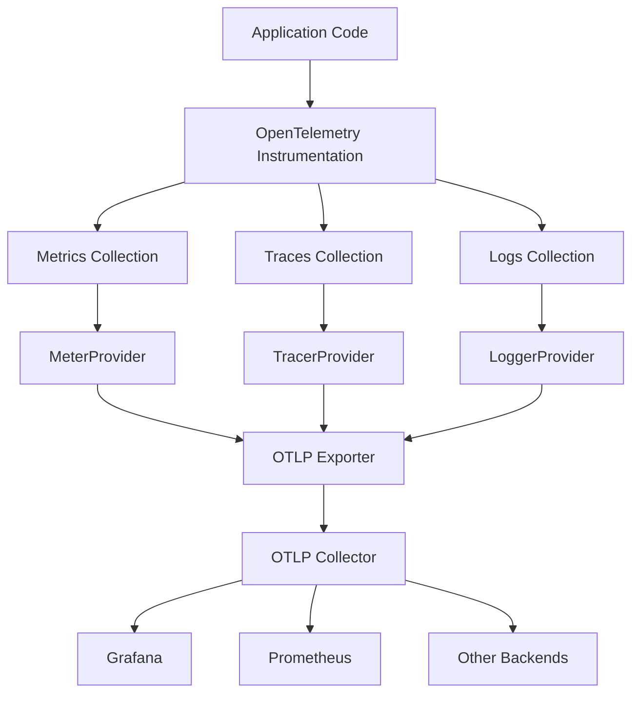
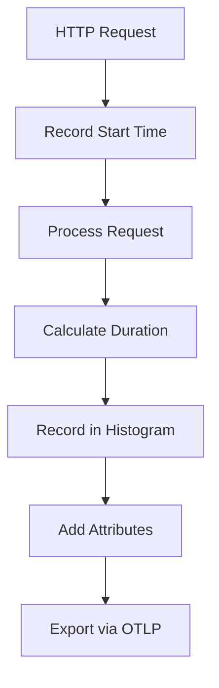
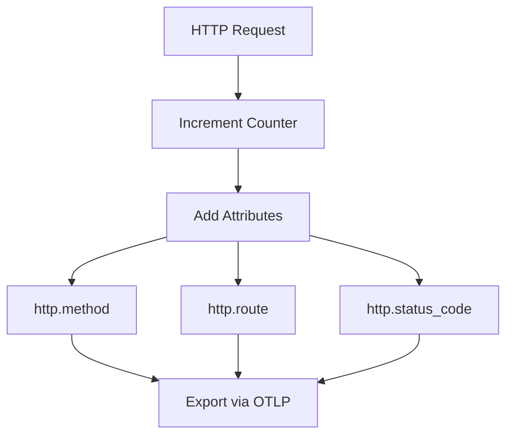
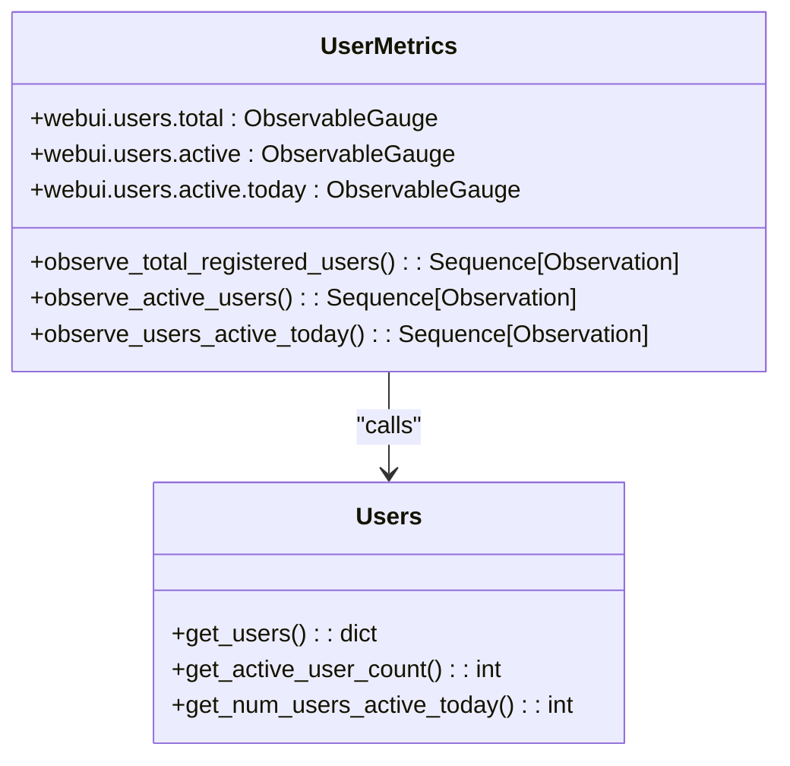
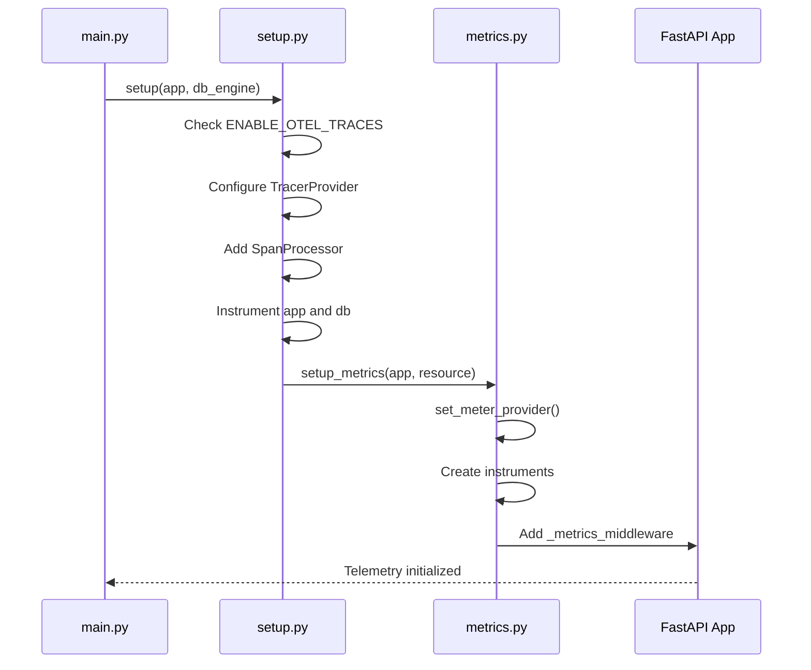
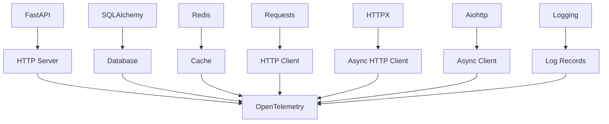
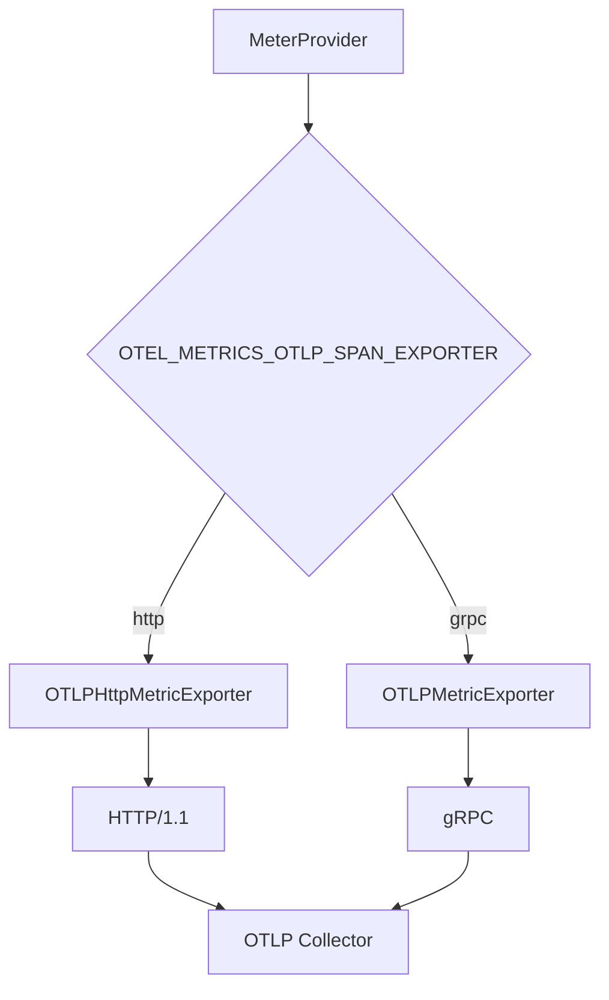
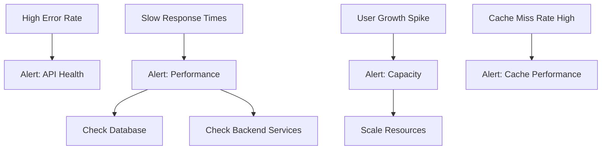

# Telemetry and Metrics Collection

<cite>
**Referenced Files in This Document**   
- [metrics.py](file://backend/open_webui/utils/telemetry/metrics.py)
- [setup.py](file://backend/open_webui/utils/telemetry/setup.py)
- [instrumentors.py](file://backend/open_webui/utils/telemetry/instrumentors.py)
- [constants.py](file://backend/open_webui/utils/telemetry/constants.py)
- [logs.py](file://backend/open_webui/utils/telemetry/logs.py)
- [main.py](file://backend/open_webui/main.py)
- [env.py](file://backend/open_webui/env.py)
- [docker-compose.otel.yaml](file://docker-compose.otel.yaml)
</cite>

## Table of Contents
1. [Introduction](#introduction)
2. [Telemetry Architecture Overview](#telemetry-architecture-overview)
3. [Metrics Collection System](#metrics-collection-system)
4. [OpenTelemetry Integration](#opentelemetry-integration)
5. [Key Performance Indicators](#key-performance-indicators)
6. [Configuration and Backend Setup](#configuration-and-backend-setup)
7. [Monitoring and Alerting](#monitoring-and-alerting)
8. [Performance Impact and Optimization](#performance-impact-and-optimization)
9. [Conclusion](#conclusion)

## Introduction

Open WebUI implements a comprehensive telemetry system based on OpenTelemetry standards to collect performance metrics, traces, and logs. This documentation details the metrics collection infrastructure, focusing on how performance data is gathered, processed, and exported for monitoring and analysis. The system enables administrators to track application health, user activity, and system performance to support capacity planning and optimization efforts.

The telemetry framework collects various performance metrics including request timing, error rates, and system resource usage through the OpenTelemetry instrumentation system. Metrics are exported via OTLP (OpenTelemetry Protocol) to collectors that can expose them to monitoring systems like Prometheus and visualization platforms like Grafana.

**Section sources**
- [main.py](file://backend/open_webui/main.py#L691-L694)
- [env.py](file://backend/open_webui/env.py#L806-L810)

## Telemetry Architecture Overview

The telemetry system in Open WebUI follows a modular architecture that separates concerns between metric collection, processing, and export. The system is designed to be non-intrusive while providing comprehensive visibility into application performance and user behavior.



**Diagram sources**
- [main.py](file://backend/open_webui/main.py#L691-L694)
- [setup.py](file://backend/open_webui/utils/telemetry/setup.py#L28-L58)
- [metrics.py](file://backend/open_webui/utils/telemetry/metrics.py#L53-L111)

The architecture follows the OpenTelemetry specification with three main components: instrumentation, SDK, and exporters. Instrumentation hooks into the application code to collect telemetry data, the SDK processes and aggregates this data, and exporters send the data to external systems. The system supports metrics, traces, and logs collection independently, allowing administrators to enable only the components they need.

**Section sources**
- [main.py](file://backend/open_webui/main.py#L691-L694)
- [setup.py](file://backend/open_webui/utils/telemetry/setup.py#L28-L58)

## Metrics Collection System

The metrics collection system in Open WebUI is implemented in the `metrics.py` module and provides detailed performance monitoring through various metric types and collection mechanisms.

### Request Timing Metrics

The system collects HTTP request timing metrics using histograms to capture the distribution of request durations. This allows for detailed analysis of response times and identification of performance bottlenecks.



**Diagram sources**
- [metrics.py](file://backend/open_webui/utils/telemetry/metrics.py#L176-L204)
- [metrics.py](file://backend/open_webui/utils/telemetry/metrics.py#L126-L130)

The `http.server.duration` histogram metric captures request processing time in milliseconds with attributes for HTTP method, route, and status code. This enables granular analysis of performance across different endpoints and request types. The histogram provides percentiles and distribution data that help identify outliers and performance degradation.

### Request Count Metrics

The system tracks the total number of HTTP requests using counter metrics, which increment with each request. This provides insight into application usage patterns and traffic volume.



**Diagram sources**
- [metrics.py](file://backend/open_webui/utils/telemetry/metrics.py#L121-L125)
- [metrics.py](file://backend/open_webui/utils/telemetry/metrics.py#L202-L203)

The `http.server.requests` counter metric tracks the total number of requests with the same attributes as the duration metric. This allows correlation between request volume and performance characteristics.

### User Activity Metrics

The system collects user activity metrics through observable gauges that provide real-time information about user engagement and system adoption.



**Diagram sources**
- [metrics.py](file://backend/open_webui/utils/telemetry/metrics.py#L150-L174)
- [models/users.py](file://backend/open_webui/models/users.py)

The user activity metrics include:
- `webui.users.total`: Total number of registered users
- `webui.users.active`: Number of currently active users
- `webui.users.active.today`: Number of users active since midnight today

These metrics use callbacks to query the database at collection time, ensuring the data is always current without requiring continuous updates.

**Section sources**
- [metrics.py](file://backend/open_webui/utils/telemetry/metrics.py#L120-L174)

## OpenTelemetry Integration

Open WebUI integrates with OpenTelemetry through a comprehensive instrumentation system that automatically collects telemetry data from various components of the application.

### Instrumentation Setup

The telemetry system is initialized through the setup module, which configures both tracing and metrics collection based on environment variables.



**Diagram sources**
- [main.py](file://backend/open_webui/main.py#L691-L694)
- [setup.py](file://backend/open_webui/utils/telemetry/setup.py#L28-L58)
- [metrics.py](file://backend/open_webui/utils/telemetry/metrics.py#L114-L179)

The integration follows the OpenTelemetry SDK pattern, setting up providers for metrics and traces, and registering instrumentors for various components. The system uses environment variables to control which telemetry components are enabled, allowing for flexible configuration in different environments.

### Component Instrumentation

The system instruments multiple components to provide comprehensive visibility into application behavior:



**Diagram sources**
- [instrumentors.py](file://backend/open_webui/utils/telemetry/instrumentors.py#L179-L196)
- [setup.py](file://backend/open_webui/utils/telemetry/setup.py#L54)

The instrumentors module configures automatic instrumentation for:
- FastAPI: HTTP server requests and responses
- SQLAlchemy: Database queries and operations
- Redis: Cache operations and commands
- Requests: Synchronous HTTP client calls
- HTTPX: Asynchronous HTTP client calls
- Aiohttp: Asynchronous client operations
- Logging: Application log records

Each instrumentor can be customized with request and response hooks to add additional context to the telemetry data.

**Section sources**
- [instrumentors.py](file://backend/open_webui/utils/telemetry/instrumentors.py#L179-L196)
- [setup.py](file://backend/open_webui/utils/telemetry/setup.py#L54)

## Key Performance Indicators

The telemetry system tracks several key performance indicators (KPIs) that provide insights into application health, user engagement, and system performance.

### Request Performance KPIs

The system collects detailed metrics on request performance to monitor application responsiveness and identify bottlenecks.

| KPI | Metric Name | Type | Unit | Description |
|-----|-----------|------|------|-------------|
| Request Rate | http.server.requests | Counter | 1 | Total number of HTTP requests processed |
| Request Duration | http.server.duration | Histogram | ms | Distribution of request processing times |
| Error Rate | http.server.requests | Counter | 1 | Requests with status code ≥ 400 |
| Success Rate | http.server.requests | Counter | 1 | Requests with status code < 400 |

These metrics are collected with attributes for HTTP method, route, and status code, enabling detailed analysis of performance across different endpoints and request types. The histogram for request duration provides percentiles (p50, p90, p95, p99) that help identify outliers and performance degradation.

### User Engagement KPIs

The system tracks user engagement metrics to monitor adoption and usage patterns.

| KPI | Metric Name | Type | Unit | Description |
|-----|-----------|------|------|-------------|
| Total Users | webui.users.total | Gauge | users | Total number of registered users |
| Active Users | webui.users.active | Gauge | users | Currently active users |
| Daily Active Users | webui.users.active.today | Gauge | users | Users active since midnight today |

These metrics provide insights into user adoption and engagement, helping administrators understand how the application is being used and plan for capacity requirements.

### System Health KPIs

The telemetry system also provides indicators of system health and stability.

| KPI | Metric Name | Type | Unit | Description |
|-----|-----------|------|------|-------------|
| Database Performance | db.query.duration | Histogram | ms | Database query execution times |
| Cache Hit Rate | redis.commands.executed | Counter | 1 | Ratio of cache hits to misses |
| API Error Rate | http.server.requests | Counter | 1 | Percentage of requests resulting in errors |

These KPIs help identify potential issues with backend services and infrastructure, enabling proactive monitoring and troubleshooting.

**Section sources**
- [metrics.py](file://backend/open_webui/utils/telemetry/metrics.py#L121-L130)
- [metrics.py](file://backend/open_webui/utils/telemetry/metrics.py#L150-L174)

## Configuration and Backend Setup

The telemetry system is configured through environment variables, providing flexibility in different deployment environments.

### Environment Variables

The system uses several environment variables to control telemetry behavior:

| Variable | Default | Description |
|---------|--------|-------------|
| ENABLE_OTEL | false | Enable OpenTelemetry integration |
| ENABLE_OTEL_METRICS | false | Enable metrics collection |
| OTEL_EXPORTER_OTLP_ENDPOINT | http://localhost:4317 | OTLP collector endpoint |
| OTEL_METRICS_EXPORTER_OTLP_ENDPOINT | OTEL_EXPORTER_OTLP_ENDPOINT | Metrics-specific OTLP endpoint |
| OTEL_EXPORTER_OTLP_INSECURE | false | Use insecure connection for OTLP |
| OTEL_METRICS_EXPORTER_OTLP_INSECURE | OTEL_EXPORTER_OTLP_INSECURE | Insecure connection for metrics |
| OTEL_SERVICE_NAME | open-webui | Service name for telemetry data |
| OTEL_BASIC_AUTH_USERNAME | "" | Basic auth username for OTLP |
| OTEL_BASIC_AUTH_PASSWORD | "" | Basic auth password for OTLP |

These variables allow administrators to enable or disable telemetry components, configure export endpoints, and set authentication credentials.

### Docker Compose Configuration

The repository includes a dedicated docker-compose configuration for telemetry:

```yaml
services:
  grafana:
    image: grafana/otel-lgtm:latest
    ports:
      - "3000:3000"   # Grafana UI
      - "4317:4317"   # OTLP/gRPC
      - "4318:4318"   # OTLP/HTTP
    restart: unless-stopped

  airis:
    environment:
      - ENABLE_OTEL=true
      - ENABLE_OTEL_METRICS=true
      - OTEL_EXPORTER_OTLP_INSECURE=true
      - OTEL_EXPORTER_OTLP_ENDPOINT=http://grafana:4317
      - OTEL_SERVICE_NAME=airis
```

This configuration sets up a Grafana instance with OpenTelemetry support and configures the Open WebUI application to export metrics to it. The configuration uses insecure connections for development purposes and should be modified for production use.

### Export Configuration

The metrics system supports both gRPC and HTTP protocols for OTLP export:



**Diagram sources**
- [metrics.py](file://backend/open_webui/utils/telemetry/metrics.py#L64-L83)

The system defaults to gRPC but can be configured to use HTTP. The choice depends on network configuration, firewall rules, and collector capabilities. The export interval is set to 10 seconds by default, balancing data freshness with network overhead.

**Section sources**
- [env.py](file://backend/open_webui/env.py#L862-L864)
- [metrics.py](file://backend/open_webui/utils/telemetry/metrics.py#L50-L83)

## Monitoring and Alerting

The collected metrics can be used to set up comprehensive monitoring and alerting systems to ensure application reliability and performance.

### Capacity Planning

The KPIs collected by the telemetry system support capacity planning by providing data on usage patterns and system performance:

- **User Growth Trends**: The `webui.users.total` metric shows user adoption over time, helping predict future resource requirements.
- **Usage Peaks**: Request rate metrics identify peak usage periods, informing decisions about scaling and resource allocation.
- **Performance Degradation**: Request duration histograms detect performance issues before they impact users significantly.
- **Error Trends**: Error rate metrics highlight reliability issues that may require infrastructure changes.

### Alerting Rules

Based on the collected metrics, administrators can set up alerting rules to detect and respond to issues:



**Diagram sources**
- [metrics.py](file://backend/open_webui/utils/telemetry/metrics.py#L121-L130)

Recommended alerting thresholds:
- Error rate > 5% for 5 minutes
- 95th percentile request duration > 2 seconds
- Daily active users growth > 50% day-over-day
- Cache miss rate > 30%

### Dashboard Configuration

The metrics can be visualized in Grafana or similar tools using the following dashboard panels:

1. **Request Rate**: Time series of `http.server.requests` by status code
2. **Response Times**: Histogram of `http.server.duration` with percentiles
3. **User Growth**: Line chart of `webui.users.total` and `webui.users.active.today`
4. **Error Rate**: Ratio of error requests to total requests
5. **Top Endpoints**: Bar chart of request rate by route

These dashboards provide real-time visibility into application performance and user behavior, enabling proactive management and optimization.

**Section sources**
- [metrics.py](file://backend/open_webui/utils/telemetry/metrics.py#L121-L174)
- [docker-compose.otel.yaml](file://docker-compose.otel.yaml)

## Performance Impact and Optimization

While telemetry provides valuable insights, it's important to understand and manage its performance impact on the application.

### Performance Considerations

The telemetry system is designed to minimize performance overhead:

- **Asynchronous Export**: Metrics are exported asynchronously to avoid blocking application threads
- **Batching**: Data is batched before export to reduce network overhead
- **Sampling**: Traces can be sampled to reduce volume while maintaining visibility
- **Attribute Filtering**: High-cardinality attributes are filtered to prevent metric explosion

The system uses a 10-second export interval by default, balancing data freshness with resource usage. The middleware adds minimal overhead to request processing, primarily consisting of timestamp operations and attribute collection.

### Optimization Strategies

For production deployments, consider the following optimization strategies:

| Strategy | Benefit | Configuration |
|---------|-------|--------------|
| Disable Unneeded Components | Reduce resource usage | Set ENABLE_OTEL_TRACES=false if not needed |
| Use Secure Connections | Protect telemetry data | Set OTEL_EXPORTER_OTLP_INSECURE=false |
| Configure Appropriate Sampling | Balance detail and volume | Set OTEL_TRACES_SAMPLER=parentbased_traceidratio |
| Monitor Exporter Performance | Ensure reliable delivery | Check exporter queue sizes and retry counts |
| Limit Metric Attributes | Prevent cardinality issues | Use views to filter attributes |

### Production Recommendations

For production deployments, follow these best practices:

1. **Enable Authentication**: Configure basic auth for OTLP endpoints to secure telemetry data
2. **Use Secure Connections**: Enable TLS for OTLP communication
3. **Monitor Exporter Health**: Track exporter success rates and retry counts
4. **Size Collectors Appropriately**: Ensure collectors can handle the expected telemetry volume
5. **Implement Retention Policies**: Configure appropriate data retention in the backend system
6. **Test Under Load**: Validate telemetry performance during load testing

These strategies ensure that the telemetry system provides valuable insights without negatively impacting application performance or reliability.

**Section sources**
- [metrics.py](file://backend/open_webui/utils/telemetry/metrics.py#L85-L104)
- [env.py](file://backend/open_webui/env.py#L806-L868)

## Conclusion

The telemetry and metrics collection system in Open WebUI provides comprehensive visibility into application performance, user engagement, and system health through OpenTelemetry standards. The system collects key performance indicators including request timing, error rates, and user activity metrics that can be used for monitoring, alerting, and capacity planning.

The modular architecture allows flexible configuration through environment variables, enabling administrators to enable only the components they need. The integration with OpenTelemetry ensures compatibility with standard monitoring backends like Prometheus and visualization tools like Grafana.

By leveraging the collected metrics, administrators can gain insights into application usage patterns, identify performance bottlenecks, and make data-driven decisions about capacity planning and optimization. The system is designed to minimize performance impact while providing valuable operational intelligence for both development and production environments.