# Caching Strategies

<cite>
**Referenced Files in This Document**   
- [redis.py](file://backend/open_webui/utils/redis.py)
- [main.py](file://backend/open_webui/main.py)
- [auths.py](file://backend/open_webui/routers/auths.py)
- [config.py](file://backend/open_webui/config.py)
- [env.py](file://backend/open_webui/env.py)
- [rate_limit.py](file://backend/open_webui/utils/rate_limit.py)
- [socket/main.py](file://backend/open_webui/socket/main.py)
- [socket/utils.py](file://backend/open_webui/socket/utils.py)
</cite>

## Table of Contents
1. [Introduction](#introduction)
2. [Redis Implementation Overview](#redis-implementation-overview)
3. [Connection Management](#connection-management)
4. [Key Naming Conventions](#key-naming-conventions)
5. [TTL and Expiration Strategies](#ttl-and-expiration-strategies)
6. [Caching in Application Components](#caching-in-application-components)
7. [Cache Invalidation Patterns](#cache-invalidation-patterns)
8. [Cache Warming Strategies](#cache-warming-strategies)
9. [Handling Cache Misses](#handling-cache-misses)
10. [Best Practices for Cacheable Data](#best-practices-for-cacheable-data)
11. [Memory Management](#memory-management)
12. [Cache Consistency](#cache-consistency)
13. [Monitoring and Troubleshooting](#monitoring-and-troubleshooting)
14. [Conclusion](#conclusion)

## Introduction
Open WebUI implements a comprehensive caching strategy using Redis to optimize performance and reduce database load. This document details how Redis is utilized for caching frequently accessed data such as user sessions, model configurations, and chat metadata. The implementation includes connection management, key naming conventions, TTL strategies, cache invalidation patterns, and monitoring approaches. The caching system is designed to handle high-traffic scenarios while maintaining data consistency and reliability.

**Section sources**
- [redis.py](file://backend/open_webui/utils/redis.py#L1-L231)
- [main.py](file://backend/open_webui/main.py#L500-L699)

## Redis Implementation Overview
Open WebUI's caching system is built around Redis, providing a robust solution for storing frequently accessed data. The implementation supports multiple Redis deployment patterns including standalone, cluster, and sentinel configurations. The system is designed to handle user sessions, model configurations, chat metadata, and rate limiting data.

The core Redis functionality is implemented in the `redis.py` utility module, which provides connection management, failover handling, and connection pooling. The system uses Redis for various purposes including session storage, rate limiting, model caching, and real-time communication state management.

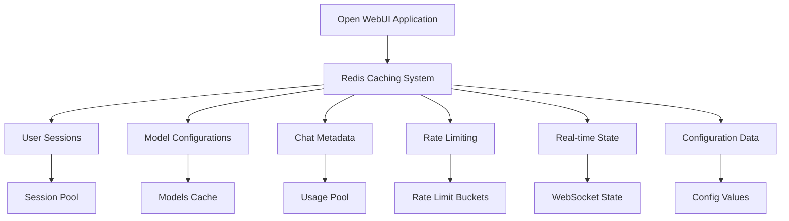

**Diagram sources**
- [redis.py](file://backend/open_webui/utils/redis.py#L1-L231)
- [socket/main.py](file://backend/open_webui/socket/main.py#L120-L140)

**Section sources**
- [redis.py](file://backend/open_webui/utils/redis.py#L1-L231)
- [main.py](file://backend/open_webui/main.py#L500-L699)

## Connection Management
The Redis connection management system in Open WebUI is designed for reliability and performance. The implementation provides multiple connection options including standalone, cluster, and sentinel configurations. Connection pooling is implemented to minimize connection overhead and improve performance.

The `get_redis_connection` function is the primary entry point for establishing Redis connections. It supports async mode for non-blocking operations and implements connection caching to prevent redundant connection creation. The system uses a cache key based on connection parameters to ensure connections are reused appropriately.

For high availability, the system supports Redis Sentinel with automatic failover handling. The `SentinelRedisProxy` class wraps the Redis client and implements retry logic for handling connection failures during failover events. The maximum retry count is configurable via the `REDIS_SENTINEL_MAX_RETRY_COUNT` environment variable.

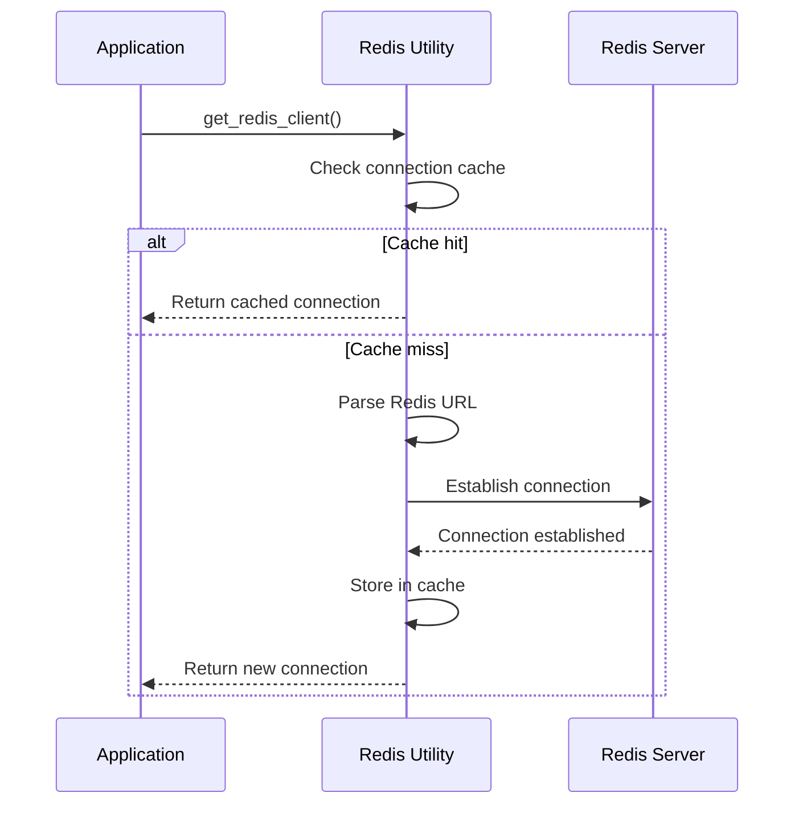

**Diagram sources**
- [redis.py](file://backend/open_webui/utils/redis.py#L117-L209)
- [main.py](file://backend/open_webui/main.py#L585-L592)

**Section sources**
- [redis.py](file://backend/open_webui/utils/redis.py#L117-L209)
- [main.py](file://backend/open_webui/main.py#L585-L592)

## Key Naming Conventions
Open WebUI follows a consistent key naming convention to organize cached data and prevent key collisions. The system uses a prefix-based approach with the `REDIS_KEY_PREFIX` environment variable, which defaults to "open-webui".

The key naming structure follows the pattern: `{prefix}:{category}:{identifier}`. This hierarchical structure makes it easy to identify the purpose of each key and facilitates bulk operations. Different categories of cached data use specific naming patterns:

- Session data: `{prefix}:session:{session_id}`
- Rate limiting: `{prefix}:ratelimit:{key}:{bucket_index}`
- Models: `{prefix}:models`
- Configuration: `{prefix}:config:{key}`
- Tasks: `{prefix}:tasks:{item_id}`
- WebSocket state: `{prefix}:ydoc:documents:{doc_id}`

The system also uses Redis Hashes for structured data storage, allowing multiple fields to be stored under a single key. This approach reduces key namespace pollution and enables atomic operations on related data.

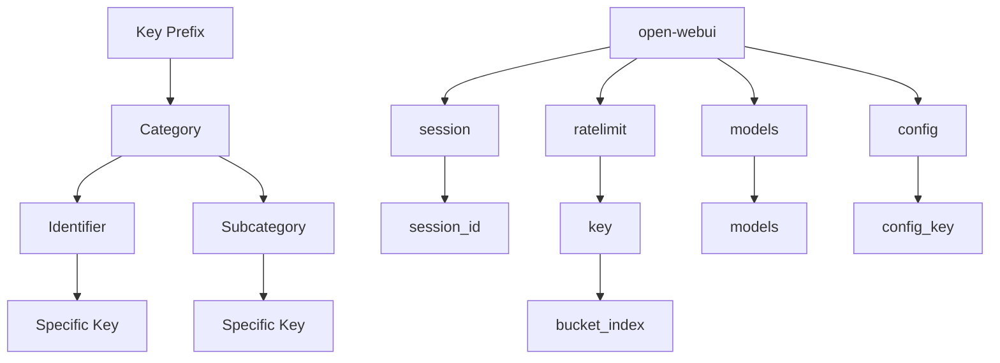

**Diagram sources**
- [env.py](file://backend/open_webui/env.py#L381)
- [rate_limit.py](file://backend/open_webui/utils/rate_limit.py#L37)
- [socket/main.py](file://backend/open_webui/socket/main.py#L123)

**Section sources**
- [env.py](file://backend/open_webui/env.py#L381)
- [rate_limit.py](file://backend/open_webui/utils/rate_limit.py#L37)
- [socket/main.py](file://backend/open_webui/socket/main.py#L123)

## TTL and Expiration Strategies
Open WebUI implements time-to-live (TTL) strategies to ensure cached data remains fresh and memory usage is controlled. Different types of cached data have appropriate TTL values based on their volatility and importance.

For rate limiting, the system uses a rolling window strategy with bucket-based expiration. Each rate limit bucket has an expiration time equal to the window duration plus bucket size, ensuring expired data is automatically removed. The `expire` command is used to set the TTL when a bucket is first created.

Session data and real-time state information have configurable TTLs based on application requirements. The system uses Redis's built-in expiration mechanism rather than application-level cleanup where possible, reducing the overhead of manual cleanup operations.

The configuration also supports cache warming for critical data that should be pre-loaded to avoid cold start delays. The `ENABLE_BASE_MODELS_CACHE` setting triggers pre-loading of model data during application startup.

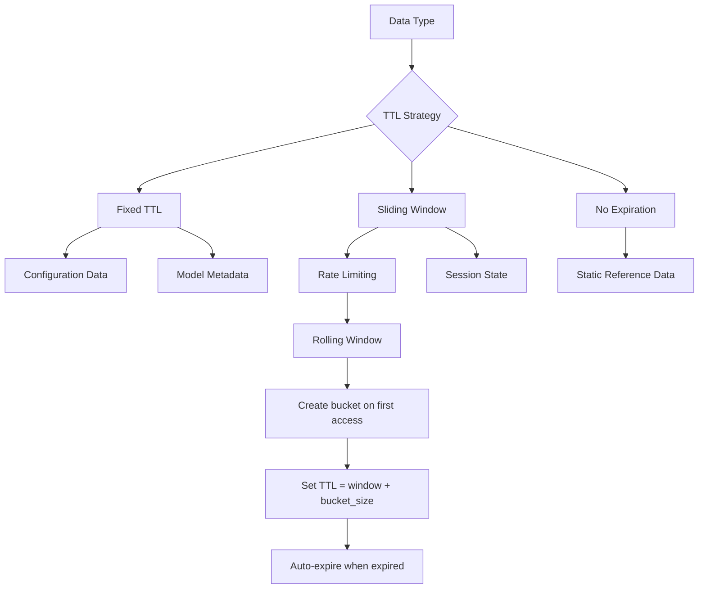

**Diagram sources**
- [rate_limit.py](file://backend/open_webui/utils/rate_limit.py#L83)
- [main.py](file://backend/open_webui/main.py#L629-L648)
- [env.py](file://backend/open_webui/env.py#L547-L554)

**Section sources**
- [rate_limit.py](file://backend/open_webui/utils/rate_limit.py#L83)
- [main.py](file://backend/open_webui/main.py#L629-L648)

## Caching in Application Components
Redis caching is integrated throughout Open WebUI's application components to optimize performance. The system caches data at multiple levels, from user sessions to model configurations and real-time state information.

In the authentication system, Redis is used for rate limiting login attempts through the `signin_rate_limiter` instance in `auths.py`. This prevents brute force attacks while maintaining performance. The rate limiter uses Redis for storage when available, with an in-memory fallback for high availability.

The WebSocket system uses Redis to maintain state across multiple instances in a clustered deployment. The `RedisDict` class provides a dictionary-like interface to Redis hashes, storing session pool, usage pool, and model information. This enables horizontal scaling of WebSocket connections.

Configuration data is cached in Redis to reduce database queries. The `AppConfig` class in `config.py` automatically synchronizes configuration values between memory and Redis, ensuring consistency across application instances.

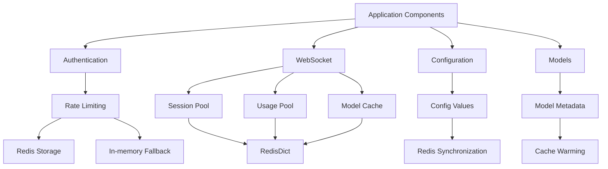

**Diagram sources**
- [auths.py](file://backend/open_webui/routers/auths.py#L86-L88)
- [socket/main.py](file://backend/open_webui/socket/main.py#L122-L135)
- [config.py](file://backend/open_webui/config.py#L258-L261)

**Section sources**
- [auths.py](file://backend/open_webui/routers/auths.py#L86-L88)
- [socket/main.py](file://backend/open_webui/socket/main.py#L122-L135)
- [config.py](file://backend/open_webui/config.py#L258-L261)

## Cache Invalidation Patterns
Open WebUI implements several cache invalidation patterns to maintain data consistency between the cache and primary data sources. The system uses a combination of time-based expiration, explicit invalidation, and write-through patterns.

For configuration data, the system uses a write-through approach where updates are written to both the database and Redis cache simultaneously. The `save` method in the `PersistentConfig` class updates both storage layers, ensuring immediate consistency.

The application also implements event-driven invalidation for certain data types. When configuration changes occur, the system updates the Redis cache with the new values. This is handled automatically by the `AppConfig` class, which listens for configuration changes and propagates them to Redis.

For time-sensitive data like rate limiting counters, the system relies on Redis's automatic expiration mechanism. This eliminates the need for manual cleanup and ensures expired data is removed efficiently.

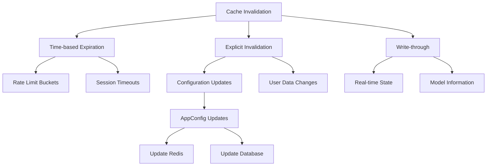

**Diagram sources**
- [config.py](file://backend/open_webui/config.py#L258-L261)
- [rate_limit.py](file://backend/open_webui/utils/rate_limit.py#L83)
- [socket/main.py](file://backend/open_webui/socket/main.py#L194-L212)

**Section sources**
- [config.py](file://backend/open_webui/config.py#L258-L261)
- [rate_limit.py](file://backend/open_webui/utils/rate_limit.py#L83)

## Cache Warming Strategies
Open WebUI implements cache warming strategies to improve application startup performance and reduce latency for frequently accessed data. The system pre-loads critical data into Redis during the application initialization phase.

The primary cache warming mechanism is triggered by the `ENABLE_BASE_MODELS_CACHE` configuration setting. When enabled, the application calls `get_all_models` during startup to populate the models cache. This prevents the first user from experiencing delays when accessing model information.

The system also warms caches for configuration data by loading the latest configuration from the database and synchronizing it with Redis during application startup. This ensures that configuration values are immediately available from the cache.

For WebSocket-based functionality, the system maintains persistent Redis dictionaries for models, session pool, and usage pool. These caches are initialized during application startup and remain available throughout the application lifecycle.

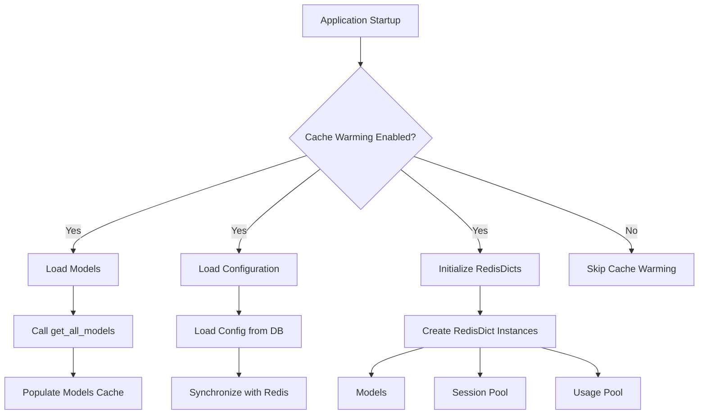

**Diagram sources**
- [main.py](file://backend/open_webui/main.py#L629-L648)
- [socket/main.py](file://backend/open_webui/socket/main.py#L122-L135)
- [config.py](file://backend/open_webui/config.py#L120-L122)

**Section sources**
- [main.py](file://backend/open_webui/main.py#L629-L648)
- [socket/main.py](file://backend/open_webui/socket/main.py#L122-L135)

## Handling Cache Misses
Open WebUI implements robust strategies for handling cache misses to ensure application reliability and performance. The system uses a combination of fallback mechanisms, error handling, and monitoring to manage cache misses effectively.

For critical functionality like rate limiting, the system provides an in-memory fallback when Redis is unavailable. The `RateLimiter` class uses an in-memory dictionary store as a backup, ensuring rate limiting continues to function even if Redis is down.

The application also implements graceful degradation for non-critical cached data. When a cache miss occurs for non-essential data, the system retrieves the data from the primary source and populates the cache for future requests.

Error handling is implemented at multiple levels to prevent cache issues from affecting overall application stability. The Redis client wrapper includes retry logic for handling transient failures, particularly in sentinel configurations where failover might occur.

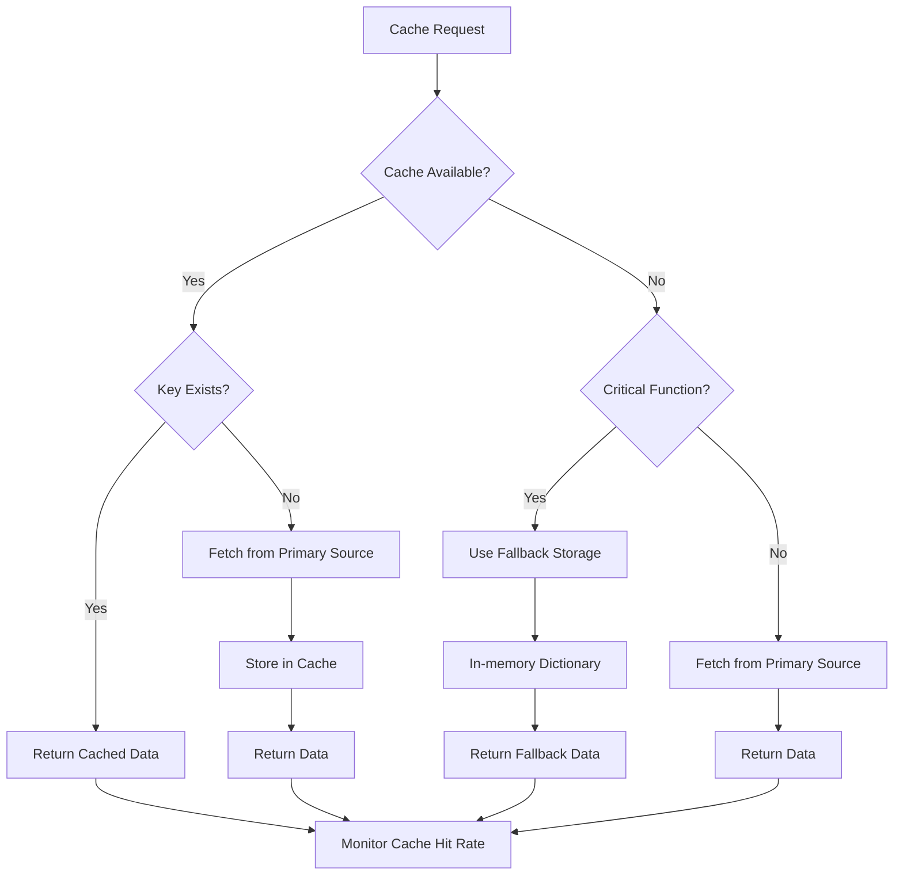

**Diagram sources**
- [rate_limit.py](file://backend/open_webui/utils/rate_limit.py#L43-L60)
- [redis.py](file://backend/open_webui/utils/redis.py#L127-L129)
- [config.py](file://backend/open_webui/config.py#L267-L272)

**Section sources**
- [rate_limit.py](file://backend/open_webui/utils/rate_limit.py#L43-L60)
- [redis.py](file://backend/open_webui/utils/redis.py#L127-L129)

## Best Practices for Cacheable Data
Open WebUI follows best practices for determining what data should be cached to maximize performance benefits while minimizing resource usage. The system caches data that meets specific criteria for frequency of access, computational cost, and data volatility.

Frequently accessed data with low volatility is prioritized for caching. This includes user session information, model configurations, and application settings. These data types are read frequently but updated infrequently, making them ideal candidates for caching.

Data that is expensive to compute or retrieve is also cached. Model metadata that requires API calls to external services is cached to reduce latency and external service load. Similarly, complex database queries that aggregate data are cached when appropriate.

The system avoids caching highly volatile data or data that is rarely accessed. User-specific chat histories and transient state information are generally not cached long-term, as they change frequently and may consume excessive memory.

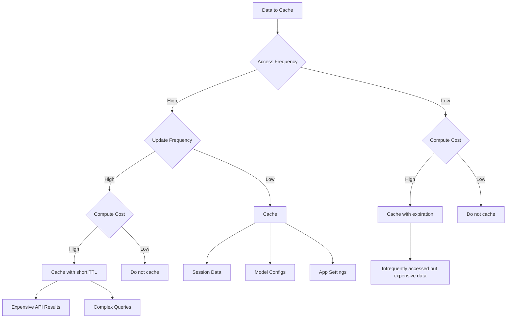

**Diagram sources**
- [main.py](file://backend/open_webui/main.py#L629-L648)
- [socket/main.py](file://backend/open_webui/socket/main.py#L122-L135)
- [rate_limit.py](file://backend/open_webui/utils/rate_limit.py#L37)

**Section sources**
- [main.py](file://backend/open_webui/main.py#L629-L648)
- [socket/main.py](file://backend/open_webui/socket/main.py#L122-L135)

## Memory Management
Open WebUI implements several memory management strategies to ensure efficient Redis usage and prevent memory exhaustion. The system uses TTLs, size limits, and monitoring to control memory consumption.

The primary memory management mechanism is the use of appropriate TTL values for different data types. Short-lived data like rate limiting counters have relatively short expiration times, while more stable data like model configurations may have longer TTLs or be refreshed rather than expired.

The system also uses Redis Hashes to store structured data efficiently. By grouping related fields under a single key, the system reduces the overhead of key metadata and enables more efficient memory usage.

For large deployments, the system supports Redis clustering to distribute memory usage across multiple nodes. This allows horizontal scaling of the caching layer to accommodate growing memory requirements.

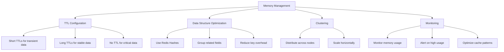

**Diagram sources**
- [rate_limit.py](file://backend/open_webui/utils/rate_limit.py#L83)
- [socket/utils.py](file://backend/open_webui/socket/utils.py#L59-L61)
- [env.py](file://backend/open_webui/env.py#L380)

**Section sources**
- [rate_limit.py](file://backend/open_webui/utils/rate_limit.py#L83)
- [socket/utils.py](file://backend/open_webui/socket/utils.py#L59-L61)

## Cache Consistency
Open WebUI maintains cache consistency through a combination of write-through patterns, event-driven updates, and periodic synchronization. The system ensures that cached data remains aligned with the primary data source to prevent stale data issues.

The primary consistency mechanism is the write-through pattern used for configuration data. When configuration values are updated, they are written to both the database and Redis cache simultaneously. This ensures immediate consistency and prevents race conditions.

For data that changes less frequently, the system relies on TTL-based expiration and refresh. When cached data expires, the next request will retrieve fresh data from the primary source and repopulate the cache.

The application also implements a periodic cleanup process for usage data, which helps maintain consistency by removing stale entries. This is particularly important for real-time state information that may become outdated.

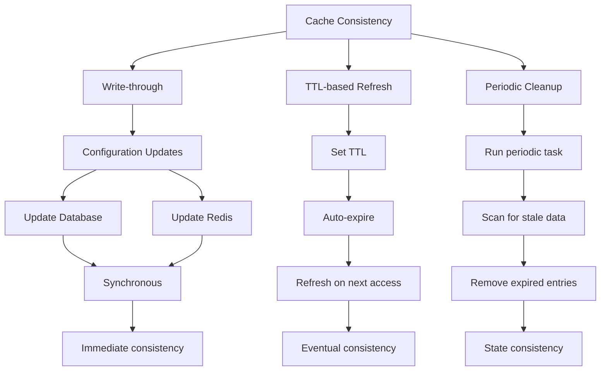

**Diagram sources**
- [config.py](file://backend/open_webui/config.py#L258-L261)
- [socket/main.py](file://backend/open_webui/socket/main.py#L167-L216)
- [rate_limit.py](file://backend/open_webui/utils/rate_limit.py#L83)

**Section sources**
- [config.py](file://backend/open_webui/config.py#L258-L261)
- [socket/main.py](file://backend/open_webui/socket/main.py#L167-L216)

## Monitoring and Troubleshooting
Open WebUI provides several mechanisms for monitoring cache performance and troubleshooting common issues. The system includes logging, metrics collection, and diagnostic tools to help maintain cache health.

The application logs Redis connection issues and cache-related errors at appropriate log levels. Connection failures, timeouts, and other issues are logged to help diagnose problems. The log level for Redis operations can be configured independently using the `SRC_LOG_LEVELS` settings.

Cache hit rates can be monitored through application logs and metrics. The system logs cache misses and fallback operations, providing insight into cache effectiveness. For rate limiting, the system provides methods to check current usage counts.

Common issues include Redis connectivity problems, memory exhaustion, and stale cache data. Connectivity issues can be addressed by verifying Redis configuration and network connectivity. Memory issues may require adjusting TTL values or scaling the Redis instance. Stale data issues can be resolved by implementing appropriate invalidation patterns.

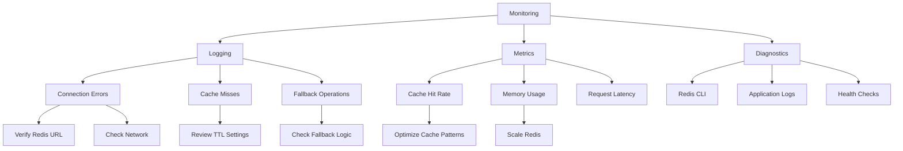

**Diagram sources**
- [redis.py](file://backend/open_webui/utils/redis.py#L127-L129)
- [rate_limit.py](file://backend/open_webui/utils/rate_limit.py#L94-L97)
- [env.py](file://backend/open_webui/env.py#L75-L111)

**Section sources**
- [redis.py](file://backend/open_webui/utils/redis.py#L127-L129)
- [rate_limit.py](file://backend/open_webui/utils/rate_limit.py#L94-L97)

## Conclusion
Open WebUI's caching strategy using Redis provides a robust foundation for performance optimization and scalability. The system effectively caches frequently accessed data including user sessions, model configurations, and chat metadata through a well-designed implementation that balances performance, reliability, and resource efficiency.

The Redis implementation supports multiple deployment patterns and includes comprehensive connection management, key naming conventions, and TTL strategies. Cache invalidation, warming, and consistency mechanisms ensure data integrity while monitoring and troubleshooting tools help maintain system health.

By following best practices for cacheable data selection and memory management, Open WebUI maximizes the benefits of caching while minimizing potential drawbacks. The result is a responsive, scalable application that can handle high traffic loads while maintaining data consistency and reliability.

[No sources needed since this section summarizes without analyzing specific files]