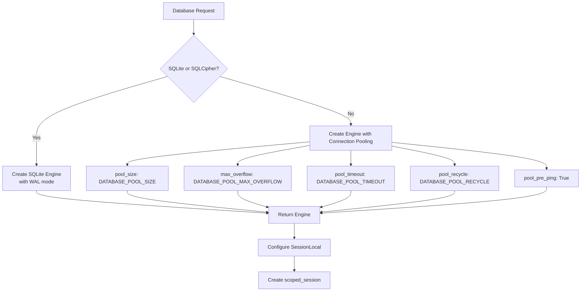
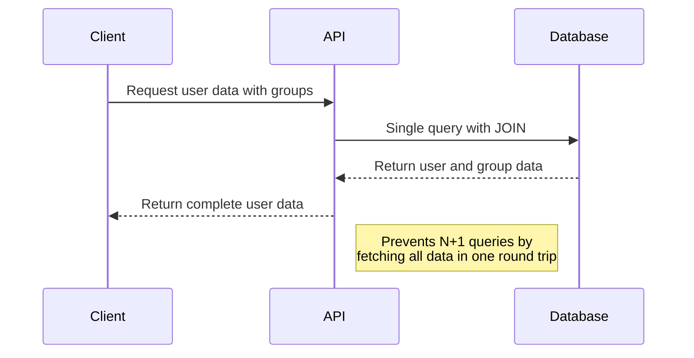
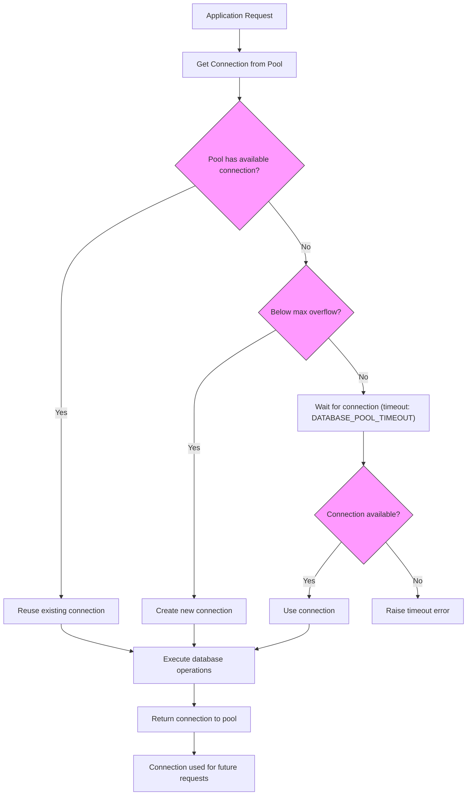
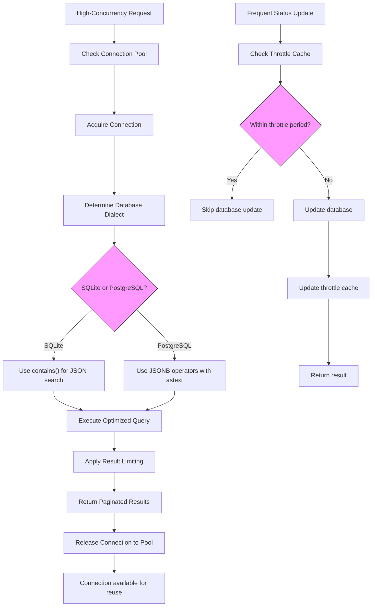

# Database Performance Optimization

<cite>
**Referenced Files in This Document**   
- [db.py](file://backend/open_webui/internal/db.py)
- [redis.py](file://backend/open_webui/utils/redis.py)
- [users.py](file://backend/open_webui/models/users.py)
- [chats.py](file://backend/open_webui/models/chats.py)
- [messages.py](file://backend/open_webui/models/messages.py)
- [env.py](file://backend/open_webui/env.py)
- [018012973d35_add_indexes.py](file://backend/open_webui/migrations/versions/018012973d35_add_indexes.py)
- [7e5b5dc7342b_init.py](file://backend/open_webui/migrations/versions/7e5b5dc7342b_init.py)
</cite>

## Table of Contents
1. [Introduction](#introduction)
2. [SQLAlchemy Query Optimization](#sqlalchemy-query-optimization)
3. [N+1 Query Problem Resolution](#n1-query-problem-resolution)
4. [Redis Caching Strategy](#redis-caching-strategy)
5. [Indexing Strategies](#indexing-strategies)
6. [Database Connection Pooling](#database-connection-pooling)
7. [Schema Design Best Practices](#schema-design-best-practices)
8. [High-Concurrency Optimization](#high-concurrency-optimization)

## Introduction
This document provides comprehensive guidance on database performance optimization for the open-webui application. It covers key aspects including SQLAlchemy query optimization, N+1 query problem resolution, Redis caching strategies, indexing approaches, connection pooling configuration, schema design principles, and high-concurrency optimization techniques. The analysis is based on the application's database architecture, migration files, and utility implementations.

## SQLAlchemy Query Optimization
The open-webui application implements several optimization techniques for SQLAlchemy queries to enhance database performance. The application uses a centralized database configuration in `db.py` that establishes the SQLAlchemy engine with optimized parameters based on the database type and environment variables.

For PostgreSQL and other non-SQLite databases, the application configures connection pooling with specific parameters that can be adjusted through environment variables. The connection pool is configured with `pool_pre_ping=True` to validate connections before use, preventing errors from stale connections. The pool configuration includes adjustable parameters such as `pool_size`, `max_overflow`, `pool_timeout`, and `pool_recycle` which control the number of connections maintained in the pool, the maximum number of connections that can be created beyond the pool size, the timeout for acquiring a connection, and the time after which connections are recycled, respectively.



**Diagram sources**
- [db.py](file://backend/open_webui/internal/db.py#L114-L145)

**Section sources**
- [db.py](file://backend/open_webui/internal/db.py#L80-L164)
- [env.py](file://backend/open_webui/env.py#L310-L349)

## N+1 Query Problem Resolution
The application addresses the N+1 query problem through careful query construction and the use of SQLAlchemy's relationship loading techniques. In the `users.py` model, the application demonstrates proper handling of relationships between users and their associated data, such as groups and channels, by using explicit joins rather than lazy loading.

For example, when retrieving users with their associated group memberships, the application uses a join operation to fetch the necessary data in a single query rather than making additional queries for each user's group memberships. This approach is evident in the `get_users` method of the `UsersTable` class, which uses SQLAlchemy's `exists` function with subqueries to efficiently filter users based on their group memberships without triggering additional queries.

The `messages.py` model also demonstrates N+1 query prevention by using joined eager loading when retrieving message data with associated user information. In the `get_reactions_by_message_id` method, the application performs a join between the `MessageReaction` and `User` tables to fetch all necessary user information in a single query, rather than making separate queries for each reaction's user data.



**Diagram sources**
- [users.py](file://backend/open_webui/models/users.py#L324-L367)
- [messages.py](file://backend/open_webui/models/messages.py#L400-L407)

**Section sources**
- [users.py](file://backend/open_webui/models/users.py#L270-L453)
- [messages.py](file://backend/open_webui/models/messages.py#L159-L188)

## Redis Caching Strategy
The open-webui application implements a comprehensive Redis caching strategy to improve performance by reducing database load and accelerating data retrieval. The Redis configuration is managed through the `redis.py` utility, which provides a flexible connection interface supporting various Redis deployment patterns including standalone, sentinel, and cluster configurations.

The application uses environment variables to configure Redis connectivity, allowing for different deployment scenarios. The `REDIS_URL` environment variable specifies the Redis connection string, while `REDIS_SENTINEL_HOSTS` and `REDIS_SENTINEL_PORT` enable sentinel-based high availability configurations. For clustered deployments, the `REDIS_CLUSTER` flag activates cluster mode.

The Redis client implementation includes connection pooling and caching of connections to minimize connection overhead. The `get_redis_connection` function maintains a cache of established connections based on connection parameters, preventing the creation of duplicate connections. For sentinel configurations, the application implements automatic failover handling with retry logic, attempting to reconnect to available masters in case of connection failures.

```mermaid
classDiagram
class RedisClient {
+get_redis_client(async_mode)
+get_redis_connection(redis_url, redis_sentinels, redis_cluster, async_mode)
+get_sentinels_from_env(sentinel_hosts_env, sentinel_port_env)
+get_sentinel_url_from_env(redis_url, sentinel_hosts_env, sentinel_port_env)
}
class SentinelRedisProxy {
-sentinel
-service
-kw
-async_mode
+_master()
+__getattr__(item)
}
RedisClient --> SentinelRedisProxy : "creates"
RedisClient --> "redis.Redis" : "uses"
RedisClient --> "redis.asyncio" : "uses"
note right of RedisClient
Central entry point for Redis connections
Supports multiple deployment patterns
Implements connection caching
end
note right of SentinelRedisProxy
Handles Redis Sentinel failover
Provides retry logic for operations
Wraps master connections
end
```

**Diagram sources**
- [redis.py](file://backend/open_webui/utils/redis.py#L1-L231)

**Section sources**
- [redis.py](file://backend/open_webui/utils/redis.py#L1-L231)
- [env.py](file://backend/open_webui/env.py#L379-L395)

## Indexing Strategies
The open-webui application employs strategic indexing to optimize query performance based on actual usage patterns. The indexing strategy is implemented through Alembic migrations, with a specific migration file dedicated to adding performance-critical indexes.

The `018012973d35_add_indexes.py` migration file demonstrates the application's indexing approach by adding indexes to support common query patterns. For the `chat` table, indexes are created on combinations of columns that are frequently used together in WHERE clauses and ORDER BY operations. These include:
- `folder_id_idx` on the `folder_id` column for filtering chats by folder
- `user_id_pinned_idx` on the combination of `user_id` and `pinned` columns for retrieving pinned chats
- `user_id_archived_idx` on the combination of `user_id` and `archived` columns for filtering archived chats
- `updated_at_user_id_idx` on the combination of `updated_at` and `user_id` columns for chronological sorting of chats
- `folder_id_user_id_idx` on the combination of `folder_id` and `user_id` columns for filtering chats by folder and user

Additionally, the application creates indexes on other frequently queried columns such as `user_id_idx` on the `tag` table and `is_global_idx` on the `function` table. These indexes support efficient filtering and sorting operations that are common in the application's user interface.

```mermaid
erDiagram
CHAT ||--o{ TAG : "has"
CHAT ||--o{ MESSAGE : "contains"
USER ||--o{ CHAT : "owns"
USER ||--o{ TAG : "owns"
CHAT {
string id PK
string user_id FK
text title
json chat
bigint created_at
bigint updated_at
text share_id UK
boolean archived
boolean pinned
json meta
text folder_id FK
index folder_id_idx (folder_id)
index user_id_pinned_idx (user_id, pinned)
index user_id_archived_idx (user_id, archived)
index updated_at_user_id_idx (updated_at, user_id)
index folder_id_user_id_idx (folder_id, user_id)
}
TAG {
string id PK
string name
string user_id FK
text data
index user_id_idx (user_id)
}
FUNCTION {
string id PK
string user_id FK
text name
text type
text content
json meta
json valves
boolean is_active
boolean is_global
bigint updated_at
bigint created_at
index is_global_idx (is_global)
}
```

**Diagram sources**
- [018012973d35_add_indexes.py](file://backend/open_webui/migrations/versions/018012973d35_add_indexes.py#L18-L46)
- [7e5b5dc7342b_init.py](file://backend/open_webui/migrations/versions/7e5b5dc7342b_init.py#L39-L52)

**Section sources**
- [018012973d35_add_indexes.py](file://backend/open_webui/migrations/versions/018012973d35_add_indexes.py#L1-L47)
- [chats.py](file://backend/open_webui/models/chats.py#L26-L56)

## Database Connection Pooling
The open-webui application implements sophisticated database connection pooling to optimize resource utilization and handle concurrent requests efficiently. The connection pooling strategy varies based on the database type and is configured through environment variables that allow for tuning based on deployment requirements.

For non-SQLite databases, the application uses SQLAlchemy's `QueuePool` as the connection pool class, which maintains a pool of database connections that can be reused across requests. The pool size is controlled by the `DATABASE_POOL_SIZE` environment variable, with a default behavior of using unbounded pooling if not specified. The `DATABASE_POOL_MAX_OVERFLOW` parameter determines how many connections can be created beyond the base pool size to handle spikes in demand.

The application also configures connection recycling through the `DATABASE_POOL_RECYCLE` parameter, which specifies the time interval (in seconds) after which connections are recycled to prevent issues with stale connections. The `DATABASE_POOL_TIMEOUT` parameter controls how long to wait when trying to acquire a connection from the pool, preventing requests from hanging indefinitely when the pool is exhausted.

For SQLite databases, the application enables Write-Ahead Logging (WAL) mode when the `DATABASE_ENABLE_SQLITE_WAL` environment variable is set to true. WAL mode improves concurrency by allowing multiple readers to coexist with a single writer, which is particularly beneficial for web applications with mixed read-write workloads.



**Diagram sources**
- [db.py](file://backend/open_webui/internal/db.py#L129-L145)
- [env.py](file://backend/open_webui/env.py#L310-L352)

**Section sources**
- [db.py](file://backend/open_webui/internal/db.py#L114-L145)
- [env.py](file://backend/open_webui/env.py#L310-L352)

## Schema Design Best Practices
The open-webui application follows several database schema design best practices to ensure data integrity, performance, and maintainability. The schema design is implemented through Alembic migrations, with the initial schema defined in the `7e5b5dc7342b_init.py` migration file.

One key design principle is the use of appropriate data types for different kinds of data. The application uses `BigInteger` for timestamp fields, which allows for nanosecond precision and avoids potential issues with timestamp overflow. Text fields are used for longer content like chat messages and document content, while String fields with specific lengths are used for identifiers and shorter text.

The application also implements proper indexing strategies from the beginning, with unique constraints on fields that should be unique, such as the `share_id` in the `chat` table and the `api_key` in the `user` table. Foreign key relationships are established through application-level logic rather than database constraints, providing more flexibility in managing relationships.

The schema design also incorporates soft deletion patterns through boolean flags like `archived` in the `chat` table, rather than physically deleting records. This approach preserves data integrity and allows for potential recovery of deleted items while still providing the user experience of deletion.

```mermaid
classDiagram
class BaseModel {
<<abstract>>
+id : string
+created_at : bigint
+updated_at : bigint
}
class User {
+email : string
+username : string
+role : string
+name : string
+profile_image_url : text
+last_active_at : bigint
+settings : json
+info : json
+oauth : json
}
class Chat {
+user_id : string
+title : text
+chat : json
+share_id : text
+archived : boolean
+pinned : boolean
+meta : json
+folder_id : text
}
class Message {
+user_id : string
+channel_id : string
+reply_to_id : string
+parent_id : string
+is_pinned : boolean
+pinned_at : bigint
+pinned_by : string
+content : text
+data : json
+meta : json
+created_at : bigint
+updated_at : bigint
}
class JSONField {
+process_bind_param(value, dialect)
+process_result_value(value, dialect)
+db_value(value)
+python_value(value)
}
BaseModel <|-- User
BaseModel <|-- Chat
BaseModel <|-- Message
JSONField --> "SQLAlchemy TypeDecorator" : extends
note right of User
Stores user profile information<br>
Uses JSON fields for flexible data<br>
Includes timestamps for audit
end
note right of Chat
Contains chat history as JSON<br>
Supports sharing and archiving<br>
Organized by folders
end
note right of Message
Hierarchical message structure<br>
Supports threading and replies<br>
Includes metadata for UI state
end
```

**Diagram sources**
- [7e5b5dc7342b_init.py](file://backend/open_webui/migrations/versions/7e5b5dc7342b_init.py#L1-L205)
- [users.py](file://backend/open_webui/models/users.py#L45-L77)
- [chats.py](file://backend/open_webui/models/chats.py#L26-L43)

**Section sources**
- [7e5b5dc7342b_init.py](file://backend/open_webui/migrations/versions/7e5b5dc7342b_init.py#L1-L205)
- [db.py](file://backend/open_webui/internal/db.py#L31-L51)

## High-Concurrency Optimization
The open-webui application implements several strategies to optimize database performance in high-concurrency scenarios. These optimizations address potential bottlenecks in database access patterns, connection management, and query execution.

One key optimization is the use of database-specific query patterns based on the underlying database dialect. In the `users.py` model, the application detects whether it is running against SQLite or PostgreSQL and adjusts the query syntax accordingly when searching within JSON fields. For SQLite, it uses the `contains` method, while for PostgreSQL, it uses the more efficient JSONB operators with `astext` conversion.

The application also implements throttling for certain high-frequency operations through the `throttle` decorator applied to the `update_last_active_by_id` method in the `UsersTable` class. This prevents excessive database writes when updating user activity status, which might otherwise occur frequently in a high-concurrency environment.

For chat data retrieval, the application implements pagination with reasonable limits (60 items per page) to prevent excessive memory usage and long query times. The `get_chats_by_user_id_and_search_text` method in the `chats.py` model demonstrates efficient filtering by first processing search text in Python to extract special filters (tags, folders, pinned status) before constructing the database query, reducing the complexity of the SQL query.



**Diagram sources**
- [users.py](file://backend/open_webui/models/users.py#L300-L310)
- [chats.py](file://backend/open_webui/models/chats.py#L716-L800)
- [users.py](file://backend/open_webui/models/users.py#L551-L563)

**Section sources**
- [users.py](file://backend/open_webui/models/users.py#L300-L310)
- [chats.py](file://backend/open_webui/models/chats.py#L716-L905)
- [utils/misc.py](file://backend/open_webui/utils/misc.py#L1-L10)