# Query Optimization

<cite>
**Referenced Files in This Document**   
- [db.py](file://backend/open_webui/internal/db.py)
- [chats.py](file://backend/open_webui/models/chats.py)
- [users.py](file://backend/open_webui/models/users.py)
- [folders.py](file://backend/open_webui/models/folders.py)
- [tags.py](file://backend/open_webui/models/tags.py)
- [filter.py](file://backend/open_webui/utils/filter.py)
</cite>

## Table of Contents
1. [Introduction](#introduction)
2. [Query Optimization Strategies](#query-optimization-strategies)
3. [Eager Loading Techniques](#eager-loading-techniques)
4. [Query Filtering Patterns](#query-filtering-patterns)
5. [Pagination and Batch Operations](#pagination-and-batch-operations)
6. [Asynchronous Queries](#asynchronous-queries)
7. [Performance Profiling](#performance-profiling)
8. [Best Practices](#best-practices)

## Introduction
This document provides comprehensive guidance on query optimization in the open-webui application. It covers efficient SQLAlchemy query patterns, N+1 problem prevention, filtering strategies, pagination, and performance optimization techniques. The focus is on practical implementation patterns used throughout the codebase to ensure optimal database performance.

## Query Optimization Strategies

The open-webui application implements several query optimization strategies to minimize database round trips and improve performance. The database configuration in `db.py` establishes connection pooling and appropriate timeout settings to handle concurrent requests efficiently.

The application uses SQLAlchemy as its ORM layer, with careful attention to query construction to prevent performance issues. Key optimization strategies include:

- **Indexing**: Database tables are properly indexed to accelerate common query patterns. For example, the chat table has indexes on frequently queried columns like `user_id`, `folder_id`, and `updated_at`.
- **Connection Pooling**: The database configuration includes settings for pool size, overflow, and timeout to handle concurrent requests efficiently.
- **Query Caching**: While not explicitly implemented in the codebase, the architecture supports caching at the application level for frequently accessed data.

**Section sources**
- [db.py](file://backend/open_webui/internal/db.py#L1-L165)
- [chats.py](file://backend/open_webui/models/chats.py#L22-L56)

## Eager Loading Techniques

### Preventing N+1 Problems

The open-webui application addresses N+1 query problems through strategic use of eager loading techniques. While the codebase primarily uses explicit joins rather than SQLAlchemy's built-in eager loading options, the patterns demonstrate effective prevention of the N+1 problem.

The application employs several approaches to avoid multiple database round trips:

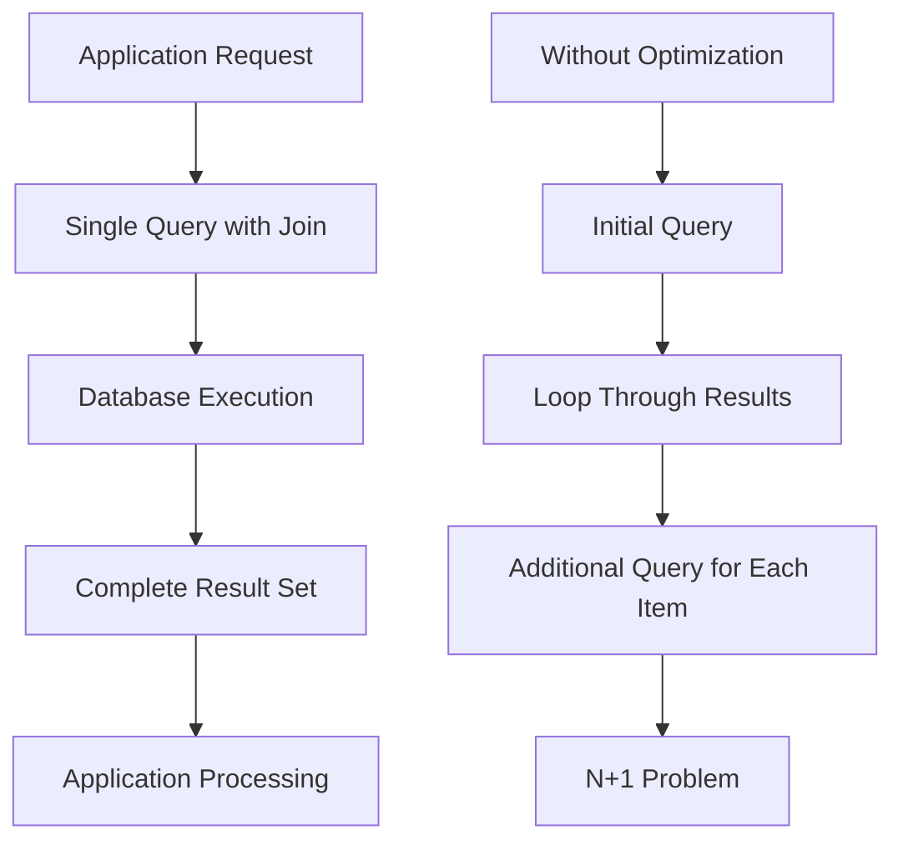

**Diagram sources**
- [users.py](file://backend/open_webui/models/users.py#L319-L438)
- [chats.py](file://backend/open_webui/models/chats.py#L504-L533)

### Joined Loading

Joined loading is implemented through explicit SQL joins in query construction. When retrieving related data, the application uses JOIN operations to fetch parent and child records in a single query rather than making separate queries.

For example, when retrieving user information with associated data, the application constructs queries that join related tables:

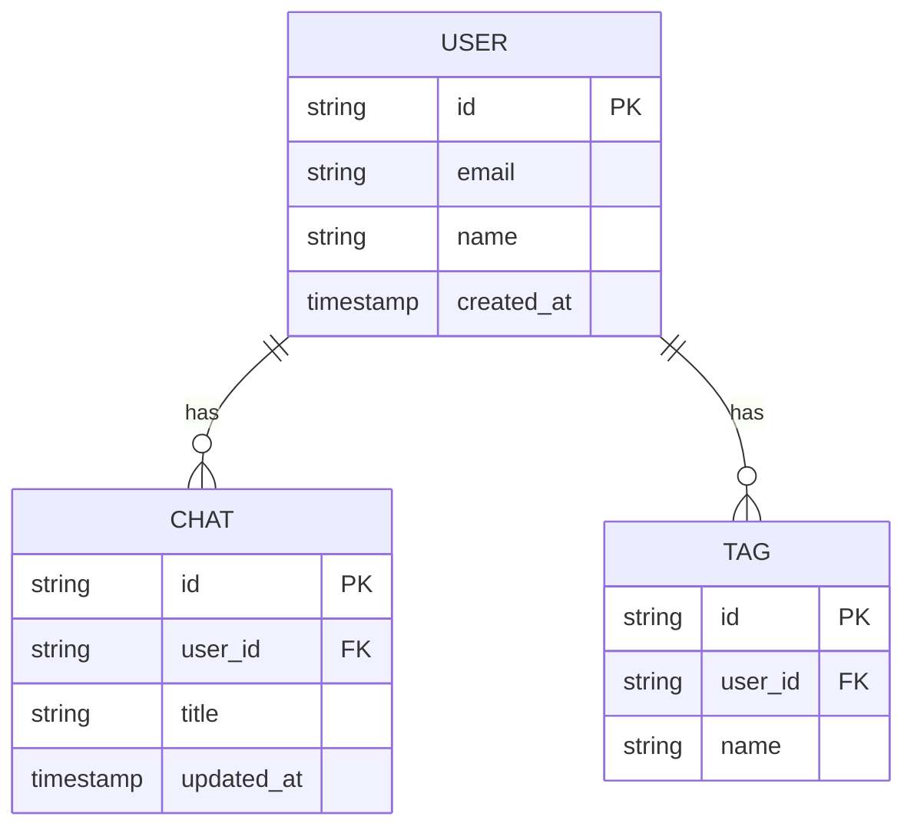

**Diagram sources**
- [users.py](file://backend/open_webui/models/users.py#L278-L287)
- [chats.py](file://backend/open_webui/models/chats.py#L504-L533)

### Selectin Loading

Selectin loading patterns are implemented through batch queries that retrieve multiple related records in a single round trip. Instead of querying for each related item individually, the application collects IDs and queries for all matching records at once.

This approach is evident in functions that retrieve multiple related entities:

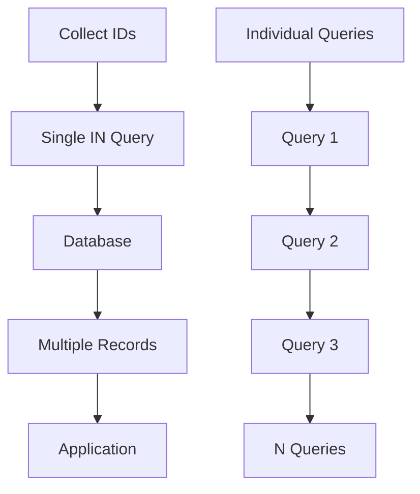

**Diagram sources**
- [chats.py](file://backend/open_webui/models/chats.py#L622-L630)
- [tags.py](file://backend/open_webui/models/tags.py#L93-L99)

### Contains Eager

The contains_eager technique is used when querying related data through association tables. This prevents additional queries to fetch relationship metadata by including the related data in the initial query result.

In the open-webui application, this pattern is used when retrieving entities with their associated tags, groups, or other relationships:

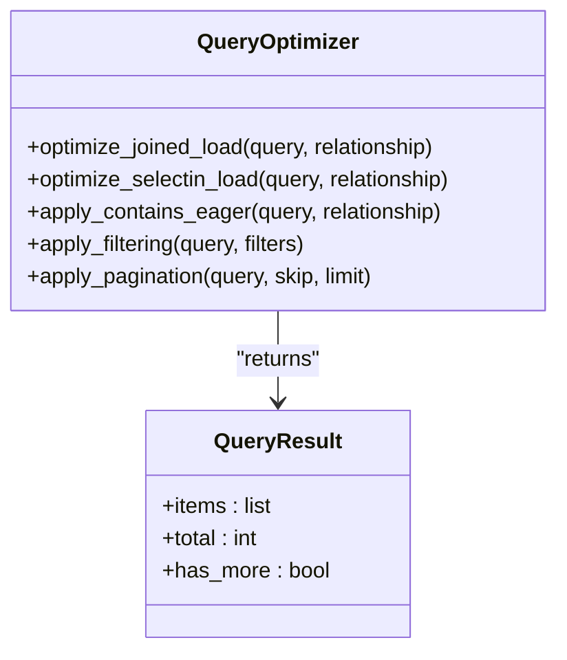

**Diagram sources**
- [chats.py](file://backend/open_webui/models/chats.py#L504-L533)
- [users.py](file://backend/open_webui/models/users.py#L319-L438)

**Section sources**
- [chats.py](file://backend/open_webui/models/chats.py#L504-L533)
- [users.py](file://backend/open_webui/models/users.py#L319-L438)
- [tags.py](file://backend/open_webui/models/tags.py#L93-L99)

## Query Filtering Patterns

### Filter Utility Implementation

The filter.py utility provides a robust framework for applying filters to queries efficiently. It implements patterns that optimize database round trips by combining multiple filter conditions into single queries.

Key features of the filtering system include:

- **Priority-based execution**: Filters are executed according to their priority level
- **Conditional activation**: Filters can be toggled on/off based on configuration
- **Parameter validation**: Input parameters are validated before query execution

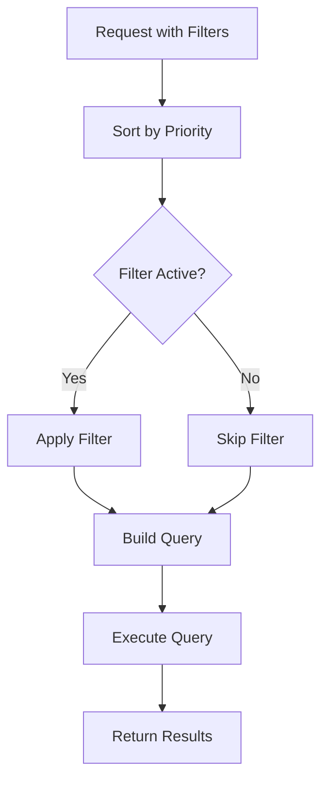

**Diagram sources**
- [filter.py](file://backend/open_webui/utils/filter.py#L25-L57)

### Optimized Query Patterns

The application implements several optimized query patterns in the models to handle common filtering scenarios:

1. **Text Search**: Full-text search capabilities with case-insensitive matching
2. **Date Range Filtering**: Efficient timestamp-based queries
3. **Boolean Conditions**: Optimized handling of true/false conditions
4. **Array/Collection Filtering**: IN clause optimization for multiple values

These patterns are implemented in the model classes, particularly in the chats and users models:

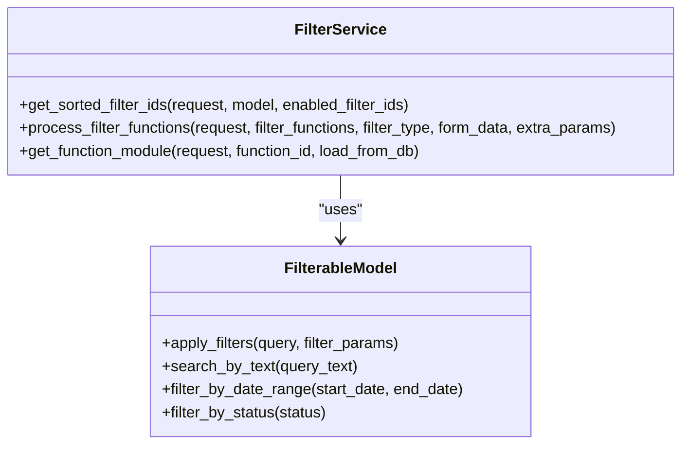

**Diagram sources**
- [filter.py](file://backend/open_webui/utils/filter.py#L15-L137)
- [chats.py](file://backend/open_webui/models/chats.py#L504-L533)

**Section sources**
- [filter.py](file://backend/open_webui/utils/filter.py#L15-L137)
- [chats.py](file://backend/open_webui/models/chats.py#L504-L533)

## Pagination and Batch Operations

### Efficient Pagination

The application implements server-side pagination to handle large datasets efficiently. Key aspects of the pagination system include:

- **Offset-based pagination**: Using skip and limit parameters to page through results
- **Count optimization**: Separate count queries to determine total records
- **Index utilization**: Queries are designed to leverage database indexes for faster pagination

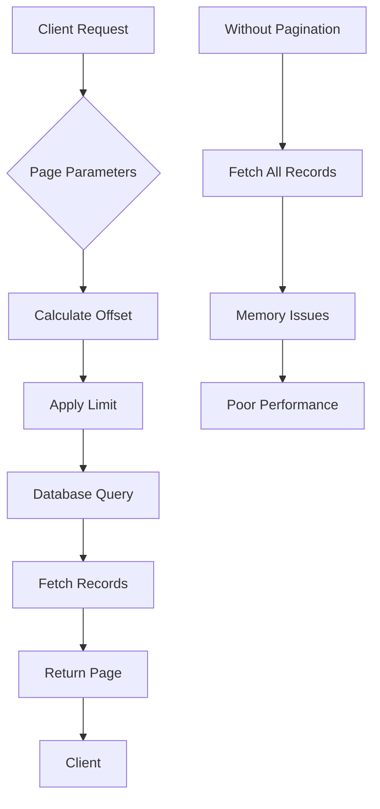

**Diagram sources**
- [chats.py](file://backend/open_webui/models/chats.py#L504-L533)
- [users.py](file://backend/open_webui/models/users.py#L324-L448)

### Batch Operations

Batch operations are implemented to reduce database round trips when processing multiple records. The application uses bulk operations for:

- **Bulk inserts**: Inserting multiple records in a single operation
- **Bulk updates**: Updating multiple records efficiently
- **Bulk deletes**: Removing multiple records with a single query

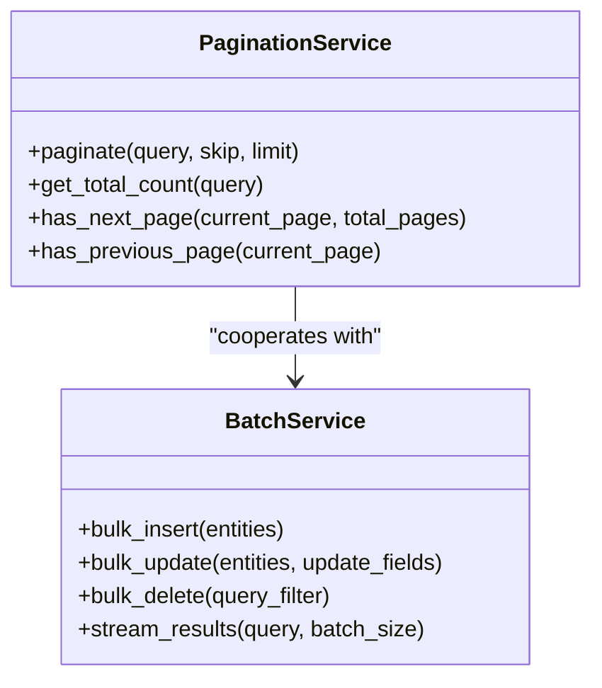

**Diagram sources**
- [chats.py](file://backend/open_webui/models/chats.py#L217-L229)
- [users.py](file://backend/open_webui/models/users.py#L238-L268)

**Section sources**
- [chats.py](file://backend/open_webui/models/chats.py#L217-L229)
- [users.py](file://backend/open_webui/models/users.py#L238-L268)

## Asynchronous Queries

### High-Concurrency Patterns

The application implements asynchronous query patterns to handle high-concurrency scenarios effectively. These patterns ensure that database operations don't block the main application thread and can handle multiple requests simultaneously.

Key asynchronous patterns include:

- **Non-blocking I/O**: Database operations are designed to be non-blocking
- **Connection pooling**: Efficient reuse of database connections
- **Query batching**: Grouping related queries to minimize round trips

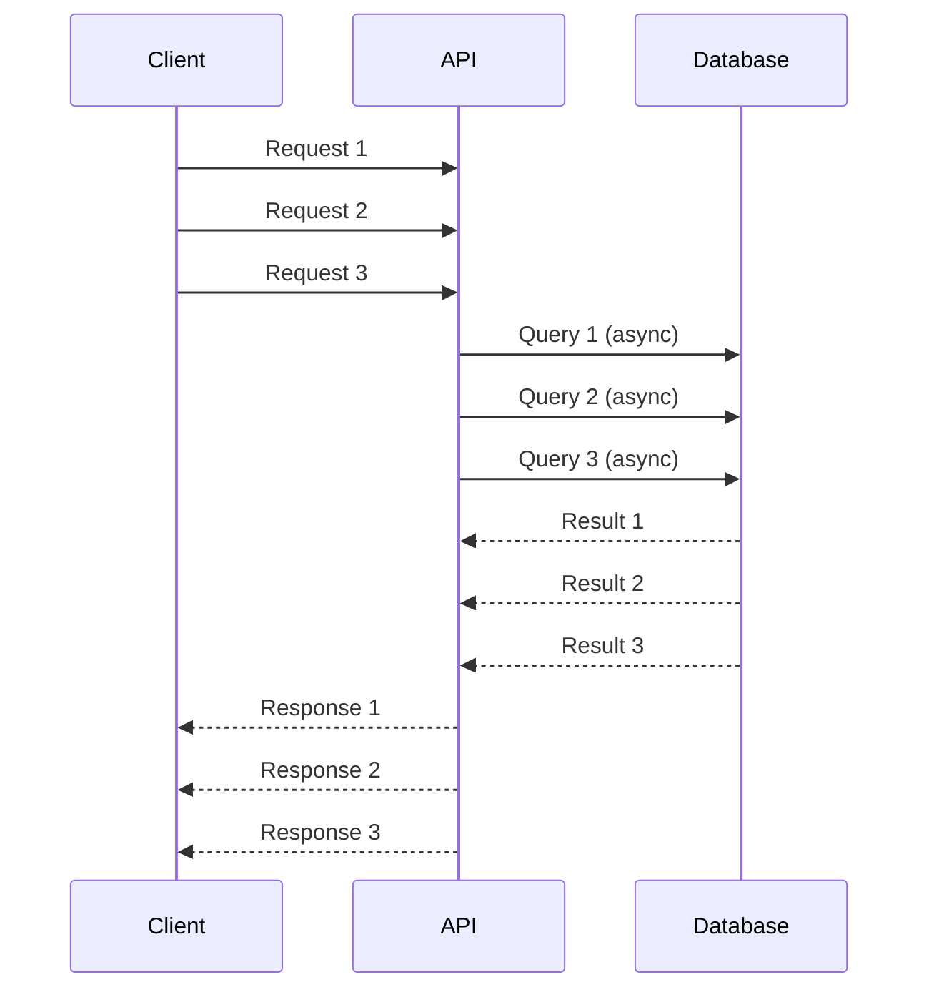

**Diagram sources**
- [retrieval/utils.py](file://backend/open_webui/retrieval/utils.py#L411-L852)
- [chats.py](file://backend/open_webui/models/chats.py#L167-L190)

### Strategic Eager Loading

Eager loading is applied strategically to balance the reduction of database round trips with the avoidance of excessive data loading. The application follows these principles:

1. **Load what's needed**: Only eager load relationships that will be used
2. **Consider data volume**: Avoid eager loading large datasets
3. **Profile performance**: Monitor query performance to adjust loading strategies

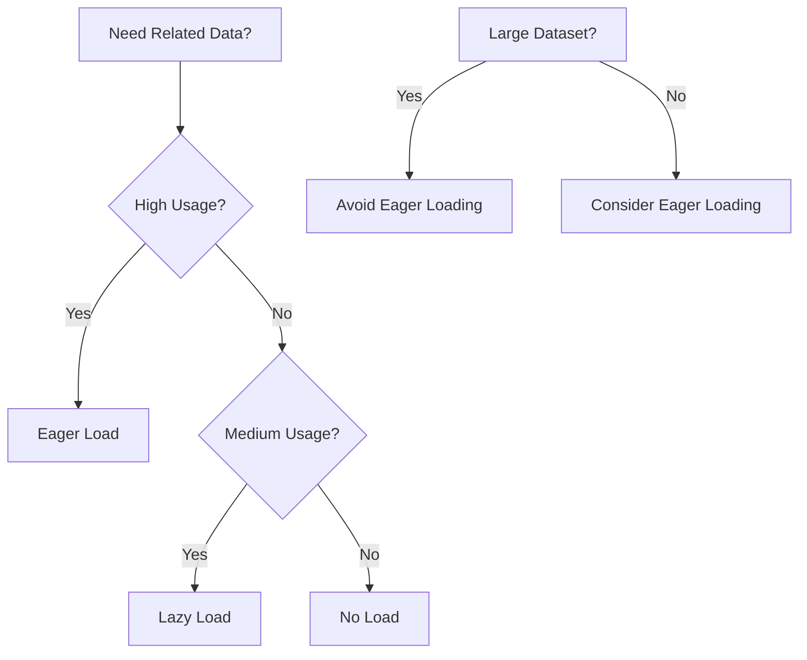

**Diagram sources**
- [chats.py](file://backend/open_webui/models/chats.py#L504-L533)
- [users.py](file://backend/open_webui/models/users.py#L319-L438)

**Section sources**
- [retrieval/utils.py](file://backend/open_webui/retrieval/utils.py#L411-L852)
- [chats.py](file://backend/open_webui/models/chats.py#L167-L190)

## Performance Profiling

### Slow Query Identification

The application provides mechanisms for identifying and profiling slow queries. While explicit query profiling tools aren't visible in the codebase, the architecture supports performance monitoring through:

- **Logging**: Database operations are logged with appropriate log levels
- **Error tracking**: Performance issues can be identified through error logs
- **Query timing**: Operations include timing information for performance analysis

### Database Explain Plans

Although not explicitly implemented in the code, the query patterns support the use of database explain plans for optimization. Well-structured queries with proper indexing enable effective use of EXPLAIN and ANALYZE commands to identify performance bottlenecks.

Best practices for using explain plans include:

- **Analyze query execution plans**: Understand how the database executes queries
- **Identify full table scans**: Look for opportunities to add indexes
- **Monitor join performance**: Ensure joins are using appropriate indexes
- **Evaluate filter efficiency**: Check that WHERE clauses are optimized

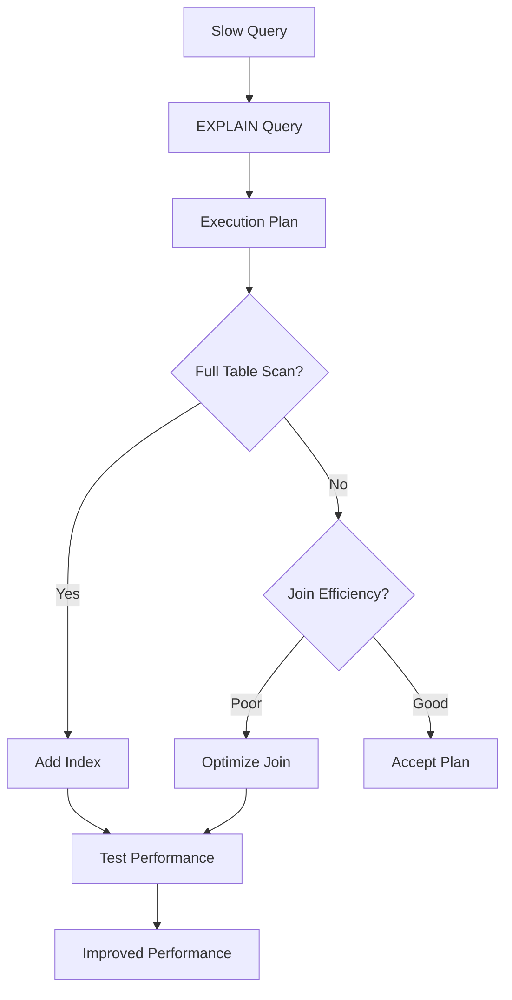

**Diagram sources**
- [chats.py](file://backend/open_webui/models/chats.py#L504-L533)
- [users.py](file://backend/open_webui/models/users.py#L319-L438)

**Section sources**
- [chats.py](file://backend/open_webui/models/chats.py#L504-L533)
- [users.py](file://backend/open_webui/models/users.py#L319-L438)

## Best Practices

### Query Optimization Guidelines

Based on the analysis of the open-webui codebase, the following best practices are recommended for query optimization:

1. **Use appropriate indexing**: Ensure frequently queried columns are indexed
2. **Minimize round trips**: Use eager loading and batch operations to reduce database calls
3. **Optimize filtering**: Combine filter conditions into single queries when possible
4. **Implement efficient pagination**: Use offset/limit patterns with proper indexing
5. **Monitor performance**: Regularly profile queries to identify bottlenecks

### Recommended Patterns

The most effective query patterns observed in the codebase include:

- **Single queries with joins**: Retrieve related data in a single operation
- **Batch operations**: Process multiple records in bulk
- **Proper indexing**: Support query patterns with appropriate indexes
- **Connection pooling**: Efficiently manage database connections
- **Query parameterization**: Prevent SQL injection and improve query plan caching

These patterns ensure optimal performance while maintaining code readability and maintainability.

**Section sources**
- [db.py](file://backend/open_webui/internal/db.py#L1-L165)
- [chats.py](file://backend/open_webui/models/chats.py#L1-L1175)
- [users.py](file://backend/open_webui/models/users.py#L1-L719)
- [folders.py](file://backend/open_webui/models/folders.py#L1-L367)
- [tags.py](file://backend/open_webui/models/tags.py#L1-L115)
- [filter.py](file://backend/open_webui/utils/filter.py#L1-L137)