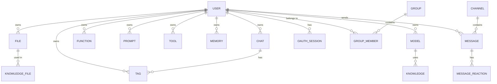
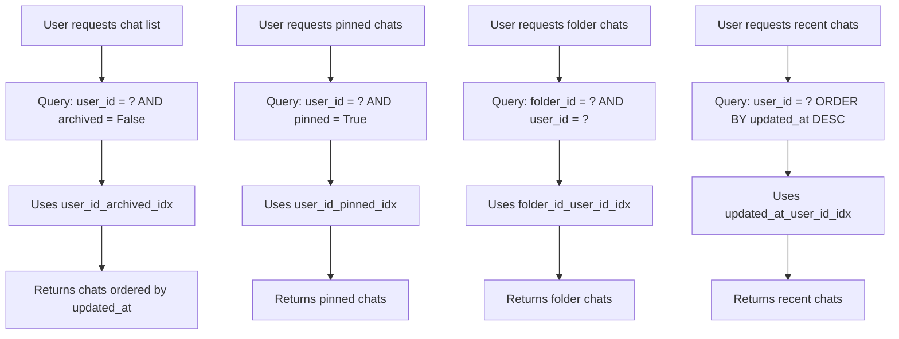

# Schema and Indexing

<cite>
**Referenced Files in This Document**   
- [018012973d35_add_indexes.py](file://backend/open_webui/migrations/versions/018012973d35_add_indexes.py)
- [7e5b5dc7342b_init.py](file://backend/open_webui/migrations/versions/7e5b5dc7342b_init.py)
- [3781e22d8b01_update_message_table.py](file://backend/open_webui/migrations/versions/3781e22d8b01_update_message_table.py)
- [242a2047eae0_update_chat_table.py](file://backend/open_webui/migrations/versions/242a2047eae0_update_chat_table.py)
- [3af16a1c9fb6_update_user_table.py](file://backend/open_webui/migrations/versions/3af16a1c9fb6_update_user_table.py)
- [38d63c18f30f_add_oauth_session_table.py](file://backend/open_webui/migrations/versions/38d63c18f30f_add_oauth_session_table.py)
- [37f288994c47_add_group_member_table.py](file://backend/open_webui/migrations/versions/37f288994c47_add_group_member_table.py)
- [922e7a387820_add_group_table.py](file://backend/open_webui/migrations/versions/922e7a387820_add_group_table.py)
- [57c599a3cb57_add_channel_table.py](file://backend/open_webui/migrations/versions/57c599a3cb57_add_channel_table.py)
- [7826ab40b532_update_file_table.py](file://backend/open_webui/migrations/versions/7826ab40b532_update_file_table.py)
- [chats.py](file://backend/open_webui/models/chats.py)
- [users.py](file://backend/open_webui/models/users.py)
- [messages.py](file://backend/open_webui/models/messages.py)
- [files.py](file://backend/open_webui/models/files.py)
</cite>

## Table of Contents
1. [Introduction](#introduction)
2. [Database Schema Evolution](#database-schema-evolution)
3. [Indexing Strategy Analysis](#indexing-strategy-analysis)
4. [Composite Indexes and Query Patterns](#composite-indexes-and-query-patterns)
5. [Foreign Key Relationships and Constraints](#foreign-key-relationships-and-constraints)
6. [Indexing Best Practices and Performance Guidance](#indexing-best-practices-and-performance-guidance)
7. [Index Maintenance and Monitoring](#index-maintenance-and-monitoring)
8. [Future Indexing Strategy Recommendations](#future-indexing-strategy-recommendations)

## Introduction
This document provides a comprehensive analysis of the database schema design and indexing strategy in the open-webui application. Based on the Alembic migration history and model definitions, we examine the evolution of the database schema, the rationale behind structural changes, and the indexing strategies implemented to optimize query performance. The analysis focuses on key models including chats, messages, users, and files, documenting composite indexes, unique constraints, foreign key relationships, and providing guidance on index optimization and maintenance.

## Database Schema Evolution
The open-webui application uses Alembic for database migrations, with a well-documented evolution of the schema through multiple revisions. The initial schema was established in revision `7e5b5dc7342b`, which created core tables including `auth`, `chat`, `document`, `file`, `function`, `memory`, `model`, `prompt`, `tag`, `tool`, and `user`. This foundational migration established the basic structure for the application's data model.

Subsequent migrations demonstrate a clear pattern of iterative improvement and feature addition. For example, revision `242a2047eae0` migrated the `chat` table's `chat` column from Text to JSON type, enabling more structured storage of chat data while maintaining backward compatibility through a data migration process. This change reflects a shift toward more sophisticated data handling as the application's requirements evolved.

The schema has expanded to support new features such as OAuth authentication (revision `38d63c18f30f`), group functionality (revision `922e7a387820`), channels and messaging (revision `57c599a3cb57`), and file access control (revision `7826ab40b532`). These migrations show a consistent approach to schema evolution, with careful consideration for data integrity and backward compatibility.

One significant structural change occurred in revision `37f288994c47`, which migrated from storing user IDs as a JSON array in the `group` table to a normalized `group_member` junction table. This normalization improves data integrity, enables proper foreign key constraints, and facilitates more efficient queries for group membership. The migration includes a comprehensive data transfer process, demonstrating attention to data preservation during schema changes.

**Section sources**
- [7e5b5dc7342b_init.py](file://backend/open_webui/migrations/versions/7e5b5dc7342b_init.py#L1-L205)
- [242a2047eae0_update_chat_table.py](file://backend/open_webui/migrations/versions/242a2047eae0_update_chat_table.py#L1-L108)
- [37f288994c47_add_group_member_table.py](file://backend/open_webui/migrations/versions/37f288994c47_add_group_member_table.py#L1-L147)
- [922e7a387820_add_group_table.py](file://backend/open_webui/migrations/versions/922e7a387820_add_group_table.py#L1-L86)
- [57c599a3cb57_add_channel_table.py](file://backend/open_webui/migrations/versions/57c599a3cb57_add_channel_table.py#L1-L49)
- [7826ab40b532_update_file_table.py](file://backend/open_webui/migrations/versions/7826ab40b532_update_file_table.py#L1-L27)

## Indexing Strategy Analysis
The indexing strategy in open-webui is designed to optimize performance for the most common query patterns. The most comprehensive indexing changes were introduced in revision `018012973d35`, which added multiple indexes to improve query performance across key tables. These indexes were strategically chosen based on the application's access patterns and user workflows.

For the `chat` table, indexes were created on frequently queried combinations of columns:
- `folder_id_idx` on `folder_id` for efficient folder-based filtering
- `user_id_pinned_idx` on `user_id` and `pinned` for retrieving pinned chats by user
- `user_id_archived_idx` on `user_id` and `archived` for filtering archived chats
- `updated_at_user_id_idx` on `updated_at` and `user_id` for chronological sorting
- `folder_id_user_id_idx` on `folder_id` and `user_id` for combined folder and user filtering

These composite indexes follow the principle of indexing the most selective columns first while supporting common query patterns. The inclusion of `user_id` in multiple indexes reflects the tenant-like isolation of data by user, ensuring that queries are scoped to individual users for both performance and security.

Additional indexes were created on other tables to support specific use cases:
- `user_id_idx` on the `tag` table to efficiently retrieve tags by user
- `is_global_idx` on the `function` table to quickly filter global functions

The model definitions in `chats.py` confirm these indexing decisions, with explicit `__table_args__` defining the same indexes. This alignment between migration scripts and model definitions ensures consistency and serves as documentation for the indexing strategy.

**Diagram sources **
- [7e5b5dc7342b_init.py](file://backend/open_webui/migrations/versions/7e5b5dc7342b_init.py#L1-L205)
- [38d63c18f30f_add_oauth_session_table.py](file://backend/open_webui/migrations/versions/38d63c18f30f_add_oauth_session_table.py#L1-L81)
- [37f288994c47_add_group_member_table.py](file://backend/open_webui/migrations/versions/37f288994c47_add_group_member_table.py#L1-L147)
- [57c599a3cb57_add_channel_table.py](file://backend/open_webui/migrations/versions/57c599a3cb57_add_channel_table.py#L1-L49)

**Section sources**
- [018012973d35_add_indexes.py](file://backend/open_webui/migrations/versions/018012973d35_add_indexes.py#L1-L47)
- [chats.py](file://backend/open_webui/models/chats.py#L1-L800)
- [users.py](file://backend/open_webui/models/users.py#L1-L719)
- [messages.py](file://backend/open_webui/models/messages.py#L1-L463)
- [files.py](file://backend/open_webui/models/files.py#L1-L290)

## Composite Indexes and Query Patterns
The composite indexes in open-webui are carefully designed to match the application's query patterns and optimize performance for common operations. These indexes leverage the principle of leftmost prefix matching in database indexing, where queries can utilize an index as long as they include the leftmost columns in the index definition.

The `user_id_pinned_idx` index on the `chat` table (columns: `user_id`, `pinned`) optimizes queries that retrieve a user's pinned chats, a common operation in the user interface. Similarly, the `user_id_archived_idx` index supports queries for archived chats, while the `folder_id_user_id_idx` enables efficient retrieval of chats within a specific folder for a particular user.

The `updated_at_user_id_idx` index is particularly important for the application's primary chat listing functionality, which typically displays chats in reverse chronological order. By including `user_id` as the second column, this index supports queries that filter by user and sort by update time, which is a fundamental operation in the application.

For the `oauth_session` table, the `idx_oauth_session_user_provider` index on `user_id` and `provider` optimizes authentication queries that need to find a specific user's session for a particular OAuth provider. This composite index is more efficient than separate single-column indexes, as it can satisfy queries that filter on both columns simultaneously.

The model implementations confirm these indexing decisions through their query patterns. For example, the `Chats` class methods like `get_chat_list_by_user_id` and `get_pinned_chats_by_user_id` directly correspond to the indexed query patterns, demonstrating a cohesive design between the database schema and application logic.

**Diagram sources **
- [018012973d35_add_indexes.py](file://backend/open_webui/migrations/versions/018012973d35_add_indexes.py#L1-L47)
- [chats.py](file://backend/open_webui/models/chats.py#L1-L800)

**Section sources**
- [018012973d35_add_indexes.py](file://backend/open_webui/migrations/versions/018012973d35_add_indexes.py#L1-L47)
- [chats.py](file://backend/open_webui/models/chats.py#L1-L800)

## Foreign Key Relationships and Constraints
The open-webui database schema implements several foreign key relationships to maintain data integrity and enable efficient joins between related entities. These relationships were introduced incrementally through migrations, reflecting the application's evolving feature set.

The `oauth_session` table (added in revision `38d63c18f30f`) establishes a foreign key relationship with the `user` table through the `user_id` column, with `ON DELETE CASCADE` semantics. This ensures that when a user is deleted, their OAuth sessions are automatically removed, maintaining referential integrity.

The `group_member` table (added in revision `37f288994c47`) implements a many-to-many relationship between `group` and `user` tables, with foreign keys to both tables and `ON DELETE CASCADE` constraints. This design enables efficient querying of group memberships while ensuring data consistency. The migration also includes a unique constraint on the combination of `group_id` and `user_id`, preventing duplicate memberships.

The `message` and `message_reaction` tables (added in revision `3781e22d8b01`) establish relationships with the `user` and `channel` tables. The `message` table has a foreign key to `channel`, while `message_reaction` has foreign keys to both `message` and `user`, creating a complete network of relationships for the messaging functionality.

These foreign key relationships are complemented by appropriate indexes to optimize join performance. For example, the `oauth_session` table has an index on `user_id`, and the `group_member` table has implicit indexes on its foreign key columns, ensuring that joins and lookups are performed efficiently.

**Section sources**
- [38d63c18f30f_add_oauth_session_table.py](file://backend/open_webui/migrations/versions/38d63c18f30f_add_oauth_session_table.py#L1-L81)
- [37f288994c47_add_group_member_table.py](file://backend/open_webui/migrations/versions/37f288994c47_add_group_member_table.py#L1-L147)
- [3781e22d8b01_update_message_table.py](file://backend/open_webui/migrations/versions/3781e22d8b01_update_message_table.py#L1-L71)

## Indexing Best Practices and Performance Guidance
The indexing strategy in open-webui exemplifies several database indexing best practices. The selection of composite indexes follows the principle of indexing for the most common query patterns, with careful consideration of column order based on selectivity and query requirements.

When adding indexes, the application balances query performance against write performance and storage overhead. Indexes are added judiciously, focusing on columns that are frequently used in WHERE clauses, JOIN conditions, and ORDER BY clauses. The use of composite indexes rather than multiple single-column indexes reduces storage overhead and improves query planner efficiency.

However, there are opportunities for further optimization. For example, the `chat` table's `share_id` column has a unique constraint but no separate index, which could impact performance for queries that filter by `share_id`. Similarly, the `message` table could benefit from an index on `channel_id` and `created_at` to optimize chronological message retrieval.

Indexes should be added when:
- Queries consistently filter or sort on specific column combinations
- Join performance is a bottleneck
- Data retrieval patterns show consistent access paths

Indexes may hurt performance when:
- They are created on low-cardinality columns without sufficient selectivity
- They are redundant with existing indexes
- They significantly impact write performance without providing query benefits
- Too many indexes increase storage overhead and maintenance costs

The application should monitor query performance and use database-specific tools (like PostgreSQL's EXPLAIN or SQLite's query planner) to identify missing indexes or inefficient queries.

**Section sources**
- [018012973d35_add_indexes.py](file://backend/open_webui/migrations/versions/018012973d35_add_indexes.py#L1-L47)
- [chats.py](file://backend/open_webui/models/chats.py#L1-L800)
- [users.py](file://backend/open_webui/models/users.py#L1-L719)

## Index Maintenance and Monitoring
Effective index maintenance is crucial for sustained database performance. The open-webui application should implement regular monitoring of index usage to identify underutilized or redundant indexes that could be removed to reduce overhead.

Database-specific tools can provide insights into index effectiveness:
- Query execution plans can reveal whether indexes are being used as expected
- Index usage statistics can identify rarely-used indexes
- Performance monitoring can detect queries that might benefit from additional indexes

Regular database maintenance tasks should include:
- Analyzing table statistics to ensure the query planner has accurate information
- Rebuilding or reorganizing indexes to reduce fragmentation
- Reviewing index usage patterns and removing unused indexes
- Monitoring the impact of new indexes on write performance

The application should also consider the impact of index maintenance on availability, potentially scheduling intensive operations during low-usage periods. Automated monitoring and alerting can help detect performance degradation related to indexing issues before they impact users.

**Section sources**
- [018012973d35_add_indexes.py](file://backend/open_webui/migrations/versions/018012973d35_add_indexes.py#L1-L47)
- [chats.py](file://backend/open_webui/models/chats.py#L1-L800)

## Future Indexing Strategy Recommendations
Based on the current schema and query patterns, several recommendations can be made for future indexing strategy:

1. **Add indexes for high-frequency queries**: Consider adding an index on `chat.share_id` to optimize queries for shared chats, and an index on `message.channel_id` and `created_at` for chronological message retrieval.

2. **Monitor and optimize existing indexes**: Regularly review the usage of existing indexes and remove any that are not providing performance benefits, particularly as query patterns evolve.

3. **Consider partial indexes**: For columns with high selectivity in specific contexts (e.g., `archived = False`), partial indexes could provide better performance with less storage overhead.

4. **Implement index monitoring**: Establish a process for regularly analyzing query performance and index effectiveness, using database-specific tools to guide optimization decisions.

5. **Document indexing rationale**: Maintain documentation of the reasoning behind each index to facilitate future maintenance and optimization.

6. **Balance read and write performance**: When adding new indexes, carefully evaluate their impact on write operations and overall system performance.

These recommendations should be implemented incrementally through the established Alembic migration process, ensuring that schema changes are properly versioned and can be rolled back if necessary.

**Section sources**
- [018012973d35_add_indexes.py](file://backend/open_webui/migrations/versions/018012973d35_add_indexes.py#L1-L47)
- [chats.py](file://backend/open_webui/models/chats.py#L1-L800)
- [messages.py](file://backend/open_webui/models/messages.py#L1-L463)