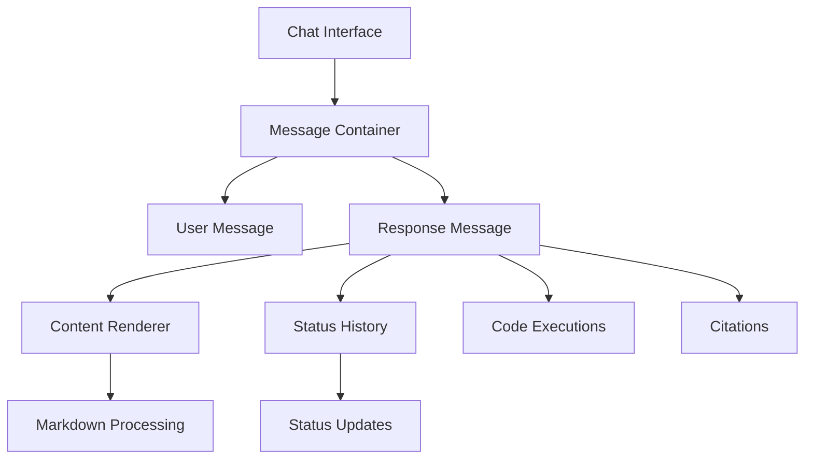
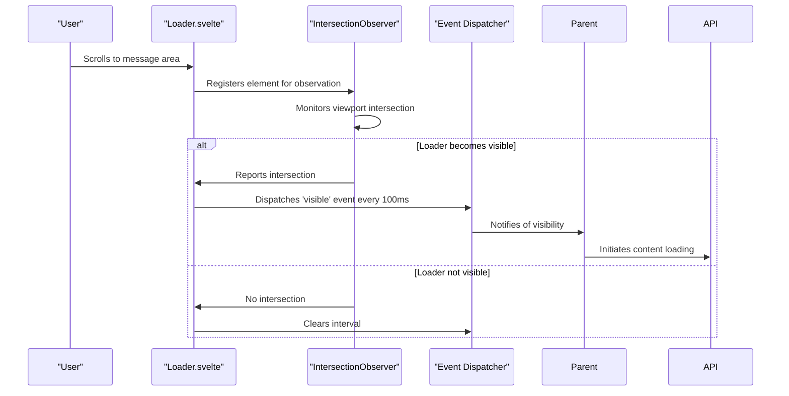
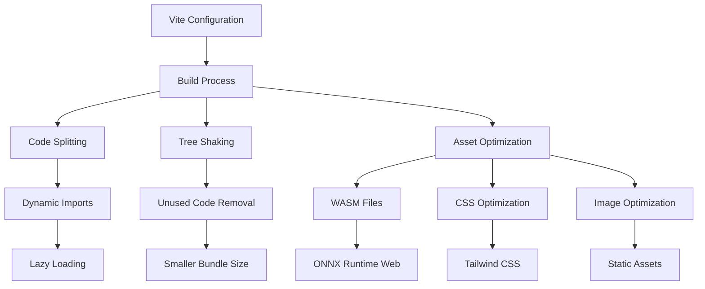
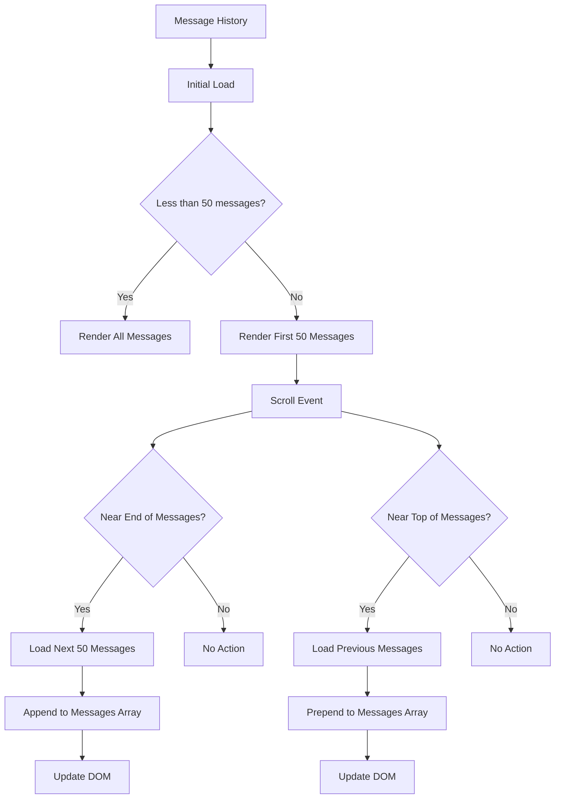
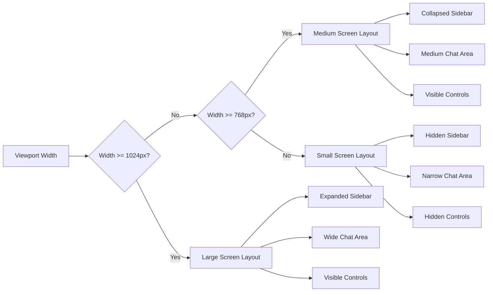

# Frontend Performance Optimization

<cite>
**Referenced Files in This Document**   
- [Loader.svelte](file://src/lib/components/common/Loader.svelte)
- [stores/index.ts](file://src/lib/stores/index.ts)
- [vite.config.ts](file://vite.config.ts)
- [ResponseMessage.svelte](file://src/lib/components/chat/Messages/ResponseMessage.svelte)
- [Message.svelte](file://src/lib/components/chat/Messages/Message.svelte)
- [Thread.svelte](file://src/lib/components/channel/Thread.svelte)
- [Channel.svelte](file://src/lib/components/channel/Channel.svelte)
</cite>

## Table of Contents
1. [Introduction](#introduction)
2. [Svelte Component Rendering Optimization](#svelte-component-rendering-optimization)
3. [Loader Component for Visual Feedback](#loader-component-for-visual-feedback)
4. [Asset Loading and Bundle Optimization with Vite](#asset-loading-and-bundle-optimization-with-vite)
5. [Efficient State Management with Svelte Stores](#efficient-state-management-with-svelte-stores)
6. [Handling Large Message Histories](#handling-large-message-histories)
7. [Responsive Design and Accessibility](#responsive-design-and-accessibility)
8. [Conclusion](#conclusion)

## Introduction
This document provides comprehensive guidance on frontend performance optimization in open-webui, focusing on key areas that impact user experience in AI chat applications. The optimization strategies cover Svelte component rendering, visual feedback mechanisms, asset loading, state management, and handling of large message histories. By implementing these best practices, developers can ensure smooth performance even in high-frequency update scenarios like chat message streaming, while maintaining responsive and accessible interfaces.

## Svelte Component Rendering Optimization
The open-webui application leverages Svelte's reactivity system to efficiently handle high-frequency updates during chat message streaming. The component architecture is designed to minimize unnecessary re-renders through strategic use of Svelte's reactive statements and selective state updates.

The chat interface components use a hierarchical structure where parent components manage the overall state while child components handle specific message rendering. This separation allows for targeted updates when new messages arrive or existing messages are modified. The `Message.svelte` component, for example, receives message data as props and only re-renders when its specific message content changes, rather than when the entire message history is updated.



**Diagram sources**
- [Message.svelte](file://src/lib/components/chat/Messages/Message.svelte)
- [ResponseMessage.svelte](file://src/lib/components/chat/Messages/ResponseMessage.svelte)

The implementation uses Svelte's reactive declarations (`$:` syntax) to create computed values that automatically update when their dependencies change. This approach ensures that expensive operations like content processing and formatting are only performed when necessary. Additionally, the use of keyed each blocks in message lists helps Svelte efficiently manage DOM updates by tracking each message by its unique ID.

**Section sources**
- [Message.svelte](file://src/lib/components/chat/Messages/Message.svelte)
- [ResponseMessage.svelte](file://src/lib/components/chat/Messages/ResponseMessage.svelte)

## Loader Component for Visual Feedback
The `Loader.svelte` component provides visual feedback during AI processing and content loading operations. This component implements an intersection observer pattern to detect when the loader element becomes visible in the viewport, triggering periodic events that can be used to initiate loading operations or update the UI state.



**Diagram sources**
- [Loader.svelte](file://src/lib/components/common/Loader.svelte)

The loader component uses an IntersectionObserver with a threshold of 10% visibility, meaning it triggers when at least 10% of the loader element is visible in the viewport. This approach optimizes performance by only initiating loading operations when content is likely to be viewed soon, reducing unnecessary network requests and processing. The component also properly cleans up observers and intervals when destroyed, preventing memory leaks.

The implementation includes lifecycle management through Svelte's `onMount` and `onDestroy` functions, ensuring that resources are properly allocated and released. When the component mounts, it sets up the intersection observer and attaches it to the loader element. When the component is destroyed, it disconnects the observer and clears any active intervals, maintaining good memory management practices.

**Section sources**
- [Loader.svelte](file://src/lib/components/common/Loader.svelte)

## Asset Loading and Bundle Optimization with Vite
The open-webui application uses Vite as its build tool, leveraging its capabilities for efficient asset loading and bundle optimization. The Vite configuration includes several performance-focused settings that enhance the application's loading speed and runtime performance.

The `vite.config.ts` file configures the build process with sourcemaps enabled for debugging purposes while also implementing tree-shaking and code splitting to minimize bundle size. The configuration uses the `viteStaticCopy` plugin to copy WASM files and other static assets to the output directory, ensuring they are available at runtime without requiring additional network requests.



**Diagram sources**
- [vite.config.ts](file://vite.config.ts)

The build configuration also includes environment-specific optimizations, such as removing console.log statements in production builds through the esbuild pure option. This reduces the final bundle size and improves performance by eliminating debug code from production deployments. The configuration defines environment variables like APP_VERSION and APP_BUILD_HASH, which can be used for cache busting and version tracking.

Vite's development server provides fast hot module replacement (HMR), enabling rapid development cycles without full page reloads. In production, the build process generates optimized assets with hashed filenames, facilitating effective browser caching while ensuring cache invalidation when content changes.

**Section sources**
- [vite.config.ts](file://vite.config.ts)

## Efficient State Management with Svelte Stores
The open-webui application implements a comprehensive state management system using Svelte stores, which provides efficient reactivity and centralized state management across the application. The stores are defined in `stores/index.ts` and cover various aspects of the application state, from user information to UI preferences and chat context.

The state management approach follows a pattern of writable stores for mutable state and derived stores for computed values. This separation ensures that state updates are predictable and that derived values are automatically updated when their dependencies change. The stores include application-level state like user information, chat context, and UI settings, as well as more specific states like audio queues and socket connections.

```mermaid
classDiagram
class Stores {
+WEBUI_NAME : Writable<string>
+WEBUI_VERSION : Writable<string>
+config : Writable<Config>
+user : Writable<SessionUser>
+socket : Writable<Socket>
+chatId : Writable<string>
+chats : Writable<Chat[]>
+models : Writable<Model[]>
+settings : Writable<Settings>
+showSidebar : Writable<boolean>
}
class MessageState {
+history : Writable<MessageHistory>
+messageId : Writable<string>
+selectedModels : Writable<string[]>
}
class UIState {
+showSettings : Writable<boolean>
+showShortcuts : Writable<boolean>
+showArchivedChats : Writable<boolean>
+theme : Writable<string>
+mobile : Writable<boolean>
}
Stores --> MessageState : "contains"
Stores --> UIState : "contains"
Stores --> "Socket Connection"
Stores --> "Audio Queue"
```

**Diagram sources**
- [stores/index.ts](file://src/lib/stores/index.ts)

The stores are designed to minimize unnecessary re-renders by only exposing the specific state values needed by each component. Components subscribe to only the stores they require, reducing the reactivity overhead. The implementation also includes type definitions for all store values, providing type safety and improving developer experience.

For performance-critical operations, the stores use Svelte's reactive assignments to ensure that updates are batched and processed efficiently. This approach prevents excessive re-renders when multiple state values are updated in quick succession. The stores also handle edge cases like null or undefined values, providing default values where appropriate to prevent runtime errors.

**Section sources**
- [stores/index.ts](file://src/lib/stores/index.ts)

## Handling Large Message Histories
The open-webui application implements several strategies to efficiently handle large message histories, particularly in the chat interface components. The architecture is designed to manage potentially thousands of messages without degrading performance or consuming excessive memory.

The message handling system uses a combination of virtualization techniques and selective rendering to maintain performance. When displaying message histories, the application only renders messages that are currently visible in the viewport, with additional messages loaded as the user scrolls. This approach, implemented in the `Thread.svelte` and `Channel.svelte` components, ensures that the DOM remains lightweight even with extensive chat histories.



**Diagram sources**
- [Thread.svelte](file://src/lib/components/channel/Thread.svelte)
- [Channel.svelte](file://src/lib/components/channel/Channel.svelte)

The message data structure is optimized for efficient updates and lookups. Each message has a unique ID and maintains references to its parent and child messages, enabling efficient navigation through conversation branches. The history object uses a map-like structure where messages are indexed by their IDs, allowing for O(1) lookups when updating or retrieving specific messages.

When new messages arrive during streaming, they are added to the message array using array spreading operations, which triggers Svelte's reactivity system to update the UI. The implementation uses keyed each blocks in the message list, helping Svelte efficiently manage DOM updates by tracking each message by its unique ID. This approach minimizes unnecessary DOM manipulations and ensures smooth animations when new content appears.

**Section sources**
- [Thread.svelte](file://src/lib/components/channel/Thread.svelte)
- [Channel.svelte](file://src/lib/components/channel/Channel.svelte)

## Responsive Design and Accessibility
The open-webui application implements responsive design principles to ensure optimal user experience across different device sizes and screen resolutions. The layout adapts to various viewport dimensions through a combination of CSS media queries and component-level responsiveness.

The responsive design system uses breakpoints to adjust the interface layout based on screen width. On larger screens, the application displays a multi-panel layout with sidebar navigation and expanded content areas. On smaller screens, the interface collapses into a more compact form, prioritizing the chat content and using drawer components for secondary navigation and settings.



**Diagram sources**
- [ChatControls.svelte](file://src/lib/components/chat/ChatControls.svelte)
- [NotePanel.svelte](file://src/lib/components/notes/NotePanel.svelte)

Accessibility considerations are integrated throughout the application, with semantic HTML elements, proper ARIA attributes, and keyboard navigation support. Interactive elements include appropriate focus states and tooltips, while text content maintains sufficient contrast ratios for readability. The application also supports screen readers through proper landmark roles and accessible labels.

Performance optimizations for responsive design include using ResizeObserver to efficiently detect container size changes without causing layout thrashing. The implementation also uses CSS containment where appropriate to limit the scope of style and layout calculations, improving rendering performance on complex pages.

**Section sources**
- [ChatControls.svelte](file://src/lib/components/chat/ChatControls.svelte)
- [NotePanel.svelte](file://src/lib/components/notes/NotePanel.svelte)

## Conclusion
The open-webui application demonstrates effective frontend performance optimization through its implementation of Svelte component rendering, visual feedback mechanisms, asset loading strategies, state management, and handling of large message histories. By leveraging Svelte's reactivity system and Vite's build optimizations, the application maintains responsive performance even in high-frequency update scenarios like chat message streaming.

Key optimization strategies include the use of intersection observers for lazy loading, efficient state management with Svelte stores, and virtualization techniques for handling large message histories. The responsive design system ensures optimal user experience across different device sizes while maintaining accessibility standards.

These performance optimizations collectively contribute to a smooth and responsive user experience, enabling the application to handle complex AI chat interactions efficiently. By following these best practices, developers can ensure that the application remains performant and scalable as new features are added and user demands evolve.